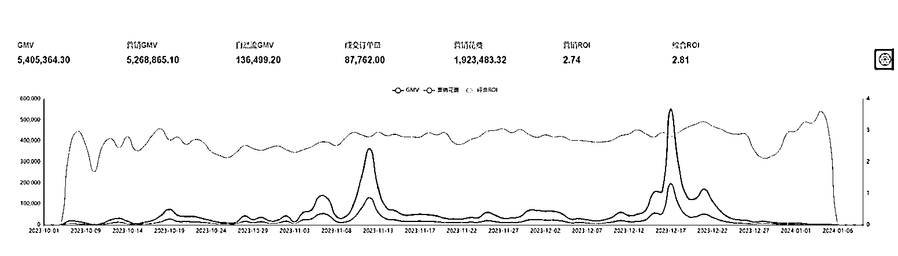
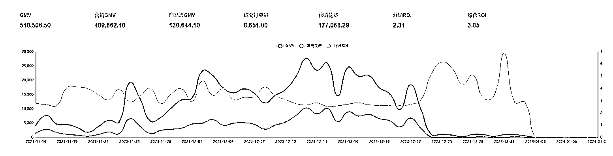
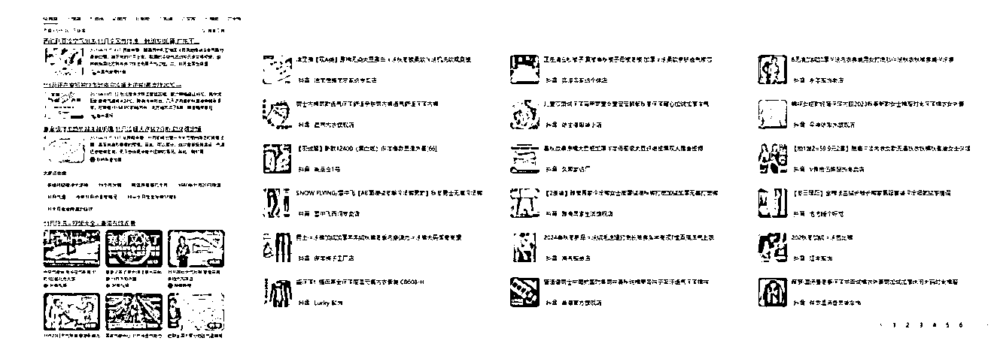
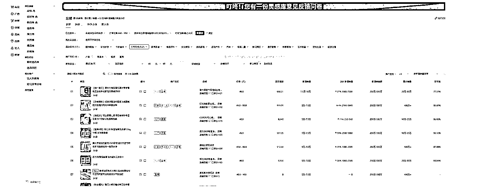
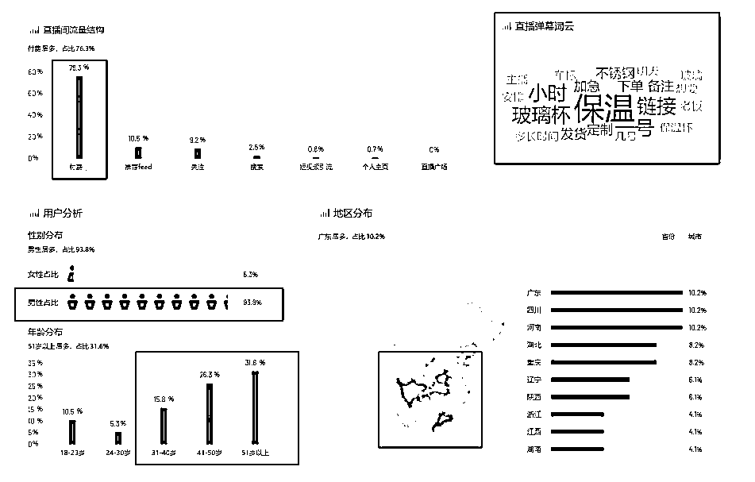
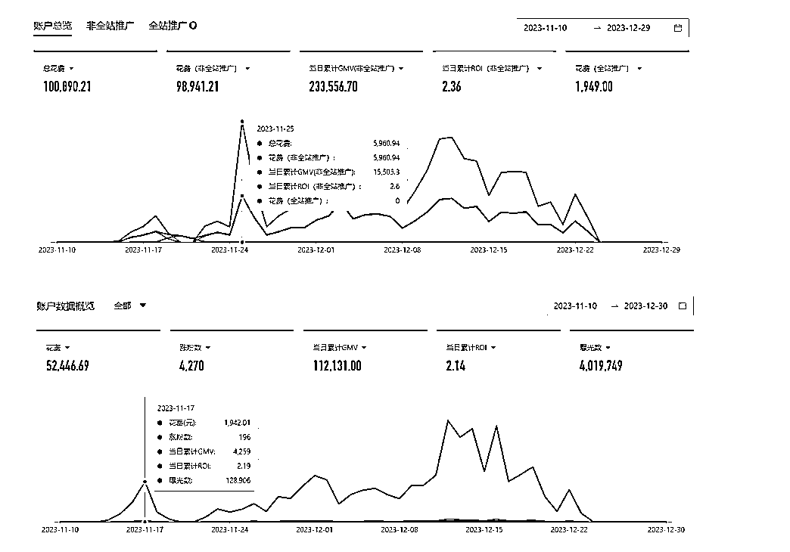
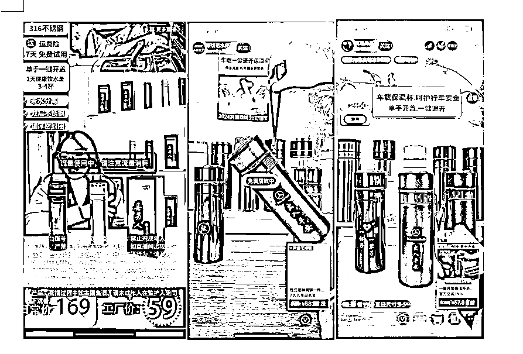
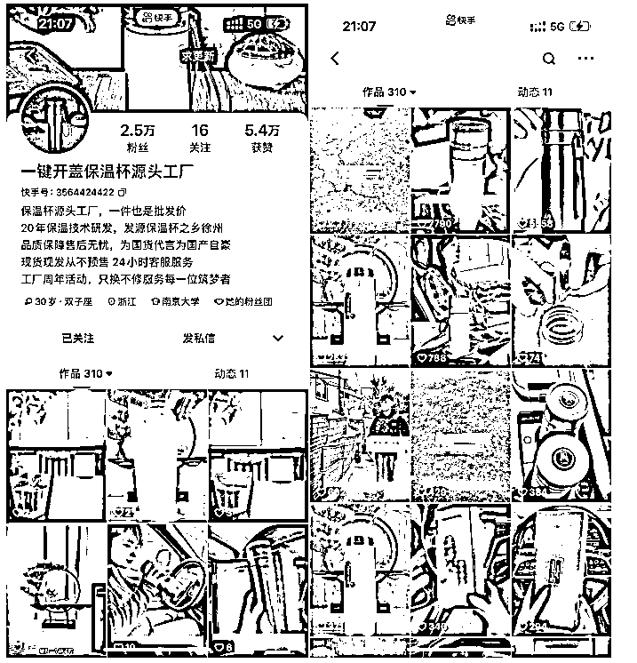
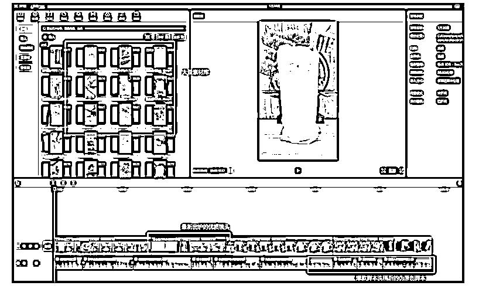

# 保温杯 40 天 15w 净利润从选品到测品起量整体复盘报告

> 原文：[`www.yuque.com/for_lazy/thfiu8/slmyzgb1ee1f8ak2`](https://www.yuque.com/for_lazy/thfiu8/slmyzgb1ee1f8ak2)

## (53 赞)保温杯 40 天 15w 净利润从选品到测品起量整体复盘报告

作者： 书豪

日期：2024-03-11

大家好，我是一直在努力提升利润的龙珠圈友书豪，也是小红书店铺和直播航海教练。

**2024，开年后，每个电商创业者，每天的日常，大都是选品、测品两件事。**

**当然也在这当中遇到了很多问题，主要集中在**选品**、**测品**以及**稳量**三个方面！**

**很多关系不错的朋友都知道 2023 年第四季度我打了一个单品【保温杯】**

**其实我们也有一个另外一个品【加绒棉裤】迎来爆发，这两个品各有特征单独拆分复盘都是一篇长文。**

****

**【加绒棉裤单品单店数据：数据来源公司内部技术搭建的测算系统】**

**我们今天先聊聊保温杯，它没有大爆发的量，高净利的关键更多集中在了选品、测品上，希望可以帮助目前选品、测品上遇到困惑的同学。**

****

**【一键开盖保温杯单品单店数据：数据来源公司内部技术搭建的测算系统】**

**大家需要知道一个大前提：**短引直播间打法能不能盈利取决于测品效率****

**测品效率包括了测品完成率和测品速度，在确保整体链路没问题的情况下再去提高效率测品速度，这样可以保证在花费最少时间最短的情况下【我们自己是 400，4 天】快速测试产品是否可盈利可稳定盈利。**

**选品方法相信各人有各法，今天不在这里赘述太多，只聊保温杯这个品我是用什么方法找到的，我们的选品方法有 5 种**

****选品也要定方向****

**快手上的选品更多需要考虑他的人群【集中在 30 岁以上的小镇人口】，所以之前做过这类人群产品的打品团队在找品上会更有感觉；**

**找品这个事情核心以数据为导向，同时也需要主观上的判断和思考，你需要带着方向去找品，如果自己脑子里也没有一个思路，那你找的品自己没有信心越打心里越发虚。**

**保温杯是在 11 月开始的选品，深秋季节即将迎来大降温，保暖相关的产品不用想都知道一定大爆发，在知道大致的选品方向后我们在看榜单做筛选的时候会更明确，同时在判断上也会更有底气。**

****

**我们这里运用的工具就是有米有数，带着目的看有米有数的榜单去筛选产品，有米有数和考古加在榜单上没有差异但是在具体细节数据上会各有侧重，所以这里不用纠结是用哪一个，选品的时候买个周卡直接两个都买也就几十块。**

****选品筛品****

****要做到几个步骤，就是粗筛、精筛和认证筛；****

**选品粗筛：**

**直接从总榜上进行筛品，这里我们需要这几个设置，**

**第一单品价格在 40~10 元；**

**第二月度销售额 30~300 万之间；**

**第三按照选品指数排序；**

**第四如果有特定想打的品类可选择；**

****

**第一个条件：可以设置 30~100，低了会影响投放效率，高了会带来大量退货，我们自己的经验 40~60 这个区间带产品最舒服；**

**第二个条件：不参与爆品的竞争，超过一定销售量级的产品势必会有品牌、达人和资本打品团队介入，利润稀薄的同时测品难度指合级增长；**

**第三个条件：选品指数排名后更利于在前期找到近期起量产品；**

**第四个条件：指定品类是根据各自经验【内容制作、品类人群了解、投放经验、供应链经验】进行判断；**

**按照刚刚说的四个条件设置后，其实我能选择的品只有 200 个，如果在这里我只要把我刚刚说的选品大方向沾边的品筛出来就可以了，不要翻到了前四页就不看了觉得已经筛出了十几个差不多了，切记选品这个事情要做就做好做完善；**

**筛选标准：不符合选品大方向不要、大品牌不要；**

**选品精筛：**

**差不多在粗筛能找到至少十几个产品，这里只需要记住一个点【利润低于 50%不打】，利润率低于 50%意味着这个品类的竞争相当白热化，而且价格对于用户来说趋于透明化，所以不适合短引这套模式，这里基本上还能剩个四五个；**

**选品认证筛：**

**根据目前剩下的四五个产品，看三个维度【可剪辑素材不低于 200 个，短引模式被认证，快手竞争对手少或缺乏强力竞争对手】，基本上这三个点筛下去之后能剩下两个可打的品就不错了【一个都没有也正常，那就换品类继续找】；**

****

****三个维度三个背后底层逻辑****

****可剪辑素材不少于个 200**：短引模式核心需要借助短视频引流到直播间，内容好坏直接影响测品成功率和跑量规模速度，少量可剪辑素材不支持短引模式长期稳定的优质内容输出；**

****短引模式被认证**：看是否有爆款视频且直播间短引付费占比 60%；只有在其他平台被认证过的产品拿到快手上成功率才会更大；**

****快手竞争对手少且缺乏强力竞争对手**：涉及当产品整体体量不大的时候，一旦对手提前介入会造成抢量【这里单指短引团队】，脚本相同情况下同一拨人群流量系统会优先供给销量及模型稳定的商家。**

****直播前准备工作****

**当确定一个产品后，接下来的准备工作集中在供应链沟通、快手小店上品并设置、直播间直播素材准备、短视频制作内容准备。**

**这里的步骤都必须要在一天甚至半天内做完，选品团队在选品测品期间只有做到提高效率完善细节，才能在确保万无一失的情况下对产品进行取舍。**

**供应链沟通：价格沟通、发货地沟通、店管家绑定、售后服务确认**

**快手小店商品设置：上品、售后设置**

**直播间素材准备：选取并评估直播间内容【懂得都懂】、直播软件设置**

**短视频制作内容准备：爆款脚本找寻、短视频素材下载、短视频剪辑**

**短引直播间在直播前期需要准备的东西很多，每个小伙伴都要将整体直播链路进行反复推敲，确保无任何漏洞，然后基于当前直播效果再去优化调整直播间。**

****测品复盘****

**如果说直播前的准备工作较为繁琐，那测品过程就是一次又一次的复盘，对直播间复盘，对投放复盘，对内容复盘。**

**直播间复盘：检查直播是否正常、有无负向、用户体验换位思考**

**投放复盘：投放出价是否稳定、投放是否有空耗、投放时段影响、人群画像定向**

**测品时间一般是 4 天，这里其实说的是四天做判断，我们一般以两个维度为主，第一是盈利，投产打正我们就会慢慢放视频拉动量级；第二是素材爆发，有一条素材跑的特别好互动点赞都不错，那我们就会继续测试；**

**测品需要反复不断的复盘，当每天复盘之后的出来的结论是比前一天数据表现好，整个团队也会越来越稳越有韧性；**

**保温杯投放端口的起量历时 11 天，在前期 4 天的趋势较好且已开始盈利，所以我们就开始不断优化内容，给潜力爆款视频机会，那这里其实投放更多是一种工具，真正带来质变的是内容。**

****

**【保温杯投放端口移动及 PC 两个户的流量变化】**

****如何在测品期间做好内容？****

**短引直播间的内容分为两点：直播间内容、短视频内容**

**在打保温杯这个品的时候我们找了很多直播间，看了很多直播间的主播话术选择了其中气质、氛围、话术逻辑最好的；这其中也需要不断去复盘纠正。**

****

**【该品直播间多为手播，影响转化效果】**

**这两天很多快手官方的直客及运营来公司建联沟通业务，我们最大的感触就是当聊到目前最牛的品牌、最牛的带货达人、最牛的打品团队时不约而同都在短视频内容下了硬功夫**

**牛逼的主播是真的可遇不可求，人的问题是世界上最难解决的事情，尤其是个人或者小团队，但素材内容不是。**

**短视频内容是整个电商未来想要壮大的趋势，做好内容从抖音已开始向其他平台扩散，这里也不要恐慌，觉得自己没有脚本能力、拍摄能力，也没有那么多时间去做出优质原创内容。**

**只有体量到了一定层级才会考虑原创优质内容，现在优质二创还有一定空间。**

****

**【保温杯爆款视频展示】**

**目前市场主流仍是以二创为主，即便是一些大品牌也不具备持续性大批量的制作原创内容的能力，因为成本是生意绕不开的死穴。**

**大家不相信的话，随便说个品然后去抖音、快手上搜索看看二创混剪视频是不是特别多的爆款，为什么会这样呢？**

**核心原因大爆款视频是一门玄学，素材本身就是有寿命的。**

**当原创爆火一段时间之后，商家就会通过模仿爆款视频不断去混剪镜头，以图更少成本去创造更多爆款，延续销量。**

**另外平台的审核也很难界定原创还是伪原创，唯一的指标就是脚本和镜头；**

****

**保温杯的爆款视频制作主要以抄爆款脚本，用伪原创镜头混剪后，爆发出来的伪原创作品。**

****短引领域下，短视频内容=镜头+脚本****

**优质二创内容如何去“洗稿”？就是将爆款脚本进行吸纳后对音频文案换个说法，然后将视频中的每一句文案做到字画对应，同时整体检查浏览一遍站在用户角度思考，看到这篇文章你愿意看几秒，愿意点击直播间吗？有说到你心坎里吗？**

**如果说服不了自己，就千万不要“就这样吧”、“随便吧”这种敷衍态度，花的是自己的钱糊弄的是自己，测品这个事情很严肃，而内容是产品能不能起来的核心因素。**

**内容做得好，是真的可以撬动免费流量进入，保温杯这个品打了 40 天卖了 50 多万，其中五分之一接近 20%的自然流，这也是这个品在 15 万净利润的原因。**

**15 万净利润主要是这几个因素：1、产品利润 66%；2、综合投产 3.2 左右；3、退货率 10%不到；**

**所以整体综合净利润占 GMV 的 25%左右，这里我们只有一个运营【注明运营不单负责一个品，除投放外每天需要剪辑 30 条素材】**

**希望这篇分享对大家有帮助，2024 年希望大家不论是自然流还是付费流都能打爆多个单品，能够付费通投拉满拿到高 ROI！**

**（我目前主要在做小红书、快手这两个平台，基本所有平台短视频内容的核心逻辑都是想通的，没有特别大的差异，希望这次的分享能够对大家有帮助，如果对上述分享有疑问的，也欢迎跟大家多多交流，探讨，定当知无不言，我的微信：wsh137552775）**

* * *

**评论区：**

**初之画 : 抖音家居销量排行榜中也有看到保温杯
大屋顶(Peter) : 感谢**

****

* * *