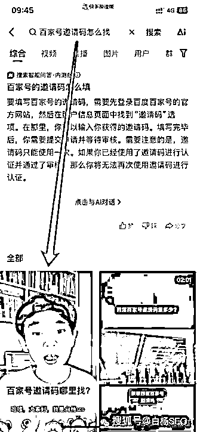
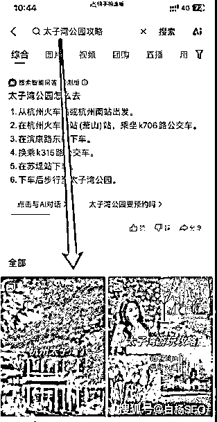
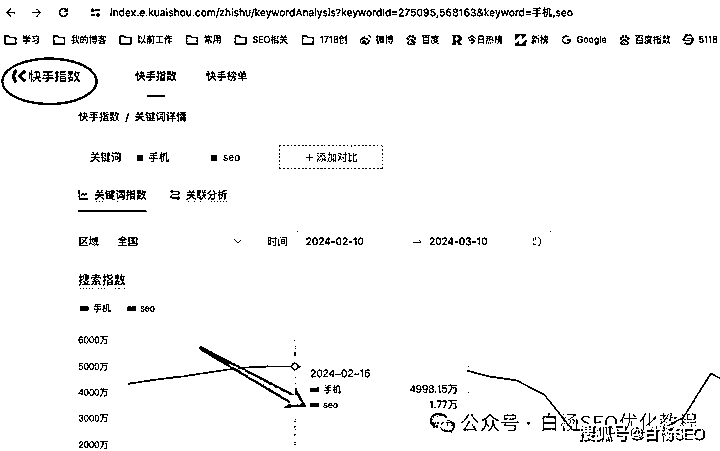
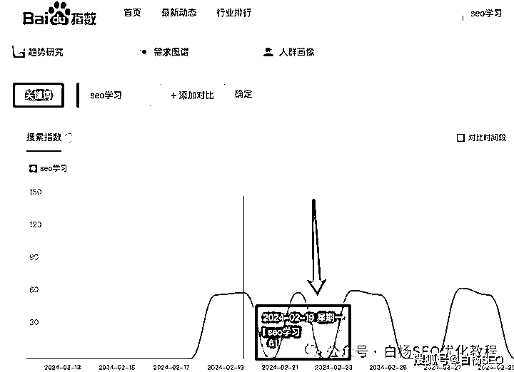
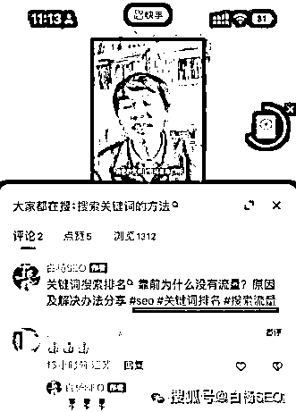
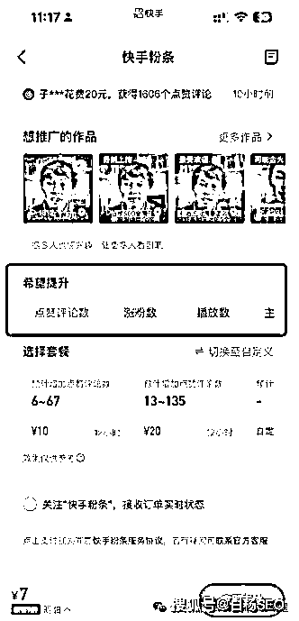

# 快手搜索流量怎么做？快手关键词搜索排名规则及 SEO 玩法分享

> 原文：[`www.yuque.com/for_lazy/thfiu8/gl95wbqwuqqyc1mo`](https://www.yuque.com/for_lazy/thfiu8/gl95wbqwuqqyc1mo)

## (25 赞)快手搜索流量怎么做？快手关键词搜索排名规则及 SEO 玩法分享

作者： 白杨 SEO

日期：2024-03-12

先说下快手 SEO 是什么？

快手 SEO 就是指在快手 APP 上做用户关键词搜索快手短视频或者账号排名优化。

关于快手这个平台的流量玩法今天是第一次写！上一次在文章中提到快手二字还是白杨 SEO 建议公司推广要去做各平台的企业蓝 V 认证哈。

大家知道白杨 SEO 一直在分享各平台 SEO 相关技术和实战，从百度到淘宝，再到微信、抖音、小红书等，已写过很多。今天来分享下快手这个平台的搜索流量，希望对大家有启发或帮助。

**做快手 SEO 的意义是什么？**

快手诞生于 2011 年 3 月，2012 年 11 月转型为短视频社区，是国内最早的短视频平台！虽然没有抖音、视频号这样风头正盛，但依旧在短视频平台有一席之地！

快手日活近 4 亿，月活近 7 亿（日活指每天打开一次，月活指每个月打开一次就算），从流量角度来看，快手平台上也有很大的流量。

就拿同比来说，除了微信，抖音，视频号，还有几个平台日活这么大，不要说淘宝，支付宝，甚至百度 APP 什么的日活大。因为他们的用户日均停留时长肯定没有快手高。

记住，我们做 SEO 流量行业有一句话叫做，用户在哪里，我们就去哪里搞流量。用户停留在哪里，哪里就有机会！这就是做快手 SEO 的意义！

当然，白杨 SEO 这里并没有说，你做了快手 SEO 就不做其它平台 SEO 了哈，选择适合自己就好。如果精力可以，这个平台也是值得做一做的。

**快手 SEO 搜索排名基本规则**

快手 SEO 搜索排名基本规则有以下五点：

1、短视频内容质量与相关性

快手会评估你发布的视频的内容质量（含封面）、原创性以及与搜索关键词的相关性。一般高质量、原创且与搜索词紧密相关的视频更有可能获得更高的排名。

2、话题标签与关键词命中率

你在发布视频时要合理地使用标签和关键词可以让快手更好地识别你的视频内容，从而提高搜索排名。命中率指关键词相关程度，比如用户搜 SEO 怎么学，你关键词就是 SEO 怎么学，这就是 100%命中！

但需要注意的是，如果过度使用或滥用标签和关键词可能会被视为作弊行为，也可能导致视频排名下降甚至被处罚。

3、账号权重与活跃度

快手会考虑发布视频的这个账号本身权重和活跃度。权重较高的账号（如粉丝数量多、活跃度高的账号）发布的视频更有可能获得更好的排名。

4、用户行为及互动

用户的互动行为，比如点赞、评论、分享和观看时长等，都会被快手视为内容受欢迎程度的指标。一般高互动度的视频通常会得到更高的搜索排名。

5、区域性与时效性

对于某些具有地区域性和时效性的搜索词，快手可能会根据用户所在的地理位置和当前时间来调整搜索结果。

比如，白杨 SEO 搜索杭州本地新闻或活动时，通常会优先展示与我所在区域相关的内容。

补充：快手 SEO 搜索排名规则并非一成不变的，快手会根据用户反馈、平台发展等因素不断优化和调整算法。所以想要获得更好的搜索排名，需要不断关注平台动态，了解最新的优化策略才能做好快手 SEO！

**快手 SEO 优化具体怎么做？**

1、关键词选择

选择好关键词，是做好快手 SEO 最重要的一点！我们选的这个关键词尽量要是用户搜索需求的词，同时还要有搜索量。

比如我要分享 SEO 学习这个视频，可以先用快手指数看下这个词流量，如果快手指数没有，可以用百度指数看下，只要有就可以用。

再然后用这个关键词去看快手上的下拉词推荐，那么我就找到了关键词和短视频拍摄主题了是不是？这样的关键词跟内容一定是相关的！

2、短视频标题及封面优化

快手短视频那个标题很重要，标题里一定要包含关键词，比如你的标题是“推荐几个 SEO 学习网站”，就包含 SEO 学习这个关键词。

封面优化也很重要，很多人默认就是视频第一个，不对的，视频封面一定要与你分享主题关键词相关，尽量优化好一点。比如我的，虽然不好，可参考，如图。

3、短视频说明描述优化

短视频说明描述优化，这里是指你要总结你短视频主要内容，这样方便快手尽快抓取主要内容。如果你的说明描述优化里也包含了关键词的长尾关键词，比如“白杨 SEO 博客这个 SEO 学习网站”，那么也会有助于排名哈。

4、短视频标签标注

短视频标签标注，这个很简单，就是你在发布视频的时候选的标签也尽量与你想要优化的关键词相关，这样不仅增加你的关键词命中率，而且还可增加了关键词的密度（注意不要过度），有助于排名哈。

如白杨 SEO 实战案例截图，

5、短视频用户数据优化

这个只要做过推广的人，都懂我说的是什么意思。正如上面快手 SEO 基本搜索规则第四点用户行为及数据那里有说。

白杨 SEO 再简单说一下，比如搜索点击，评论互动，点赞，分享这些都是可以来操作的，一种是用技术，一种是直接投放快手粉条也可以做这些数据，如图。

然后来达到 SEO 效果，这就是付费与 SEO 结合。当然，白杨 SEO 没有投过，如果投了，也就不是你看到这么点数据了。我想要的就是真实，自然流量，哈哈哈。

**如何更好用短视频在快手上搞来精准搜索流量？**

如何更好用短视频在快手上搞来精准搜索流量呢？其实这里有一个真正最核心最核心的东西，那就是你的视频内容对用户一定要有价值！因为只有你的内容对用户有价值，用户才可能真正来找你！

哪怕你的拍摄技术不是很好，你视频出镜不是很自然，甚至还有错别字。你也不是帅哥美女，但你如果是做知识类的视频就要分享一些东西。

如果你是做带货类视频，那么这个货的优点亮点你就要讲清楚，切记视频内容与关键词无关（包括里面图片什么的等）所以最后，做好快手 SEO 除了了解快手 SEO 基础那些，重要的就是这个内容。如果你做不了视频内容，那么怎么做好快手流量呢？

白杨 SEO 也需要继续慢慢优化自己的内容，在快手上目前做得也不算好，今天的分享，希望对你有些帮助。

**作者介绍：**

白杨 SEO，专注 SEO 十年，全网 SEO 流量实战派，对互联网精准流量有深入研究。

**相关推荐：**

[白杨 SEO：公众号流量从哪里来？公众号搜索与推荐算法解密【干货】](http://mp.weixin.qq.com/s?__biz=MzU2NTQzMzA4Nw==&mid=2247498948&idx=1&sn=8bcbb33187c7891da8f68f21fc7f788c&chksm=fcb97b54cbcef242105e87bf4761c33ab664b79be8a5ae456fb66c71957cec043e0a084ade68&scene=21#wechat_redirect)

[白杨 SEO：抖音 SEO 是什么？揭秘抖音搜索算法工作原理和推荐算法](http://mp.weixin.qq.com/s?__biz=MzU2NTQzMzA4Nw==&mid=2247487236&idx=1&sn=522738747e7611df6b12aa725f7fd99a&chksm=fcba8894cbcd0182c21e7e15c7d5d3e2ab08e5de8975d7f64c72fbe86ea15b24ca4f581b40d3&scene=21#wechat_redirect)

[白杨 SEO：视频号 SEO 是什么？怎么做关键词排名和视频号推广？【必看】](http://mp.weixin.qq.com/s?__biz=MzU2NTQzMzA4Nw==&mid=2247493540&idx=1&sn=6626369c7a895e557783967d99b3dfe9&chksm=fcb96034cbcee922378e2fd2e1b6a2a9aa06f1affef44b805dc4aaea4e0d3bc07335543434c6&scene=21#wechat_redirect)

[白杨 SEO：旅游行业小红书引流怎么做？免费 SEO 手段+付费投放结合](http://mp.weixin.qq.com/s?__biz=MzU2NTQzMzA4Nw==&mid=2247498923&idx=1&sn=3eead2227985241ce4b52d1f049293c7&chksm=fcb97b3bcbcef22dd01562261a287e201ba22026eee28ea62a5bffda5f7a690006d3f6c7a29b&scene=21#wechat_redirect)

* * *

评论区：

暂无评论

* * *