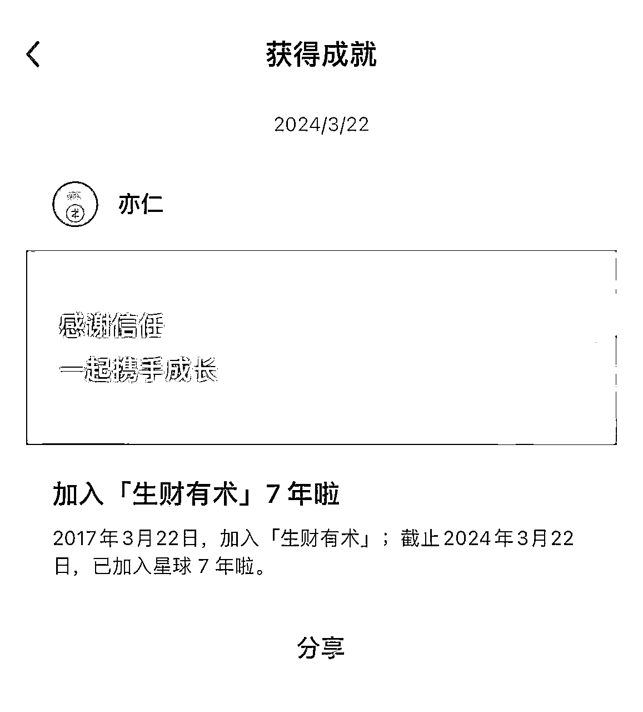
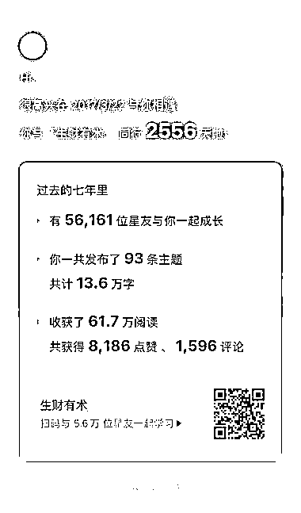

# 写作和赚钱的 4 个关系！看完你一定会忍不住想开始写

> 原文：[`www.yuque.com/for_lazy/thfiu8/ahwr708zsfs0d11c`](https://www.yuque.com/for_lazy/thfiu8/ahwr708zsfs0d11c)

## (精华帖)(222 赞)写作和赚钱的 4 个关系！看完你一定会忍不住想开始写

作者： 明白（晚 9 点半睡觉）

日期：2024-03-22

《详解：写作和赚钱的 4 个关系！看完你一定会忍不住想开始写！》

各位圈友好，我是明白，生财有术 7 期老圈友，星球编号 20。

今天是 3 月 22 日，等会晚上要去参加生财见面会的嘉宾晚宴，刚刚知识星球给我推送了一个消息，原来今天是我加入生财有术 7 周年。

李笑来老师说，7 年就是一辈子，今天还挺有纪念意义的哈哈。

回到正题 ——

可能大部分圈友对我的第一个印象是：晚 9 点半睡觉。

第二印象是：一直在日更公众号，今天是第 1339 天。

我最近才发现，虽然我在写作方面有很多实战经验，也拿到了一些结果。但我在星球的 24 篇精华，竟然没有一篇是关于写作的，这多少有点不合理！

所以，今天我想要从一个 99% 的人都很少关注的视角，来分享一点，我对于「写作和赚钱之间的关系」的思考。

相信看完你会对写作这件事，有不一样的认识。

详情可以看飞书：[`pznme756ly.feishu.cn/docx/JYQPdG2MKorfANxbnsqcfBPLn9b`](https://pznme756ly.feishu.cn/docx/JYQPdG2MKorfANxbnsqcfBPLn9b)

* * *

评论区：

根源 : 明白老師出手，這内容肯定不简单。
妙环 : 正在考虑这个问题，太及时了！！
乃鑫 : 明白老师如写作路上的引路明灯，照着那些也想一步一步向前的人。
帅彬（蟹老板） : 7 年就是一辈子
六和 : 明白老师日更一千多天啦
小椰 : 日更 1339 天，篇篇精品，只想说明白老师太了不起了！
花儿笑了 : 明白老师出品，必属精品
刘同学 : 明白老师太强了

* * *