# 电商选品 10 倍思维，从过万利润单品到百万利润单品修行

> 原文：[`www.yuque.com/for_lazy/thfiu8/kp01lm1e19au0bvo`](https://www.yuque.com/for_lazy/thfiu8/kp01lm1e19au0bvo)

## (102 赞)电商选品 10 倍思维，从过万利润单品到百万利润单品修行

作者： 书豪

日期：2024-03-18

大家好，我是一直在努力提升利润的龙珠圈友书豪，也是小红书店铺和直播航海教练。

2024 年，当然，很想挑战一下年入 300 万。也意味着至少需要打出 3 个百万利润以上的单品。其他的小品用来维持公司的办公开支+人力成本。

慌神之间做快手付费投流无人直播拿到 200 万+利润了~

踩过坑爆过量爆发过也沉寂过，所幸分别在百货、小家电、服饰、等类目下拿到了结果，也有了沉淀。

打过过万利润的单品，也打过几十万利润的单品，当然，年前也打过一个百万+利润的单品。

咱们生财很多圈友都在做电商，想必不管是自然流还是付费流，都渴望一个百万利润的单品改变现金储备。

电商选品，也有一个 10 倍思维，从过万利润单品到百万利润单品是一条漫长的修行之路。

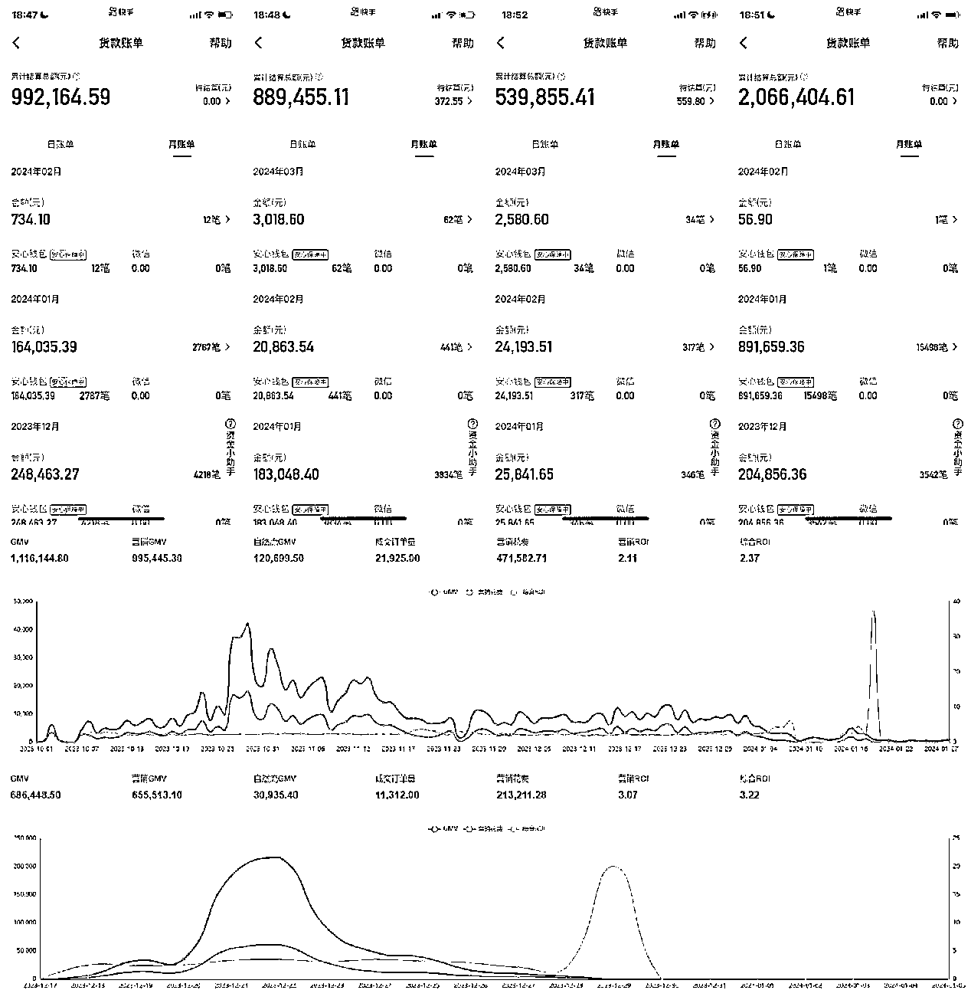

今天由书豪跟大家分享一下我们的内部选品方法，主要分为四个模块

这里的选品主要以快手内容电商展开，其他平台也可套用。

**第一部分：选品认知及思考**

电商底层逻辑：电商底层逻辑

选品视角：从消费者到解决需求的人

**第二部分：选品前提及思路**

第一层：快手人群特点

第二层：学会用第三方平台找品筛品

第三层：根据需求定向开品及跟品

**第三部分：选品建议及心态思考**

**第一部分：选品认知及思考**

大部分人在快手打品测品，但要么没爆量要么胎死腹中？

为什么你做电商的前 3 个月赚不到钱？

核心是选品，选品的背后是人群。

人群的背后，我认为有三个至关重要的因素。

第一个是地域，比如快手是三四五线城市的地域分布。

第二个年龄，快手的用户画像大部分都是 40 岁+的年龄段

第三个是收入，快手的真实的消费者，是三四五线城市月薪 3000 的人。

**阿姨们在快手刷视频是来放松心情，打发时间的，请问你想让阿姨买你的产品，你不可能依靠直播直投广告的形式直接灌入阿姨的手机 APP 快手页面，并期待阿姨会直接下单。**

**所以，在选品层面，需要把关**

**第一个大的战略方向，通过短视频引流直播间这种种草打法去卖货。**

**重点去关注第三方平台年龄段 40 岁+，地域分布 3+4+5 线城市的低收入人群且是通过直播带货中短视频引流直播间卖货的这种爆品去抄品跟品。**

**第二个大的战略方向，有暴力种草类型的短视频类型的直播间爆品。**

作为普通卖家，我们想在快手平台存活，想在快手平台赚到大钱。

要理解，选品层面需要有暴力种草类型的短视频素材，因为巧妇难为无米之炊，比如说，你在快手卖女鞋，这就是一个很失败的选择。

女鞋在内容端有 TM 任何的卖点可视化效果吗？除非你卷低价，但卷低价就没有任何利润可言。

快手是单排瀑布流模式，用户通过几秒钟就会决定要不要继续看下去。

随着改版快手的单瀑布流模式，快手进一步强化了完播三秒五秒的重要性，用户如果在几秒钟内对你的内容不感兴趣就会快速略过。

正常你在任意一个平台都已经养成了快速浏览快速刺激兴趣度的习惯，这是碎片化时代带来的时代通病，是人就有软肋是人就有喜好，

所以我们要做的就是不顾一切通过吸人眼球的前置内容【包括画面、声音】来让用户做到对视频产生兴趣。

小红书的封面、抖音的爆款三秒，快手同样脱离不了“装饰门面”的内容魔咒。

而短视频引流直播间，对于“爆款前置内容”的依赖更加夸张。

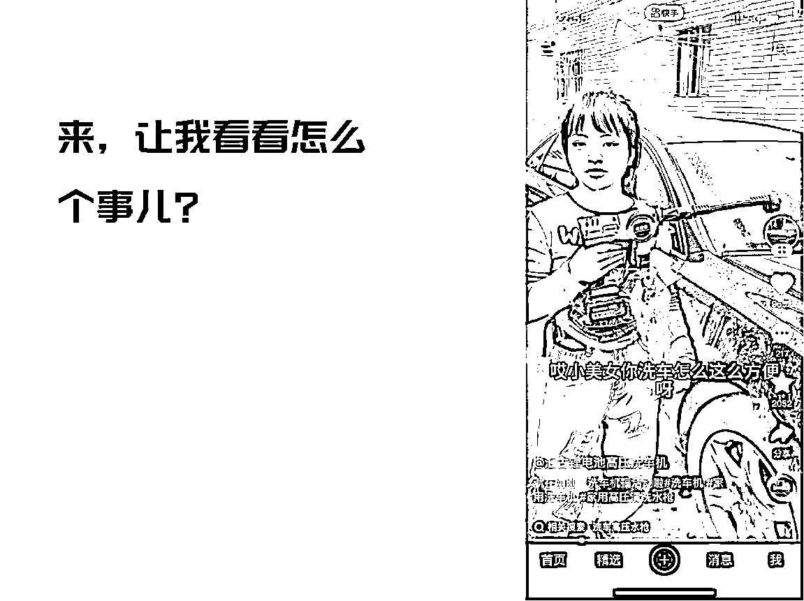

**03 用户抱着看八卦猎奇或者看热闹的心态继续看下去，听听故事、看看产品、看看价格**

用户在这么多年的教育下，已经不太抗拒广告了，所以正常一个人在看到这种产品介绍的，只要别太生硬或者无趣，都会再耐心看十秒，了解一下产品卖点、适合什么样的人群、有什么活动。

用户对于视频内容的开放度已经足够高了，所以在广告或者产品进入的时候不会太抗拒，当某一个**点**击中用户内心时，那用户进入直播间的效率就会瞬间提升。

所以我们从这里能看出来，什么是人货场？

人就是指的用户需求，用户喜欢什么 / 想要什么 / 有什么问题没有得到解决；

货就是你的产品，产品能解决哪些需求 / 哪些核心差异化优势 / 产品本身的质感；

场就是内容【视频及直播间内容】，在什么场景下成交 / 如何建立信任关系 / 如何达成双向链接

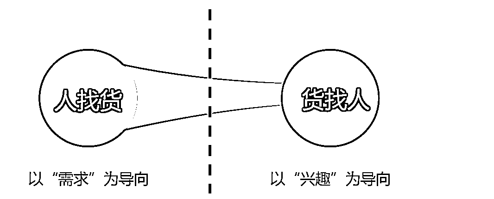

不论是选品还是测品，甚至稳住量的时候，都需要考虑这人货场三个点。

**在售卖具体产品的时候，消费者（人）会因为产品有不同的人群特征【或需求点】**

比如说买老花镜的人大概率是中老年人，上了年纪，买折叠老花镜的人大概率是喜欢随身携带图方便省事的人，买防蓝光折叠老花镜的人应该是经常玩手机看书看报的图省事方便的中老年人。

你会发现，当你产品发生变化时，你的人群画像也会出现明显的变化，而卖点越突出或者人群需求越突出，反而更容易找到双方达成一致的需求默契。

**当产品及相应卖点明确时，【人】更加的具象化特征化**

什么产品好卖，一定是有明显差异化卖点或突出卖点的产品更好卖，

如果你今天卖一只口红，色号虽然齐全你觉得你巴拉巴拉直播间讲个不停，用户会下单吗？你只会觉得是女性有需求。

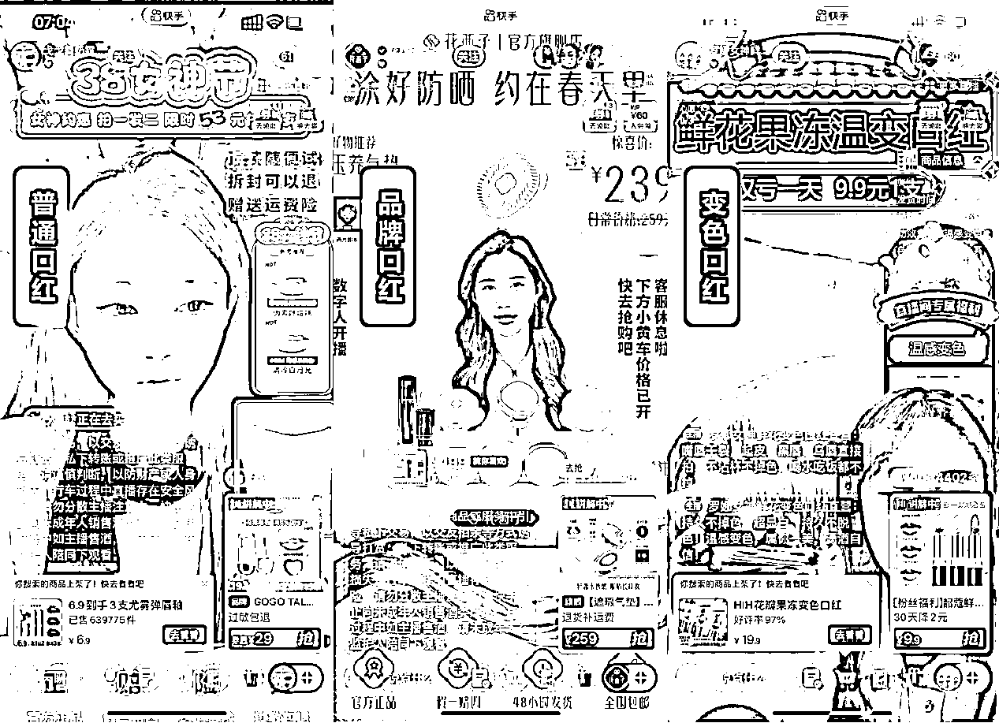

但如果今天你卖的口红是满足中老年嘴唇质感、唇炎也能适配、润唇的口红，你是不是从直播话术到段视频内容产出，再到客服沟通上都顺了，你知道了什么人会买，这群人什么特征，是不是你在解决人别人需求的同时，有赚到钱了。

这也就衍生出来一个概念，选品选品不是为了赚钱，而是在解决人们的需求

做一件事情，发心要正，当你抱着为大家做好服务为大家解决问题的目的去做，自然而然就建立了信任感解决了沟通链路，也自然而然就形成了场。

这就是不同的【人】，不同的【货】，你要用不同的【场】去做成交。

**1.2 选品视角-从消费者到解决需求的人**

电商第一剑先斩过去，重塑自己的市场定位

要从**消费者（花钱的人）转变为解决需求的人（赚钱的人）**，解决别人需求才会赚到钱。

所以要丢掉曾经的我以为、我觉得、我喜欢这种选品思维从脑子中清除干净

不是主观想法不重要，而是你要站在对方角度去思考需求：

要从我觉得这个品很漂亮，转变为我发现这个品很受 XX 人群喜爱

要从我喜欢这个品的功能，转变为我意识到这个品可以解决 XX 人群的需求

在潜移默化下，习惯性的以我为中心思考会转变为以他人需求为导向的选品思维。

想在电商平台或者内容电商平台赚到钱，现在要格外注意的是：

**消费者喜欢什么？数据说什么品比价好？同行都在跟什么品？**

站在快手平台的角度去看待流量分配问题，我会优先把流量推给最高效最有价值的电商直播间，而不是只要有人喜欢他就推她。

平台要盈利、平台要稳定、平台要日活，那是不是在最短时间下投产最高的用户、持续每天直播的客户、直播停留表现较为优质的直播间对平台最有价值。

不以主观喜好做论断，比如 23 年年底的时候汉服爆火，马面裙疯狂的时候。

你偏偏觉得马面裙太 low 了，我辈女青年就要穿洛丽塔！！

咋？你是跟钱有仇吗？一生叛逆主打个性吗？

**对快手人群需要有理解，这句话，需要刻在脑子里。**

**尊重平台，也尊重考古加、有米有数这些第三方平台的数据榜单**

在快手，我们的消费者，是像我们的妈妈一样年龄段的人群，所以，你如果在快手去卖盘底肌训练器这种品，那市场容量就太小了。

选品就是要多想多看多查，以数据为依以内容为跟的专研推理

——— ————— ———— ——— ———

**第二部分：选品前提及思路**

在我们给员工培训的时候，会把选品能力的提升，分为三个阶段：

**第一层：照本宣科，对筛品有初步感觉**

**第二层：学会用方法找品筛品**

**第三层：根据需求定向开品及跟品**

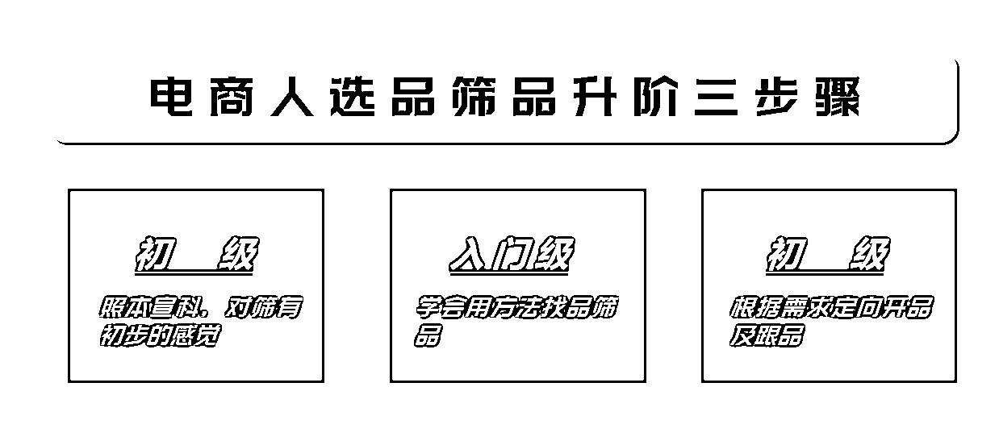

**2.1 照本宣科，对筛品有初步感觉**

在这个阶段，任何主观上的判断都很大可能带来灾难性打击。

在开始照本宣科之前，大家思考几个点【依托刚刚讲的人货场理论】

1) 什么样的产品是好产品

2) 什么样的产品在快手上是好产品【卖得好】

3) 什么样的人群喜欢这个好产品

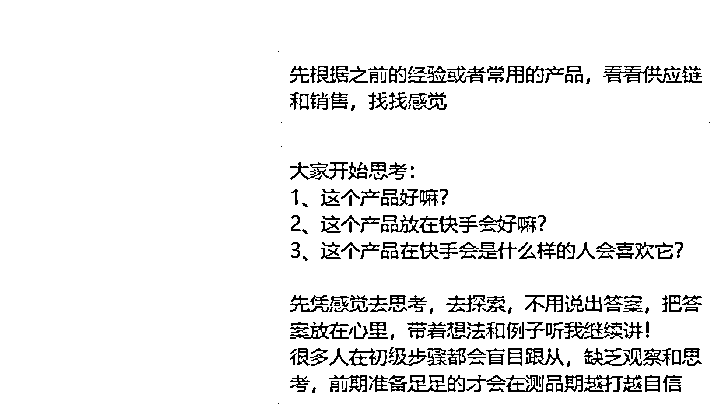

**(1) 什么样的产品是好产品**

从生意维度来看，有人买单的产品就是好产品；

从用户维度来看，有用户需求的产品就是好产品；

人们会为需求付款，一个产品被购买就代表着你满足了用户某个需求，不论产品好坏或实用性，只要击中需求就是好产品。

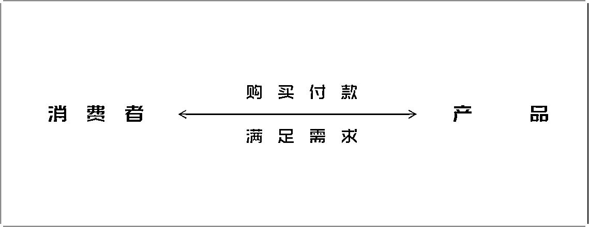

当听到这里大家开始产生困惑，那没错啊！我就是按照这样去筛品的呀？

经常有朋友问书豪：书豪，我选了四个品觉得都可以，但为什么你觉得不行呢？

虽然我有耐心解释，但我内心的 OS：那你不需要选品啊！打开各类网购榜单只要在前五十的绝对是好品，甚至销量破万的绝对是好品！

**但这些畅销好品在快手上是好品吗？**

**(1) 什么样的产品在快手上是好产品？**

你觉得好卖或者其他平台好卖的产品？放在快手很大可能不行了？

带入【人货场】理论思考一下，怎么个事儿？

快手的人不对，目标用户从所有人变成了“快手用户”

快手的场不对，支付场景从搜索电商|线下商场变成了“快手直播间”

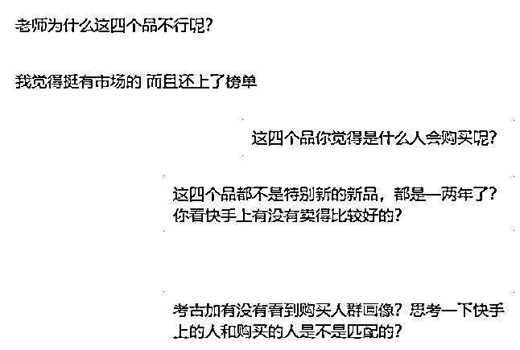

每个平台都有其人群的特殊属性，所以不是所有的品在快手上都能大卖，事实是，只有一小部分才是适合快手平台的，更小一部分属于快手直播间的。

在选品时就必须要知道快手的“人”是什么样子？

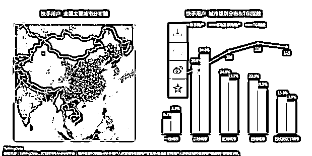

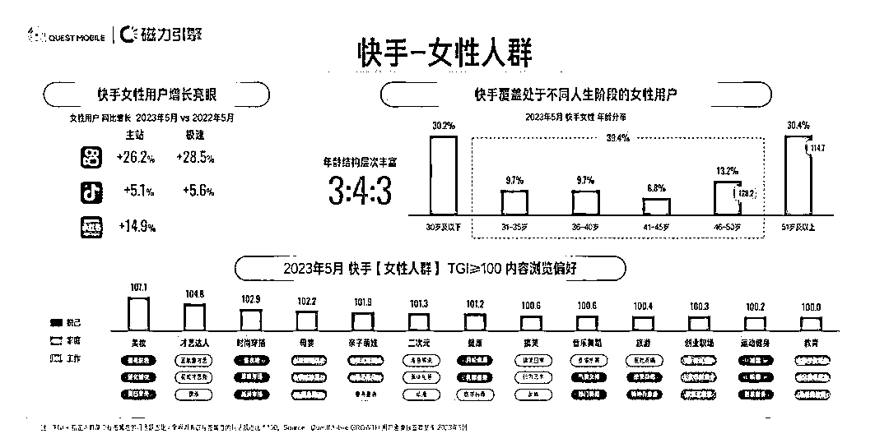

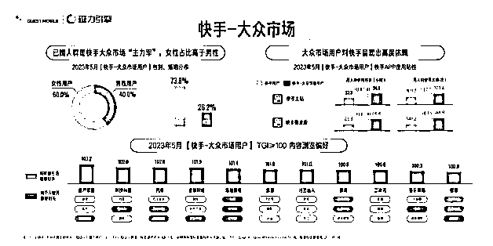

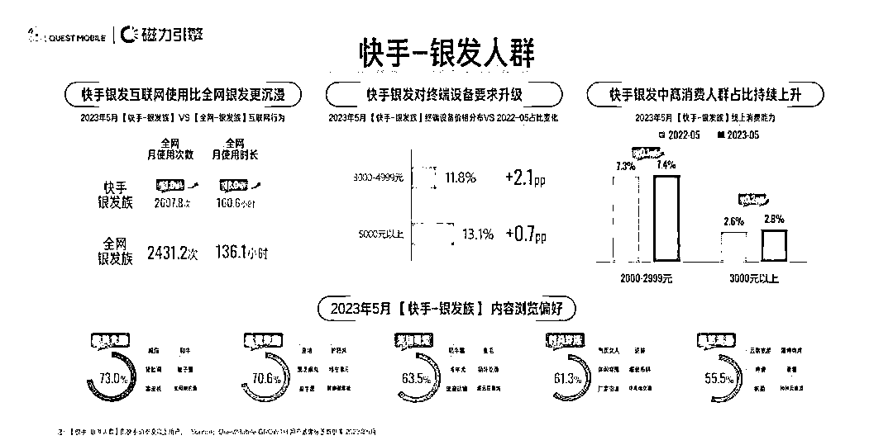

快手人群主要集中在三四五线城市，年龄段呈现两极化极致幼龄极致银发，所以我们要对标的用户画像应该月入五千以下三四线小镇中老年群体，根据不同的产品需求对应性别需求。

所以你卖东西**核心要素就是要么实用性很强，要么独特差异化卖点直切用户痛点**，不要卖华而不实的东西，不要卖超过人群承受限制的事情。【这个点在 3 月 12 日书豪连线学员的时候，就有讲过】

**(1) 什么样的人群会喜欢这个产品？**

这就涉及到了人货场里的场，当你确定了货，知晓了人，就要考虑“**你要用什么样的场景、什么样的形式达成交易**？”

举个例子：假设你是做茶的，卖的是普洱茶，要考虑两个点“**自身优势**”“**产品优势**”；

自身优势：产地正宗、少数民族傣族独特采茶制茶手法、高山茶园等等

；

产品优势：促进消化、降低血脂、减肥、醒酒提神、香甜醇厚

通过产品优势锁定精准人群【卖点对应痛点】，自身优势树立用户信任【快速建立双方链接】

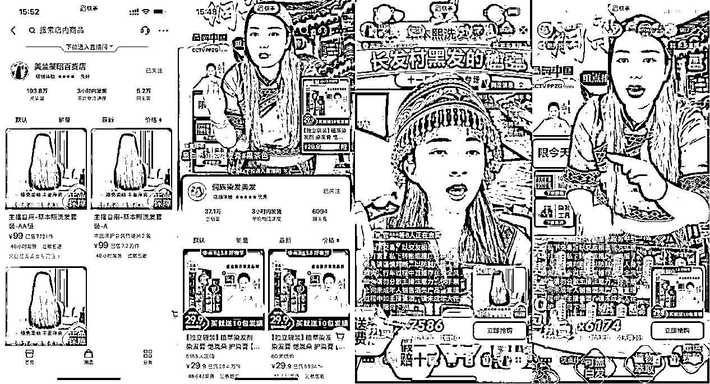

这也就有了现在快手爆火的苗族、侗族少数民族账号，专卖护发素、染头膏，将产品与自身优势融合在一起，从而实现爆单爆量并建立了直播间护城河；

不能卖：比如美瞳隐形眼镜、装饰物、乐器、潮牌、汉服等等【不是不能卖，而是市场太小，但如果你找到一个细分品类快手从没人卖过那就可以尝试】

能卖：比如染发膏、护发素、生发洗发液、大码女装等等；【考虑需求人群基数大的品类，你机会会更大，但如果某个品类对手吃了 80%的量也没必要跟】

**2.2 学会用方法找品筛品**

在任何电商平台上，选品都需要一个行之有效选则节流的科学方法。

**平台投流付费的第一原则：只卖佣金高于 50%的产品；**

我们先聊聊在快手短引模式下哪类产品更容易卖爆：季节性产品、趋势爆发类产品、卖点可视化强的产品；

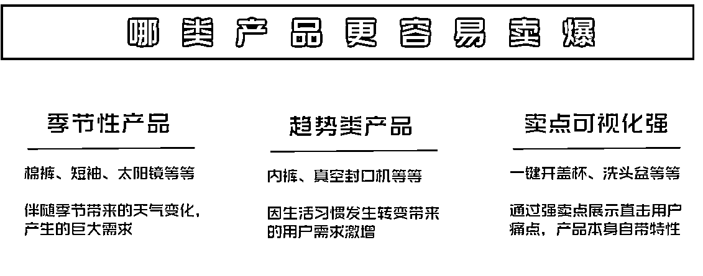

季节性产品是指：

某些品类商品会在特定季节下迸发出大量需求，主要由天气因素导致；

快手用户购买此类商品更关注的是性价比和实用性，当考虑这两者的时候自然而然退货率下降，对盈利投产的要求也减弱了；

趋势类产品是指：

这个是当生活习惯改变或改变生活习惯的变量出现，针对生活习惯的变化从而激发出的大量需求，这种品类多以爆发快时长短为特征；

卖点可视化强：

当用户痛点想接近时，某款产品将使用习惯的槽点进一步放大，通过明显的卖点快速解决所遇到的问题；

满足这三点的产品也有很多很多，那我们怎么去做到快速筛品呢

在学习前，每一次选品都需要仔细思考一下前面说的人货场

下面我把我们团队常用的几种方法：

**1、 考古加、有米有数榜单筛品**

此招数针对刚入门小白或者实在无品可打的时候，因为太多人在榜单上筛品了，容易出现竞争；

打开考古加或有米有数榜单，先根据以下指标做一轮筛选；

低客单产品不选，对于短引付费用户低客单在打品初期投产较难打正，同时也有短带玩家抢占市场；【集中在 30 以上，100 以下，部分品可拉长到 150】；

只选直播售卖的商品，短视频带货及商品卡占比过大的一律不选；

选择销量趋势 7or15or30 天有明显上升趋势的产品；

  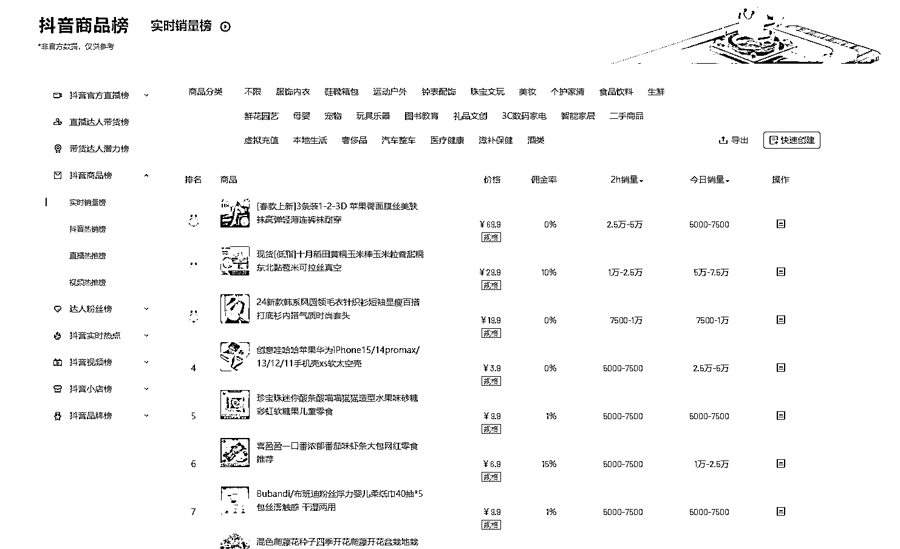

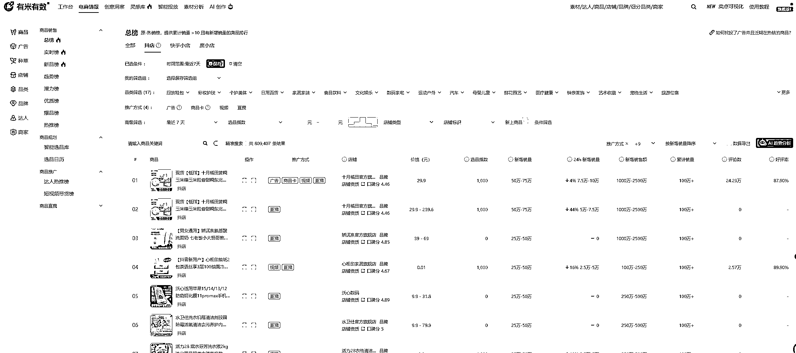

经过一轮筛选后，出现的品就会和别人呈现明显差异化，但依然是一个榜单，这里分为两种**“不选排行榜前 30 的商品”、“根据自己想打的品类进行筛选”**；

如果出现销售额 30 万每天的产品也尽量不要打，因为这意味着竞争较大；

我们是打短引直播间的，所以我们在找对标的时候最好也找同样的！

那如何判断一个直播间是不是短引付费直播间呢？

如在考古加，打开选到品对应的直播间，看单场直播间数据，主要关注直播间流量结构、人群分配、年龄占比及地区；短引的话就看直播间流量结构，如只有付费一项且占比 60%，就搜一下直播间看一下在线人数【不高于 100 人】且账号下有视频发布则为短引，如短视频引流在前三位的话，那就是准短引；

如在有米有数，则直接点击对应商品的账号，看该账号下的隐藏广告素材，如有就是短引，如没有再去看一眼主页是否有视频，有的话也是短引；

  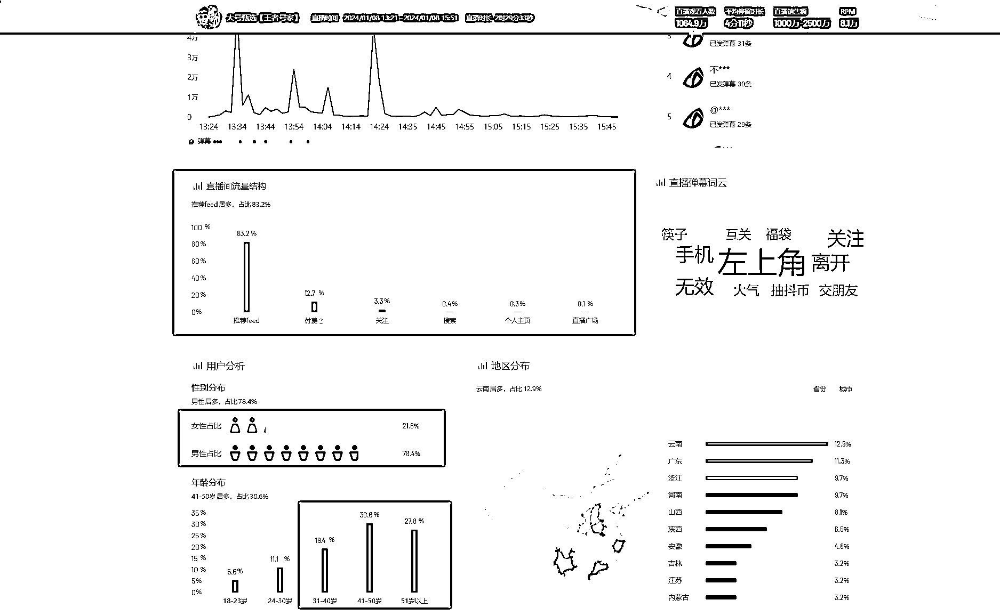

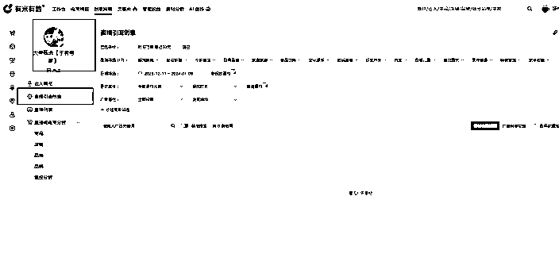

【在榜单筛品，就是前面说的三个爆量产品特征】

**2 有米有数升级版筛品**

基于上面的方法之上，我们算一笔账如果不想被团队被资本卷，我们可不可以打一些小品，千万别搞的小钱看不上，大钱弄不了，这样就会很麻烦；

那我们再上面所说的基础上，再加筛选“30 天内”、“销售额 30~300 万”；

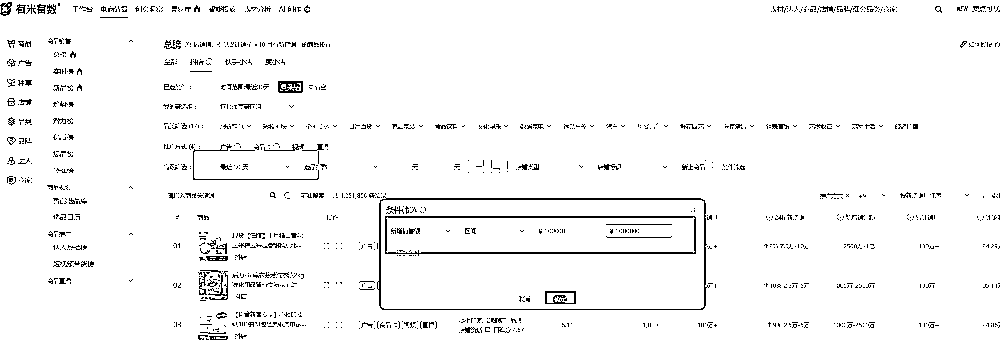

**3 抖音快手跟品**

进入短引这个赛道时间只要有一个月，沉浸在快手里面你自然会发现有很多人还在玩着最原始的无人直播，靠店群以量赚钱；

如何在抖音快手上学会跟品呢？

首先是养号，让自己的账号变成电商高质量人群，多去搜索卖货直播间，多去搜索卖货视频，多去搜索卖货达人；养一周时间后，你的推荐每次刷新都是各式各样的同行；

这里面的机会是很大的，我们以快手为例：比如有些品刚在快手起量，或者有些视频刚在快手上爆发，你观察一下这个账号，看看他是直播还是短带，如果是直播，看一下是打短引的还是打无人免费流的，两种情况两个跟法：如短引，刚刚起量一周，这个时候你切进去是可以跟上的，通过同类型脚本更优质的视频内容，也可以做到快速起号；如无人免费流，感觉他的视频爆了，那不用多说直接短引削他就完了。

原则：在卖货和起号效率上，**短引 大于 达人 大于 免费流直播 大于 短带**

（如短带的量太大了，就算了因为他们用低价洗了人群；）

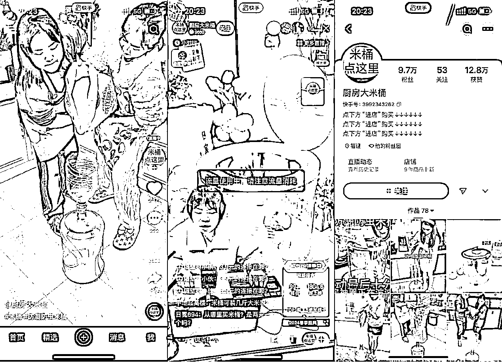

【素人带货：用户通过短视频进入直播间——转化购买】

每次看到这种直播间，说实话我真的心痛，因为这种转化的效率太低了，他一条视频 2.3 万点赞，如果是短引就是 8000 单的销售额，结果她因为细节做不好，可能到最后连 1000 单的转化都做不到。

**4 传统电商平台找品**

打品一段时间后，就会思考那如果我们是跟着抖音的爆品，那抖音选品又是从哪里来的呢？

有些东西就是这样，只有进入更高层级才会想更深的东西；

抖音的选品很多是根据淘宝、京东这些传统搜索电商平台来的，当一个品在传统电商平台销量激增的时候，那抖音就会一夜之间冒出十几甚至几十个直播间；

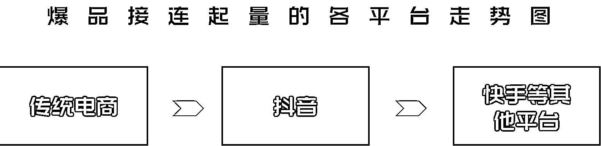

所以大家如果想打高端局，率先在内容电商平台做第一个吃螃蟹的人，直接看蝉妈妈，看销量趋势图，至于其他的筛选可以根据个人的属性进行筛选；

**往年时段爆品再爆**

你会发现市场极少会有真正意义上的新品，大部分都是在重复重复；

所以如果是一个有过两年以上打品经验的人，都知道不单单是素材是爆款重复再重复，爆品同样如此；

所以快手上才会有很多的真人直播打品总是快人一步因为他们记下了很多品去年甚至前年的爆发时间。

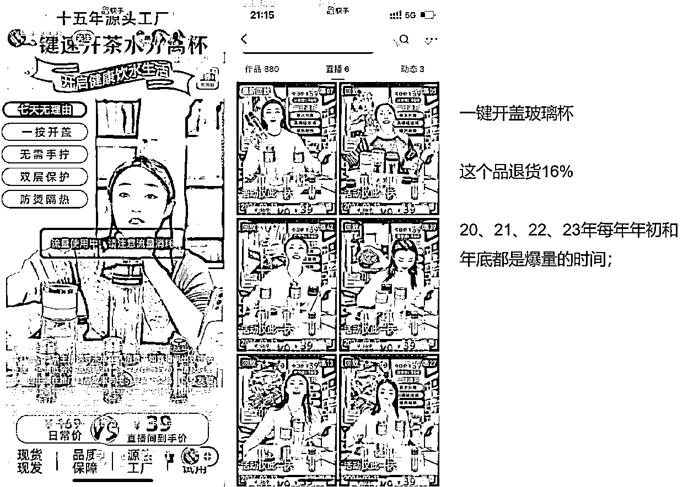

举个例子：

一键开盖玻璃杯，我们从 23 年在打的品，但这个品其实在 3 年前每年都会有人打，当我们切入的时候恰好赶在了同行没有注意的时候，率先发力，当天投产打正，第七天 GMV 突破一万，之后时常保持稳定，一度短引直播间冲破百人关卡；

这个品持续了三个月，每个月固定 3~4 万的净利润，动用资金在 25 万，成本只有 5k 一个月的剪辑（我们自己脑子缺了，有兼职不用不香吗？）

插句题外话：很多人觉得炒股赚钱，我问问你 25 万的资金每月 20%的资金提升，这不比你炒股可控，这钱你挣得不比炒股踏实吗？

**5 跟进社会热点，大趋势**

除了上述之外，有一些品的存活时间特别短，但是瞬时迸发的量真的令人惊讶；

这些品就是因为当社会热点突然出现的时候，被人快速拿到各类平台上递推下去，比如“秋天的第一杯奶茶”、

“茅台味酱香拿铁”，甚至电影【热辣滚烫】的上映同样都为某个产品带来了巨大的短时需求量爆炸；

这个其实属于高阶思维，通过快闪快动迅速吃掉这波热度；

那这种品的选择上，我们就需要仔细思考一下，当一个事物突然大火之后会带动哪些产品或者哪些行为习惯的巨大变化，从而做到精确选品。

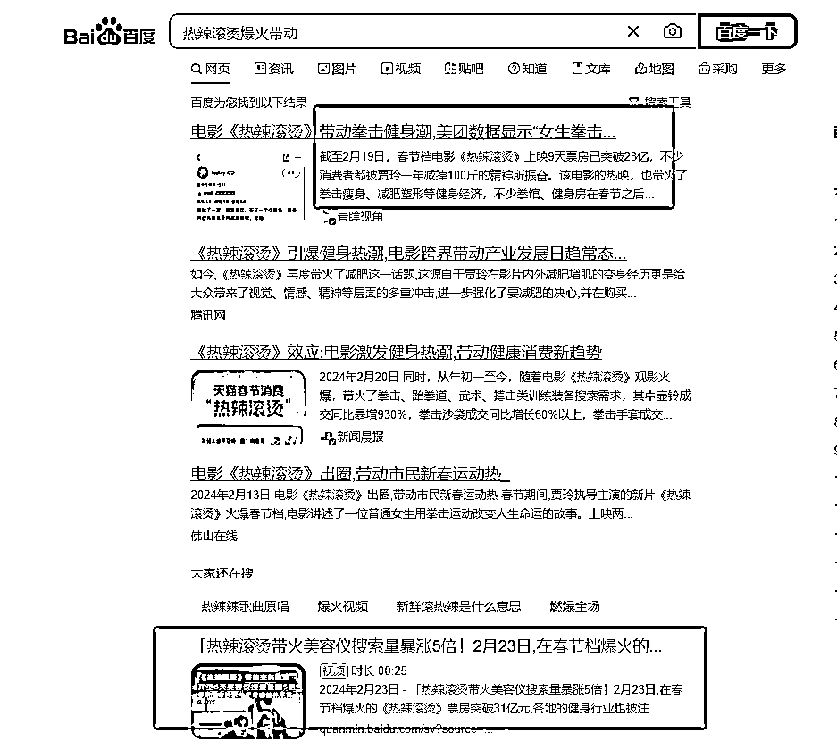

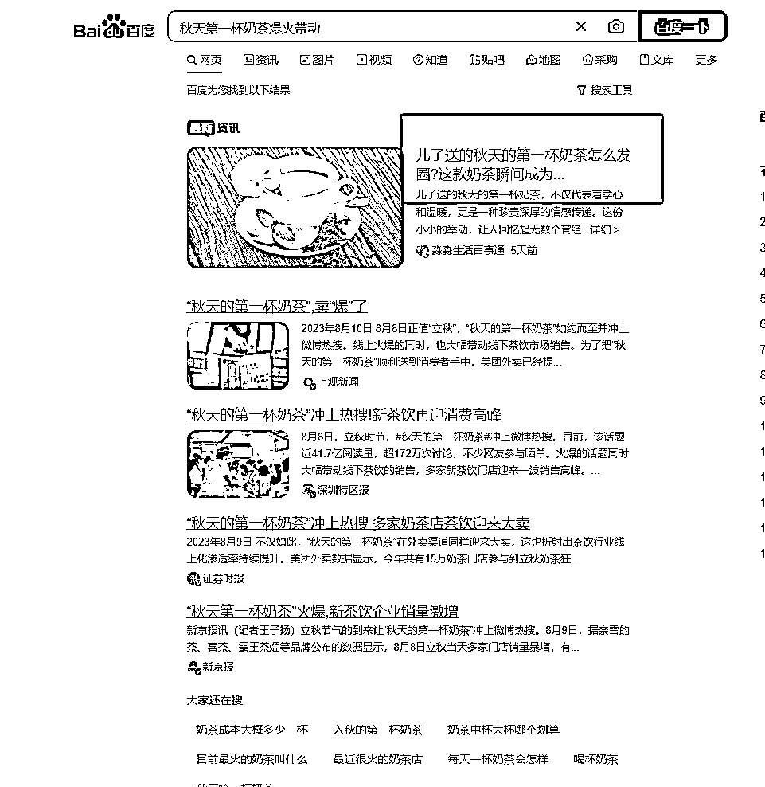

**2.3 根据需求定向开品及跟品**

我们之前主要聊的是小团队或者个人在选品的时候一些方法，但对于大团队大资本他们因为成本高体量大，时刻处于饥渴状态，他们应该如何选品打品呢？

首先要满足几个条件：

A. 产品需求巨大：在一定时间内市场体量在千万级别；

B. 产品利润率及退货率都处于优秀水平：利润率可能突破 70%，退货率 25%以下；

C. 产品有应对时间周期的能力：通过产品升级或者同类替换去对抗时间带来的需求变化；

快手上是有很多的细分类目未被开发出来，但小团队是没有资本做到教育用户的同时完成收割的，所以我们依然能看到很多大团队在到处开疆拓土；

举个简单的例子：

当银发经济来临时，我们能想到的是什么？

养老院经济？滋补品？拐棍？

你知道有一个团队是怎么操作的吗？他们从抖音出来，抖音实在是卷不动了，来到快手快速定品“染发”、“护发”；

中老年人都喜欢染发，不论男女都一样；中老年人都面临秃发和卷发情况，所以护发也是一样！妥妥的快手主力人群啊！

他们接下来做了什么动作，品定好了之后，开始思考包装“苗族”“侗族”天然植物元素的染发护发，不伤害头皮纯天然取自自然，如果你是五十岁你觉得这是不是击中了你的心吧？

同时从短视频到直播间，苗族侗族少数民族场景服饰甚至人全线配齐，一周内上传几千条作品，主页传完再继续磁力金牛后台户上传，少时间内高密度高频率快打，直接引爆，当天 100 万 GMV，现在也是每天在 60~150 万 GMV 之间，全年无休印钞机哐哐印钱；

大家听我说完之后，什么感觉？

是不是有一种浑身打通的爽感？短时间内快速起号直接爆量

但大家再仔细思考一下，有没有发现他的所有动作都是有章法的，并不是“人傻钱多”；从定品类、选品定品、素材制作、直播间打造甚至整体造型有没有觉得很熟悉？

对，就是人货场理论！

**第三部分：选品建议及心态思考**

每天都要筛选不下几十个品，我们发现很多人的选品还是没有真正去思考底层逻辑，没有考虑人货场理论。

对于选品上的建议，根据我自己的思考，遇到什么都很对的品时你反而要纠结一下，因为太完美的品，跟品的人太多了，这样反而会在测品的时候信心越来越不足；

**1、尽量不选完美品**

选品我自己有个习惯，叫不要太完美要有缺口才能圆满；

什么意思？有一个品大方向上是不跑偏的，但有一个甚至两个指标没有对应上，这个时候你在测品的时候，是带着很虔诚很谨慎的心态去测；

每到任何一个卡点的时候，你都会仔细复盘，不断打磨，这样反而会让你的信心越来越足；

而且不太完美的品，自然而然很多人会舍弃掉，这个时候你的竞争没那么大，你就会有更多战略窗口期，可以多花时间去研究琢磨。

**2、选品后要学会相信**

要对你选中的品有信心，你要明白一个道理，你测一个品需要花时间，系统同样也要花时间去观察你的品，去为你匹配更精准的人群；

大部分的内容都只能称之为一般，大家都一般的时候就要在其他方面下足功夫，比如思考品的人群、思考人群喜好、思考场景成交，说白了就是从直播、投放到素材三个地方去着手，给素材时间、给系统时间、给产品时间，最后给人群一些时间。

**3、相信但也不要完全相信**

打品人里面十个里面九个亏，九个里面直投占 4 个，半付费占 2 个，自然流占 1 个剩下两个就是短引，短引在不考虑个人时间的时候很难评判到底是亏还是赚；

我们对于学员都会说测品时间一般在 3~7 天，其实这个是理论数值，核心点就是我们怕有些品不能打，或者这个学员不适合打，结果他头铁硬往里面扎，总想着这个品亏钱了我必须要赚回来，这就是再耽误自己的时间；

在商业模式已经被验证的基础上，你要做的是不断测品，时间对于成熟打品人来说特别宝贵，因为如果我在一个不确定的品身上耗费了太多的时间，会浪费其他品的成本。

希望这篇分享对大家有帮助，2024 年希望大家不论是自然流还是付费流都能打爆多个单品，能够付费通投拉满拿到高 ROI！

（我目前主要在做小红书、快手这两个平台，基本所有平台短视频内容的核心逻辑都是想通的，没有特别大的差异，希望这次的分享能够对大家有帮助，如果对上述分享有疑问的，也欢迎跟大家多多交流，探讨，定当知无不言，我的微信：wsh137552775）

* * *

评论区：

凌心 : 很赞，干货满满
小六六~ : 豪哥 yyds！
人生若只如初见 : 内容好熟悉呀，之前参加刀姐的选品课听过，你也是她团队的呀？
书豪 : 我自己有十几个人的打品团队哦，刀姐我和她是朋友呀，我是快手+小红书的打品团队呀，文章写的快手的选品方法，你自己好好看
书豪 : 猛干
书豪 : 猛干
安俊 : 豪哥 这是把压箱底的东西都掏出来了

* * *