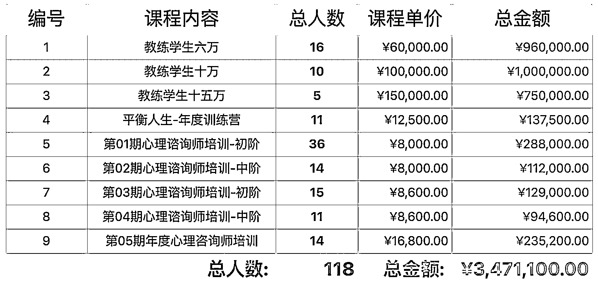

# 线上新手，我是如何用一套固定流程，累计成交 300 万高价产品？

> 原文：[`www.yuque.com/for_lazy/thfiu8/ggm1auaim7oumd2s`](https://www.yuque.com/for_lazy/thfiu8/ggm1auaim7oumd2s)

## (87 赞)线上新手，我是如何用一套固定流程，累计成交 300 万高价产品？

作者： 根源

日期：2024-03-22

主题：《 线上新手，我是如何用一套固定流程，累计成交 300 万高价产品？ 》

圈友们好，我是根源

我想，成交高单价的产品，应该是所有交付者以及所有销售员最终的梦想，
尤其就个体来说，一个销售员能够一单收个大几万，大几十万，
这个心里面一定会有满满的成就感。

当然，收一个大金额的单子，更可以大大的增加赚钱的效率，
以及优化自己的交付时间。

但是真的要能跟客户收到一笔大钱谈何容易，
尤其在一个没有企业背景，只有个体的情况之下，要收大钱真的不容易。

备注：
文章中定义的高单价是 8000 元以上的产品。

开头也附上，这两年收高单价的一些成绩。

以下为飞书好读版：
[`oee5lr7gsk.feishu.cn/docx/ZOaJdJTSuoflJfxSVIwc5xpCnNh`](https://oee5lr7gsk.feishu.cn/docx/ZOaJdJTSuoflJfxSVIwc5xpCnNh)

* * *

评论区：

Felix : 根源老师出品，必属精品！
一楠 : 根源老师出品，必属精品！
老风 : 根源老师牛逼，一肚子干货[强]
小椰 : 论聊天成交，根源老师 yyds
陈伟 : 根源老师，yyds
YolyArk : 老师好牛，讲得深入浅出，学习了！
心有林夕 : 根源老师出品，必属精品！
芷蓝 : 高客单价产品沟通销售必须得跟着根源老师学习～

* * *