# 1 万小红书高净值粉丝，10 个月变现 500 万，万字全流程拆解

> 原文：[`www.yuque.com/for_lazy/thfiu8/abg7gtvs843dy42t`](https://www.yuque.com/for_lazy/thfiu8/abg7gtvs843dy42t)

## (84 赞)1 万小红书高净值粉丝，10 个月变现 500 万，万字全流程拆解

作者： 劲猫

日期：2024-03-21

**哈喽大家好，我是劲猫~**

2022 年的 3 月，我还是一个入局小红书的新手，从 0 到 1 做起来一个自媒体运营账号

3 个月营收 5 万，并且获得了精华[《自媒体小白做小红书 3 个月，从 0 涨粉 8000 粉，变现 5 万》](https://articles.zsxq.com/id_cie8wcuzjswl.html)

**2023 年 3 月，我以小红书老手的身份进入了一个新领域，并且在 10 个月时间，获得 500 万的营收。**

这篇文章，同样是一篇从 0 到 1 的经验总结和复盘。

为什么我会一直选择小红书平台呢？因为它愿意给新人机会，并且不仅仅是小机会，更是大机会。

从我第一次尝试做小红书成功之后，我就知道，所有的自媒体方法，在小红书上的成功率最大。

**从人群上来说**，小红书 80%都是女生，女生偏感性，对情绪向内容很敏感。

自媒体内容，其实大部分都是情绪价值为主，任你实用性再强，你也是视频或者文字展示的，只能让人看一看，一旦内容能做到情绪触动，爆发就是迟早的事情。

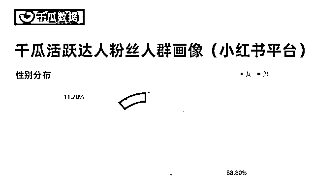

**从定位上来说**，小红书是种草平台起家，她的基础定位就是为了生活更美好而去的。抖音快手是娱乐，B 站主学习，微信主社交。只有小红书，一个只想让你生活更方便，更有性价比的平台。

旅游去哪玩，搜小红书

当地吃什么，搜小红书

民宿住哪儿，搜小红书

小红书在年轻人里，早就已经是代替百度的存在。

所以，内容不需要多突出，能帮人解决问题，就是好内容。

**从平台风向来说**，小红书更愿意扶持新人，扶持那些真正有价值的内容。它不会向其他平台一样大博主一家独大，吞噬所有流量。而是会单独给新号权重，会给那些 0 粉丝的好内容更多曝光。

基于这 3 个属性，只要你真正能够产生有价值的内容，并且从情绪和实用上真正帮到别人，你在小红书，大有天地！

接下来进入正题。

我会从**成绩复盘，起号做流量，引流做成交，经验复盘，**这 4 个方面来分享。如何在小红书上从 0 起号，1.4 万粉丝做到 500 万营收！

芜湖，启航！

## 成绩复盘

想要复盘，结果先行。

2023 年 3 月，我进入了小红书一个新领域：香港身份，帐号从 0 开始起号，并且把视频分发在视频号和 B 站

2024 年 1 月，10 个月的时间。

小红书账号粉丝达到 1.4 万。

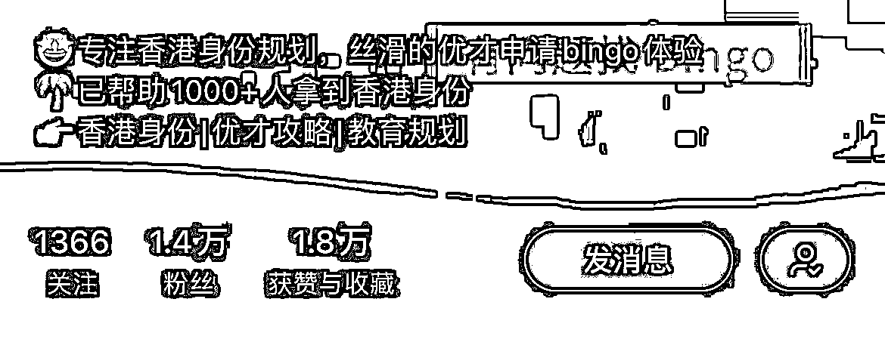

私域流量达到 3600+

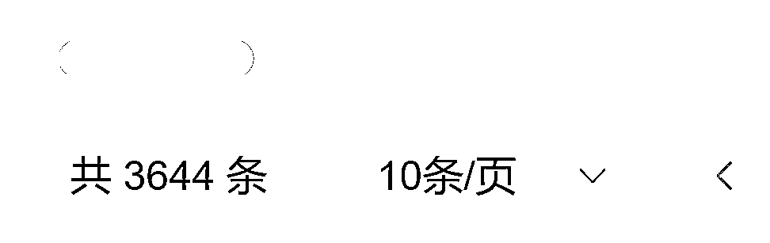

6 万客单价的产品成交 84 单，总销售额达到超过 500 万

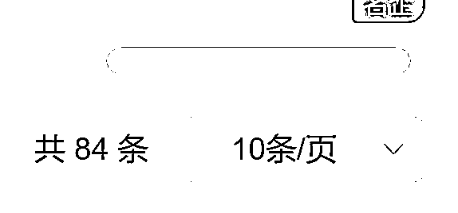

为了更加清晰的展现结果，我列了个表格。

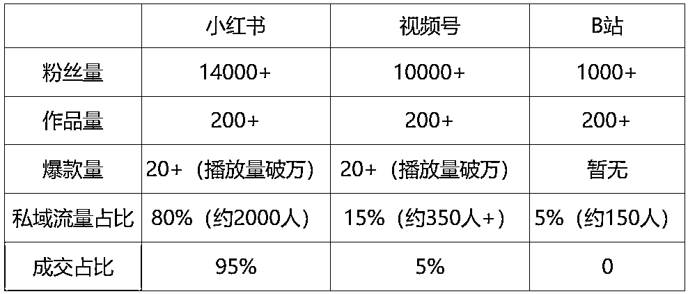

这些数据是最终的结果，那么如何做到的呢，主要板块是两个，第一起号做流量，第二引流做成交。接下来我会详细拆解整个过程。

## 一、起号做流量

### 1.起号前期

3 月份，是起号的第一个月，调研人群--->构建人设--->准备内容--->拍摄视频--->调整封面与剪辑人设。

#### a.调研人群

由于我是第一次接触香港身份这个领域，所以我做的第一件事情，并不是先看对标账号。

而是先把公司产品对应的目标人群调研了一遍。

产品客单价为 6 万，针对的是想要办理香港身份的人群。

产品对人群有一定的要求，比如个人资质需要名企名校（可以走优才申请香港身份）

或者年收入要大于 250 万（可以走高才申请香港身份）

除了目标人群的要求之外，我还看了一些高净值人群的兴趣分析报告。

做这个动作的目的在于，

1.让我熟悉当前领域的人群，为日后账号的人群画像做匹配

2.判断当下领域的人群的特点，便于之后做内容。

#### b.构思人设

了解完人群之后，我开始构思自己的人设，这时候，我开始寻找对标账号和内容。

分析和拆解是我最擅长的事情。

在拆解博主和拆解领域爆款的过程中，我发现，数据量好的笔记，80%都是劝退型的。近期增长比较迅速的博主，靠的也是避坑相关内容。

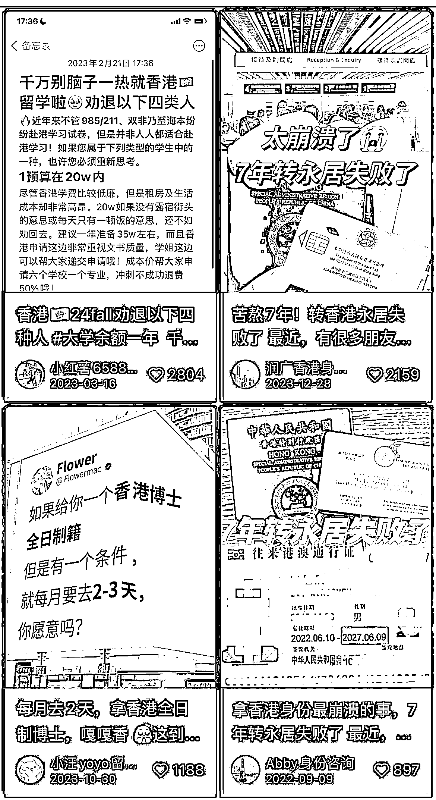

这就说明，当下这个领域的用户，对“劝退”和“避坑”的内容是偏好的。

为了更好的引流，更快加深信任感签单，我走的是一个“劝退”人设。

因为“劝退”相较于“避坑”，情绪会更加充分，表达会更加用力。更为适合我的镜头表现。

有了初步构思之后，迅速把各个平台的账号装修都做好了（图片展示）

#### c.准备内容，拍摄视频，调整封面和剪辑风格

这就是一个新媒体运营的基本工作步骤了。

准备内容分为两个部分，第一个确定选题，第二个撰写脚本

拍摄视频呢，由于是我自己出镜，所以基本不需要什么前期的准备，直接拿个手机就怼脸拍了。

这时候你可能会有疑问，拍摄视频，难道不需要布景吗？

对，不需要布景，为什么呢？

因为跟我的人设有关。

在我看来，劝退人设，重点在于说话的内容和表现力。

要给人一种：我实在是忍不了了，我一定要劝退你，你管我在哪里，你就听我的劝就对了。

我就算是坐在地上，我都不站起来，我直接坐着跟你说。

这样的感觉。

这种感觉会让人觉得真实。

很多人会认为，小红书平台难道不要那种精致高级的内容吗？

对，它是需要精致高级的内容。

但那是针对不同领域的。

那些劝退和避坑的笔记，无论哪个领域，一定是越真实越好。

因为真实才能让人感觉到 “这好像真的是个坑”，我要仔细听一下。

前期准备了大概半个月的时间，我有了一定的屯稿，于是在 3 月底的时候，开始按照一周 5 更来更新

### 2.起号中期

时间来到第二个月，账号开始小有起色，具体体现在，每天的后台私信达到 10+

咨询非常精准，大体分为 3 种形式

1.咨询香港身份办理

2.介绍自己条件+咨询香港优才

3.问费用多少

这里我想要分享一个点，起号的定义。

在我看来，起号有两个标准

**1.有一篇标志性的爆款**

做过账号的同学，肯定对这句话很有共鸣。

因为一般一个账号起来，一定是伴随一个爆款的出现的。

这个爆款能够让账号整体的浏览量和权重都有所提升。

每一个账号，基本都能追溯到最开始的第一篇爆款。

由于每个领域的人群受众不同，所以爆款的数据也不同

一般来说，那些热门领域，1000 赞以上算爆款

如果是冷门细分领域，那么 100 赞基本就是爆款。

比如我做的香港身份，这就是一个细分领域。

**2.账号整体有明显的提升**

如果没有标志性爆款，那么还有一个点，也能够代表起号。

那就是账号整体有明显的提升。

比如连续好几篇的笔记，点赞都能够达到一两百，或者咨询明显起量了。

那也说明账号已经开始起号了。

起号之后，有一个点很关键，那就是以点破面。

这是扩张的关键期。

大部分人做账号，在前期运用正确的方法很快就有了爆款。

但流量很快就停了，原因就在于没有借势，借这个爆款的势。

**我有了第一个爆款之后，做了 3 个动作。**

1.分析当下爆款的各类数据，比如封面点击率，停留市场，互动数据，关注量。

然后我发现，这个爆款的增长爆发点在于，停留时长，以及关注动作。

这两个点的数据非常优秀。于是开始倒推，为什么让他们停留，又为什么让他们关注。

2.找到他们停留的点，和关注的点之后，我开始在接下来的内容里进行测试。

总共测试了 3 版内容（大概每版内容发 3 篇），我找到了比较数据比较优秀的版本。

3.接着我按照我测试出来的最优秀的版本，一口气写了 10 篇脚本，持续的制作内容。

发现效果不错，于是一直重复这个有效的动作。

就这样，时间来到第三个月，开始爆发了。

账号来到第三个月，各方面数据大爆发。

1.粉丝猛增，突破 5000+

2.流量猛增，当月引流超过 600+

3.签单猛增，当月签单 10 单 6 万的产品，其中 9 单属于 30 天内成交的新单

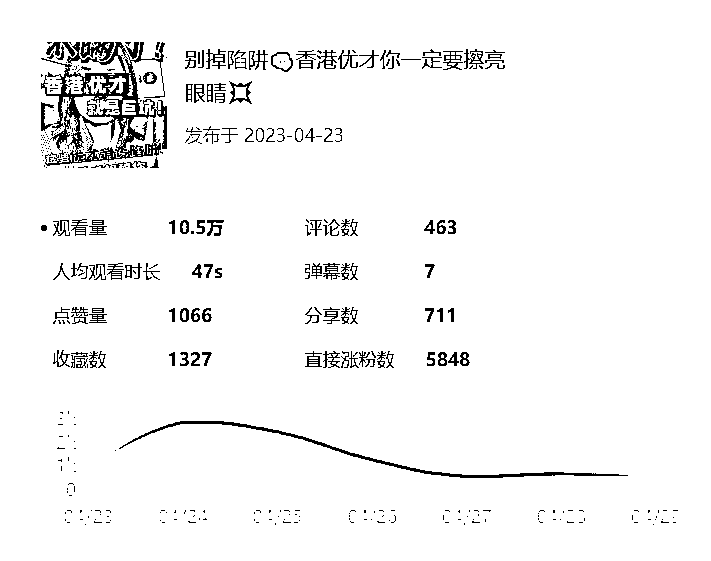

写到这，我发现好像第三个月的爆发似乎没什么可写的了。

因为除了亮眼的数据之外，基本没什么可值得说的。

我的动作跟前两个月一样，枯燥的坚持。

以前我很喜欢看别人如何一个月赚 10 万，一年赚 100 万。

但似乎只喜欢看真正赚到钱的时刻。

前期的铺垫，努力，打磨，扎根，好像都没什么吸引力。

直到我真正做到这些成就，

才发现原来真正有价值的，就是前期那些枯燥的探索。

真正拿到结果的人，记忆深刻的一定不是赚到钱的那个时刻。

而是前期那些在黑暗中摸索，跌跟头，但是又踉踉跄跄站起来的时刻。

这些都是题外话，我们继续跟着时间走。

跟随第三个月数据的爆发，账号也开始定性了。

我的账号就是那段时间香港优才领域的 top 账号。

定性意味着什么呢？有两个点

1、无论我发什么内容，只要跟香港优才相关，就能有稳定的咨询，每天 15-20 个精准咨询。

2、5 篇内容里至少能够出一篇爆款。这是我后来复盘数据总结的一个结论。

所以，账号爆发的那段时间，我一直在享受这种定性来带的成功。

那种感觉就是，我可以随意更文，只要我的选题跟之前保持一致，只要我有东西输出，那我完全不用担心数据。

因为签单一直在签，流量一直在爆发，粉丝每天睁眼就是几百几百的涨。

正是因为这种触手可得的流量和签单。让我完全沉浸在成功的喜悦里，松懈了。

导致我对于内容的质量，内容的细节把控，我都没有那么上心了。

自媒体的世界，是不允许这种状态存在很久的，因为没有人可以毫不努力就一直站在顶端。

到第四个月，我流量开始跌落了。

### 起号后期

跌落的感觉像温水煮青蛙，它最开始不会让你一下子从顶峰跌到谷底，而是给你很多错觉。

比如，发现这一周好像没有爆款，但是这周好像有大事发生，所以可能是外部原因？

比如，发现这一周的咨询好像掉了 40%，但是这周的爆款量是稳定的，所以可能是小红书平台私信方面的外部原因？

再比如，这一周的签单量好像没有之前那么多，但可能是流量的成交需要用时间去建立信任感，再等等？

诸如此类的情况，让我的流量和签单一步步往下滑，但是我却在用那些外部原因在给自己找借口。

直到第二周，第三周，发现流量对比前一个月，下滑了将近 50%，并且没有回升的迹象。

这时候，我才发现，账号出了问题，而我拖了整整一个月。

**我真的觉得，自媒体世界是公平的。**

**是多么成功的账号，无论是多么光鲜亮丽的博主，**

**只要开始松懈，开始随意对待内容和账号，一定会跌落。**

**而且这种跌落是必然的。**

**但跌落的反义是回升。**

**正是因为自媒体世界是公平的。**

**所以当你察觉到跌落，并且重新开始反思，认真对待内容时**

**自媒体也一定会给你相应的反馈。**

时间来到第五个月，上个月账号的数据跌落让我开始反思，究竟是哪些环节出了差错，应该如何去优化和调整。

我做了 3 个动作。

**1.拉数据**

数据下滑，分为很多种情况。

如果是浏览量下滑，那主要问题就是封面

如果是停留时长下滑，那主要问题就是内容呈现

如果是私信数量下滑，那主要问题就是钩子的质量

如果是关注量下滑，那主要问题就是人设感不够强，账号的未来价值不明确

如果是成交量下滑，那主要问题在于引流质量和成交 sop

**2.对症下药**

拉数据之后，你一定能够发现不对劲的地方。

举个例子，比如上个月的封面点击率达到 30%，但是这个月普遍只有 20%，甚至都达不到。

而其他的数据好像没有特别大的差别，那就说明，封面出了很大的问题。

所以，要优化的第一个点，就是封面。

找出优化的点之后，就需要来分析，为什么封面点击率会下降，以及如何提升。

这时候，再进行对比。

跟自己对比，自己上个月的封面关键词有哪些，排版是怎么样的，跟这个月有什么不同？挖掘中间的差别。

跟他人对比，近期同领域的爆款封面有没有什么创新点，自己跟他们的区别在哪里。

就封面这一个点，就能够找到很多测试和优化的方向。

当然，肯定还有其他不对劲和可优化的地方。发现之后就需要针对性的分析和给出测试方向。

测试方向肯定不会马上得到好的反馈，你分析的也不一定全对，你给出的解决方法也不一定有效果

但这个动作，一定是正确的动作，并且一定能够带来正反馈，只是时间问题而已。

除了以上优化动作之外，我还做了如下调整

1.复制前序爆款，根据当下的流量做调整（内容做垂还是泛）

2.加入图文输出，将之前的爆款用图文的形式再输出一遍（图文封面用当下的爆款封面模板）

3.改变内容结尾的钩子，将“评论区留言”变成了“评论区打下 xx”，指令具象化

**3.耐心等待**

其实这个点我犹豫了好久要不要写。

因为耐心等待这个词，在瞬息万变的自媒体世界里，好像不是一个积极的动作。

但我确实是做了这个动作的。

前期的拉数据，对症下药，我都有认真分析和尝试。

但自媒体的反馈是有延时的。特别是小红书。

做过小红书的同学就知道，很多时候，之前发的不温不火的笔记，突然爆了。

甚至都不知道是什么原因爆的。

这就是自媒体的不确定性。

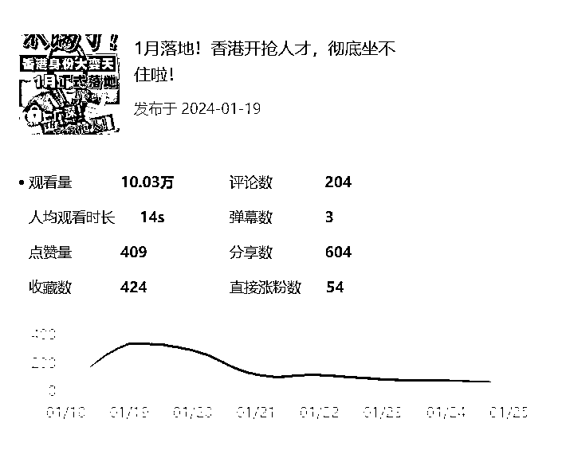

在我看来，对抗不确定性的方法就是，把自己认为的正确方法做到极致，然后耐心等待。

我经常跟自己说，现在我所有的动作都是正确的，只需要等一个爆款。

这句话会给我焦虑的心一种很强的安定感。

做自媒体的人，无一例外都是焦虑的。

过多的焦虑容易让动作变形，容易怀疑自己，容易在看不到反馈的时候放弃。

所以，耐心等待也是我做的一个动作。

我给自己的测试设定了周期，比如一周，或者两周，或者一个月。

当时间没有到的时候，就算没有反馈，我也会坚持当下的动作。

并且告诉自己，数据是需要等待爆发的，内容是需要时间去推动的。

可以焦虑，可以着急，但不可以乱动。

内心爆炸也要做好当下该做的事情，把每个正确的步骤都做到自己的极致。

凭你在自媒体上的积累和经验，你完全能够干掉那些浅尝辄止，四处碰壁的人。

第六个月，经过一个月的测试之后，数据开始慢慢回升了。

跌落是慢慢跌的，但回升是一下子猛增的。

某一天，突然出现了一个爆款，直接把当天的私信咨询量拉到 99+

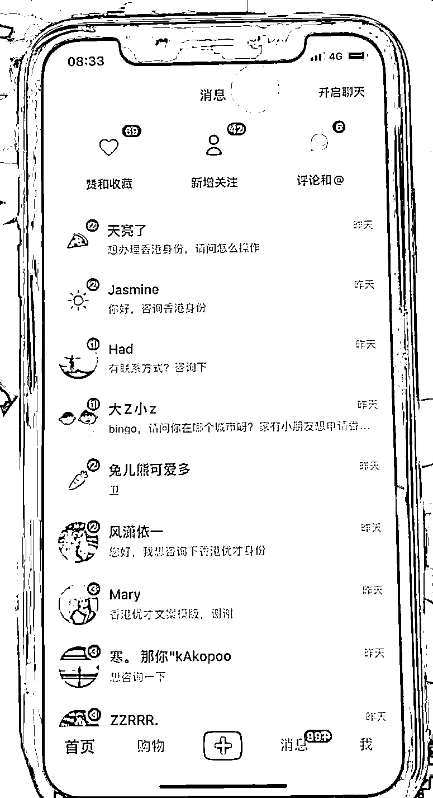

质量和数量一如既往的精准。

随着引流量的提升，签单量也随之提升。稳步上涨到 84 单，我也完成了 500 万的营业额。

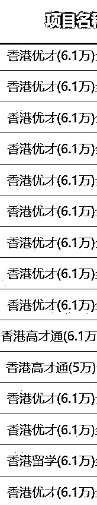

出现这个情况的那一刻，我最大的感受是欣慰。

好像做这一切的是另一个人，

我看着她进入一个新领域初生牛犊不怕虎，

看着她一头扎进去尝试，看着她小试牛刀拿到小成果

又看着她骄傲自满，看着她跌落，

再看着她意识到问题，看着她去反思，去尝试，去解决问题。

最终，她也拿到了一个好的结果。

这种路径给了我很大的信心。

因为我的方法论再一次被验证，它是有效的。

并且在这些方法论中，还诞生了许多新的方法。

虽然方法会过时，技巧会失效

但这种成功经验所带来的信心，成功路径上处理问题的方式，遭遇困境的心态，却是任何东西都代替不了的。

## 但是，自媒体世界的真相就是，只有收到兜里的钱和加到微信的粉是真的，其他都是虚幻（涛哥金句！）

我小红书流量，要如何安全的到达微信，并且成功高效转化呢？这就涉及到接下来的问题，引流和成交。

## 二、引流做成交

### 1.引流板块动作

一共有 6 个，这 6 个其实没有先后顺序，但我建议你要做的话，就全部在一周内让这 6 个动作都能够完成闭环。

因为小红书的流量一旦过来，引流动作不到位，接不住就是浪费，虽然小红书有长尾搜索，但爆发的精准流量非常香，每一个都不要错过。

1.开通白名单

开通白名单这个步骤还有点复杂，首先你要开通企业号，交 600 元进行认证，现在一个主体能认证 2 个小红书号。

开通企业号之后，就可以申请开通聚光平台，这个需要联系小红书客服。

放心，只要你开通了企业号，登录小红书聚光平台，就会有小红书官方的人来找你，询问你的信息，帮助你进行更好的投流。

这时候你先别投流，你问他想要引流开通白名单怎么做，他就会告诉你，首充 2000 元，然后建立投放计划，大概每天投 200-300 元，投 3 天左右，就能获得私信豁免权，也就是所谓的白名单。有效时长在 15-30 天。

这时候你就可以在私信发微信号，比如 xxx1111，或者手机号 13322222222，等等。

这能够大大提高你的私信加人概率。也能降低被小红书发现导流降权封禁的概率。

2.群聊引流+评论区引导

群聊操作是一个比较简单的动作，只需要你建立群聊，然后在笔记发布的第二天，把笔记关联上就行，这个搜索一下就能知道怎么做。就不详细展开了。

主要是评论区引导私信和引导群聊，这里的话术要注意，5 个笔记左右，就需要换一个话术去引导，不然很容易被吞掉，显示不出来。

引导话术主要以资料为主，比如香港身份申请干货，香港身份 360 页 ppt，香港优才申请时间节点，香港身份申请方式及详细费用等等。

在评论区引导加群聊和加私信都可以，主要是看展示的概率，哪个高用哪个，记得用小号去看看自己的评论区有没有展示那些引导话术。

4.建立落地页

落地页是聚光平台里一个收集客资的渠道，类似于链接展示。用户点击落地页，就能直接输入自己的手机号码，这样方便我们进行信息收集和激活。加微信也好，打电话也好，这个信息都很有效。

怎么使用呢？直接在私信的窗口发送落地页链接，就能呈现出来，用户点击就能进行手机号的输入。

当然，落地页要做得有吸引力一点， 比如一对一咨询诊断等等，让用户有填写的欲望。

5.私信激活触达

小红书一天能主动私信 20 个，如果有一天流量爆发，有很多评论和私信的情况下，就很容易频繁，这时候就需要第二天第三天去激活。

一定要在内容里加入让用户关注的钩子，比如点关注，领取资料，点关注可以进行诊断等等。这样我们就能跟关注的用户进行多次聊天。

不然用户没有关注你，你就只能发一次消息，这样的流量利用率就会降低。

6.聚光投流测试

目前在投流板块的尝试不多，小红书投私信和线索表单的成本是不一样的，线索表单的成本在 80-150 一个，私信的开口在 30 左右，价格算贵，但质量挺不错的。

主要是香港身份这块的内容容易敏感，香港优才和香港高才之类的关键性内容投不出去，所以只能投放一些泛流量内容，这块大家有投流预算的可以看着来，预期是一个很大的蛋糕。

### 2.成交板块动作

成交版块的动作其实不多，因为我们的产品比较细分，对客户的资质也有一定的要求，再加上前端内容做的都是精准流量，所以在成交这方面，我们重要的是让用户知道我们的软实力和背书，精准解决他当下的需求即可。

小红书流量的成交周期在 10-60 天，主要做了如下三个动作。

1.客户分类（abcd）

首先我们会根据客户的资质和意向度，对客户进行分类：

A：资质好意向强，那就是 A 类客户，这类客户基本要在 20 天之内成交。

B：资质较好，但意向没有很强的，那就是 B 类客户，这类客户基本要在 30 天之内成交

C：资质一般，意向也一般的客户，那就是 C 类客户，这类客户基本要 60 天左右成交

D：资质很差，意向很差的客户，那就是 D 类客户，这类客户成交的希望基本不大，属于在朋友圈养着，看后期的意向度。

2.电话触达，根据客户层级进行不同天数的反复激活

销售这边每天都会根据客户的分类进行不同程度的反复触达和激活。

销转的重点有三个：

1.强调时效性，香港身份的政策风向随时在变化，以此促进用户快速班里

2.强调好处，香港身份的具体好处根据用户的切实需求来进行针对性说明

3.强调背书，公司的软实力背书和案例，会进行不同程度的展示

对于高客单用户，其实不需要有太多的营销动作，反而真诚一点，客户资质没那么好的进行一些劝退，把该说明的坑进行详细说明，其实很容易拿到用户的信任。

3.朋友圈展示

朋友圈展示这块，其实就是个人 IP 打造的一个部分，主要展示板块有三个：

1.案例分享，获批案例，续签案例，客户好评等等

2.香港身份证展示，让用户知道我们每个月都能真正帮到别人申请拿到身份证

3.政策数据类展示，权威背书，提高用户对我们的可信度和专业认可度。

#### **总的来说，转化这块，细节很多。**

#### **但最重要的，还是流量的进入。**

#### **拥有流量，拥有一切，失去流量，失去一切。**

## 经验复盘

经验的复盘，其实我之前就列好了一个思维导图，这些都是在过程中的一些小细节和小方法。

比如起号经验的复盘

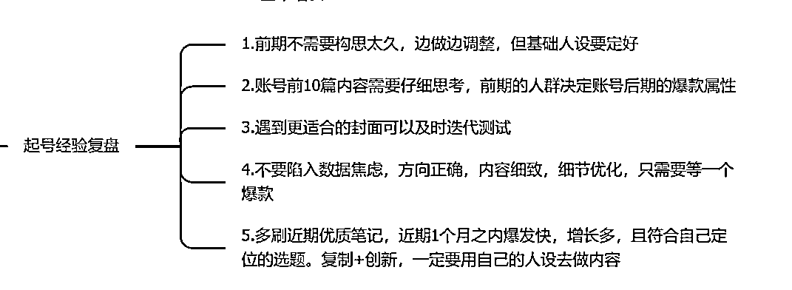

比如爆发阶段，趁热打铁的复盘

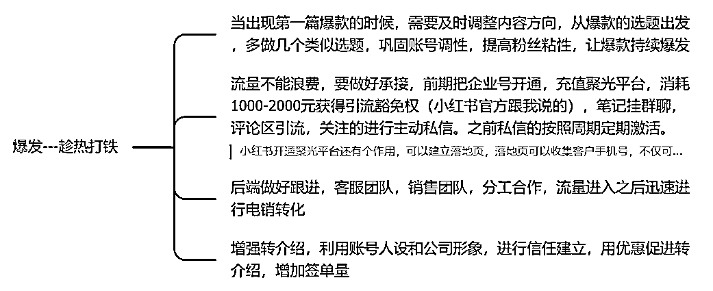

还有跌落和稳定增长上的复盘

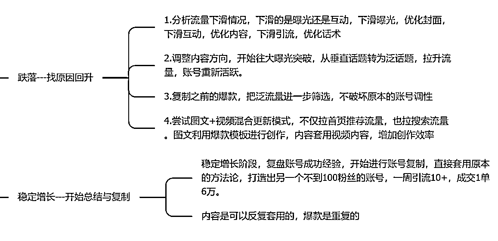

但除了这些方法上的复盘，我更想分享一些内容思考上的复盘。这些零碎的笔记，就是我当下在做内容的时候产生的想法。

为什么我会想分享这些呢？

#### **因为我觉得，做成一件大事，一定是无数的小事累积而成的。**

#### **而做内容做流量，能够出爆款，一定是无数的细微思考累积而成的。**

#### **当你在一个领域不断思考不断沉浸的时候，量变就能引发质变，你的成长速率也能以指数形式增长。**

**1.小红书关键动作，一定是封面和标题。**封面是预期，内容是投喂。小红书视频内容开头，要基于封面与标题来开展。封标产生预期之后，相当于前三秒已经勾住了人。那么视频开头或者图文开头，就需要绕弯子。

绕弯的 3 个点

a.讲自己背书

b.罗列案例

c.挖掘痛点和焦虑

**2.高认知金句，插入视频内容，给有钱人灌鸡汤，输出情绪价值**

**3.要想做自媒体博主，必须拥让人讨厌或者喜欢的能力。千万不能做一个让人无感的人。**

讨厌你会给你流量，喷你，骂你，转发你给别人喷

喜欢你会给你付费，赞你，挺你，主动给你转介绍用户

让人产生情绪，才是内容的价值所在。

注意，这里的情绪，并不是提供情绪价值，而是让其产生情绪的转变。

情绪转变，代表了沉没成本

所以他一定会因为沉没成本，点进你这篇内容。

**4.高认知金句+引导关注，能够触发小红书 CES 计分制：**

ces=关注（8 分）+转发（4 分）+评论（4 分）+点赞 or 收藏（1 分）

当一篇笔记能够把关注数据拉上去，所有笔记的曝光概率会增大。所以引流为主的内容，一定要在内容里加入关注的钩子。

**5.爆款是重复的**

这句话其实很好理解。

往深了说，是人性不变

往浅了说，是内容爆款因子相同

几个很简单的例子

哪些经典的好书，好电影，好剧

经常会看到有人说，已经 2 刷，3 刷，甚至 4 刷 5 刷。

为什么？

因为人们对自己喜欢过的东西，很容易再次喜欢。而且并不会觉得厌烦。

就像你在 3 年前听过一个笑话，现在再次听到，并不会觉得讨厌，反而更多的可能是轻轻一笑。里面带着怀旧与对这个笑话的情绪

还有一个原因，就是

你知道的事情，起码有 1 亿人不知道，更夸张一点，其实是 10 亿人。

这中间说的就是信息差。

还是拿笑话来举例，你听过这个笑话，不代表别人听过，所以笑话可以一直讲。

爆款也是一样，只要能爆，就能一直讲。

因为第一次爆款，符合爆款逻辑。

那么第二次依旧符合。爆款概率就会比其他没有验证过的内容高很多。

原创没用，有用的内容才有用。

爆款是重复的，这是高级内容人才能领悟的道理

最后，给大家附上一个思维导图，感谢大家的阅读，如果能够让你有所思考或者对你有所帮助，那就是我这篇文章最大的意义。

[1 万小红书高净值粉丝，10 个月变现 500 万](https://vc4j7eioov.feishu.cn/mindnotes/Fr6sb0c33mj11anVjIKcTBB9nYd#mindmap)

### 感谢您的时间，感谢生财这么好的平台，如果有表达不够完整的地方，欢迎评论区讨论，有问必答！

* * *

评论区：

念一通（无我觉悟版) : 先看火钳刘明
念一通（无我觉悟版) : 500w 是利润吗，李润泽多少啊
念一通（无我觉悟版) : 有看得懂圈友回复一下我这几个问题，

有几个问题：

1，那个香港优才计划服务合作方哪里找，
2，这个 500w 营收，利润有多少个点啊，
3，去哪里找香港优才计划合作方，如果帮助别人引流，一个收多少钱合适。
劲猫 : 1.朋友公司合作的，如果你想找合作方，最好找口碑好一点的，深圳本地的为主。
2.500 万人力占大头，办理香港身份提交材料那些费用，不到 1000 元，除去这两个之外，几乎是纯营收
3.做流量那一方，建议谈单个有效流量的价格加上后端成交分成，高客单的成交周期较长
大胡 : 1，香港身份有多种方式，优才计划是其中一种，目前香港优才的获批周期 1 年以上，所以很多办香港优才的机构会玩账期的游戏，所以找机构优先选择真实经营➕规模尚可➕经营时间长，建议 7 年以上，有成功拿到香港永居的公司，近两年很多小机构遍地开花，谨慎选择。

2，如果想做香港身份这个业务，优才项目是美丽的烟花，流量端➕销售端➕交付端，6 万的客单是成功获批后的收费，如果没获批，大部分公司就收 1-2 万，其余退还客户，优才真实获批率很低，且时间周期很长。

3，如果你想切入这个业务，找合作方，只能做流量端，按照 500 万的业务，获批率不高，时间周期长，整个业务真实营收需要打不少折扣，那么只做流量端的话，收益的想象空间不大。

4，香港身份真正有想象力的是后续服务，客户拿到香港身份后，会有香港教育➕香港保险➕香港保险等等高客单服务，这些高客单，一单就是几十万的利润，深入服务几个高净值客户，年人百万很正常，但如果你只是做流量端，很难吃到这部分利润，需要躬身入局，自己跑通整个环节。

5，酷炫的营收，和到自己的兜里是两回事，不要问我怎么知道的，我是其营收 20 倍的机构流量负责人。
念一通（无我觉悟版) : 感谢大胡如此真诚解答。
老风 : 感谢，全是干货[强]
张小凡 : 收货很大[玫瑰]

* * *