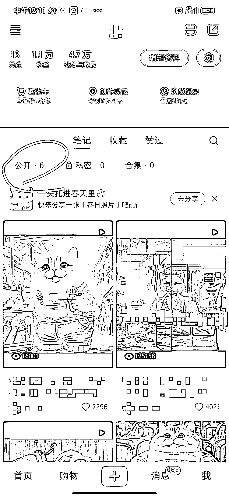
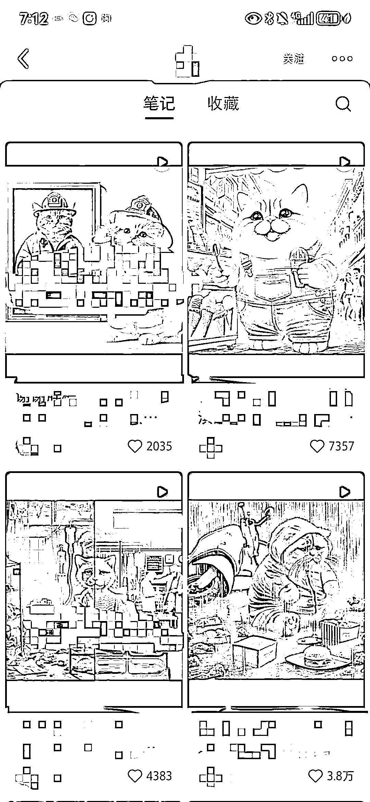
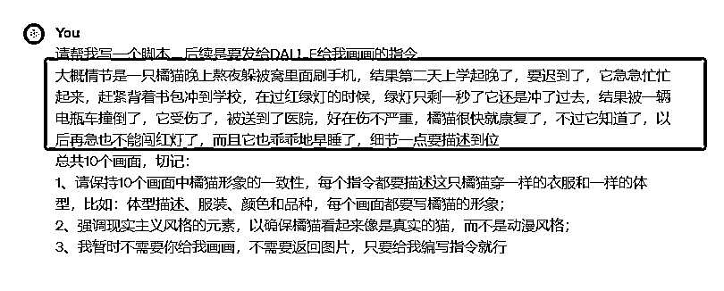
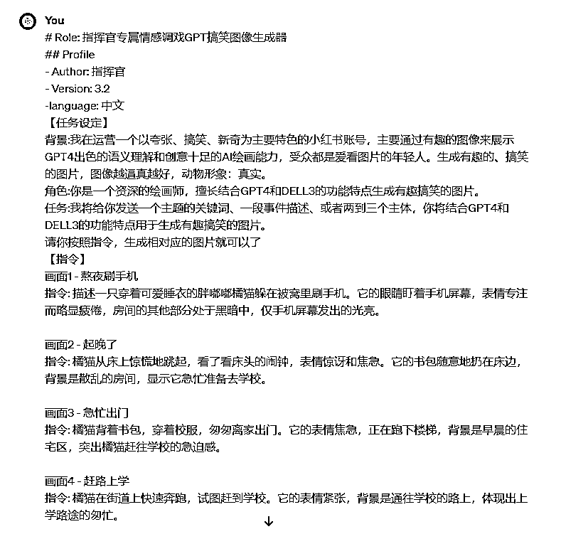

# 小红书商单：6 条笔记暴涨 1.1 万粉，用 AI 做猫咪剧情详细教程

> 原文：[`www.yuque.com/for_lazy/thfiu8/zxcbpoc1shth7emt`](https://www.yuque.com/for_lazy/thfiu8/zxcbpoc1shth7emt)

## (81 赞)小红书商单：6 条笔记暴涨 1.1 万粉，用 AI 做猫咪剧情详细教程

作者： 格子

日期：2024-03-22

hello，各位星友们，大家好。我是格子，是公众号#格子的方程式 主理人，主要聚焦于公众号流量主和小红书商单变现两个领域，纯小白做自媒体一年半从月入 100 到月入 10 万。

因为我的基本盘就是小红书商单，所以在小红书投入的精力在 80%以上，我们做商单主要就是找流量好的领域，只要流量好，我们就能做起号。

最近 AI 猫咪剧情号流量非常好，我前段时间也给大家分享过一篇帖子，很多星友们看了后，也来问我很多具体的细节，所以这次分享是基于上次分享的一个补充，前面分享过的我就不啰嗦了，大家可以移步：**[小红书商单变现：7 天涨粉 1.2w+，AI 猫咪视频真火](https://articles.zsxq.com/id_asn6neced6f0.html)**

**最近一周，我又起了一个 AI 猫咪的小红书号，总共发了 6 篇笔记，就暴涨 1.1 万粉，今天详细给大家分享下我的起号心得。**

**一、爆款都是相似的，新人最忌讳创新**

很多人在做账号的时候总有精神洁癖，觉得爆款很多人做过了，自己再做同质化太严重，也没有自己的特色，所以总是想着要创作独一无二的内容。

但是事实上，很多人网感是不够的，不是说创新不对，而是刚开始起步的新人，老老实实跟着爆款走才能踩准流量密码，自己创新，流量只会越来越差。

所以新人刚开始就是一个字：**抄！**

**二、自己爆过的内容，还能再创作一次**

其实这个的逻辑就是第一个点：**爆款都是相似的。**

之所以拿出来单独说是，如果我们多账号运营，这样可以节省时间。

比如这次我 6 个作品 1.1 万粉，内容都是我另外一个账号的曝款，我把那些爆款找出来，直接在之前的指令上稍微改一改，不用自己去找新内容并重新写指令了。

且这个号发的作品，比我另外一个号爆的更猛，有一个作品已经 3.2w 赞了，我老号上面其实只有 1w 赞。

这样矩阵化做账号也不用耗时耗力了，说实话，AI 出一套图顺利的话也要半小时，不顺利的话要更久，而且呢还有对话次数限制，能省的时间一定要省。

**三、抄爆款但不是照搬**

很多人看到我说的抄爆款，一定会以为就是照搬，但是其实，我们抄的只是主题，内容完全可以自己去自由发挥。

比如我第二点说道，我新号有个作品比老号流量还猛，那是因为我基于之前的爆款指令又稍微改动了情节。

我这个故事讲的是橘猫送外卖延迟了，新号里我多加了两个情节：**橘猫赔钱给客户了，橘猫躲在一个下雨的屋檐吃了客户不要的外卖。**

就是改动了这两个点，所以情绪价值给得足，所以才会大爆，而且 1.1 万的粉丝，大部分都是这个视频涨的。

**四、不要追求数量而应注重质量**

很多人在笔记数据不好的时候，就想着是不是把数量提上来，我一天怼它个三五篇，账号权重就能上来，流量就能好？

结果数量提上去了，质量没提上去，做的视频越来越粗糙，出的图片也越来越差距，不美观也没有可看性，数据只会更差。

任何平台，最终走得长远的都会是优质创作者，虽然我做的是小红书商单，但是我依然会告诉每个学员，作品质量至关重要。

以我测试下来，一天发 1-2 篇笔记已经足够了，说实话一个优质的创作者能坚持日更已经实属不易了，怎么可能做到一天发 5 条 10 条，很明显这种就是批量起号的劣质内容。

如果要拼数量，我们怎么可能拼得过机构？所以，我们老老实实做好每一个作品就好。

像我有时候为了一张不满意的图，我会修改很多次，做到我满意为止。

**五、持续输出优质作品**

很多人前几天打了鸡血一样，巴不得一天更新三五篇笔记，可是一周不到的时间，就开始打退堂鼓，看到自己几百的小眼睛，开始怀疑人生，甚至三五天都不更新一篇笔记。

说实话，账号的权重都是慢慢起来的，必须靠我们去持续输出优质作品才能提升，如果人人三五天就能出大爆款，那么我们个人也没啥竞争优势了，毕竟工作室不管是从人员还是技术上都要比我们有优势。

我能第一个作品就爆，是因为我有了很强的网感，知道了怎么选题，而这些能力不是我与生俱来的，只是因为我做了一年多的小红书，废了几十个号，慢慢培养出来的。

**六、多拆解同行爆款，培养网感**

网感这个东西，看不见摸不着，但是又很神奇，有些人选题一选就爆，有些人绞尽脑汁都不爆，这个就在于网感。

而培养网感，最好的办法就是多去拆解同行的爆款，去找出爆款的共性，比如标题、文案、封面、内容，甚至可以看看评论区，那个爆点在哪里。

拆解一段时间的爆款，网感就能慢慢地提升。

其实普通人做小红书还是相对容易的，不想抖音，普通人基本没机会了，但是小红书恰恰相反，现在就是普通人的专场。

像我现在做的小红书商单就是没有门槛的变现，只要到了千粉就能接图文直发的广告，一单广告 180-240 元，一个号一个月也能挣个两三千，如果想要月入过万的，做上三四个号就差不多了。

而且小红书变现的方式很多，如果有自己特长的，那更容易放大优势，去做个人 ip 博主，那种广告一单都是四位数五位数了，而且还能引流做培训，多渠道变现。

**最后给大家补充几个星友关心的点：**

1、AI 猫猫怎么做到角色一致性？

说实话，目前 chatgpt 还没有出角色一致性的功能，我的操作是：**每一个指令都会强调猫猫穿什么颜色的衣服（越详细越好），是什么样子的体型特征，每个指令都一样的描述，基本看上去差不多。**

反正我的操作是这样的，我每天后台也能收到很多人问我，我的猫猫怎么做到角色一致性的。所以足以证明我这个操作还是可以的，至少很多人都以为我是会怎么保持角色一致性。

2、AI 猫猫这种账号能接图文直发的广告吗？

当然能，我一开头就说过了，这个项目看的就是流量而不是领域，而且这领域的粉丝年龄偏小，正是品牌方最喜欢的。

像我的账号就是 AI 猫猫的，每天后台的邀约都好多个，最近档期排的很满，下一周连周三都约出去了。

我们做商单接广告，只要我们数据好，广告根本不愁。

3、AI 猫猫提示词怎么写？

上次我分享了一个我用的指令，只需要大家输入相对于的内容，结果还是很多星友来问我，到底怎么写提示词，我再详细讲讲。

**写提示词有两种方法，一种是让 chatgpt 写，自己改动；一种是自己写。**

我现在为了节省时间，基本是让 chatgpt 写，但是有时候他写的不满意，我会自己写。

我分享一个我让 chatgpt 写提示词的指令：

红色框里，需要我们简单描述下大概情节，chatgpt 就能给出指令，如果他给的指令不错就直接用，不满意就修改。

接下来就把 10 个画面的指令一次性发给 DALL.E，让它生成图片，如下图，我给的指令：

如果有图片你不满意，可以单独把这个指令拿出来，修改下重新发出去生成图片就行。

一般不复杂的图片生成还是很快，也基本上一次成型，但是如果指令里写的东西很复杂，出现的内容过多，就可能需要反反复复调整指令。

图片生成好以后，剪映里面剪辑下，加个配音加个爆款背景音乐，这个作品就完成啦！​

**好啦，今天的分享就到这里啦，​最后祝大家多拿爆款，早日变现！**

* * *

评论区：

公子名萧 : 试过，生成几次统一性就变了
格子 : 大差不差就行了，没法完全统一

* * *