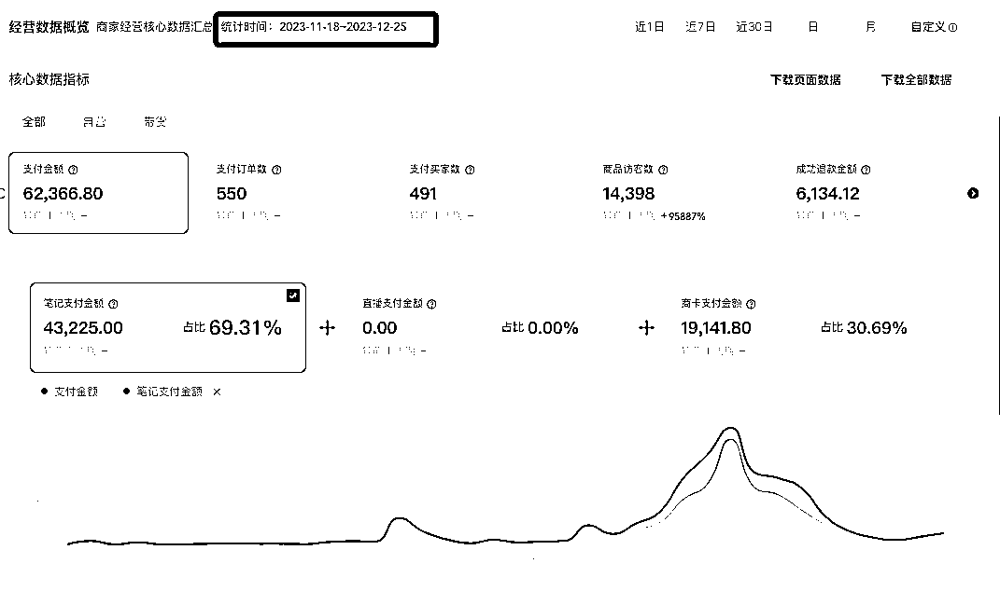
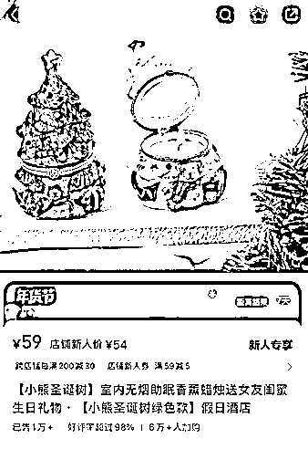
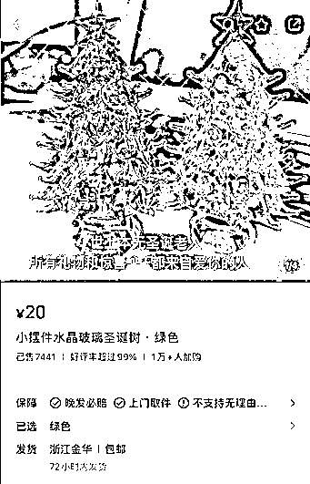
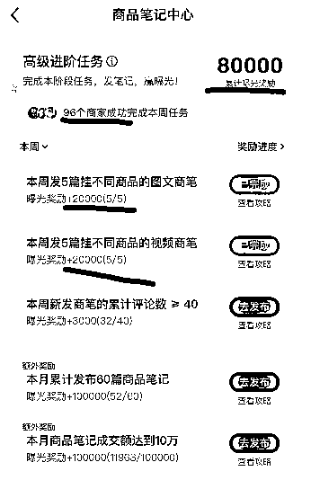
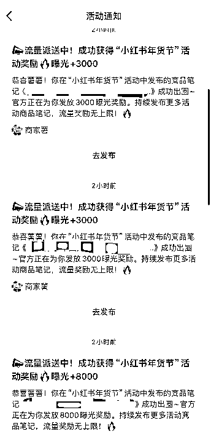
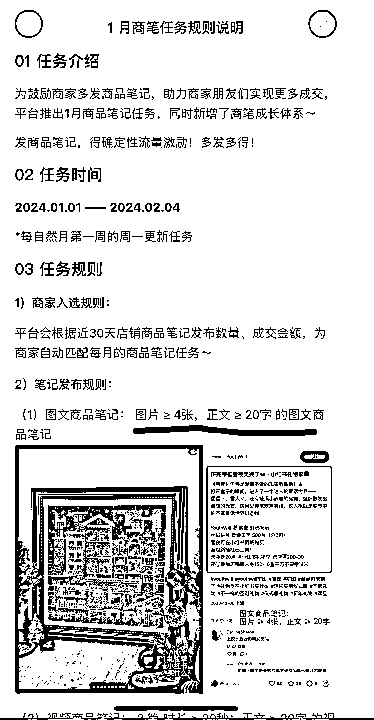
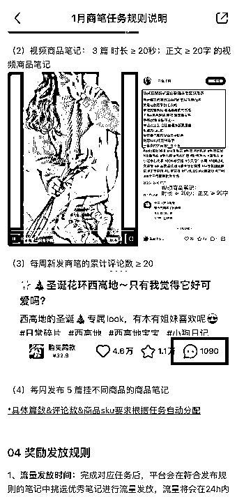

# 抓住节日机会在小红书卖礼物，我的爆品秘诀分享

> 原文：[`www.yuque.com/for_lazy/thfiu8/slbd9i84z6fcg0et`](https://www.yuque.com/for_lazy/thfiu8/slbd9i84z6fcg0et)

## (36 赞)抓住节日机会在小红书卖礼物，我的爆品秘诀分享

作者： 霖霖

日期：2024-03-22

跟着平台活动走，有饭吃。

去年 11 月我在小红书卖圣诞节香薰礼品，0 粉就开始发表第一篇日记带货，到圣诞节结束时，最终取得了 GMV6W+。

能拿到这样的结果，主要是跟着平台的规则走，抓住节日营销活动，得到了很多免费流量。靠着这样的方式，如今我的小红书店铺仍在稳定运营，产品也从圣诞节主题转变为其他类型的商品，一直拿到不错的结果。

在接下来的时间里，我将详细介绍项目背景、选品策略、工厂沟通与供应链备货的关键步骤，以及我在运营阶段的心得体会和平台笔记任务的宝贵经验，帮助刚进入小红书的新手快速获得正反馈。

大家好，我是霖霖，作为一个曾经的大厂女工，也来到了职业倦怠期，开始了副业探索之路。一度有些迷茫，也做了一些小项目，但是小红书一直没有涉及，直到 11 月份，想试下小红书，于是开启了下面要讲的事情。

# 一、项目成绩

23-11-18 发第一篇小红书日记，此时还是小红书纯小白，粉丝为 0。直至 23-12-25 圣诞节结束，GMV62，366.80。

数据截图如下：

至此，小红书完成 0-1，目前这个店铺还在正常运营，不过圣诞节过了，已经换成其它产品了。下面我讲一下整个项目的操作思路，希望对大家有益。

# 二、项目背景

11 月份的时候我想尝试下小红书电商，对于没有稳定且优质供应链资源的我，想快速拿到正反馈，必须找一个蓝海领域切进去。

但基本上我能想到的产品大家都在卖了，从新奇特商品特性或者搜索上都很难占到优势（小红书笔记和搜索还是占有流量的）。

当时是 11 月 18 日，距离圣诞节还有 1 个月的时间，节日肯定是刚需嘛，尤其是在小红书做圣诞节。

于是我搜了一下圣诞节的关键词，可以看到很多 2022 年小红书圣诞节主题的笔记很出圈，于是我就把项目锁定在圣诞节送礼这个范围了。

# 三、选品

（此时我还没加入生财，还没看到过生财小红书的相关资料，所以都是靠过往经验选品）

我先在小红书上搜了一下“圣诞节”，发现已经有人在 9-10 月份就开始销售圣诞节礼品了，布局是真早啊！这两款产品当时都有了 2000+的销量：

于是我开始在 1688、淘宝、拼多多上搜索选品了，选品思路如下：

1.价位在 50-80（思考时间少，转化率高）；商品毛利在 40%-50%；

2.新奇特，但不能太小众，可以做团购/公司福利；

2.颜值高，拍图出片，有氛围感；

3.最好有礼盒或者圣诞礼袋，送礼拿得出手；

最终选品为：

1.  主推品：2 个圣诞香薰礼盒（单价 50-70），毛利 50%；

2.  中长尾：4 个圣诞相关的产品；毛利 30%-40%；

选品时，我避开了以上两个博主的产品，因为他们笔记要早于我 2 个月，我觉得在搜索和发现上没有优势，而且他们当时都有了千粉的基础，我是 0 粉。

最终我选的香薰礼盒当时在小红书上还没有销售痕迹，颜值也比较高，我相信一定会有一批用户像我一样被吸引。而且这两个香薰礼盒很适合送客户或者做企业团购，为此我专门给这两个款配备了圣诞限定礼袋。

# 四、工厂沟通与供应链备货

**（1）工厂沟通思路和云仓选择**

工厂是从 1688 上选的。其实从工厂页面，能初步判断这个工厂具备的一些实力和电商运营能力。我是按照下面的思路和工厂沟通的：

1、合做之前先和工厂打电话，一定要打电话，联系到老板，加到老板微信；因为如果货品紧缺，老板能优先给我们排单，这个是救命的，但是 1688 上的客服不一定有这个权力。

其实和老板沟通产能的时候，就能判断工厂的实力了。注意听老板的语气和用词的精确度。

2、如果工厂不能代发，那就要提前找好离工厂最近的云仓。

A.其实这个时候我还不知道小红书每天只有 20 个解密收件人名额的限制，纯粹是因为云仓效率高，成本低。

B.我做的是节日型的产品，用户对时间要求很高，选择云仓的时候要选择离工厂最近的云仓，这样当工厂有货的时候就可以用货拉拉拉货了，当天就可以到，效率最高；

而且不用麻烦工厂发货，只需要备好货我找人去拉，工厂老板也省事，我也省了很多运费成本（货拉拉的运费低于工厂给我发货要收的运费）。

**（2）说说我遇到的工厂**

在这说下我做圣诞节这个货盘遇到的其中 2 个工厂：

1、香薰礼盒工厂，因为这个品上架第二天就开始出单了，所以我对这个品报的希望还是蛮大的，所以前期和工厂沟通比较多。

不仅加了老板的微信，还不定期在旺旺上和客服沟通了解货品情况。前期也为了确定工厂产能，和老板提出要做一些定制品，自己给出一定的定制数量，看看老板什么时间可以交货，进而了解工厂产能实力。

另外，为了预防某个批次货不对版，前期我也会隔几天买几单查看下具体情况（可以不用担心成本，因为这些样品可以作为大货去销售的）。

2、陶瓷工厂：其实从最开始我就知道这个工厂实力不太行，沟通的时候可以感觉到，店铺客服应该也是老板自己在做。

但是这个品我已经沟通了好几家工厂了，成本就这个工厂稍微好一些，再加上老板沟通比较顺畅，就和这个工厂合作了。

不过幸亏这个品不是核心产品，因为到圣诞节前 1 周左右，老板的产能真的不足了，原本 24 小时就可以发货，一直拖到 24*4 小时才能发货了，所以就做了预售了。

因为供应链是根本，大家在选择合作工厂的时候一定要全方位考虑，找到最合适的工厂以及云仓。

# 五、运营阶段

**（1）运营心得**

我是 0 粉纯小白，所以发第一篇笔记前看了很多同类笔记，总结下来有这几点心得：

1、0 经验起步的时候：多看平台互动/话题/多学爆款，多看优秀笔记；封面很重要。

2、学习平台规则，和平台共创话题：小红书在 12 月份推出了“圣诞礼物季”的活动，也给商家定制了笔记进阶任务，我一共得到了平台 27.5w 的曝光助力值。

3、调整好心态，管理好时间：如果不是跟爆品，纯粹测新品，心态很重要，千万不能自我崩溃，慢慢来，有时勤能致富；还记得加入生财后看到一个圈友说发笔记好像在存钱，存到一定数量后钱就多了。

4、管理好时间版块，如果是一个人的情况下，运营、供应链等做好时间分配。

我是一个人运营这个项目，前期时间精力主要在选品、供应链上；后期精力就放在了发笔记上。

**（2）平台笔记任务，新手的流量秘籍（这个是本项目的关键）**

这个想重点说下，尤其是对于新手，很有帮助的。

1、开店之后点击到“商品笔记中心”可以看到每周和每月的任务，如果达成任务，平台会给予相应的流量奖励。我认为这个是“勤能致富”的关键，平台也在鼓励那些和平台共创的人。下图是我 1 月份截止目前的任务进行情况。

2、商家薯会识别优质笔记给予额外流量扶持，所以要多看优质笔记。每次收到商家薯推送的流量奖励通知，是我最开心的时候了。

所以大家一定要多学优质笔记、多发笔记，才能得到平台的奖励。

**（3）商笔任务规则说明（了解平台规则才能更好得到流量）**

# 六、建议

**（1）新手做小红书前先思考下自己的优势，把优势放大。**

1、卷直播还是卷笔记？我的优势是笔记

我是一个人做小红书的，前期也直播了几次但是观看人数很少，我也没有直播经验；相对于直播而言，我更擅长笔记，所以我决定努力卷笔记（也是从最开始介绍的两个博主那看到了仅靠笔记出单的希望）。

2、是跟爆款还是做新品？我的优势是选品能力 OK

我有过电商工作经验（非小红书），也比较擅长选品；从概率上来讲，同样的产品我觉得粉丝基础量大的更容易爆，且他们的笔记发现和搜索都会比我的权重高（我是 0 粉），所以差异化竞争，我选择做小红书纯新品。

事实证明，虽然我这次也取得了正反馈，但是晚于我上架同样产品的千粉博主取得了比我更好的结果。

**（2）新账号做一下账号定位和包装，更容易涨粉**

做了一个多月小红书，感觉垂直类账号涨粉更容易。所以如果我做圣诞节，会把账号包装成一个礼品账号（名称、背景图片、笔记封面）

**（3）了解平台规则，从平台拿到免费流量。**

我这次就是因为平台商笔任务完成，扶持了很多流量，才有了这个小结果。

**（4）新手想快速拿到正反馈，但是不知道做什么类目的，可以考虑节日型产品。**

比如接下来的春节（现在做太晚了）、情人节、妇女节、儿童节等等。

节日产品是刚需，只要提前布局，选品正确就能有结果。

希望以上可以帮助到想做小红书的你！

* * *

评论区：

芷蓝 : 送礼这个场景是永久的刚需
霖霖 : 找一个合伙人，有没有一起的

* * *