# 小红书商单蒲公英数据查看&广告数据维护

> 原文：[`www.yuque.com/for_lazy/thfiu8/qdp7xcck0zd6chc7`](https://www.yuque.com/for_lazy/thfiu8/qdp7xcck0zd6chc7)

## (21 赞)小红书商单蒲公英数据查看&广告数据维护

作者： 棠溪

日期：2024-03-21

小红书涨粉起号其实并不难，但是账号涨到千粉之后开始接广告就会面临没接几条就接不到广告的问题。

所以这一篇教大家如何去查看自己的蒲公英数据以及广告数据维护。

# 数据查看

蒲公英网址：[`pgy.xiaohongshu.com/`](https://pgy.xiaohongshu.com) （手机电脑都可以打开，要用登录的账号扫码）

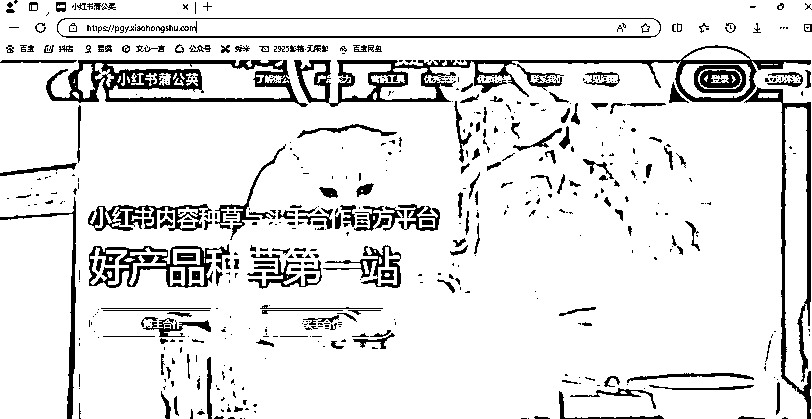

用小红书账号登录，手机端扫码登录：我的页面-左上角三条杠-下面有个扫一扫

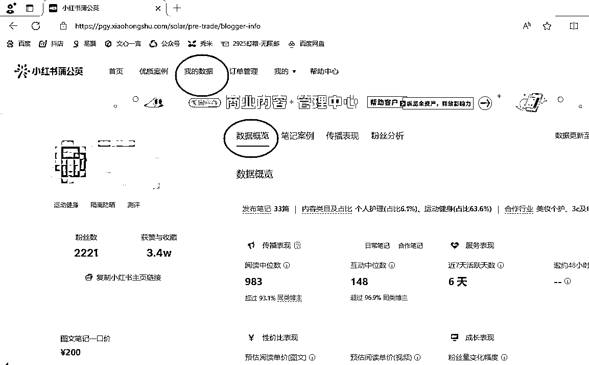

点击我的数据就可以查看自己的数据了。

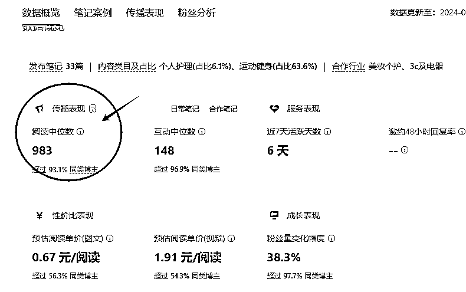

这个是**阅读中位数**，最低要求是 1000，到不了 1000 就是内容出了问题。想办法提升阅读量，找近期爆款选题去做。

另外数据太低的作品可以删除掉，从最差的开始删，但是一天不要多删，删 1-2 条就可以，每天删除一点，这样也可以提升中位数。（不过最重要的还是内容的提升）

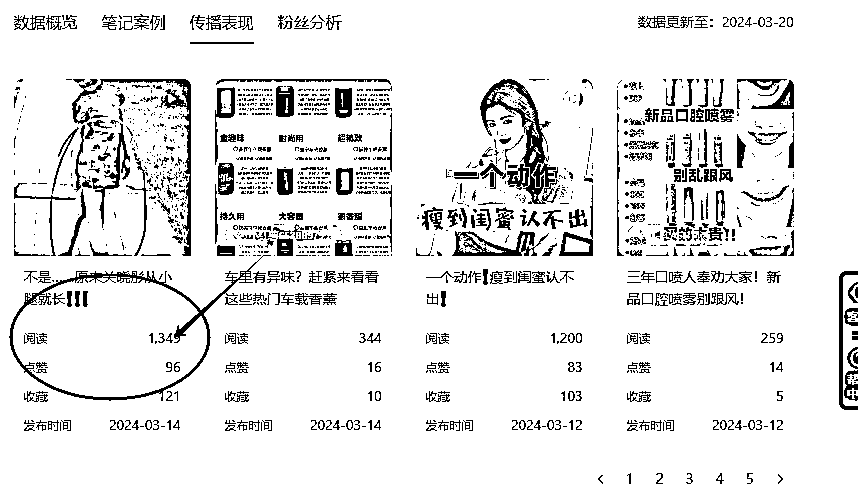

这个是**单篇笔记数据，**这个阅读量对比小红书账号端看到的基本要低 4.50%，因为这个算的是有效阅读量。

我这篇笔记后台看到的小眼睛是 2000 多，到这个上面就是 1349。

这里日常笔记要求的就是每一篇达到 1000，指的就是蒲公英看到的有效阅读量。

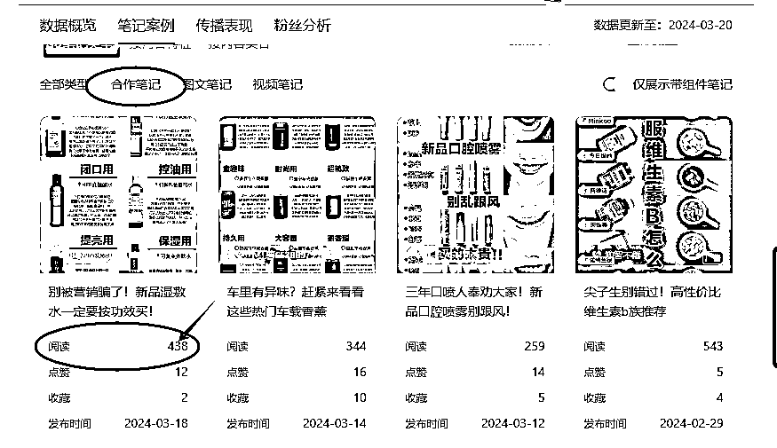

这个是**合作笔记阅读量**，也就是广告数据。广告数据的要求是单篇阅读量达到 200 以上。

这个阅读量对比小红书后台的要更大打折扣，所以说在小红书后台看到阅读量是 5.600，这里的阅读量不一定能达标。

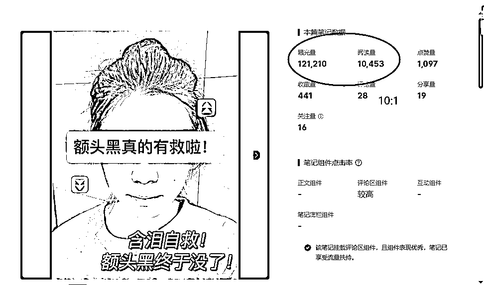

点击笔记进去，可以看到**单条笔记的曝光量和阅读量**，这个曝光量的比例应该,10:1 左右，如果不是的话，说明数据有点问题，哪个低需要补哪个。

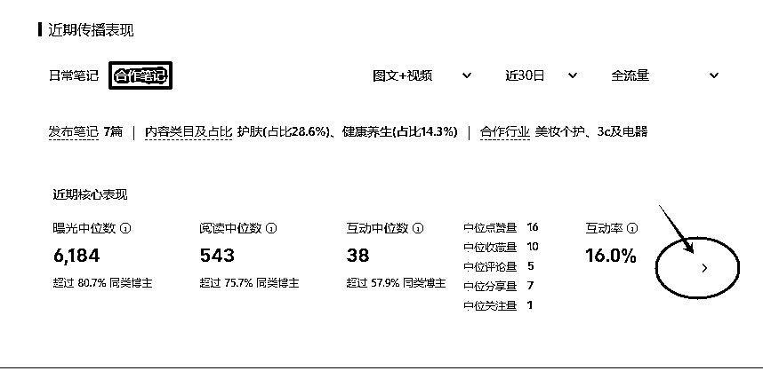

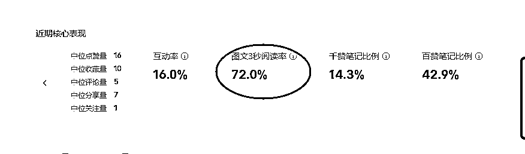

再往下滑可以看整体数据，点击箭头，可以看到一个**3 秒完读率**。

这个要求一般都是 50%以上

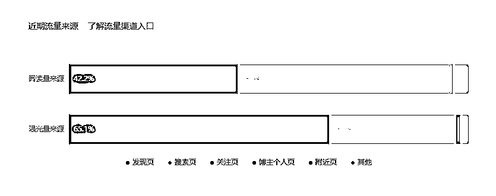

这个是**深蓝条和浅蓝条**，也就是发现页的曝光量和阅读量还有搜索页的曝光量和阅读量。

这个是非常重要的一个指标。如果前面的数据都没有问题，还是接不到广告，大概率就是这里的数据出现了问题。

大部分品牌方会要求浅蓝条数据高，占比在 50%以上。如果浅蓝条低的话就去补浅蓝条。

# 数据维护

上面讲的是中介会看的一些数据都是在哪里找，这里讲我们的数据如何去进行维护。

一般品牌方的要求都是**日常中位数过千**，每篇日常笔记过千(如果广告数据好，也会适当降低要求)

广告数据的要求每个品牌方不一样了

大致就是**每篇广告阅读 200+，浅蓝条占比 50%以上，三秒完读 50%以上**

有些会要求广告数据有起伏，如果都是 200 阅读量的话，可能会觉得你是刷的数据，所以最好能有起伏

如果接不到广告，就是数据有问题，所以要对症下药

## 一、日常数据

日常数据主要还是靠自己作品内容，这个就是去优化自己笔记的内容。

对标爆款视频，模仿爆款视频的选题，从内容上入手。

数据太差的作品可以删除掉，注意一天只能删 1.2 条，不要删多。

日常阅读量也可以刷，如果账号千粉后限流，也可以去刷日常数据，然后接广。

去衡量一下产出比，只要是能赚钱的，就可以。

但最好还是从内容入手，去解决问题。

## 二、广告数据

### 1、阅读量

广告阅读量最低要求是 200，每篇广告的阅读量都要在 200 以上，这个以蒲公英后台数据为准。如果阅读量不够的，需要去补阅读量，价格在 10 几块钱。

### 2、浅蓝条、深蓝条

也就是发现页和搜索页的曝光量和阅读，缺哪个数据补哪个数据。

浅蓝条数据最好占比 50%以上，这样好接广告。

如果你的数据有爆广的话（阅读 5000 以上），对浅蓝条数据要求不大，很好接广。

但是需要注意，**浅蓝条和深蓝条的占比要对的上**。

也就是曝光量和阅读量成正比，一般都是 10:1，差距一点点没有关系，差距大了差哪个补哪个。

这个可以去单条笔记曝光量和阅读量里去看。

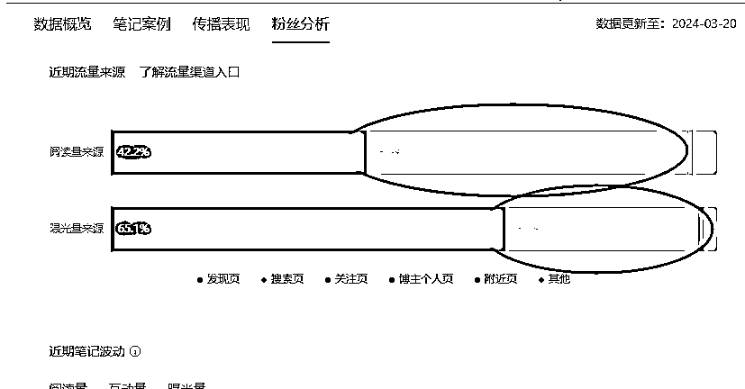

比如说我的搜索页曝光数据就不对，很明显少了，所以我就需要补充这个数据。

这个时候打开单条笔记数据去看，哪一个差距比较大。

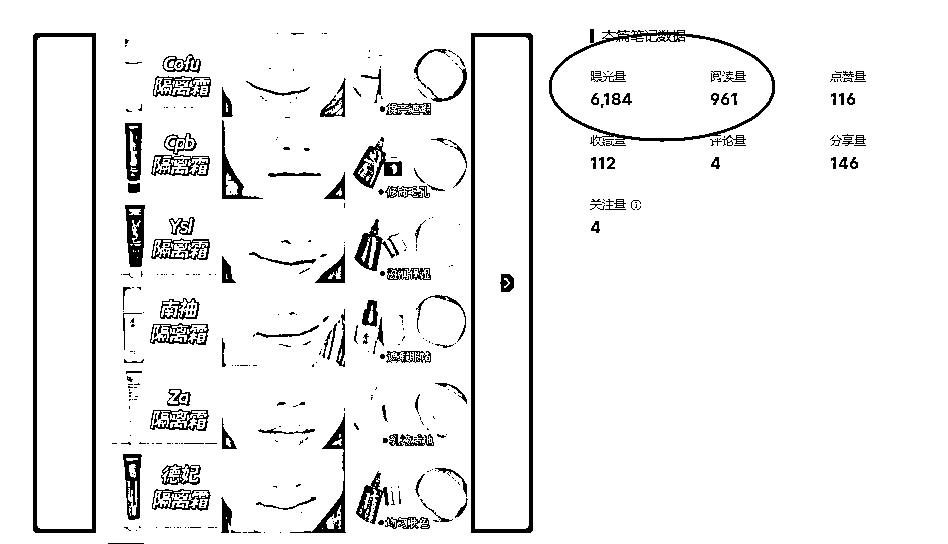

那我的这条数据，阅读量在 900 的情况下，曝光量应该在 9000 多，就属于少了，这个时候去补 3000 搜索页曝光就可以。

### 3、3 秒完读

3 秒完读最低要求都是在 50%，

### 4、账号数据起伏

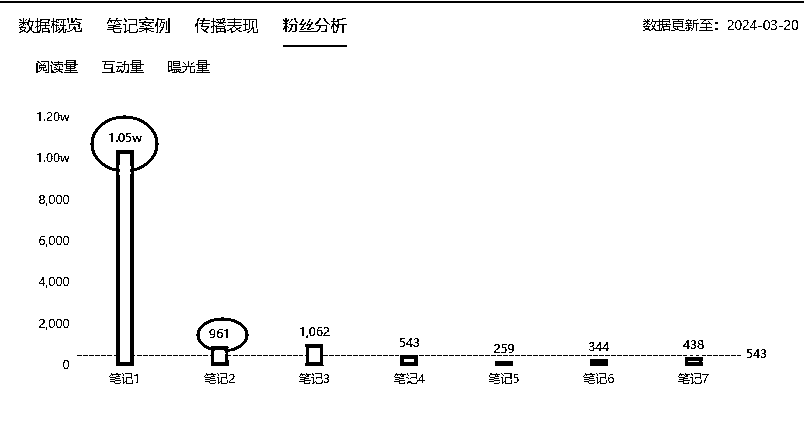

阅读量往下划可以看到有个粉丝分析，这里能看到你近期广告数据的阅读量条形图。

有些品牌方会要求账号数据不能太平，如果你每条广告数据都在 200 左右，没有大的起伏。

他会觉得你这个账号没有潜质，投上去不容易爆款。

# 写在最后

千粉之后，我们的账号数据是很重要的，一定要维护好，这样才可以接到广告。

差哪个数据就补哪个数据

最后祝大家都能千粉，广告不断！

* * *

评论区：

暂无评论

* * *