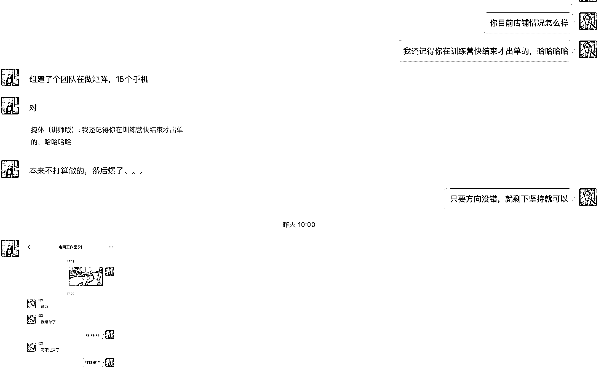

# 国内 AI 代写 top 级别，给赚钱圈友讲清楚最近火的 AI+代写到底是啥！

> 原文：[`www.yuque.com/for_lazy/thfiu8/zx9cs04msre84kwl`](https://www.yuque.com/for_lazy/thfiu8/zx9cs04msre84kwl)

## (93 赞)国内 AI 代写 top 级别，给赚钱圈友讲清楚最近火的 AI+代写到底是啥！

作者： 掩体

日期：2024-03-18

大家好，我是掩体，目前国内做 AI 代写的 top，也是最早加入放大 AI+代写这个领域的团队，目前有几百人跟着我们一起弄。

最近老有圈友私信我，说看我在生财的帖子关于 AI 代写的文章很厉害，能不能带带他，和他深入沟通了一下，发现他对这个行业一无所知，就是看我秀学员的肌肉（交易额）有点羡慕。

想想也很正常，每个人精力都是有限的，不可能把每个行业都了解清楚，光看别人挣钱，不懂逻辑，那我今天就来把这行业给大家讲清楚。

为什么经常看到有人晒自己一个月收入几万（首先肯定是真的）

肌肉截图（成交截图），我就不秀了，感兴趣可以翻一下我之前写的文章。我就直接开始了。

[19 年创业失败，23 年利用 AI 在代写行业杀出一条全新业务线，从 0 到 100w 全程分享。](http://mp.weixin.qq.com/s?__biz=MjM5NjIxNTUyMA==&mid=2447598818&idx=1&sn=0f417b035f5b89dfc4532a13e0a7fcbd&chksm=b2fb6b6d858ce27b0482b5d85882ca569d39ae09f79bb3945fe3067537c00f8cfb584c90ddeb&scene=21#wechat_redirect)

**讲解代写逻辑**

代写是什么？讲得简单点就是，顾客有写作的需求了（演讲稿、PPT、论文指导、主持稿、会议总结、周报、年报、小说等，反正你脑子里能想到需要写的，基本都会碰到有顾客需要写）。

顾客会通过电商平台找到你，你和顾客对接需求、价格、交付时间，确定没有问题，顾客支付。你开始帮忙写做交付。

这种代写需求长久吗

**马斯克有一个第一性理论：这要东西要是之前就存在，那它大概率未来还会存在！**

代写已经存在好多年了，那它未来也会存在。

**要是人问店铺应该很多了吧，还有机会吗。这个时候我都会让他出去，懒得和他废话。**

当然**整体代写的单子其实可以分为三部分：流量端（运营店铺）+售前（对接顾客需求）+交付端（写手），想要稳定挣钱，这三端是缺一不可的！**

最近市面上出现一些低价的文档，里面也说了代写的 pdd 开店逻辑，我很肯定的说，看这个文档不光连流量端都跑不起来，还要赔上 1000 押金，只能说坑到极致，**为啥这么说，看到后面你就懂了。**

关于交付端**重点来了：**

**之前没有 AI，普通人很难入局，因为你写作能力和时间保证不了。有了 AI 交付难度降低，普通人可以作为副业入局。**

**又来重点了：目前 AI 工具能解决多少需求？要是 1 年前可能 60%，现在我可以保证，90%，除非是碰到理工的画图等，其他都可以通过 AI 解决。**

这里推荐几款 7 款最近国内新起的 AI 工具，用在代写上好用到爆炸！

### **1、文心一言**

费用：免费

性能：5 星

功能：最了解国情，擅长写公文体。

形态：网站、app

链接：[`yiyan.baidu.com/`](https://yiyan.baidu.com/)

### **2、Kimi**

费用：免费

性能：5 星

功能：长文档阅读、互联网最新信息

形态：网站、app、微信小程序

链接：[`kimi.moonshot.cn/`](https://kimi.moonshot.cn/)

### **3、智谱清言**

费用：免费

性能：4 星

功能：文档阅读、互联网最新信息、AI 智能体助手

形态：网站、app

链接：[`chatglm.cn/main/detail`](https://chatglm.cn/main/detail)

### **4、秘塔写作猫/秘塔搜索**

费用：暂时免费

性能：5 星

功能：文档优化纠错、实时互联网搜索、文献出处

形态：网站、小程序

链接：**秘塔搜索的链接：**[`metaso.cn/about-us`](https://metaso.cn/about-us)

### **5、chatPPT**

费用：每天能免费做一个

性能：5 星

功能：输入一段话直接写 PPT。

形态：网站、WPS

链接：[`chat-ppt.com/`](https://chat-ppt.com/)

### **6、飞书妙记**

费用：免费

性能：5 星

功能：视频转文字，解决看视频做总结的需求

形态：网站

链接：[`www.feishu.cn/`](https://www.feishu.cn/)

### **7、道客巴巴**

费用：免费

性能：5 星

功能：查文献、硕士论文文献

形态：网站

链接：[`www.doc88.com/`](https://www.doc88.com/)

**售前（对接顾客需求）**

真得很重要！对接顾客需求很重要，因为如果连顾客需求都沟通不清楚，那就不用谈交付了，有时候顾客自己都不知道自己真实需求是什么，这个时候就需要一位耐心的人去了解清楚顾客需要。

文章写作其实是虚拟商品，和艺术品一样没有固定价格，如果有人问你：我需要写 1000 字关于长征精神的演讲稿，多少钱。你怎么回答？肯定一脸懵！

而且顾客需求五花八门，别说刚入门的新手，就连我有时候会碰到各种各样奇葩需求

有的时候真想打人！但顾客是上帝，我们要服务好每一位过来咨询的顾客，除非真的想打他。

**这里有一个小技巧：要是方便语音通话，最好可以语音沟通这样成功率可以翻倍，而且还能要到高价!**

**流量端（运营店铺）**

最重要，因为流量端可以拿到 80%~70%的交易额 ，所以我们也是优先教授流量端，大家过来也不是为爱发电，都是为了获得一份工作之外的报酬。

咸鱼、淘宝、拼多多虽然都是电商平台，但平台引流规则可是千差万别尤其是对于代写行业，稍有不慎不光浪费时间，而且可能淘宝、拼多多押金拿不回来，所以我说那个文档坑的原因。

前期重点运营咸鱼平台，主要原因

①咸鱼平台不需要交押金，属于 0 成本②前期只要运营到位，比较好获取爆光，而且出现违规惩罚小③2~3 个月挣到 1 万+还是比较容易。

**咸鱼平台性质和其他平台不一样，不光是它是一个二手平台，它还是机会均等的平台，不像淘宝拼多多需要氪金而且还要 1000 押金，但淘宝拼多多也有好处，运营起来比较咸鱼接单更稳定。**

前期对咸鱼的规则基本掌握了，因为咸鱼不需要押金，不需要投放，只要你跟着课程走，自然流量就眷顾你，而且违规的话不至于直接封号属于小白福利。

**但也有一个弊端：自然流量它不会持续眷顾你，想要有持续流量，就得做拼多多和淘宝。**

所以要是有条件可以在运营完咸鱼再去运营淘宝和拼多多平台。

你可能会说，那我不运营啦，学会 AI 写作，我去淘宝当写手做交付是不是也可以挣钱，**恭喜你，你真聪明！我就是这么干起来的。**

代写适合普通人吗，我的回答：是的，但也确实很浪费时间，你要是抱着靠代写一个月几十万，大概率是不会，但运营好一个月 1~5 万还是有可能的。

当然你得把我说的**流量端（运营店铺）+售前（对接顾客需求）+交付端（写手）**三端都搭建好！

**上面就是关于代写行业的全部逻辑，如果还有不懂的~额，权当是我写的有问题吧！**

* * *

评论区：

胖大魔 : 掩体老师行动力嘎嘎强[奸笑]
掩体 : 哈哈哈哈
纯洁的微笑 : 优秀是一种品质！
阿七 : 下午说要写笔记，晚上就干出来了
掩体 : 最近主打输出爆棚
小鹅 : 怎么偷我的工具介绍！！！[再见]
掩体 : 哈哈哈哈，跟着鹅总混 一天吃 8 顿
颜 : 感谢分享，很清晰。

* * *