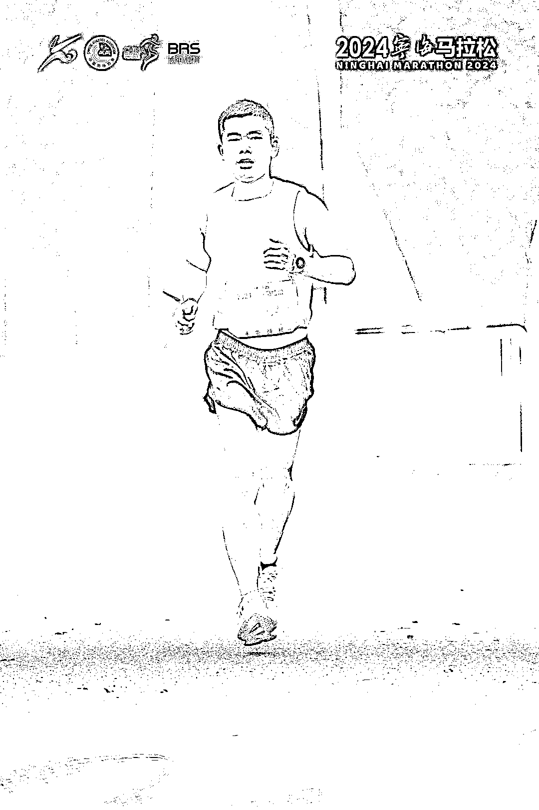

# 如何用 AI 辅助小白 3 个月完成人生首马，340 完赛？

> 原文：[`www.yuque.com/for_lazy/thfiu8/as56p46vtkgr7gx4`](https://www.yuque.com/for_lazy/thfiu8/as56p46vtkgr7gx4)

## (8 赞)如何用 AI 辅助小白 3 个月完成人生首马，340 完赛？

作者： 袁六伟

日期：2024-03-22

如何用 AI 辅助小白 3 个月完成人生首马，340 完赛？

你好呀，我是月入 10 万+的指令工程师、AI 指令 MCN 创始人，旗下 200+个指令工程师。

当一个人知道为什么而活的时候，他就可以忍受任何事情。

我在 2017 年得肿瘤后，经历过生死，术后恢复中，我在一本书里看到 Flag 狂人戈达德的故事。

在 1939 年，正值第二次世界大战，所有人都在战争的阴影里，一个叫约翰·戈达德的 15 岁小男孩，在家中的餐桌上，立下了人生中的 127 个 Flag。

更狠的是，他还把这一长串人生清单，寄给了当时美国著名的《生活》杂志，向所有人公开了去世前希望完成的事情。

他当年的人生目标，每个看起来都很难实现。

去世界第一长河尼罗河探险，在埃塞俄比亚等地研究当地原始文化，攀登世界海拔最高峰珠穆朗玛峰，乘坐潜水艇潜入海底，学吹笛子和拉小提琴，驾驶飞机并在航空母舰上起降以及阅读《大不列颠百科全书》等等。

不可思议的是，在戈达德 70 岁时，已经完成了当年写下的 109 个目标。

他的一生过得非常充实—环球航行 4 次，拥有了各种奇特人生体验：养猎豹、制造望远镜、作曲、当大学老师.甚至包括参演《人猿泰山》。

从此以后，我把他列为我的人生偶像。

2019 年 30 岁这年，立下了一生的使命：活出 100 种人生，每一个也都不简单：八块腹肌、买车买房、出书等等。

分享目录如下：

1 为什么跑马拉松？健康是创业者最大的护城河
2 十二周的训练计划
3 枯燥无味的赛前准备
4 赛中的补给和配速策略
5 赛后一周的快速恢复
6 首马后的一些人生感受
7 AI 跑步教练的能力边界

戳链接看具体详情

我们很幸运，生在这样一个美好的时代，通过 AI 做成之前一件件做不到的事儿，过更有意思或有意义的人生。[`fl2dhgx3i3.feishu.cn/docx/UQvcdjFOIo4zK8xQQiYcmK7sndy?from=from_copylink`](https://fl2dhgx3i3.feishu.cn/docx/UQvcdjFOIo4zK8xQQiYcmK7sndy?from=from_copylink)

* * *

评论区：

暂无评论

* * *