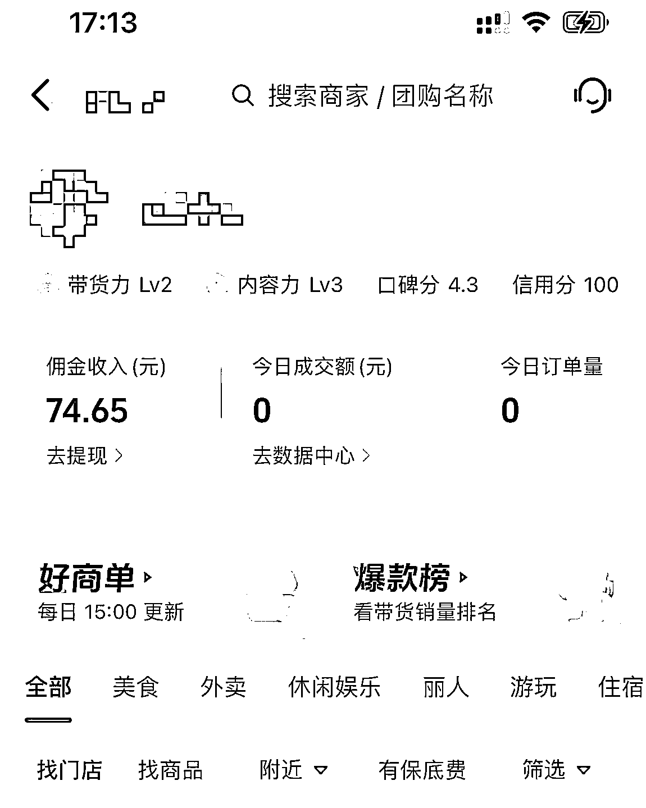

# 我为什么放弃做月入过万抖音本地生活号

> 原文：[`www.yuque.com/for_lazy/thfiu8/dqvryif4lo3gro3r`](https://www.yuque.com/for_lazy/thfiu8/dqvryif4lo3gro3r)

## (68 赞)我为什么放弃做月入过万抖音本地生活号

作者： 莹火虫💋

日期：2024-03-22

你是不是经常刷到一些博主或者公众号说自己做本地生活爆单，然后晒收入都是佣金过万，然后很心动想跟着一起做。

这篇文章我从亲身经历出发分享以下三点：

**1.普通人做抖音本地生活真实现状**

**2.素人账号靠什么赚钱？**

**3.素人账号怎么做才能赚钱？**

### 先说一下做本地生活号这两个月我的个人经历

我是怀孕了然后就在家休息待产，这段时间还想折腾点事，就正好年前看到了一个群里的分享，说到本地生活号不露脸不用拍视频，每天云剪就可以月入 5000+，我动心了。心想，那一天花个一两个小时，每个月多个几千块不是也挺香的。

这里导致我踩坑的原因就是，这是一个思维误区，原本以为的不用投入多少精力时间的事，结果可想就是做不起来。

我是从 1 月底就是年前开始做本地生活号的到今天差不多 2 个月的时间了，初期还报了 299 的课，边学边剪辑视频，尝试了很多品牌和品类，照着老师分享的对标做账号，做爆款视频的剪辑，中间也会自己探店拍摄一些不出境的镜头什么的。

前期就是堆量，多尝试，因为你只有堆量，做了之后才会有流量的反馈，才能找到爆款视频的规律。

群里会有老师帮忙链接品牌方，发定向佣金，只要每天发视频挂载商家位置就行了。云剪也会有老师教，素材可以自己找，也可以从商家那里获得。做好去重发出去就不会违规。

这期间我每天发 3-10 条视频不等，流量有两位数也有过万的，但是出单的真的很少。

整两个月我的佣金少的可怜，结合了一下自己情况，果断决定放弃这个项目。

#### 在此，我分析了一下不出单的原因：

1.云剪去重没做到位，视频被平台检测到限流了

2.执行力不到位，量没有堆上来，流量上来以后没有及时堆同款视频

3.品类不够垂直，什么都发，美食，丽人，门票、、、用户很杂

4.只做了一个账号，没有流量是常态

要知道，作为一个素人号做本地生活云剪，其实就是把自己的账号当成了一个广告窗口，每天发视频就是在发传单。摆平心态，不要有流量焦虑，发就行了。

#### 素人账号靠什么赚钱？

1.挂载团购位置的视频有人点进去下单并且消费了，赚 cps，一般都是 1%-%3，定向佣金会高一点。

2.商家合作，某段时间内发布的视频数量达到商家要求或者出单量大于一定数值，商家会给予投流或者现金奖励。

3.直播带货，带团购品。

#### 素人账号怎么做才能赚钱？

1.单账号做垂直品类，多账号做矩阵。

美食，丽人，亲子。。。不同赛道用不同的账号，就做垂直的。

2.学会跟爆款，学会看节日

群里有人在 3.8 节前期发的蛋糕视频在节日当天跑出了上万的销售额，佣金也过千了。爆了以后就一直堆蛋糕的视频，那几天佣金真的看的我们眼红。

3.随着自己做号的经验增加，后面也可以收徒赚学费逐渐向机构型达人转型。

做本地生活号的都是在怎么赚钱？

更高端的玩法可以看下这个大佬的文章，讲的很清楚。

[单月成交 6500 万，万字拆解本地生活，2024 年该怎么做](https://izhm9eu02g.feishu.cn/docx/AfhXdVeiQoM8HdxxLdQcInqonnb?from=from_copylink)



#### 那为什么能赚到钱，我还是会放弃？

这个就是我结合最近的自我情况（还有俩月要生了），主业（设计师）有更重要的项目需要耗费比较大的精力。随着个人发展目标的清晰，我也逐渐发现这个项目不适合我，所以放弃了。

如果你是一位宝妈或个体创业人员，对抖音本地生活号感兴趣，我的建议是：

首先认真考虑自己是否适合这个平台，是否能够承受起初期可能的低收入以及高投入的现实（投入精力，时间）。

其次，明确自己的目标，是否只是寻求一种轻松的赚钱方式，还是真正想要通过这个平台提升自己的品牌和影响力。

最后，不要害怕尝试，但也要懂得适时调整方向，找到最适合自己的路。

每个人的情况都是不同的，我的经历或许能给你一些启示，但最重要的是根据自己的实际情况做出最合适的选择。

有时候，放弃也是一种勇气，它为我们打开了新的可能性和机会。

在这个不断变化的社交媒体时代，找到属于自己的定位和价值，远比盲目追求短期收益更为重要。

希望我的分享能够对你有所帮助，如果你有任何问题或想要交流经验，欢迎留言讨论。

* * *

评论区：

Krystal YA* : 个人拙见：那些大号基本都是抓住了人性的贪痴嗔，他们之前很容易，而我们普通人摆脱不了自己的人性，成为“韭菜”，当我们被这种赚钱的形式吸引，知道底层逻辑，但是却无法坚持到底；哪怕走完一个闭环； 斯人如是！
在三亚卖金枪鱼和野生* : 我做本地团购，带了 10 多万 GMV，目前挣到 4500，还有一大半没有核销
莹火虫💋 : 你这个是做了多久呀
🌊达师姐 : 我跟着生财航海做本地生活-抖音团购，一年赚了 35 万，入局时间非红利期，而是 23 年初全国都阳了，当地一个局内人都不认识，从 0 做起，亦仁说每一个项目都能赚 100 万，我确信这是真的，这个项目的确赚不到啥大钱，但普普通的人赚点辛苦钱是完全能实现的
🌊达师姐 : 哦对，我也怀孕了，目前 8 个半月[呲牙]
几言 : 我也是做团购达人云剪辑的，目前做了一年了，说一些自己的看法吧

1.云剪辑达人目前还是赚钱的
2.做一个项目一定要有社群好的氛围和好的方法
3.做短视频这一块的项目，一定要起量
4.视频要起量，一定要提高效率问题，剪辑效率要高

我也接触过实探，门槛是会高一些，所以我一直在做云剪辑这一块，目前赚了 5 万左右，就花了几个月时间不到，我见过很多宝妈在做这一块，有一周 3 千佣金的，当然她是很情况的，一天起码 20 条视频左右，这个赛道目前赚钱的案例还是挺多的。

我主要想发表一下对抖音团购的一些看法吧，当然搬运混剪不是长久之计，当对于一些没有很多时间和技能的宝妈而言，就是去混剪还是好去执行的。
莹火虫💋 : 所以说不管做什么，执行力跟不上的都不行
几言 : 嗯嗯是的，还是看自己啦[玫瑰]

* * *