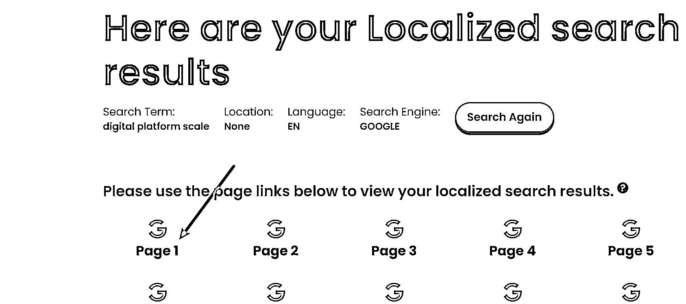

# 快速分析一个产品在海外有多大市场？B 端和 C 端市场分析

> 原文：[`www.yuque.com/for_lazy/thfiu8/aohv6ot2x0f63mgy`](https://www.yuque.com/for_lazy/thfiu8/aohv6ot2x0f63mgy)

## (35 赞)快速分析一个产品在海外有多大市场？B 端和 C 端市场分析

作者： 希声

日期：2024-03-18

年初去新加坡的时候认识了一位做传统线下大宗贸易的老板。

老板想移民到新加坡，但一是担心业务发展，二是需要新业务来更好地辅助他完成身份规划和落地。

我建议他可以转型做跨境 B2B 贸易。

于是就有了这篇文章，目的是为了回答这个老板提出来的问题：

*我怎么确定这个产品在海外有没有市场？*

*我要怎么知道这个产品在目标市场地道的英文名称？*

*全球这么多国家，我怎么选择哪个国家做贸易？*

为了隐私，这里我换了一个产品，让我们来实操看下。

假设我们要销售的产品是电子秤，更具体来说，是下面这个东西，用来称比较重的货物，在菜市场很常见。

# 确定产品的关键词

第一步，我们先需要确定产品关键词或者说是产品的英文名称，因为只有产品的名称有了，我们才能借助工具去查询这个产品的市场大小。

我们有两个办法，第一是用翻译器软件，比如百度翻译。

第二个办法是用 AI 工具。

让我们先试下百度翻译，翻译结果是：Electronic scale。

第二种办法，我们用 AI，这里我用谷歌的 gemini 来演示——当然你也可以用 Chatgpt 或者 claude 等 AI 工具，效果也差不多。

我们把产品图片作为附件传上去，然后写上提示词：

请告诉我图片中的这个产品的具体英文名称是什么？

可以看到，AI 的回答是 digital platform scale。

到这里我们就初步得到了这个产品的两个英文名称：

electronic scale 和 digital platform scale。

# 验证关键词是否正确

那么，到底哪个关键词才是正确的呢？

哪个关键词才能最准确地表达这个产品呢？

这是非常非常重要的一步，也是太多 B 端外贸公司在产品出海踩到的第一个坑：没有找到正确的产品关键词。

举个身边的例子，番薯。

在不同的省份和地区，番薯是有多种名称，比如有可能被称为“红薯”或者是“地瓜”。

在日本，红薯被称为“薩摩芋”（Satsuma-imo），而在美国，红薯又常常被称为“甜薯”（sweet potato）。

所以如果关键词不对，那么剩下的工作就将是在错误的道路上狂奔，都是在做无用功。

我这里推荐一个方法，就是用谷歌图片进行关键词和产品的相互验证。

我们打开谷歌图片，输入关键词：electronic scale，看下结果。

很明显，和我们的产品不一样，结果显示更多的是小型电子秤，和我们的产品不是很符合。

接下来我们试下 AI 给到的关键词结果：digital platform scale。

和我们的产品非常相似。

所以初步结论就是这个产品的英文名称应该是：digital platform scale。

为了进一步验证，还有个方法就是：

点开这些正确产品的图片，查看图片下面的名称。

我们可以多点开几个做参考。

通过点开不同的图片，我们能看到，这个产品还有种可能的英文名称是 electronic platform scale。

到这里我们就得到了两个比较具体的产品词，分别是：

digital platform scale

electronic platform scale

下面我们来进一步用数据来告诉我们，目标市场的客户到底更习惯用什么词来搜索，同时看到这个产品的市场/需求大小。

# 确定关键词的市场/需求大小

假设我们要做的市场是美国。

那么我们用关键词工具来搜索上面得到的关键词。

这里的底层逻辑就是：产品关键词在谷歌上的搜索量大小≈市场的需求大小≈产品的市场大小。

虽然用户在搜索某个产品时，可能通过多种不同的平台搜索，但对于 B 端用户来说，最符合直觉的搜索工具依然是谷歌。

关键词工具有很多，付费工具里面比较常见的比如 semrush，ahrefs，kwfinder 等等。

如果想要使用免费的关键词工具，可以使用谷歌广告下的关键词规划大师。

不知道怎么谷歌开户可以看这个[白嫖！3000 元的谷歌广告优惠你要吗？](https://articles.zsxq.com/id_sa1bz4dckqeq.html)

下面我使用 semrush 来演示。

我们先看下 digital platform scale 的搜索情况。

可以看到全球的平均每月搜索量是 440，在美国地区，平均月搜索量是 90。

再看下 electronic platform scale 的搜索情况。

可以看到全球的平均每月搜索量是 420，在美国地区，平均月搜索量是 20。

从上面简单对比我们能确定，如果做的是美国市场，那么主要的产品关键词应该是：digital platform scale。

这个工具还有许多功能，比如以主要关键词做一些扩展，看到一些其他的相关关键词：

还能进行同行数据的调研等，后面我会简单地提到一些。

# 利用谷歌趋势进行市场判断

接下来我们再用谷歌趋势做一个数据对比和市场简单判断。

打开谷歌趋势网站[`trends.google.com/trends/`](https://trends.google.com/trends)

输入两个关键词，地区选择目标市场美国，时间选择过去五年。

对比之后可以看到，两个关键词的搜索数据非常接近，差别并不大。

这个页面我们往下滑，可以具体地查看不同地区的关键词搜索情况。

看到不同地区的关键词情况有什么用呢？

比如你要投谷歌的搜索词广告，在投放地区上面，我们是可以手动选择某个州来进行投放，而这个时候，谷歌趋势给到的这些数据就是很有参考价值。

从上面这个图可以看到，在美国的大多数地区，习惯使用的关键词还是 digital platform scale。

最后，终于可以得出结论。

这一款产品的主要关键词应该是 digital platform scale，次关键词是 electronic platform scale。

# 确定产品在 B 端贸易市场的大小

因为我们主要是想做 B2B 外贸，而不是做 C 端面向消费者的生意，所以实际上为了更好地判断市场大小，我们应该用 B 端的搜索词来验证市场大小。

我们先打开下面这个二叔开发的 B 端关键词工具：

[`2uncle.com/google-search-ads-keywords-2b/`](https://2uncle.com/google-search-ads-keywords-2b)

在这个页面输入我们的产品关键词 digital platform scale，等一会就会看到生成大量的 B 端常见关键词。

我们就可以拿这些词一一去搜索，查看关键词的搜索量。

这里依然要用到 semrush。

因为搜索量太少，结果是搜不到数据。

我换了几个关键词，都因为搜索量太小，搜索不到数据。

# 没有数据等于没有市场？

这是做 B2B 外贸常见的一个问题，因为 B 端市场需求并不大，所以很多时候你会发现使用工具去确定市场的时候，经常会出现数据是空白的情况。

但是一定要注意，但这并不代表没有市场。但这并不代表没有市场。但这并不代表没有市场。

重要的事情说三遍。

原因是因为第三方的数据工具本质上是拿不到完整的谷歌搜索数据，都是利用自己的技术和算法去推算数据，所以导致了每一个工具都一定是有局限性的，都是无法百分百准确地去反映真实数据情况——特别是当某个关键词的数据量很小的时候，更容易出现查询不到任何数据的情况。

所以我们永远要知道，工具一般只能拿来做横向的数据对比。

那么针对上面这种情况，我们要怎么解决？

我的方法是：看同行。

看大量的同行，同行多不多，同行做得怎么样，就基本能反映出市场的真实情况。

# 如何寻找同行？

首先我们要打开下面这个网站：

[`www.brightlocal.com/local-search-results-checker/`](https://www.brightlocal.com/local-search-results-checker)

这个工具的作用是让我们模仿真正的当地人来查看谷歌的搜索情况。

这里再次补充一个知识点：

如果你经常使用谷歌，你会发现，有的时候你搜索一个词，但是在谷歌的搜索页面没有任何的广告。

这不是因为没有人投广告，而是因为谷歌发现了你在中国，所以就不会展示广告，毕竟几乎没有广告主会把广告投放到中国地区。

我们都知道淘宝有个千人千面——你是女性就多推女装，你在哈尔滨就多推羽绒服——同样的，谷歌也有千人千面，所以为了更好地进行本土化数据调研，第一步就得伪装成本地人。

利用这个工具，我们就能伪装成一个真正的本地人来进行谷歌搜索。

打开网站，输入关键词，选择目标国家为美国，确定语言，然后点击搜索。

点击第一页进入。

如果你发现这里有很多的 sponsored 标志，说明伪装成功了。

我们可以看到，第一页上就有很多人在投放相关的产品广告，而有人投广告就初步说明这个市场是有需求的，毕竟如果投广告赚不到钱大部分企业也就不会继续投了。

接下来我们就可以一个个地点击进入这些网站，查看这些竞争对手的网站内容，产品情况，公司简介等等。

也可以把这些网站的网址放入到 semrush 或是 similarweb 等分析工具，查看更详细的数据情况。

这样我们就可以进一步判断出同行网站的流量大小，付费广告情况，主要的市场，主推的产品关键词，品牌声量，主要竞争对手等一系列数据。

对于网站的各个数据如何分析，以后我再写一篇更详细的文章来阐述。

甚至包括：

如何查看网站是用什么搭建的，网站的历史变化情况，主推的关键词，整体流量大小，各个渠道的广告投放情况，如何估算网站的每天订单……

# 扩大同行的数据搜集

如果是做 B2B 端外贸，我们还可以在阿里国际站，[made-in-china.com](http://made-in-china.com/)等网站上搜索来查看同行情况。

而如果你是做 c 端市场，则可以在亚马逊，速卖通，temu，沃尔玛等平台搜索产品的销售情况。

# 在全球寻找最好的市场

回到 B2B 贸易上面，最后我们再回答一个问题：

B2B 可以做的是全球的生意，我要怎么知道这个产品在哪个国家的需求是最大的？

在这里我们可以用谷歌趋势来判断。

输入关键词，地区选择全球，时间可以选择 5 年。

然后我们往下滑就能看到全球的数据情况。

当然，通过这种方法只能大概地看到全球的需求大小情况，要具体确定做哪一个市场，我们依然要从许多方面来确定，比如产品平均销售价，物流的成本，汇率的稳定性，政策门槛等等。

最后，本文只是先抛砖引玉地罗列出了一些常规的调研方向，在具体的数据搜集，整理和分析上面是不够详细的，但受限于篇幅和不同的市场（B 端和 C 端）的巨大差异，这里就不展开了（不然每一个平台都可以写一个长篇内容）。

如果大家对这方面内容感兴趣，后面我也会出更详细的更有针对性的市场调研教程。

**如果分享对你有帮助希望点个赞哦~**

**————————**

**我在生财的其他文章链接：**

[跨境创业？新手下场前必看的赚钱指南！](https://articles.zsxq.com/id_n97vrpiahx5w.html)

[保姆级教程！注册 Midjourney 并开通付费订阅功能](https://articles.zsxq.com/id_gnm2x96buu9t.html)

[跨境电商的 ChatGPT 应用指南全集 v3.0](https://articles.zsxq.com/id_eh50cr4chn8a.html)

[1 天内如何启动电商/外贸/跨境网站？ChatGPT 来助力！](https://articles.zsxq.com/id_1azlnfovac6q.html)

[一个工具管理上百个社媒账号？指纹浏览器使用全攻略！](https://articles.zsxq.com/id_u2ub0iv60p1g.html)

[白嫖！3000 元的谷歌广告优惠你要吗？](https://articles.zsxq.com/id_sa1bz4dckqeq.html)

[Etsy 注册最新最全指南！一文回答如何注册、需要哪些材料、如何避免封店、如何申诉](https://articles.zsxq.com/id_590wii7jr4iu.html)

[批量做小红书图片/视频的方法-canva 批量创建](https://articles.zsxq.com/id_pnpv1g2m5fi6.html)

[一个 ChatGPT 高效使用技巧—编辑原有内容](https://articles.zsxq.com/id_5twbrd3idlbw.html)

[效率飙升！跨境电商领域的 ChatGPT 应用指南 v1.0](https://articles.zsxq.com/id_7wu5dtpkh4m4.html)

[《段永平投资问答录-商业逻辑篇》精华金句摘录](https://articles.zsxq.com/id_xrltpwocer4p.html)

[《段永平投资问答录-投资逻辑篇》精华金句摘录](https://articles.zsxq.com/id_2k5d3mdace44.html)

[《穷查理宝典》精华金句摘录](https://articles.zsxq.com/id_er7b3dm8lx7w.html)

[《零编程知识怎么在 AI 帮助做一个贪吃蛇的游戏》](https://articles.zsxq.com/id_nqxxc79whz1t.html)

[快速获取谷歌 SEO 流量的一个策略](https://articles.zsxq.com/id_txli3kufpvig.html)

[ChatGPT 4.0 新功能，让你的数据和设计工作事半功倍！](https://articles.zsxq.com/id_it0blu6we0p4.html)

[打造转化率页面的 13 个技巧大公开](https://articles.zsxq.com/id_ohdbfoxwndkx.html)

[什么是跨境电商独立站？有哪些运营模式？](https://articles.zsxq.com/id_3lz2mf370csx.html)

[公众号想要 10 万+？试试这几招！](https://articles.zsxq.com/id_4mnsrw79as1d.html)

[《新手如何入场 Tiktok》—Sky 老思的直播记录](https://articles.zsxq.com/id_d7qg98gocnvh.html)

[4 个技巧获取无限个邮箱账号！](http://xn--4!-hy2ca373eyfm37d9uii0h032dppse2zzfk0zt/)

[新加坡有哪些商业机会？-附 2024 新加坡免签入境指南](https://articles.zsxq.com/id_7q5dj0lt0tjq.html)

* * *

评论区：

暂无评论

* * *