# 一个 8 年教育从业者对孩子教育和身份规划的思考

> 原文：[`www.yuque.com/for_lazy/thfiu8/ksc1ama27u9oefmh`](https://www.yuque.com/for_lazy/thfiu8/ksc1ama27u9oefmh)

## (79 赞)一个 8 年教育从业者对孩子教育和身份规划的思考

作者： 蜻蜓

日期：2024-03-19

**自我介绍**: 大家好！我是蜻蜓，目前香港硕士在读，10 年外贸+8 年少儿英语教育，一直在赚美金和培养下一代人赚美金的道路上前行！

**分享背景**：3 月 1 日，第一次参加生财福建年会，后补开放名额秒杀抢到，正在群内大家积极讨论夜话聚会，年会组局官 Y024 询问场地，刚好孩子爸爸公司有独立空间，我就私聊 Y024 可以来我们这里，周末两天随便用，可能 Y024 以为我是要组局，直接问我想要分享啥主题，我当时一脸懵，对于组局完全没有概念，Y024 呼叫了组局经验特别丰富的杭州组局官圈友常常来助力，就这样开启了我在生财第一次组局。在这里非常感谢常常，有他在，一切都稳稳的。

**分享主题选定**：在生财我一直主观地以为大家对搞钱的事情才有兴趣，教育这个话题似乎和搞钱的关联性不大，直白点说是和花钱有很大关系。当时我特别担心这场组局会不会有圈友来参加，结果出乎我意料，一个下午名额就被抢光了，内心其实蛮感动的，你会觉得教育的光有被大家看见。

作为一位 8 年教育行业从业者，两个孩子的宝妈，见证过近千个孩子的教育成长，对我来说是一件很幸福的事情，虽然没有带来很多财富，但内心很受滋养。很多孩子英语学习从幼儿园跟着我们到初中，英语成绩稳稳在 145，孩子们可以自主阅读厚厚的原版哈利波特小说，流利表达自己观点的时候，你会觉得一切努力都值得。

在国内的教育环境下，其实我也和大家一样的焦虑，虽然孩子目前成绩不错，但也会焦虑孩子太累，焦虑孩子未来的升学，焦虑不想让孩子只会考试……，因此除了我擅长的英语能力培养，我开始研究孩子的整个教育规划，暑假带孩子去不同国家参加夏校游学，让她既可以有扎实的基础教育，又有除了高考之外更多选择的可能性，在实践过程中，你会发现越来越多的教育信息差，深刻体会家长的认知决定了孩子未来的高度。

这些信息差总结三个方面：

A、不同学科学习方法不同，不同时间节点如何进行能力的提升；

B、进入国内好大学的通路其实很多，并不是只有高考，还有另外 16 中多元化的升学之路；

C、香港身份规划可以让孩子避开内卷，同样的努力获得更好的结果。

在探寻的过程中也踩过很多坑，如果我早些知道这些信息差，是否会对孩子的教育内心更笃定呢？

因此这场分享不是讲我最擅长的英语启蒙主题，而是最想分享如何给孩子做教育和身份规划，打破教育信息差。相信大家会从中受到一些启发和思考，哪怕只有一点，也很值得。

**分享具体内容**：在孩子的教育路上，主要基于孩子本身，父母和外力组成，因此整个分享分为四个部分组成。关于我自己，教育路上的孩子，教育路上的你，教育路上的我们。

关于我自己：

为了孩子，深耕少儿英语教育 8 年，为了自己的教育创业，投入百万，用副业养活主业，虽一路不易，但仍内心热爱。我还曾做过一个视频，用来记录自己最艰难时期的生活和对孩子教育平衡的思考，有时候生活的不美好也值得被记录。

感谢 3 月 2 日参与组局分享的各位圈友伙伴，贡献自己的智慧和思考，让我们的这场组局非常有价值。以下是 3 月 2 日组局分享的精华内容，主要是为了消除教育规划中的信息差，帮助各位圈友中的爸爸妈妈做好教育规划，同步分享给各位圈友，感谢大家的阅读，祝大家开卷有益。刚刚查看了这次组局的评价，非常感谢大家的肯定！

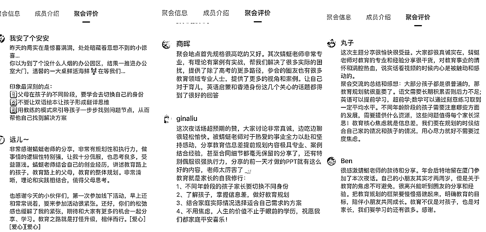

**教育路上的孩子——心里有光，眼里有爱，做自己的小太阳！**

以一句假设开启父母的思考，假如我是孩子，我正在经历什么？我每天的生活和学习状态是如何的？我最想对父母说什么？各位圈友都很认真地回顾了自己孩子当下的状态——每天除了上学，放学后还要忙着参与各种培训班，都没有时间和别的小朋友一起玩，好累啊；我的爸爸经常加班，没有时间陪我，好想让他多陪陪我；妈妈有时候经常莫名地对我发脾气，她是不是不爱我了……

其实我们都听到了孩子的声音，孩子的很多问题都有被我们看见，没有不爱孩子的父母，但问题被看见之后很多成人的无奈感油然而生，我感同身受，但是当深刻感受并笃定父母就是孩子们最大底气的时候，或许作为父母的我们就豁然开朗，明白要如何平衡工作、时间和孩子的问题。

感受孩子当下的状态后问问自己：你了解孩子与生俱来的的天赋吗？天赋意味着在孩子出生时，就有一些专属于她的能力和特性。我特意和一位天赋教育的朋友免费申请了测试孩子天赋的工具，虽然我不百分百相信一个测评工具，但它确实可以让父母更好的了解孩子的潜在能力和身上很多特性。天赋属性有 5 种，思者、赢者、德者、行者、学者。以下解读大家可以了解：

  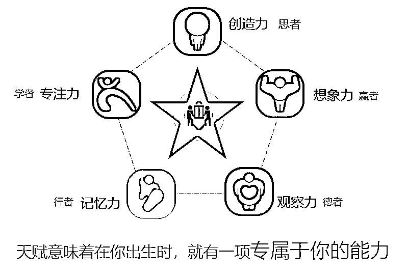

**思者的天赋是创造力——**

大多数思者的孩子往往是心无设限的，他们不喜欢生活在家庭和学校的 约束里。越是约束他们越是管教他们就越会让他们难受。你怎么说他教他都不会听你的，甚至你用激励的方法，他也不会去选择。因为思者的孩子，对于自己的人生有独特的想法，他们需要的是对于他们精神世界足够的尊重和认可。如果父母不能够给孩子一个精神世界的尊重，那么就很可能导致这个思者的孩子一生都是不快乐的。

### **赢者的天赋是想象力——**

一群孩子当中你往往最容易就发现赢者。他们擅长表表现自己喜欢当小领袖喜欢统领别人，喜欢在任何一个活动当中，都充当那个小小的领导者。而且非常善于讨巧卖乖，喜欢说很多好听的话，哄老人开心。可是这样的孩子，因为有太强的个人的主见和表现的欲望，他的自尊心也比其他的孩子来得更快和更强。

**德者的天赋是观察力——**

德者的孩子，不会像其他孩子一样那么风风火火的冲在前面，他们永远是慢悠悠地躲在后面。德者的孩子就像小棉袄一样非常的贴心。让你总觉得孩子特别懂事，愿意照顾你、懂你、理解你。所以德者的孩子，如果表现得不像你期望当中的那么优秀，请大家不要产生更多的责怪。但是德者的孩子一定是最懂你的，因为他们的天赋就在于他的观察能力，他会更好的去表达出来，对于你，对于这个世界的那份善意。

**行者的天赋是记忆力——**

大多数的行者孩子喜欢独来独往主，他们不喜欢跟小朋友一起交往，更不喜欢与陌生人交谈。他们更加喜欢呆在自己的亲人人身边，更加喜欢呆在自己的家里面，那个比较安全比较稳定的环境里面。平时在生活、工作、还有学习当中，都很少跟别的人群进行交流和交往。这就是行者所带来的最大的特征。

**学者的天赋是专注力——**

学者的孩子是个非常好带的孩子。他们更加懂事、听话、愿意遵守规矩。只要你安排好，他就会按照既定的步骤和规律，一步一步去完成他们学习和生活，不需要家长和老师太过于操心，这就是学者最优秀的特点。而中国的应试教育非常适应于学者的这些孩子。缺点就是过于刻板，缺失情商和变通。者、**德**

**教育路上的你——相信你一定可以成为孩子最大的底气！**

孩子在成长道路上会出现各种各样的问题，当你了解不同阶段孩子的不同成长敏感期后，有些问题你就不用那么焦虑，那是孩子的成长规律，并不是孩子故意为之。

举例 2.5 岁-4 岁孩子的秩序敏感期，我的二宝在秩序敏感期令爸爸非常抓狂，一度觉得娃有问题要带去看医生。比如东西在这个位置，一点点移动或者朝向不对孩子就会大哭。东西摆放的顺序也绝对不能被打乱，否则她会不断让你重新来过。其实当你了解这是孩子正处于秩序敏感期的外在表现，你就能理解孩子的行为并且给予很好的引导。

##### 以下截图 2-8 岁重要成长时期的敏感期，当你了解不同时期孩子的特点，你带娃就会释然很多。

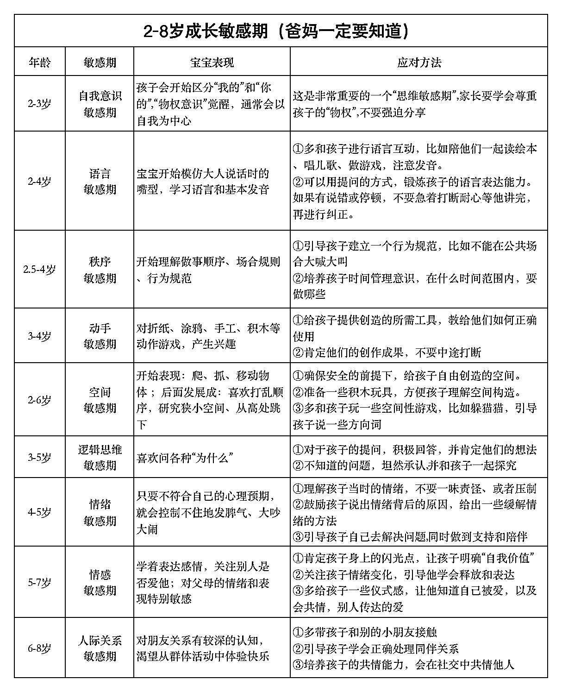

在教育路上，父母不仅是教育者与引领者，同时也是观察者、协助者、陪伴者。孩子在不同的成长时期，父母扮演的角色是不同的，详情请查看下图。

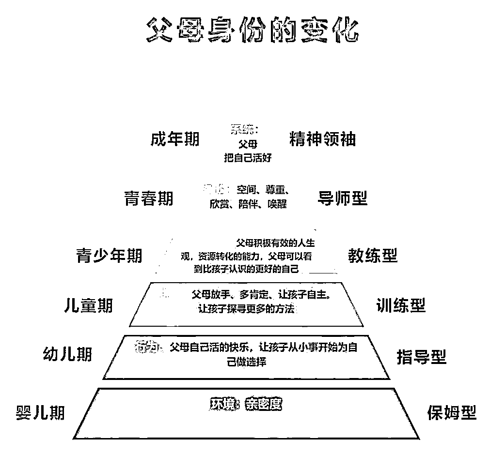

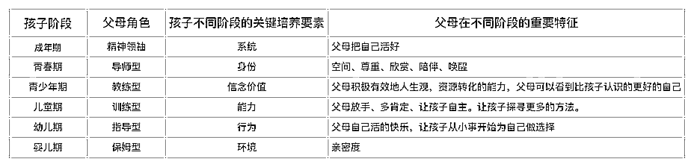

这里我特别想分享父母作为协助者的角色，在大宝明确小升初要考更优学校时，我们详细了解这些学校对孩子的各种能力要求，分析后发现孩子的奥数需要再强化，校内的数学对于孩子来说没问题，但因奥数之前没有深度涉及，第一次去测试奥数入门线都没过（厦门有家知名奥数培训机构进入学习是需要测试的，通过后才可以进入学习），孩子其实很沮丧，当明确知道孩子的卡点在奥数时，我慎重和爸爸说孩子需要你的帮助，商量后的解决方案是由爸爸带着孩子进行暑假一个月奥数的共同学习，每天一个小时即可，爸爸数学思维很好，在网上找了各种版本的奥数教学视频，最后筛选出有趣又易懂的教学视频（需要的圈友可以找我领取），带着孩子一起听课、做题，拆解，总结等，一个月后孩子的奥数测试只错一道题差点满分。这里我想说的是之前爸爸对孩子的学习也是甩手掌柜，但是当我明确告诉他孩子需要我们的帮助，爸爸还是百忙之中给力支持（虽然现在又恢复甩手掌柜），在孩子出现问题时（学习、生活、人际关系等等），我们不能让孩子觉得孤立无援，其实所有孩子都希望自己变得更优秀，但是她也不知道从何下手，父母的给力协助或者寻找资源帮助孩子解决问题，会让她越走越勇敢。

引用明星伊能静的一句话：得体的退出是妈妈给你最大的爱，但是你要记得，只要你回头我们都在这里。这句话会直击父母内心，父母才是孩子最大的安全感和底气来源，在小时候给她最大的依赖和爱，长大后时候学会第一个送她离开。

**教育路上的我们——打破教育信息差，提前做好教育规划。**

越深入教育，所见所闻，越来越知道这里面信息差有多夸张，提前做好孩子的教育规划，可以帮助家长确定孩子的学习目标和发展方向，形成有针对性的教育方法。通过合理规划，孩子的学习过程更加科学、有序，能够更好地发掘和培养他们的潜力。教育规划是为了让孩子有所准备，不会让运气或环境决定她们的未来。

接下来将主要从四个方面来分享如何做好教育规划：学科规划、兴趣规划、升学路径、身份规划，相信大家了解这些信息后内心会对孩子的教育规划多了一些笃定。

学科规划之语文篇：

相信大家都听过大语文，大语文即我们目前课内所学吗？当然不是，大语文的核心为“一体两翼”即以课堂教学为轴心，以开展课外活动和强化学习环境为两翼。基于大语文时代，我们语文考试趋势会发生哪些改变呢？请查看以下整理表格。

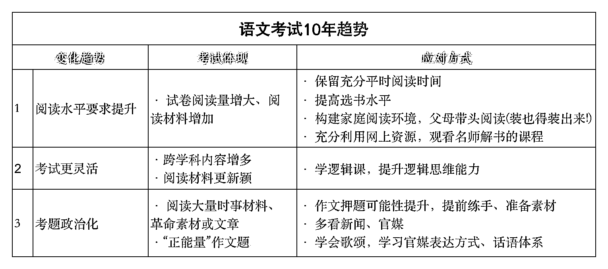

当你了解语文的考试趋势后，相信大家对于语文的学习就会更有方向，这里谈谈我对于语文的感受和自己孩子简单的规划。语文核心是阅读，难点在于写作，如果你不是追求孩子未来成为大作家，保持孩子持续课外阅读的热爱，一二年级重点抓自主阅读能力，引导孩子自己慢慢独立认字和阅读，3 年级以后可以考虑阅读理解的方法和写作技巧培训，小学阶段要解决所有古诗词背诵，初中之后持续阅读相对应难度的名著和赏析。从功利心考试角度来说，语文考试拉开差距的不在于基础知识，在于考卷最后的课外阅读和写作板块，分数差距拉的不是很大，因此培养孩子爱阅读的习惯尤为重要，即使不补课语文分数也不会相差很大。

学科规划之英语篇：

英语是所有学科中在小学阶段就可达到高考能力的科目，实现这种能力基于启蒙早+方法对+努力坚持，也无需孩子太多天赋，小学解决大部分英语问题除了符合语言的发展规律之外，可以帮助在孩子初中、高中节约太多时间，这点在我们校区已经很多孩子验证，北上广深很多牛蛙在小学阶段完成 PET 考试获得卓越，相当于雅思 5.5，那我们不同英语启蒙时期该如何做呢？请参考以下详细表格：

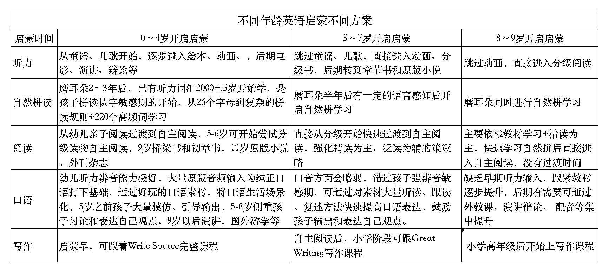

看完以上表格如果启蒙晚的家长是不是很焦虑，其实抓住几个关键点，也不用特别担心。

第一，听力能力很多家长容易忽略掉，却很关注孩子口语，没有输入哪来输出，大量听力输入非常重要。

第二，自然拼读系统快速学习，自然拼读功能就像汉语拼音，见词能拼，听音能写，自然拼读学习其实非常简单，难在通过拼读规则学习后拼出的词汇如何理解和使用，因此一定要搭配对应难度的分级阅读巩固、理解、应用这些词汇，脱离阅读的自然拼读就像昙花一现，看似学得非常迅速，实在忘得也迅速。

第三，阅读，重中之重，无论从新课标改革（初三要求课外阅读量达到 15 万字）还是从能力基础来说，比重最大，难度最高。阅读基本线路是听读——跟读——流利朗读——自主阅读，自主阅读难度从分级读物——桥梁书——章节书——小说，逐步递增。

第四，口语的学习很多家长觉得卡在缺少语言环境或者自己不会说，其实现在有很多口语的学习工具是可以解决的，比如点读笔，各种配音软件等，最大的卡点应该是如何让孩子感受到英语对她的帮助，除了应对国内考试。我的做法很直接，从小带她去不同国家旅行，让她自己去感受英语，从而激发她内心对于英语的驱动力。如果有做外贸的朋友，国外客户来访带着孩子微微参与也是有很大帮助的。这里提醒的一点是孩子英语基础一定要扎实，肚子里有货，这样不同环境因素可以更好的刺激口语输出。

学科规划之数学篇

数学启蒙和小学阶段的知识除计算能力需要刻意练习外，其他方面均可无痛学习。但越到高学段，数学学习越难保持“无痛”，初高中数学需要系统化刷题和专项刷题，重视思维方式、学习方法的培养，而外在的形式(选择什么资源、用什么教辅)无足轻重。

这里大家会关注一个奥数问题，奥数前期启蒙可以通过各种桌游，从上小学四年级可以考虑介入正式的奥数学习，但是都是建立在校内数学相对轻松的情况，不要觉得别人开始学奥数你也要开始，不然很容易本末倒置，还有一句话数学很强的孩子大多数是具有一定天赋的，我们了解自己的孩子不要硬拔，也不要打击孩子，即使天赋一般但保持努力还是可以稳定发展的。以下这张图大家可以了解下不同时期培养不同数学能力。

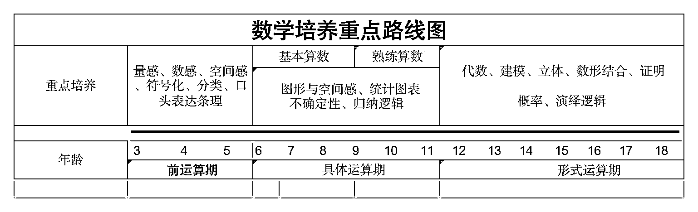

第二个方面：兴趣特长规划——艺术、体育、科技

以下总结信息是我通过大量信息筛选后总结，特别关注孩子兴趣特长的父母们可以重点关注以下信息。

**艺术兴趣特长的规划中主要关注的点**：

1、升学：2024 艺考改革后，联考将大范围取代校考，仅顶尖学校有可能保留部分校考。新政推行后，考生考试成本将降低，暗箱操作的空间减小，但顶尖学校竞争将更激烈。

2、艺术非捷径。只有真正科学启蒙、且孩子有充分兴趣和一定天赋，才有机会获得长足发展。

3、由于天赋、兴趣的不确定性，加上外部政策环境的不确定性，艺术的功利化心态很容易带来失落。

**体育兴趣特长的规划中主要关注的点：**

1、升学：高水平运动队提高专业门槛，2024 年后国家一级运动员才可报名，2027 年后近 3 年获全国前 8 才可报名；提高文化课门槛，2024 年后双一流高校录取须达本科线、其他高校达本科线 80%;想选非体育专业最多比本校分数线降 20 分，否则只能读体育类专业且不得转专业。

2、顶尖运动员必备天赋，不要迷信努力。客观评估、理性决策。坚持兴趣导向，保持去功利化的初始心态

3、不要局限于升学，关注未来职业发展路径的灵活性和容错空间。

**科技兴趣特长的规划中主要关注的点：**

1、学有余力，有兴趣，且数学成绩最好在 90 分以上!无兴趣，不必学!成绩差，不必学!

2、不要盲目报班!信奥门槛较高!大部分编程培训机构无法满足需求!

3、不要太功利!否则影响心态且极易动摇。学信息学竞赛是为了更大的目标，是为了更好地成长、思维的提升、为将来的发展多准备一种可能性，升学只是顺便实现的目标!

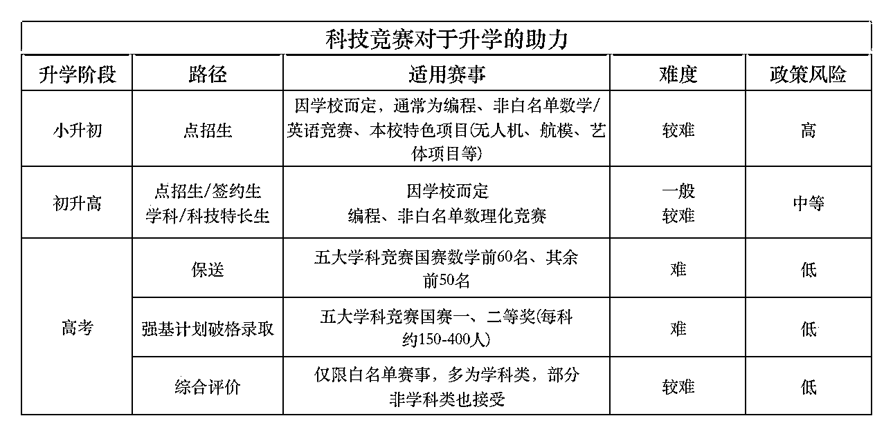

第三方面：升学规划

这里大家可以问自己一个问题，考上国内大学除了高考统招您还知道其他路径吗？您的孩子适合哪条路径呢？接下来我们就了解一下进入大学多元升学的另外 16 种路径，了解更多的升学路径，以便我们可以更好的给孩子做好教育规划。

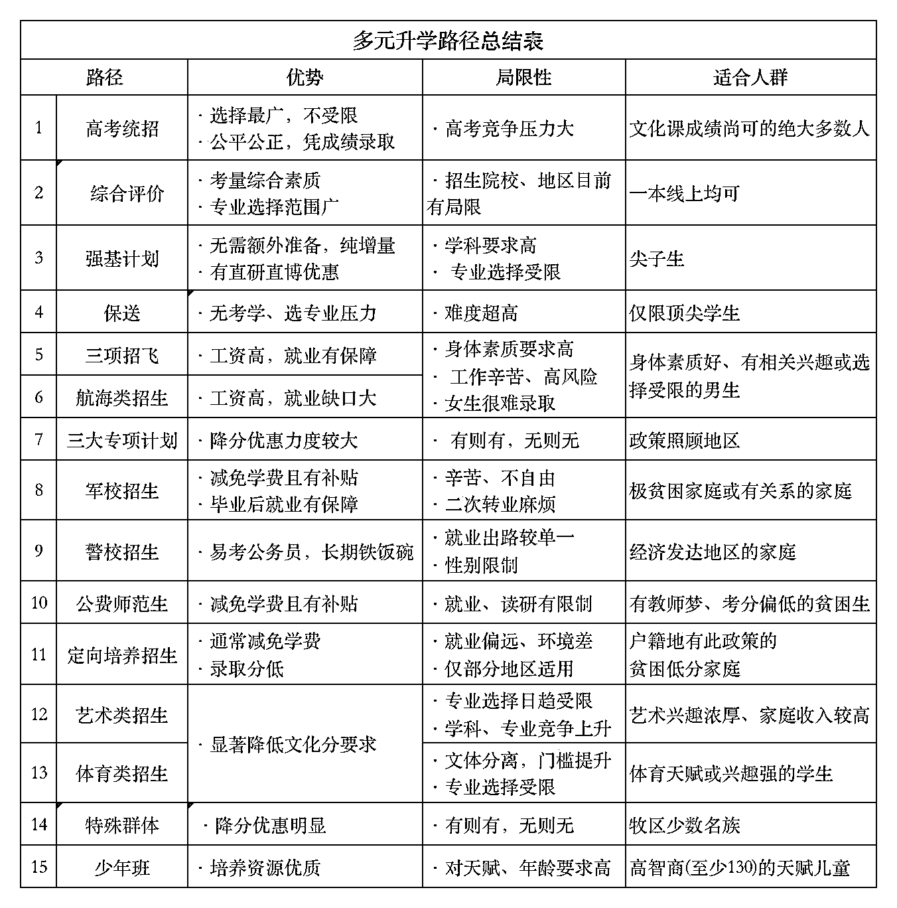

第四方面：香港身份规划

说起香港身份，去年和今年特别火热，我本人目前是通过香港读硕通道获取香港临时身份，但是我发现很多细节大家都没有注意，尤其只关注到香港身份的优势，却忽略了它也有缺点。接下去我们来简单说一下香港身份规划中几个关键的点。

**1、获取香港身份的四大方式以及优劣，详情见表**

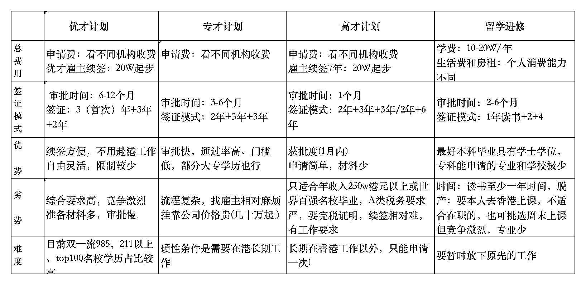

**2、香港身份和内地户口优劣势对比，详情查看以下表格**

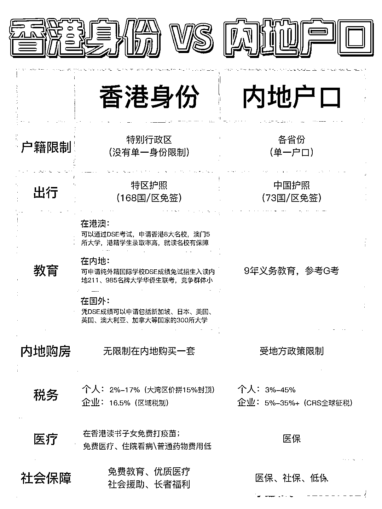

3、相信大部分家长办理香港身份是为了孩子避开国内高考内卷，大家可以了解当你孩子具备香港永居身份后参加华侨生联考的数据参考。

**华侨生 211 录取率 41.5%**

**普通高考 211 录取率 5%**

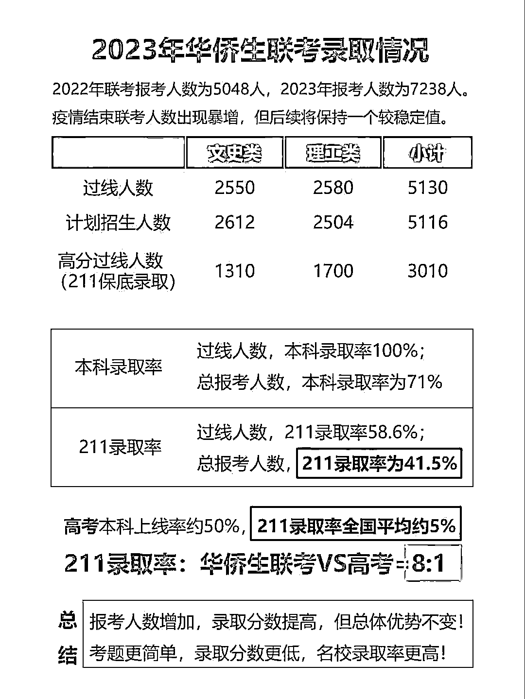

**了解香港身份诸多优点之后，它有哪些缺点呢？**

1、费钱+费时间，比如读硕渠道 7 年总费用至少 50 万+，续签需要真实经常往返香港，并且一段时间真实居住。

2、公务员和事业编会受影响，目前内地公务员大部分不可以报考，只有大湾区可以

3、如果参加华侨生联考需要注销内地户口，取得回乡证，才能报名华侨生联考，如果是参加香港 DSE，是不需要注销内地户口，也不需要永居，临时身份即可参加。

综上所述，大家需要思考一个问题，香港身份这条路适合您的孩子吗？我给大家说说我当时决定办理香港身份的思考过程，供大家参考。

1、费用是否能够承受？盘点家庭财务情况，答案是可以，这里提醒大家的是你要做好最坏成本打算，很多挂靠或者套路性的东西是有很大风险的，也许成本低一点点，但是建议按照政府文件来，香港法律还是比较严格。

2、时间是否可行？我是先申请优才后申请留硕，双渠道并行走，优才成本低，但是审核周期太长且不稳定性，因此港硕通知书下来后决定走留硕，这里关于专业的选择，我是为了申请港硕，特意考了托福，因此可选的专业比较多，对于很多英文没有优势的同学，也有很多中文专业可以专业，不用特别担心，就是竞争很激烈。需要做好准备一年在香港或者每周奔波香港与你生活的城市之间。除了环保专业目前一周一次，大部分专业一周都要几天课程。

3、孩子有香港身份，到底选择香港 DSE 还是华侨生联考？我们家两个孩子的规划也是不同的，因为大宝已经赶不上 7 年转永居的时间节点，因此是规划参加香港 DSE，加上从小英语启蒙，英语是她的优势，刚好 DSE 考试最大的难点就在于英语，数学和语文都是比较简单的。另外老大性格比较温柔，未来可能走公务员方向，因此不想取消国内户口。

这里重点提醒一句：如果想要参加华侨生联考必须在四年级办理好香港临时身份，这样你才有 7 年时间转永居，办理回乡证，从而具备华侨生考试资格。这个时间节点很重要。

老二是选择走华侨生联考，一是时间完全来得及转永居，二是，我们确实没有精力卷老二，老二高考的时候我们已经快 60 了，呜呜呜，所以希望老二快乐成长，有个保底好大学读即可。 三是，老二性格比较外向，应该不太可能走体制内系统，因此注销内地户口影响不大。

以上就是我根据孩子的不同情况规划不同的路线，但是规划只是规划，只能说在没有特别的天赋情况下给孩子们多了一个选择，在孩子付出同样努力的情况下可以拿到会更好的结果，但并使意味着可以躺平哦。国内的义务教育还是很扎实的，不一定要很小的时候去香港，当然如果家庭有条件当然没问题的，还是要根据自己具体的情况选择不同的落地方案。

**分享会感受**：当晚大家近 11 点才恋恋不舍地结束，大家也很积极提出自己的教育困惑，当时的我就像满格电的手机，高速运转，恨不得把自己知道的都传递给大家。这次福建年会和线下组局让我深深地感受到生财有术真诚与利他的氛围。最后想和大家说：相信所有的父母都爱自己的孩子，但每个孩子都是独一无二的，教育方法因人而异，祝愿各位都找到属于自己孩子的教育规划之路！

* * *

评论区：

常常 : 打破教育规划信息差，谢谢蜻蜓老师的真诚分享，父母在孩子不同时期的不同身份的变化，非常有启发🎉
江大虾 : 感谢分享
路路 : [玫瑰][玫瑰][玫瑰]
麻雀 : 真棒，谢谢了
Y024 : 蜻蜓点水，冰山一角，还有最擅长的英语启蒙可以分享呢[嘿哈]
颜 : 感谢蜻蜓老师的无私分享，获益良多！
AI 小陈 : mark 教育
蜻蜓 : 感谢常常的鼓励呢，让我成为勇敢的分享者

* * *