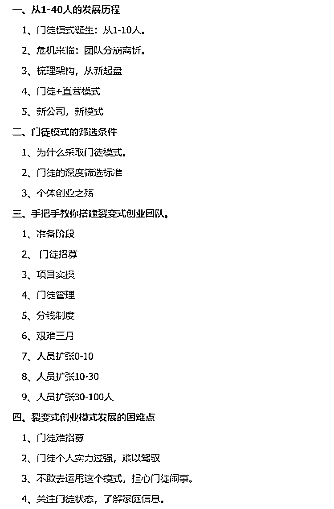

# 运用门徒模式，实现裂变式创业增长

> 原文：[`www.yuque.com/for_lazy/thfiu8/thl4ocspsiuyeso0`](https://www.yuque.com/for_lazy/thfiu8/thl4ocspsiuyeso0)

## (精华帖)(49 赞)运用门徒模式，实现裂变式创业增长

作者： 低调哥

日期：2024-03-18

运用门徒模式，实现裂变式创业增长。
团队从 1-40+人，月盈利数十万。（运营 1 年半深度复盘拆解）

此模式适用于大多数个体创业者向团队进行过渡。

极度适合超级个体 IP 创业者进行项目化，团队化经营。

本文深度给大家拆解，
一、低调团队从 1-40 人发展历程
二、门徒模式的深度筛选条件
三、手把手教你搭建裂变式团队【从 0-100 人模式】
四、裂变式创业模式发展的困难点
五、裂变式创业模式未来发展分析

本文写了 8000+字详细的给大家深度复盘。

对于目前想要团队搭建和快速实现公司规模化放的朋友，可以深度阅读。

飞书文档：[`ryrl4oi6gq.feishu.cn/docx/JxBDdWGszo2M4PxGYCOciEynnkc?from=from_copylink`](https://ryrl4oi6gq.feishu.cn/docx/JxBDdWGszo2M4PxGYCOciEynnkc?from=from_copylink)

* * *

评论区：

低调哥 : 今天抽空写了一下午，写出来的。

文章断句可能会有一些问题，实在是排版上不够美观，大家多多担待！
一尘学长 : 大哥这个模式太牛了，小弟看完全身通透，惊为天人！

之前我一直都是做的阿米巴模式，但是那些合伙人都是趋利避害，项目容易盈利的时候，都很猛，项目遇到卡点的时候，总是后继无力。

然后为了解决这一难题，我加上了直营模式，现在看到大哥这个门徒模式，真的太契合我接下来的方向规划了。

这次航海家线下见面会不知道能不能当面向大哥请教[色]
凡灵逸尘 : 要不是知道啥情况，我都以为你是请过来的水军
一尘学长 : 刚准备瞌睡，大哥就把枕头安排上了，想啥来啥，真的太酷了，所以有点激动。
江吉仪-墨鱼 : 低调哥牛逼
程风而去 : 这难道不就是传说中的付费上班？
枫烨 : 前面分享看着还行，看完后感觉有点变味了，名义上是学徒，实质是线下付费培训+招聘无成本软肋员工，不过也感谢分享，让能了解了商业的其他面[握手][握手]
低调哥 : 你是没看到深度筛选，一切人员都需要面试的，不是说付费就可以来，没能力的一样不收。

如果付费就可以来，那就成了招商培训。

别人给你提供好的平台，资源，项目，难道这些需要免费吗？

* * *