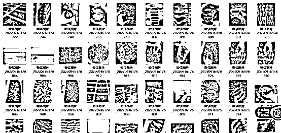
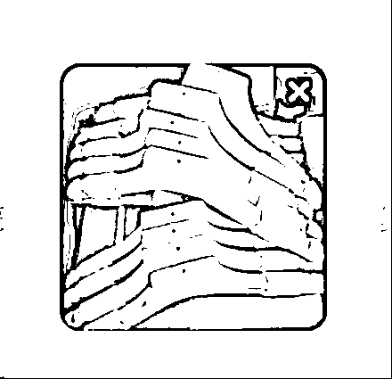
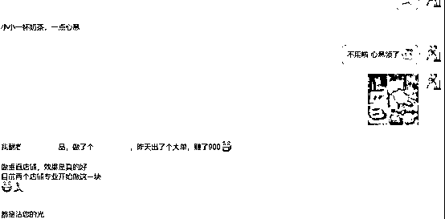
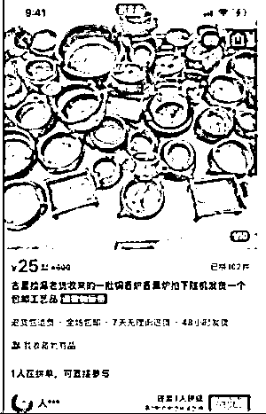

# 带全家 6 口人做闲鱼 2 年，分享帮你订单量翻倍的 6 个闲鱼实战经验

> 原文：[`www.yuque.com/for_lazy/thfiu8/pi5ik76pbnah195l`](https://www.yuque.com/for_lazy/thfiu8/pi5ik76pbnah195l)

## (43 赞)带全家 6 口人做闲鱼 2 年，分享帮你订单量翻倍的 6 个闲鱼实战经验

作者： 超级个体张老板

日期：2024-03-21

各位圈友好，我是张老板，前报社记者，7 年互联网自由职业者。

在我做自由职业者的这几年里面，实战测试了很多项目，其中有一个项目就是闲鱼。我不仅自己跑通了这个项目，还带着全家 6 口人一起做这个项目做了 2 年多了。

其中包括我老婆、姐姐、姑姑和已经退休的丈母娘等。在这个项目上，我大姐，一个 2 孩全职宝妈，目前能够做到一年 10 万左右的利润。

今天，分享一下我们家自己在用的 6 个闲鱼实战经验技巧，都是自己实战总结出来的，非网上一搜一片的资料，希望对各位做闲鱼的圈友有所帮助。

分享目录如下：

**1、用一个案例，说下如何一次性高效搜集够用 10 天的卖货图片**

**2、头图抓住客户眼球的 3 个细节**

**3、鱼小铺垂直店铺怎么玩？从研究对标玩法和数据开始**

**4、店铺包装进阶版：评论区卖点布局提升转化率**

**5、标题卖点+关键词组合，几个方法如何提炼卖点**

**6、清仓体文案如何操作出单最好？**

闲鱼项目其实并不复杂，流程上基本就是那些，细节决定一切，能不能把项目做好，做出更多利润，关键看你在流程细节上能不能下功夫，关键看你的执行力。

## **1、用一个案例，说下如何一次性高效搜集够用 10 天的卖货图片**

做闲鱼，找图是很多伙伴都头疼的。

如何高效找到大量清晰美观的图，提升效率，节省时间？这里结合我自己操作的一个案例，来聊聊。

我之前专门测试过一个做海参的高客单价店铺，铺这个品的链接，需要大量的图片，不过货源老板只提供了部分产品图，其他图片都需要自己搞定。

我先列了一下，铺这个品，最好需要以下类型的图片：

单个产品细节图；

大批产品堆放图；

生产场景图；

渔船捕捞图；

渔村环境图。

这些图片，可以从产品到场景全方位对商品进行展示，从而建立客户的信任，我们发布图文，不仅仅是为了介绍清楚商品这么简单，还需要用图文建立起客户信任，激发客户购买欲。

然后我在全网大概过了几个平台，比如抖音，淘宝，小红书等，发现小红书这个平台上，有大量这类图片，可以满足我的需求。

然后，我挑选了一个集中时间，一次性去小红书上专门搜索这个产品的所有关键词，筛选条件先选图片，再选视频，把好看能用的图片和视频截图，一次性保存上一二百张。

然后，把这一二百张图片集中处理下，就可以慢慢用了，比如你一天发 3 个链接，一个链接用 5 张图的话，这些图能够你用十几天。

看一下我当时保存的截图：

这种方式就是：

确定铺链接图片需求；

集中大量下载处理；

保存后待用。

就不需要用一次去找一次，那样比较浪费时间，集中处理会更高效。

## **2、头图抓住客户眼球的 3 个细节**

做闲鱼，头图非常非常重要，一定一定记得。

头图清晰美观这些就不用多说了，这些都是基本标准，再说三个让头图更抓客户眼球的小细节。

### **第一，头图尽量用竖版图。**

我们去仔细观察一下闲鱼的首页推荐，比如这张：

你会发现，闲鱼的首页推荐展示，是分成 2 列来展示的，出现在首页的，基本都是竖版图，是没有横图的。

竖版图，展示面更大，给人的视觉冲击更大，也方便上闲鱼首页推荐获取更多流量。所以我们去选首图，优选竖版图。

### **第二，注意查看首图缩略图，商品主体一定要突出。**

使用竖版图做头图，不要一次性把所有图都放进去点发布完事。首先要把主图放进去，看一看缩略图，确保产品的主体是在缩略图中间，突出主体。

因为竖版图，上下是有空间的，有的图片如果不处理下，就容易导致产品主体不突出的情况。

用我们的一个合作货源的产品图来举例说明下。

大家看下面这两张图，都是同一张图片生成的主图：

第二张就比第一张展示上要好一些。

### **第三，记得关闭闲鱼的图片自动压缩功能**

这个在闲鱼：我的——设置——图片视频设置里面

把上传图片自动压缩功能关掉，就可以上传更加高清的图片了。

截图如下：

## **3、鱼小铺垂直店铺怎么玩？从研究对标玩法和数据开始**

咱们大部分伙伴玩闲鱼，都是从杂货铺开始的。

也有伙伴做到后面，准备做垂直店铺，通常鱼小铺有垂直要求，就是平台界定的“专业卖家”。杂货铺和垂直店铺各有优势，这里不去界定哪个更好，只是看哪个更适合你。

建议大家如果在做垂直店铺的时候，从研究对标店铺开始。

找对标，在做任何项目上都很重要，做闲鱼当然也是如此。

比如我做小红书，就会去研究小红书可对标案例，做闲鱼，想做好某一个品类，熟知市场知己知彼当然也很重要。

研究对标，可以研究什么？

比如：

他的账号人设是如何搭建的，店铺是如何包装的；

他店铺里面都上的什么产品，哪些是热卖品；

精细化学习同行图文发布细节；

观察店铺的评论区，挖掘这个品类的客户痛点；

用小号伪装客户套成交话术；

精细化统计同行数据，去研究他的店铺的成交量和转化率。

这里单独说下，现在很多卖家的动态是隐藏状态，他不想让竞争对手看到的。

这个时候，你可以去关注他的店铺的总成交数量，这个你点开他的随便一个产品链接，下拉就能看到。

然后关注他总成交量的数据变化，观测一段时间周期，就能够大致了解他的销量了。

我们做产品，经常会陷入“自以为是”的陷阱。

很多产品，你认为好卖，市场不一定认可，所以答案都在市场上，一定要去闲鱼市场上找答案，不要闭门造车。赚钱的机会，往往都在同行那里。

比如之前一个伙伴做了一个产品，那个产品可能很多人都觉得没啥人会在闲鱼买这个，但是市场验证结果是这样的，一单就搞了 900 多利润：

当然，具体选品就不方便透露了，做电商这一块，店铺和选品，一般都是保密的，这也是行业潜规则。

## **4、店铺包装进阶版：评论区卖点布局提升转化率**

说起店铺包装，大部人想的是什么？

头像，名字，简介，背景图等。

还有一个非常重要的包装，一定要重视：**评论区卖点布局**。

我们可以回顾一下自己的购物习惯和购物路径，现在人们买东西，都会习惯去看看评论区，看看买家是怎么评价的对吧。

如果买家的某个评价，正好解决了我对这个产品的疑问，那么就很可能促使我下单。

所以记住这四个字：**以终为始**

我们反过来，就可以在评论区去提前做产品卖点的布局，提升我们店铺的转化率。

这里的好评布局，不是那种模板话术的好评，而是针对你做的具体产品的客户痛点来的。

比如：

你做的产品是买来送礼的多，那么你的评论区就可以布局礼盒很漂亮送朋友很喜欢之类的带图好评；

你做的产品是需要经常使用的五金件，那么你的评论区就可以布局非常结实耐用材质很好这些评价；

你做的产品是客户需要用的配件类对配送有要求的，那么你的评论区就可以布局物流很快收到了没耽误使用这类好评；

你做的产品实物和照片可能会有色差区别，那么你的评论区就可以布局实物和图片一样等好评；

等等吧，就举这几个简单例子。

评论区好评维护，要突出产品的卖点，打消客户的疑虑，要针对我们卖的产品来针对性布局，而不是放一个什么“很满意”“愉快的交易”“卖家很好”这种空洞的好评。

另外，这里牵涉到自己去维护好评，可能要用到亲戚朋友的账号来帮忙，一个很重要的点就是，一定要让亲戚朋友模拟真实客户的行为模式下单，这个要切记。

## **5、标题卖点+关键词组合，案例实战如何提炼卖点**

闲鱼卖货，头图和标题，这是两个非常重要的要素。

我起标题，习惯用产品卖点+产品关键词组合的方式，即：前面提炼出产品的亮点和卖点抓客户，后面铺客户搜索指数比较高的产品关键词。

重点说说这个卖点提炼，因为我看很多伙伴卖货，就是上来一个【清仓处理】就完了，每个都是清仓处理，要么就是赔钱甩卖。

这个前置的卖点，在闲鱼上客户可以第一眼看到，可以去测试不同的卖点，因为客户的需求是多样的，产品的特性是多样的，不是所有的人都对【清仓处理】感兴趣。

比如，这几个常见的卖点提炼方法：

主打数字稀缺卖点：仅剩 9 个，比清仓处理就更具体化更吸引人，但最好不要说仅剩 1 个

主打个人闲置卖点：客户送的便宜出

主打价格对比：原价 100 现在 18 卖

主打送礼卖点：送长辈

主打特定人群卖点：孕妇专用

主打制作精良卖点：纯手工打造

等等。

有些产品，结合不同的卖点，会有很好的效果。

举一个例子，有个小众蓝海产品：鞋拔子。

这个产品很多人是不知道的，它可以帮助孕妇和老人不用弯腰、更加轻松的穿鞋，解决这个具体需求。

你去主打这个卖点，主打的是一种问题解决方案，就会比清仓处理要好。

## **6、清仓体文案如何操作出单最好？**

闲鱼卖货，需要通过图片文字营造信任感。

比如一些伙伴习惯用清仓体，什么处理库存之类的。这里说两个注意点：

### **第一，清仓处理体，可以在题目里通过库存数字抓客户眼球。**

比如，剩一批电饭锅处理，和剩 12 个电饭锅处理，明显后者要好一些。

### **第二，清仓体文案，一定要搭配清仓体图片。**

有些伙伴，题目是清仓体，图片放一张电商网图，明显没有信任力，换成这样的图片就好很多：

那么**那种库存很多的图片怎么找？**

用产品+关键词的组合去全网搜索，全网搜索包括各电商平台，包括小红书等自媒体，包括百度等网站，只要能找到，就能为我所用。

简要列举几个关键词，比如产品+清仓、处理、批发、尾货、库存、特价等等。

另外，多加几个货源的微信，去翻他们的朋友圈，也有不少好的素材。

今天没有给大家讲什么“爆单秘诀”，也没有大道理，都是一些比较细节的操作。

我们做闲鱼，常常说要在标题上，要在图片上，要在文案上下功夫，下的就是细节功夫。

深挖产品，深挖客户，深挖市场，把这些都体现到我们的标题、图片和文案上，就是我们要做的细节功夫。

除了做细，还可以做深。

我做闲鱼这几年，测试了很多品类，虽然每个品类都多少赚钱了，最终还是决定去深耕一个品类，并且去做延伸。

比如，在闲鱼上铺更多的矩阵店，在淘宝上去做店铺，在小红书上去推广，最终全部归流到私域积淀用户，都是基于一个类目的深耕。

闲鱼不是一个项目，在闲鱼上卖什么才是一个项目。

最后，祝愿大家从闲鱼项目作为起点，都能去做细，做深，赚到更多钱的同时，收获更多成长。

* * *

评论区：

先森 : 最大问题还是货源[可怜]
贝影 : 不缺流量，缺货源，无货源现在已经开始有门槛了

* * *