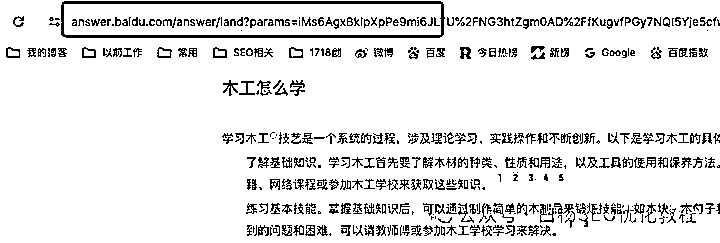

# 说说百度搜索新变化与月之暗面 kimiChat 这个

> 原文：[`www.yuque.com/for_lazy/thfiu8/mzoydtmwdfzuyx7s`](https://www.yuque.com/for_lazy/thfiu8/mzoydtmwdfzuyx7s)

## (25 赞)说说百度搜索新变化与月之暗面 kimiChat 这个

作者： 白杨 SEO

日期：2024-03-19

“真不愧是 seo 得最后一道防线之称”，这句话让我**如履薄冰**！

啥时候我有这个称呼呢？我不知道。我知道这个朋友心里是夸我，但我自己一定要清醒自己有几斤几两，无非脸厚做得久而已。

为啥会有这样一句话来，我把这个聊天前后来源都截图如下，这样也好引出今天要分享的第一个主题：百度搜索为什么会有这些新变化？

看完上面图，大概清楚上面那句话来源了。你可能心里会想：这几个问题不是很简单吗？跟 SEO 有什么关系？这是百度搜索新变化吗？

但真实情况是，关注白杨 SEO 的粉丝朋友们可能一半以上的人没有注意到这个。即使注意到了，也可能未必去想为什么会这样。而且除了百度这个平台，比如微信搜一搜里出现的【商】，抖音搜索里出现的【AI 搜】等。

对于白杨 SEO 来说，关注互联网各个平台搜索的变化，这也是我从事 SEO 研究要与时俱进，或者也可以说是喜欢 SEO 的一种爱好哈。

**先说说百度搜索新变化有哪些？**

变化一：百度搜索结果第一现场给你回答答案

出现要满足 3 个条件：需要你要登录百度账号，同时你要开通文心一言，同时部分搜索关键词有。如图：

变化二：百度智能精选直接展示内容

变化三：百度搜索结果直接展示用户搜索结果参考

变化四：百度搜索结果如果是一些商业类的关键词，直接展示百度自己的商业产品里产品。如图。

虽这不是新变化，但每次新上一个类似百度优选之类新的东西，对普通搜索用户无感，对做 SEO，哪怕竞价投放都能感觉到

变化五及其它：百度热榜里关键词出现了【商】，其实还有【热】、【爆】这些关键词。

以及搜索提示词展示。如图：

**百度搜索新变化为什么会这样？**

白杨 SEO 有以下三点猜想，是白杨 SEO 一家之言，仅供参考：

**1、为用户考虑，提高用户体验**

这一点，任何一个百度产品经理心里想的，百度李总肯定会这么说的。对于用户而言，直接给出想要的搜索结果确实比去对比找一找更方便快捷。

但是是否有“打着为用户考虑”，让百度搜索结果慢慢的变成一个自家产品的站内搜索大家都看在眼里。百度是搜索引擎平台，还是全世界最大的中文搜索引擎平台。当然允许商业，但商业有一个度。如果不在乎这个度，能说啥呢？

作为百度这个产品十多年老用户，还是会用，无非有时真想说两句，虽然啥也改变不了，哈哈哈。

**2、为百度自己商业考虑，商业流量闭环**

百度搜索新变化，为百度自己的商业产品考虑，自从百度推出针对 B2B 的爱采购开始，看看百度推出了多少各行各业的这类付费产品？这些虽不像百度竞价那样买关键词竞价（有些是，有些不是），但无一例外都是要付费的。

百度走过二十多年了，曾经百度一下，你就知道深入人心。不管是问题还是啥，很多人都会百度搜一下。虽然现在被微信、抖音、小红书等平台分走搜索用户，但在搜索这块依旧很大。在百度移动端的搜索也起来了。

所以百度自己最大的变现就是这些以【关键词】为基础的搜索流量。百度搜索结果的新变化，是为了让更多有商业价值的关键词流量到自己的产品里再变现，这样也能为自己的 AI 研发提供燃料。

**3、全面推广百度 AI 产品，融合进搜索**

百度自从推出文心一言这个产品后，后面上了独立 APP。在文心等大摸型上继续研发。但我们知道，光说 AI，不落地也没有用。

百度把 AI 融合到搜索，让用户慢慢接受这个习惯，也是为了想让更多用户留在百度这里，而不是其它平台去。

**百度搜索这些新变化，对做 SEO 的有什么关系？我们该怎么对待？**

白杨 SEO 认为有两点：

1、不管百度搜索变化怎么变，它的底层逻辑不会变，那就是基于关键词搜索的排名。即使 AI 也是基于提示关键词才有结果！

所以我们做 SEO，在百度上做的对待方式，如果是网站的话，就把网站好好运营，我们可以做到剩者为王。如果不是网站，我们就利用百度上的产品来做 SEO，比如百家号 SEO，甚至百度付费产品内做，如百度爱采购搜索排名。

2、百度搞 AI 大势所趋，准确说是这个时代的大势所趋。那么作为 SEO，或者互联网从业人员来说，我们不应该去对抗它，应该去接受它，去学习它，让 AI 为自己所用！

**月之暗面 Kimi Chat 是什么？有什么用？**

月之暗面 KimiChat 是什么？月之暗面是一家新的 AI 大模型公司，创始人是杨植麟（呀，和白杨 SEO 一个姓，我沾光了），90 后。

KimiChat 是月之暗面的一个聊天对话工具。类似国内的百度文心一言，讯飞星火，阿里通义千问，国外的 ChatGPT 等等。

之所以我关注到这个，是看到有一个科技自媒体大佬写了一篇文章，然后我就去实测体验了，这个准确度，真的没得说。下面是我之前测试截图：

对比了文心的，文心这个是 4.0，朋友测试截图，有没有发觉 KIMI 直接可以经地我的内容直接判断白杨 SEO 与杨红林是一个人。

当然，你可以说，是因为我在网上发了这些文章，所以他能搜索出来，那百度自己不是做搜索引擎，也能看到我的内容啊。当然，还有朋友说，是因为 KIMI 只是在联想这方面厉害，文心是综合的。

不管怎样，你可以自己去测试一下。

**接下来说说 KimiChat 有什么用？**

我相信不管是图文还是短视频从业者，不管你是做运营还是推广还是设计的，你是不是需要写文案，你是不是需要找思路，那么，这个工具就可以帮你提高你的工作效率！

虽然白杨 SEO 这篇文章还是白杨自己脑子想和手敲打的，但写一篇要几小时，最少两小时，要是有这 AI 助力，可能就半小时。当然，我之所以这里手打写作，因为这个号主要给**专业**的人看的，这里专业指，至少懂 SEO 是啥意思。

唉，本来想演示一下，哪知道用的人太多，它还给我说累了哈哈哈。其实除了国内这些，国外谷歌的那个 Gemini 也还不错！

今天就分享到这里，如果你想第一时间了解各平台搜索变化或者想学习如何全网各平台搞精准搜索流量，可以继续关注我。

**相关推荐：**

[白杨 SEO：百度搜索智能精选是什么、怎么开启和加入？](http://mp.weixin.qq.com/s?__biz=MzU2NTQzMzA4Nw==&mid=2247499240&idx=1&sn=9512fec5481e27afdaf9525b31292c02&chksm=fcb97a78cbcef36e939a448fcfb0909b5e72c7e70d3866f2042523b3d16da9359f1bd05fcf50&scene=21#wechat_redirect)

[白杨 SEO：ChatGPT 怎么用？大家都用 ChatGPT 及类似 AIGC 工具干什么？](http://mp.weixin.qq.com/s?__biz=MzU2NTQzMzA4Nw==&mid=2247498809&idx=1&sn=28ebb82f4603db7b47819e454fb25084&chksm=fcb97ba9cbcef2bf09905b4a6907a01d940a6569a9cc59d81d11fd3a13a6aeff21f25315ef25&scene=21#wechat_redirect)

[白杨 SEO：快手 SEO 怎么做？怎么在快手上搞精准搜索流量？【实战干货】](http://mp.weixin.qq.com/s?__biz=MzU2NTQzMzA4Nw==&mid=2247499423&idx=1&sn=cff29b877d3028628e47ffcf05f008af&chksm=fcb9790fcbcef0190137c5c883032724ab9a058004fcfbf8d1e82efc78b3f2f367ad00d88242&scene=21#wechat_redirect)

**作者介绍：**

白杨 SEO，专注 SEO 十年，全网 SEO 流量实战派，对互联网精准流量有深入研究。全网同名白杨 SEO。

* * *

评论区：

朝闻道 : kimi 很好用
白杨 SEO : 是的，用过的人都懂，哈哈哈
聪姐姐 : Kim i 是不是没有软件的
白杨 SEO : 网页版，好像有小程序，你搜看看
聪姐姐 : 谢谢谢谢．
阿里斯宝 : 应用商店就有

* * *