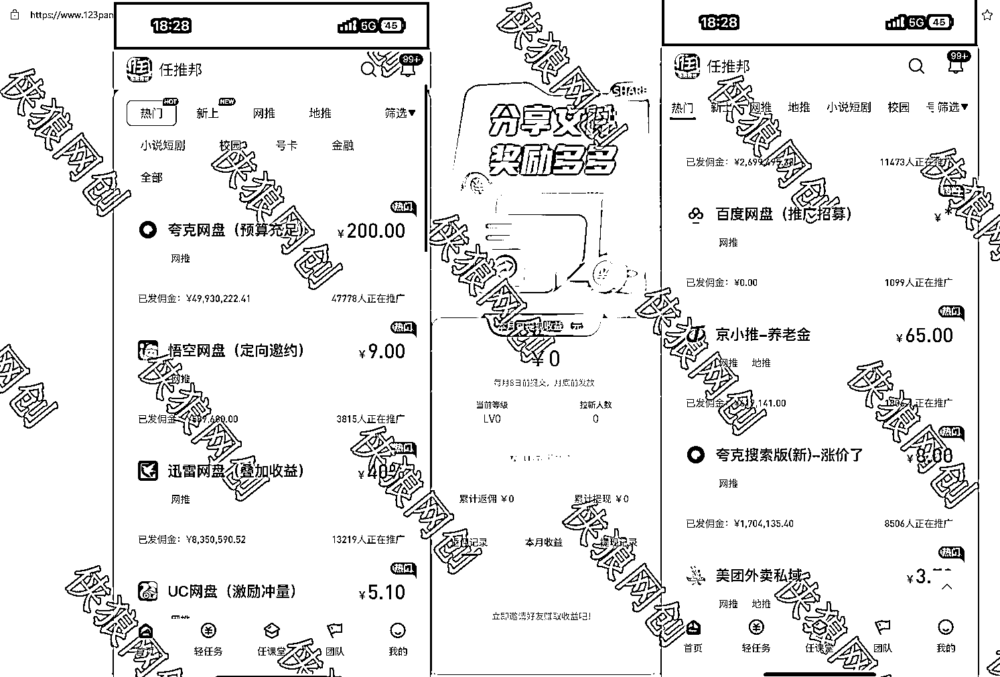

# 网盘拉新大战，普通人如何从中获取机会？

> 原文：[`www.yuque.com/for_lazy/thfiu8/wt9aa5ydzst9ucwu`](https://www.yuque.com/for_lazy/thfiu8/wt9aa5ydzst9ucwu)

## (18 赞)网盘拉新大战，普通人如何从中获取机会？

作者： 侠狼

日期：2024-03-21

最近网盘拉新大战算是打起来了，全都开始在搞拉新补贴抢流量。

简单来说，从一开始阿里云盘，以及夸克开始做拉新开始，到现在越来越多的平台开始搞网盘拉新，给网盘转存补贴了。

目前几个较大的分别是：**夸克网盘、阿里云盘、迅雷、头条网盘、UC 网盘、悟空网盘、123 云盘等等**

到最近，百度网盘也开始加入这个网盘补贴拉新大战了，距上一次这样规模的垂直类目竞争，就是社区买菜，美团优选，橙心优选，等等，而这些普通人都通过拉新获取到了一波利益。

网盘拉新平台目前我比较推荐的还是任推帮，主要是齐全，几个网盘都有，出数据速度也不错，然后客服回复还行，就是不是 7-24 在线的，哈哈哈哈。

**任推帮**夸克、头条、悟空、迅雷、UC、百度网盘，这几个在任推帮都是有的。

目前拉新最狠，补贴最给力的是夸克，用的人也多，如果做拉新，优先做夸克比较好，算是比较成熟了。

**一、网盘的介绍**

网盘这个项目在很多的大公司手上都认为是一个不怎么赚钱的项目，还容易亏钱的项目。

比如，阿里云盘，一开始喊出来的口号多响亮，“终身不限速”，到现在依旧是限速了。

为什么呢？因为互联网公司成本最高的就是流量，带宽，有兴趣的，可以去查查爱奇艺，腾讯视频，b 站他们的钱的大头在哪，基本都是把钱花在“流量”上面了。

而根据目前互联网公开的信息来看，如果提供 1TB 存储空间，一年的费用都要跑到 140 多，这还只是存储的费用。

当然，更具体，更深入，更权威的数据就需要自己去进行挖掘了。

强大如**360，也是在 2017 年，停运了网盘这个“不赚钱”的业**务，到了后面大家用网盘基本都是用百度网盘了。

**二、为什么现在网盘大战又搞起来了呢？**

因为“流量”，网盘这个业务本身表面上看，是亏本，不赚钱的。

但是，当你跳出“产品”，这个业务去看这件事，那就又不一样了。

比如目前的两款现象级的产品，“QQ、微信”，以及曾经的，“百度贴吧”。

**QQ 跟微信本身是不盈利的，但是有非常大的流量**，而，有了这些流量，有了用户，卖这个流量，用这个流量来赚钱就好搞了。

流量在哪，钱就会在哪。

有了流量，就算你卖个空气，比如智商+1、叫爸爸，都会有人去买（淘宝还真有人卖这玩意）。

具体怎么用流量变现，这里就不深入的去交流了，自己思考就好。

外加上，**现在的互联网进入了平稳发展阶段，也就是红利增长期消失了，只能进行内卷，而内卷起来，发现网盘似乎是个不错的选择**，毕竟，所有人都是会需要使用到云资料的，而直接放在服务器带宽给你免费下载，肯定是烧不起的，干脆就搞了个云盘，网盘出来。

做了个存留用户的平台，本质上来说，网盘不赚钱，但，也不能让你白嫖，可以这样的理解，但又不能直接给你免费使用，因为网盘本身就是属于一项付费项目，存储，下载，上传，都是烧钱的。

现在是网盘，网盘日常使用频率高，不知道后续会是什么，可以提前按照使用频率，诉求，需求，这件事，来进行思考，也许，能提前占据坑位。

**三、网盘项目新手怎么赚点小钱**

网盘拉新这样的项目，赚大钱概率性不大，但，有个点非常重要

**“这是一个流量入口”**

**“这是流量入口”**

**“流量的入口”**

如果只是赚一个网盘拉新的钱，赚百来块钱是很简单的，只要努力点，多去发一发某些人群所需要的内容，工具，资料，就可以变现。

至于发什么资料，怎么做拉新，这种简单的问题，自己去思考就有了的。

举几个简单的例子。

比如，搞个工具推荐账号，推荐一些免费的，好用的工具给个夸克的链接，赚拉新的，转存的钱。

比如，把 github 热门项目、软件包、工具包，都下载下来，然后放在你的网盘，去程序员的一些社区发一下，也会有收益。

比如，根据自己的角度去思考，**有什么项目能卖钱的，把他买下来，然后放在自己的网盘，拿来免费分享，这就是生意，这就是项目，这就是流量的入口。**

更高阶一点的，**免费帮忙去发培训机构的课程，试看内容，或者真实的内容，然后留下微信钩子，放上自己的流量渠道，跟培训机构做合作，搞分成，这样就可以赚大钱的。**

比如，Python 教程、减肥饮食规划表、自律表、乐谱、小吃配方、制作 xx 行业微信小程序教程、美甲自学教程、餐饮行业规范、商标注册教程、公司财务规划、摄影教程，等等等，随便举例了一些，还有很多的可以举例子的，都可以去跟人合作来做的。

只要流量来了，你想办法将这个流量找人合作变现转化就好了，**尽量让自己只做一个项目的一个环节，而不要想着整个业务环节规划都来做。**

网盘拉新，从一开始的拉新，到现在的转存也有钱，风向是已经变了的。

不仅仅只是拉新，而是变成了，活跃度的争抢。

为什么现在全网都是夸克，就是因为夸克给的转存补贴高啊。

新用户下载 App 拉新转存的就有五块钱一个头。

新用户转存给四毛钱、老用户转存也有两毛钱。

以及还有个开通会员分成的钱，所以说，现在就是在网盘大战。

**而且还是在起步阶段...也许后面会给到 10 一个头，20 一个头？**

**四、流量的入口**

刚刚也说了，网盘是流量的入口，如果你在免费分享的内容之中，夹杂一点私货，引流一下，放个钩子，流量进入了你的私域，那就是看你怎么卖产品来进行转化了。

手握流量，兴风作浪。

比如，做 Ai 教学的，放免费的教学视频，工具，软件。

有很多用户会在使用工具遇到问题，再引导用户卖自己的产品就行了，这个思路在其他的领域都是互相通用的。

比如，**做小吃的，配方教程免费发，但，真正按照配方去做小吃的人，大概率也是做不起来的，基本都会跑去线下学习，其他行业也是一样的。**

视频只是视频，实操起来那又是另一回事。

资源资料本身也没有任何价值，我之前有分享过这样的一句话“**资料本身是不具备价值的，能看的资料，有用的资料才有价值**”，具体原文忘了，想要表达的就是这样的思想。

屯资料本身也是没意义，用的时候才会有意义，才会遇到问题，才会产生需求。

对了，现在**圈内似乎有人在搞两个工具，一个是网盘搜索工具，一个是网盘电影搜索机器人，有对接拉新系统的。**

**这一块有空可以提前研究布局一下，我估计接下来的需求会比较大的，买铲子也好，找不到渠道，找人合作也好。**

**五、总结一波**

叨叨了那么多，其实就是想表达几个问题。

**1、网盘项目是个流量入口。**

**2、利用好这个流量来做“更大的”变现**

**3、网盘拉新、转存，补贴在，就是存粹的被动收益。**

**4、流量就是钱、网络流量带宽也是。**

**5、普通人赚小钱很简单，利用好流量入口。**

这篇文章到这里就结束了，觉得精彩的，有钱的捧个钱场，再小的钱也是爱。

没钱的，快去做网盘拉新这个项目，再来给我捧个钱场。

没项目做的，快利用好这个流量渠道，更深度的挖掘互联网。

如果不知道怎么做的，可以找我沟通交流，前提是，不要白嫖我的时间，有问题直接说问题。

做任何事情，网络上都有答案，都有文字都写好了的，先尝试自己解决问题，仔细看看答案。

* * *

评论区：

花雨 : 任帮推是 app？
侠狼 : 嗯，对的

* * *