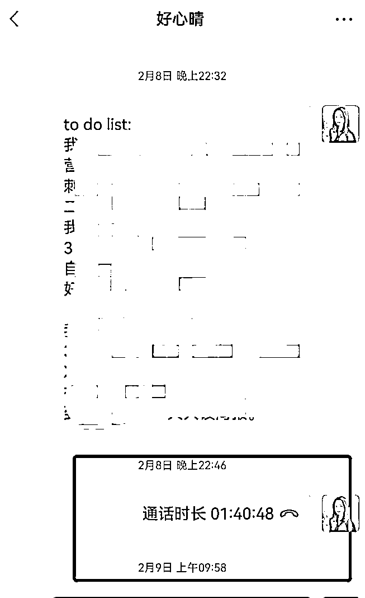
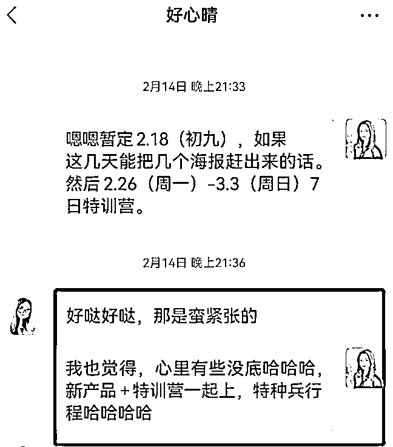
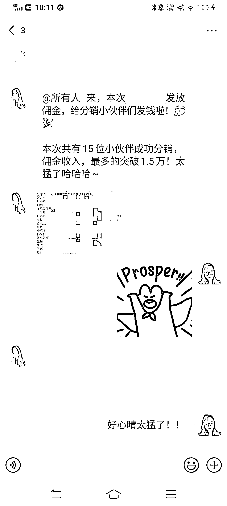
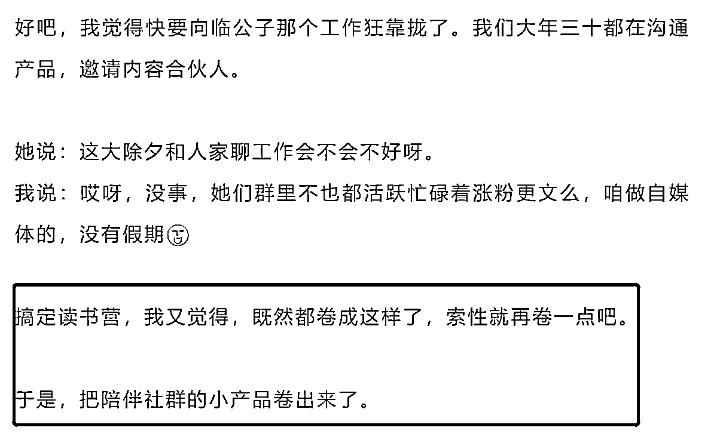
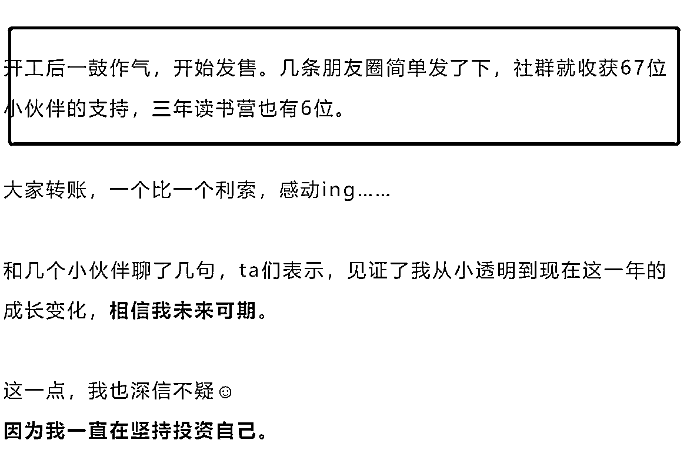

# 一个新产品，7 天营收过 10 万，复盘从 0-1 之路

> 原文：[`www.yuque.com/for_lazy/thfiu8/lwgwai43ri2r2t7f`](https://www.yuque.com/for_lazy/thfiu8/lwgwai43ri2r2t7f)

## (20 赞)一个新产品，7 天营收过 10 万，复盘从 0-1 之路

作者： 临公子

日期：2024-03-22

大家好呀，我是临公子。本职 500 强企业产品经理，业余时间做自媒体，全网 40 万读者，副业年入 7 位数，出过 1 本书。

在知识付费领域，我起步的比较晚。

去年才做了第一款知识产品，到目前一年半，前后推出 5 款产品，这部分累积变现已近百万，还在快速增长中。

最近，我在做一个读书变现类的产品及群发售，效果很不错，趁热乎，我做了一个复盘。

这次给参与分销的小伙伴们发了近**2.5 万**哈哈，给人发钱的感觉太好了，以后得多搞营销活动、多给大家发钱。

1、**1 个月，本职很忙的副业自媒体，一口气完成了新产品设计+落地+第一轮发售+第一场星球活动。**

2、这产品怎么来的？

其实去年我就有想做读书产品的想法，本职实在太忙了，外加还有几个账号的日常内容输出、陪跑营备课、运营琐事等等，一直没落地。

终于到了春节！一年中最长的假期，2.7 我才放假，马不停蹄，直接开搞！

我之前已经对标过十几款同类型产品，设计了 4 个读书产品方案，各有利弊。

2.8：拉上我的团队伙伴好心晴，语音了近 2 个小时，敲定方案+整理出 to do list~

  

2.9（大年三十）：我注册好了星球、联系星球老师开设好权限、一个个与内容合伙人们沟通权益，邀请入场。

2.10（大年初一）：做海报、做 LOGO、铺设内容、考虑定价。

2.11-2.16：梳理读书营权益、制定分销规则、共读互动搭建、海报物料准备、后续微信群承接等，把基础设施搭建起来。

我原本想尝试定金星球，但计划年后就用特训营形式推广，时间太紧，果断放弃。

2.14-2.18：双轨并行，做新产品同时+开始准备特训营。联系讲师、确认选题、安排分工、一步步推进。

**我计划里放着 30+项工作，像个发动机，推动整个机器启动~**~

2.19：开始宣传 1 元读书特训营。带着我们陪跑营 150+个同学，直接把新产品发售当成营销实战！开搞！

2.26-3.3：特训营期间，高频下场互动，我和@好心晴作为运营主力，二丫作为销售指导，又一次撑起了一场高转化的群发售。

3.4-3.8：直播、其他社群转化、结算统计等后续工作持续。

3.12：给分销小伙伴发钱哈哈~热火朝天。

3.13-目前：组织第一期共读、多渠道推广，准备下周开启。

时间线如上。

短短一个月，副业情况下，上班后每天可用时间只有 2-3 小时，不仅搞出了一个十几人参与共创的新产品、还操盘了一场超过 1000+人的群发售、同时启动了星球第一期共读。

用 4 个字形容：**疾风暴雨**。

很好，很符合我的风格哈哈哈。

几个感受：

**1/累是真的累，但也是常态。**

全年无休就不用说了，每年如此。尤其特训营期间，我本职还到处出差，争分夺秒从时间夹缝里，尽可能在场内、同时还要处理各种问题。

**2/高强度的行程，又让我综合能力进化了一轮。**

我的迭代速度，这半年越来越快，其实我去年底才第 1 次操盘群发售，没想到效果远远超出预期。

这次也才第 3 次，但每一次我都尝试了很多新花样，每一次都在升级、每一次投入产出比也都很不错。

前几天学员问：你营销发售这么厉害，都不担心同行学去吗？

我说：哈哈哈不担心呀。

**因为【能被直接搬运走的东西】，本来就没太多价值 ┓(´∀`)┏。**

市面上大大小小的发售活动很多的，大家都是相互借鉴，挺好的。但真正拿到好结果，其实靠的都不是方法或流程。

靠人。

我说几个细节。

1、我们群发售的**问答质量**，是相当高的，很多学员说，不敢相信这是 1 元群里能看到的内容。

大家如果参加过这类活动就会知道，多数都是助教简单回复，要么就是说两三句道理，然后，让你买课。

问答环节，甚至比分享课**更重要**。

因为它是一对一直面用户的过程，我们发售时**几乎每一次精彩问答后，都能马上带来几个转化**。

2、群发售的开营、结营、我个人分享，都是我花了不少时间打磨出来的。每个讲师的分享稿，我都会认真修改，确保内容绝不拉胯。

方法其实就那些，但不同人能做出不同效果，一个个细节推动了结果的方向。

**3/学会展示自己，很重要。**

这次我把分销权限，开放给陪跑营里 150+位学员。

每一次活动，对大家来说都是一个展示自己的机会，让我能够“看到”大家的擅长点，以后就能持续合作。

**实战活动最炼人。**

我今年一边快速迭代，一边打算出更多产品+尝试更多商业模式。

那，我就需要更多小伙伴加入团队，并肩作战。

如何选人——

从实战中筛选。

持续挖掘出新的合作小伙伴，再给他们更多机会，带着他们一起成长起来。

**4/学会【借势】，很重要。**

@好心晴，这次借着我做读书营，直接把自己陪伴营从 0-1 建起来了，而且还成为她拉动转化的一个附加价值。

给她带来了 1.5 万+的分销收入。

我们陪跑营另一个学员，从来没做过分销，借着这次群发售与很多用户接触，了解到很多人有考研/求职/大城市落户需求。

而这些，刚好都是他擅长点啊！

立马借着这波把自己咨询产品搞出来了，并马上开始变现，真的非常赞！

很多人没意识到呀——

**你花钱报课，最重要的资源之一，就是你的老师，他不仅可以成为你的资源，甚至可以成为你的合作者。**

我刚做知识付费那会，刚好认识了@二丫，她做事靠谱、每次合作都稳稳接住了，于是她和我合作后，两年赚了 50 万+，收入还在持续增加中。

@好心晴，从去年 9 月成为我排版助理后，有了更深层接触。

从她接手后，我这的岗位称呼就从“排版助理”变成了“编辑”，做的真是无懈可击（讲真，我对做事是有一定要求的，而好心晴，经常超出我预期），后来一步步地，成为我最核心的运营伙伴。

我上周在朋友圈说，要立个 flag：

今年必须让好心晴的副业收入，相比去年翻番。

这个月她应该能喜提**“副业月入 2 万”**的 title 了，还好还好，感觉目标正在快步实现中。

**4/学会【输出】很重要。**

这是我最近一个很深的感受。

以前，我把精力都放在【做事】上，埋头干好，完美收工，一个人偷着乐~

但，很多东西你得写下来、**形成文字、带来传播，别人还会看到，才有价值啊**。

很多人这点特别厉害。

能把一件小事，写成波澜壮阔的大场面、把自己包装成某个大家喜欢看到的形象，IP 的溢价就出来了。

这方面我不足，以后得好好学习实践（所以今天马上写下了这篇分享哈哈哈）

好了，原本随便写写，不知不觉写了这么多。

恭喜自己又一次迭代升级，也特别、特别、特别感谢团队小伙伴。

**群发售作为一个综合型的营销项目，市面上，几乎没有副业团队能做到、更不要说做到高转化**。

而我们，是为数不多的其中一个。

今年我的另外一个计划，是邀请更多优秀的小伙伴加入团队，大家一起各项神通，各施所长，端起更大的盘子哈哈哈。

做自媒体太有意思了，极大地满足了我对世界的好奇心。

我很享受这个过程。

以上是这次分享的内容，感谢大家。

———————❤️🙆🙆❤️——————

如果对你有帮助，点赞支持一下吧~^^

【更多文章】

《5 天营收 20w+，第一次做社群发售，全流程复盘》[`t.zsxq.com/16wILbuy7`](https://t.zsxq.com/16wILbuy7)

《写作变现之：写作课到底能不能赚钱？》[`t.zsxq.com/182ZJJ04g`](https://t.zsxq.com/182ZJJ04g)

* * *

评论区：

暂无评论

* * *