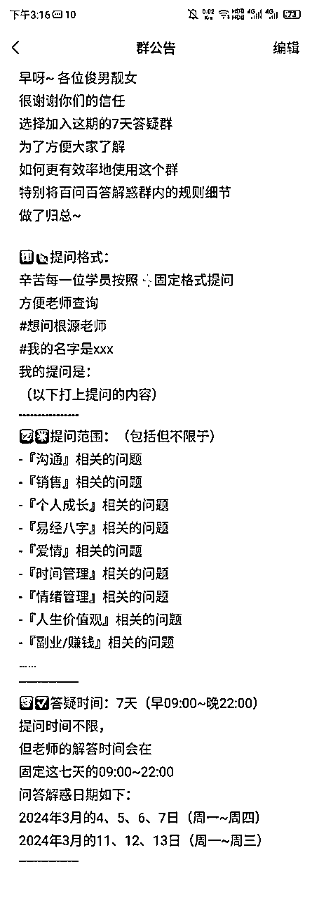
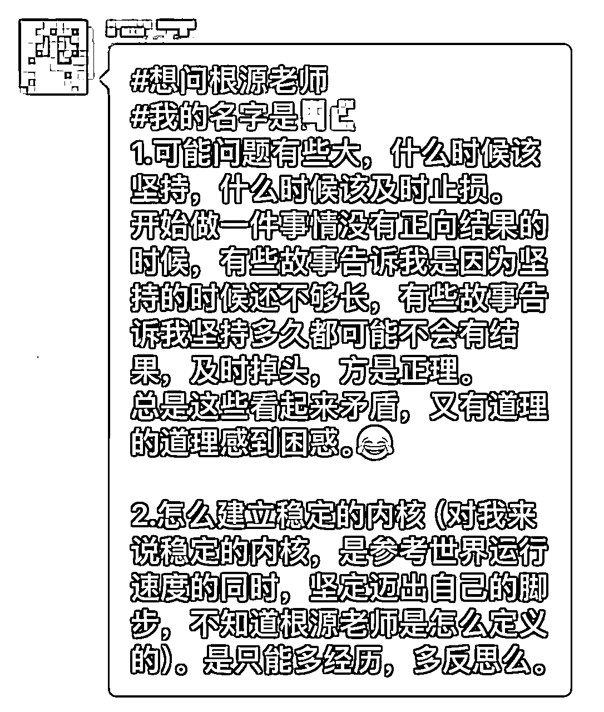
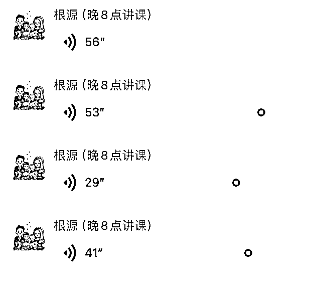
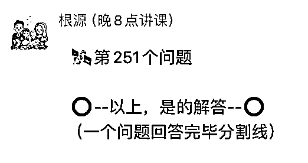
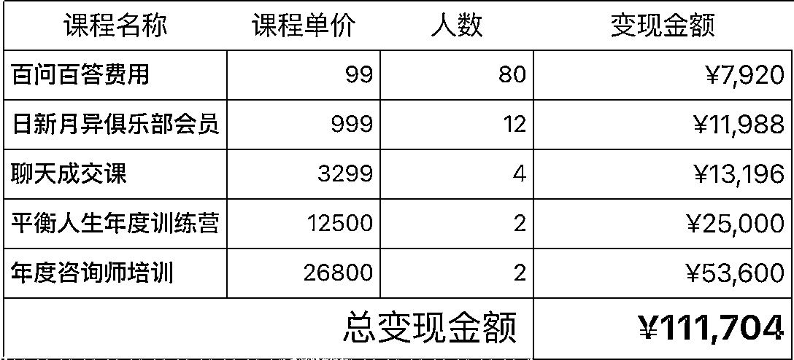
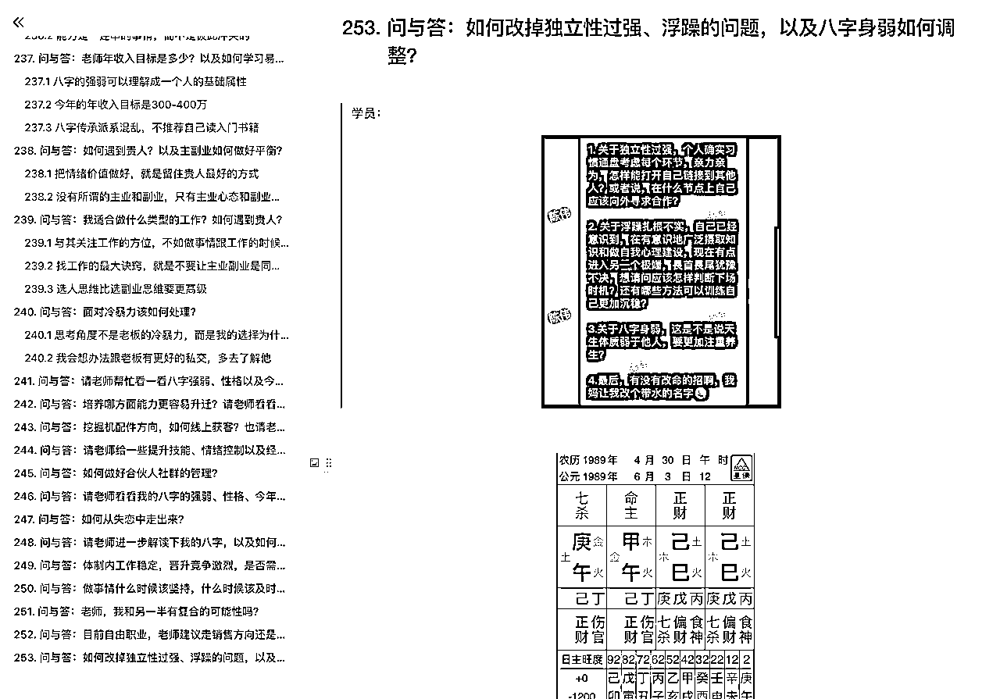
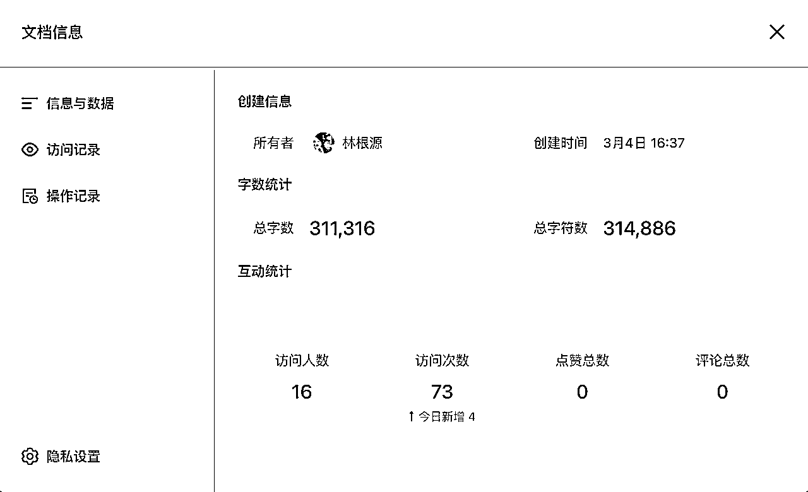
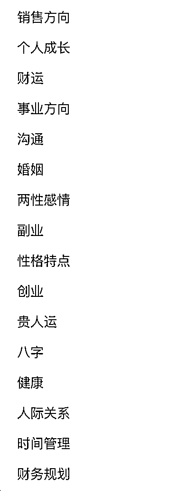

# 第一次尝试「问答群形式」的私域转化，7天变现11万

> 来源：[https://oee5lr7gsk.feishu.cn/docx/AIZSdEGb5oENaox3r3CcPw25nqf](https://oee5lr7gsk.feishu.cn/docx/AIZSdEGb5oENaox3r3CcPw25nqf)

全文共：7185 字

预计阅读时间：9.21 分钟

圈友们好，我是根源，

今年其实想在去年的基础上做一点突破

就是把原先不太擅长的公域流量，用一种更有效率的方式转化。

刚好也因为最近运气不错

文章被生财公众号推荐、参加了一期搞钱女孩的播客、还上了二更的采访、以及两个月前正式恢复了日更

吸引来了挺多的公域粉丝

想着如何能够留住这部分公域用户，并且做进一步的转化

于是就有了在这方面的，第一次全新的尝试

成绩还行，7天累计变现了11万。

那这篇文章主要谈的就是

这次从公域到私域进行二次转化的完整流程和底层逻辑。

生财有术有很多朋友其实有大量的公域粉丝

对于如何更有效率的转化，也会有不同的方式

想着如果能把这次尝试的思路和路径做一个完整的梳理，

那说不定能提供一些新的方向

以及帮到那些正在这个领域中摸索的朋友。

这篇内容我个人觉得真的挺棒，

如果你刚好也在做从公域到私域转化的一些事情

很欢迎看完文章后

能一起讨论。

* * *

# 「用户相对没有那么精准」的公域，该如何变现？

前阵子跟股东开会的时候，聊到『公域的粉丝如何更有效率地变现？』

就类似于

明白老师或者我的公众号粉丝

如果有专门的粉丝交流群

如何做进一步转化

边聊的时候，陈雪也提到了，对于目前俱乐部的听众转化是迷茫的，

不知道这么多听众，该如何变现

那天也用这个场景为思考

才有了今天这篇文章。

那对于公域的这些粉丝

有一个考量因素是，

公众号的读者，或者会听播客的人，整体对于商业的认知可能不会那么深，

就是可以理解为「客户没有那么精准」。

因为无论是公众号粉丝，又或者是播客听友，

其实看文章或者听播课很简单，只要关注了公众号，我就能看，

只要订阅了播客，我就能听，还不需要付费。

所以对于这部分粉丝，相比于生财有术的社群，人肯定相对的没这么精准。

* * *

# 私域转化的第一步：付费筛选

如果说拿播客的粉丝的精准度，

跟生财有术的用户精准度来比，那肯定没办法比的。

也因为这样的前提条件，

我第一个思考的是『如何筛选』第一波用户

也就是谈变现之前，

必须优先思考的是：如何用一些机制，把人群做第二波更好的筛选。

（第一波筛选，从播客订阅粉丝进到听友群）

那我的想法，

一定是先别管多少人听过播客，

只管我们如何先去筛选这些已经进群的人。

所以这时候我就想，什么样的人会想听播客？

这档播客栏目的本身就是教大家怎么搞钱，尤其大多数采访嘉宾都是很优秀的采访者。

所以我想的方法是

### 能不能够透过第一个相对小的变现，去做流量的筛选？

我一直有个逻辑

所有的变现初期，一定是从一块钱开始，

因为几百几千万，都是从一块钱开始的。

以及，

### 对方愿意为你支付『金钱』开始，就是一种更高级的信任感提升。

因为前段时间有幸成为播客某期的采访嘉宾

那刚好谈一谈我对这部分的理解

先想像一个场景：

如果今天我是俱乐部的听众，

我的想法可能是：

*   我想成长变得更好

*   这是个不错的栏目，反正就当故事听听

*   我想找适合自己的副业、项目

*   想找一个很棒的老师，跟著她学习

*   又或者是想找一个很棒的创业者、博主，更进一步的关注她

这是身为一个听众，我可能会有的想法。

也就是，肯定要对第一波筛选进听友群的人

往上面几种可能的方向进行运营

因为，社群最终能否完成哪些目的

都是群主的运营方向决定的

我观察到，播客大多数的群

运营者只做了一件事：下阶段活动的告知

*   就像新的内容开播啦！

*   我们哪哪的线下会开始啦！

*   谢谢你喜欢我们的内容，太开心了！

*   ...........

这类的运营，很容易让一个群慢慢的不活跃

因为『公告』并不属于运营的一环

除了这些告知外，

运营者还会把当期嘉宾的联系方式（微信名片）

推到群里让听友能直接联系

这时，就容易发生一种状况......

能够当嘉宾的人肯定很优秀，

如果我一个小听友，要我自己去加采访嘉宾的微信，我可能会不好意思，

又或者是不知道该怎么聊。

所以，如果能增加一个渠道：

更好地为播客的听友提供，跟嘉宾的链接方式。

由日新月异俱乐部做一个『组局者』、又或者是『引路人』的方式。

* * *

## 如何用合适的话术，引导用户进入第一轮的筛选

所以我想到了一个，能尝试变现的方式

每次，一期的采访更新后

可以直接在群里面去做一个公告，就类似

今天这个播客结束之后，

如果说你对于这个播客的内容

是有兴趣的

如果你对于个人成长有兴趣，

你也渴望想找到一个新的事业，

我们能额外开一个小群，

但是这个小群要付费，

可以把费用设定在99元（或是更高），

有一个七天的的提问群，

这七天你可以在群里面，向采访嘉宾提所有的问题，

可能是创业的问题，

可能是当期嘉宾时采访主题的相关问题，

七天之后这个群就解散。

也就是，这个群只开七天时间，

群能有几个好处，就俱乐部为主，可能能获得到是

*   能进一步筛听友群的听友

*   99元问答群的分润（第一块钱的发生）

*   测试每个群的活跃度高与否

*   听友对于当期采访的活跃程度

如果是嘉宾的角度，可能能获得到的是

*   为自己的业务、或者课程，带来新流量

*   99元问答群的分润（第一块钱的发生）

*   深度的延伸采访没提到的主题

*   跟听友有更深的链接，找出更认可自己的人

*   获得新业绩、资源

因为99元不是个高价格，同时更是一个不需要有太大考虑成本的金额。

也就是

听完播客之后，接著进到的大群，

然后这时候可以用公告，又或者是用小助手私下去找每个人私聊的方式问他

* * *

## 引导用户进群后的运营和转化逻辑

上周，我用的是这样的群公告，进行这个方式的第一次尝试

公告的内容如下：

很谢谢各位这一期的收听

那我想大多数的姐妹

可能目前有对于如何选择副业会有疑惑，

又或者是我觉得这项目好棒，

我想知道目前的我

适不适合做这个项目

还有我应该投资多少钱，

以及我应该怎么跟讲师

有更好的链接，

又或者是我能不能够

直接购买讲师的课程

其实这个流程

只是为了提供一个更好的通道，

让所有的听众能够清晰的知道。

如果我想进一步链接老师，

我应该要用什么样的方法

可以更快地链接

如果说各位姐妹是有兴趣的，

你也觉得这个项目可以尝试着做，

然后你想得到更深的了解，

我们有一个专属于采访嘉宾的提问群

但这个提问群

就是要付出点代价

得付99元

这七天你在群里面的所有提问，

讲师跟采访嘉宾都会给你答复

那在这个99元的群，

你就可以透过这七天

去了解这项目到底适不适合你

这个讲师又或者这个创业者

到底适不适合我跟随

所以是一个很好的确认

自己是否适合的一个七天

然后99人的群开了之后，

主要就由采访嘉宾来负责运营，

这七天的群，嘉宾就只要负责回答问题就好，所以任何问题都可以回答。

那好处就是如果这个七天的回答，支付99元的听友觉得有兴趣，

那他就能够再更进一步的跟采访嘉宾有所链接

比如去接触这个讲师的课程，或者是他做的项目。

那这过程的好处是可以经过两层变现，

*   第一层变现就是，支付99元。

*   第二层变现就是，听友们可以在跟嘉宾有进一步链接的时候，嘉宾就有机会做二次转化。

* * *

## 透过第一轮筛选，重新激活私域，以及精准地了解用户属性和转化数据

原本这只是个概念，后来这个概念，

因为刚好这一次我被播客采访了，主题是销售以及易经八字。

采访完之后，因为跟主里人关系比较好，就能拿我自己的尝试，把上面谈的慨念落实。

我也尝试用这种方法拉99元群的答疑方式，来进行第一波的转化。

交付群第一次转化的时候，虽然群很多，但第一波的转化并不好。

主里人跟我聊的时候就讨论：

为什么一个99元的群

在转化七天百问百答的时候，

转化率这么的低？

第一波在所有的群都群发，只有三十几个人愿意支付这个99元，

也就是对将近9000人告知，最终只有35人付款，0.3%的转化率。

我就跟主里人说：

能否转化变现重点并不是钱的高低，

而是一个播客结束之后，

或者一个采访完成之后，

社群运营或者是运营的方法，

其实可以再更加的详细一点，

或者是更加的活跃一点。

因为群这么多，但是最终人没有留住，

容易让听友觉得我：加了这群也没有用，进而变成一个死群。

这事情也可能会进一步的导致整个播客的质感，

有可能会因为这个群没有运营好而降低，

所以，这个方法刚好可以测试哪一个群能够有更多的人回应，

又或者是哪一个群会有更多的人支付99元。

这时候就可以采取一个模式，

就是让所有的用户请小助理去私聊，

一个小助理负责一个群，或者一个小助理负责两个群，

然后我们就能够做一件事，

把大群一号延伸一个付费一号，

大群二号延伸一个付费二号。

那这时候，我可能使用群公告发了、或者是私下聊天，

就能知道付费一号群有多少人，付费二号群有多少人，

假设大群12345678号都有500人，

1号群里面有10个人付费，

2号群里面有30个人付费，

3号群里面有15个人付费，

……

这时候我们就可以有个数据，知道哪一个群的群友活跃度是最高的，

哪个群的的这个对于播客的认知跟认可度是最高的。

最终就能够计算出一个数据，

也知道哪一个群可以更认真的维护，花更多的时间，

因为活跃度其实是筛选名单的一个很重要的点，

这件事情的工作量并不小，看似琐碎，

但是第一波的筛选（甚至未来每一次的筛选）能越细节、严谨，私域就能越稳固。

所以可以先透过第一波尝试收99元的方法来确认哪个群活跃度最高，

这时候进一步的我就能够有机会去想，我应该优先激活哪一个群。

也就是第一阶段尝试的变现，

不只能够筛选人，还能够有营收，虽然这个营收不是这么多，

同时还可以激活群，还可以测试哪个群的活跃度最高，

以及目前整个播客的听友，对于这个播客活动的参与度到底有多高。

所以，一件事情可以一举多得。

* * *

# 详细拆解『问答群』转化的运营细节

## 群的开营以及规则说明

因为这是第一次的尝试，所以群在开的时候，

初始群其实只有很少一部分听友，但因为持续解答的过程增加传播

以及因为有播客，陆续有新朋友加我好友，

重点是我自己的俱乐部同时又是听友的人，也被我邀请进来，

最终群的人数增长到了102人左右。

前期的群主是由主里人负责小助理，

然后当这个群正式启动之后，就由我负责接手，

我除了做一个开场的开业仪式之外，也解说了群的规则，

那群的规则大概我当时是用这个方法打群公告的。

百问百答群公告

* * *

## 群问答的运营方式

群开始运营之后，接下来就是讲师的能力，

就是讲师看讲什么主题，就回复什么样主题的问题，

因为我当时的主题是销售跟八字。

所以，在群里面的提问都是这样子：

#想问根源老师

#我的名字是xxx

我的提问是：

（以下打上提问的内容）

我固定的回复模板就是我会把对方的提问截图截下来，然后用语音回复。

那如果说觉得语音回复不熟悉，也可以选择用文字回复，

我之所以会用语音回复，是因为速度快，

讲的内容多，然后我回答起来也顺畅，

同时，我还有一个机制，就是如果说他不好意思在群里提问，

也可以私下加我，同时把问题发给我，

然后我会重新做整理，把他的提问截图，隐掉头像跟昵称等个人信息，用匿名的方法在群里面回答。

所以固定的模式就是

1.  一张图片（学员提问）

1.  一段语音回复

1.  最后有一个分割线（作为一个问题回复完毕的标记）

一张图片（学员提问）

语音回复

分割线

* * *

## 透过『问答』更精准地提供价值，同时增加用户的自主推广

因为这样子的问答群有个好处是，

只要有一个人开始问，其他人就会想：

哎呀

我钱都付了

这不问可惜

反正都有人开始问了

要不我也问吧

……

然后这时候，就会因为我不断的回复，让群持续的活跃

就会有更多人想提问，不管是群里的提问，又或者不管是私下的提问，

所以这就会导致群能够持续的活跃。

所以第一天结束的时候，我大概回答了快40个问题。

然后累积了接近4万字的回答，

这时候就有人主动到播客的大群，

就说这个99元的群太好了，可以得到解答，然后又不是那么的贵。

以及得到的解答会让我觉得非常棒，老师回复的非常好。

就这样子开始有人打广告，以及日常加我的好友的私下邀请

所以第二天，从原本40个人的群，增加到了80人。

然后又到了第三天，我持续地回答，又有人主动到大群推广

……

所以到目前第六天总共的人数是100人，

然后在回答问题的过程，我同时也会去介绍我自己的课程，

因为我觉得介绍课程这件事情，你也可以说它是广告，

但其实我们在回答问题的过程，待在群里的人也会持续地听我的每一个回复，

所以变相的我就能够一直介绍我有什么样子的东西，以及我给出什么样子的实际解决方案，

就能够让我，最后如果真的想要推课的时候，就可以比较方便。

当然，这个群最终的目的也可以设定我要推课，

也可以设定我不要推课，我就只是练习自己，又或者是练习运营群的方式，

所以看每个讲师或者嘉宾设定什么样子的目标。

所以，这个运营就会造成一个良性的循环，

有人喜欢群提问，我就给回复，

有人喜欢私下回复，我就重新做图，然后在群里面给他匿名解答，

解答完之后还会私下跟他说已经回复完毕了，要请他再去找一下。

当问题累积的越来越多，就会让提问的人越来越多，

所以这个群就会有一个很好的正循环运营。

* * *

## 解决问题的过程，增加『第二层变现』的转化率

然后边提问的过程，我会边去介绍我有什么课，

群里也有人就会说：

老师你可以介绍一下你有什么课程吗？

我觉得我想了解一下

那这时候我就有一个很好的时机，

可以在群里面去为自己打一点广告，因为这个打广告是我新给出的回复，

所以有人提出了问题之后，我就能够很合理的去介绍，

我接下来要推荐什么样子的类型的课程或者是内容。

也就是边答疑的过程，就有人私下跟我说，

老师

我想报名你的课

我觉得你的课

应该对我会有些帮助

所以在整个运营的过程，我就开始能够招收到一些新的学员。

然后第七天结束之后，会有一个公告，

就是第八天结业式，然后结业式，我用直播的方法开结业式，

那直播的过程，我同时还可以现场再做几个答疑之外，

同时还可以介绍，我的课程能够帮助到什么样子的人，什么阶段的人，

所以这时候，就能够有一个很好的转化，

从第一波大群的听众，然后再到99元付费群的筛选，

第一次的变现之后，再到如何让这个群里的人可以去接触到讲师，跟讲师有更深的链接，

这个过程同时也能让播客的听友，得到了问题解决。

所以这个是一个挺好的变现的模式，

也附上这次的成交总额、除了播客听众本身的转化

同时也完成了自己俱乐部成员的高单价转化

999元以上的产品，主要都是自己俱乐部的老会员

因为这次的答疑后，再次找我购买，进而转化的。

我一直觉得『知识付费』又或者说『付费筛选』，

其实是私域运营里面非常好用的方法，

因为在群里面的答疑就是给出价值，

那这种答疑的价值其实是最低成本的价值提供。

因为我只需要给出讲师过去的经验，我就能够有很好的运营逻辑，也可以让群可以活跃。

* * *

# 1个细节，增加私域运营的转化和运营效率

还有一个我觉得挺重要的运营细节

如果说真的想在社群有一个更好的转化，

我觉得有一个点是

人数不要太多，可能在200人以内，我觉得够了。

一个群的人数只要超过200人以上，

1.  一方面我会觉得运营的过程会有点吃力；

1.  再来一个更重要的点是，因为人太多了，就导致在群里面的人会觉得，

群里面的人这么多，我说话也没人听到，

又或者是群里面的人那么多，我说话也觉得不好意思。

又或者是群里面人的这么多，我讲什么讲师也看不见，

……

那与其这样，我还不如私聊讲师。

所以其实一个群保持在200人以内，我觉得是私域运营的效益最好的群人数。

一个群只要过200人就会有点重，尤其是人只要一多，讯息一多，那更麻烦，

就会导致有人连看都不要看。

我想大多数的人一定有好几个500人的满群，

可是你会发现你要让500人的满群，可以获得这么好的活跃度，难度很高，

毕竟不是每个人都是靠谱，有这么强的能力，可以把一个群有一个更好的激活。

大多数的人在运营群的这部分人只要人一多，

其实都会发现还不如人少，我还能够运营得更好。

也就是如果说这个群不小心满了200人，我也会开二群。

我不会在把后面的人，放到第一个群持续做运营，我一定会新开群的。

当然这个群目前没有到这么大的规模，但是我自己的社群其实也都不会超过200人以上。

因为这个规模下的群运营，是让我感觉最轻松，也最能够得到好交付。

也最可以让群里面的人感觉到被照顾的一个数量，

也就是现在如果你发现运营群的过程会有一点吃力，我觉得可以尝试的把人减少。

人在减少的过程，你运营的时候就不会这么有压力，

所以，这是一个在私域上我自己的一个运营方式。

最后

这是一个初步的尝试

虽然整体的转化数据并不高

但这个方式，如果长期的做

可以很好的激活老会员、以及公域转私域获得第一块钱的好方式

附上我梳理的一个「问答群形式」私域转化的流程图

这流程图更直观，也能更清晰地理解背后的转化流程和逻辑

同时

也因为这次的七天小活动，大量的输出，沉淀出一份很棒的档案。

一共累积了253个问题，以及31万字的回复内容

253个问答

31万+问答内容沉淀

问题的种类也包含了以下主题

这两年多，我也对私域还有销售，有另一层不同的感受

透过私域运营把人经营好，最终有成交肯定最好

但比起是否成交

### 我认为更重要的是，透过更好的服务，让『每个用户』产生更好的印象

因为

当下没有成交，不代表未来没办法成交

只要把服务做好、细心一点

用户比较一轮之后，一定会再回头来成交的。

最后，祝福各位圈友新的一年

心想事成，生财有术！

* * *

# 尾声的过去历史介绍

我是根源，同时也是第四期的生财圈友

一个有 2w+ 实战案例的心理咨询师

12年线下销售、团队管理经验。

2022 年开始转型线上，做一些知识付费的项目。

过去曾发表过几篇文章

都能看到这，代表你对文章的喜爱

肯定有一定的程度！

也欢迎阅读过去我写过的历史文章。

2021年的文章（精华x1）

1.  精华《直觉式萨克斯 透过社群成功变现146万》 https://t.zsxq.com/116B1bcYc

1.  《73项被动收入打造》 https://t.zsxq.com/11EHjTH0P

1.  《杭州夜话02场，夜话官复盘》 https://t.zsxq.com/19IkX4UMl

1.  《年入百万，团队从20人到4万人》 https://t.zsxq.com/19JYt77hL

1.  《主题：如何更有效的链接见面会认识的圈友》 https://t.zsxq.com/19VY2LWg4

2022年的文章

1.  《互联网小白，第 1 次做线上产品，7 天赚回 10 倍门票》 https://t.zsxq.com/11ooZZbM7

1.  《把捣乱分子『逆势』转成爱用者的好方式》 https://t.zsxq.com/19lipLhJ5

1.  《 好的内容，是目前依旧没退旧流行的变现方式 》 https://t.zsxq.com/19BLMAYw1

1.  《明白老师的一个启发，让我从100天日耕的过程赚了30W+》 https://t.zsxq.com/19BgNoxfi

2023年的文章（精华x6）

1.  《私域的意义不是管理，而是经营》 https://t.zsxq.com/19WEsfSq1

1.  精华《9年传统行业 1 年时间，从一无所有，到年入 200 万》 https://t.zsxq.com/10nmEr1cA

1.  精华《25个提高微信成交率的小技巧》 https://t.zsxq.com/11AgRW24F

1.  精华《35 个让私域收入翻 3 倍的技巧》 https://t.zsxq.com/11FmV2aqZ

1.  精华《续篇 - 25个提高微信成交率的小技巧（26 - 50）》 https://t.zsxq.com/13yRbmUwo

1.  《 私域话题：涨价之后，如何回复以及留住客户？》 https://t.zsxq.com/11UJk9HxQ

1.  精华《成为自由职业者的20个必备特质 》 https://t.zsxq.com/14XTxhh15

1.  《 36个让私域成交率翻倍的实战指南！ 》 https://t.zsxq.com/17zSrYzvk

1.  精华《产品线有引流体系，如何通过沟通促成升单？》 https://t.zsxq.com/17ocUJEFA

1.  《知识付费赛道，如何透过处理『反对问题』，增加用户粘性和复购率？》 https://t.zsxq.com/181fSc5rv

多亏加入了生财有术

让我少走了很多弯路。

也积累了一些经验、心得

如果圈友有什么需要探讨的

欢迎加我微信「 AF54094 」交流~

▲

也能扫码撩我~