# 用AI工具10分钟生成儿童睡前故事，全程免费

> 来源：[https://dik4wr1hyrw.feishu.cn/docx/ARLxdjG0SoEl5jxuqLKcANtAnfe](https://dik4wr1hyrw.feishu.cn/docx/ARLxdjG0SoEl5jxuqLKcANtAnfe)

最近刷油管看到儿童睡前故事，做的特有治愈性，也在琢磨这类视频能不能用AI工具来做，啥也不说，直接上手操作。

不管做什么，模仿绝对是第一选择，我是在油管刷到的视频，找到最热门的视频，提取视频字幕，让ChatGPT来进行改写。

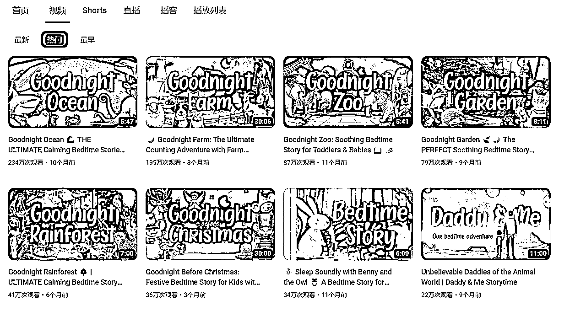

## 提取油管视频字幕

找到最热门的视频，复制网站，打开视频字幕提取网站https://downsub.com/，输入油管视频网址即可直接提取。

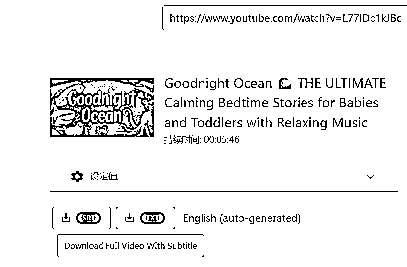

## ChatGPT3.5改写儿童睡前故事

我们把刚才提取的视频字幕直接发送给ChatGPT，让它模仿刚才的字幕重新生成一篇儿童睡前故事逐字稿。

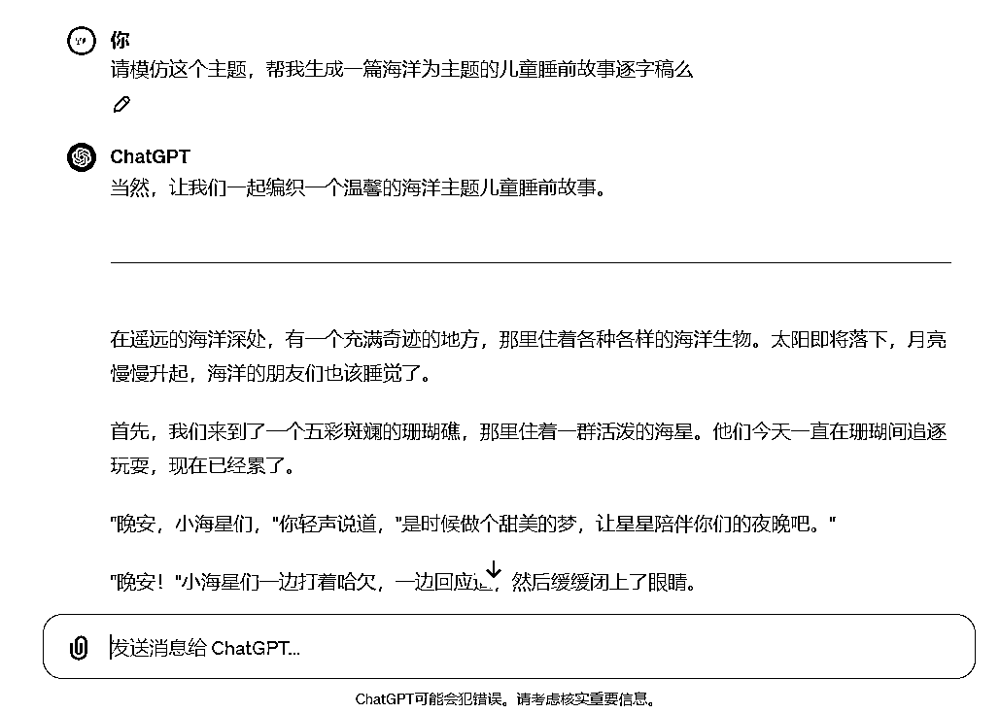

虽然生成了，但是有什么区别呢？文字这么长，不想一点点对比，让ChatGPT给我个回答。

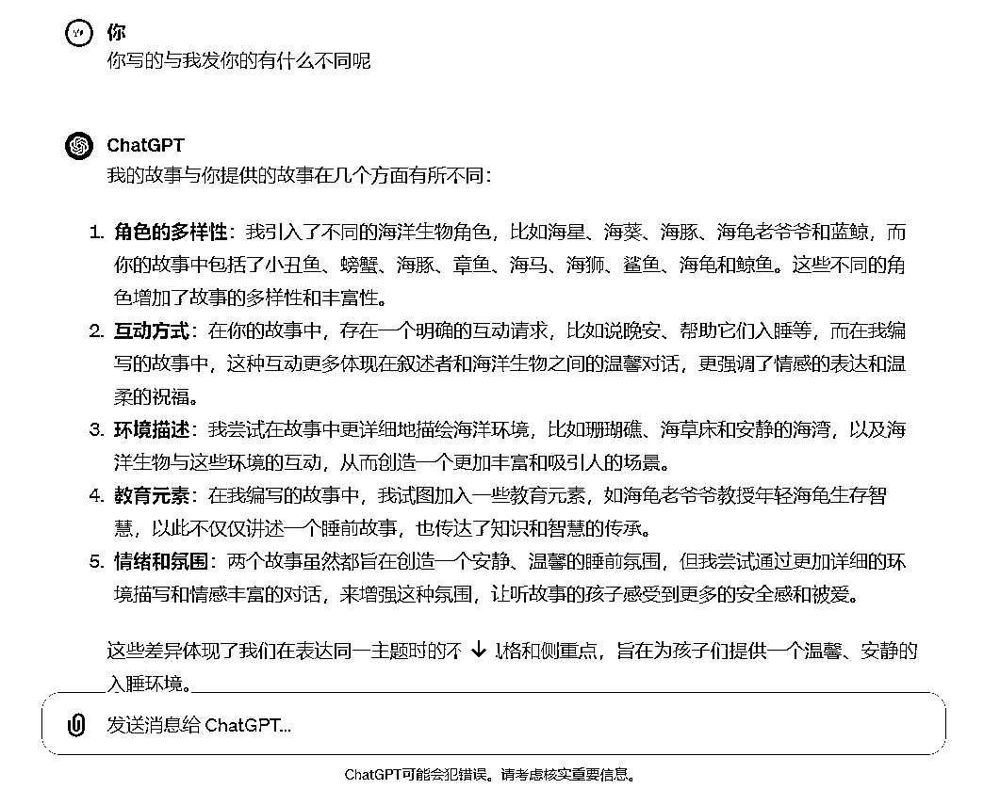

## 字幕文案配音

现在字幕逐字稿也有了，开始进行配音，配音可以选择的平台挺多的，比如魔音工坊，腾讯智影，配音神器等。

我选择的是腾讯智影，既然是儿童睡前故事，配音最好选择女声，柔和一点的或者是童声。

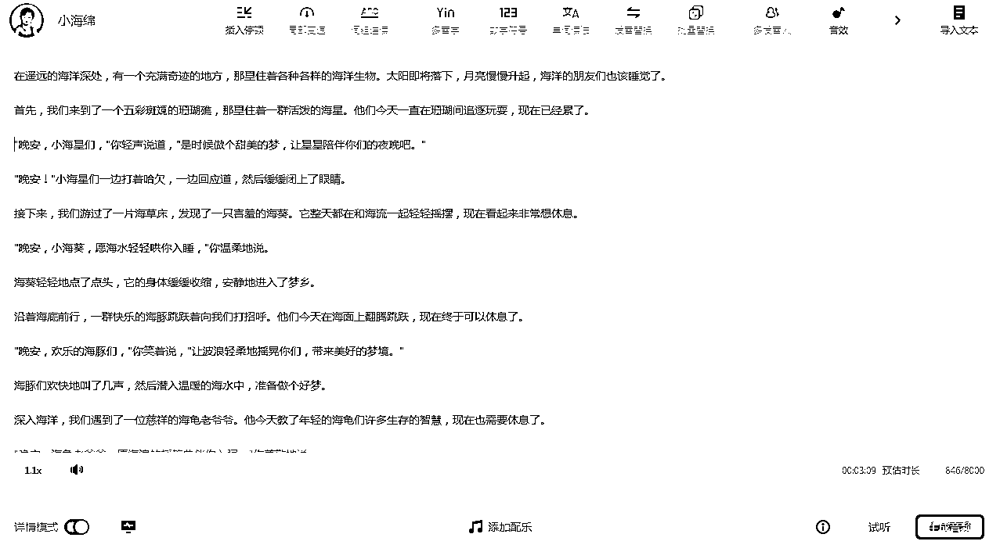

## 每个画面图片生成

现在我们需要来生成视频所用到的图片，可以用leonardo.ai，主要是免费。

在生成图片之前，我们需要先把文案逐字稿转换成中英文对照，用ChatGPT完成。

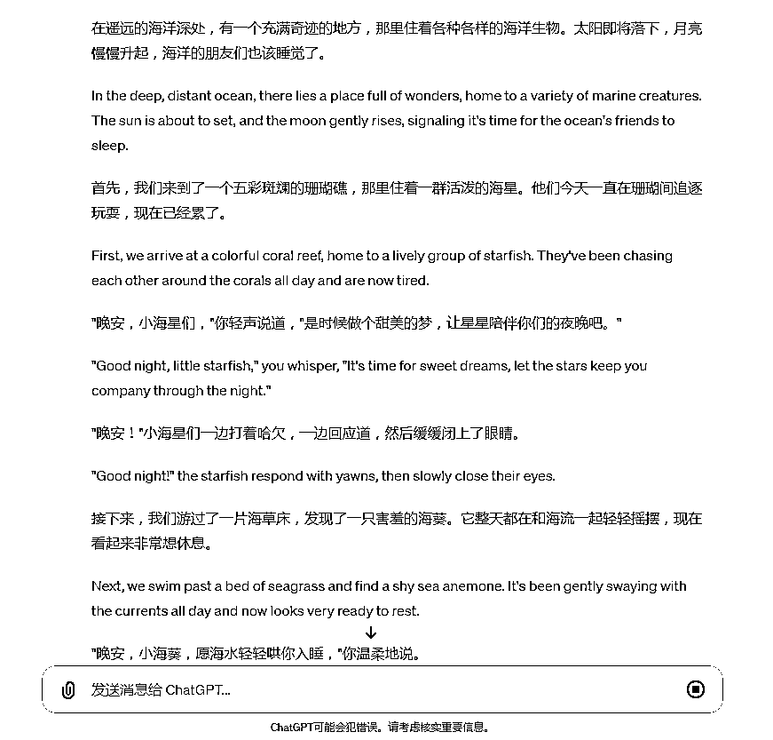

打开leonardo.ai官网（需要科学上网），可以用谷歌/微软/Apple账号授权登录。点击Image Generation进入AI绘画界面。

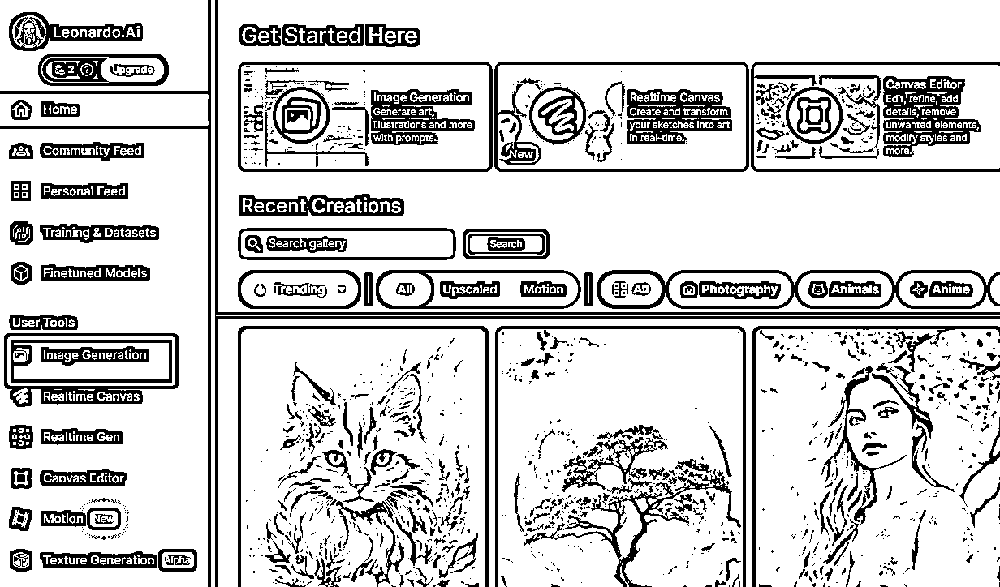

我们选择AI绘画比例为16:9，模型选择DreamShaper v7，其他的根据需求来修改。复制文案逐字稿的英文来生成图片，我们可以每个画面生成一个，比如小海星，小海葵等。

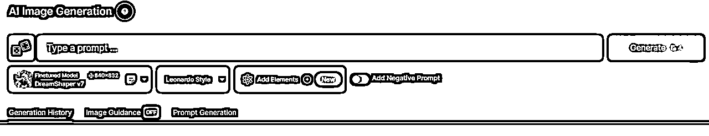

可以看下生成的图片效果，就是用ChatGPT写的逐字稿直接生成的，没有做任何的修改。

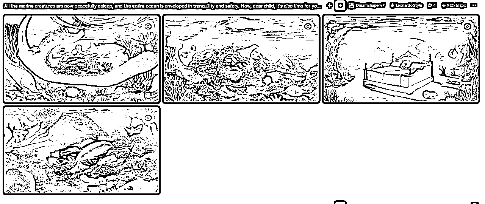

## 每个画面视频生成

还是主打免费，用leiapix和pika这两个工具（需要科学上网），都可以免费试用的，对于做视频完全足够啦！

我们先生成景深动画，打开leiapix官网，可以用谷歌账号授权登录。我们刚才生成的图片上传，然后进行简单的配置，最后点击Export下载。

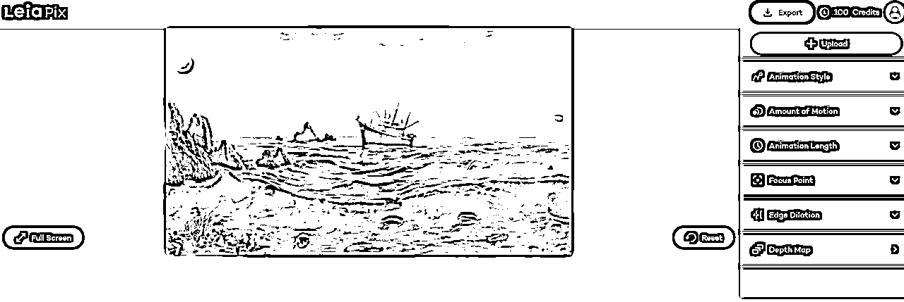

开头可以用leiapix来制作，如果想视频效果更丰富，还是选择pika来制作。

我们打开Pika官网，可以用谷歌和Discord账号授权登录。

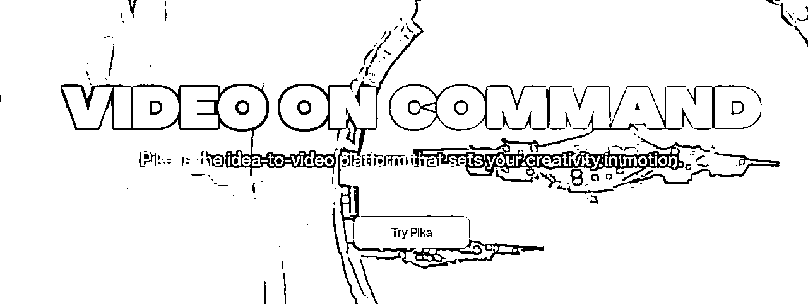

我们直接上传需要制作视频的图片，不进行设定关键词，把每张图片都生成视频。

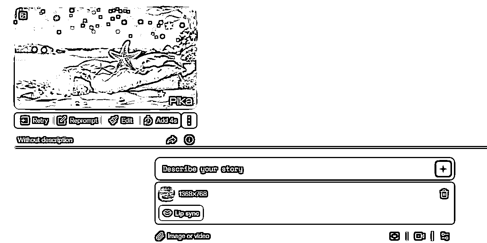

我们也可以看到生成的视频是有水印的，可以用去水印软件进行水印去除，我还是用的腾讯智影来去水印。

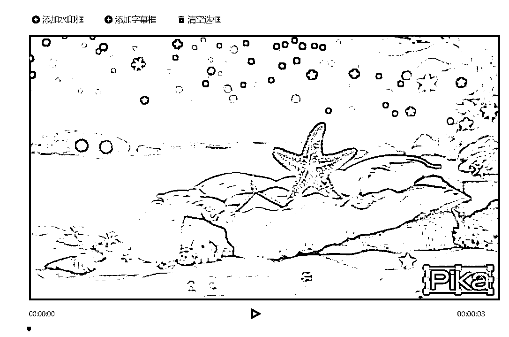

## 剪辑视频

现在配音，视频素材已全部制作完成，现在要对视频进合成剪辑。我们打开剪映，把制作好的每个片段视频导入并按照故事的顺序拉入轨道。

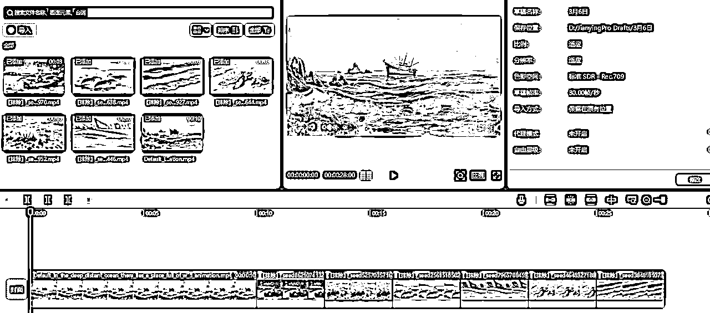

上传生成的文案配音，并且选择背景音乐（可以选择海浪声）。

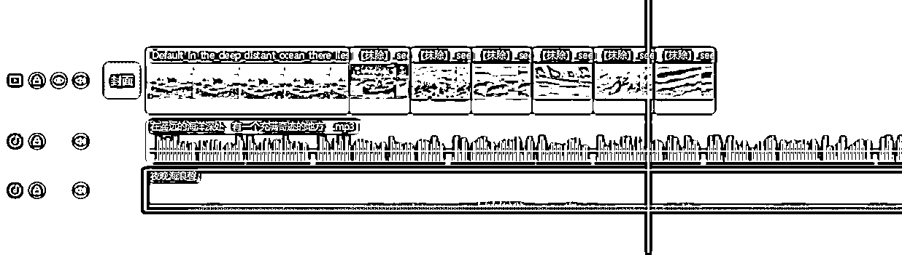

现在整个儿童睡前故事就已经全部完成咯~