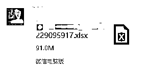
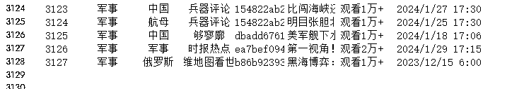
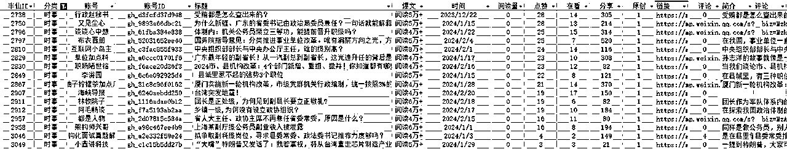
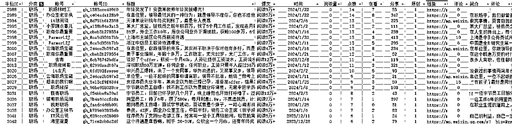
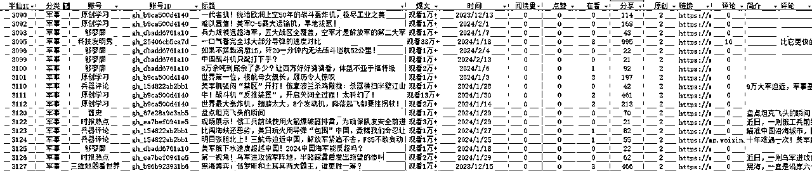
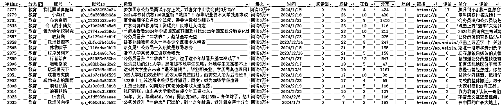
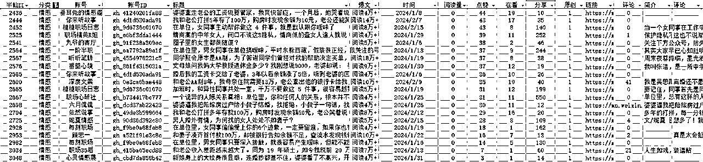
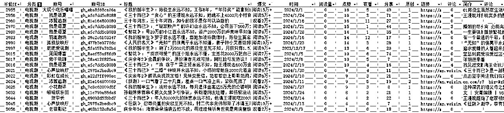
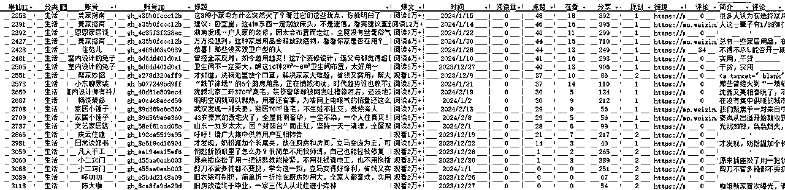
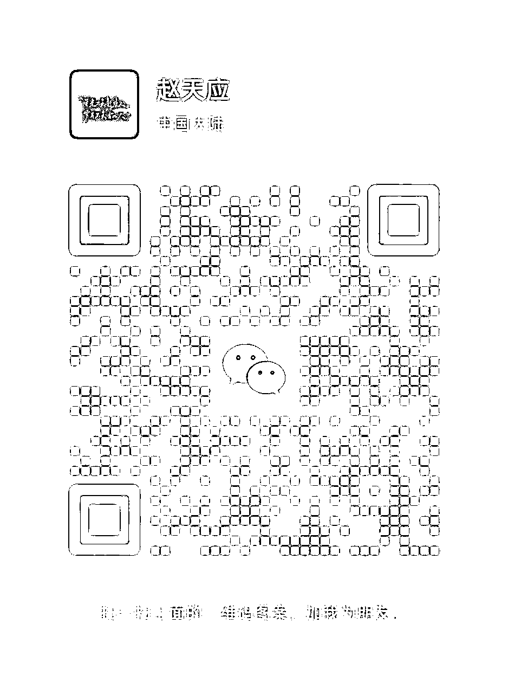

# 20240301 从20万篇公众号推荐文章中寻找微信底层逻辑

> 来源：[https://owd2uo0wwxk.feishu.cn/docx/ASdbdh86eoGIDexMRspc4B8anPd](https://owd2uo0wwxk.feishu.cn/docx/ASdbdh86eoGIDexMRspc4B8anPd)

白日依山尽，我是赵天应

黄河入海流，素材不用愁

大家好，我是人送半仙的素材魔法师赵天应

今天，我用2024年2月挖掘到的微信20万推荐文章，继续给大家讲一讲微信公众号爆文的一些有趣看法与观点

## 一、基本数据

### 1.基础数据。

#### （1）来源

本次，通过素材挖掘机，挖到近30万条微信公众号推荐数据，注意，绝大多数是微信推荐的相关文章。

包括但不限于从微信公众号文章底部的相关文章、看一看和其他渠道获得的文章。总计有91M。

#### （2）数据维度

数据涵盖了分类 、标题、是否爆文、发布时间、阅读量、点赞量、在看数、分享数、是否原创、原文链接、评论数、文章简介、高赞评论等。

### 2.数据清洗

挖掘难免会有重复，以及很多流量低的文章，通过RPA自动化，一番清洗筛选处理后，几十万条数据，只留下10%，个人简单粗暴地直接将3万及以下的文章全部清空。只余下3127条。

### 3.数据分类

#### （1）日期分类

几乎都是了近三个月内的数据。

由此，可以看到，微信推荐机制还是相对明确的，重点推荐三个月以内的数据。更重要的，核心是推荐2个月甚至1个月内的。

我这里显示有4个月，是因为横跨了1月2月均有数据抓取。

#### （2）行业/场景分类

前10名的，依然是大家熟悉的娱乐、时事、职场、军事、教育、情感、电视剧、生活、社会、科技等。

大家觉得卷的行业，其实，也是收益最多的。

## 二、半仙观点

基于以上这些数据，半仙有如下观点，与你探讨，不一定对，但提供一些不一样的视角。

#### 1.公众号流量大爆发的日子已经过去了。

之前半仙随手一抓，都是大把大把的10万+甚至 100万+的推荐文章，目前来看，要么整个腾讯公众号文章算法更新完毕，流量分散到更多文章上，要么流量被更多其他诸如抖音、微头条、小红书等分走了。

#### 2.公众号最卷的行业和小众领域依然有机会。

于我们搞素材搞创作搞公众号甚至搞互联网的来说，似乎太多人加入到了这个行业中来。

但是，要知道，我们只是进入了一片树林，而整个世界的大森林太大了，我们知道的，还有80%甚至99%的人不知道。

最卷的行业，一部分人坚持不住，放弃了；一部分人没找到方法，做不好。还有一部分，持续做，命运的机会也就到了。

小众领域，结合方法论，结合AI，使用跨界打劫，降维打击，过得很好。

#### 3.AI来了，提质增效成为必然。

有那么一句话说的是：只要一个动作重复三次以上就可以考虑让其自动化了。

还有一句话，是《唯有偏执狂才能生存》一书说的：

“我常常感觉有一朵阴云正向我飘来，但我可能需要再过几年才能弄明白它到底是什么。因此，我总是怀着诚惶诚恐的心情，小心翼翼地处理一切事物。“

我会认为，2024年的这朵云，是AI。所有的行业，结合AI都可以再走一遍。无论是以文生文，还是以文生图，还是以文成视频，每一个环节，结合到自己的行业，都可以有很多优化空间可做。

比如，公众号爆文，是不是有足够多的账号，是不是有自动化的流程可以管理，是不是有自动化的流程可以批量生产文章，是不是有AI可以辅助生产插图配图，是不是有流程可以分析文章内容质量，是不是能对文章或数据进行分词或数据拆解与拓展，太多事可以做了。

#### 4.公众号爆文并非100%靠实力的游戏。

公众号自改变算法以来，越来越向搜索引擎模式靠近，通过算法，去中心化，然后释放流量。

释放的过程中，很多人进行了拆分拆解，但有一点无疑是肯定的，这是一个暗箱与灰盒，核心算法不可能透露出来，只是猜想。

我搭建素材库的核心，也不过是用案例来说话，从更大的概率告诉大家，那些文章爆了，那类文章爆的概念更大。

公众号爆文也如此，不是一个完全靠技能说话的行业，至于技能占到60%还是50%还是80%，或者20%，得看情况。

你找到小众领域，略微努力，也许只需要30%的技能，其他交给运气，也有很大流量。

如果你进入大众最卷的领域，也许需要付出80%的技能，另外20%交给运气。

当然，大众领域里你也可以先做选择题，再做解答题，进一步拆分出细分赛道。降低你技能的权重，而提升运气的权重。

#### 5.在能赚钱的时候抓紧赚钱。

目前而已，还能做，如果没有更好的项目，可以抓紧入场，先做起来，先赚到，再赚多，再稳赚进而多赚。

如果永远停留在场外，那都与你无关。

## 三、爆款分类

接下来，就是重头戏，这些分类中的爆款文章，重点分析前几位的数据。

#### 1.娱乐

#### 2.时事

#### 3.职场

#### 4.军事

#### 5.教育

#### 6.情感

#### 7.电视剧

#### 8.生活

更多，欢迎与半仙共同探讨。

半仙微信：13401616

