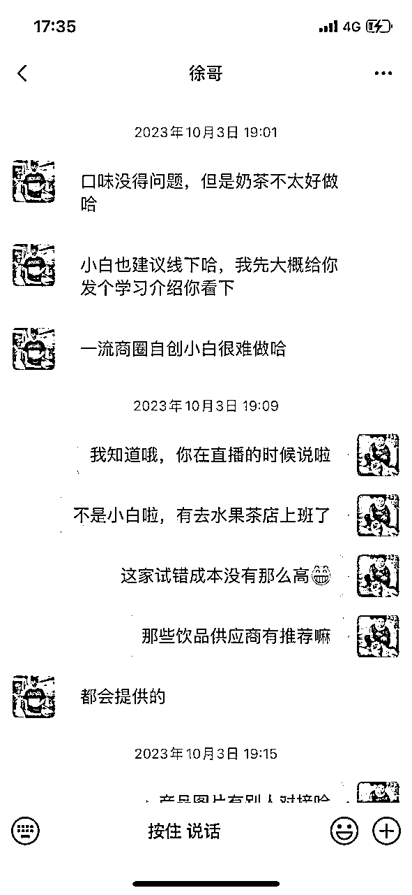
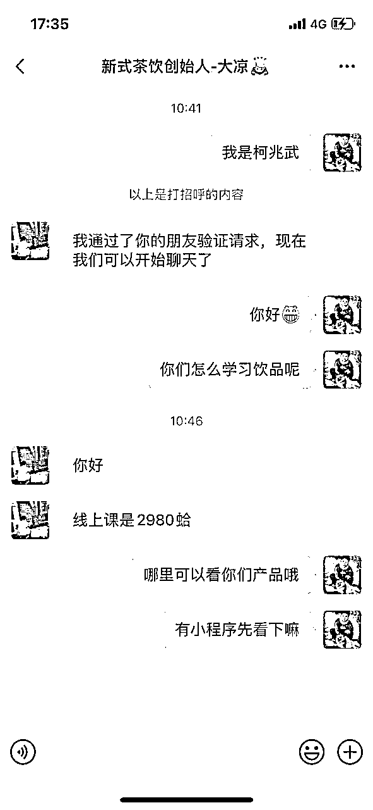
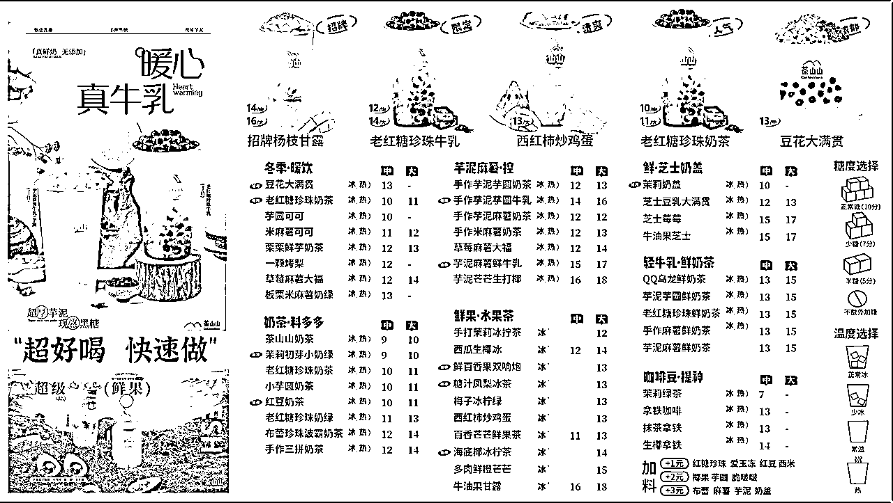
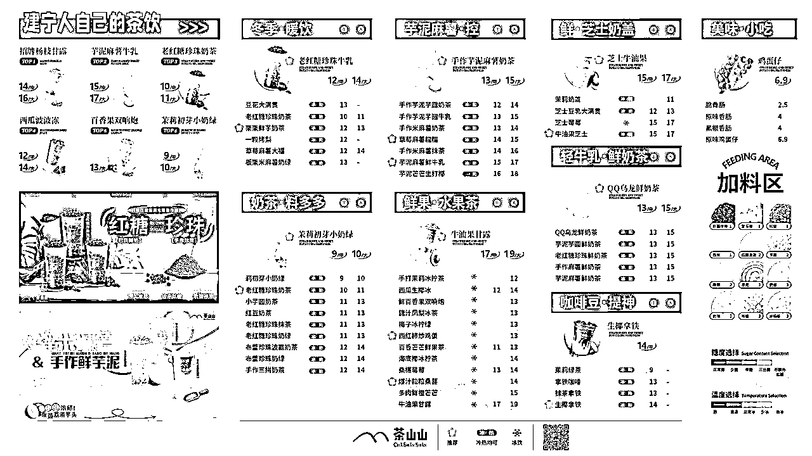

# 乡镇自创奶茶店心得体会

> 来源：[https://kwkjrjutr5r.feishu.cn/docx/YYowdupnRovRk6xdjZMc5txtnWd](https://kwkjrjutr5r.feishu.cn/docx/YYowdupnRovRk6xdjZMc5txtnWd)

县城镇是否还可以开自创奶茶店？我也路上慢慢摸索前行...

哈喽，我叫阿武，一个自创茶饮的前行者。分享下如何在这个环境下县城乡镇如何开一间自创新式茶饮店。我所在的县城太小，常驻人口5万左右（对于大地方来说他就是一个镇）。综合经济情况以及其他因素我回家乡开始这份事业。写这个也算是给2023年做一个年度终结。

一、产品篇

二、选址篇

三、设备材料篇

四、人员篇

五、价格定位篇

六、开业篇

七、门店运营篇

八、心态篇

一、产品篇

1.小县城一个工资低，就业环境不优的城市。在这个城市的人注定消费能力不够。能待在县城的年轻少之又少。大多数事业编或者家里有什么门店事业继承，在家带娃，初高中学生，其余都是40岁以上人群。所以千万别想着单杯产品卖高价。卖不动不认可，我们服务人群太少了。

以自身为出发点，我的对标对象是茶百道，它的产品我觉得挺实在的，也符合相对应的价格。

产品一定是县城的首要，县城靠口碑传播性很快，我们县城我刚回来总共22家奶茶店，现在只有17家了。也间接说明奶茶店是有很大的风险。投资需谨慎！口味不输于品牌，才能站稳第一步。

产品要怎么选择呢？

①去门店上班，去一家最少运营2年以上的自创奶茶店上班，城市越大越好，能在品牌中夹缝生存，还能获得盈利，说明这家奶茶店确实有这过硬的产品留住客户的心。去门店上班可不仅仅学习产品哦，太单一了，也只是一个操作员罢了。要学习的是，门店产品技术，更新能力，操作流程，服务意识，处理突发事件，设备使用技能，人员调节，运营能力，产品渠道供应商等等...把能看到的都记录下来。这里奉劝各位最好不要把去上班的真实意图告诉只有2.3家门店的老板，他们大多数气度格局不够。如果遇到离职还愿意分享的老板请务必抱好大腿。2-3个月足矣你把他大部分产品学习完毕。

②如果你是小白想快速进入行业，建议拜师。在这个大环境下，你的产品想做的比品牌好，难，人家背后可是有专业团队研发产品。更新速度，口感都是当下顶尖。不要觉得自己可能做的一两款好喝就可以超越。经常有客人跟我说你做的不输古茗，茶百道口感。我也就笑笑属实不敢托大。

拜师教学费后你们就产生了链接，后续他更新产品配比也会给到你，（赚你点物料费，该他赚的，如果你觉得贵，可以上淘宝找相对应的物料平替）起码你省了个研发团队费用。产品在稍微修饰一番，就是变成了自己的品类。毕竟在不同城市你就是唯一~

这里拜师一定要去线下学习！要不然你很多基础常识是学不到的！例如粉跟热水搅拌后要过滤。在加冰冷却，单纯的产品配方不一定看的会。小红书找师傅，抖音找师傅（只收线上的不用信），熟悉人介绍，路上爆满门店都是你的师傅。我60分的水准也可以做你前辈。主要还是找到稳当的人，要不然一次性后就不理人，没用。他有群一定要加群，之前的学员起码会有参考意见。

③去供应商办办场所，如果没有认识这方面的人。社牛可以直接去问开奶茶店的你们哪里进的原材料，社恐打开抖音搜奶茶供应，淘宝搜奶茶，再赛选本地区，找到公司名字，导航过去。这个选项不是最优选择。基础知识掌握不牢，供应商也希望你全部那他家产品。做他的东西。从而你开店后，那你会陷入一种闭环。只给你提供他的东西，接触不到外界。打破局限就是刷刷小红书，看看抖音茶饮，起码要了解当下茶饮市场，有群加群不懂里边问（我给自己下个决定心一周起码要加一个一样做饮品的人，看看别人有什么产品）不能脱轨了，别人说，你可以不做，起码要懂这个东西。

二、选址篇

1.不管你以什么方式选产品，起码你手上有了相对于过硬的产品，可以去找店面了。找店面确实挺焦虑的，会遇到太多的不合适，要么就是没位置，好的位置也基本也比较稳定了，这时候要有足够的耐心。或者可以先找到位置，再去学饮品，只是要先联系好可以带你做茶饮的人。（第一家店的时候我花了2个礼拜才找到，那段时间我觉得找不到了很害怕，最后还是被我找到合适的位置）。这家奶茶店是我10月份找的，这个时间段是餐饮倒闭潮很多奶茶店经营不下去。一回来就找到了。这时候就是谈转让费。转让费这时候能多底就多底，因为大多数人都想急转，冬季的生意是非常的惨淡，要挨到过年才会爆发。可以约几个朋友打电话给这个经营者，说他哪里不值得。不值得。一两次还好，多了他就会真觉得是不是转让费偏高了。在进行压价。当然我们心中要有一个合适的价格，要不然会一直想要更低，最后位置给价格高的人拿下！

我的初衷是打算大城小店，小城大店。回来看了看了商圈后只有这个位置合适，小店37平。生活不能事事如意，那我们就尽量中和。在没有知名度时候，县城人不会特意骑车开车去你门店消费。在找店面的时候看到一家很好看，奈何位置稍微偏了些，就倒闭了！这才更坚定的选择了这个位置。这间位于我们县城中心点，中心点意味着租金偏高些，不过也在承受范围之内，一定要量力而行，后面有的是地方花钱。租金往往是压死店主的稻草~

县城人也注重品牌，请别人喝觉得有面子。我们的形象一定要做好，我开店时，已经记不清有多少人问我在哪里加盟的了，即使我在店招上写着建宁人自己的茶饮品牌。对门蜜雪冰城，隔壁益禾堂，斜对面古茗，后方茶百道，压力的同时也意味着曝光度，起码很多人会说，有个不怕死的开在这些品牌之间，它怎么敢的哦！一定要在心中自傲信自己产品不输于品牌。这是底气，喝过我的回去在回去喝别人的。虎口抢肉。

如果你想开在偏远的地方，你的特色一定十分要好，起码让别人去你那边值得。在未来我想过如果开的好，有了知名度，就去找个大地方有着座椅看着顾客喝着我的饮品。现在没名气，那只能尽量选择让人看到的地方。起码有一定的自然人流量。选中心附近，不要畏惧，即使租金高些。要不然知名度太难打出去了。

三、设备材料篇

1.设备如果你不懂买，就网上搜索霸王茶姬，古茗，茶百道，优秀的品牌使用设备，抄一套就完了。流水线操作要安排合理，从出品。到封口一气呵成。搜索相关品牌下面一般都有卖的人电话。一个个联系上。

设备是一个坑，有条件买一手，还都是在一个商家购买。找个品牌方售后有保障。业务员不理会你，还可以投诉经理。当地优先。没有就偏远点点的地区，起码可以安排到维修。有的二手是可以的，但是网上卖二手的一定不要买大型设备。小物件可以考虑。

设备机器一定要买好一点的，毕竟使用寿命长久，平均下来其实话花不了多少钱。做出的产品品质也会更好。

没条件就找供应商买二手的，你是他客户，对你会比较上心些，出事能处理。价格高些也可以胜在与没有后顾之忧，买个放心。我买小红书了个二手坏的，找卖的的人不管，也没保障，拿他毫无办法，难道发他身份证曝光他，给谁他，相互之间也没认识的人，毫无意义。

买设备要学会沟通，即使卖设备的人是熟人也要学会杀价，不要碍于情面。我找了个之前的同事买了台蒸汽机，我觉得他不会他太高价格卖我。卖的时候还嘱咐我，这个价格谁都不可以说！然后我就直接付款了。后来去闲鱼一看，新机比他价格还要低50块。我傻眼了，这还是第一次跟我说的价格，如果跟闲鱼在说几句，我真的很想要芝士经济不够，您看可以在便宜点呗。我觉得还可以在降个100块！也果断加了他微信，不买咱们也可以了解下世面上的机器设备行情。

2.①粉，酱，浆，茶

好喝的产品一定是离不开好喝的原材料的。多多尝试，胖了可就没办法。平时可以淘宝搜饮品，点进去看看，看到合适的就买一些回来试试。先说一包的价格，在说十包的价格，价格就便宜下来了。这边的原材料要根据你用谁的产品了就是你学习回来的地方。

②水果，牛奶

西瓜：美都，8424，普通无籽西瓜

柠檬：香水柠檬（原产地广州）一级，二级（微瑕疵）

橙子：江西赣橙，新奇士，埃及橙

草莓：本地草莓/奶油/红颜/丹东/双流

葡萄：巨峰，夏黑

芒果：大小台农，凯特芒（淘宝有家君探水果）

牛油果：智利，哈斯，墨西哥

凤梨：都乐凤梨（官网买）

牛奶：鲜奶当地最出名牛奶，不要跟潮流，要选那种家庭里用最多的

普通牛奶：大M波兰进口

3.饮品展会有条件可以去，全是一些新奇玩意。结交五湖四海朋友，现在运输那真是太方便了。加那些供货商。他们的朋友圈值得观看。你可以不做，但是不能不懂趋势。奶茶，水果茶，鲜奶茶一直在不断衍化中。

四、人员篇

1.招人

首先告诉大家一句话：宁缺毋滥，遇到不好的直接叫他走就对了，不要给机会试图他会改正。经历那么多都没改变，我们也不要花时间去教他。

在县城镇因为小没什么工作，基本稍微成熟点的人都外出工作了，留在县城的青年太少。因为本身开的工资也并不是很高。

①招聘来的基本可能都是刚出社会，高中辍学，春招生之类的人群。这类人群他们心智不全。一切以利益出发。画饼无用。不要期待他感恩，无效，该怎么办一切按照规章制度来办。该扣钱扣钱，用钱来让他们记住事情。

②培训时间不要拉长，在什么时间段需要达标成什么状态，记得叮嘱。

③辞退的时候这类人群就开始跳了，想要马上领取工资。完全不会想自己做的不好，为什么被辞退。一副我做到85分得样子还辞退我。在我心里不过60分横跳中，只会些基础操作。我们可以在一开始面试前就说好工作内容条件薪资，也是我在人身上试验得出的。

2.员工入职须知：

1.1试用期工资为2200元，全勤200元（迟到则无)，月休4天，3人一天全天班。节假日全天班，工资额外加150元（不可休）迟到一分钟扣除3元或则10个俯卧撑！

2.试用期3天第一天全天班，第二天，第三早班了解上班流程，未通过无工资结算。超过30日算在一个月工资里边，未到30天中途离去，辞退不计算（重点）

3.工作7天未达标，按60元一天计算。

4.工作30天未达标，按每日70元计算，休息日不计算。（迟到第四次直接辞退共计30分钟内）

5.工作60天未达标，按每日75元计算，休息日不计算。（迟到第四次直接辞退共计30分钟内）

6.未达标辞退后，工作服请清洗干净，未清洗干净夏季服装扣除50，冬季服装扣除100。钥匙扣除500，在辞退后第5天发放工资也请把物品归还。（勿催，不会少，劳动局可告）

1.2二个月后转正，工资为2300元，全勤奖200元（迟到一次扣50)，一礼拜休息一天，3人一天全天班。节假日全天班，工资额外加160元。（不可休)。不迟到，可迟到2回，合计30分钟之内。迟到一分钟扣除3元或则10个俯卧撑！

开始有奖金30000元加100抽成，间隔5000再加100以此类推

工资发放时间为次月15日，离职也是（勿催，不会少)

离职后，工作服请清洗干净，未清洗干净夏季服装扣除50，冬季服装扣除100。钥匙扣除500。做满一个月，次月15日全额给到。未做满一月80一天（休息日不计算）

上班期间遵守上班规则。

3天认识物料，

7天会备早班物料，

20天会根据菜单制作产品需要，

30天会报备物料缺失。

看完后确认后！请输入：我已知晓规章制度

3.员工进门店操作

①.员工仪容仪表：员工进去操作区，必须佩戴口罩，帽子，工作服，围裙，女员工必须佩戴发夹，

且工作服必须统一！

②.顾客进店点单欢迎语 ：你好欢迎光临，请问需要喝些什么（语气温柔并且用手做出请的姿势引导顾客看菜单）

③.顾客消费完出店 ：慢走，欢迎下次光临！

④.若门店顾客催单： 不好意思我们现在单稍微有点多，可能需要稍微等待一会哦，我们尽快为你制作。

⑤.先从备料区，点单收银，门店卫生学起。再学饮品制作。

以上是人员培训，如果你是夫妻开店，个人是不太建议的，不能两个人都同时无业，起码要保证一定的收入。店铺开始稳定后在考虑两个人一起干。

五、价格定位篇

1.前有虎后有狼的时代，没有最低只有更低。

大牌为了拉取人流量各种做活动方案，周三9.9元，周日买一送一。我们定什么价格都比不过别人的。本身物料因为单店也拿不到价格优势。索性价格定位高些。721原则，7成赚钱，2成略微赚钱，1成保持成本。

比茶百道，古茗略低，就便宜它个1-2块。这样对于他人来说你会更有性价比。可能会想那还不如多加个两块喝大品牌呢！县城乡镇人真的很在乎。产品价格我们没有优势！这时候我就在想呀要怎么另类的吸引客户，我就开始买小零食，买烤肠，一杯就送零食，两杯就送烤肠，一开始我妈觉得败家，本身就没赚到什么钱了了还送吃，。不与她辩论。有时候家人在身边是好事，有时候也是一种拖累！坚持自己。

过了1个月后我觉得我的送零食烤肠活动，终于开始生效了。越来越多人知道。其实香肠成本两块一根，零食更低3毛，可是我获得口碑绝对是很好的，给别人占便宜得感觉。

六、门店开业篇

开业决定了是否一炮而红，在前期准备工作一定要做好来。尽量宣传自己，让别人对这家店好奇。从而开店会来光顾。

1.线下：

①.首先呢围挡广告要做好。这个决定你这家是干嘛的，走过路过的人可以看到！挂了7天这条街大部分的人都可以看到了。

②.发传单，真的已经是很老的方法了，但是在县城还是有人愿意去接受的，跟他们说一下是奶茶店。大部分人会反应又开一家奶茶店呀。问你是加盟哪里！（加盟真的已经成为了一种共识）。你可以大气的跟他说这是自创品牌。

③.摩托车县城轮回转，播报哪里开业了，附近最出名的店。有几折活动优惠，一定要来试试。

2.线上：

①.发传单的时候你就加了不少本县城得人了，这时候可以做个小活动，连续转发朋友圈一天可以8折，两天可以7·5折，三天可以7折之类的。有钱直接5折（我是只做了7.5折）。这个活动在县城说实话还是蛮有效果的，裂变比较快。记得叫亲戚，朋友帮忙转发下。我一开始都没想过叫他们发，回到县城后发现家乡的情怀不一样，他们会主动帮我。

②.抖音：开业前期连续发他几个视频，也是让人产生期待，说说自己怎么想回来开呀，用的什么物料呀，想到什么说什么！我抖音做的也不好就2000播放量，可是都是同城播放。效率好。经常有人说我在抖音看到你，我就知道了，原来效果这么好呢，有点小钱记得投下抖加。

接下来就疯狂做单吧～我是有试营业一个礼拜，这期间不做任何活动。让子弹在飞一会。正式营业后活动效果在叠加，真的会超忙。太多人猎新了。或则就是看你做活动才来。有便宜就爱占是大多数人的通病！对了活动连续做4天周四，五，六，七。第一天预热，周五放假，周六日大家出来玩耍。

七、门店运营篇

门店运营太广泛了~这边就稍微讲下，具体还是要看在门店怎么操作！！！

1.朋友圈及时的运营更新动态，让别人看到我们的产品做出来了。

2.不管你会不会用抖音快手，都要一个礼拜发送一条，内容关于门店的事情。

3.节假日不一定要折扣，我都是以送东西为主，比如3.8妇女节，我们可以进店送花

4.不要过度的吹嘘自己的产品，适当，茶颜悦色也从来没说自己健康（好品质看的到，我的牛奶是我县生产的，大家都认可，所以其他产品人也会下意识觉得好）

5.统一性杯子，杯套，纸袋都需要自己专门定制，这样才会有人觉得自己专业，我现在在用启城公司的东西

6.菜单第一展示位：把招牌产品放大，放大。第二张更好看可是第一张更让人看的懂。

八、心态篇

1.开店容易守店难，事情不可能一帆风顺的。有业绩差的时候一天300我都做过。可是一天不能决定任何时间段。我们的心态一定要放平些。气势气场很玄学。当你每天开心上班，不是苦瓜脸，生意就来了。你的笑容就是客人喜欢看到的能量。

2.时间上你可能会不足了，我现在一天在店里12-13个小时。基本没有了业余生活，前期只能招聘1-2人，大多数都是自己干活。起码半年内，不要想跑出去玩耍。耐得住孤单。我平时也会看看小说，刷刷抖音小红书，看到有趣的就想拍一下。

3.业绩不好，不气馁。业绩高升不膨胀。过年的时候，我这小店一天都有3000元收入。过完初六工作的人出去了，又开始下降，接受平庸。

好啦，本次分享就这些，县城还是可以开自创奶茶店的。当然你有钱，建议你加盟，很多事不用想，总部帮你搞定。祝大家早日暴富，一起生财有术！

我是阿武，还在饮品路上摸索，有同行可以一起交流让我看看你的朋友圈