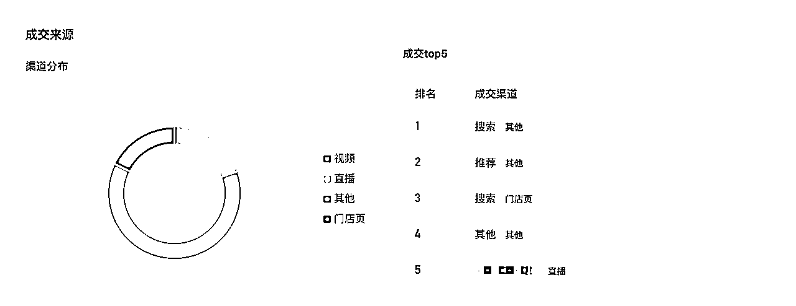
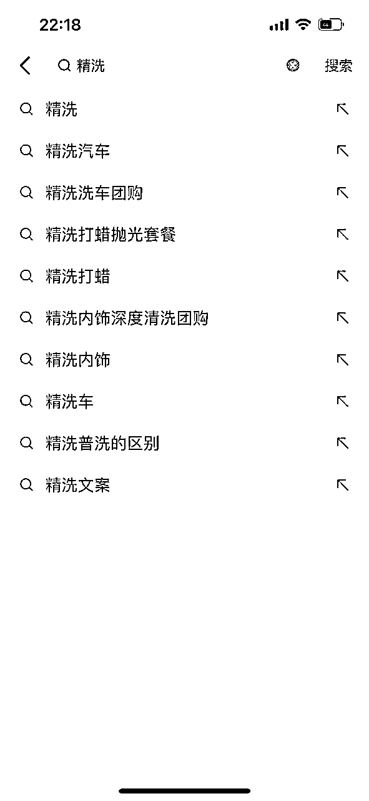

# 单月成交6500万，万字拆解本地生活，2024年该怎么做

> 来源：[https://izhm9eu02g.feishu.cn/docx/AfhXdVeiQoM8HdxxLdQcInqonnb](https://izhm9eu02g.feishu.cn/docx/AfhXdVeiQoM8HdxxLdQcInqonnb)

该内容包含以下3个知识点：

1.  本地生活的商业模式与趋势。

1.  本地生活参与者，都是怎样赚钱的。

1.  内容运营模式。

电脑端观看更佳。

大家好，我是陈罡，同事叫我陈导。2023年入局本地生活，负责的品牌项目有车咖以及其他综合类项目。车咖1月成交GMV超6500万，这个数据超出我们的预期，也看到本地生活巨大潜力。单品68精洗，10个月销量超100万单。同时我们也打造出华南首个综合S2机构-上广传媒。

如果你对本地生活感兴趣，想深度参与的，建议你耐心观看。车咖项目我们运营时间14个月，踩了9个月的坑，这篇文章无论是品牌还是商家，还是服务商都值得看看。能减少大家踩坑，这篇文章就实现它的小目标。

在这里，我不仅仅只是告诉你车咖做了什么，还让你了解本地生活的商业模式、趋势分析、参与赚钱角色以及内容运营模式拆解。

希望大家能把握住新的增长趋势，拿到理想的结果。

以下正文：

本地生活2023年爆发的一年，抖音本地生活成交额从2021年的110亿元，到3100亿。2024年目标更是方便，接近6000亿。无疑本地生活还有更大的成长空间，但经过2023年之后，2024年本地会迎来更大的变化。在此之前，我们先了解本地生活商业运营模式。

「数据来源晚点LatePost：

」

# 一、本地生活商业模式

本地生活内容是获得流量的手段，成交到核销是阶段性目的。短视频内容对整个本地生活改造发生很大变化，我们从「瑞幸」2023年的一组数据就能看到抖音本地生活对实体门店的影响。

*   2023年，瑞幸净新开门店数8034家，门店总数16248家，同比增长97.8%；

*   与茅台联名的酱香拿铁，刷新瑞幸咖啡单品记录，首日销量542万杯，单品销售额突破1亿元。抖音前15小时累计售出100万+杯

*   仅发布一天，抖音上 #酱香拿铁 的相关话题浏览量就近 4 亿人次

数据来源：

抖音本地生活，改变了门店传统的获客方式，进一步通过内容流量能将门店优势进一步放大。

而这里我们也能简单总结出，本地生活3种商业逻辑。

初级模式，帮门店导流然后从成交订单中，拿取一定比例的佣金。

这种模式可以继续细分：

## 初级模式：佣金分成

门店不具备线上引流能力，于是有线上统一的品牌帮相同服务类型的门店做线上化引流。

例如「车咖」「功夫肩颈」属于类似的商业运营模型。

线下服务相同，线上有统一品牌，我们称为云连锁。

关于CPS分成上，关键看门店服务后续升单能力。

有些服务产品毛利高，后续升单能力强，CPS比例能高达60%以上，例如大健康行业、教培行业。前期获客引流，后期升单转化。他们是愿意为高CPS买单。

有些产品毛利低，升单转化能力弱，品牌更看重规模效应。

这里有两个细分模式：

模式1：费用前置或服务费+CPS分成

品牌为门店提供引流服务，门店为引流付费。

甚至是品牌为门店设置引流套餐，双方约定引流客户数量，门店为此给服务费，一般以季度、半年或1年为期做服务约定。一般不会设置月度引流套餐，前期磨合期需要一定时间，时间太短效果难以达到。而把时间拉长，品牌有更多的方式来实现套餐目标。

模式2：保证金+CPS分成

很多门店不给前置费用，只愿意从核销订单中进行分成。

这种模式需要保证3个条件：

条件1：连锁型门店或相同服务的多家门店（云连锁模式）；单个门店不建议；

条件2：有长期线上推广需求或者是保持一定体量的门店（即便有小部分门店退出，依旧不会对整体推广产生影响。）

条件3：收取保证金，减少飞单和客诉的可能。

## 中级模式：门店加盟（门店增量）

通过线上团单爆卖，用可信的数据吸引一部分人群进行加盟。例如大健康的功夫肩颈，车后的小拇指和百援精养都是相同的运营模式。

但这里对于品牌方来说有很大的考验，需要持续不断能够为线下门店导流。如果导流效果差，后续转化以及对存量用户的维持都会产生很大的影响。

但加盟费收入并不是越多越好，与互联网行业边际效应相反，实体线下门店越多，对于门店的运营管理，供应链支撑等会有更多的限制。而且每个门店对于投入和盈利的预期性要求，当门店增长的速度高于客户增长速度，门店盈利时间遥遥无期，就会陷入割韭菜式模式，品牌会受到影响。

另外不可否认，短视频已经改变了传统的加盟模式。和操盘黄焖鸡米饭万店加盟的张昭总交流，他明显感受到短视频带来的深刻影响。传统的加盟通过地推以及百度广告投放等方式获取加盟信息，效率上明显赶不上抖音。在抖音上，品牌通过产品销量、通过打造创始人IP账号，来做加盟。有品牌1年做到5000～6000家都有可能，在传统模式上，这种数据是不可想象的。

如果想深度了解抖音加盟热，可以学习一下「窄播」文章。

## 高级模式：供应链（门店存量）

例如瑞幸、古茗、蜜雪等。连锁型门店都绕不开加盟和供应链两个环节。

高级模式可能包含低级模式，品牌方有很多选择的权利。例如订单我不参与分成，门店加盟只是一次性费用，后续重点是做好供应链。而供应链想要持续有现金流，门店存量非常关键。

2021年，蜜雪冰城仅靠售卖吸管就收入3.06亿元，占公司全年营收的2.96%。如果没有持续经营的门店，供应链无疑也会受到影响。

2024年才是对本地生活品牌的真正考验。经过2023年本地生活大爆发之后，2024年，有供应链有资金实力的品牌会下场。他们高举高打模型，会让那些缺少供应链能力、缺少基本盘的品牌感到难受。

什么是基本盘，和楚川老师交流，他举了一个例子：

2023年天鹅到家业务覆盖28座直营城市。对于天鹅到家来说，这些门店都是自己的，从品牌到员工都是自己可控的，他能形成体系化的战斗能力，所有门店都能按照统一目标前进，无论是交付还是。这属于天鹅到家的基本盘。

但有些家政品牌，门店不是自己的，品牌和门店双方可能只是流量合作关系。品牌对门店可控性不强，所以服务履约能力不可控强。所以流量大并不意味着就有基本盘，一旦有基本盘的选手下场，他们会感到很难受。

2024年，本地生活和2023年有哪些不同。

# 二、2024年本地生活5大趋势

2024年1月，车咖拿到gmv超6500万，取得开门红。深度复盘2023年本地生活后，发现了2024年本地生活的不同点。

## 连锁门店优势愈加明显

门店覆盖越多，可转化的人群也就越多，相比单个门店优先的覆盖，连锁的优势肯定会放大。

从内容来分析，单个门店想要持续做内容投入压力会越来越大；连锁门店的覆盖能有效分摊内容成本。

例如车咖现在合作门店超3万家，1条短视频通过抖音的智能推荐能覆盖3万家门店，基本上覆盖全国主要的城市。

而且连锁商家能形成内容运营体系，持续性输出内容。

相比之下，中小型门店更愿意在美团做深耕。不需要做重度的内容运营投入，重点关注服务以及复购。

另外这里面最关键的是品牌的基本盘，有资金实力且有稳定供应链的品牌，2024年会逐渐冒出，有些品牌会难受。

## 连锁门店通过供应链带来的产品优势愈加明显

连锁门店对于供应链的把控，能通过持续的低价拿到市场，而且还能赚钱。蜜雪、瑞幸就是这样的例子。

瑞幸2023年不完全统计门店增加7000多家，而2022年才不到6000多家。

而连锁门店带来的优势，就是对于供应链能有效的把控，有超强的议价权。瑞幸9.9的持续低价，让单个门店很难

跟进。而这一切瑞幸能通过供应链，对各渠道成本的极致把控实现。

## 区域性连锁崛起

品尝到连锁门店的甜头，也让更多区域性门店看到了希望。无论是换门头的真连锁，还是只带来流量的云连锁，

连锁品牌区域性会越来越明显。一方面能从抖音本地快速发展中分一杯羹，另一方面也是应对其他品牌带来的竞争压力。

区域连锁品牌，不做大而全，只做小而美，也能存活。

## 市场下沉，2024年新的增长点

2023年，一线、新一线以及二线市场本地生活竞争激烈。

2024年，想要拿到新的增量一定要去下沉市场：三、四、五线城市。

这里是新的增长点：谁抢占速度快，谁就能快速拿到结果。

## 矩阵内容分发也成为一种能力

1天如何发布1万条视频，成为一种能力。首先是制作，然后是达人分发。

达人分为自己孵化的机构性可控达人，外部合作达人，以及门店矩阵或者职人账号。

哪些是可控的，哪些是不可控的，如何提升可控性也非常关键。

谁能1天发布1万条视频，谁就能在2024年拿到更大的结果。

# 三、本地生活都有哪些角色参与，如何挣钱

本地生活整个体系可以分为三大板块：

*   供给端：由品牌和商家提供需求供给（服务提供）

*   流量交付：包含服务商、机构和达人（流量&服务费用）

*   需求端：用户（服务付费）

他们到底是怎样赚钱的，要提供哪些服务，我们以「车咖」作为案例深度拆解。

## 供给端：品牌与商家

品牌方「车咖」先上线货盘，例如68的精致洗车。然后会和门店端进行沟通，这个价格谁能提供优质的服务。

确定好服务供给的商家。

供给端要考虑到门店整体覆盖量，区域密度，保证用户需求的覆盖。

其次是服务交付质量，提升转化和复购。

当品牌方确定好商家以及覆盖之后，接下来做流量推广。

这里需要注意，「车咖」体系实际上是对现有门店资源的整合。这些门店已经分布在不同城市，车咖只是通过线上品牌化集中做流量输出方式，为这些门店做线上流量赋能。而正常逻辑上，很多门店如果前期没有覆盖，还需要考虑到招商加盟环节，对门店密度进行覆盖。

结合2024年本地生活的5大趋势，品牌方后续想要做加盟招商，需要有策略能集中某个城市快速做密度覆盖。这样做的好处，能集中流量资源快速做品牌流量爆破。如果区域分散，首先内容交付没有办法集中资源做爆破，每个区域流量溢出很难做到有效承接，其次，分散区域对招商加盟也有很大挑战。

从2023年到2024年，接触到很多本地生活赛道的创业者或投资者。和他们交流都提到一件事儿，短视频已经改变了传统的加盟招商模式。曾经做会销、地推或者是投百度广告的形式，已经让位于内容板块。很多品牌创始人自己下场做内容，通过讲解门店运营知识等方式，将自己打造成专业IP的形似，来做招商加盟。

甚至是很多品牌方，在和达人探店合作时也会做好确定，当有人通过探店短视频想了解招商加盟的时候，达人可以反馈线索，后续根据质量达人还能拿到一定的佣金。

我们「车咖」在做外部内容分发的时候，很多内外部账号每天能收到很多门店合作信息。这些都是精准的门店用户，他们意识到抖音平台的重要性，合作的机率以及后续服务交付质量都可以进行深度把控。

所以品牌方可以通过加盟、供应链以及订单进行分成。

而商家通过服务赚取收入。

## 流量交付：服务商&内容机构&达人

### 2.1 服务商

2023年，可以称为抖音本地生活「元年」，许多项目逐渐开白。

而服务商主要做两件事儿，向上对接抖音官方帮助品牌方上线抖音本地生活，向下对接达人或机构，通过短视频和直播交付流量。

服务商通过收取一大笔前置付费费，阶段性完成效果交付。

2024年，如果没有持续交付能力想割商家韭菜的服务商户，日子也会变得更加艰难。

商家可能会被你割一次，如果你没有真正的流量交付能力，被淘汰是迟早的事情。

### 2.2 MCN机构

类似短视频MCN机构，本地生活能通过签本地生活达人组成MCN。

MCN和服务商目前都互相融合，一个优质的服务商，一般都有自己的MCN机构，服务商需要通过MCN机构向客户交付流量。而MCN机构需要做3件事儿：

第1件事儿：推广执行前，配合服务商输出品牌运营方案，包含货盘确定，门店优化，以及内容推广节奏。

第2件事儿：执行方案确定后，内部达人以及外部达人招募做内容输出。（短视频以及直播同步推进。）

第3件事儿：内容复盘优化。

从2023年10月份以内，服务商和MCN机构加快了融合。一个优秀的服务商有自己的MCN机构，一个优秀的MCN机构有自己的商务团队去找客户。甚至是很多品牌方也自己下场既是服务商也是MCN机构。

「车咖」就属于后者。

「车咖」从2022年8月开始尝试，到2023年2月正式开始大规模铺店，再到后面拿到车后云连锁top1的成绩。

在这过程，对于团队来说是一个锻炼。我们既有门店管理能力，也有内容交付能力，通过「车咖」这个货盘，我们内容团队持续跟进运营，提升卖货能力，内部我们自己孵化一批高等级的实探、云探以及云剪矩阵账号，同时向外输出内容模式。外部云探或云剪达人能够有内容剪辑参考，持续输出内容。

所以从去年10月，我们自己的MCN机构「上广传媒」拿到华南综合首个综合S2的排名，以及2023年度全国综合前5的排名。12月，我们自己的服务商「上广数字传媒」拿到综合服务商前10的排名。

以「车咖」这个货盘为基础，提升我们团队内容策略、经营交付能力，例如「上广传媒」从10月开始待运营「车咖加油」项目，11月GMV超4500万，多个省份成交持续排第1。

### 2.3 达人

「个人达人」与「机构型达人」

#### 2.3.1 个体达人

个人达人可以继续细分为实探型达人、云探型达人（不去实际门店体验，只是真人出镜开头）、云剪达人（只是剪辑服务流程或者展示产品卖点）。

而对抖音平台通过每个月gmv成交，对达人划分为8个等级：

级别越高证明达人能力越强，同时可以让商家提供更高的车马费，以及更高的定向佣金。

对于云探以及云剪达人，抖音平台对于内容识别能力非常强。

对于云剪达人也会进行限流，这是我们实际遇到的情况。

#### 2.3.2 「机构型达人」

「机构型」达人通常由商务能力很强的「个体达人」发展而来，他们招募类似宝妈群体，通过内容剪辑培训，组成类似一个机构。目前我们接触到这种机构型达人很多，最多一个机构有2000多的宝妈组成。

成为机构型达人对内培训学员收费，对外和品牌或者其他服务商合作，能够拿到任务分成。

# 四、如何做搜索流量运营

这里我们重点拆解本地生活搜索流量。

搜索流量不可忽视。搜索能带来30%的GMV，70%的GTV。

不难理解，搜索因为用户已经有需求了，所以才会产生搜索行为。核销率也会进一步提高。

如何玩转抖音搜索，成为商家的必备功能。

首先我们要理解抖音本地生活的搜索逻辑。

从用户需求产生到需求匹配，这是用户最精准的需求，对于门店来说，想要匹配用户的需求，就需要向平台证明你的价值：平台为什么要把用户的需求提供给到你，而不是你周围的商家A和商家B。

平台想要用户留存，希望有更多交易发生在平台，所以你需要向平台证明你的价值。

我们首先看看抖音的搜索都有哪些入口。

抖音搜索窗口不完全展现

值得注意的是，现在抖音已经将团购放在一级页面，不能看出本地生活在抖音中的重要性。

同时一级页面，用户还能自定义展现位置，让抖音一级菜单能容纳更多需求提供位置。

抖音既想做好内容分发，也不想放过变现，一级页面中成为二者的融合体。

对于我们来说，知道这些搜索入口之后，让搜索为我们带来更多成交，成为关键。

接下来，我们深度解析本地生活的搜索运营3大策略。

站在用户的角度做需求匹配：用户会通过什么样的方式能够搜索到你的产品套餐。

搜品牌或门店。

例如用户想吃栗子，她可能通过短视频或直播了解到「粒上皇」的品牌，她的搜索词可能就是品牌词「栗上粒」。通过品牌词搜索，找到她想要的需求。

搜服务。

当行业中没有明确的品牌代指某个服务时，用户会直接根据自己的需求进行搜索。例如车脏了想给车来一个精洗，用户的搜索词，可能就是「精洗」或相关搜索词。

搜位置。

用户可能搜索词汇更加精准，例如用户有「精洗」需求，可能他会添加更多限定词，例如「附近精洗团购」。

你会发现，用户搜索词可能多种多样，但归根结底大致分为两类搜索：品牌/门店搜索以及服务搜索。

所以策略上，应当这样做：

能搜到品牌或门店信息；

能通过关键词搜索到你的服务。

### POI运营-3个动作让用户能精准搜索

什么是POI。

POI称为「兴趣点」，你可以看成是“Point of Interest”的缩写。

也可以理解为门店的线上地点。

具体信息如下👇👇👇

一个优质的POI一定是包含以下信息：

*   信息1： 门店基础信息，让用户能精准搜索到门店。

搜店名：门店名称要准确。

搜地址：地址信息不要错误，用户能够直接通过导航到门店。

电话：电话要正确，用户有可能会咨询门店或套餐信息。

营业时间要提供：用户知道门店什么时间营业，减少用户错误上门时间。

门店环境要提供：建议有6张以上的门店高质量图片。包含门头信息的图片1张，内部环境5~6张。

*   信息2：套餐设计

4个及以上套餐设计：

要注意两个以上的套餐就会产生折叠，所以套餐要设计好引流品，从价格吸引到用户，利润品等可以放置在第3个后面，通过长尾方式提升成交。

建议品牌+服务，字数控制在15字以内。

套餐名称优化：

通过搜索指数优化套餐名称，热搜词尽量全部覆盖，有利于提升产品搜索排名。

*   信息3：评论引导，提升推荐指数

千万不要忽视这个环节。用户下单购买之后，尽可能引导用户好评。有助于提升POI搜索权重，同时其他用户看到真实的评价之后，也会主动购买。

商家端做好基础信息建设之后，已经有了能够搜索到的基础框架。接下来我们需要主动通过内容去做关键词覆盖，提升搜索权重。

先看案例。

#洗车 121.5亿

#附近哪里洗车好 32.1亿

#精致洗车：27.8亿

#精洗：23.8亿

洗美关键词领域，车咖基本上全部都做覆盖了，核销上搜索占比超70%。所以内容输出上，如何和搜索挂钩非常关键。让用户记住你的前提，是你有持续不断的内容产出，让用户能搜到你。

车咖项目上，每个月视频发布量近10万条。所以我们能保持热门话题以及热搜词的全覆盖。

如何做关键词提升搜索指数，以下4个方法要掌握。

*   方法1： 内容文案设置。

埋关键词。视频前3秒关键词前置，以及文案中关键词展现比例提升。关键词并不是越多越好，还是需要关注内容讲解完整性。

*   方案2：视频封面

视频封面:吸引注意力+直入主题，让用户快速知道核心信息。

例如：突出价格：车咖精洗 只要68；突出服务：360度全方位无司机清洗。停留时长:1-2 秒

*   方法3：视频发布文案

突出两个关键词，服务以及价格信息，增加服务曝光。

*   方法4：话题标签

视频标题增加”品牌/门店词”作为话题会显著提升搜索 #车咖

增加品牌+服务关键词 例如#车咖+精洗；车咖+洗车；车咖+纯手工洗车，做关键词组。

除此以外，还可以关联行业相关热门话题。

其他方式例如合集和评论区关键词引导也能够提升效果。

具体展现

### 4种方法，找到用户会搜索的关键词

#### 方法1：搜索引擎

*   通过巨量引擎搜索关键词

巨量算数-解析内容风向，解码营销未来 （链接直达）

靠近中心用户搜索越多，关联性越强。

排名越靠前，用户搜索频率也就会越高。内容设置可以借此作为参考。

#### 方法2：端内搜索

*   APP搜索下拉展现

排名越靠前，用户搜索频率也就会越高。内容设置可以借此作为参考。

#### 方法3 ：综合搜索等

*   综合页面中的相关搜索

*   话题分布

*   AI搜中的：你可能还想了解

##### Tips：如何区分搜索关联词和内容关联词

搜索关联词是指用户搜索行为，产生关联性；内容关联词指的是已经发布内容关联词覆盖。

二者可能存在重叠，我们可以重点筛选二者不重叠部分，内容做长尾流量词。

例如“摩托车精洗”。有搜索关联，内容关联没有看到。说明用户有需求，如果门店能满足需求的情况下，可以单独建立一个sku，通过内容覆盖这类有需求的长尾词。

#### 方法4：生意经搜索词 【重要】

*   搜索词榜单

该渠道数据很精准，有来客端的商家很清晰看到用户搜索哪些关键词，成交转化指数数据。

*   搜索流量概览

能清晰了解到是「看后搜」还是「自然搜」以及搜索词点击情况。数据统计结果分析，「看后搜」会高于「自然搜」的成交效率。

抖音生活服务生意经「直达」

知道如何做搜索关键词之后，接下来最重要的是做关键词覆盖，提升搜索指数。

这里你要做两件事：

发布多少内容能覆盖主要的关键词，考虑竞品也会抢关键词，所以内容端要持续做输出。

如何让更多的人发布内容。

我们做车咖，每个月近10万条内容发布，每天要有5000多个达人发布视频。

在没有更多费用支撑的情况下，怎么做。

对团队考验是全方位的。

从达人视频到职人视频，谁能抢占稳定资源非常关键。

具体可以看看楚川老师的分享。

*   如何提升关键词覆盖

POI基建搭建完成之后，通过短视频发布能有效提升关键词曝光。建议内容配置比例如下

| 行业 | 指标 | 连锁 |  | 非连锁 |  |
|  |  | 头部 | 腰尾部 | 头部 | 腰尾部 |
| 车后 | 视频投稿 | 100 | 15000 | 30 | 10 |
|  | 达人投稿 | 80 | 500 | 10 | 3 |

需要关注的是门店覆盖越广触达用户越多，流量效率也就越高。门店作为流量分发点，每增加1个POI点，覆盖的人群范围也就会越广。连锁门店内容发布要测试筛选优质POI。每个POI基于商圈位置，流量效果不同，优质的POI是流量放大器。

# 五、爆款，我们如何把控

抖音属于爆款体系玩法，1条爆款能够抵过几百条效果一般的内容。追求爆款是每个做短视频人的目标，但我们却无法把控单条视频会成为爆款。但我们需要有打造爆款视频的概率，可能发布100条视频，有1条能成为爆款。

车咖为车后洗美板块树立了内容标杆，我们为此也投入大量的精力去找合适的内容模板。快速测试、模型放大。中间走过很多坑，但也从中拿到结果。但我们非常坚定投入，即便遇到问题，团队能快速解决。

品质洗车：

都说10次普洗不如一次内外精洗。不管是多少年的车还是长时间疏于清洁的家用车，除了伤痕，这里都会给你清洗的跟新车一样。

就团视频左下角链接的清洗套餐只要68，其中包含了全车泡沫冲洗、擦干座椅、龙卷风、车洗车身边缝细节处理。

他们家的精洗可不是简单的擦擦灰，像仪表台、脚垫都会照顾到，平时没办法清洗的地方都会用专业的工具洗刷擦拭，跟新车一样不会伤及到任何地方，轮胎轮毂也会给你清洁的干干净净。

最后在发动机舱吸尘、尾箱清洁等等，赶紧点击下方链接，囤起来晚了毛都没了！

https://v.douyin.com/iLQF4PU4/

爱车洗护：

就我背后这家店，138就能完成一次洗车打蜡、加前挡、去油膜。走，我们一起去看看，不管是多少年的车还是长时间疏于清洁的家用车，甚至连伤痕都会给你处理的跟新车一样。

就团视频左下角的链接，138元套餐，其中包含全车泡沫冲洗、擦干座椅龙卷风吹洗车身边缝细节处理。

他们家的精洗可不是简单的擦擦灰，像仪表台、脚垫都能照顾到，平时没办法清洗的地方都用了专业的工具洗刷擦拭得跟新车一样不会伤及到任何地方。

轮胎轮毂也能给你清洗的干干净净，最后在前挡去油膜和全车漆面划痕打蜡处理。这波需要的车友们别再犹豫了，视频左下角赶紧安排。

https://v.douyin.com/iLQFnm5m/

本地生活依旧大有可为，但对团队能力考验是全方位的。

2024年加油。