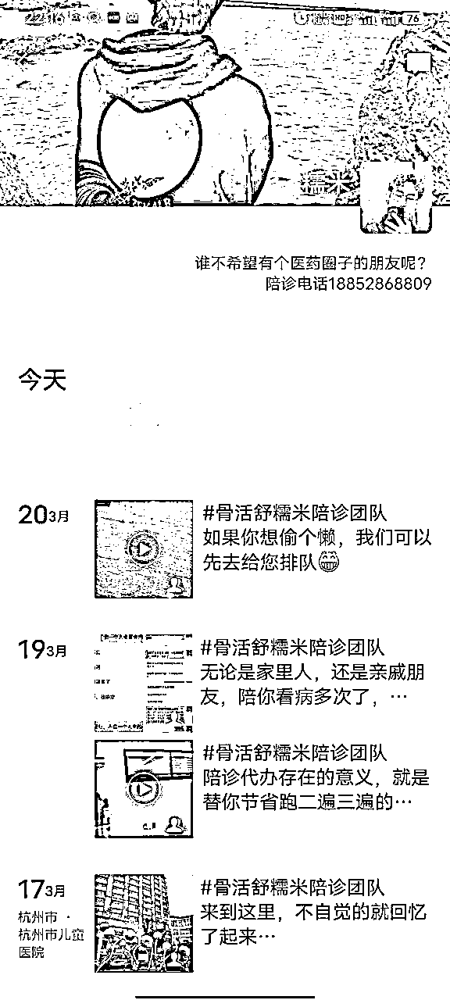
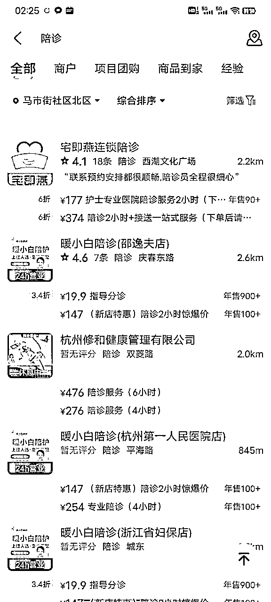
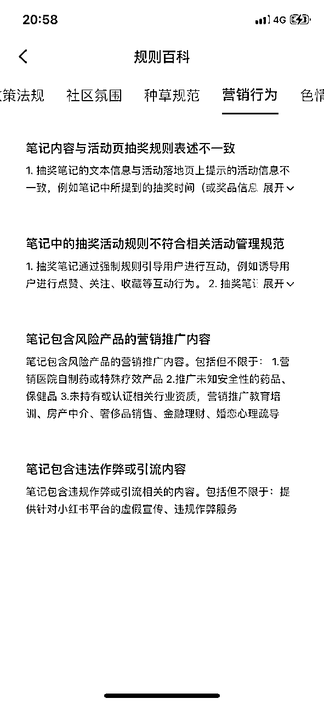
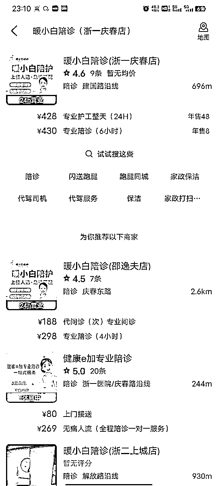
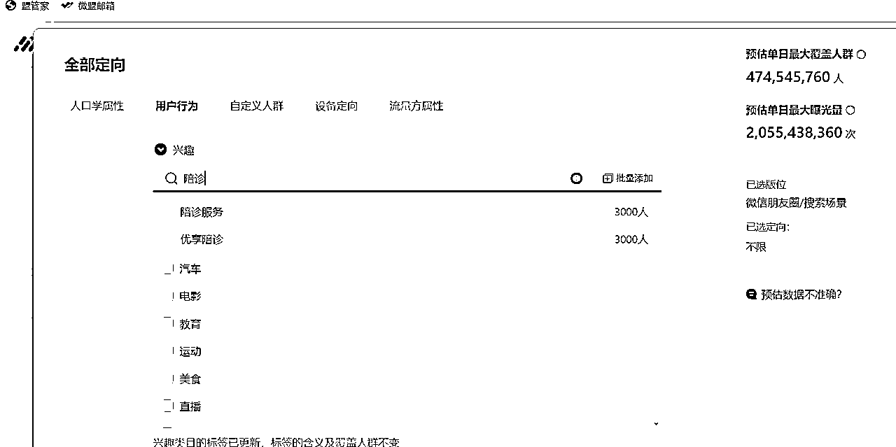

# 在职悄悄开了陪诊公司，半年营收10w，糯米是怎么借助生财平台，打开第二事业副本的

> 来源：[https://f8f5eqx2mx.feishu.cn/docx/AubodhBdioLH3tx2LRecK98anbb](https://f8f5eqx2mx.feishu.cn/docx/AubodhBdioLH3tx2LRecK98anbb)

大家好，我是糯米，一个打着医药代表这份工的陪诊公司创始人。

相信在生财是有相当一部分的小伙伴都是在职状态，加入生财也是想寻求财富机会，实现经济自由的，毕竟给别人打工，大概率是受气还赚不到钱嘛

在职人的通病：渴望改变，无力改变！

这次，糯米把自己的奋战经历给大家扒开了、揉碎了分享出来，希望能给大家带来参考和借鉴的价值

本文关键词“陪诊”，“在职”，“第二事业”

因此，特别推荐以下几类人群阅读：

1.医药领域的，特别是医药代表人群重点阅读

2.对陪诊赛道感兴趣的朋友

3.想在职搞事的朋友

本次分享，

大概率可以帮助一些没有利用好生财的朋友，更好的利用生财这个平台；

大概率可以帮助大家了解近年来比较热的陪诊行业；

大概率可以帮助在职想搞事的小伙伴，在开启第二事业副本的道路上做一个参考和借鉴。

如果额外还能给你带来行动的力量就更好了！

# 废话不多说，先甩个目录！

# 一、陪诊行业科普

#### 1.什么是陪诊

#### 2.陪诊行业有存在的意义么

#### 3.陪诊的商业模式

# 二、第二事业我是这么开启的

#### 1.咬定杭州，进入生财，先求立足

#### 2.在职人员挖掘到陪诊以及陪诊初体验

#### 3.从个体户陪诊到初步建立了自己的订单分发团队

#### 4.流量卡点出现，顺带捡了个小合伙人

#### 5.公司化，云模式运营陪诊项目

#### 6.最近

# 三、分享一些实战心得和经验技巧

#### 【心得篇】

#### 【实操篇】

# 四、陪诊行业现状以及前景

#### 1.行业知名度不高，消费习惯养成任重而道远

#### 2.陪诊符合国家的需要，属于未来的趋势

#### 3.陪诊的边界，合规问题

#### 4.各平台对陪诊的态度

#### 5.陪诊领域尚无大头部

#### 6.陪诊行业盘子到底有多大

# 五、总结致谢

#### 1.如何利用生财

#### 2.致谢

# 一、陪诊行业科普

## 1.什么是陪诊

陪诊从字面意思上看，就是陪患者去就诊，只存在一个陪同/陪伴的职能，没有更多了

因此我们陪诊师通常也称自己为：“患者的临时家人”

但实际上，陪诊师要做的事儿也并不这么简单干脆

通常可以分为跑腿类服务，代办类服务，代问诊服务，陪同服务，绿通资源类服务

跑腿类型的比较简单，帮挂挂号，取取报告，打印一下片子之类的，陪诊师只需要面对机器，不需要跟医护人员做沟通，是一种几乎没啥门槛的服务，只要你熟悉医院的流程，机器

代办类型稍微复杂，比如代开药，代约检查等等，这要求陪诊师一只手要抓牢患者的情况信息以及诉求的合理性，一只手要抓牢跟医护人员的沟通解释，这对专业性和沟通能力都是有要求的

代问诊就更复杂了，相当于代办类型的升级版，患者不直接面对面跟医生问诊，因此陪诊师需要替患者做好信息整理，诉求整理，同时要对各种疾病有基本的知识储备，懂得跟医生沟通的模式和语言，知道具体某种疾病，医生常规会问什么问题等等，力求在代问诊过程中增加沟通效率，减少信息传递错漏

陪同服务是陪诊师线下真人陪同真人去就诊的服务，要求陪诊师要有一定的服务性，专业性（熟悉医院的规章制度，地理位置），主要就是一个情绪价值和解决患者诉求的能力，提高就医舒适度

绿通资源类的服务即是通过自己的医疗资源，帮患者更快更好的解决医疗问题，比如手术床位专家号之类的

## 2.陪诊行业有存在的意义么

这其实是一个不太聪明的问题，因为存在即合理，有需求则有服务

糯米简单举例几个需求场景

1.对于异地就医的人群，代办服务可以提前做好准备工作，帮他们减少异地就医的耗损和滞留时间

2.对没空陪家人去看病的人群，陪诊可以起到替代家人陪同照料的作用

3.对于行动不便的人，陪诊能起到护工的作用

4.对于社恐和对医院陌生的人，陪诊能帮他们高效就医

5.对于慢病人群，需要反复购药复诊的，陪诊师可以帮他们减少就医的时间精力损耗，完成远程就医

当然，陪诊不止这些好处，其背后的逻辑其实是补充现在医院的服务缺口，帮助低能或者失能人群就医

这还只是站在患者和患者家属的角度的一些好处，在医生端来看，其实也有好处

1.减少了医患矛盾，因为陪诊师不会带着生病的情绪来沟通

2.提高了沟通效率，陪诊师已经将核心信息做过提炼整理，并转化为医生能快速获取的信息格式

虽然很多医院，甚至政务平台都有陪诊服务推出，但实际上，公家根本不重视这个板块的落地和优化，这才让我们有机可乘

没办法，这是我们国家医院的特色，有没有陪诊，该看病的还是要看病的，并不影响医院的营收，反而是医院真的自运营起来，医院的人力是一定跟不上这个服务所需的交付精度的，就算勉强做到了，所能带来的收益医院根本看不上，如果医院非要做这个领域的市场，大概率也是外包合作制，这也是我们的机会，越早成为行业top，越能跟大医院合作

## 3.陪诊的商业模式

凡是生意，都逃不开这三个关键词：产品，流量，转化

### a.产品

陪诊这个行业呢，算是个服务行业，产品就是你的服务，可以是你自己做，也可以是你来安排别人做，糯米早期就是自己做服务，慢慢的演变到安排别人来做服务

那替你去做服务的人从哪来呢？糯米没找过素人小白来做交付，都是从我们医药领域的医药代表人群中找的人，这里存在一定的护城河门槛，因为糯米属于这个圈子，能很快搞定大量的综合素质强的陪诊师/准陪诊师，他们稍加培训就能上岗

那整个服务过程的流程设计还有服务理念，都是基于我亲自做一线时总结出来的

比如提前15-30分钟报备自己到哪了，结束的时候把今天的陪诊记录汇总，医生的叮嘱汇总，打包发给客户，还要注意排版清洁好看

具体的陪诊产品上面已经讲过了，大致分为跑腿，代办，代问诊，陪同，绿通这几种，实操下来，还能从另一个维度设计为标品和非标品，以及细分领域的产品

标品可按照自己的固定服务流程走，非标可以出定制化的高价产品，根据客人的需求灵活服务，甚至可以跟高净值客户反复挖掘需求，制定更多高价产品，比如糯米的5.8w年度健康管理会员

### b.流量

产品，流量，转化，在陪诊这个领域最关键的还是流量，我们不否认产品和转化重要，但流量是一切的前提，我们甚至可以这么说，哪怕你的陪诊服务再垃圾，只要流量爆掉，你依然会有跑不完的订单

而流量是目前陪诊行业内的老大难问题，我汇总一下目前流量上面临的问题：

1.行业知名度不够高，很多人甚至不知道有这个行业存在，不知道有这个服务可以消费

2.线下获客，低成本推广很难解决信任问题，高端推广又不是小玩家能玩的

3.线上获客受到平台管控

根据糯米的实战经验得出结论，最佳的方式还是自媒体获客，目前我们首选小红书，但陪诊涉及医疗，是平台的敏感领域，很难做起来

目前行业内的陪诊师，陪诊团队如何获客呢？糯米稍微列举一下

1.自媒体矩阵，比如抖音，小红书，尽可能规避平台的红线，以量取胜，跟平台躲猫猫

2.跟机构谈合作，比如保险机构，养老机构，残联等等

3.广告投放，比如地铁广告，微信朋友圈广告投放

4.客人的转介绍

5.不限制的陪诊的平台，比如美团

### c.转化

客源来到私域之后，通过你的朋友圈，通过你设计好的话术，模板，去迅速获取客户的情况诉求，再推荐相应的产品去成交，然后做交付

基本上这个行业的成交率还是比较高的，糯米最好的时候能做到50%-70%的成交率，基本上是来一单成交一单，因为看病是刚需，急需，真的没办法的时候，你作为陪诊师，能给客户解决看病就医的问题，客户花钱是不眨眼的！

此处告诫大家，做这行不要吃人血馒头，坑病人的钱，在能满足对方诉求的情况下去收钱，不然这个事儿做不长，也不道德！

# 二、第二事业我是这么开始的

糯米是2019年药学本科毕业的，南京干了两年半医药代表，裸辞搞事一年半，期间因为朋友送的一本生财日历了解到生财，2023年揣着仅剩的1w来了杭州，下半年挖掘到陪诊，在职的同时干到今天的程度

现在回头看过往的经历，我感觉一切都像是命中注定，如果没有裸辞折腾过，没有刚好发现了生财有术，没有在发掘到陪诊时身边同步出现的一系列助推因素，可能我就错过这一波了

## 1.咬定杭州，进入生财，先求立足

2023年的3月底，这是糯米当时给自己的最后期限，如果没在当时的项目看到转机就去上班

（ps.当时我还是一个全职的游戏博主/主播）

天遂人愿，糯米后来去杭州上班了

为什么来杭州呢？

杭州是出现在糯米的信息流中非常多次的一个城市，经过一些粗浅的分析之后，我觉得这个城市符合：政策利好、氛围积极、方便链接人脉这几个标准，而且生财就在杭州！

（当时有句名言：要么base在上海，要么base在杭州）

所以糯米毅然决然，揣着剩下的1w存款来了杭州，花了半个月找好了工作，干回了医药代表，当时差不多也到418了，前脚后脚我就进了生财

我还记得那两天，按照生财的新手指引，糯米许下了一年后的愿望，现在看来，基本上也实现了，感恩生财有术~

说回来，当时刚刚回到职场，我自然是十二分努力的去做业务的

一方面抓紧立足，站稳脚跟了才能持续获取生存所需的经济来源

另一方面，只有业务稳定了，我才能有空闲去搭建自己的生财城堡

那段日子，几乎就是每天工作12小时，全方位扑在主业上，想在杭州抓紧站稳，然后开启自己的搞钱项目，所以平时虽然繁忙，但也不忘关注生财的帖子，以及抽空认识些生财的朋友

## 2.在职人员挖掘到陪诊以及陪诊初体验

大概从4月入职，吭哧吭哧努力了4个月左右，8月的时候，糯米自觉也差不多主业稳定了

就8月初吧，我在生财检索“医药代表”这个关键词，想看一下有没有医药代表创业搞事的案例，偶然就刷到了陪诊的相关信息

也就前后两天，我们医药圈子里也有人在聊这个事儿了，身边仿佛陪诊的信息一下子全部钻出来了

我觉得是缘分到了，晚上加班加点把生财里所有陪诊的内容查阅了一遍，对这个事儿有了更进一步的认识之后，我就跟好哥们胜前聊了一下这个事儿，得到他的支持之后，第二天就开干了

当天随手发了第一条小红书笔记，《医药代表做陪诊是不是好的副业》，直接小爆了一波

由于这个小反馈，这个事儿我更上心了。

8月，9月我一边工作一边做内容获客，可惜这两个月一直没人来向糯米下单，来的都是咨询我怎么做陪诊的，没有一个下单要陪诊服务的

现在回头看，之所以当时没人过来找我下单，是因为我的内容更多是面对b端的，比如医药领域的一些思考和想法

我大概花了两周才意识到不对劲（在职人员能分配的精力有限，一个不注意已经一周过去了），对比了一些同行的内容之后，我调整了自己的内容方向，去做面对c端的内容，事情才开始出现转机

10月开始慢慢有人找我陪诊了

我还记得第一单是一个小哥哥，要做胃肠镜，毕竟第一单有点怂，我壮着胆子接了，随便开了个价，约好时间后，当天就按着时间去了，虽然那边医院我也不熟悉，不过我知道，最坏的结果不就是退钱嘛，白跑一趟也是赚！

结果其实挺好的，小哥哥挺满意的，就这样，我顺利开了第一单，实现了赚到第一块钱，也发了一个真实的陪诊vlog视频

在此之前我发的内容，都是我假装出来在陪诊的内容，真实情况是，其实我并没有在陪诊，可能就是旁边有个人，我跟他站得近一点拍张照，然后假装一下，好，这就是我的客户了，我在陪诊，就这样子

这个图是不是看起来很像我在陪我的陪诊客户？其实我就是去坐了一分钟，悄悄拍了张照就走了

你只有先假装你有订单，你在服务，你才能接到真的订单，你才能真的开始服务

借由假装有单子，我告诉了我的准客户，我可以陪诊，我在陪诊，而且陪诊得不错！

## 3.从个体户陪诊到初步建立了自己的订单分发团队

随着我的方向对了，11月迎来了一波订单的小爆发，我才感觉到，一会一个订单要聊，一会一个订单要接，真的忙都忙不过来，而且订单的日期有撞车的

我开始思考，是不是该准备建立自己的陪诊team，把订单分发出去，让别人赚一部分钱，然后自己赚一部分钱了

在这个阶段，我所属的行业给我带来了极大的优势，我很容易找到专业性足够的，服务性足够的人去帮我做交付，那就是医药代表同行

不得不说，陪诊对于医药代表是非常适合的副业

为啥呢？

一方面医药代表的工作时间非常灵活弹性，业务稳定了之后时间蛮多的，这给做陪诊提供了可行性

另一方面，医药代表的专业性就很好，对疾病、药物、医院都熟悉，绿通资源也非常靠谱

关键是，医药代表的工作就是天天在医院混！！！

所以我就开始在我们同行的群聊里去分发订单，顺便圈了一波人过来成为我的固定陪诊师团队，我慢慢就跟大家建立了接单陪诊的规则，不断优化陪诊的交付流程，产品类型，分佣机制，激励机制

当时自己一个人，兼顾了前端自媒体运营，引流获客，产品设计，私域维护成交，陪诊师培训，制定规则等等一系列的活，着实心力交瘁了一波

最开始弄的规章制度，服务流程都很粗糙，整个项目就像一张破渔网，上面的洞都很大，捞起鱼来很费力，每捞完一次就觉得，不行，这里要修补一下，不行，那里要修补一下，但就这么三补两补的，体系慢慢就出来了，一条条成熟的业务链就完整多了

现在糯米还在不断筛选优秀的陪诊师，整个杭州糯米有10个成熟陪诊师，60个初级陪诊师，1000个潜在可用陪诊师

现在陪诊订单的进入，分发，接单的流程，服务的监管都已经很熟练了，正在做进一步放大

## 4.流量卡点出现，顺带捡了个小合伙人

时间来到2023年12月，团队雏形虽然有了，但我的账号被平台监控到了，直接一个私信永久封禁，我的接单率直接降低一个数量级

持续了一阵子之后，我开始厌倦了这种跟平台对抗，没法持续积累的事儿（亦仁大大早就预言了，结果确实如此），我不想自己做内容了，一做一个违规真的很打击人，我开始找同行合作，让他们把订单分流给我，前后配合cps

因此，那两天我定了kpi，每天私信10个20个的同行，把小红书的打招呼用完，最后确实合作了几个，让他们分流给我玩cps，但合作了一阵子，剩下来的就一个，也就是我现在的小合伙人

她还蛮有天赋的，当时是她刚开始尝试副业，随手发的陪诊笔记爆了，我刚巧又找上她合作，一切就水到渠成，到今天她都没做过后端陪诊交付，也乐得和我分工明确，前后配合

因为我是确实想把事儿做起来，就跟她约了线下见面，确实线上聊千遍不如线下见一面，本来线上她还挺犹豫的，没想过要把这个事儿做得怎么样，但线下跟我见了之后，感觉就不一样了，那就一起好好干！一起努力做家杭州的大陪诊公司！甚至覆盖其他城市！

但毕竟小合伙人的前端能力还不成熟嘛，我还是要继续寻找破局的方法，当时也做了很多动作，比如通过生财组局分享自己的项目，参与别人的聚会，一对一请教前辈等等方式

甚至还有幸被Emily姐举荐，跟亦仁大大见了一面，请教了项目上的问题，再次感恩这一路上帮助糯米的小伙伴！

## 5.公司化，云模式运营陪诊项目

经过了那段时间的交流碰撞，我做了几个事儿，一个是注册公司和商标，一个是开通了美团的店铺，一个是不断寻找成熟的前端合伙人

当时就觉得，如果目前核心问题解决不了，那起码不要闲着，做自己能做的

前端没法解决的时候，大家都卡着，那我就做好产品吊打同行，如果前端的路子摸通了，我就抓紧放大流量，进一步吊打同行，我是这么想的

所以期间有空的时候，我注册了公司，商标，注册了美团的店铺，这些都成为了我的背书，给我增加自信心的同时，也给我提供了做高客单的底气

我们不再是很low的微信转账了，现在我们有美团给我们做背书，我可以堂堂正正告诉客户不用担心，美团上消费嘛，你的售后是有保障的，如果满意回头给个好评

现在我们已经做到5.0分店铺了，万一未来美团上的陪诊消费习惯越来越好，用户教育出来了，那我们店铺就能直接起飞，这也是我曾经在生财里发过的一篇帖子提过的，具体逻辑，链接中有说明

https://articles.zsxq.com/id_j85h4sd86pd8.html

说到这个美团开陪诊店铺，其实这和刘杰哥的云家政很像，咱不需要真实的家政门店，只需要做好线上装修，搞定获客渠道，订单来了就扔进家政阿姨群里即可

那我们陪诊其实大同小异，把陪诊师群搞起来，不断扔订单进群，不断把愿意好好做的陪诊师洗出来就够了

糯米也算了个账，基本上杭州地区能有20个随时待命的成熟陪诊师即可，如果开工资提成，单个陪诊师每个月能赚个1.1w-1.4w左右，这个薪酬待遇是足够了的

运维这么一个项目，一个操盘手（3.5w/月开支），一个流量负责人（3.3w/月开支），一个私域销售运维（3.1w/月开支），陪诊师若干（22w/月开支）即可，门店场地水电平台服务费杂费等2w/月开支，做到月流水50w（1000单），每个月的成本是35w，年利润180w

这就是以公司化的方式，去运营陪诊这个项目所设计的目标，或者说蓝图，对于一个在职打工人来说，真的很期盼这一天！

要达成这个目标，首要解决的就是订单量，我的思路就是做小红书矩阵，抓紧抢市场，之所以没有盲目去做小红书矩阵，也是因为当时我们没有找到比较有效规避小红书封禁的玩法，我又精力有限，在职的同时要维持项目，首要就是做好订单分发和监管，那我的精力其实是在后端的，但合伙人的前端能力还不够嘛毕竟，当时就僵持了一阵子

那段时间，我主要做了后端的优化，通过做好升单，完善高客单产品体系，也实现了一些增长

这个决策也是我当时链接到刺猬哥的时候，他给我分析的，当时他问了我个问题

“你最值钱的环节在哪？”

最后我得出结论，其实我的核心竞争力在后端，如果我扑在前端去别人比拼，那就是舍长就短，谁都可以做小红书获客做陪诊，但不是谁都像我一样，有医生的资源，同行的资源，起码没有我获取起来轻松容易，跨行业之间存在信任的门槛，如果要强行获取，代价一定不小

反之，如果我一心扑在前端解决流量，不确定性就太强，目前诸多同行都卡在前端，那我进场钻研就一定能解决这个问题么？大概率不能

舍长就短的结果大概就是，我选择了和同行站在一样的起跑线上，每天就干一件事儿，那就是不断的跟平台躲猫猫，可能哪天一个睁眼，就又是打回从0-1，不会有太多有价值的积累，而且越做越打击人

所以我那次跟刺猬哥聊完，战略就调整了，把操心的事儿（前端）交给别人做，交给专业的人做，只要利润空间足够覆盖这部分支出就行呀！

当时还写了一篇公众号文章，专门一键发给加过来的小红书矩阵玩家，一次性解释清楚我的来意和合作的想法！

这里再次感谢我刺猬哥！

所以那阵子，我跟小合伙人商量了，一方面她继续获客做账号，一方面我提供资金，她去找小粉丝素人账号玩koc软文广告获客，与此同时我继续找匹配的成熟前端合作

这里提一嘴，这种事儿在生财真的太好解决了！生财有大量的玩小红书矩阵的圈友呀！我后来就是利用好了生财这个平台（间接）找到了现在的准前端合作小伙伴！

## 6.最近

年后回来杭州，我优化了一波后端之后，就重点开始敲定前端合作的问题了，都是忙里偷闲，保证主业工作不出纰漏的情况下继续搞事的，但不得不说，我兼顾得蛮好，第一季度的主业业绩也飞起，陪诊的事儿也越做越好了！

大概就是2月底，我通过芷蓝姐链接到了文静姐，通过文静姐链接到了现在的前端代运营小伙伴，当时我们聊了一下代运营的交付，确认好预期之后我就先下了一单一个月的代运营，主要是寻求前端突破，但我还是期望能在服务过程中多展示自己的价值和行业项目的价值，看看有没有机会深度合作

我不喜欢一上来就说得天花乱坠，我们以后怎么怎么样一起玩，先相处一阵子再说，许是人家也看到了我的行动力，也逐渐产生了对这个项目的想法，所以前两天我们聊了一下之后的合作模式，前路可期！

现在我们的前端0-1已经跑通，4月就是做复制和放大了，目前我们的业务体系分两条，一条是服务c端陪诊客户，一条是服务网上想学习陪诊的素人，做培训教学，毕竟我们现在结果已经很不错了

# 三、分享一些实战心得和经验技巧

## 【心得篇】

### a.在职搞事，一定要有牺牲休息时间的觉悟，特别是周末，而且要习惯和烂摊子相处

俗话说鱼和熊掌不可兼得，如果必须兼得，必定要付出代价

咱又在职上班，又业余搞项目，无非就是想万一项目不成，还能继续上班，两不耽误嘛，但凡有求者，必有其代价

如果你真的想把项目做好，你的业余时间是一定要大量牺牲的！一个项目成与不成，与你投入的决心和时间精力息息相关

我们算个账，你一天工作8小时，睡觉8小时，还剩8小时，你不要吃饭上厕所么？不要处理些家政内务么？还能剩下几个小时？你还想再放松一下，玩一玩，那项目不要做了咯

所以周末的时间至关重要！每次周末一定要大幅度推动副业才行，别以打工人的思维，想着周末了该出去玩玩了，你应该想的是，终于周末了，我可以大展拳脚干自己的事业了！

对于职场人来说，上班本身就已经消耗掉相当一部分时间精力了，下班之后再搞副业，没有决心是真的很困难的，如果投入的时间精力不够，你根本无法做大，可能只会停留在赚点零花钱的程度

拿糯米举例，我本职工作是医药代表，负责医院的产品推广，虽然时间弹性灵活，但前期也是拼命搞好业务了之后才开始打副业的主意的，副业也上道了那段时间，真的是忙到脚打后脑勺

那段日子我因为一个人的精力有限，项目进展又不支持我请人来做或者找人合伙，只能自己干，兼顾主业和副业的同时，已经精疲力竭了，而等待我的却是陪诊项目上诸多环节需要完善

我记得当时很多环节一拖就是好几个星期，就烂在那儿没空优化，我时常是心里毛焦火辣的，觉得自己怎么总是一堆烂摊子要收拾，但后来渐渐习惯了，也就释然了，习惯和烂摊子共存了

就烂着呗，也死不了人，就等主业空一点了，时间精力够一点了，再来收拾呗

心态好一点了，哪怕看着烂摊子一堆，哪怕每个烂摊子的进度条都一直是慢吞吞的，只要项目勉强带得走，我就无所谓，毕竟项目还能运作

其实从开始做陪诊到现在，甚至可以说从去年我来杭州之后，我都没有什么自己的时间，想想以前纯打工的时候何其风流潇洒，但现在朋友圈都个把月不发一次了，在这一点上，愿与诸君（在职人士）共勉！

### b.在职的人更迟钝，更应该多复盘，前期多抄同行，不要做内容拍脑袋下决定

糯米前文讲过，我最开始发小红书笔记，发了一个月都没人来找我下单，最后我一对比发现，我的内容跟其他同行的内容完全不同

我都是讲什么陪诊行业适不适合做副业，陪诊很适合医药代表，但同行都是朴素的陪诊视频！

怪不得人家数据差，但是一直在接单，我的数据好，但是来的都是咨询学习的

其中很值得提的就是，我一个月才发现问题，这可是整整一个月啊！才发现！

但其实不怪我，上面咱们也说了，算个时间账，在职人员每天能用来做副业的时间精力真不多，往往反应过来都一两个星期过去了

所以前期真的，不要拍脑袋做事，直接抄有结果的人，或者付费学习是最快的，少走多少弯路啊！

### c.不要带着问题上路，遇到了再思考怎么解决

这个心法可以说是老生常谈了，很多小伙伴都是做事情之前想了一大堆，成功把自己劝退了

我就说，你先做，真的遇到问题了我们再解决，这是最舒服的，针对性解决实际需要的问题，实际上没碰到的问题都先假设不存在！

最开始做陪诊，我看到流量爆了，还有过这么一个想法，来单子了我去接单，领导来医院找我怎么办？两头都扔不开咋办？

实际上我做到今天，领导从来没有来找过我！

### d.作为项目的第一负责人，要有主人翁意识

我记得裸辞那一年，在广州搞项目，当时自己商业思维，自媒体经验都很差，每天都很盲目，特别想抱大腿，希望大腿能给我说今天该干嘛，明天该干嘛

等我真的觉得我抱上了大腿之后，我发现不是这样的，你的大腿一样不会管你的项目，跟人家有什么关系呢？有利益绑定么？然而并没有！

从那一次开始，我的主人翁意识第一次萌发，我是项目的第一负责人，我要为自己负责，遇到问题应该是我来想办法解决，具体的推动也得是，也必须是我来推动，我躺一天，今天就是一天的浪费，0收益，自己承担

这个项目是你的，你就别指望着交个有能力的朋友，让人来帮你解决卡点，帮你寻求突破，如果有这么一个人出现，你不应该庆幸，反而应该警醒，自己会不会被架空，然后被踢出这个项目？

因此，糯米作为陪诊项目的第一责任人，我做了很多，比如培训陪诊师的诸多模板，在陪诊师中斡旋调配，尝试让大家共创一些疾病文档，具体医院的陪诊手册，以及做一些绿通的开发工作，承担无法按期交付的售后问题等等

作为第一负责人，你要敢于拍板决策，做决定的永远是你，你是要负责的，因此糯米做陪诊业务以来，遇到过很多接了可能交付不了的订单，但我都毅然决然拍板，接！

先不管能不能接，我先接了，最差不过退款嘛，如果成功接下来，就拓展业务范围了，挖掘到新的需求了！我一定不会问我的陪诊师，我的小合伙人，咱到底接不接这单？

### e.万事模板化，sop化

如果一件事需要反复讲，一个东西需要反复展示，需要反复用，抓紧提炼一下模板吧，效率提升十倍！

【跑腿类】

🚴🏻♂代取报告，代挂号一次性50

（如果需要多次完成，或者是耗时很长，价格另谈）

【代开检查，代开药寄送专用】

🛼2小时为一档，120

（超时15分钟内不加收费，超时15－30分钟150，超时30－60分钟200）

【陪诊服务】

每小时60元，3小时起

（超时15分钟内不加收费用，超时15－30分钟加收30，超时30－60分钟按1小时算）

（💪同时糯米团队提供就诊分析规划，资料整理，家人式服务，诊间提醒和记录，就诊后叮嘱，送离）

【代问诊】

🏏线上规划，分析，整理需求，出规划书，100

🏸线下问诊按照【陪诊服务】收费

【号源，医疗资源绿通】

✅具体收费详谈

㊙简单的问题咨询免费

🧧复杂问题咨询发小红包即可

💰确定需要服务需要先交定金

🇨🇳糯米承诺：没有提供服务就不会乱收费；服务的不好，可协商补偿；做最用心的，最靠谱的陪诊团队🤟

（这个是最开始的产品介绍版本，遇到客户简单沟通问价，直接一键甩给他）

因此，糯米的私域沟通成交话术，我的陪诊师交付流程，合作规则，引流话术，都是模板化的，特别是team里主动性不强的人，需要你反复告知的内容，最好模板化出来，sop出来！

包括前端的内容生产sop，这些东西做出来都是降低你的决策成本的，会大大的减少你的犹豫时间和焦虑，跟着步骤一步一步变成习惯性操作，机械化操作就不累了

我们都知道工业革命牛逼，内燃机的发明牛逼，改变了一个时代的生产力，但这些知识都停留在书本上记忆中，现实中的许多茫茫众生压根意识不到在工作中提高生产力的价值

不信你问问学校的老师，学校要求老师们学一些新的教学工具时，相当一部分人会在接触的时候觉得烦躁，负担，压根不会觉得学会这个能让自己教学更轻松，更好懂

### f.专业的事儿就花钱代办吧，不要自己死磕了

公司注册，美团装潢，每个月报税

这些都是我在项目中代办解决的，不是说公司注册很难，也不是ps学不会，报税学不来，而是自己作为行外人，从0开始学习，需要消耗的精力时间太多了，等你真的都把这些学完，项目估计也凉凉了，你也不想干了，听到了没，职场人！该花钱解决就花钱解决！

## 【实操篇】

### 1.获客环节

#### a.自媒体平台获客

我先列举平台

抖音，小红书，视频号，快手，b站

这几个是我最开始同步去玩耍的平台，一条视频，全平台同步嘛，一鱼多吃

但这几个平台玩下来，小红书的结果更好一些，其次就是抖音了，视频号有明文规定陪诊内容是限制发布的，而b站快手相对宽松，但宽松的结果是有效客户很少，当然，这跟平台的品牌印象，主要消费人群有关系，毕竟你会想到刷b站找陪诊服务么？对吧

接下来我们以小红书为例，讲解自媒体获客的玩法

##### 1.首先肯定是养号

这里分享个心得，以前我刚接触互联网自媒体，觉得养号这个东西很玄学，感觉只要自己是持续做有价值的内容，好的内容，有什么养号的必要哦

就算是被迫要跟着训练营的节奏走，大家一起养号，自己也会耐不住性子，养着养着就不想养了，因为养号很枯燥，一不小心就被自媒体上的内容带跑偏了

要么就是很机械的点赞评论，定着时间熬着完成养号动作，真的非常无聊（因为内容都是业务相关的，压根没兴趣刷）

其实这种思想也很正常，怎么破呢？我先不讲听话照做，糯米要讲的就是我这种不听话的孩子的案例

你可以不好好养号，结果真的也不一定坏，有的就是没养号，流量发起来也是不错的

但常在河边走，哪有不湿鞋呢？只要你碰几次壁了，知道养号的核心动作是什么了，你慢慢的就找到养号的侧重点了，不需要全部动作做一遍，就像检修电脑的师傅，他也不会全部拆一遍检查的，因为见多了也就有数了，基本只做有效动作

但如果你不是老师傅，又不想碰壁的，就老老实实全方位无死角养号吧，什么一机一卡一号，用数据不用wifi，手机刷机，app重装，全部按照流程走一遍

养号的硬件方面我讲了，再讲软件方面

1.养号时间每天准备10-20分钟即可，找高赞或者新的笔记互动，15个左右即可

2.养号的时候刷什么呢？陪诊行业相关的内容，关键词检索陪诊即可，不用刻意刷目标城市当地的陪诊，随便刷就行，刷到觉得不错的笔记就去点赞收藏评论

3.评论啥呢？评论随你，感叹工作不易，感叹看病不易，但是关键词一定要带上陪诊

4.不要关注同行，但可以在陪诊笔记的评论区找到有陪诊需求的用户，关注这个c端用户，因为小红书的机制是，如果你被关注了，哪怕你没回关，你也很容易刷到关注你的人的笔记，类似于社交推荐机制

5.就这样持续个1-3天即可

##### 2.然后就是账号搭建

自媒体平台的账号搭建其实都差不多，都是头像，简介，背景图，引流钩子设置，做好这些之后，基本的账号搭建就完成了

具体的细节操作如下

###### 1.头像

头像的挑选，是否有亲和力？

从客户的角度出发，看到什么样的账号会更愿意下单呢？是不是看起来亲和的，真人出镜的会容易被选择一些呢？毕竟给人感觉真实嘛

实战告诉糯米，在人设上的优势：好看的小姐姐陪诊师≥好看的小哥哥陪诊师＞普通女陪诊师≥普通男陪诊师＞毫无人设特点的陪诊师

说白了，女性陪诊师接单是有优势的，长得好看能有buff加成！

当然，这是细节操作，虽然能影响成交，但不是主要矛盾，主要矛盾还是看你的笔记能不能散播出去，能不能击中人心，击中需求人群，以及你的主页过往的内容是否展示得出你的专业和服务态度亲和，这些是后话

###### 2.简介

简介部分，讲清楚自己账号的功能属性是陪诊，要注意规避敏感词，可以用emoji替代掉医院，药品之类的

现在很多平台都支持简介@小号，大家也可以在简介中应用起来

###### 3.背景图

背景图曾经糯米刚开始做的时候，会p一张图，图里要么展示目标医院的背景，要么提示可以陪诊，要么留联系方式，但现在我推荐，一个引流号，一个做内容的号，引流号用来蹚雷，做内容的号老老实实的，不要瞎搞

###### 4.安全引流钩子

至于安全引流，刚才也说了，糯米推荐弄一个蹚雷的小号，引流死了马上注销重来，但是小号也还是尽量不要那么浪费，分享几个我们一直在用的方法

<h7>a.头像藏联系方式</h7>

这个是我哥们儿教我的，目前为止都没事儿，而且是大号直接引流，他在昵称里提示头像里有v（不太方便把账号分享出来）

<h7>b.小号主页放一篇唯一的引流笔记</h7>

第一张是我自己的引流小号，放了这么一篇唯一一张笔记，只需要微信检索的页面输入自己微信，检索出来之后截个图，按照我这个样子，涂鸦涂掉敏感信息即可

然后不要写任何的文案和标题，只要这篇笔记能发布出去就行了，遇到需要引流的时候，让客户进主页看唯一笔记找到自己

第二张图是同行的一个引流模式，也是一个逻辑，不过多赘述

<h7>c.大号收藏小号的引流笔记，简介提示看我收藏夹</h7>

当然这个套路涉及到大账号，虽然风险小，但还是有风险，也不建议大家用

<h7>d.大号拉粉丝群聊，小号在群内引流</h7>

小号在大号粉丝群聊引流，这是目前最安稳的方式，没出过任何问题

##### 3.进阶账号搭建——5条陪诊vlog

先铺5条稍微精致一点的，能展示出你的服务态度和专业性的vlog，用作真实性背书

这5条vlog不用管流量好不好，铺垫上就行，当时我就是这么对我的付费学员要求的，你先铺5条vlog，没订单也假装有订单在陪，通常就是如此，你只有先“看起来有订单了”你才能接到真订单，最后糯米的三个学员有两个实现了0-1

前期你本身没订单做，就多花点心思给账号做沉淀，可能这些内容做起来是有点重，需要你精细剪辑，但做出来了就是吊打同行的，此一节，糯米是做过客户调研的。

有了这5条vlog，起码客人看了你的主页之后，会觉得你是靠谱的，确实经常都在他想去的那家医院走动，在做着陪诊这个事儿，这是增加信任，促进成交的关键

做好这一步的账号搭建之后，下一步就是不断为自己的账号寻求曝光机会，做点有流量的内容，让目标人群进来你主页，然后被转化。但做内容要注意平台红线哈！

##### 4.如何在小红书持续获客

持续获客=持续发布内容+日常运营动作

持续发表内容，不用刻意追求爆款，因为这个行业的特殊性，很容易做得越大，死的越快

在持续发布内容的过程中，要注意seo的铺设，因为c端客户基本上还是以搜索流量为主，有了具体的陪诊需求才会搜索过来

要持续发内容，但发内容我们讲了，不要自己拍脑袋想，先找优质对标+参考近期市场验证过的好内容，那如何找优质的陪诊对标呢？

###### 1.如何在小红书上找优质对标

1.小红书检索关键词

“陪诊”，“杭州陪诊”，“无痛胃镜陪诊”随便你，根据客户的检索场景代入一下去检索就行，基本上客户有需求的时候，会搜索他的目标城市的陪诊，比如“杭州陪诊”，或者某个医院的陪诊，“浙二陪诊”

2.检索关键词之后，在列表中找到有一定数据基础的笔记

陪诊这个领域的内容，数据不用很好看，7-50，足够了，这个行业的内容很难大爆的，当然，这也不影响你看1000+的作品作者

3.找到你觉得不错的笔记，先看发布的时间

是不是近期，不是近期也没有啥参考性，已经过时了，如果是近期的，咱再进主页去看

4.看主页的人设搭建，头像，背景，简介

这里看的是整体的调性，调性不好的，说明这个账号的主体人没啥运营头脑，审美可能也差点，但毕竟这个环节也不是核心，随便看看就行

5.再看整体的作品数据是否普遍不错

如果只是某个作品昙花一现的，这个账号也不必重点关注，因为他的持续性不强，作品会爆还是运气好

6.再看看作品的更新频率

从更新频率也可以看出一些东西来，比如，如果作品数据普遍还不错，更新频率也不算太快，可能在一定程度上说明，这人的获客比较稳定，做内容也比较稳定持续，不贪功冒进

如果作品数据不好，更新频率还低，说明这个人不仅制作内容没用脑子，还懒惰，更没必要关注了，但抄一下近期有效的作品还是可以的

7.评论区里是否有异常动作

评论区都要看看的，多看几个作品的评论区，也能大概知道他的作品有没有水分，一个好的作品，下面肯定有目标客户评论了

评论区看看有没有同行评论，有没有引流动作，都能看出来这个作品的数据有没有水分，是不是有效的可参考作品

8.再看看账号是否有科学的引流方法

这个是判断这个账号主体人自媒体水平的一个刻度，会科学引流的，脑子起码是好使的，人是聪明的，行动力是牛的

满足以上的，说明是个优质账号，而你会找优质对标账号之后，就按照他近期数据不错的模板去模仿即可

总结：你永远只需要用流量正常的账号，去抄近期同行测试出来的爆款笔记（不一定是爆款，但要有流量）

###### 2.内容生产+日常运营

关于内容生产，这里我讲2个细节点

1.图文笔记的头图一定要主题鲜明，不要弄得花里胡哨，大道至简懂不？一张主题明确的图，加一个主题明确的图内文字标题，清爽得很

像这种，好像有点土，但是有效，清晰

2.多讲故事，要软广，不要硬广，把你的陪诊服务用故事讲出来，带上你的seo关键词

此图略作参考，是这个意思

3.到底笔记传几张图片，数量暂时没啥说法，力求故事讲清楚讲完整即可

4.陪诊领域的内容，不论是图片还是文字，都要注意敏感词，比如微信的聊天记录截图是容易判违规的，要注意截图的展示范围，比如转账记录要马赛克，尽可能聊天记录截图内不要带人的头像

5.文案内容要有话题性，故事里多添加爆款话题，比如婆媳矛盾，欠债不还，这种经久不衰的人性话题

然后就是日常运营动作方面了

1.在合适的时间发布，简单说就是早中晚，你随意，一天尽量不要超过三更

2.发布时间建议在11点前后，19点前后，其实一天一更足够了，重点是能持续每天更新

3.新账号发布之后尽量不要做人为干预，也不要随便分享出去

4.小红书粉丝群内发引流表情包是安全的，引流表情包制作自己自学一下

5.群招募关联笔记之后，可以规范在评论区引流至粉丝群

6.评论区做评论引导下单以及话题性引导，引发大家聊起来，增加笔记权重

7.不用担心群聊里准学员、c端客户以及同行鱼龙混杂，等出问题了我们再优化处理，先做好分流即可，群聊只作为一个引流的安全渠道，引流进群了先发引流表情包，再发分流文案（群内尽量不让大家聊天，群只是发引流信息的）

8.账号也要穿插日常生活的笔记，但要和陪诊相关，比如陪诊师的午饭

#### b.咸鱼获客

咸鱼平台我尝试过一次，有人咨询问价，但没成交，平台调性属于高度廉价内卷的，所以我并没有在咸鱼上多放心思，略有些心得放在下面了

个人建议，直接复制别人的陪诊接单模板，至于seo排名机制我也不太清楚，略做推测，比如定位附近优先，有芝麻工作证的优先。

但底层逻辑是：发了就有机会，发了就有曝光；从用户的视角上看，你的产品首图和第一句文案很重要，要击中关键词；维护你的产品曝光，需要经常擦亮产品，用闲鱼币买曝光，参加闲鱼币抵扣活动；持续卖出且获得好评，给平台创造价值，你才能获得更高的曝光权重；认证增加权重；多上品，靠占据不同的位置辐射区域范围，达到全城覆盖

#### c.美团获客

自从感觉到短视频平台的打压，糯米就一直在思变，刷了不少生财的帖子，当时刷到了不少刘杰哥的帖，美团获客启发了我，我就在平台上找了一下，有没有陪诊，还真有

简单的分析了一下，已经有人在复制品牌了

光是看数据，感觉美团是能捕捉到一部分客源的，就是不知道其中的水分多少了，我跟美团的官方工作人员也交涉过，人家没法跟我公开数据，但只言片语之间，也获得了一些暗示，现在美团上的陪诊消费量还不行的

糯米花了一些心思，想调研目前的杭州陪诊消费流水，但结果并不理想，很多出名一点的陪诊机构似乎也心里没数，但粗略估计，像杭州这样的城市，陪诊市场流水量级处于不到千万级别

话说回来，出于尝试美团获客的考虑，第一步就是搞清楚如何美团开店，其实逻辑很简单，咱什么流程步骤就算啥都不知道，但只要你想开店，美团BD会一站式给你服务妥当，因为平台需要商家入驻帮他赚钱，完善生态，BD帮你入驻了是能有业绩的

因此，糯米跟美团的客服聊了一下自己的开店诉求，很快就有专人对接过来一对一指导如何入驻上线店铺了

BD加过来之后就好办了，注册店铺的流程步骤一问便知，需要什么资质，他都门儿清

这里说一下，陪诊的美团店铺需要开公司，个体户不行，糯米是直接找的代办，按照美团要求的资质，跟代办说好，要开什么类型的公司，经营范围有哪些，名字怎么取就行，这些都可以让美团BD给你发个同行的作为参考，一步到位

最后我花了2000，包含了公司商用地址注册代办，代办对公账户，代报税服务13个月，需要的小伙伴某宝搜索一下

公司开好了找个p图的淘宝商家，给p一个公司门头，这个是美团BD要的，你得发给他，证明小店的真实性

这个地方划个重点，p的照片上，门头名字要和美团上的关联，比如门头写的是abcdefg，那你的美团小店上的字儿只能在abcdefg里面选，比如abcd，比如efg，门头上没有的字儿是不能加在店铺名字里的

这些都弄好了后，就是跟着BD的要求提交信息，下载美团开店宝app，按照要求注册登录，缴美团小店的年费，这个年费我花了1800，每次成交平台会抽3%的技术费，今年2024年3月已经涨到5%了

除了美团的BD，还有一个美团的运营，推广通销售，这三个人会一起服务你，我的建议是多跟运营聊，另外两个人前期都没啥帮得上忙的地方

这边是美团运营发给我的上团单和一些基础开店的步骤

这个是美团开店，上传图片的格式要求

但是装修设计糯米也是找的代办，直接让人帮我复制了一个同行的套图去使用，这个板块，糯米也专门在生财发过一次帖子，详情可以回去看，记得点赞，感谢，哈哈

https://articles.zsxq.com/id_9vfx1oaes6h5.html

目前美团上是没有陪诊类目的商家教学的，具体的一些运营手法多问问负责教你的运营，糯米简单提一下，美团开店宝会有一个经营参谋（网页e.dianping.com），你可以用这个工具跟同地区的同行对比，他是有一系列的评比标准的，比如你跟同行比，谁的团单数量丰富，谁的优质好评更多等等

这个东西还是蛮好用的，只是现在美团上的消费量还不高，没有必要重运营美团店铺，仅仅作为一个自动化工具，同时背书一下就行

像是上团单的一些注意事项啊，没有必要非按照教程里要求的那样，要把什么服务项目，流程，时间，购买须知，注意事项都完善得很好，真要怎么弄，你会累死的，你只需要做一个能复用的模板即可，先把团单上了，能用就行，不求完美，先完成了就行

唯一需要注意的是，自己的团单名字最好花点心思，因为存在关键词seo，如果足够细分的话，客人一搜就直接命中你了，岂不爽歪歪

#### d.【特别篇】关于注册公司

糯米是第一次注册公司，虽然是代办，但当时依然是一头雾水，问了代办机构很多问题，这里给没有开公司经验的小伙伴做一个科普

公司注册需要选择商用地址，不然注册不了，而且注册的地址如果不是自己租的实体店，要问问清楚提供地址给你注册的代办，这个地址能不能开发票，因为你开发票，这个商铺地址的所有人好像也是会有税费产生的，这些内容代办公司不一定会给你说，要问问清楚，能开多少发票

公司开了之后需要每月报税，这个工作我本来是准备研究研究自己动手的，但由于我没有真实的店铺，不好办对公账户，就还是代理报税了

ps.一般对公账户的办理，银行会派人过来实地拍照的，所以我干脆找代办一起弄了，报税是包含在2000里的服务，这些都按照代办商家的指示去做即可

### 2.引流环节

引流是为成交服务的，因此这个环节有两个核心思想

1.增加客户的沉没成本。你都来私域了，这个成交链路就已经走了一半了，你想啊，客户在你身上花了更多的时间精力，都加v了，甚至都交代了很多细节问题了，是不是如果不找你下单，前面的动作就白费了，如果换一个陪诊机构还得再沟通一次，不是很累人么

2.这次不下单，还有下次嘛，这次下单了，下次还找我嘛。也就是通过私域来营销客户，沉淀客户，增加粘性，产生复购，反复触达

糯米这边再分享一些引流小技巧

1.做好评论区的下单引导，用小号评论怎么下单，回复厚台踢踢我（规避敏感词），做一个说明示范，让有需求的客户知道该怎么做

2.遇到客户评论区有需求，但回复评论后没反应的，选择主动私信，但主动私信只能发一条，需要对方回复之后才能正常聊天，所以不要手快，发个你好就结束了，最好总结一段万能模板，尽可能涵盖常规问题，起码交代清楚自己能服务的范围，避免客户不明确你是否匹配他需求，自媒体上的客户都是确定性很差的，一个不小心就懒得进一步了解了，最吃亏的就是，其实你能解决他的需求，但他不知道

3.糯米的引流方式很简单，直接发加v表情包，让他加v聊，这边不方便聊这些的，如果是对你的自媒体内容满意的，有真实需求的，一般都会过来，对于那些价格敏感，想花个几十一百陪同他搞半天的人就筛选掉了，因为如果一个客户上来就问价，不给价格不加v的，多半只看中经济性，并不看重你自媒体展示出来的情绪价值，服务体贴细心，相当于其实他找谁都行，谁出价低他找谁，而陪诊行业无限卷价格并不是我们想要的，我们想要的是收高价，做海底捞式的服务

4.多挖掘对方的情况，让他多说，多做，增加沉没成本。建议到微信了再这么做，否则自媒体上做得越多，风险越大，像糯米的话，引流到微信了会总结一个简单的问卷模板给他，比如你想要去哪家医院，看哪个科室，哪个医生，有想法就写，没有就不写，需要陪诊的时间是哪天，几点，有没有什么特殊需求，比如陪诊师的性别，是否介意异性等等，他都乖乖按照这个环节走一遍了，说明需求足够真诚急切，一上来问东问西的反而是不容易成交的客户，如果是有真实需求的，多半都会听话按照流程走，因为这个模板其实是显得你很专业的

5.引流过程中也会出现同行的，但咱不要对同行敌意那么大，友善一点，同城的同行都加过来，说不定人家忙不多来的时候还能分两个订单给你，或者如果你做得好，还能卖两个课程给他呢？其实同行加过来并抢不走你任何东西，真的能抄会抄的，那是天才，你也控制不了的

6.尽可能的接住流量，把所有能触达到客户的引流动作都完成，比如有很多客户是不私信的，评论区留个咨询问题就消失了，一定要在小红书笔记上关联自己的群聊，评论区留个进入群聊的端口

7.引流环节的客户流失，大多就一个原因，“没能及时响应”，等你响应了，人家已经找好了，或者不想找了，这个没办法的，前期只能盯着，有条件的找个专门的客服

### 3.转化环节

陪诊领域的转化其实也都差不多，私域的聊天成交（记住模板化思维降本增效），然后朋友圈造势，展示自己是天天在干这个活的，持续触达客户，强化信任感和功能印象

这里是糯米对陪诊领域转化过程中的两个理解，第一个是陪诊领域转化客户的聊天方式具有特殊性，第二陪诊领域做私域转化在目前经常会面临的几种客户

#### 1.陪诊领域转化客户的聊天方式特殊性

陪诊行业的聊天方式还是比较特别的

一方面要学习医生的那种权威式沟通，给人一种笃定，我能解决你问题的感觉

一方面也不要丧失服务性，该照顾客人情绪的时候，要照顾到位，毕竟患者生着病呢

这里我说一个小技巧，当客户要求你对服务结果给一个百分百的保证时，义正言辞地拒绝，有时候比勉强应承更容易成交

#### 2.你会面临的几种客户

第一种，刚需急需的人群找到你，只要价格能接受，付费率是很高的，糯米巅峰的时候，能做到50%-70%的转化率，大概率来私域都能成交；

第二种，年轻群体，这个人群经常使用自媒体app，陪诊信息容易接触到，也更容易接受这种新服务，是目前付费主体中的中坚力量，但问题在于这个群体喜欢反复多次的比价压价，这也是行业发展还处于早期时候，价格锚点不清晰所导致的；

第三种试探性消费，由于行业是新兴行业，很多人是抱着了解一下的态度来的，如果在私域交流的过程中没挖掘到客户的疑虑在哪，没有解决疑虑，客户就很容易跑单，就是你们聊着聊着，客户说不需要了，再看吧，我还是找亲戚朋友等等之类......

解决方案

第二种情况需要解决整体的运营调性问题，让人看起来你就是贵的，不啰嗦不讲价的商家，你要筛选排除掉非目标客户，像糯米现在基本上不会跟价格敏感型客户多纠缠，很浪费时间和人力

第三种就需要做好朋友圈运营和话术模板，以及成交技巧了

（ps.多对比同行，只要比同行聊得专业，态度好，有背书，会造势，基本上也够了）

### 4.交付环节

这个环节对于行业陌生的人来讲，可能是恐惧心理最强的

“我要怎么去陪诊啊，完全不会啊！”

对吧，会有这个心理，哪怕我前几次做的时候，也都是这个感觉，见到客户都是迷糊的

“这就开始陪诊了么，第一步帮他拿包么？”

其实这些都会在实战中慢慢总结规律，每一次遇到新的业务，都是对你的已有产品的一次升级和改良

这边给大家分门别类说一下都有哪些陪诊需求：

1.无痛胃肠镜人流这类需要麻醉的小手术

2.代取报告代挂号代开检查代开药

3.代问诊

4.陪同腿脚不好的，骨折的

5.陪同年纪大的，子女不在身边的

6.陪同跨省过来不熟悉医院的家庭组合

7.陪同做眼睛手术的

8.要求绿通服务，专家号，VIP病房，大主任亲自点刀的

等等

这些服务在做交付的时候，其实都会涉及到一些固定的流程。

比如，当你们达成交易，也就算初步确定了服务内容和项目，那么接下来：

第一步，就是做事前沟通，详细确定服务时间，服务地点，具体的123你会做些什么交付；

第二步，服务的前一天再次确认第二天的服务交付，这个确实是有必要跟进的，以免临时变故，而且第二天你去做服务的时候，可能需要患者做一些配合，比如是不是要远程给你扫码之类的；

第三步，服务当天，你需要在约定时间之前跟客户汇报行程位置，到地方了之后做到实时的记录和反馈，或者是服务性的工作；

第四步，做好当日工作的整理汇总，最后打包给你的客户，确认是否加收费用，清算结账。

基本上大致的交付流程也就是这样了，具体到细节的各个种类的陪诊服务，还会有一些增补。

比如无痛胃肠镜的，人流的，可能需要送回家；代开药的要提前确认是否有开药记录，以及首次开药的处方单，不然你去了也没办法给人代开，因为解释不清楚的；腿脚不好的，骨折的，慢阻肺的还需要推轮椅，因此你要熟知轮椅在什么位置，是否需要付费（一般医院内借轮椅都是免费）；子女不在身边的这种类型，重点要搞清楚要解决谁的问题，是子女以为的问题，还是老人的主观问题；像是绿通资源的，就需要有开发能力，和人脉了。

当然，以上内容是站在陪诊师的角度，如果是管理者，操盘手，你还需要做的是制度，盘子架构的搭建，人力资源的管理整合，产品设计等等

糯米以自己为案例，首先你要找到医药代表的组织，征求群主的允许之后，在群聊里发放订单圈人过来，圈过来之后告知合作规则

我提一下合作兼职陪诊的要求哈

1⃣需要录制3段30秒的素材🎥

（见面，陪诊过程，取报告或取药，送离医院，不用露脸，拍摄视角对着脚即可）

2⃣费用按50%比例结算分佣💰

3⃣客户如果有不满意的可能回扣一点分佣退费（一般不存在这个问题，只要照顾好客户情绪）😝

4⃣临时撂挑子的，拉黑🚫永久不合作➕朋友圈通报

5⃣不能私自添加客户联系方式，客户主动要加也要拒绝，一经发现，再不合作

这个是我目前的非正式会员的试行规则。

50%的比例有提升空间，具体询问糯米

别觉得抽成多，获取流量和订单谈成以及预处理都是要费时费钱费人力的

规则会不断优化，希望大家双赢，都赚钱

综上，你看是否可以

这边提供一个话术模板大家参考

搭建好自己的接单群聊之后，就是不断通过接单的主动性积极性，周期性拉新群，洗出优质陪诊师，制定好激励规则，比如从50%升佣到60%需要做到自主完成陪诊步骤，无需提醒

一开始糯米拉人合作的时候，也遇到过很多问题

比如分成上谈好了，等客人安排过去之后临时加价的，私下和客人加联系方式的，都有。但是规则一旦制定下，就要严格执行，这个是坚决不能让步的

对于飞单这个问题，有不少人问过我，也就是客人跳过你直接联系你的陪诊师怎么办？

我是这么说的：就算是淘宝，一样存在这样的人，跳过淘宝找商家私域购买，1688什么的，你能管得住么？管不住的，那怎么办呢？建立好明文规则就行了，既然管不住就不要管，只需要建立好规则，让你知道后果会是什么样子即可

你可以悄悄的不守规则，但你一定不要让我知道，一旦哪天东窗事发，我就会在陪诊师派单的圈子里曝光你，因为你不守规矩，我们不可能继续跟你玩，信用这个东西是越用越值钱的，你要是愿意卖得轻贱，那也走不了多远

站在客户的角度上

单个陪诊师力量有限，又没人制约，他不一定能随时能满足你的需求，就像我们私下跟商家买了东西吃亏了，又重新回到平台的怀抱一样，当客人私下在陪诊师那里吃亏了，自然会想起你的好

综上，在交付的问题上，作为创始人，你一定是要亲自把所有业务线跑一遍，制定出产品和价码，并制定出模板sop，去培养值得的陪诊师去做交付

### 5.一些还没做的想法

1.陪诊师共创医院陪诊手册。生财的共创气氛真的很好，但我在跟陪诊师们交流这些想法的时候，阻力蛮大的，如果大家能共创杭州各大医院的陪诊手册，内部使用，就太棒了！这能大大提高我们团队的专业性，交付能力，补足每个陪诊师的服务力！比如说经常跑上城区的，突然有天接了个萧山区的单子，如果有共创的医院文档，他打开萧山区的那个医院的“航海手册”不就完美了么，根本不担心自己不熟悉，手册里有医院的楼层结构，常规的检查时间周期，快捷办理技巧等等

2.个人ip非常重要。糯米最近会启动自己的陪诊ip更新计划，打造一个to b的账号，分享操盘心得，实操干货，这些内容需要在管控不那么严的平台做起来，充当未来的背书，其实像是所谓的长三角陪诊联盟，也都是行业内的人迅速拉起个title而已，kol抢占行业知名度的动作，如果自己的ip持续更新下去，这样的局咱属于是会被邀请进去当嘉宾的那种

3.线下找机构谈合作。按照糯米现在的量级，也差不多可以尝试去线下谈一些机构的合作了，比如什么保险公司，银行，甚至医院，都能尝试，以及政务机关，是否需要我们提供陪诊行业的培训，让想做这一行的人具备专业能力，增加康养领域的岗位储备人才，就算没利可图，赚个名嘛，而且这个名可不小，政务机关合作的，相当于官方认证哦~

4.其实就是搞流量。我记得生财有个大佬叫甜瓜哥，他其实也点拨了我一下，如果考虑解决订单的问题，其实就是解决流量的问题，但是流量平台那么多，非得在大众熟知的平台获客么？举个例子，能不能找个泛流量池很大的，或者小众领域的平台获客呢（一些医院相关的平台可不可以？我好大胆hhhh）别局限于常规的小红书视频号，抖音快手

5.挖掘私域患者流量更多的需求。如果陪诊项目做起来，患者流量沉淀在私域里，通过自己的专业领域，是否还能嫁接更多的服务或者产品呢？陪诊云药房？糯米今年也在准备执业药师的剩下三科考试，如果按计划拿下，我甚至可以经营药店，卖药给患者

# 四、陪诊行业现状以及前景

## 1.行业知名度不高，消费习惯养成任重而道远

陪诊这个行业其实早就存在了，只是近年来才开始走入大众的视野中。

古早的陪诊行业其实就是小范围的，隐秘性的，服务于权贵的，主要是针对高价值人群去做高端医疗资源的售卖对接，这是无法公开去做的，因为存在就医公平性问题

但2023年3-4月份，央视报道了一个北京陪诊师的故事。

被央视报道了之后，当时抖音上疯涨了一波陪诊师账号，基本上陪诊服务就由此进入了大众视野，普通人现在也可以找陪诊师服务了，只是知道的人还有限，愿意尝试消费的人就更有限了，但无疑，这个服务是很有价值的，市场是增量市场，小玩家和外行人的机会点就在普通c端客户身上。

目前鉴于行业仍处于发展中，消费习惯仍然不成熟，而我们又承担不起快速推动市场教育的责任，也就只能坚守阵地，做好自己的服务工作，积累店铺好评，坚持更新账号，偶尔做点公开课卖卖培训课程

其实陪诊在自媒体上还是挺火的，很多人有兴趣，想学，想做，原因其实就是虚假行业信息太多，大家都在假装接单，搞得好像这个行业订单很多一样，而想搞陪诊培训的都在宣传陪诊好赚钱，陪诊行业是个香饽饽，因此外行人一窝蜂都在往行业内挤，其实陪诊行业现目前的消费量根本不够那么多人分，但是没办法，假装有订单的人太多了

虽然目前虚假的陪诊信息很多，但这也是会利好于行业发展的。

一方面，可能大家一窝蜂想进来做陪诊师，但进来了之后发现不是这么回事儿，又不关注了，不想做了，但这部分人是了解到了陪诊的人，他们就会更有机会去消费陪诊

另一方面，有些小伙伴进入陪诊行业后，经过了大浪淘沙，成为了优质的陪诊师，这些人进入行业中添砖加瓦，形成了更好的生态供应链，也会进一步增加陪诊服务的传播

## 2.陪诊符合国家的需要，属于未来的趋势

这是国家人社部门发表的一篇文，是关于国家提出的“康养职业技能培训”计划的一个记者问答

http://www.mohrss.gov.cn/SYrlzyhshbzb/ztzl/rsxthfjszl/zcjd/202304/t20230420_498763.html

在2018年习大大首次提出强调，要完善养老护理体系；2019年李克强总理再次强调，要支持养老服务人员培训，加快建设素质优良的专业队伍，出台相关利好政策措施，以便增加康养从业人员供给

有句话说的特别好，就是国家的风吹到哪，钱就在哪。

该文也提供了一些数据，比如我国的失能半失能老人人口已达4000w人

由于人口老龄化等相关问题逐步显现，我国对中高端养老护理人员需求越发供不应求，这个逻辑好理解吧，未来咱们国家是个老龄化社会，这个不可否认也无需解释，因此，社会的工种、岗位，一定会有大量针对养老人群的岗位出现，而陪诊就是康养下的一个分支

未来的陪诊师需要更高的职业素养，不仅仅是陪同就诊，职能也许会拓展到陪护，看护，上门的养老服务，也就是说这个岗位的工作者，其适用的范畴是可迁移，好迁移的，对一个企业来说，这将是宝贵的财富，因为同一批员工能覆盖更多的业务链

而现在养老行业中的从业者，大部分是家政行业的人，大概40多岁左右的阿姨大叔居多，相关的康养技能也是不太专业的，所以未来在康养这个领域，一定会有很多很多的机会

我给大家举个例子，就是有的老年人，尿道或者说膀胱其实是有一些生理疾病的，他没办法正常的完成尿液排出，就会憋的慌，这就需要置入一个导尿管，但是呢这个导尿管需要定期更换的，那老年人就不得不定期去医院更换导尿管，这个是很不方便的，那未来的康养人员就可以做到上门置换导尿管，这就是很真实的一个老年人刚需，而逐渐进入老龄化社会就是当下的时代背景。

这个是我在网上找的一个陪诊师招聘信息，现在已经有一些公司在提前去做这个布局了，看公司的类别，有的公司估计也是跨行业来做的，根据我对行业情况的了解，这么玩大概率是不赚钱甚至亏钱的，但人家都愿意去这么亏钱玩儿，是不是证明着即使亏钱，人家也想占据这个行业的一个位置呢？

可能现在的老年人还是持节俭思想，是不愿意花钱找人陪诊看病的，但未来的老人，就是现在的青壮年是会的，这个消费意识是会更新的。

而我们认为老人是陪诊的主要服务群体，是因为老人不会操作医院的机器，不会在线玩什么公众号支付宝挂号看报告，但实际上，年轻人也不太会

为啥？

你一年不会去几次医院的，你也不会喜欢去医院的，因此对医院和规则不熟悉，如何安排和规划是最省钱省事儿的，你肯定也是不清楚的，这就产生了需求。

那对于久病成医的，是不是就不用陪诊了呢？

更不是了，熟悉医院规章制度的，更会选择陪诊师，因为他知道在合适的时候选择陪诊师是更舒服和高效的，比如麻醉手术，他知道是需要陪同的，花钱办事儿最舒服，他的需求也很明确，可以说是很省事儿的客户了

这边是最新版职业大典相关行业部分的截图，目前陪诊师这个职业还没进入国家的职业大典

## 3.陪诊的边界，合规问题

现在网络上关于陪诊师的信息，糯米这边节选了一些给大家

像这一篇其实讲得还算中肯，对陪诊师的职能解释得比较合适，确实目前网络上的信息有不少是夸大宣传的，因此不少人是奔着轻松，高薪来的，如果现实和预期不一样，又有机可乘，一定会有人在合法合规边缘试探摩擦，比如号贩子，专家号黄牛

医院一定是不允许第三方扰乱医院秩序的，陪诊如果是单纯解决提高患者就医效率舒适度，可能医院还能接受，但如果是买卖医院的资源，揩医院的油，这个行业的发展一定会面临医院的阻力

https://www.ncss.cn/ncss/jydt/jy/202309/20230926/2293143209.html

高端医疗陪诊服务，医疗资源对接，绿通等等，都是不能公之于众拿出来讲的，因此，这部分只能是潜在水下，悄悄做的生意，但这就存在相当高的门槛，你要解决的是高净值人群的流量，高端医疗资源的开发，非常非常难！

而且合法合规问题同样存在，对于普通人，小玩家来说，陪诊的机会点还是在c端用户，要想持续做这个项目，得先靠c端用户起家，后面再想做高端医疗服务，要解决资源和人群就容易多了

## 4.各平台对陪诊的态度

自从北京的陪诊师被央视报道之后，不是一下子窜出了很多陪诊账号嘛，大概到了6-7月份，平台开始封杀整顿，死了很多陪诊账号

为啥呢？

行业目前尚无成熟的管理办法，容易产生很多的擦边地带，灰色地带，不合规的操作，一旦出现恶劣的事故，比如某陪诊师给患者推荐黑五类产品，患者中毒了，平台是不是有责任？毕竟内容是在平台上传播出去的，所以平台自然是谨慎的，几乎所有自媒体平台都对医药领域的内容比较敏感

### a.小红书

糯米最开始不是做了5个自媒体平台嘛，抖快小b视，除了b站快手没有违规封禁，其他平台都是或多或少的被封禁过的，其中小红书最频繁，但是也最好申诉

当时给我的感觉就是，只要你申诉，就能放出来，前提是你的内容不是硬广医疗服务

给大家展示一下之前的小红书违规记录详情和申诉情况

其实这个申诉成功率还是很高的，而且我的申诉理由都很水，也没有那么感人肺腑

常见的违规理由就是不具备资质，总而言之，尝试申诉一下，能回来的肯定也能回来

以上内容可以给大家做一个错误示范参考，如果是发布内容，心里大概能有个底，避开这些常见违规

其实大家可以看看小红书的社区公约，规则百科的，糯米把和陪诊领域容易相关的放下面了

这些内容多去读一读，其实对你理解平台的调性，规则，会有很大的帮助

比如一定不能提及药品，代购帮买（还记得我一篇笔记不？帮挂号的，这种就不行），笔记里推荐医院自研制剂的也不可以（我看到很多陪诊同行在小红书拼命发，在作死的边缘疯狂试探，也是无语了）；还有的医院内的照片素材，带有医院的二维码的，也会被判违规

这些都是规则里面写的很清楚的，但是很多人包括我，都是一边被管控，一边抱怨平台规则搞不清，为什么那么严格，其实人家都告诉你了

除了上述的部分，稍微从个人经验上再总结一下

1.做内容建议在显著位置标明“不涉及医疗建议”

2.视频中不能出现医院的logo，专家诊室的标识标牌，医疗产品医疗服务的材料

3.不能明显站外引流

4.视频中不能出现分诊导诊陪诊的词，也不能推荐专家和医生

### b.抖音

抖音因为糯米已经不做很久了，但是真实流量还是不少的，大家可以尝试挖掘一下

关于平台的管控方面，抖音比较烦的一点是，申诉周期很慢，可能笔记发出去，封号一天，等你都解封了，可能申诉都还没通过

其实大概的规则也都差不多，只是抖音比较狠，一封就是30天这样子的居多

### c.视频号

这是腾讯爸爸的一贯作风，坚决政治明确，不给国家添麻烦，所以明文规定陪诊内容不被允许

图五的第4条，明确说明了，陪诊内容是不可以的

### d.快手b站

这两个平台是目前对陪诊最友好，也是最无效的平台，平台几乎不管你，但也几乎没有真实的，有陪诊需求的用户来找你。因此，你可以在这两个平台做ip，用作背书，但获客目前是比较难受的，糯米还没有做出大ip，也许做大了也能有获客的机会呢？这说不好

### e.美团

美团就是一个有陪诊服务类目的平台了，你在这边做是完全合规的，但是要避开医疗资质的一些形象和关键词

比如你的团单里不能有医生形象的图片，类似于专家推荐这样的关键词也不可以有，还是比较人性化的，跟着平台的提示去优化就能正常运营

总而言之，美团对陪诊业务是支持的态度，也是未来一个比较有机会的平台。

2019年，美团因为本地生活的陪诊词条搜索量出现大量增长之后，特别开通了陪诊类目的本地生活服务分支，目前已经有一定的量级了

## 5.陪诊领域尚无大头部

基本上纯粹做陪诊起家了，发达了的头部是没有的，c端客户的消费习惯还没养成嘛

但目前稍微有些规模的，从美团的生态来看，重庆那边发源了一些全国连锁的陪诊品牌，比如暖小白

从小红书的生态上看，成都有大量的陪诊矩阵号存在，而且做得都还不错

上海北京自然是优先发展，发展成熟的城市了，但大量的消费流水还是处于合规的边缘地带，目前比较出名的是上海的优优陪诊，还一直占据着抖音的seo

此外还有郑州潇小潇陪诊，这个ip也是早期靠央视报道火了一波，长成型一点了的ip，做了不少to b的培训服务，郑州这个地方也有个特点，郑州大学附属第一医院是亚洲最大的医院，有一万多张床。

病人流量大，是那边陪诊市场发展得相对不错的基石。

所以糯米才说，咱不要管中国医疗资源的区域集中化分配问题，不是北京上海才能做陪诊，重点看的是城市的人口和GDP，如果城市人口多，医院一定有大的，大医院就一定有大量的病人流，而消费水平又决定了这个城市的陪诊消费客单水平，基本就能判断，这个城市是否能做了

ps.不是所有病人都会挤到北京上海去的，地理位置的制约就是一个大门槛，放心，医疗资源的不均等发展不是什么大问题，只看当地是否有大医院，是否有大量的病人流量

| 账号名称 | 平台 | 粉丝 | 播放量/点赞 | 视频数 | 最早视频发布日期 | 最近更新日期 |
| 郑州小护陪诊 | b站 | 1082 | 283-39w | 15 | 7/8 | 7/23 |
| 乐福陪诊 |  |  |  |  |  |  |
| 南昌医方通陪诊吴艳萍 | 抖音 | 7667 | 8-980（普遍是几十点赞的） | 212 | 22年/2/10 | 4/30 |
| 郑州潇小潇陪同 | 抖音 | 6.5w | 100-200居多 | 40 | 2022/9/6 | 2023/7/6 |
| Noproblem | 西瓜 | 6016 | 2000多播放量居多 | 26 | 2022/6/10 | 2022/6/30 |
|  |  |  |  |  |  |  |

这个是糯米之前搜集的一个数据表，其实也好看出来的，这个领域很难有大ip，但并不是没有，比如张景南，暖暖，都是十万粉级别的，但像暖暖这样纯粹的陪诊ip（快手），最近的流量也都不好

（ps.哪怕是在快手，流量都不太好）

## 6.陪诊行业盘子到底有多大

这是糯米制定了月营收目标之后一直在做的事儿，就是调研杭州目前的陪诊消费月流水，整个杭州会产生多大的营收，这个目前的天花板决定着我要做到月营收50w的难度

这边是我找人提供的数据

右上角的第一个数据是腾讯某个平台检测到的用户数，4.7亿，第二个数据是日活，2亿。检索词后面的数字，比如第一张图，陪诊服务，后面是3000，也就是有3000左右的搜索量，可谓是相当小的数据了

而小红书的聚光后台检索出来的，陪诊的相关检索量也依然很低，2000左右，但一些医院类的潜力词量级还是蛮大的，几万十几万的都有

到目前糯米并没有得出详细的数据，粗略估计，整个杭州市场应该在百万级别

补充：

这个是糯米找到的第三方咨询公司调研报告得出的，全国范围陪诊市场规模，2023年的市场规模约为7个亿

# 五、总结致谢

经过了大概两个月的储备，最近这段时间又加班加点地汇总整理，终于在2024年3月22日把第一版的陪诊飞书初稿整理出来了。

回头看这半年多的经历，感觉真的大部分时间都很忙，一路上靠着运气，也靠着许多人的帮助，才磕磕绊绊走到今天，十分感慨~

这次分享差不多就结束了，最后做一个回顾吧。

这次给大家讲了陪诊是一个什么样的工作，我是怎么一路走过来的，具体的实操方法，支撑这些实操的心理建设是啥，目前的行业情况，未来的前景，当然还有一些是我自己也没扒清楚的数据，后续会不断补充修订的。

其实发帖的时候，我还有大概10%没写完，还在不断的补，力求先扔上来，有了雏形之后不断完善，这和做项目的逻辑差不多，很燃，非常燃，很紧张，非常紧张！哈哈哈哈

作为一个在职人员，曾经折腾过，失败过，现在发现了机会，想拼一次，也祝愿职场人们，都能找到自己想要的人生！

现在能有这么一份自己的事业，当真是来之不易，因此我开头就说了，这篇文章希望能给在职的小伙伴一些参考和借鉴，如何打开第二事业副本

打开第二事业副本，必不可少的一个动作就是利用好生财这个平台，我们大部分人都是普通人，都是先看见了，才相信的。那糯米也一样，也是用好了生财，挖掘到了项目，实操借鉴了航海手册，卡点借助了生财人脉，所以才有了今天的结果，大家不妨顺着这个思路回想一遍，自己是如何使用生财的！

糯米这一路的生财使用方法整理如下了：

## 1.如何用好生财

糯米回顾整个陪诊项目从开始至今，一路走来，生财平台助力良多，这边细细梳理出来，给其他小伙伴做一个借鉴参考，咱们花了这个钱进了生财，就不要浪费这么好的资源，对么？

### 1.好好利用生财的检索功能

生财对于糯米来讲，很重要的一个功能就是检索，如果你有了某个想法，可以迅速到生财里检索是否有相关的信息和案例

比如糯米当时挖掘陪诊项目的时候，检索的就是“医药代表”，我想看看圈友里面有没有医药代表，或者有没有医药代表发过帖子，或者有没有帖子是描述医药代表相关的项目的，这才挖掘到了陪诊这个项目

而你一旦确定了项目，也可以借用检索功能，在生财里找类似的，已经成功的，可以借鉴的案例，迁移性应用其中的模式，这个帖子的作者你还能链接一下，很多问题都是人家经历过的

### 2.好好利用生财的航海手册

航海手册是一个非常珍贵的资源，基本上很多航海手册，都是集多个大佬、前辈的行业理解以及实操精华而大成，往往都是某个领域或平台最前沿的玩法

2024年做项目，很难说不沾边自媒体，只要你需要利用自媒体，什么小红书，抖音，视频号，航海手册里都有每个平台的详细攻略，甚至细分赛道的一些细节操作，以及各个平台的调性，规则，引流动作等等

糯米在做陪诊的时候，因为在安全引流方面存疑，就找了小红书的相关引流贴学习方法，在研究闲鱼平台怎么玩的时候，就去查闲鱼航海的手册，迅速能了解到这个平台的玩法

### 3.好好利用生财的组局

有时候一个人干也是比较局限的，当我们在项目上遇到卡点的时候，不妨通过组局去做分享

一方面回顾自己的项目，如果自己都讲不清楚，那说明你都没想好逻辑，在准备输出的过程中，也许你就能把自己疏漏的地方疏通

另一方面，你把项目的实操经验分享出来，在这个局里的圈友们、前辈们就能共享他们的认知，他们的视角给你，甚至感兴趣的圈友前辈，还可能投资你，加入你

糯米做陪诊这个项目，组过两次局，第一次叫做“医药代表在做陪诊项目的放大”，当时这个局收获了很多圈友的认可，鼓励，都鼓励我说这个项目很好，很有搞头，这也坚定了我的信心

甚至Emily姐还举荐我跟亦仁见了一面，聊了聊这个项目，未曾想才加入半年多的我，就这么跟生财创始人单独见面了，特别神奇！再次感谢Emily姐和亦仁大大！！

那次组局，大家在聚会上也是给糯米出谋划策，比如前端的内容怎么生产。后来过了一阵子之后，还有小伙伴发现了一些陪诊同行的信息，主动共享给我，真的非常感恩！

这里多嘴一句，我觉得有句话说的好，“人因痛苦而改变，人因受益而坚持”，当有小伙伴主动提供有用的信息给我时，我一定会给人家反馈，发个小红包什么的，如果你想让身边的人愿意持续主动的给你提供帮助，给人好的反馈和鼓励很重要

第二次组局就是前阵子了，糯米是带着需求去的，就是展示项目的可能性，寻找合适的人一起做，或者是有兴趣投资的老板帮我加速孵化这个项目

另外还有两个局，一个是参加了大周哥组织的本地生活，一个是生财年会，前者是想了解，陪诊如果在美团上，作为本地生活服务的机会，以及请教开公司的一些细节，后者就是参加年会的过程中，寻求些前端合作的可能

你看，这些都是加入生财之后能获取的权益，组局真的是一个很好的方式，可以帮助我们解决很多项目上的问题，通过生财，我认识了很多前辈圈友，都给了我不少帮助，特别是一些前辈的视角，让我站在巨人的肩膀上，看到了不一样的风光，如果光靠我自己去想，肯定是要碰壁，要错过机会的

但大家去寻求前辈的支持时，一定要诚意十足，持之以恒一点，我身边也有一些朋友经常会说找糯米交流一下，聊聊什么的，但是讲过一次就再无下文了，那在这个视角我就感受到了，是不是我去找一些前辈的请教的时候，也要避免这样呢？对吧，持之以恒一点，不断去约前辈的空闲时间，也尽量不要浪费人家的时间，尊重和诚意要到位

## 2.致谢

从糯米最开始做这个项目，我的好哥们儿胜前就一直充当着我的军师，经常帮我梳理项目的战略问题，几乎每次我们俩一起吃饭都会聊这个，也是得益于他最开始的鼓励和肯定，我才坚定地干了下去，后来他又反复劝我先拿到结果了再搞培训，在这件事儿上，真的是几度帮助我避免了跑偏方向！

后来我遇到项目卡点了，组局出来分享，参与的小伙伴们也给了我很多的视角和想法，特别感谢生财这个平台和圈友小伙伴们~特别是Emily姐，可佩服她的行动力了，真的是盯着我跟亦仁大大对接上了，我也特别荣幸能在加入生财半年就见到了创始人！

再后来就是寻求突破的时候，从芷蓝姐那边链接到了对我们帮助很大的聪哥，恰巧又在参与组局的过程中认识了刺猬哥，当时我们在本地生活的局上认识的，聊到陪诊的事儿，也就知道了聪哥和刺猬哥，还有刘杰哥他们的关系

因为三位大哥的云家政案例对于陪诊来说，参考性确实很大，我时常会跟他们交流一下，刺猬哥在这个过程中指点过我颇多，特别感恩这场缘分！

后来在我卡在矩阵上的时候，又再次通过芷蓝姐链接到了文静姐然后链接到了我现在的准合作小伙伴，真是一路走来，要感谢的人颇多，该说是机缘到了呢？还是命数呢？我也不知道，说到这里，让我回想起了粥佐罗老师说过的一段文字

“小机会错过了无所谓，大机会要死死抓住”

最后，我是糯米，感谢阅读，如果对你有帮助，点个赞，感谢！

欢迎交流：nuomibaba89757