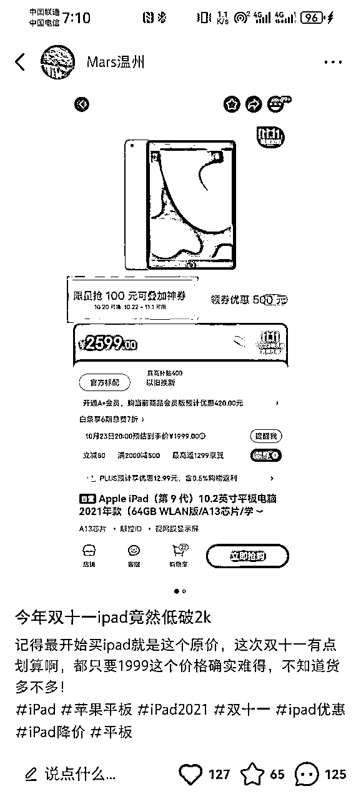
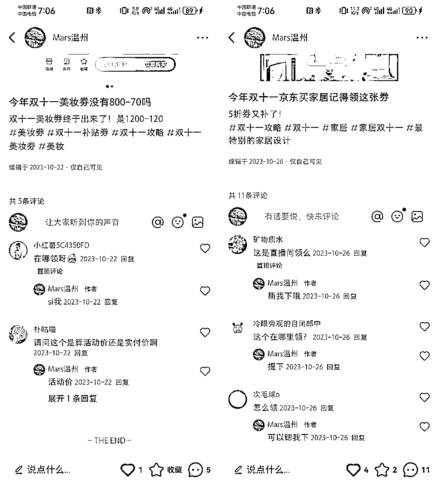

# 23年毕业做淘客，通过小红书实现双十一期间变现5w+思考及复盘

> 来源：[https://h0nho3m4643.feishu.cn/docx/BQEqdWn0Uo2kBxxMqPxc1SdLnSf](https://h0nho3m4643.feishu.cn/docx/BQEqdWn0Uo2kBxxMqPxc1SdLnSf)

大家好，我是铁锅，一名刚进入上海“沪漂”的待业人员，也是一名拥有4年淘客及社群运营经验的23年毕业大学生。（目前准备在上海发展，上海的各位老板们感兴趣可以链接下呀，本人贼踏实肯吃苦）

迄今为止，我接触淘客行业4年，做私域独立变现3年，在职私域运营1年。独立做过两次项目均拿到小结果，一次为大学期间运营直播粉，私域内容以主播预告、产品上架提醒等服务做用户维系，发布高佣商品、CPA/CPS等活动获取收益，从0-1积累了1000+精准私域用户，2个精准微信社群，2年时间变现10w+，解决了大学期间的生活费用。

这是第一次项目部分社群运营及收益图（部分运营内容因为停运已删除）

第二次项目为小红书平台运营，双十一大促期间，运营两个小红书账号，实现账号涨粉800+，单篇图文最高阅读量破5w+，赞藏破700+，小红书社群内引流400+，销售额达700w+，单天最高收入1w+，单月累计变现5w+。

这是第二次项目部分收益图（部分运营内容因为时间过长无法找到）

本篇复盘，我将会详细分享我是如何在0资源、0背景下，在双十一大促期间，就靠着小红书运营变现5w+的实战经验。

在本篇文章中，我将会从以下几点给大家详细分享：

一、我为什么会选择小红书这个平台

背景：早期淘客出身，想到双十一流量=李佳琦直播间

二、确定好平台后，我是怎么进行推广和营销的，又遇到了哪些困难

1、初尝试：小红书导微博卖货

2、换方向：大促推广密令不能少

3、促转化：尽全力让用户多搜密令

（1）免费请喝奶茶

（2）密令链接转口令

（3）转主推京东密令

（4）增加小号入场

（5）换高客单类目

4、看效果：收益会说真话

（1）图文效果

（2）涨粉效果

（3）私信效果

（4）收益效果

三、此次项目带来的思考

1、真诚分享

2、结合兴趣

3、要有执行力

# 一、我为什么会选择小红书这个平台

## 背景：早期淘客出身，想到双十一流量=李佳琦直播间

从19年进入大学，就有接触去看李佳琦和薇娅的直播，那会感觉直播挺有意思。19年底yi情爆发，我们期末放假又加上一个学期都在家上网课很无聊，也没有生活费，那会会在直播间买东西，因为生活费有限，所以每月都是用下个月花呗去套上个月的。（高中那会就申请了支付宝商家码，有赏金红包）

也是当时背景下直播越来越火，每次看李佳琦他们微博评论区都有人会发直播间每天预告，点他们头像进主页，是微信二维码，顺着这层我加上他们微信，进入群里。看到群里每天会提前发直播间的产品链接，因为当时在直播间买东西靠抢，拼手速，很多人抢不到，通过社群里的链接可以提前把商品加购，直播间快讲解的时候在群里提醒需要购买的用户，这个对于当时喜欢看直播的我太有用了，就在群里待了段时间。

后面一直在网上冲浪，想找兼职，这期间还尝试了阿里云客服，进线后被骂惨了（一些人一进线直接开骂，之前都没聊过），就放弃了。后面了解到原来在淘宝上买东西还有返利，一直知乎各个平台了解，下载了好多个返利软件，去一个个对比返利。当时用的是叫一个什么联盟的，不是官方的，直接账号就是最高级，返利比例会比其他的高，就确定使用这个。

后面知道这套原理，就自己模仿着在微博评论区留言倒流，用户添加过来，把他们导入到社群里，跟着同行群发，慢慢熟悉之后，换成官方返利软件，一直做了几年...（这也是第一个项目接触淘客行业的背景，后面有时间可以详细写写）

20年3月第一次建群，学着发链接👇

时间来到去年双十一，当时是10月份，李佳琦直播间已经开始预告双十一产品offer了，我当时还在成都一家公司做私域运营。虽然从23年初开始我就停止做社群淘客（也就是第一个项目，因为各种原因转化很低就停了），有时候还是会关注淘客同行群里的动向，工作内容也是这方面相关。

# 二、确定好平台后，我是怎么进行推广，又遇到了哪些困难如何解决

## 1、初尝试：小红书导微博卖货

知道双十一李佳琦直播间流量是最大的，就像前几年一样模式操作，利用下班和周末时间提前整理了他双十一的产品链接（上千个），做成微博文章或把商品挂上微博小店，分享给之前社群还留存的用户，。

下位微博文章（微博小店现在需要vvip才能用，所以原小店商品无法查看）

像之前一样从小红书引导用户到微博，流量还挺好，也小爆了几条，但是转化很低，也结合社群用户的需要开了拼单贴、互助贴等，都没有太大效果。微博内容主要是把微博博主整理的攻略搬运过来，或者用双十一的商品offer来吸引用户进来，第二页会放上微博文章内截图，截图露出微博ID。

## 2、换方向：大促推广密令不能少

作为淘客前身，我们深知每到大促推广必不可少的就是淘密令。

那到底什么是淘密令？

我们都知道推广电商平台产品会有相应的返利，这一返利来自于商家提前设置好的产品佣金比。密令也相当于返利的一种，他是电商大促平台特别推出的营销形式，想38大促、618大促、双十一大促、年货节等都有这个密令。密令形式是一串独特的口令（通常为文字+数字组合，大佬级别可申请纯文字口令），用户在大促期间去电商平台首页搜这串口令，可以领取随机面额的无门槛红包，用户使用这个红包下单的商品返利归密令归属淘客所有，所以大促更多推广是密令（密令优势就是可以多商品触及，劣势是返利比例比商品实际比例低，一般为佣金的60%，部分大促有平台补贴）

确定推广密令后，我先后在淘宝联盟和京粉上申请了双十一的密令。我把小红书简介加上密令导语，把账号打造成一个薅羊毛很厉害的博主（简介因为后面违规改了，未截图）

淘宝密令：你真好看717

京东密令：天天领红包313；每日福利605；大吉大利716

因为小红书平台红包、福利等字眼容易违规，开始申请前我没有意识到这个问题，最后小红书上京东主要还是选择了大吉大利716这个密令词推广。

大促开始前几天，我想把小红书社群先活跃下，就在群里发了一些大促前活动，链接被用户举报，群聊被禁言了三天。

解封后，大促正好开始，这次我把链接换成密令，没有出现违规，但是转化极低，当时有3个社群，用户将近400+。（一个小方法：直接发图片也容易出现违规，把图片转表情发布就好了）

社群效果不好，我把方向转变为图文，并引导到私信转化。当时正好羊毛裙看到ipad价格不到2k，便把这个信息发出来，看的人还挺多，也会有人来私信怎么买，我就想着利用羊毛这块信息差来发布，羊毛线报群这些我之前一直都有积累的。

于是我开始发布一些大促优惠卷，评论区引导用户私信，私信里面在引导用户去密令的链接，效果很不错，那几天一直在回复私信，转化也好。

（部分效果、转化图）

中间也出现多次提示违规、交易倒流，图文不被推荐。

## 3、促转化：尽全力让用户多搜密令

### （1）免费请喝奶茶

我去尝试新的方法，当时看到平台比较多请用户喝奶茶、吃饭等等，我想我也可以结合免费奶茶来营销，一杯奶茶也就不到20块的成本，密令带来的免费红包对于用户来说也是实打实的福利，然后就开干。置顶博文为奶茶活动规则介绍，每天会在评论区抽一位领取了红包的用户喝奶茶。

活动持续了几天，后台提示违规了，我就停止了，整体效果还是有的。因为当时姐姐结婚，请假回去要布置家里面，走婚礼，招待客人各种事，所以用户消息有时候回复比较慢。

（补一张姐姐结婚照，祝福大家都能幸福美满）

### （2）密令链接转口令

期间我用小号发现，我给用户的密令链接被平台吞了，于是抓紧换成文字密令，测试，然后重新发给用户。

后面私信口令也会出现吞的情况，就模仿同行评论区直接转化密令，用小号随时查看评论是否被吞。

### （3）转主推京东密令

当时我会发布淘宝、京东平台活动相关的图文，淘宝密令的转化很低，甚至每次在评论区引导都会被同行举报，淘密令的转化收益单个用户可能不到1元。京东不同，京东密令能拿全佣，于是我放弃了淘密令的推广，进而主推京东密令。

正巧当时淘宝京东价格战，京东出了真便宜直播间，很多京东大促会场只需要搜口令就能就去。私信我就把密令+会场口令，这能让用户更加信任，因为会场有大额劵。

### （4）增加小号入场

30号我收到一条平台推送的违规，感觉很严重，我马上暂停了所有图文的发布，先消停几天。

与此同时，正好我有个小号，正好拿来继续做测试。经过上面的经验，我把小号直接改名为京东小二，简介为内部密令搜加上密令词，打造一个官方内部人员人设账号（没有提前截图，后面账号违规改成正常了）

小号利用内部员工人设，微博信息差获取苹果信息，拿到了爆文👇

上面这两篇图文，帮助我在双十一期间多卖了至少200台苹果设备，销售额增加了200w+。

### （5）换高客单类目

大家都知道，小红书属于精准用户的聚集和推广地。在大促后一阶段的推广中，我会按照高客单品类来发布图文，像家电、家具、电子产品、奢侈品等，不需要靠订单数量，能够保证出单，每单的收益都有几十~几百不等。

## 4、看效果：收益会说真话

### （1）图文效果

### （2）涨粉效果

（停更了几个月，会有掉粉）

### （3）私信效果

### （4）收益效果

（总收益截图看开头，下方为能找到的部分图片）

# 三、此次项目带来的思考

## 1、真诚分享

全文都是在青旅一个文字一张图片敲出来的，分享绝对真实。虽然这个项目和星球上其他大佬分享的项目来说不值一提，但确实让我在实践中收获了很多。说个笑话，京东的宣发都私信我打广告呢。最近也一直在知识星球上看项目，学会了要保持利他性，当然全文最大的想法就是希望能够在上海收获一份工作。我也预测很多朋友会问这个项目还能不能做，我觉得是能做到，首先密令的申请没有什么门槛，现在马上38大促要开始了，可以结合自身资源去尝试下。另外我的两个小红书账号双十一结束后被平台要求改名了，图文都隐藏了，所有上面没有这块的截图（是个小失误，很多东西没有提前保留下来）。

## 2、结合兴趣

星球上看过大家分享的形形色色的项目，真心希望大家能够独立思考下，自己对哪方面感兴趣，我之前就是对直播感兴趣做的淘客，包括后面这个项目也有很多相似之处，兴趣结合项目，才能有动力坚持下来。

## 3、要有执行力

看到的每个项目都有这句话，但是话糙理不糙，有想法能行动起来确实打败很多人，在行动中不断试错，有问题就解决问题，主打一个好心态，跟着平台走，适时变动方向，少听些鸡汤，多鼓励自己。

最后欢迎感兴趣的老板相互交流呀，本人知无不言，主打一个真诚哈哈

w1242915498