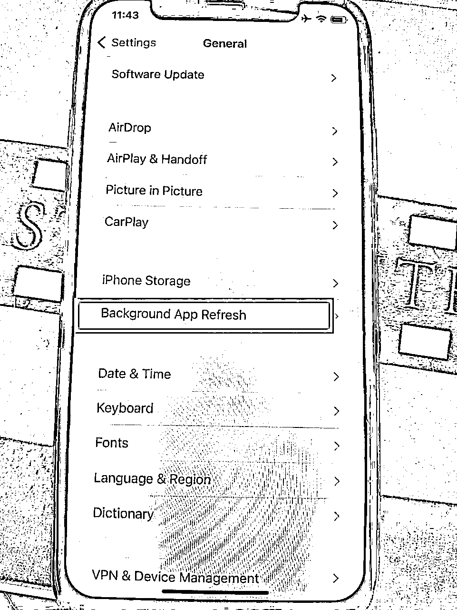
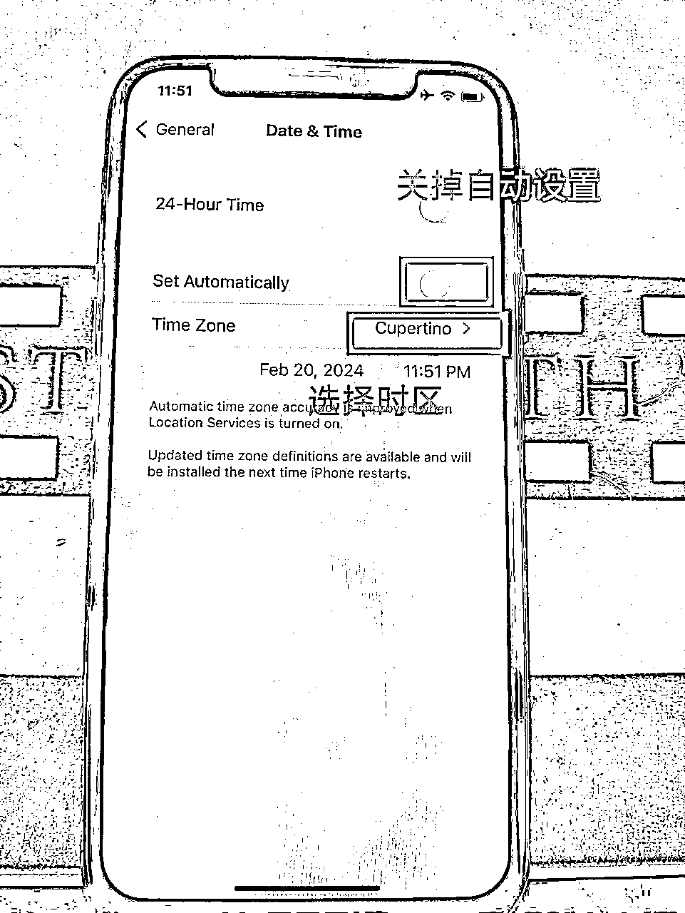
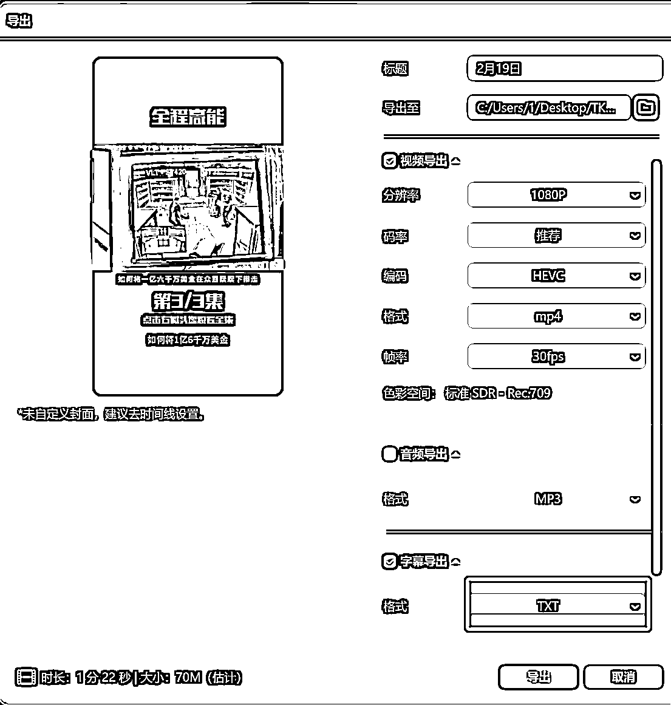
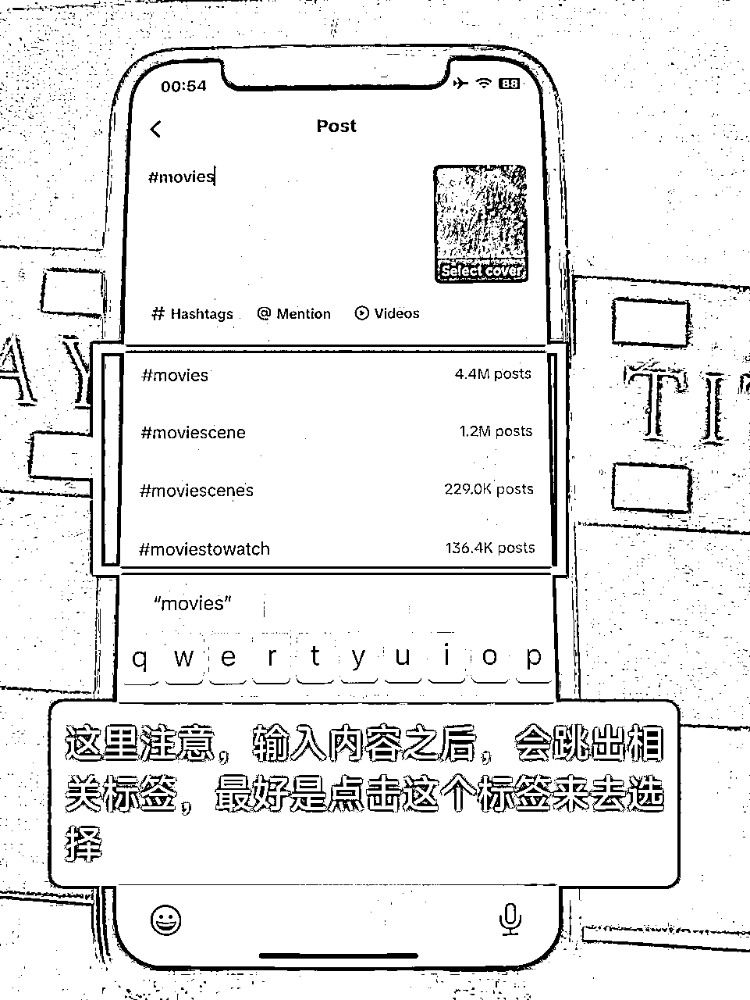

# 国际版抖音中视频保姆级教程

> 来源：[https://spg0xsnzv2.feishu.cn/docx/Iq5Vd2nlPop8zHxrBBWcCbxgnSh](https://spg0xsnzv2.feishu.cn/docx/Iq5Vd2nlPop8zHxrBBWcCbxgnSh)

# 如有疑问，可联系作者VX:lanmao-9527

对抖音用户来说，中视频计划不新鲜，21年6月西瓜视频、抖音、今日头条就在国内发起了中视频计划，投资20亿补贴创作者。什么意思呢？就是你在平台上发1分钟以上的视频，按照播放量给你奖励。

今天把保姆级教程整理出来，给大家一些实操上的指导，少踩点坑。这件事需要投入的只有精力，壁垒是选内容素材，再加上一点点运气就可以跑通了。非要说成本的话，起步阶段只需要1台电脑加3-5台iphone手机即可。注意，必须是iphone8及以上，现在iphone7已经被平台认定为工作室手机，无论如何都不给你起号。

# 一、什么是TikTok中视频计划？

在2020年，TikTok就推出了TikTok创作者基金，俗称老基金，收益很低，1万播放0.7美金左右，我身边一直没人做，已经在2023年12月16日关闭，所以本篇不赘述。

我们今天介绍的是新基金，也就是"中视频计划"。

TikTok为了鼓励更多的用户给平台生产优质的内容，推出Creativity Program Beta（创作者基金计划）。在美区投了2亿美元，欧洲投了7000万美元，其他地区我不记得了，你们自己搜搜，能查到。目前已开通的国家有：美国、巴西、法国、德国、日本、韩国和英国等。

这里附上官方的介绍（需魔法）：https://www.tiktok.com/creators/creator-portal/en-us/getting-paid-to-create/creator-fund/

## 参与中视频计划的要求：

#### 1、年满 18 周岁

#### 2、拥有1万粉丝

#### 3、30 天累计播放量达到10万

只要你的账户达到上述要求，就可以申请开通Creativity Program Beta（创作者基金计划）。

## 开通收益的要求：

这是我们自己总结的，官方其实没说很详细，心眼大大的坏。

#### 1、视频内容符合TikTok社区规范

这里附上官方社区规范链接（需魔法）https://www.tiktok.com/community-guidelines/zh-tw/overview/

#### 2、视频时长一分钟以上

#### 3、视频有效播放超过1000

有效播放：你的视频被推荐到能够开通创作者基金计划的国家，其用户所浏览产生的播放为有效播放

注：用户点击进入你的主页观看所产生的播放不属于有效播放

# 二、为什么做TK中视频？现在入场晚不晚？

对抖音玩家来说，中视频计划不是什么新鲜玩意儿，21年6月西瓜视频、抖音、今日头条就在国内发起了中视频计划，投资20亿补贴创作者。什么意思呢？就是你在平台上发1分钟以上的视频，按照播放量给你奖励。

当时每1万播放量，平台可以直接给70-110元人民币的补贴，补贴力度不可谓不大。自从这个计划出来以后，“注意看，这个男人叫大壮”、“这个女人叫小美”、“佛播勒”，这些无脑的电影解说号越发猖獗。当年我每天刷抖音，都被这些煞笔解说号强奸眼睛，苦不堪言，挨个拉黑都拉不过来。去年认识了河南的几位自媒体老板，仅靠视频收益就撸了2个亿，可谓流量收割机。

当然，现在国内的中视频计划已经没得薅了，1万播才给5块钱，多的也不会超过10块。解说号粉丝还都是泛粉，变现困难，所以河南的老板转型培训了。这种平台红利，永远是先来的吃肉、后来的喝汤，再来晚连翔都赶不上。平台刚开始补贴的时候，肯定是最捡钱的时候。

作为抖音海外版的tiktok，也在23年悄悄开通了“中视频计划”，或者叫新基金。刚开始真是捡钱，暴力搬运都能赚钱，哪怕你是小白，月入10万也不难。但我没赶上第一波，身边也没人带。

而现在的TikTok中视频计划，已经进入了2.0版本，想进来随便搬运就捡钱已经不可能了。现在做TikTok中视频，还会遇到很多障碍，比如网络、0播、卡200、封号、黑屏、TikTok注册不了等等。TikTok如今的风控不是一般地严格，风不风控只是他想不想，不是他能不能，我们别和字节斗智斗勇，在人家的锅里吃饭，就得看人家的脸色，这很合理。

但是，困难再多也建议大家尝试一下。

为什么呢？

因为挣钱！！！以美区为例，1万播放的补贴大约是5-10美刀，相比于国内，同等播放量收益要高得多。本质上，平台希望大家在平台上发布优质内容。而早期的作者为了薅收益，已经把一些赛道玩坏了。但为了赚钱，国人的智慧是无穷的，一直有新的玩法出现。TikTok服务140多个国家或地区，现在中视频仅开通了十几个国家，还有很多国家排队开通中，我们预计TK中视频能比抖音中视频玩的久，起码我们已经把俄罗斯的账号养起来了，就等他开通计划。

正确的做法是顺应平台规则，主动提供价值，自然不会限你的号。如果你只想着从平台偷鸡，想方设法薅一点免费流量，损害其他用户的体验，平台自然毫不留情。发视频、获精准粉、打标签才是正确思路，你为平台提供优质内容，平台自然允许你赚收益。

部分近期收益：

# 三、现在有哪些赛道

赛道很多，这里只说几个：

#### 1、影视解说：

##### 流程：通过将国内视频平台的视频，二创之后， 发布国外。

##### 优势：制作简单，因为文案别人已经写好了，只要翻译之后，校对字幕并发布即可。可以做矩阵。

##### 劣势：正是因为简单，做的人最多，平台现在审核超级严格，内容不优质，去重不到位，基本很难做起来。自然流量 涨粉困难。需要会Pr剪辑。

##### 案例：

#### 2、影视切片：

##### 流程：通过将电影或者电视剧中精彩的片段，按照一定的逻辑去制作，并发布到国外。

##### 优势：原创度比影视解说要高，更容易爆，自然流量涨粉容易。

##### 劣势：平台管控比较严，创作者基金计划申请不容易通过，通过之后账号容易被封禁，提不出钱。需要会Pr剪辑。

##### 案例：

#### 3、问答

##### 流程：找到一个主题，根据主题选择合适的背景图片或视频（用AI生成，或者网上找素材），每个视频配备5个问题， 先用配音读出问题，再等几秒，跳出答案，重复这个操作，完成视频制作。

##### 优势：制作简单，用chatGPT可以大量生产内容，可以做矩阵。会用剪映剪辑即可。

##### 劣势：视频播放的单价相对较低，起号要批量起，比较废账号。

##### 案例：

#### 4、新闻

##### 流程：在TikTok上找对标账号，然后根据视频标题内容在谷歌搜索对应内容，然后将新闻的图片和文案一一匹配即可。

##### 优势：制作简单，视频内容素材容易找，可以做矩阵。会用剪映剪辑即可。

##### 劣势：做的人太多，目前平台审核严格，起号要批量起，比较废账号。

##### 案例：

除此之外，还有美女号、音乐球、AI讲故事、AI数字人解说、主机游戏、汽车碰撞测试等等，各有优劣，篇幅有限，我就不赘述了。

本质上，只要是优质的内容，能带来高播放量的都可以做，抖音的内容都值得在TikTok上再做一遍。

# 四、保姆级操作教程

#### 第一步：刷机，有一个干净还原的手机很重要！

首先准备一个iPhone手机，型号至少是8以上，建议用X，8估计很快也会被认定为工作室手机。

拿到手机后，用爱思助手进行刷机，选择一键刷机-智能刷机-常规快速刷机-立即刷机

刷机完成之后，我这里以iPhone X为例，按照下面步骤一步一步进行选择即可

注意：做那个国家，就选择对应的语言即可，这里以美国为例

##### 1、选择English - United States - 连接Wifi（注意这里连接的Wifi的名字不能带有中文）

##### 2、数据和隐私这里选择继续即可

##### 3、Face ID选择稍后设置（后面在使用过程中一直会提醒你设置，注意不要设置即可）

##### 4、密码选择不使用密码即可

##### 5、应用和数据这里选择不要传输任何应用程序和数据

##### 6、苹果ID这里选择忘记或没有苹果ID - 在设置中稍后设置 - 不要使用 - 条款点击同意

##### 7、系统自动更新这里点继续

##### 8、信息这里选择不是现在

##### 9、定位这里选择禁用位置服务

##### 10、Siri和屏幕时间这里都选择在设置中稍后设置

##### 11、iPhone分析这里选择不要分享

##### 12、外观和显示缩放这里选择继续

#### 接下来就是进入手机之后的设置了

##### 13、打开状态栏，打开飞行模式，关闭蓝牙和数据网络，连接Wifi

##### 14、打开设置，点击蓝牙，关闭蓝牙

##### 15、在设置界面点击 一般 - 软件更新 - 关闭自动更新（注意这里所有的按钮都要关闭）

##### 16、在一般界面点击 后台应用程序刷新 - Off

##### 17、在一般界面点击 日期和时间 - 关掉自动设置 - 选择时区 - 选择洛杉矶（这里根据你做的国家去选择）

##### 18、在设置界面点击 隐私与安全 - 关掉位置服务和跟踪（注意这里面所有的按钮都要关掉）

到这里，这台机器就算刷机完成了，接下来就是下载和注册TikTok了。

#### 第二步：下载和注册TikTok

手机成功刷机之后，我们开始进行下载和注册账号。

##### 1、准备一个美区的Apple ID账号并登录到手机上

可以用朋友的，或者买一个成品美区id。

##### 2、在手机上下载三个软件：TikTok，小火箭，谷歌邮箱

上网你懂得，我不能讲，只能自学，或者你自己找“哥们”帮你搞定。

##### 3、成功上网之后，检查网络环境模拟度

在Safari中进入whoer.net来检测你的网络环境是否正常，上方的城市一定要是你所做的国家名称，下面这个模拟度至少要90%以上，这样才表示你这个网络算是正常的

##### 4、网络正常之后，登录谷歌邮箱，然后通过谷歌邮箱注册TikTok即可

注意：注册的时候，年龄一定要大于18岁，一般选个二十多岁就行。

#### 第三步：发布视频前养号

一般来说，注册成功的新号，你要先刷10-15分钟视频，然后尝试点赞和关注，如果不是黑屏、能够点赞和关注，那么你的账号目前是正常的。如果黑屏、不能点赞关注，那就要刷机还原，重新注册。

养号有人说不用养，我们从玄学角度考虑，建议养个2-3天，也不算很麻烦。每天刷30分钟以上的视频，也有助于你了解TK上面老外都在看什么。

刷过TK的都知道，你原来在抖音上过的是什么清汤寡水的日子，坏处是你的口味可能越来越重了。

第一天不要搜索任何内容，模拟新用户，点点赞，点点关注即可。

第二天可以去搜索相关赛道的内容，比如影视解说等。然后更换头像。

第三天可以开始发布内容了。

#### 第四步：内容制作

以影视解说为例，主要是将国内抖音或者其他视频平台的内容，二创发布到国外。

##### 1、找到对标的视频，使用去水印工具将其水印去掉

##### 2、将视频导入到剪映中，使用剪映识别字幕的功能，将字幕识别出来

##### 3、对识别出来的字幕进行校正，将错字改正，成语换成大白话，便于后期翻译成其他语种

##### 4、字幕校正完成之后，导出视频文件和字幕文件（注意字幕文件要选TXT格式的）

##### 5、将导出的TXT文件的内容放到有道翻译里面进行翻译

##### 6、将翻译之后的文案，导入到魔音工坊（这里不建议用其他配音软件，其他的不好用）

##### 7、将准备好的配音文件，视频文件，字幕文件都导入Pr中

##### 8、将字幕和对应的视频画面进行匹配（尽量100%匹配）

##### 9、给视频加上锐化，水平翻转，Lumetri 颜色，基本3D 这四个效果进行去重（这里可以把常用的做个 预设，这样下次再用就不需要一个一个去搜索了）

去重的作用是为了提高我们视频的原创度，一切可以提高我们视频原创度的方式都可以用

##### 10、给视频配上合适的背景音乐，并对音乐的音频增益改为-12，这个数据可调整，保证解说的声音不被掩盖即可

背景音乐的选择不要选跟原视频一样的，去找类似的，并且冷门的音乐去使用。提高我们视频的原创度。

##### 11、导出制作好的视频到桌面

因为剪的视频会比较多，所以这里注意文档管理，可以根据每天的日期给视频分类。

#### 第五步：发布视频

##### 1、将制作完成的成片，通过爱思助手传到手机上

##### 2、打开TikTok，点击屏幕下面的+号，在相册中选中我们要发布的视频

##### 3、选择音乐（因为TikTok对于音乐的版权管控的很严格，所以我们发布的时候要调整音乐）

###### ① 点击右上角的放大镜

###### ② 点击上方Sounds，将Sounds改为Commercial Sounds（这里是选择商用音乐，避免发布的视频音乐音乐违规被静音）

###### ③ 选择下方任意一个商用音乐，自动跳转到音乐选择页面，这里注意左下角的Original sound一定要勾选上（保证你的视频原声可以正常使用），然后点击右下角的Volume，跳转到音量选择页面，这里上面Original sound要拉满，下面Added sound尽量拉小，但是不要完全关掉，调整完之后点击Done即可

##### 4、点击下一步，到tag添加页面，这里添加tag一定要点击#Hashtags之后，再输入内容，一般影视解说就加#电影 #电影解说 等等（这里注意要翻译成对应国家的文字，美国就是#movies）

##### 5、标签添加完毕之后，点击右下角的发布即可完成视频的发布

#### 第六步：账号运营

##### 1、发布视频的第一天，选择所做国家的下午或者晚上发布。

##### 2、要求先发第一个视频，再隔一个小时看是否是0播放：

如果是0播放，隔1个小时再发一个视频，如果还是0播放，直接刷机重来，如果正常，第二天再发布3个视频。

如果有正常播放，隔1个小时正常再发一个，第二天再发三个。

##### 3、前5个作品播放有过千的，可以留，后续正常发布即可。

##### 4、账号一直正常的，就坚持发视频，满足要求后手动开通计划。

##### 5、开通计划后的每条视频都会有收益，单条视频即使只有1000播放，也有0.8美元。

###### 6、运气好，某条视频爆了几百万播放怎么办？

恭喜你有几千美金了！稳住，记得见好就收，把所有视频隐藏，提现过一次之后再解禁，继续发视频。

# 五、总结建议：

##### 1、不是无脑躺赚项目！有门槛的！考验信息差、网感、技巧、运营能力，还需要一点运气。

##### 2、我要是有无脑捡钱的项目，那我睡觉都得把嘴捂上，生怕说梦话说出来，还告诉你？

##### 3、Pr剪辑不难，只要多磨一磨，很容易上手，高阶剪辑技巧你不用学，用不上。

##### 4、内容玩法很多，平台每个时期对不同玩法有流量倾斜，要多测试。

##### 5、新手不具备矩阵起号能力，那就做1-3个精品号。

##### 6、一个玩法从0-1跑通之后，放大很简单：招剪辑、加手机而已，能有多难？

##### 7、新手起号，建议至少准备3台手机，防止平台无差别封号。

##### 8、手机要用iPhone8或以上，iPhone7已经不行了，直接被平台识别为工作室手机。

##### 9、有门槛才有搞头，0门槛的项目，不出3个月就被薅完了，要么已经写在刑法里了。

##### 10、其他的还没想到，想到了继续补充。