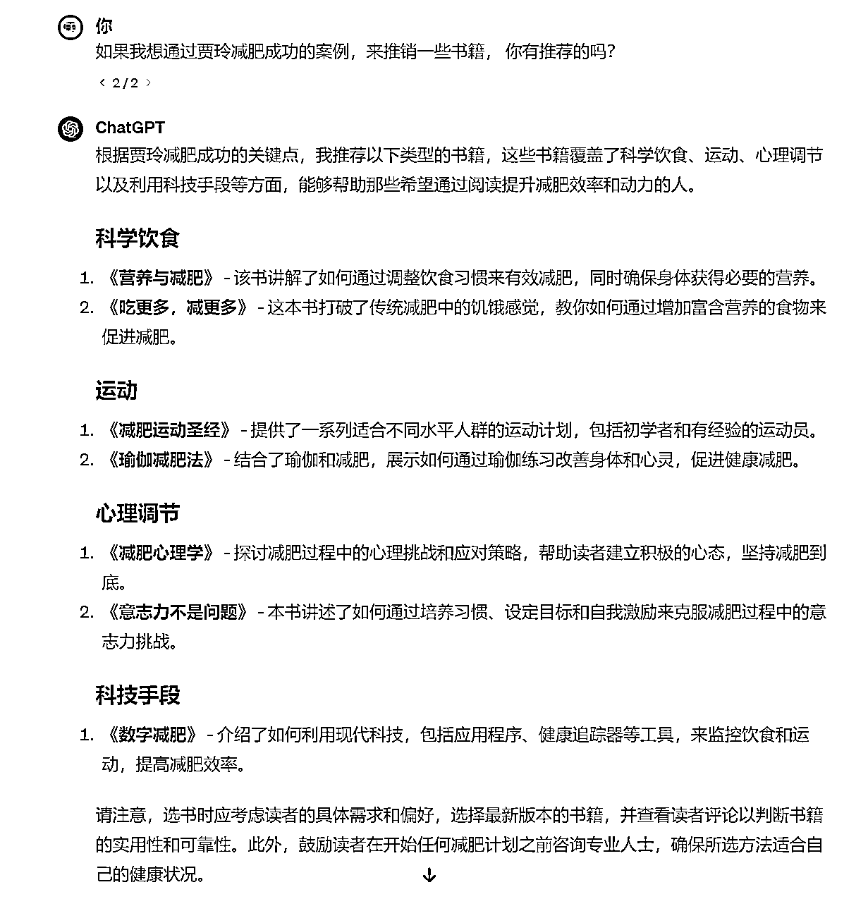
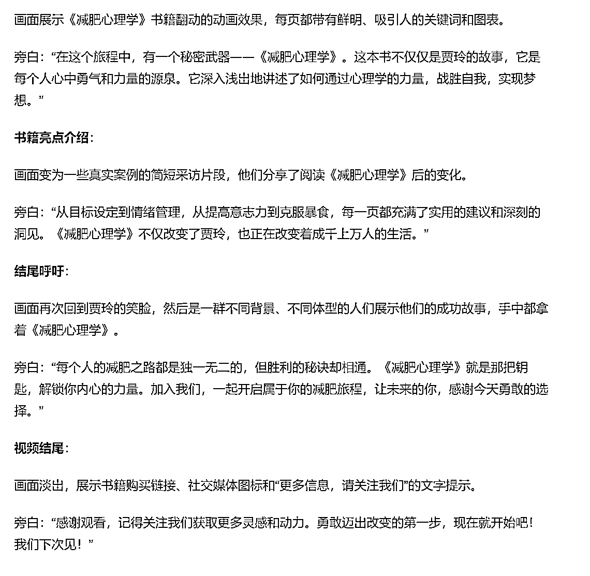
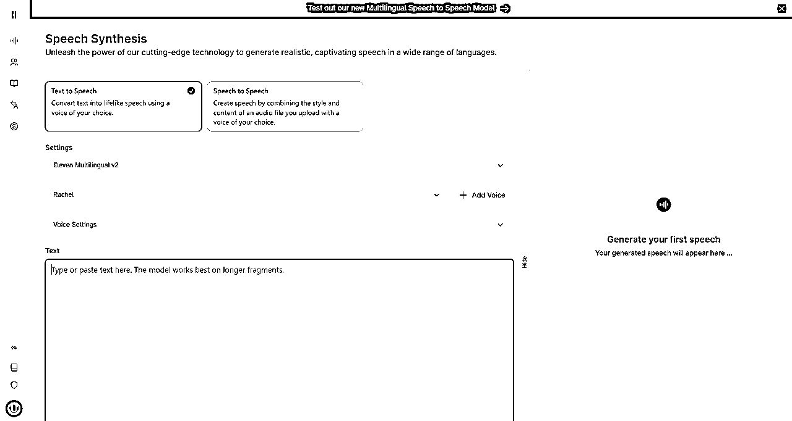
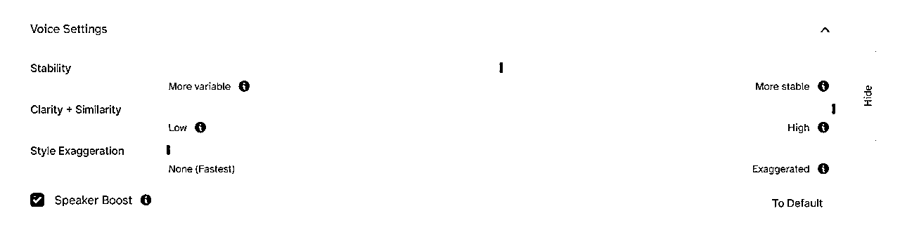
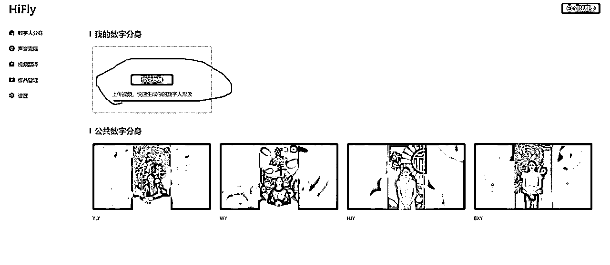
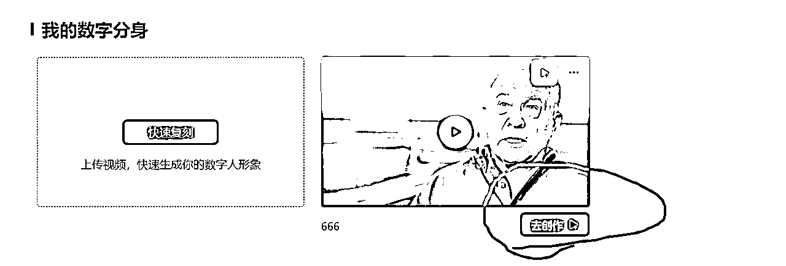
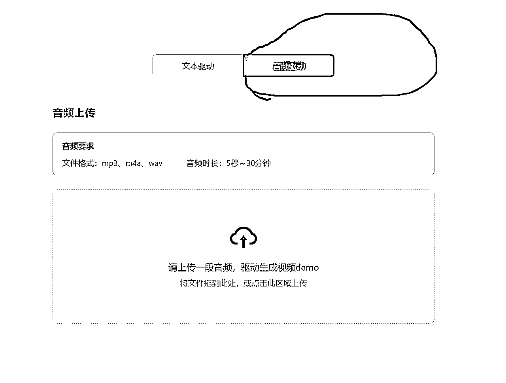
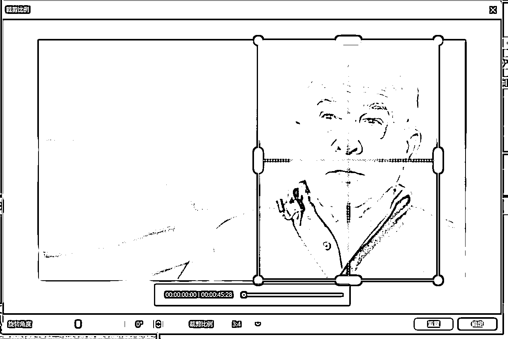
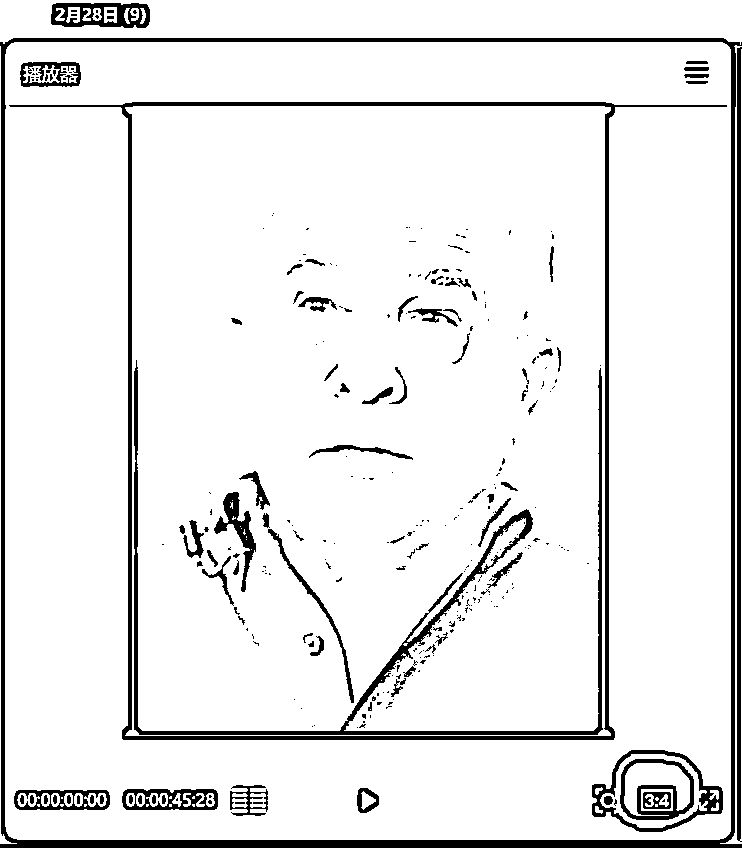

# 手把手教你制作一个爆款数字人书单带货视频

> 来源：[https://pe3zzbrwvl.feishu.cn/docx/Cw23dwbMmoEFD1xfkQ4cdW8ynfg](https://pe3zzbrwvl.feishu.cn/docx/Cw23dwbMmoEFD1xfkQ4cdW8ynfg)

此文档仅供生财内部交流学习使用，侵权倒卖、非法传播一律追究法律责任。咨询/举报微信：jingdu2024

目前数字人短视频的带货赛道极其火爆，甚至可以说已经有点小卷了，尤其是海外特产带货这块，每天都会涌入大量的数字人制作者。我们是跟他们死磕到底呢，还是说选择一个不那么卷的赛道来错开高峰完成大量铺货变现？答案很显然是后者。因此我们需要选择一个不那么卷的赛道：书单带货。但如何制作一个爆款的数字人书单带货视频，想必难倒了不少制作者。今天PONY就来手把手教你制作一个爆款数字人书单带货视频。废话不多说，下面我们进入实操阶段：

## 制作步骤主要包括以下5个方面：

1.  素材获取

1.  话术设计

1.  音频克隆

1.  模型制作

1.  视频剪辑

## ① 素材获取

素材获取其实我在之前的生财帖子里已经说过多次，直接去油管搜，诸如语言学习、英语演讲等等。由于我们要做的是书单带货，因此我们的素材最好选择采访类的老者形象，这样会给用户一种饱经沧桑、充满人生感悟的感觉，易于后期转化。

这里我选取了一位个人感觉不错的老者形象：

我们把这个视频下载到本地（清晰度最好选择至少1080P）

下载工具：https://9xbuddy.online/zh

## ② 话术设计

良好的话术是视频能否火爆的关键因素，这里我们用到chatgpt 4.0 来制作话术。

根据当下的热门话题来制作话术会让你的视频流量蹭蹭蹭往上涨。这里我拿最近贾玲减肥成功的案例来举例，以下是我向chatgpt提问的记录：

## ③ 音频克隆

有了素材和话术后，下一步我们需要对人物的音色进行克隆，这里我们选择elevenlabs：https://elevenlabs.io/

勾选voices，添加语音模型，选择声音立即克隆

给项目随意命个名，导入25段切分的音频（这里先用剪映把原视频的人声分离，然后用slicer把音频切割，选取25段拖入即可）

点击同意授权，然后添加声音，等待5分钟左右音频克隆完成

克隆完成后，我们需要输入之前用gpt生成的文字脚本，选择generate，等待音频生成即可

生成完成后，我们试听一下效果，不满意的话可以对声音细节进行调整

没问题的话，我们点击下载按钮，这样音频就克隆完成了

## ④ 模型制作

有了素材、话术和音频后，下一步就是模型制作了，目前国内最好的数字人制作平台就是HiFly。

我们勾选快速复刻，将视频拖入，给项目命个名，同意协议，提交

复刻完成后，选择去创作

选择音频驱动，上传我们之前克隆好的音频，添加作品名称，点提交

等待3-5分钟，数字人模型的视频就做好了，我们在作品管理下载即可

## ⑤ 视频剪辑

最后一步就是对制作好的数字人模型视频进行后期剪辑。

我们打开剪映，对视频画面进行裁剪（这里我以视频号、快手3：4举例)

把之前的脚本复制进行文稿匹配

调整字幕大小、样式、位置

添加背景音乐

播放一下，没问题的话导出即可，大功告成！

以上就是制作一个爆款数字人书单带货视频的完整步骤，大家如果在数字人的制作过程中有任何不明白或者有问题的地方，欢迎向我提问与交流：jingdu2024