# AI辅助论文编写

> 来源：[https://n63xx7fb88.feishu.cn/docx/DfqldpFCOoDPslxhHX4chHykn4c](https://n63xx7fb88.feishu.cn/docx/DfqldpFCOoDPslxhHX4chHykn4c)

随着大模型的发展，目前国产AI的功能也日益完善，也可以帮助我们完成，论文编写

# 推荐使用工具：

1.  KIMI AI ：https://kimi.moonshot.cn/

1.  智谱清言：https://www.chatglm.cn/

其他生成式AI也是可以的。本文方法同样适用于GPT,Claude

论文编写大概可以分为以下七步。

# 1.论文选题

首先学校都会给一个选题方向，

比如：

如果没有给出具体选题，也可以根据个人专业情况来让AI推荐一个。

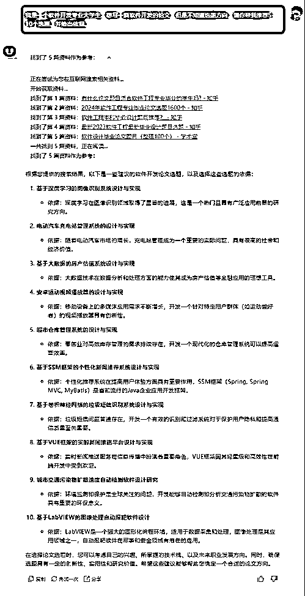

# 2.开题报告编写

可以直接让AI编写一份。

比如：

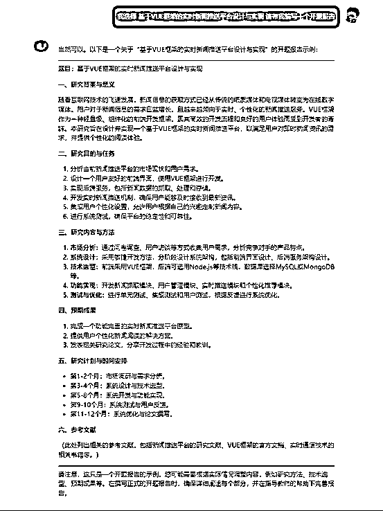

也可以让AI根据指定格式编写

例如：

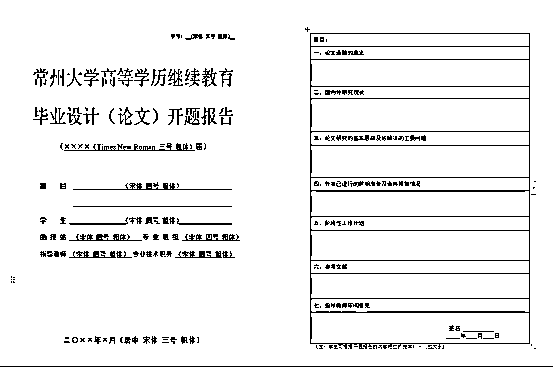

只不过生成的是文本格式的，需要复制到word中去。

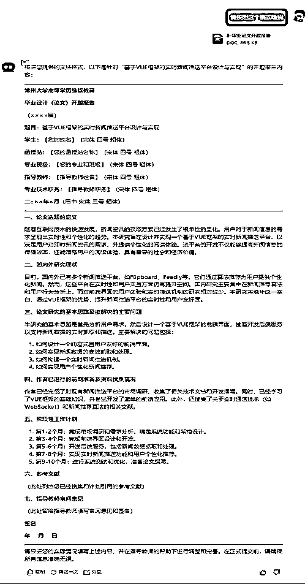

# 3.编写开题任务书

可以直接让AI写，

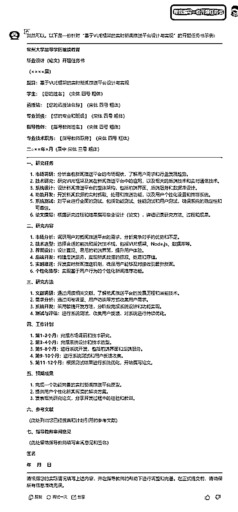

也可以上传模板让AI帮忙编写。

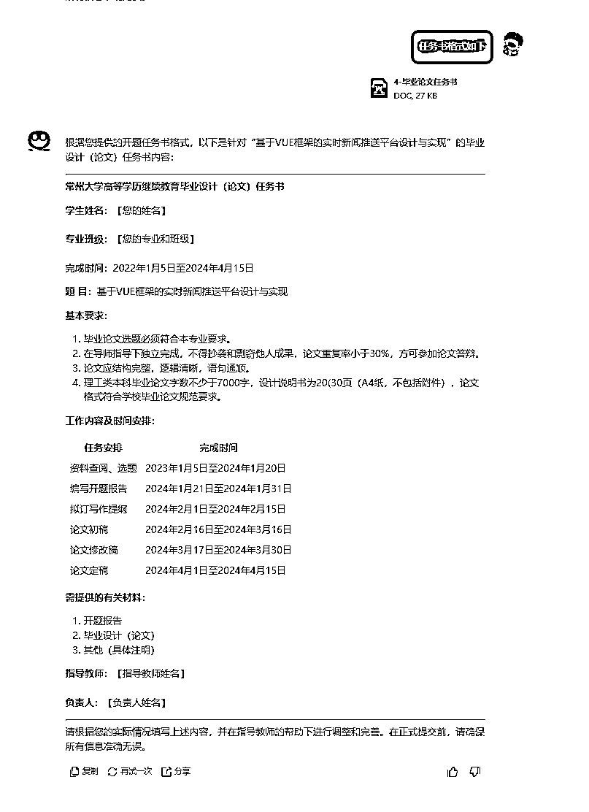

# 4.推荐参考文献或项目

可以让AI帮忙查找一些参考文献以及项目

这里可以直接让KIMI查找，也可以用秘塔AI搜索。

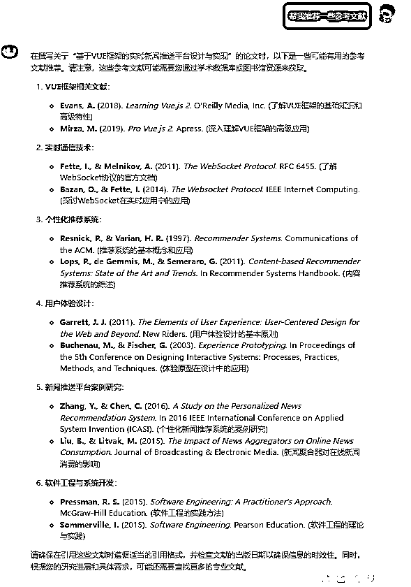

## 秘塔AI搜索：https://metaso.cn/

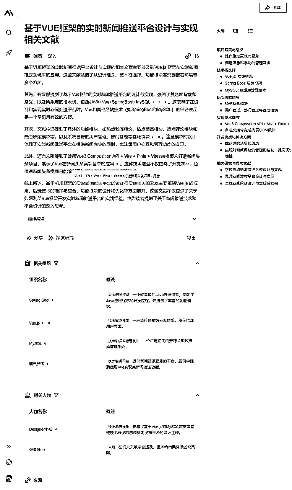

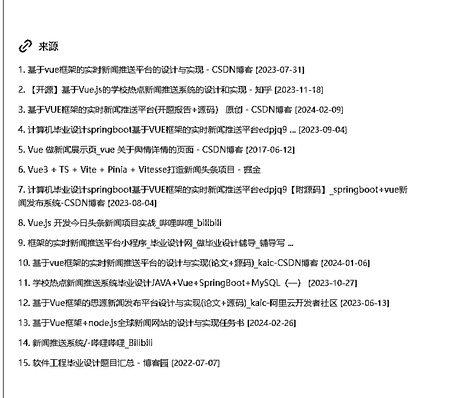

# 5.深化学术概念

我们需要AI从学术角度给我们一些专业名词的解释以及说明，这样帮助我们更好的编写论文。

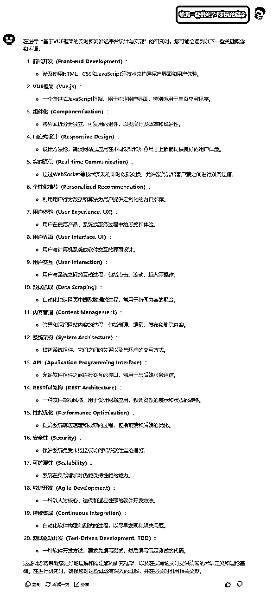

# 6.定大纲并深入挖掘

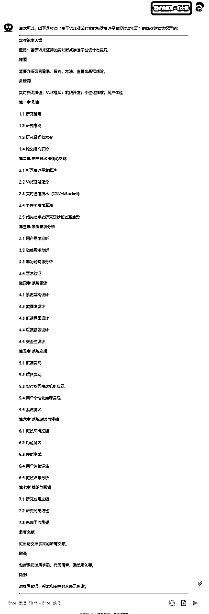

# 7.根据大纲逐步编写论文

根据之前生成的大纲，给AI一个主题，然后要求字数限制。

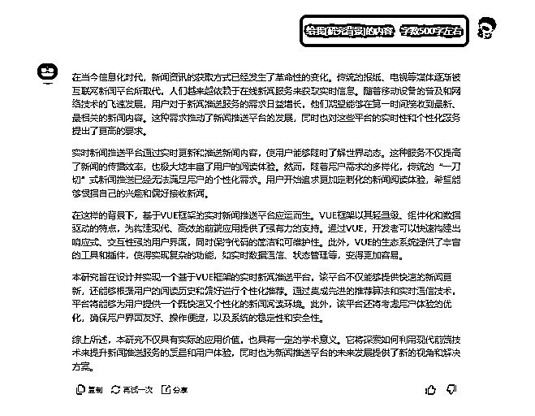

## 建议最后再生成摘要以及关键词

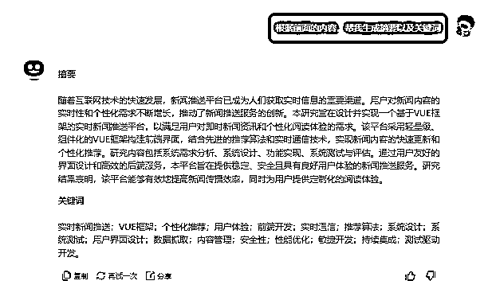

## 软件专业的同学，可以选择让AI来生成核心代码或者推荐相关开源项目进行参考。

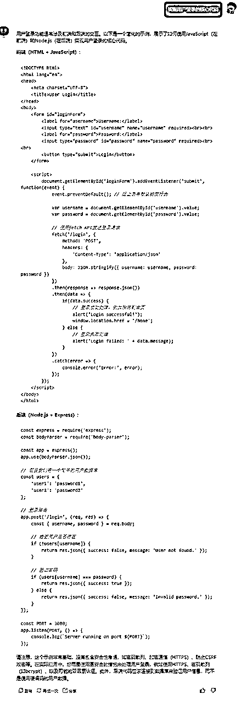

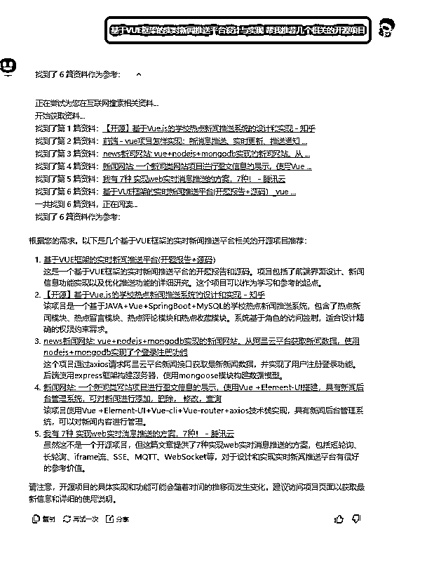

# 注意问题

1.KIMI有时候文件传多了，会断网，可以选择再开一个新窗口。

2.智谱清言在编程方面效果显著，KIMI在文本编写方面，资料阅读方面能力突出

3.本文推荐的所有AI产品都是免费的。国产不一定比海外产品差，不要过分迷恋大厂产品。够用就行。

# 下期预告

AI如何帮助降重

AI绘画如何制作科研绘图