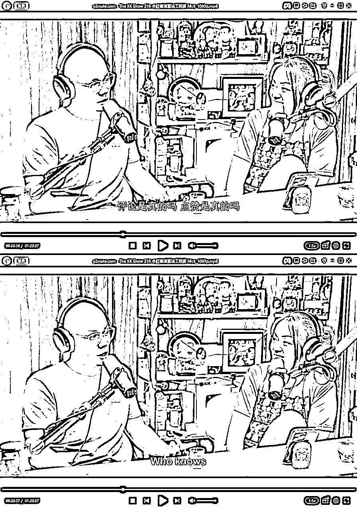
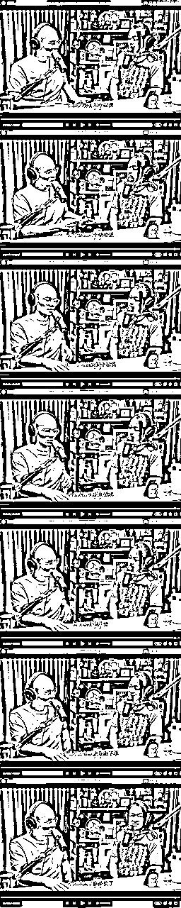
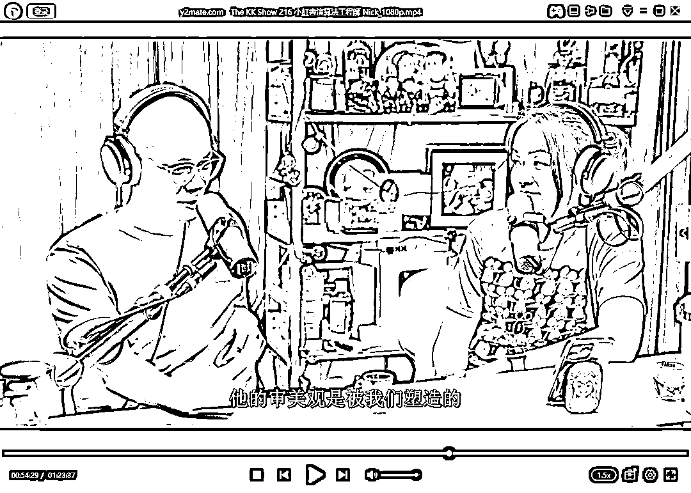
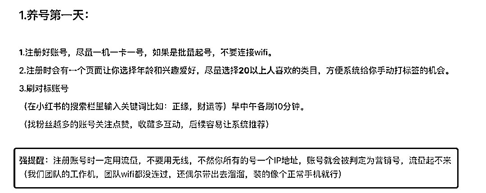
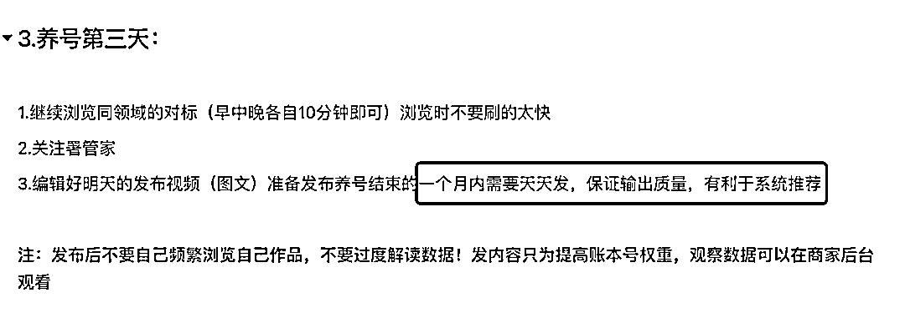
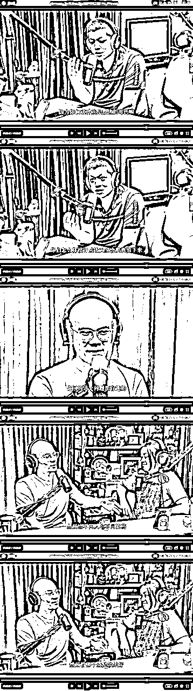
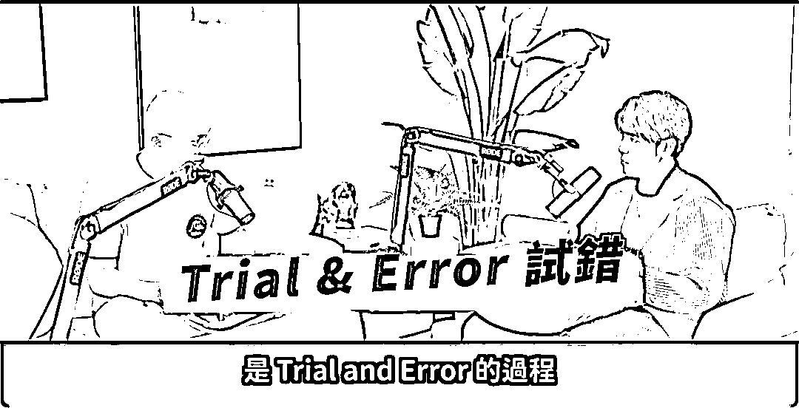
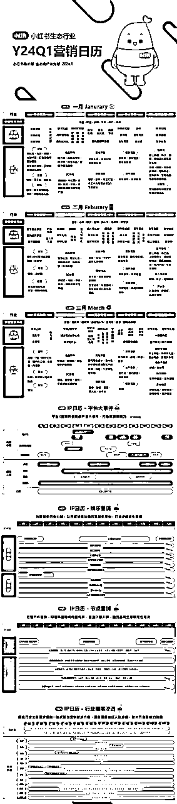
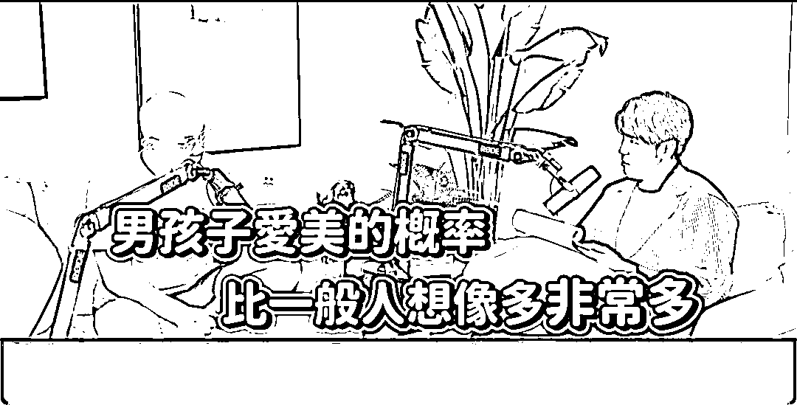

# 【对外】小红书的平台算法逻辑-前工程师访谈观后感

> 来源：[https://qnfoes1o78.feishu.cn/docx/DqqBdmi6RoBjynxX7UfcJlaCn3c](https://qnfoes1o78.feishu.cn/docx/DqqBdmi6RoBjynxX7UfcJlaCn3c)

花了3个小时，仔细看完YouTube上 前小红书演算法工程师的访谈，

得出一些比较有价值的观点，分享给大家，

## Q1：小红书如何做到精准推送的？会监听手机？

A1：用的时间久了，会发现，朋友刚说完某个产品、某个品牌，你转头打开小红书就刷到了。

或者通过小红书能刷到前男友的现女友，前女友的现男友，

这种情况非常多。。。

如何做到的？

一个词概括：物以类聚人以群分。

通过人际关系链。

例如，好友点赞过的，推送给你，大概率也是你感兴趣的笔记。

再有一点：IP地址，

一个局域网，连上WiFi，出去的IP都是同一个。

ABC点赞评论的内容，更精准击中EFG用户。

更容易出现在你们的讨论范围之内。

延展（IP观点包括但不限于小红书）：

---去饭店，连上WiFi，也是透露你的消费层次。

---IP地址，关联你的活动范围。

把所有去过的地方串起来，了解你是一个怎样的人。

去什么饭店、银行、酒吧、理发店、万象城、等等等等

从算法的角度来说，了解一个用户太简单了，你是一览无余。

甚至，

系统，比你，更了解你自己。

## 再次延展出另一个话题：流量也分档次、优劣，那怎么区分？

通过手机型号来进行区分。

手机型号、IP地址，都会泄露你的一举一动。

知道你的喜好偏向、你的活动范围、你的消费层级。

价值3000的护肤品套装，投流推送给手机设备3000元以下的，还是8000元以上的？

大家懂的都懂。

正好刷到一些关于小红书养号的经验，

1、注册号千万不要用WiFi，跟我上文讲的一样，

2、从一个WiFi出去就是同一个IP地址，数量多的话，必被盯上。

平台当然要奖励、天天发布的创作者，

或者说，区别对待日更和月更的账号。

## Q2：小红书的千人千面？

A：先了解算法如何帮助平台赚钱。

演算法做的就是，让用户刷更多，让用户明天还会来，

让用户点广告，买东西，去消费，周而复始，才能更多帮助平台赚钱。

所以，演算法做的，是如何留存住更多的用户？

做法是，将用户分组，AB testing，不同人吃不同药，不同群体推不同内容，

这就导致，我们刷到的内容，是不一样的，是不是很像淘宝的千人千面！

每个创作者和用户，都是产生数据的工具，

用户留存指标，看了哪些内容，有过多少互动，明天大概率还是会来的。

用户一举一动，都会被记录加以分析。

## Q3：流量玄学？hacking演算法，是否会更好获得流量？

A：答案是不会。

演算法，也是反应用户偏好。

所以这个问题，核心是，获取用户偏好。

专业的创作者，会准备3-6个版本笔记、视频，如果反馈不好，下架，上下一个。

这是Trial&Error试错的过程。

有时候，创作的内容，击中某些关键词，可以过审，但就是没有流量。

算法工程师都说，这是个玄学，无法解释。

所以，只能一直尝试，提高爆文的概率，提高账号活跃度，

专业的人，能做的，提高这个概率，所以会有testing，就是一个过程。

## Q4：有哪些东西隐形，但系统都会记录下来？

A：非常多非常多。

页面留存时间、页面滑动次数，

页面、视线停留时间、

通过处于正中间的图片时长来判断，因为不喜欢的图就直接刷掉。

视频检测完播率。

可以说，每分每秒都在监控用户的偏好。

## Q5：有办法决定谁的流量比较高？

A：老板可以决定，这个很正常。

举例说明，内容有分很多不同的类别，想要做某一类新内容时候，那流量就会比较高。

对于工程师来说，可以去修改模型，也就是人工可以干预、辅助流量趋势。

看老板需求是什么，点赞高的内容？创作者的活跃度？都是可以通过模型来调整。

某些头部流量太好要翻身？那就给他压一压，不会让头部有太高话语权。

跟着平台的趋势去走的话，流量会更好一些。如下↓

跟着营销节点，布局关键词或品类词，更好获取流量。

## Q6：如何让创作者发文积极？

A：有团队KPI是创作者的发文指标。

那么，问题是，如何让创作者发文积极？

对于新用户而言，刚来的时候流量高一些，点赞多一些、留言互动多一些。

但是，这些数据是真是假？

WHO KNOWS？

WHO KNOWS？

WHO KNOWS？

为了提高用户粘度，平台可能会给你一些数据的错觉。

系统什么时候给你推送、什么时候给你流量，都是设计好的，在这种大环境下，创作者是非常焦虑的。

但对平台来说，就是要让你焦虑，焦虑才会有产出。

如果一阵子不发文，会被打压，因为，平台要鼓励每天发文的创作者。

创作分、频道分，都是不同维度的指标。

每个创作者和用户，都是产生数据的工具，

平台当然要奖励、天天发布的创作者，

或者说，区别对待日更和月更的账号。

一开始10like给你发推送，后来阈值越来越高，可能0点之后才会有新的点赞、评论推送进来，

（恍然大悟，之前我还以为是手机的问题）

思考：第一性原理思考，为什么做数据？

提高笔记互动→提高笔记整体曝光度→提高店铺销量→赚钱/涨粉/卖号？

知道自己要什么，这才是最关键，只做关键动作！

## Q7：小红书为什么这么友善？

A：评论都是有过模型，经过检测之后才能发出。

oh，所以我之前评论区引流的业务，如果不显示，也正常，是被模型给筛掉。

平台在不同的发展时期，策略是不一样的。

引战类，好听点也叫高评论的内容，刚开始可能会推送，

到了后期，会管控，因为不可能让社区生态变差，

差的话，给用户的体感不好，那还怎么售卖广告（此处@知乎来看看）

## Q8：平台内部演算法，如此复杂，会不会最后没有一个人清楚是如何运行？

A：如果一个平台足够大，会存在这种情况的。

但另一方面来讲，去的比较早期，会知晓全貌，产品线是如何被打造出来的。

后续加入的人就不了解前期的运转规则。

刚开始一次实验的指标是十几个，后续增加到上百个，

业务被更细致化分割，三五人小团队负责指定指标，更加一个萝卜一个坑和螺丝化。

导致全貌被更少的人知晓。

但是老板、高层肯定是知道其中如何运转。

所有的用户和创作者，都是平台的实验样本。

都会有实验参照组做不同的实验，所以每个人刷到的内容都是不一样的，

不仅是小红书，做内容平台包括IG和Facebook。

## Q9：有种感觉，刷了很多，但是又不清楚刷到了什么？

A：都是设计好的内容，麻痹掉你的大脑，让你一直重复这个动作。

反问工程师：你刷吗？

回答：我不刷，刷的极少，因为我清楚不能让自己重复下去。

就像是绝命毒师，zhi毒的人都不xi毒。

很多人吐槽，刷久了之后，没有办法刷很长的文章，即使看过之后，很快就忘记了。

因为脑神经被驯化，只能接受，或者说，只喜欢这种内容形式。

从早期PPT图片→纯文字→图片+文字→大张图片+更少文字→短视频；

都是经过实验测试，让用户的观赏负担越来越少。

越短，对于人的接受程度越高。

有没有发现，各个视频平台，都有了加速的功能。

因为，人的时间是有限的。

所有的APP和媒体都在抢时间、抢注意力。

同样，IG和facebook为什么如此焦虑，因为老人会die，小屁孩会长大。

这些小屁孩一开始接受的就是短视频形式，这是一个不可逆的趋势，抓住年轻人就等于抓住了未来。

## Q10：小红书平台有哪些反直觉的数据？

A：反直觉的数据，非常多。

*   男性爱美的数据。

湾湾叫凤凰电波，中国叫热玛吉。非常多的男生去搜索，可能现实中不好意思去问，那就只能通过搜索，去了解。

*   女性对车也感兴趣，只不过不是对男性喜欢的车感兴趣。

*   每个时间段，搜索的东西不一样。

*   QQYP，晚上10点之后，是女性搜索的高峰期。

*   GAY的市场潜力很大，一不结婚、二无小孩。那么他们的钱消费在哪里？

这些数据都没有被公开。

总结一句话：我们对性别印象，是刻板的。

