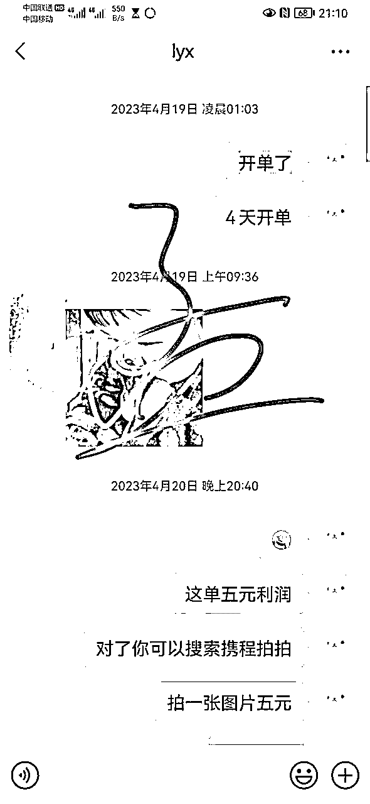
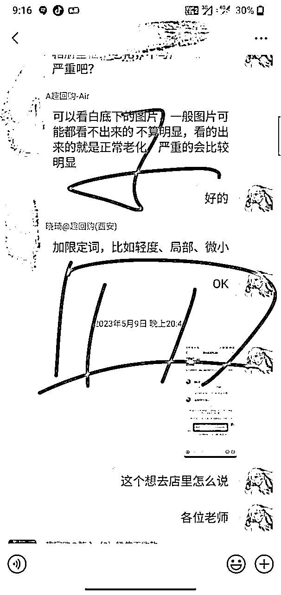
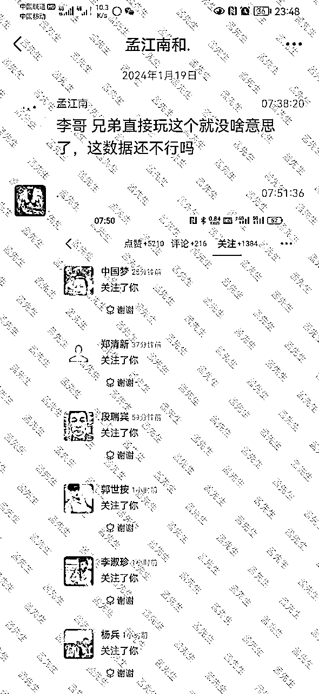
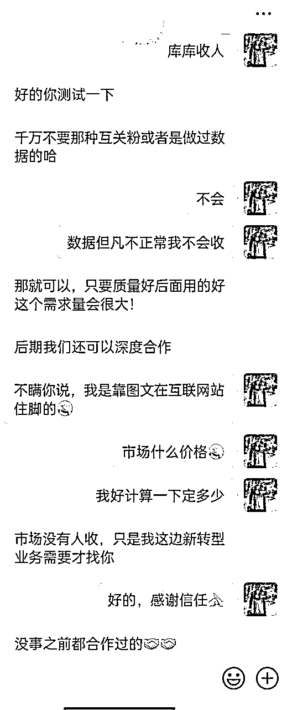

# 02年一年多的互联网摸爬滚打的经历

> 来源：[https://pvve2lmzyop.feishu.cn/docx/DsQDdY6qeortWTxMRxGchlXknFf](https://pvve2lmzyop.feishu.cn/docx/DsQDdY6qeortWTxMRxGchlXknFf)

大家好，我是02年的，初中没上完就出来了，做互联网一年多，22年进入互联网6月进入互联网，截止23年3月初，就基本上没有做账号了，累计粉丝差不多十几万，变现6万块钱吧，199社群50人，知识星球可以搜到：老孟创业社，目前有一张免费的星球邀请码，现在主做涨粉回收业务，头条号和视频号，还有小红书

出社会的个人经历：第一章：贪玩

记得我15岁第一次出来的时候，应该是18年夏天，去学修车，穷人的三大件之一，去亲戚厂里学了大半年，基本上就是玩，不想干活，年度回去了。

然后是19年年初吧，去北京亲戚那边做保安，亲戚是主管，做了大半年，在工地上两个月，然后在工厂4个月，利用几个月的工资买了当时火的p30pro，哈哈，因为当时吹的能拍月亮，我心动了，然后购买之后，亲戚跟工厂签的合同到期了，又让我去工地，当时不想去，因为工地12小时，工厂8小时，而且伙食还不如工厂好，所以就想回去，然后跟亲戚说了一下，我回去，现在想想19年，16岁半一个人做9个小时的火车，我也挺胆大的。

家里亲戚又给我介绍了一个送2小时快递＋半客服＋打包＋送货的活，一天100块钱，早8晚6.30，期间也是没事玩手机刷视频，抖音18年我就开始发视频了，不过那个截图找不到了，当时我16-7岁，能想到就好了，可能情况大不一样，哈哈。

然后又在那里干了半年，年底没干了，主要有点钱想玩游戏，当时过完年，赶上了疫情，4月初我才出去，家里又让我去亲戚那边学车床，先弄物料一个月多，我嫌弃太熬夜，做了一个月，就孟做了，主要时间太晚了，晚上11点到早上8点

然后又跟亲戚干粉刷，我比较瘦弱，干不了，然后回家打游戏，期间在比心，赚了点钱，也不多，主要还是在代理通和代理妈妈接单

可惜代理通的提现数据没有了，订单结算也没有了，要不然就截图了，然后一个月平均下来就1000多块钱，当时想着，自己挺牛逼了，在网上挣钱，

期间家里也说过，甚至想请电视台报道，但家里有人拒绝，然后期间也网恋，都是回忆哈哈，直到21年才算是正式出来，我找了个奶茶店的工作，试用期7天干完了，当时说的，试用期没工资，干了7天，让我走了，当时比较内向，没要求，家里也是没啥学历的人，就不了了之了

第二章：独立

然后我就自己再58上吧，去郑州找工作，还是保安，当时说是让去外地培训，给家里人说了一下，又去亲戚 那边上班去了，一开始上班几天，被卖假苹果手机的骗了，那天刚下班，一个人对我说，要不要苹果11，报价2k，我当时砍到了1.2k，还沾沾自喜，结果是个安卓机，期间也没感跟家里人说，靠着花呗度过去了

期间认识了对我有帮助的2个人，一个是24的大哥，当时我才18，然后他说了几句话，对我很有影响，是：学历并不定决定你一辈子，真正决定你一辈子的是能力

我当时听完没有太大的感触，但为后面做了铺垫，从3月干到了7月初，然后辞职，期间在BOSS上找工作，不知道找什么，还是搜索起来了保安，准备去了，当时没有设置隐私，也不懂，一个销售公司发信息，然后我就去面试了，然后就在销售公司上班，期间一个月基本上有25天出差去外地，陌拜，不过跟着带我的人，基本上天天玩。客户都是随笔抄个电话号码，草草结束，然后网吧，台球，手游，干了4个月，因为疫情，公司转型卖酒，干了2个月，刚转型我第一天就卖出去了2箱酒，然后经过同事一说，也就没精气神卖了，后面也确实是，推也不好推，一个没名气的酒，豫宴，估计大家都没听说过，年底的公司年会，

然后公司年会放假之后，跟家里人说，想当兵，报名去了，期间做了半飞秒手术

结果抽血因为低血糖，晕了，下吧被缝了几针，然后不能当兵了，又去当保安去了，这次去的还是21年去的地方，在干的期间，因为干过销售 的缘故，也在网上天天刷一些思维课程，某一天刷到了我销售公司离职的高管发的信用卡还款业务，我了解之后，贷款5k去参加了这个会员，因为当时好像也没啥钱，就几千块钱，然后又通过渠道找到了停息挂账和贷款业务，3个连起来了，但是没客户咋办，我朋友圈刚好还有投放广告的业务，我花了300块钱，投放7天，带来了20个客户，免费让他们体验，一个都没有转化，然后觉得不行，又去抖音评论区私信别人，结果实名号被封了，彻底凉凉。

第三章；命运的转折

然后我隔壁村的也正好上了大学，刚做劳务，我进群潜伏了几天，刚好群里有人吐槽几千人少数民族没人收，我就抓住这个点，疯狂去知乎各大平台找收少数民族的人，结果还真让我找到了2个

结果真还让我找到了2个，就这样，我开始了做啥倒右手的生活，在这期间，6月初我也在网上付费了2480去学图文ip，慢慢按照方法，投了800块钱抖加，账号终于是破了3万播放

然后我嫌弃没转化，还是自己转化的，而且碰巧我付费的他的学员才17岁，就自己单干了，当时我也单干了，7月初，我通过真诚的包装，贷款＋停息挂账+劳务，成功收费我的第一个学员

结果我把资料给他了，也没有给我反馈，然后就不了了之了。

7月初，因为头发问题，贷款2万做了植发

头发红红的就是植发的区域，现在想想一个人做手术，没有给家里人说，20岁也挺胆大的，然后因为欠债问题，去找了个Tik Tok经纪人的工作，不管吃管住，也不想一直住朋友家，就去富士康打工去了，在那边看机器，

然后期间劳务也签了几十个居间合同，几个大合同，因为疫情各种原因没成功

最可气的是，有一个让我签100万的名单，保密协议，太气人了，结果还好我联系的上家没让我签，上家也就比我大两岁哈哈

10月份疫情大逃亡，我当时也想回去，可惜因为封路，距离远的原因，就一直在那里干了，然后11月份就有疫情补助金，打卡26天，补助9k，然后，就打算把疫情补助拿完，期间也继续我的图文大业，2部手机，在做，效果并不理想，社群都没有收上来，然后又付费了一个大佬，是对我人生特别有帮助的其中之一，。包括现在我们还是经常联系，付费之后我们打电话，说让我整合资料包，卖社群资料，398一年，结果我发着发着，还真有人买，也没什么售后，就发发朋友圈就可以了。

12月疫情，被隔离了

不知道是不是因为隔离的缘故，12月份账号粉丝突然暴涨

12月中旬，我的账号开始有大爆涨，

然后，因为当时算上疫情补助，我发了当时应该有7万多块钱，飘了，想买个手机，花了3600

期间最高粉丝3万，不涨了，然后快手也差不多爆了

期间引流应该是2000来人

变现398社群会员，50人，39的不多，合伙人就一个

然后2月初出来，当时把所有账单还完，买个笔记本和手机，还有4万多块钱，当时想着找个大佬跟在身边，结果朋友圈刚好有招学员的大佬。阿米巴模式，当时立即定机票，去了内蒙，

然后，账号也累计了11万多的粉丝，3部手机，也就是说9个号，不过大部分都是小红书粉丝，单个账号最高是三万

然后就是租了个房子，一个月550，交了半年的，开始跟着大哥卖起了项目，398 会员也不做了，当时第一个月就收了3 个6800的，当时幻想着提宝马的 哈哈，第二个月收了5个

期间我玩这个赔了1万多，太难受了，4月初大佬感觉这个项目不行，公司人员都走了基本上，剩下我和大佬，换方向了，对了，这个是大佬的公司图片

然后，测试小红书电商，因为不懂，从零开始发笔记，用了一个朋友的实名，赞都是个位数，浏览都是几十，居然4天开单，可惜当时没有思维，嫌弃利润少，做了半个月，一共开了五单，放弃了

5一和大佬一起去五台山转了转，放松一下心情

然后5月6号大佬给我报了闲鱼转转课程，期间也回家实名了5部手机，开搞，结果精力不够，就搞了3部，出了大概是十几单，

做了一个月，利润应该几百块钱，没做了，6月份好像做小红书色流量，也不了了之了，然后大佬决心去外地学习，说一起去学千川，我当时想，算了，没账号，就不去了，大佬学完回来了，说招人也不了了之了，7月份大佬决心关闭公司，期间大佬也是真的豪爽，吃喝都带着 我，帮大佬把公司的东西搬完，大佬回去之后，我等待了一星期，也没啥动静，然后决心开始定票，回到郑州，准备找个工作，8月份找了个文案编辑，觉得不是我想要的，干了三天就不了了之，然后朋友圈就发现有人卖账号，付费之后也加入了这个赛道，今日头条涨粉，然后就开始搞这个，我发现搞完这个也没啥事情了，学员，流量弄不上来，然后就评论区找兼职代发，慢慢就开始运转起来

然后去年流水很高，没赚啥钱，就只有一辆破车

1月份又开发现了视频号回收的市场，开始厕所，当时最高是一个视频1k多，然后跟另外的大佬合作训练营，现在是一个视频1万多，

就这种视频，。涨粉嘎嘎猛，不过违规也高，自证申诉就好了，视频号违规问题，基本上都能解决

前提接了个小红书论文粉的，目前在测试效果如果，回收价格挺高的，百赞150回收，不过我对外是100，也欢迎有兼职人员的资源的来合作

这个无限收，7月初之前，

其实一路走来也不容易，期间也哭过，家人的不理解，颓废过，有时候我也恨自己，但是，没办法，人总有一些特殊的经历，找到一个好的项目，好的渠道，努力执行搞钱吧，不然，再好的项目，不去执行也白搭，共勉各位