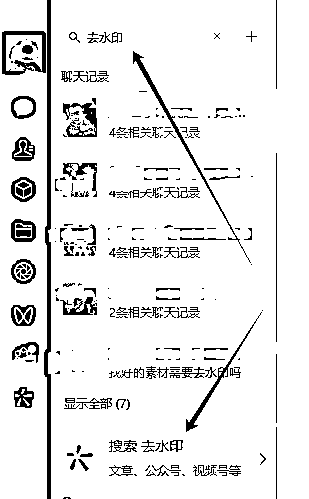

# 视频号如何混剪自然流3个月不死号卖88万

> 来源：[https://z22vw0z745.feishu.cn/docx/Dvxed92XCoEhDrxOA1PcZ9w4nee](https://z22vw0z745.feishu.cn/docx/Dvxed92XCoEhDrxOA1PcZ9w4nee)

2023年下半年，秋冬格外的寒冷，我投入了最后一笔钱干项目，试错，这笔钱是用来结婚的， 但是我全亏完了，老婆也差点走了！创业就是一次又一次的失败！成功可能只是一次偶然！

大家好，我是初孟。距离我上次在这个平台冒泡已经过去了近三年，而这两三年里，我经历了无数次的挑战和尝试。从淘宝店群到抖音店群，再到抖音视频号矩阵，以及拼多多食品和百货无源店群，我总是在失败中寻找着新的机遇和原因。

我的创业之路真是曲折而漫长，充满了挑战和磨练。我经历了风风雨雨，见证了成功的喜悦，也品尝了失败的苦涩。曾经，我体验过疯狂的成功，一度日日豪情万丈，一天消费数万元仿佛是小菜一碟；然而，也有着艰难的时刻，自己的公司多次摇摇欲坠，每一次都像是面临生死的挑战。但即使遭受了巨大的打击，我从未放弃，因为我坚信，总会有东山再起的机会，自我画饼，还要画大饼！

我曾经历了一段贫困的岁月，为了生存，我不得不每天啃着馒头生活，每一分钱都显得珍贵。临近结婚之际，焦虑和无助笼罩在我心头，我不得不向亲朋好友借钱，希望能继续追逐自己的梦想。然而，事与愿违，所借的资金也因为亏损而化为乌有，生活的压力令我不得不依赖对象的美团月付来维持基本生活。

到了23年下半年底，我决定再次挑战自我，尝试通过抖音店铺千川带货。然而，这次的尝试却意外地遭遇了巨大的亏损，我失去了近二十万，吗，没有把品做起来。但即使如此，我并不气馁，因为我相信，失败并不可怕，只要我们愿意重新开始，总会找到新的希望。正如@杉枫大哥所说：“先活下来，活下来才有希望。”一天赚10块钱，一个月就有300，一天赚50，一个月就有1500，只要有活干，就有希望。

干就完了，着手没有什么项目可以干了，那就找一个投资最少的，没有成本的，啥都没了，就有个人，有个手机电脑，开始了我干视频号之路。

什么都不懂，就连注册开播都是问题，慢慢来，每天就一个奔头，慢慢来。

还好有大哥一直在身后帮助指导，交流，一步一步的看着我从0到0.1到0.9到1，直到跑通整个闭环。

来自我和大哥日日夜夜的碎碎念，和我三更半夜的给大哥打卡滴滴滴上班，有兴趣的可以自己去看看

## 言归正传进入正题，视频号三个月混剪不死号卖88万，

## 截止2024年2月29日总成交gmv ：895600

## 单个账号合计营业额卖了 553900 元

以上数据来自本人操作几个不同账号，均为真实数据。

目前刚开年，视频号的流量是异常的恐怖，自然流非常的舒服，玩法很自然，直接上干货实操

# 咱们分为几个方向去了解整个项目操作流程

## 一、选品

## 二、找素材

## 三、拆分素材

## 四、分类素材

## 五、剪辑

## 六、发布

## 七、开播

# 一、选品

电商圈有句俗话说，选品定生死素材决定命运

1.咱们选品的话会根据市场大盘，季节气候来多方面考虑，首先用到的就是蝉妈妈等一类的数据分析平台，看当季爆品，应季品，长期品，然后结合视频号平台人群40-50岁以上人群来考虑，长期去做。现在是开春，当下最爆的是什么 是种子

看抖音的数据不难看出，当下很多爆款，很多爆品，那么我们只需要选一个去做。抖音上是爆款，那么这个人群符合视频号，视频号十有八九也能是爆款

# 二、找素材

1.我们选择好一个品后，就去全网去巴拉各种素材，找各种素材，推荐个浏览器，星愿浏览器，有的电脑可以直接下载，直接找素材，越多素材越好，找就可以了。

2.心愿浏览器不能用的话就这去用电脑上的小程序

电脑上去水印小程序 ，手机通用，也是搜索这个

这个小程序，抖音，快手都能下载无水印视频

# 三、拆分素材

1.  素材准备 处理

1.  画中画素材

1.  扫光素材准备

1.  开始剪辑

1.  剪辑概览： 镜像，字幕重做，四层画中画，贴纸，特效，滤镜，扫光，抖动特效，闪光特效3层

### 1.1素材找好后，检查字幕等 能去除的去除，不能去除的后续这盖住

ps：去字幕工具 https://zenvideo.qq.com/ 里面有去字幕 直接用

### 1.2素材处理

需要用到两个工具

me:链接：https://pan.baidu.com/s/1N4zhzbK_K1u5WIS00Z9q2A提取码：0lq9

me安装需要安装到c盘里面 要不然联动打不开

pr 链接：https://pan.baidu.com/s/10CU4hDhE_GGtN53uXJHBcQ

提取码：0125

下载慢的去买个百度网盘会员，拼多多能买，也可以自己，拼多多开月卡十几块钱，想开也可以开

拼多多链接1https://mobile.yangkeduo.com/goods2.html?refer_share_id=J3pJUxP4GlBWQoOxbu4276UF95AxFWOF&refer_share_channel=copy_link&_oak_share_detail_id=3936785716&_oc_trace_mark=199&pxq_secret_key=EKF3COCAQA25FYZPXVC7GWRIYME76MXYIFB7AG5HVJ2Z3FLIJI5Q&_oak_share_time=1705458619&_wvx=10&_wv=41729&share_uin=XZAJTZETU4JJ5D7AZVFGDEN7DI_GEXDA&_x_query=%E7%99%BE%E5%BA%A6%E7%BD%91%E7%9B%98%E4%BC%9A%E5%91%981%E5%A4%A9%E8%B6%85%E7%BA%A7%E4%BC%9A%E5%91%98&page_from=23&refer_share_uin=XZAJTZETU4JJ5D7AZVFGDEN7DI_GEXDA&goods_id=538423493861&_oak_share_snapshot_num=88&_x_org=2

拼多多链接2 https://mobile.yangkeduo.com/goods.html?refer_share_id=gIax4ubiILVVKesZxg8AdYoTDjt0LZOh&refer_share_channel=copy_link&_oak_share_detail_id=3994341964&_oc_trace_mark=199&pxq_secret_key=EKF3COCAQA25FYZPXVC7GWRIYOLCROYOKVGLL6PIV7ZYNJPRBPEA&_oak_share_time=1705458936&_wvx=10&_wv=41729&share_uin=XZAJTZETU4JJ5D7AZVFGDEN7DI_GEXDA&_x_query=%E7%99%BE%E5%BA%A6%E7%BD%91%E7%9B%98%E4%BC%9A%E5%91%981%E5%A4%A9%E8%B6%85%E7%BA%A7%E4%BC%9A%E5%91%98&page_from=23&refer_share_uin=XZAJTZETU4JJ5D7AZVFGDEN7DI_GEXDA&goods_id=565700668800&_oak_share_snapshot_num=498&_x_org=2

两个软件都安装完成后，开始用pr拆分素材 （一定要处理完成素材后再去使用）

### 1.3 pr操作流程

Pr 新建项目

导入素材

拖进去轨道

右击素材

场景编辑检测

然后选 “从每个检测到的修剪点创建子剪辑素材箱”

新建项目 导入素材

素材导入轨道

右击素材 电脑配置不够不要选那么多素材 几个几个来

选择中间这个 其他的不选择

点完确定后，等待电脑拆分，

拆分好，就会到素材箱里面

选中素材箱子 按键盘 ctrl+m 一起按

就会调出导出按钮， 首先是你me装好了，

点击导出序列 点对列

此时me就联动了，出现这个导出数据就是在导出，等待就行

全部处理完成

点me的 这个类似于 播放的按钮 就可以导出了

# 四、分类素材

## 1.1拆分好的素材 按照镜头分类 ，方便后期剪辑

到这一步 素材就已经处理好了

## 1.2画中画准备，

剪辑每条视频的时候都需要拍摄画中画素材， 可以一次拍长一些，每条 每条

随便拍什么都可以

多拍一些存到文件夹，以备后面剪辑使用方便

## 1.3 整理扫光素材

扫光素材，可以自己做，也可以发你

链接：https://pan.baidu.com/s/1NhuikuthVKWGCrpX77AB0Q

提取码：0125

--来自百度网盘超级会员V2的分享

# 五、剪辑

1.1 开始剪辑 电脑剪辑

剪映建立新的工程文件 把你拆分好的素材 每个文件夹拖进剪映

*   下面开始处理素材，镜像多个片段，适当放大单个片段，不影响整体画面就行

1.字幕重做 ：根据原本视频的音配直接识别字幕 添加的片段音配全部不要

1.  四层画中画，你自己拍的画中画 拖到轨道上 长短调节成视频一致性，透明度修改成 1%

2.贴纸:上下左右 四角添加会动的贴纸 放角落里 不影响整个画面

3.特效 添加4个热门特效

1.  滤镜: 添加4个人物滤镜

1.  扫光 扫光素材 找我要，透明度1

以下是工程文件

剪辑完成后，先自己 浏览一遍，看看效果，有问题及时提出

# 六，发布视频

1.电脑登陆 视频号助手https://channels.weixin.qq.com/platform/statistic/dashboardV3?objetctId=14304953766411245593

点击视频管理，直接上传视频就可以， 标题写不写随意

1.  视频发布时间，如果账号流量稳定，，可以随时发，账号流量不稳定

发布时间 早上4点 10点 15点 18点 几个时间段都可以

1.  手机发布。

安卓手机直接用数据线连接电脑，文件拖入手机就行了， 不要微信传 不要微信传 影响画质

苹果手机发布。电脑下载爱思助手，用数据线连接手机，导入视频 直接发布

用电脑发布，或者手机发布都可以

# 七、视频号开播

## 1准直播，先检查商品

挂好商品，商品id我会提供给你，你也可以自己找

*   直播前放好 3 个视频在草稿箱，如果视频流量一直有在跑，就别补视频，把正在跑的视频播到没有流量再补，一般是开播半小时后短视频 5分钟进来少于 10 人就原封不动再补1个

*   点击直播，阅读协议，可能需要账号本人扫人脸，如果是拿别人实名账号，拿过来之前叫他先扫好，你登录过来后别再次切换设备，不然又要扫一次。

*   开启直播之前，可以做一个透明背景的价格贴图，贴在直播间里

*   能让观众朋友清晰的看到优惠价。

1.  制作透明背景教程

1.  打开创可贴 https://www.chuangkit.com/designtools/designindex

1.  创建一个空白画布， 添加文字，点后点背景 ，透明背景

1.  根据你想做到的品 价格去填写就行 主要突出价格力

页面太大点击调整 调整合适尺寸

注意：不要用会员字体，然后点击导出png格式

## 2.设置直播间标题

视频同款xxx 热卖中(xxx替换为产品名)

## 3.直播分类选-购物-综合电商

## 4.设置直播封面

直播封面建议搞个风景图就好，不要产品或者美女图，以免被系统误判。

## 5.直播样品

肯定要展示直播样品，不然肯定会被封直播，但是这里面也有小窍门

优先找个差不多的东西或者包装就行，机器审核不会那么严格

或者美团，饿了么去买，速度快些

实在没有，就把商品主图打印出来，折成立体的，找老板说要这种视频材质的就行可以在多多买菜/美团优选小程序上下单，一般隔天就到，去自提点自提.

## 6.商品讲解

开始直播后，点击商品，再点商品讲解。这样商品才能单给用户下单.

定要点! 一定要点!一定要点!

以上全部流程操作

# 初孟有话说

项目做起来不是偶然，而是一朝一夕的坚持，项目刚开始的时候，每天3点的闹钟，起来4点发视频，然后开播，不行就休息，下午继续剪辑，夜里继续发视频，总感觉自己做的不够，自己做的不多，即使没有结果也坚持去做，相信会有结果的。很久不写文章，文笔不行，大佬凑合看，不吹嘘自己多么牛逼，也是一步一步取得了一些小小的成绩，再接再厉。

目前还有在做视频号付费直播板块，在播的直播间每天稳定5个左右了，

开年到现在稳定了差不多一个月了，

还在优化流程，目前平台在放量阶段，自然流肯定是最优的选择，

能跑出自然流的账号，肯定要珍惜的，

但是付费流量在这个阶段也是最稳的时候，

占住某个产品的坑位，基本上每天都有消耗，有收益！

下次再给大家分解我的付费流量打法！

欢迎更多的圈友链接，同行交流！