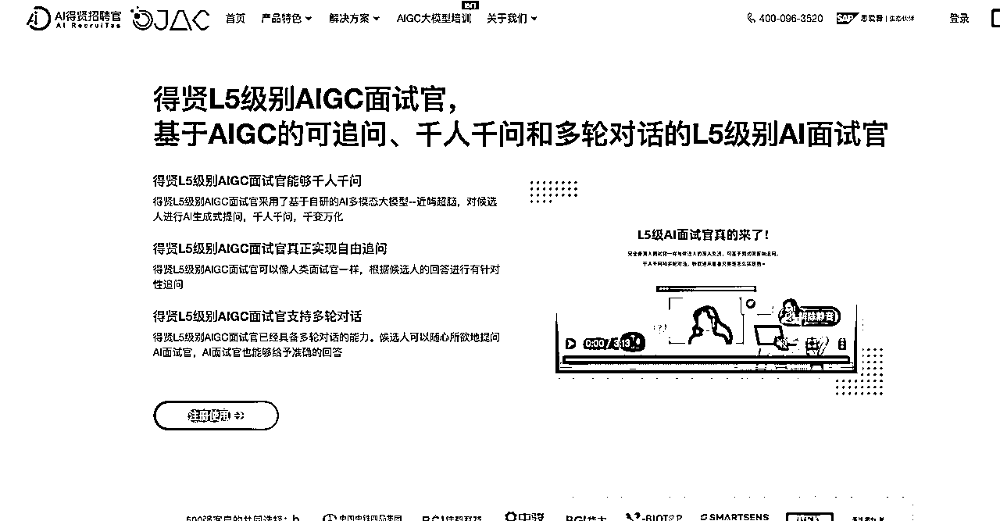
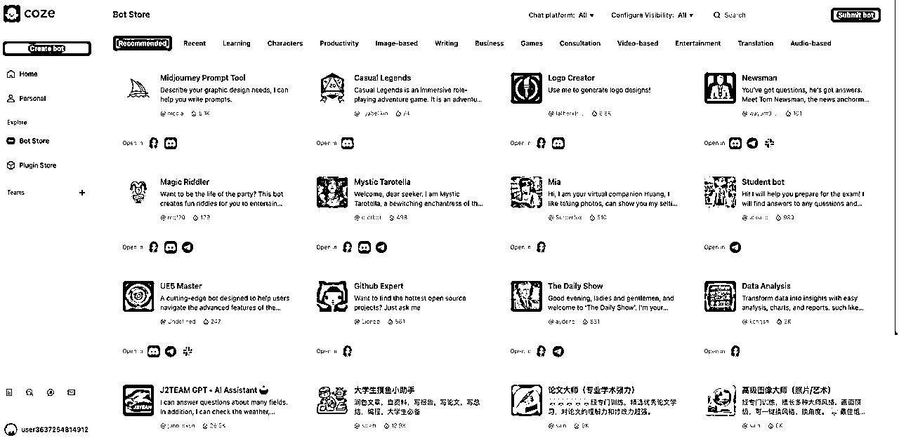

# AI思考丨01 万字长文 发展迅速而又缓慢的AI时代

> 来源：[https://t16jzwqrzjx.feishu.cn/docx/F4IfdHceHo59POxde7LcyrKhnUh](https://t16jzwqrzjx.feishu.cn/docx/F4IfdHceHo59POxde7LcyrKhnUh)

# 前言

在终结者这部电影中，人类成功创造出来强大人工智能“天网”，人们认为这是新时代的开始，然而却是毁灭的开端；

人工智能，人类科技最前沿的领域，一个被人们充满期待又充满恐惧的话题。

ChatGPT的横空出世、Sora对世界的理解能力，无一都在告诉我们：AGI的时代即将来临，它的大门已经向我们打开；人们用飞快的达成AGI时代要来临的共识，投资人在关注基建、普通人在关注使用。

AI不是移动互联网时代从0-1的一次颠覆，它更多是基于已有的生态去做优化，是“+AI”而不是“AI+”。

移动互联网让你可以用手机点外卖，给了你更多的选择；AI时代，或许你可以跟sirl说一句订餐，它自动给你处理好一切；iPad可以让一个几岁的孩子，无需学习的进行使用；但ChatGPT你需要先学会如何写prompt、然后再不断练习，才能够让它给到你高质量的输出。

这是一个充满迷雾的AI的时代，一个大家少有烧钱获客的时代；

我想如果让我把我认知的AI浓缩成几句话，大概是这三句话：AGI的大门打开了、AI优化产品而非创造需求、用好AI需要“研究生”学历。

让我们从行业、产品、上手难度这三个角度来看一看这个有趣的时代吧~～

# 一、行业：AGI的大门打开了

人类创造了文字来表达对世界的理解，每当我们看到“飞流直下三千尺”，我们会想起来下一句是“疑是银河落九天”，我们眼前会有一幅画面徐徐展开，瀑布的雄伟、银河的璀璨。

人通过学习理解世界，通过文字来表达对世界的感受。

在机器人学习算法中，OpenAI使用了Transformer学习架构并且信奉大力出奇迹的方法，他们让AI去学习这个世界，去理解这个事情，然后再通过文字、图片、视频的方式来表达出来。

通过类人脑的学习算法来赋予AI学习能力，让它类人化；

2022年11月30日，OpenAI拿出来了他们的一款王炸产品：ChatGPT，它能够和人类一样进行对话，能够进行各种内容的高质量输出。

ChatGPT理解了文字，Transformer的大力出奇迹又一次验证了这条路线的可行性，就像苹果引领智能手机一样，各种大语言模型如雨后春笋一样冒了出来。

OpenAI，人类AI时代的最前沿跑的最快的探路者。

当引路者出现了，追赶者也纷纷加快了脚步。2023年，生成式AI基础的投资有16.9亿美元，主要用于LLM的开发，AI的基建时代开始了。

各种大模型如雨后春笋一样冒出来，谷歌的Gemini、孪生兄弟的Claude，智谱的GLM-4、月之暗面的Kimi。

智谱的GLM-4、月之暗面的Kimi能够与3.5媲美，与4.0相比尚且需要追赶。

正当大家把GPT4.0当成目标在追赶时，引路者OpenAI有着更大的野心。

一个能够理解世界、支持多模态、超级通用大模型，会让追赶者们惊掉下巴。

24年2月16日，OpenAI在推特上发布了Sora的视频：

对Pika、Runway来说，这是个惊天霹雳的事情。

Sora能够生成60秒的视频，它能够有很好的角色稳定性支持多个角度，它在不依赖物理引擎的基础上能够展示出汽车的灰尘、海边的潮汐。

当大家还在为生成10秒的视频而感到技术突破时，Sora又一次告诉所有人，你们的技术路线看起来效果有点差。

基于Transformer的大力出奇迹，Sora理解了这个世界，也表达了它理解的世界。

AGI奇迹的背后是对算力的高度依赖，是显卡们昼夜加班的结果，是老黄开心的笑脸。

AI时代最赚钱的公司是卖铲子的公司：英伟达。

大模型依赖的不仅仅是训练模型、语料库，还有一个更重要的是算力。

大力出奇迹，大力=很多钱。

2022年OpenAI就花费了4.1亿美金用于计算和数据训练。

周鸿祎老板在AI分享中提到，大模型公司买卡起买量50万块，50万张H100卡的成本就已经到达150亿美金；

通用大模型，买卡是第一道门槛，这是一个巨头的游戏。

谁都想拿下AI时代基建第一的位置，就像安卓和iOS于移动互联网。

巨头们押注超级通用大模型，而新兴的创业者们押注垂类大模型。

或许我们不需要那么大的参数，ChatGPT使用了1760B的训练参数，它可以进行各种问题的回答，但我们只让大模型针对法律行业是不是可以做的小一点。

垂类大模型也如雨后春笋的孕育而生，已经有一些不错的法律类产品可以应用到生活中。

我们可能只需要1-2个通用大模型，但在每一个垂类赛道我们或许都需要几个垂类大模型。

AI一面热火朝天，一面冷冷清清。

在大家卯足全力去做大模型开发的时候，AI赛道的应用显得冷冷清清。

42章经在23年底做了一个复盘，给出了一个观点：AI不能够被称之为一个赛道。

AI看起来有很多机会，但实际上又没有那么多新的机会。

因为AI的基建能力仍然没有达到大家的预期，AGI的大门虽然打开，但是AI有效的应用场景似乎看起来没有那么多。

移动互联网时代一切我们能够想到的场景都可以搬到线上，购物、观影、阅读、外卖、旅行、交流，这些都能够通过移动互联网完成一个质的改变。

随着移动互联网的基建越来越好，流量成本变低、智能手机硬件变好，人们从微信发语音变成了微信视频，抖音短视频也走进了千家万户。

但AI并不是这样，它出现在一个人们的需求已经得到不错的满足的时候。

从0-60分阈值是移动互联网，AI是从60-70分；很多场景的优化，做也行、不做也行。

“利润”成为了AI创业者被问到最多的一个问题，而不再是讲一个美好的故事，让大家为预期买单。

AI的时候人们非常的焦虑，总是担忧AI会不会让自己失去工作，从Revealera发布的岗位（2023年自由职业数据）变化来看，AI时代改变更多的岗位也聚焦在写作、翻译、客服这三个维度，其它反而受影响没有那么大

当人们体验完GPT之后，无一不感慨人工智能的先进，却又很多在体验完后陷入了沉思，我们不知道用AI去做什么，不知道为AI付费的意义到底是什么。

AI在很多场景已经初见成效，在写作、翻译、搜索、客服、陪伴、修图、书籍阅读、音视频转写、绘图、笔记、逝者复活、思维导图这些场景，AI能够给到我们不错的帮助。

# 二、产品：AI优化产品而非创造需求

我们总会说到AI时代到底什么赚钱？

最后得到结论：AI时代最赚钱的是卖课的，然后是卖铲子的，赔钱的是做产品的。

全新的AI产品似乎在盈利上遥遥无期，哄哄模拟器上线后爆火，2000美金的token花掉了，0收入，甚至用户越多赔的越多，最后接入了kimi的api来进行维持。

在AI取的很不错效果的场景，除了一小部分是依赖AI技术进步才能实现（绘图、逝者复活），更多的场景其实都是我们日常使用的场景，只是在AI的赋能之下有了更好的体验。

让我们从下边个例子来看看AI时代产品的优化：

## 2.1 C端产品

### 2.1.1 搜索

如果你不想看广告搜索怎么办？来试试秘塔AI、360AI。

新的搜索和传统搜索的区别是什么呢？

传统搜索：提出问题 - 通过关键词进行网站汇总 - 排布在页面中

AI搜索：提出问题 - 通过关键词进行网站汇总 - 读取网页内容 - 通过AI汇总网页信息 - 展示在页面中

AI可以让你在问题的搜索中整理内容，给你一个问题的回答，让你在一些信息的检索上有了更好的体验，同时可以很好的规避各种广告。

### 2.1.2 翻译

在ChatGPT出来的时候，我经常会去看英文咨询来看AI的进展，因为我的英语水平一般，我总是需要借助谷歌的翻译工具，谷歌的翻译工具总是把LLM翻译成法学硕士。

很多时候我都有点懵逼，我得把他们转成英文仔细看看到底什么是法学硕士，最后我都背过了，翻译成法学硕士=LLM，再加上各种专业名词其实谷歌翻译的千奇百怪，导致我读翻译我总是看不懂他们到底在说什么。

后来我从即刻上学到了用AI读网页内容，然后通过prompt进行直译，这样还可以设置特定词汇的翻译内容。

依赖于大语言模型自身在语言上的优势，它的翻译体验会好出来不少。

当Claude3出来后，我用kimi直译了网站的内容，能够快速的了解英文咨询内容。

AI让我在翻译场景下得到了更好的使用体验。

### 2.1.3 音频、视频内容总结

当你看到长视频、播客音频时，想快速看文本内容时该怎么办？

找一个转译工具，然后把它的内容提取出来，转成文字稿进行阅读。

过去我们通常会用飞书妙记来解决这个问题，我们需要先通过第三方工具下载音频视频，然后再上传到飞书妙记去转译文本，然后读逐字稿，能用就是有点费劲。

大语言模型带来了更加快捷的使用方式，通过RSS链接的订阅和大语言模型对于音视频的解析，你可以直接获得一个文档的结果，而不需要再去下载视频，以通义听悟的播客为例：

一键订阅你想听的播客内容，直接看到文本内容和AI总结。

在bilibili视频上，bilibiliGPT也给出了不错的解决方案，可以生成文本和思维导图来让你更好记录视频内容：

Youtube视频也是如此，可以一键总结内容：

### 2.1.4 照片处理

借助于AI对图像的理解能力，在照片处理上很多需求可以被更简单的满足：

过去我们如果想做一个人像修复、抠图，你需要专业的技术和工具才能实现，而现在只需要上传一张照片，AI会给你处理好，直接给到你满意的结果：

再过一段时间，我们相对一张照片做处理，可能只需要表达想达到的效果，AI来替你实现，而不用去学习PS各种复杂的技术，通过AI就可以轻松的实现。

### 2.1.5 做PPT

PPT简直堪称人人必备的能力，但做好一个PPT又是一个非常头疼的能力，尤其是很多时候其实我们并不需要一个十分精致到100分的PPT，我们只是需要一个60分能用的PPT就行了。

其实用模板改PPT也能得到不错的满足，那AI做PPT有哪些更好的提升呢？

我觉得主要解决了两个问题：PPT大纲助力、自动匹配模板。

以Gamma为例，你只需要描述你想做的PPT内容，它会自动给你生成一个大纲、然后自动匹配合适的模板给你一份PPT，然后你再去做细节的修改。

跟用PPT做模板比，最大的好处就是：省事。

但AI做PPT如果打分的话我觉得是60分，能够满足很多基础场景，但更重要的还是要手敲PPT了。

### 2.1.6 写作助手

如果你经常用笔记软件，Notion AI的辅助会让你在笔记使用时更加高效。

它可以对文本做优化、帮你缩短文本、加长文本，还可以进行总结翻译等各种功能：

比如说我们用Notion AI来加长这段话：

看起来效果还不错，让内容的长度获得了实打实的增加。

Notion AI可以辅助你再记笔记上更高效，但是它不改变你记笔记的核心逻辑。

它是对现有的产品的优化，如果你没有这个诉求，那么用飞书云文档也不比Notion体验差。

### 2.1.7 妙鸭相机

妙鸭是一个高级P图工具，通过收集你的各种照片，然后通过AI技术来给你生成各种照片，对比传统的P图软件，其实要非说很大的区别，就是给你换了个场景和打扮，高端P图技术。

妙鸭刚刚火起来的时候是拍写真功能，现在已经支持合照、创业照、证件照等各种场景的诉求了。

妙鸭火的也快，落得也快，人们为了尝鲜使用这款产品，但没有办法用妙鸭替代传统的修图场景，妙鸭拥有的是基于AI更下一个修图场景，来得也快去得也快。

## 2.2 B端产品

### 2.2.1 RPA+AI

RPA是一个用于电脑上的自动化操作流程，你设置好后系统会按照你的流程往下去重复做，但这个场景里最大问题是RPA设置的成本实在是有点高，你要学习RPA工具，然后自己再不断配置实验去进行使用：

看到RPA配置的这些路径，就可以看到学习成本不是一般的高，需要自己设计流程去拟合电脑操作。

实在智能用AI做了产品上的优化，用户只需要去自己展示整个流程，然后AI来结合RPA工具生成整个流程和链路，然后人再根据生成的链路进行调整，大大降低了RPA工具的使用门槛。

### 2.2.2 AI面试官

近屿智能在企业服务SaaS的基础上追加了AI面试，能够解放一部分基础的面试的人力，这个产品我觉得对于基础岗位的初筛可能能够获得一个还不错的结果，通过10-20分钟快速的获得一个人的基础信息，然后为后续的面试做参考。

它其实是一个数字人+LLM合力去完成的面试，如果后续结合上企业的用人要求，那么AI其实能够在第一轮基础面试中就给到企业一个对应的分值，对于校招、实习生招聘这种初筛场景估计有不错的结果。

### 2.2.3 AI智能合同审查助手

不知道大家有没有签过一份合同，在企业里签合同的流程大概是这样子的：

1.  根据业务需求找合同模板，然后形成一份合同

1.  找公司律师进行合同审核

1.  找合作公司进行沟通

1.  根据沟通修改后找律师审核

1.  律师审核后合作公司律师审核

1.  重复3-5的环节直至合同签订完毕

快点不怎么改的合同一个礼拜就能搞定，如果合同慢一点拖一点3个月都搞不定；在审核中比较花费时间的是律师要不断比对前后两个版本合同中的内容，不能有遗漏。

幂律智能在已有的B端合同的需求下，增加AI能够让更多场景下得到更好的满足；AI可以在前后文档对比、内容总结起到不错的作用，来让整个B端合同审核流程效率变的更高。

## 2.3 拆书产品AI赋能思考

我列举的这些AI场景其实是我们生活中比较能够用到的高频场景，我们可以看到AI对这些场景做了很多的优化，我们本来存在的诉求，通过AI能够更快捷更高质量的解决掉。

但这些需求场景本身就存在，AI是给解决方案提供了优化的空间。

我拿我自己做过的听书音频产品来举例子，这款产品我是完全0-1及1-N做到10万日活的，整体链路打磨了无数次。

听书音频产品是将一本书拆成10分钟的音频解读，然后基于小程序和APP让用户来听书；我们的老用户月留存能够做到60%+，100个人里这个月听完一本书下个月会再来听完一本书。

在我们的书籍量到达了1000本书籍，那这个时候用户其实找书就成了一个比较难得问题，我们只能做后台打标签，内容运营通过标签打包成一个书单的方式来聚合书籍，但这种方式其实不是很好的解决方案。

有点太死板，也太依赖内容运营的主观判断。

通过用户的搜索来给它一套预期的内容，其实我们一直想做这个事情，但是过去的技术能力其实是不支持的。

过去用户搜索“财商”，系统会根据财商关键词匹配给用户推送书和书单，是一个匹配机制。

但如果我们用上AI，用户输入财商，我们在搜索上可以用AI去检索各种书的拆书稿，然后直接聚合一个推荐书单给到用户，它会比我们的传统搜索匹配度好上很多。

但这也是场景优化而且创造需求，这个场景优化听起来很不错，但也最多把我们的产品从60%留存率做到61%。

它听起来还不错，但是并不核心。

我觉得在拆书稿环节可能作用比较大，我们当时的流程是：内容人员拆书、专业录音师来录音，我感觉在拆书环节AI的帮助会比较大。

在拆书稿的环节，如果我们通过使用AI进行辅助拆解，应该能够让我们的单日稿件数量增长一倍；同时拆书稿可以自动生成标签，在上架的时候成本也会低很多。

但其实这块也是效率的局部增长，我们核心还是依赖资深内容去做书籍的判断，AI能够辅助但是不能取代。

至于为什么不用Chatbot，我们当时把用户反馈提的优先级比较高，产品经理会在客服群里去做客服解答各种问题，所以对应的用户难受的问题基本上我们都会在规划中解决。

在日活10万的时候基本上每周客服群的问题也就1-2个，还更多是使用的问题。

对于我们这种场景来说Chatbot客服是作用不大的。

可能Chatbot做学习导师是一个可行的思路，来帮助人定制化学习路径，通过企微进行沟通交流促活等行为。

从这个维度来看AI能够做不少的事情，但是这些事情还是基于我已有的业务场景去做优化，能够锦上添花。

## 2.4 AI产品端的思考

### 2.4.1 C端AI仍然重在尝鲜

现在AI能够写个论文，能够写代码，能够跟你进行对话，能够帮你分析各种事情，听上去AI是很智能。

那么问题来了？它干的这些事情对于你来说有多少是不可或缺的，有多少能够成为你的付费理由？

我们都常说AI要成为人们的工作助手，不会使用AI的人都会被逐渐淘汰掉。

但实际上残酷的现实是：对于大多数人来说，学会基础使用AI带来不了什么太好的工作提效。

我最近在帮圈友解决深度内容调研的需求；

需要用Perplexity的“文献搜索”功能完成相关词检索，比如说“人工智能技术发展”

基于给出的文献，查看文献是否是想调研的内容，然后进行文献下载。

然后用Kimi读取PDF来进行文献的总结。

这个流程肯定是能提升效率的，但是看这个流程门槛也太高了。

还需要等到GPTs、coze这种类型的产品更加丰富起来，有更多场景能够被直接用一个工作流解决。

人们强依赖AI提效的时候估计才会来临。

AI对话是个很不错的场景，从哄哄模拟器的活跃我们就能够看到大家对这类产品还挺喜欢的。

但是就是体验一次也就没下文了，后续没啥可以继续用的场景。

感情陪伴我觉得要打个问号？人需要的是认可和陪伴，AI还是有点冷冰冰。

AI绘图和AI视频软件就更不用说了，甚至说从工作流上来讲AI绘图和视频软件都不如买个“稿定设计”好用一点。

尝鲜仍然是一段时间的主旋律，我觉得它的转变更多依赖于大模型基建的进步，当AI的能力再提升、算力成本再度下降，GPTs组合的场景能够解决很多问题。

AI才会变成大多数人身边必备的一员。

### 2.4.2 需求是没有变过的，变得只有解决方案

AI出来之后，我非常兴奋，从去年4月份开始，我觉得很多场景都可以利用AI来变革一下，都有价值去做。

我自己去体验了AI面试、AI简历投递、AI提取公众号文章、Supabase+GPT做索引等等各种产品，反正看上去都很有意思，于是我用了这些需求之后我就开始琢磨，用AI做知识库助手，用AI去提炼各种文章的内容。

到了算账的环节一看，好像不是很合适，token的消耗成本太贵了，需求的满足效果太一般了，我好像走到了一个岔路口，我就开始反思，如果没有AI，那我这个需求真的存在吗？能不能用别的软件满足呢？

最后发现都是伪需求，我其实压根就没有多大的诉求，我只是觉得这个事情能够用AI去做很有意思。

但实际上这些需求，我压根不会为其买单，因为对我来说就是尝鲜，而非有效的应用。

于是我去研究answer AI、monica、notion AI这些做的还不错的产品，其实你会发现，他们的场景一直都存在，只不过AI来了，让这些场景下获得了更好的提升。

Monica不带AI功能就是标签记录功能，带了AI就可以总结内容、检索回答，但再往上一层其实是用户在使用浏览器有记录内容或者查询内容的需求。

需求一直都存在，只不过之前可能是遇到问题需要谷歌搜索，现在就是monica一键搜索，流程变得简短了，用户体验变得更舒服了。

我觉得从C端维度来看什么样是一个好的AI产品应用的场景：

在没有AI的时候能够很好满足用户，有了AI之后能够对某一个模块进行效果提升。

AI会随着大模型能力提升一点点重构整个产品，但现在不会发生任何质变。

产品也不要指望上了AI之后立马数据就变得好看，伪需求永远是自嗨。

### 2.4.3 AI在一步步悄无声息的改变世界

今天看到一组这样的数据：美图披露2023年业绩总收入27亿元，同比增长29.3%。总收入与净利润增长主要得益于AI推动主营业务收入增长。美图用户每天处理数亿份图片和视频，约83%都用到了泛AI功能。

AI在悄无声息的改变一个又一个产品，让我们生活一点点变的更方便。

它并不是像之前智能手机时代的产品一样，都是之前不存在过的，一个全新的产品，AI更多的是我们已经见过的很多个产品，用AI去优化、重构它的内核来给我们更好的体验。

在不久的将来，或许是明天，我们会在常用的各种APP里发现AI的踪迹，他们可以帮助你总结书籍内容、可以搜索值得购买的产品，手机AI助手可以帮你记录会议、帮你一键叫车。

# 三、上手难度：用好AI需要“研究生”学历

AI在中美有两大巨头，OpenAI和李一舟老师，这是个让人哭笑不得的事情。

一部分无奈于LLM追赶不上，一部分无奈于做技术不如卖课赚得多。

但从另一个角度上来看这个问题：为什么AI需要培训？

如果AI和iPad一样，6岁小孩子都可以使用的很明白，那根本就没有培训需求；但现在的AI其实跟PS一样，都是一个需要深度学习才能用好的工具。

这也从侧面说明了一个事情，AI的用好门槛还是非常高的。

从0基础小白到用好AI能够给自己进行一些提效需要过几关？

第一关：选择对的工具；第二关：学会提示词。

### 3.1 选择对的工具

AI这个赛道还挺有意思的是大家都说我的产品特别厉害，随手一搜国产AI，出来一大堆。如果我想用AI读一本书？我到底该用什么工具呢？

文心一言、智普、豆包、套壳GPT、kimi、星火大模型？

反正一堆产品摆在大家的面前。

有的免费支持多模态、有的能够读超长文、有的啥都干不了、有的就是套壳让你花钱的。

怎么选呢？谁能够跟GPT3.5相媲美呢？

我们在航海中其实发现，大家如果用不了ChatGPT之后其实是一个懵逼的状态。

其实连我之前天天关注大模型我也是一个懵逼的状态；最后群策群力之下大家优先选了kimi、智谱来做用不了GPT的平替。

一个支持超长文本的阅读可以联网，一个是支持多模态功能齐全。

有很多对AI了如指掌的朋友可能看到这里哭笑不得，觉得这也太离谱了。

然而现实确实是这样的，这个世界的参差足够的大，尤其在AI上表现的淋漓尽致。

最头部在关注世界模型如何搭建、搞钱前端的在用AI做代写业务，还有很多普通用户连用什么工具都不知道。

当大家选了一个自己觉得不错的工具之后就要进入第二关，学会写提示词。

### 3.2 学会写提示词

我们总听说ChatGPT无所不能，能够给你写出非常好的脚本、能够帮你写出提示词，让你轻易做到你之前做不到的事情，每个人都可以成为超级个体，赶紧来学习AI吧，要么你就被淘汰了。

真相真的是这样的吗？

ChatGPT是能够写出很多很棒的内容，这句话没有任何问题。

但是少加了一个前提，你必须足够懂这些专业的内容。

90分的程序员学好用GPT能够写出90分的程序，90分的抖音编导能够用GPT创作出90分的内容。

但如果你是个0分的程序员水平，你没法创造出90分的内容啊。

你脑子空空，midjourney再厉害也画不出来震惊四座的作品呀。

我给学员改公众号律令文的提示词能够让他写出10万+的内容，但是我自己写公众号爆文提示词写不出来，为什么呢？

因为我压根就不懂公众号爆文的结构，你给我一个现成的，我能够看到你这套逻辑下的问题在哪里。

但你让我自己写，真不会，没有写过。

那不会写提示词就用不好AI了吗？

可以用别人封装好的Chatbot，比如GPTs、比如poe、比如coze里各种bot。

这或许是普通用户低成本用好AI的一个解法。

当我们决定要自己努力写提示词的时候，考验又来了，提示词考验的是你自身思维逻辑。

高质量的提示词需要你输入给AI更细的需求、更缜密的流程。

在这两点上做不好，你希望AI给你输出2000字的文章，它分分钟给你500字了事。

根据反馈不断调优提示词，最后得到一个自己满意的结果。

那这时候可能会有朋友说，套模板可以减轻一些难度吗？

可以减轻，但是想写好还得你脑中知道自己需要什么。

我在写提示词常用的BRTR模板和langgpt模板能够相对来说减轻一些写提示词的难度，可以照着葫芦画瓢，但是最终落脚点是思维方式。

### 3.3 总结

用好AI需要“研究生”学历，这或许也就是除了焦虑之外为什么培训是个刚需存在的原因了。

因为它的门槛并没有大家想象中的那么低，用好它需要付出很多心血。

当我在带了一期航海之后再回过头来看GPTs和POE，突然发现其实从使用门槛上来说，这两个Chatbot载体的社区或许是一个很好的降低门槛的解法。

虽然现在GPTs依然受制于算力成本等诸多隐私没有向下开放使用，但我相信再过一段时间，或许我们打开AI之后，普通人不需要复杂学习，也可以用AI产品对自己产生实打实的帮助。

# 四、衍生思考：Chatbot社区盈利与实用的解法

我自己做过付费订阅社区，几十个优秀创作者写文章，几十万个学员在那买文章。

我们的优秀创作者和学员都是一样的课程一样的老师教出来的，他们都知道怎么写企业分析文章，但最终能够落笔写出来的寥寥无几，反而能看明白是个基本功。

二八法则在哪里都适用，AI赛道也不例外。

2%用AI非常好的同学可以自己做Chatbot，来让另外98%的人用上自己写不出来的提示词。

GPTs、Poe、Coze，它们都在做这样的事情。

那其实只要解决了头部2%的激励问题，其实就可以让更多好用的Chatbot被普通用到，技术可以去普惠每一个人。

从GPTs来看，目前大模型的算力成本依旧还是很高，如果把Chatbot做更多的开源，大家每个人都可以用GPTs去阅读书籍，去支持多模态问题，那么OpenAI会成为一只被薅突羊毛的羊。

大模型的基础能力和算力成本是AI普惠化的第一道门槛。

我最近看了很多大家使用AI工具的诉求，其中有一些需求复杂到大概需要把5-6个工具结藕在一起才能够高效的运行，少了一个都运转不了。

我觉得从这个体验上来看Coze的拆件和工作流对于创作者来讲是很友好的，可以解决一些复杂的问题。

但实际体验下来，并不太好，一个是插件支持的不是很多，现在支持的这些有的时候不如直接用市面上免费的功能更省事；另一部分是Coze提供的GPT4.0功能也不齐全，多模态和文件识别完全不支持。

期待随着基建能力的提升，会出现更多好用的Chatbot社区。

我在过去高频使用kimi的场景中，有一个场景是翻译外文网站，如果kimi推出Chatbot，然后我把这个prompt和流程进行设计，能够直接翻译外文网站，然后生成一个PDF文件，那么是不是这样可以变成一个可以卖钱的Chatbot。

在翻译场景下Chatbot需要能够设置专业的翻译词汇，能够去直接转译外文文章；如果这些需求我都满足的很好，那这个Chatbot是不是能够卖5-10块钱？

如果用户有海量的外文翻译诉求，那对他来说，这个场景和这个钱其实是划算的。

那么更多这样的精准化的场景，更多的双边交互，一个基于Chatbot的社区就可以自运转起来；创作者也有动力把自己有价值的产品拿出来给用户，用户也能够更好的低成本去使用AI。

为什么不用PGC免费供给的形式，而是用UGC双边供应的形式；PGC可以在前期测试的时候和早期招募UGC的时候少量使用，PGC有自身视角的局限性和数量约束性，基于这两点，是没有办法构建一个足够大的双边供给平台的。

以上是我对Chatbot的一些思考，期待各家大模型公司带来更多有意思的产品~

# 五、结语

我想这篇文章也是对我去年10月份开始深度钻研AI的一个总结吧，虽然之前在工作中我们已经用通义进行视频剪辑的提效，用GPT做很多的辅助思考，但是没有去系统性的看AI这个赛道。

学习提示词的写法、去用AI工具为日常提效，做一个基础的工具汇总网站，学习LLM的逻辑，分析市面上的产品。

12月份去当生财有术的GPT航海教练，带着大家去了解AI、去使用AI，也是个十分有意思的事情。

我有的时候会在想AI时代我能够去做点什么，在产品上有哪些值得去做的事情。

选来选去大概还是教育产品、工具产品这两个方面对我来说收获最多。

AI+万物的时代恐怕还要慢慢的到来，那先从用AI迭代一个小的需求点开始做起吧～

也希望看到这篇文章的你觉得花费的时间值得，可以让你在AI时代的焦虑稍微减弱。

借用《一点就到家》电影里我很喜欢的一句话做结尾吧：流水不争先，争的是滔滔不绝～

# 🌟 知识库内容汇总