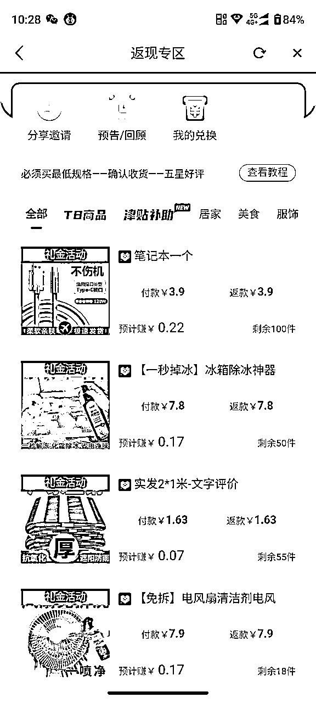
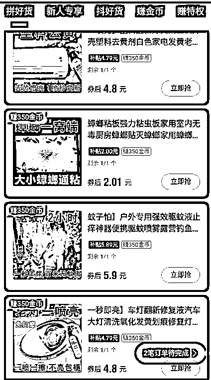
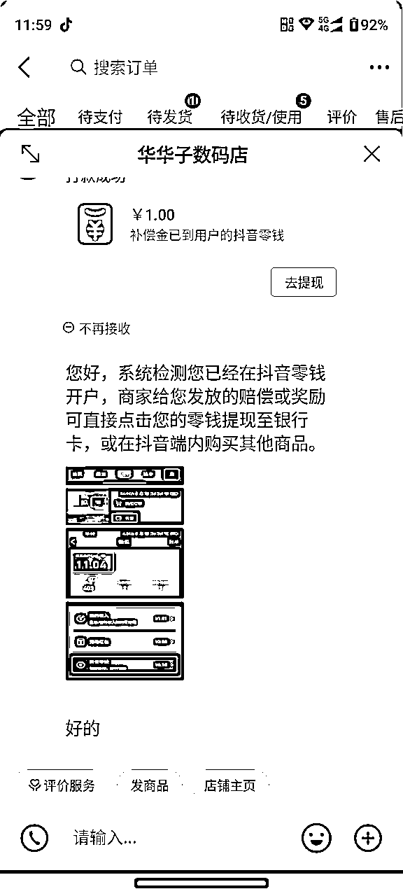
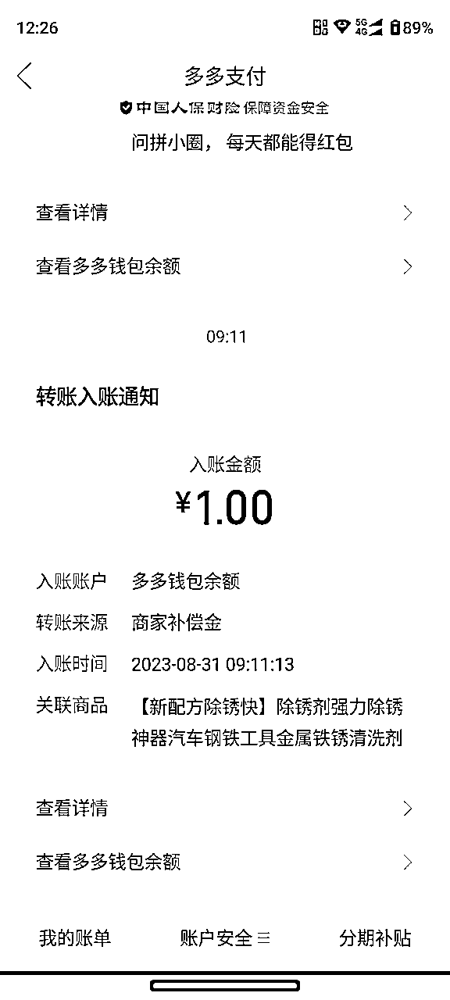
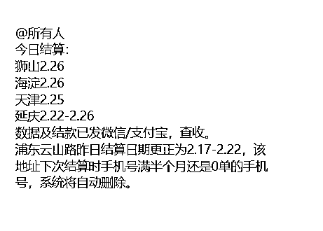

# 快递掘金项目手册

> 来源：[https://rw1cdruyfpe.feishu.cn/docx/FHowddNA2oxpTJxn3QKcsuBmnvf](https://rw1cdruyfpe.feishu.cn/docx/FHowddNA2oxpTJxn3QKcsuBmnvf)

# 一、项目介绍

## 1、项目原理与利润

原理

项目是通过在抖音、拼多多、淘宝、零元购平台上面购买0.01-0.3元的商品，商品平均成本一单0.01~0.3左右，一个号平均一天是30-50单左右（养好的号）。多号就是批量操作，是纯绿色项目。

①这个项目，我们团队已经对接合作了快递驿站，派送员派送一个单子或者驿站收一个单就会有一个派费。

②派费价格取决于所在的城市，不同的城市每单价格不一样，结算周期也不一样。

③目前我们对接的是上海地区，北京地区，利润比其他城市高些。

利润

1.快递派费利润

我们对接的快递派费，一单是给到大家0.6元，也就是一单平均有大概3毛左右利润。

举例子：一个正常活跃用户，一天一个账号30+单，做3个账号，一天利润30块，一个月900+

2.0元购返佣利润

我们对接的很多平台有些产品都是0元购，且带有佣金，等收货后还可以赚少量佣金收入。

3.好评返现利润

一些商家在收货后给他好评，会有好评返现的利润。

4.团队长利润

团队长利润在0.1-0.2/单。

举例子：一个团队长，1千个正常用户，一个账号每天下30单，团队长利润最少=1000*30*0.1=3000润

如果每个人每天下100单，利润破万！！！

## 2、结算周期问题

结算周期要看快递站点，正常是一周结算一次，比如，你3.1号到货签收的订单，会在3.8号结算，快递站点不可能为了几十或者几百件单独安排结算，目前合伙人手下有团队，量大概一天三十万件一个站点，也没有达到日结的程度，大家可以放心，这个结算到时候会直接从站点后台拉明细给大家结算。

【如果出现吞单怎么办？】一般不会吞单，特殊情况遇到后，可以提供具体快递单号+手机号，找我们核对补发。

## 3、如何做

1.建档。

这边对接的快递站点，需要帮你建立专属档案，提供手机号给对接人，然后结算的时候通过你的手机号在后台拉取自己的订单

2.建档后，会邀请你进2个群：1个是交流发单群，1个结算群

发单群：全网搜集低价单链接或者渠道，到群里，直接按群里链接去拍

结算群：每天每个人到货多少单，结算多少钱，在群里进行。

## 4、团队政策与招商资料

团队有专门的素材号，可以同步朋友圈，对接可以找各自推荐人。

日单量〉500单，0.6元/单回收价结算

日单量〉1000单，0.65元/单回收价结算

日单量〉5000单，0.7元/单回收价结算

日单量〉10000单，0.75元/单回收价结算

日单量〉20000单，0.8/单回收价结算

# 二、操作流程

## 第一步：建档报备审核+进项目群（交流发单群+结算群）

向管理员提供下单账号收货名字（用微信昵称）+电话+支付宝账号+支付宝名字，用于建档+后期结算，一定填对，避免影响后期结算，我们默认帮审核三个地区站点。

格式如下：

微信昵称+手机号+支付宝账号+支付宝SM名字

如：小陀螺+13838385438+123456@qq.com+张飞

号码报备注意事项：

如果遇到某个站点审核不通过，是因为你提供的手机号尾号之前和别人重复冲突，这个时候，可以换一个手机号，或者换成虚拟的号（自己编个假的，能记住就行）

首选自用手机号，如果自用手机后4位重复，可以使用199、162、140、165、167、虚拟号段开头的电话

例如：199××××××× 尾号随意编辑，最后要拨打确认此号码是空号才可以。

审核通过后的号码，就可以用当前地址了。

找管理员进群（交流发单群+结算群）

1.交流发单群（每天不定时更新低价链接以及0元购平台）

2.结算群（结算明细会在群里发）

## 第二步：添加指定的拍单地址

审核通过的号码，去各大下单平台（拼多多、淘宝、京东、抖音等），添加收货信息，名字电话一定用你审核通过的那个，地址对应下方地址，账号多的，地址最后面稍微修改一下。

地址找项目对接人获取。

## 第三步：把各个平台的号码保护功能关闭

都在各平台设置里，有一个隐私设置，号码保护关闭，如果打开，你到货的快递手机号会修改成虚拟号码，和自己报备的不一样，这样后台统计不到你的订单，影响结算。

## 第四步：开始下单

我们的利润=管理元给你的派费价格-下单实际成本，有利润就可以下单。

1.低价产品链接下单

直接复制链接去平台下单，可以自找，或者看发单群不定时发放低价链接

2.免单0元购平台下单

付多少本金到货平台都会返多少，相当于快递派费全赚，具体可看如下视频，举其中一个例子，其他平台类似。

## 第五步：签收结算

我们统一每周结算一次，比如3.1日物流显示签收的订单，我们在3.9日统一结算给大家，同理，3.10号结算3.2日的订单，依次类推。如果收到有问题，可以联系群管理员。

