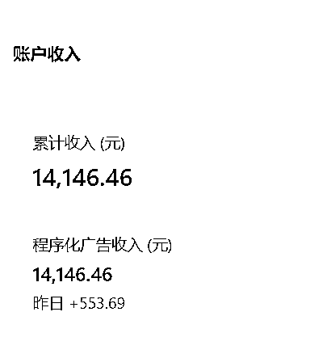
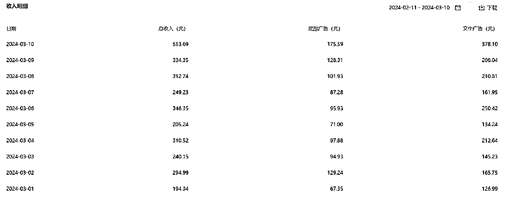

# 3个月用AI做自媒体，出了8篇十万加，每天几百的收益，我是这样做到的

> 来源：[https://balfcirt91j.feishu.cn/docx/HZ97doS1ootZBZxDkORcy2Tcnhc](https://balfcirt91j.feishu.cn/docx/HZ97doS1ootZBZxDkORcy2Tcnhc)

大家好，我今年35岁，目前是在从事自媒体代运营行业，

我通过菜菜老师的AI营销100节课中的公众号爆文改写，前后十个号，

一共出了8篇十万加文章，

最高一篇的流量有70多万，这8篇共计收益有2万元。

不过大家也知道，流量号不太稳定，不过我目前有一个账号还可以，

持续了3个月，大约每天阅读量5W左右，收益300元。

我的经历很特殊，我从读书的时候就开始生病了，强直性脊柱炎。

后来上班也是因为身体不好就离职了，

目前是在家边养病边做自媒体的状态。

我是在去年12月开始接触ChatGPT的，在这之前其实我还使用过文心一言和讯飞等等，

但是感觉人工智障。

通过另外一位博主介绍，认识了菜菜老师，

了解到她比较擅长用AI创作内容，

而且她的Ai营销100节课程当中正好有公众号文章改写的场景，于是就下单买了。

比较好笑的是，我当时连命令在哪里输入都不知道，

不过通过一步步的实操和老师的帮助，我大概在一个月后爆了第一篇十万加。

这里说下我爆文的方法，我会建立矩阵号，

然后再去相应的领域找对标账号，并且找到爆文，

再把它们输入洗稿的工具中，进行批量化生产。

在这个过程中，你可能会问，质量肯定不太行是吧？

洗稿工具洗出来可能没办法保证原创。

没关系，在我这里，账号是消耗品，我会去博一个概率，

如果有跑出来，能进流量池的账号，我就开始进行精细化洗稿，

而这里精细化洗稿是指，我会找2篇爆款，用菜菜老师的ChatGPT改写命令去操作，

这个方法也是课程里学习的，既有方法的阐述，又有完整命令，完全就是保姆型的操作。

用这种方法弄出来的文章，原创度比较高，非常安全。

之前用机器弄的稿可能会被判查重违规，但用老师的命令没有违规过。

其实在买了菜菜老师课程的同时，我还买了其他老师的课，一共花了4万元。

对比了下，在内容详细度方面，菜菜的更胜一筹，讲得很清楚。

后来我一个朋友，也是做此方面的，他看到我做得还可以，于是向我请教，

我把菜菜老师的方法教给他，还把命令发给他，他是做中老年赛道的，有40多个账号，

结果不教还好，一教，他把手下三个人开掉了。

原来自媒体团队有6个人，现在是3个人，每个月帮他节省了1万多。

我也是哭笑不得。

再给大家透露一个我们爆文行业的天花板，我也是惊呆了。

一个800万粉丝的账号，每个月流量收入是15万。

不过还好，他们没有用ChatGPT，他们还不会用，都是人工写，

之前也写过，但是说是人工智障，他们不会方法。

而我会这个方法，我期待有一天能达到他们那个水平。

不过也要提醒下大家，公众号流量主的领域并不稳定。

希望大家还是能多学习一些其他的场景，多掌握AI写作的技术，

在这个时代，能凭借这项能力，找到有更多的机会。

菜菜的提醒：

虽然这位同学在AI方面是0基础开始，但是他确实之前做了好多年的自媒体，

有一定积累，并不是完全从0开始。

如果你自身的能力只有40分，AI并不能把你的能力变成90分。

能力还欠缺的，先打造能力，有一定能力，想用AI提效起飞的，就去研究。