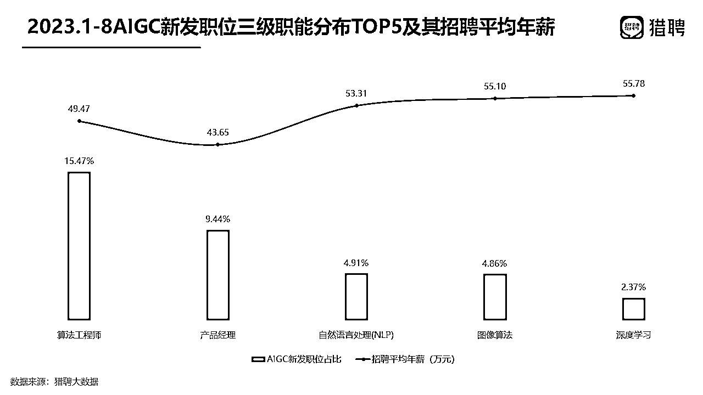
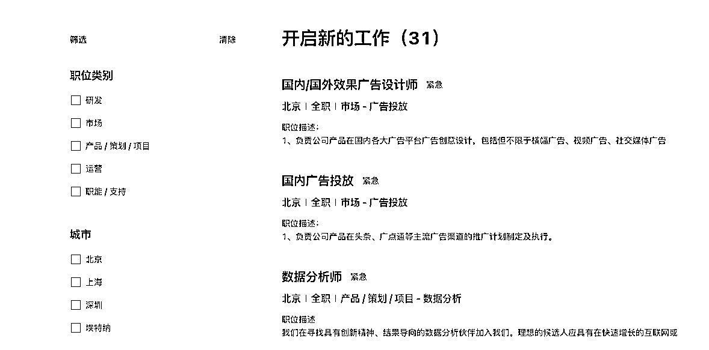
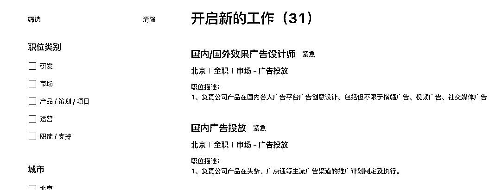
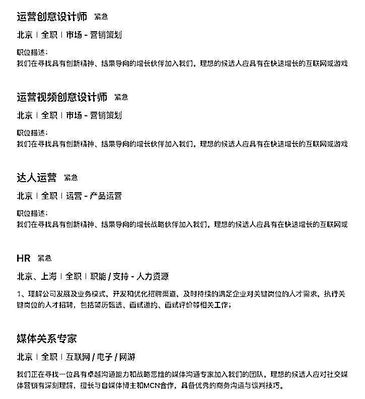
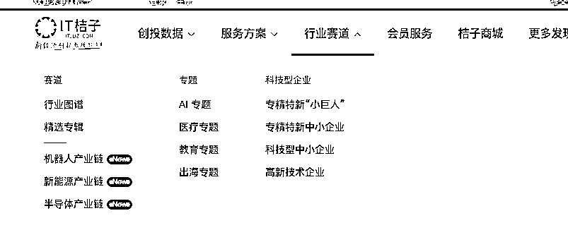
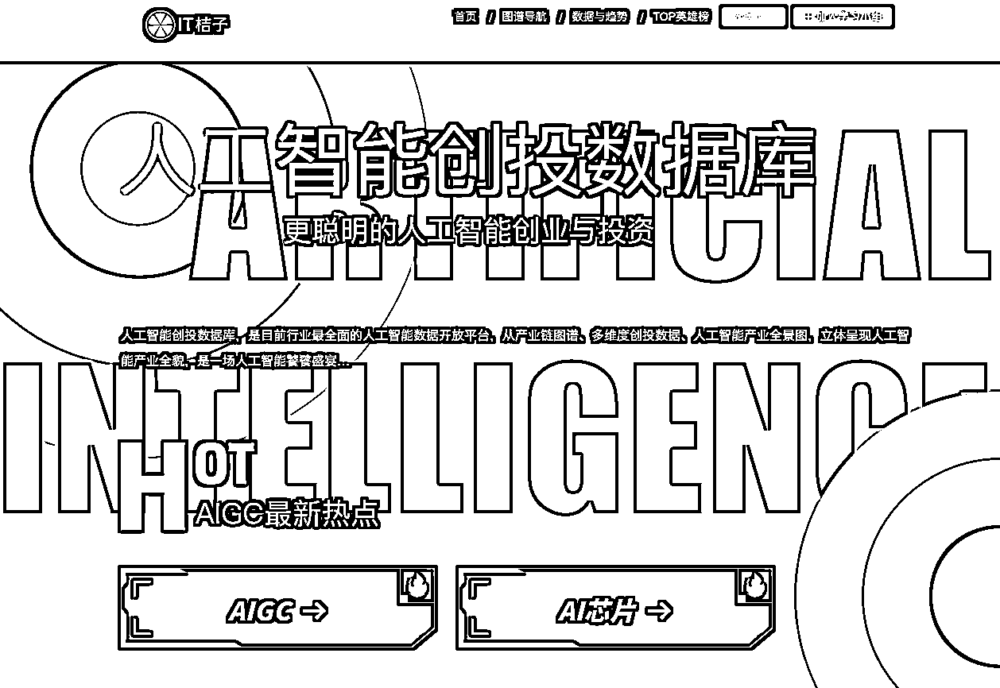
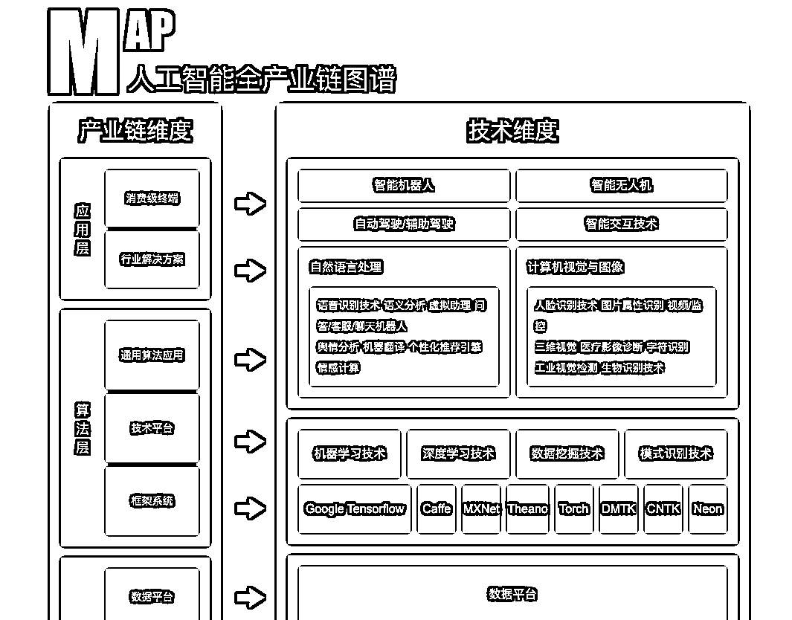
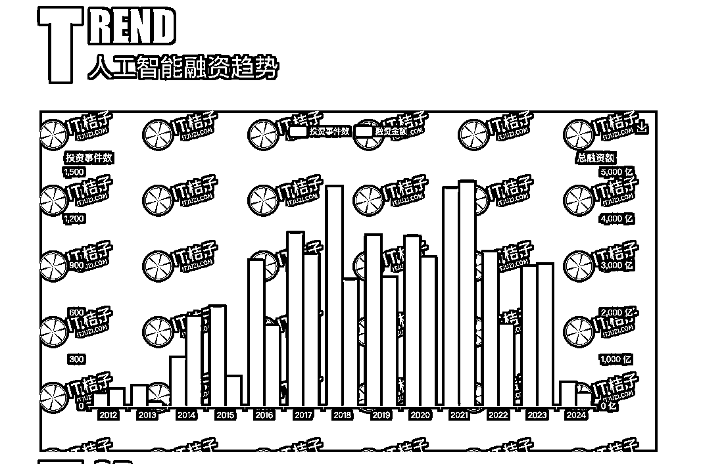
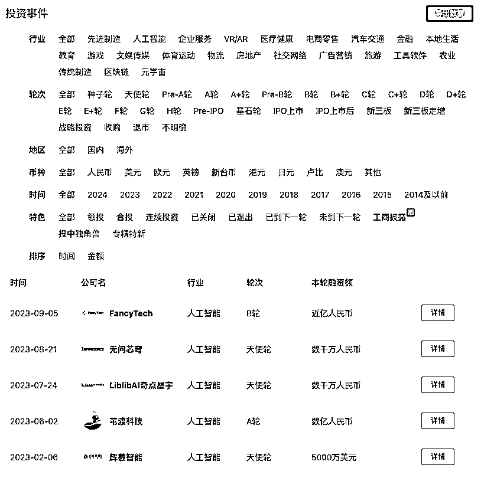
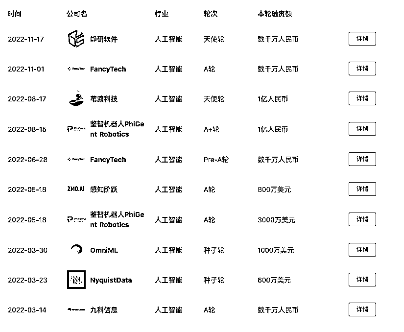

# 杨植麟VS朱啸虎：普通人入局AI，他们给你的10个避坑指南！

> 来源：[https://vliajwma3m.feishu.cn/docx/IPZedVWHPo0s7Hx0afPc7rwDn2g](https://vliajwma3m.feishu.cn/docx/IPZedVWHPo0s7Hx0afPc7rwDn2g)

你是坚定的AGI信仰者，还是坚定的市场导向？

最近一周，腾讯新闻对杨植麟和朱啸虎专访的两篇文章，引起了很大的争议。

AI圈子里也是吵得不可开交。文章很长，我用Kimichat总结了一下，方便你快速抓住重点。

### 杨植麟的观点和论据：

1.  对AGI的信仰：杨植麟坚定地信仰AGI（通用人工智能），并认为大模型公司应该追求技术突破，而不是仅仅关注短期的商业化。

1.  技术驱动：他强调技术理想主义，认为技术突破是推动公司发展的核心，而不是短期的市场需求。

1.  长期投资：杨植麟认为，大模型公司需要长期的资本投入来实现技术进步，而不是追求快速的商业回报。

1.  产品/市场契合（PMF）：他认为，找到PMF并不是短期内可以实现的，而是需要长期的研发和市场验证。

### 朱啸虎的观点和论据：

1.  市场导向：朱啸虎更倾向于市场导向，他认为大模型公司应该专注于能够快速商业化的应用，而不是长期的研发。

1.  现实主义：他强调现实主义，认为在当前的资本环境下，大模型公司需要找到可行的商业模式，而不是烧钱追求技术理想。

1.  开源模型：朱啸虎认为开源模型将缩小与闭源模型的差距，因此投资于大模型公司的风险较高。

1.  PMF的重要性：他认为找到PMF是关键，而且这与投资人数和成本无关，而是取决于是否能找到正确的市场定位。

市场上关于两人的评价非常多，公说公有理，婆说婆有理。我无心再过多赘述。

今天我想从一个新的角度来思考这个问题：

假设你是普通人，想要入局AI，想要求职or创业，你应该怎么选择？

怎么结合他们两个人的观点，提升你的决策水平？

如何评估风险和回报？

选行业就是选趋势，行业>公司>岗位，行业>公司>岗位，行业>公司>岗位，行业>公司>岗位！

你不要觉得行业调研不重要，以为只要那些投资人上千万、上亿的才叫调研，我们依然需要，某种程度上，我们不仅是自己的CEO，更是自己的投资人。

我们投入的是未来至少3年、5年、10年的青春岁月，这折合成人民币得多少钱？

# 一、什么人适合加入大模型公司？

1.  技术前沿：如果你对AI的核心技术和算法有浓厚兴趣，希望参与到最前沿的技术研究和开发中，大模型公司可能是更好的选择。

1.  长期发展：大模型公司往往有更远大的技术愿景，如果你愿意投入时间和精力等待技术成熟和商业化，这可能是一个不错的选择。

1.  跨领域机会：大模型公司可能提供跨领域的工作机会，你可以在多个项目中发挥作用，这有助于你建立更广泛的技能和经验。

从这三个方面来看，这类公司更适合理工科，现实也恰恰证明了这一点。

目前处于技术浪潮的初始阶段，基本80%的招聘都是技术类，算法工程师居多。

据猎聘研究院发布的数据，2023年1~8月，AIGC新发职位同比增长139.76%，招聘平均年薪达41.09万元。其中深度学习、图像算法、自然语言处理（NLP）位居前三，招聘平均年薪均超50万，分别为55.78万、55.10万、53.31万。

如果你是文科是，也依然非常信仰AGI，那么大模型公司，特别是已经被资本验证过的，也可以选择。

至于你说能不能找到2012年的今日头条，这个看命吧。就连朱啸虎都说，当时看走眼了。

现在谁知道在哪里会隐藏着下一个今日头条呢？下一个张一鸣呢？

以杨植麟的月之暗面为例，春节融资结束后，你在官网可以看到，目前新增了很多广告投放、达人运营、媒体关系专家岗位。

本质上也是为了烧钱买流量，扩大影响力。这在去年是没有，这是今年新招的岗位。

以达人运营为例（其他篇投放的岗位，大差不差），你可以感受一下他的重点，注意看职责。很有趣，你可以通过招聘，倒推出公司现阶段的发展战略。

增长压倒一切！

增长压倒一切！

增长压倒一切！

## 达人运营【紧急】

职位描述

1.  职位描述： 我们在寻找具有创新精神、结果导向的增长战略伙伴加入我们。理想的候选人应具有在快速增长的互联网或者游戏公司（如拼多多，米哈游）的工作经验，擅长达人营销，通过内容驱动用户增长，同时具有强大的数据分析能力和实施经验。 主要职责： 负责完成公司核心产品的内容营销、达人营销手段的拉新拉活增长，平台包括不限于抖音、小红书等其他流量等； 负责内容营销中台基建能力搭建和完善，包括不限于达人平台的搭建和分层运营促活、内容策略的产出和撮合机制等； 协同产品，投放和内容团队，对达人的成果进行把关，不断迭代达人筛选标准与内容策略，形成标准的SOP，为最终的运营结果负责。

职位要求

1.  要求资格： 本科及以上学历，2年以上内容营销、达人营销获客经验，对抖音、小红书等平台的达人生态与内容生态有实操经验，主导过百万级消耗的成功案例优先； 擅长目标拆解和数据分析，熟悉各个平台的达人与内容供给，能结合供应商资源与内部资源快速推进落地； 在前公司中快速晋升，有优秀的绩效表现，具备主动性和实战精神，愿意亲自实施和执行增长策略； 拥有创业经验者优先，请在简历中附上主导的达人运营项目简介。

# 二、什么人适合加入垂直应用公司？

1.  快速商业化：如果你希望看到自己的工作成果能够快速转化为实际的产品或服务，垂直应用公司可能更适合你。这些公司通常更注重将AI技术应用于特定的业务场景。

1.  市场需求导向：垂直应用公司的工作通常更贴近市场需求，如果你对市场趋势有敏锐的洞察力，这将是一个展示你能力的舞台。

1.  稳定性和成长性：垂直应用公司可能在短期内提供更稳定的职业发展路径，因为它们往往有明确的商业模式和收入来源。

很悲催地是，目前一些现金流好的垂直应用公司，都没有被广泛地挖掘出来，他们可能都在闷声发大财，或者媒体根本不屑于关注到他们。

媒体更多报道的是大厂、明星大模型创业公司，一方面他们有PR的需求，为了融资、发布产品、投项目，另外一方面公众也乐于看到这类公司，慕强心理，趋之若鹜，写这些公司就是有流量。

所以，我强烈建议，媒体多挖掘一些“隐形冠军”，不要总是盯着头部那几家，这样才会有更多增量价值。

昨天和一个朋友聊天，他分享了很多AI行业的隐形冠军，我几乎从来没听过。但是鉴于保密原则，他也没告诉我具体的名字。

不过没关系，我就纳闷了，那么“如何找到本行业的隐形冠军？”特别是那种闷声发大财，低调做事的。

他的回答很有意思，我也分享给你。

参加行业大会，请重点关注那些坐在前排，记笔记非常认真的观众，而不要总是把目光投向台上的嘉宾，

凡是可以公开讲出来的，都不是秘密。

反而是那些看起来默默无闻的“扫地僧”，你和他们重点聊天，他们会在聊天中讲出自己的秘密，而这些秘密可能会对你有独特的启发。

他们参加大会从来不发言，不是为了影响力，只是为了结交人脉+信息差。所以一般你很难从公开的渠道看到他们。

# 三、他们给你的10个避坑指南

评估大模型公司和垂直应用公司的风险和潜在回报，需要从多个维度进行分析。以下是一些关键的评估指标：

### 对于大模型公司：

1.  技术成熟度：评估公司的技术实力和研发进度。大模型公司通常需要大量的研发投入，技术成熟度直接影响其产品的市场竞争力。

1.  资金状况：检查公司的融资历史和资金储备。大模型公司往往需要持续的资金支持来维持研发和运营。

1.  团队背景：了解团队成员的专业背景和经验。一个强大的团队可以提高公司克服技术挑战和市场风险的能力。

1.  合作伙伴和客户：评估公司与行业领导者的合作关系，以及已有的客户基础。这些因素可以为公司提供市场验证和技术应用的案例。

1.  商业模式：虽然大模型公司可能还在探索商业模式，但了解其潜在的收入来源和盈利模式是必要的。

上述其实不好评估，特别是普通人，目前只能靠资本的轮次了，依靠投资人的视角。这是明线。

既然说到了，我就把我的压箱底给你逃出来。

https://www.itjuzi.com/ IT桔子网 主页-行业赛道-AI专题

直接打开这个网址https://www.itjuzi.com/ai 桔子数据的“AI专题”，直接去找就可以了。

其次是，多跟投资人、公司员工聊，看看他们的真实体感，这样综合判断会更好些。

信息即权力！

这个操蛋的世界，天生就是存在各种各样的信息差，信息茧房。

唯一能够破局的就是，不断地看数据，不断融入圈子，不断聊天，不断提升自己的实力，拿到更高或者不同阶层的入场券。

举一个例子，马斯克拿到的信息和你拿到的信息是截然不同的。

最近马斯克和open AI撕逼，文件公开了才知道，这群家伙在2015年就已经预判到世界将要通向AGI了，要做一个非盈利组织，成立open AI。

我的天，那个时候我刚毕业，还是个小毛孩。。。

### 对于垂直应用公司：

1.  市场需求：分析目标市场的需求和增长潜力。垂直应用公司的成功很大程度上取决于其解决方案是否能够满足市场的实际需求。

1.  竞争环境：研究竞争对手和市场饱和度。垂直应用公司面临的竞争可能更为直接和激烈。

1.  产品差异化：评估公司产品或服务的独特性和竞争优势。在垂直市场中，差异化是获得市场份额的关键。

1.  收入和盈利能力：查看公司的财务报表，了解其收入增长和盈利能力。垂直应用公司通常更注重短期的商业回报。

1.  扩展性和可持续性：评估公司的扩展策略和长期可持续性。垂直应用公司需要不断适应市场变化，以保持竞争力。

这个朱啸虎可以帮到你，你直接找找朱啸虎金沙江创投都投了哪些AI应用，然后找出对应的资料，基本一查就知道了。

还是用那个网址IT桔子网，会员很贵，直接淘宝买一个月的会员，才22元。

你就可以拿到不一样的信息！

2023年 朱啸虎金沙江创投投资的AI企业

2022年 朱啸虎金沙江创投投资的AI企业

写完这篇稿子，我再次强烈地感觉到了，信息即权力！

掌握更多信息的人，对事情全貌的认知更全面，也更趋于准确。

虽然权力可以控制事情的解决方向，但掌握信息的人，永远先人一步知道结果。

所以，信息也许能控制权力，但权力不一定能掌握信息。

那么，普通人的破局之处在哪呢？

写在评论区吧👇🏻欢迎聊聊

# 关于@大厂转型人强哥

*作者简介：

@大厂转型人强哥（公号可找到我，欢迎来聊），河北邯郸人，曾武汉求学，现居北京。曾就职腾讯，目前系选择力新职业教育合伙人，帮助职场人0经验转行，负责内容与增长、产品运营、用户运营。

关注AIGC机会+AI大模型和应用团队，重点研究“文科生如何抓住AI红利？”，欢迎优秀团队加V交流，期待有合作机会。(加时请备注来意，可快速通过)

你有什么疑问的，可以直接写在评论区哈👇🏻

感觉写的不错，给我点个赞吧哈哈哈，我不能懒惰了，要好好梳理一下哈哈，给你贡献出更多干货文章！！

此前优质文章：

【重点看】