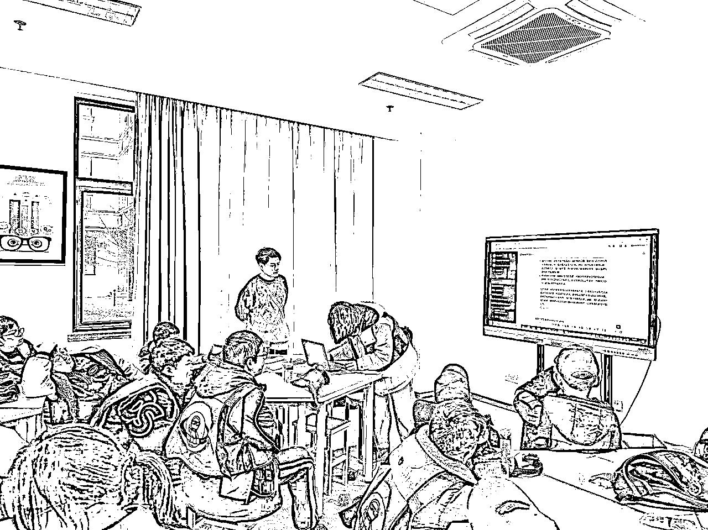
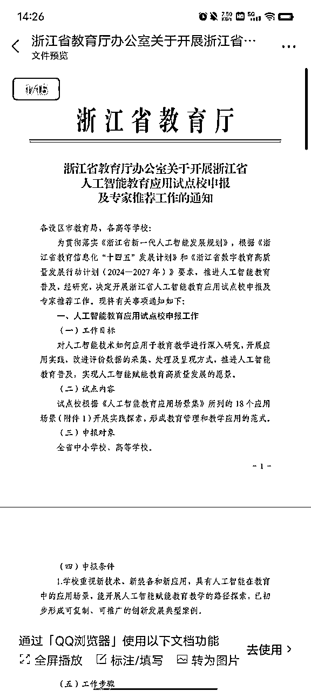
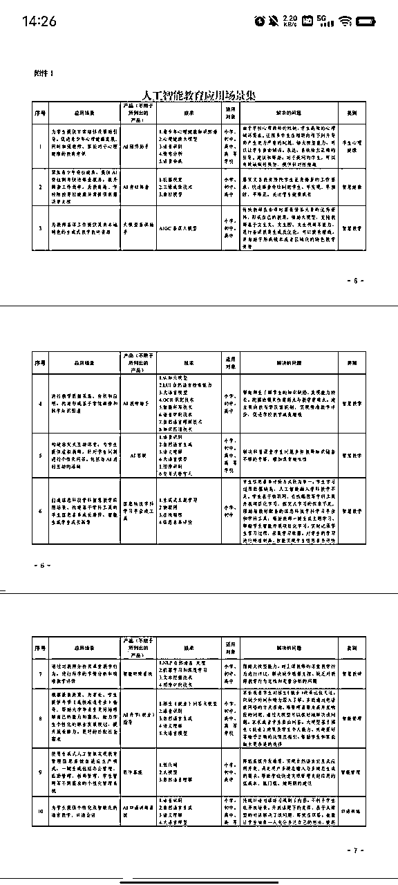
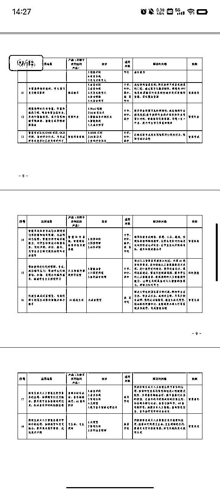
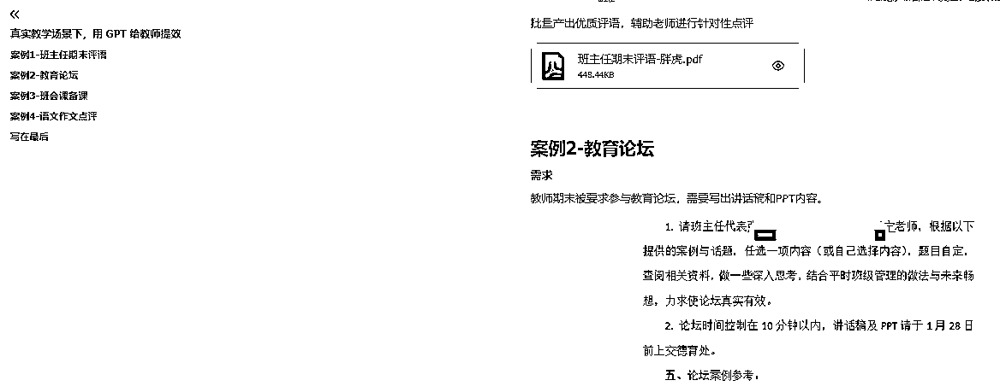
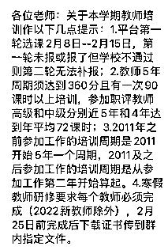
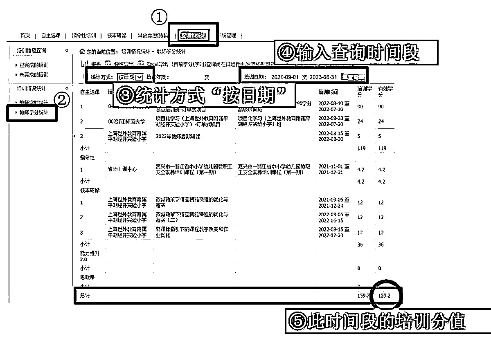
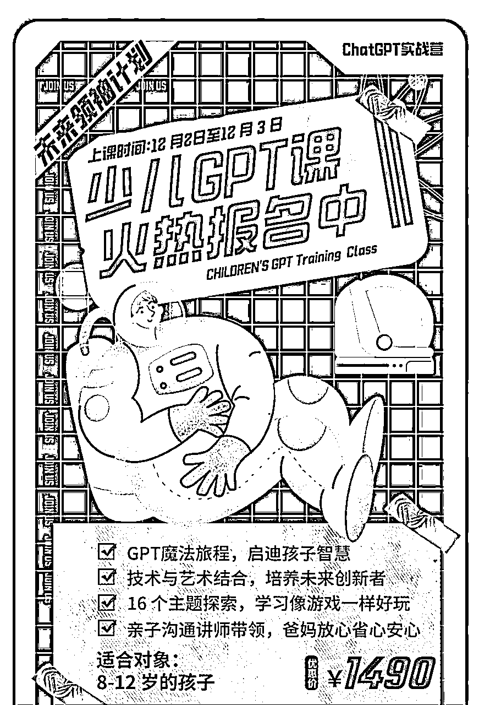
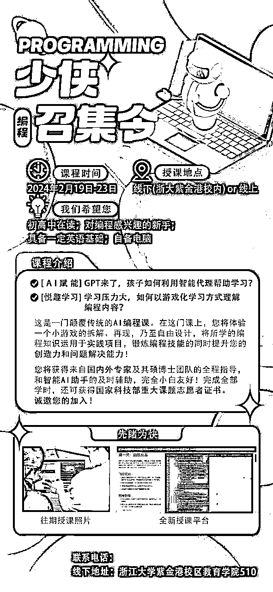
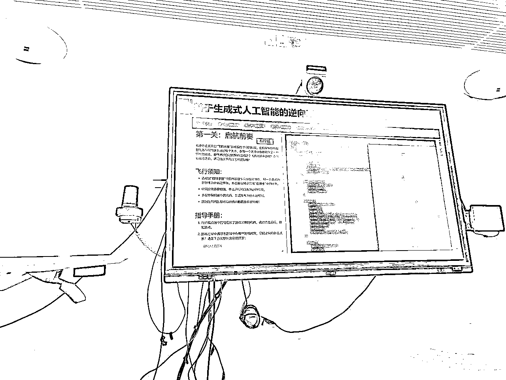

# 2024，AI+教育方向的信息和思考

> 来源：[https://qqdodsesuun.feishu.cn/docx/FwDBdyWijoQ6L0xNkW5c2DXhnAf](https://qqdodsesuun.feishu.cn/docx/FwDBdyWijoQ6L0xNkW5c2DXhnAf)

大家好，俺是胖虎。

之前一直从事少儿编程和人工智能教育相关的工作。

（生财帖子：《我把教培机构，开到了社区和小学里》）

开过两次线下的培训课程，教孩子如何使用 ChatGPT 和其他 AI 工具。

（生财帖子：《我给小学生，上了一堂 ChatGPT 课》）

这篇帖子聊的 AI 教育主要指面向中小学的基础教育。

不聊宏观的教育变革，只分享一些在这个领域我看到、想到、可能去做的一些事情，还有如何生财。

先同步两条宏观信息。

1.  前两天浙江省教育技术中心的内部会议上，主任讲到了生成式人工智能教育：“推进人工智能等新技术在教育教学中的应用，开展生成式人工智能对教育的影响研究，梳理生成式人工智能在教育教学中的应用场景， 推进人工智能技术与教育教学融合创新。有序推进移动学习终端在中学的适切应用。”

1.  浙大的一位教授一直研究元宇宙+人工智能教育方向，在几次的交流中得知，教授在研究科技部“新一代人工智能”重大项目课题，向上打报告时，得到了浙江省领导的高度重视。

1.  浙江省教育厅下发文件，鼓励浙江中小学申报人工智能教育应用试点校。工作目标：“对人工智能技术如何应用于教育教学进行深入研究，开展应用实践，改进评价数据的采集、处理及呈现方式，推进人工智能教育普及，实现人工智能赋能教育高质量发展的愿景。”并且给出了 18 个应用场景，充分结合了大模型和生成式人工智能在教育教学场景上的运用。

能感受到随着 AI 的发展，大家的重视程度越来越高，运用到教育上虽然会滞后一些，但也在慢慢融合。

对于这两条信息不做过多展开，了解这些信息，是因为自己做的业务中，跟浙江的高校和区县教育局合作比较多，经常会跟教育技术相关的主任和老师做交流。他们对 AI 很感兴趣，但多数停留在公众号文章和短视频的普及上，真正使用过 AI 工具的少之又少。

对于 AI 教育我们先聊聊老师。

# AI+老师

我本科学的是计算机师范，周围的同学朋友大多在中小学当老师，前段时间我面对面沟通了三位的一线教师，收集他们的需求，结合真实场景，用 ChatGPT 辅助解决，为教师提效。

（生财帖子：《真实教学场景下，用 GPT 给教师提效》）

但重点还是如何商业化，我们一起来看看。

## TOG 教师培训

学分培训

体制内的教师，会有继续教育学分的要求，5 年 360 学分，这些培训的费用由政府财政负责，金额大概是 500 一天，教师按规定时间在平台选课、上课即可。

这部分的培训的课程，大多比较水，内容偏理论，老教师们一般签个到就溜了。

专业培训

还有一些针对老师的培训，与学分无关，由本地教育局、学校或教师自行组织，进行专项学习和技能提升。费用一般由三方共同组合承担，这部分培训对课程和老师要求会更高，收费也会更多。

一般高等院校会有这个教师培训的资质，浙大、杭师大、浙外等等。一般由大学中的继续教育学院负责，承接、组织相应的教师培训。

但大学内嘛，负责老师事情也多，会外包很大一部分给培训机构，负责方案、课程、服务，高校会抽取营收的 15%~30%。

目前，教师培训的 AI 实操课程还没有。如果有相应的渠道或者资质，制作 AI+老师方向上的各种课程，AI备课、AI做PPT、AI工作提效等，会是一个不错的方向。

这个生意赚不了大钱，好在稳定、刚需，这类的课程也确实能帮助到一线的老师。最近我也在跟相关机构交涉，合作研发面向老师的 AI 培训课。

## TOC 教师课程

如果没有线下培训的渠道和资质，AI 教师提效线上课也是有需求的。

这个圈友们就太熟悉了，知识付费训练营嘛，针对部分精准用户推出相应课程。

老师在工作中除了上课，还有一堆杂活，其中文字工作占据很大一部分，很多老师会在小红书、闲鱼、淘宝上去买教案、课件、班主任评语等资料，在这点 AI 工具能很大程度上帮助他们。

目前这位老师做的不错，已经第三期了，大家可以参考一下。

## TOB 机构培训

我们有一部分业务会跟各个科技类、编程类培训机构合作，有些比较熟悉的老板知道我在做 AI 方面，就让我给他们机构老师去做培训。

去年年底做了两场，没有专门形成方案当成一个项目去做，但需求是真实存在的，老师们的反响也特别好。

课程内容就结合机构的日常工作，让他们学习使用 AI 工具，运用到教学、服务和新媒体宣传上。

相比老师的教学质量提升，机构老板们对于 AI 辅助新媒体营销更感兴趣。

对于机构的培训有一定需求和市场，之后可能会把这作为一个小项目来做，融入到业务当中去。

# AI+少儿

## 少儿 AI 线下课

我做过三年的传统人工智能课程培训，主要是少儿编程、机器人培训。

感觉这次的 AI 浪潮，跟2017年少儿编程培训兴起有一点像，国家关注，政策导向，对孩子未来就业有帮助。

最大的不同是学少儿编程打代码，是一项技术，有机会成为科技特长生，对升学有很大帮助。

少儿 AI 并没有那么刚需，提高的是孩子的想象力、创造力和提问能力，好是好，但并不刚需。

引用刀姐的一段话，我非常喜欢和赞同：

因为正在构建少儿AI游戏化社区，刚和同事开会讨论小朋友和成年人对于生成式AI的预期区别。

企业主：不能精准、稳定产出，就pass。

成年人：一次输出结果体验不好，就再也不用。

小朋友：错误的结果也能令人兴奋，愿意再次”创造”。即使生成文心版本的“车水马龙”，小朋友也享受这样“玩AI”的过程。

结论是：

小朋友是享受混乱的，享受错误的结果的，所以他们才能创造。

AI原住民们才能没有目的的玩出来很多新东西。

创造从来都不是因为“对”。

少儿 AI 的培训，我开展了两期，是以【科技研学营】为主题，融入一部分 AI 工具的教学。

孩子们兴趣极高，脑洞巨大，遗憾的是没有长期进行授课，来观察孩子们整体的变化。

第二期课程时，我用上了多的AI绘图、AI视频工具，孩子们的反响更好，国内的文心一言、讯飞星火、豆包也一定程度上可以运用到教学中，让孩子们的学习难度降低。

下一步的打算是制作项目化课程，AI通识、AI编程、AI小说、AI绘本、AI视频、AI游戏等内容，可以自己TOC来上课，也能打包 TOB 卖给机构，老师和学生一起教！

目前市面上的少儿 AI 课程，大家也可以参考一下。

1.  圈友曲直老师的线下课

1.  浙大硕博团队的 AI 编程课（目前我也在合作交流中）

1.  线下编程机构的课程（内容跟我自己的课程相似）

## 少儿 AI 线上课

线上课其实我还挺心动的，之前我就跟着条形马老师做在线教育，也有一些经验。如果做好了这一块也能赚钱。

但我一直想不好所呈现的形式是什么样的，效果能不能达到，会不会存在其他问题。

可能还需要思考一段时间。

# AI+教育产品

## 少儿 AI 游戏化社区

上次跟向刀姐请教了俩小时，了解到一个很有意思的产品。

刀姐正在做的这款产品，是社区的形式，让孩子使用生成式 AI 自己构建场景，自主创作，做出互动的游戏内容，孩子们互相尝试。可能有点像蛋仔派对 DIY 地图的形式，我还是非常期待的。

## AI 编程软件

跟刚才讲的 AI 编程课是一体的，游戏化的学习工具，通过智能 AI 助手，帮助孩子逆向拆解游戏代码，快速提升编程能力和解决问题的能力。

目前刚开发出来，先从线下教学的场景收集一些数据再去迭代。

## 河马爱学||海豚AI学||讯飞AI学

搜索到的一些 AI 教育类产品，我试用了一下，效果一言难尽。

其中河马爱学有些功能还不错，大家可以下载尝试尝试。

## 硬件产品

据我了解，目前市面上还没有推出结合生成式 AI 的硬件产品，技术和应用方面的变动实在太快了。

讯飞、学而思、一起学、作业帮在AI教育赛道疯狂抢占市场，也在研发 AI 大模型的学习机，这可能是一个比较大的方向。

如果技术成熟、成本下降，会不会出现这样一款产品：可的穿戴式的 AI 眼镜设备带上视觉识别、语音交互，变成随身助理，基于教学内容和课程帮助孩子。随孩子的眼睛移动，也能判断出孩子的困惑，注意力的方向，思考的时间等内容，对学习会产生巨大的改变。

这篇央视财经的报道很好，有圈友在风向标发过：太火爆！一门课，两个月吸粉十五万人！企业纷纷布局！千亿级大市场，来了？

# 写在最后

AI大模型在教育领域的应用，一定会越来越广泛。

后续可能会出现成体系的课程和阶段测试，优质的少儿 AI 产品，AI 名师教学答疑，学校内的 AI 数字化工具等等，不管是课程、软件还是硬件产品，都会有很大的更新。

我希望这个领域能发展起来，带给孩子更多的帮助，我们也能找好方向，好好生财。

这篇内容抛砖引玉，也希望能给到圈友们一些启发。

感谢大家！