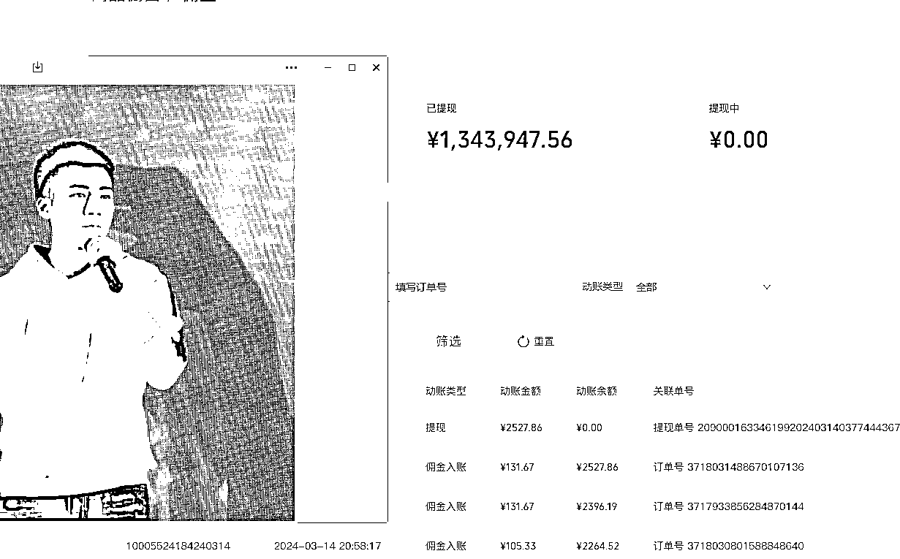
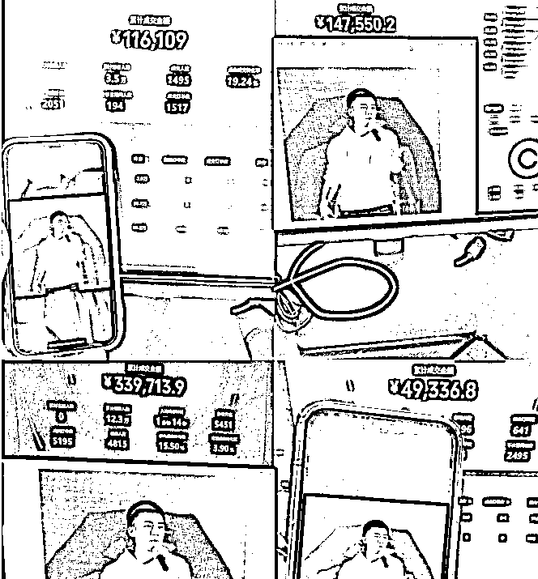
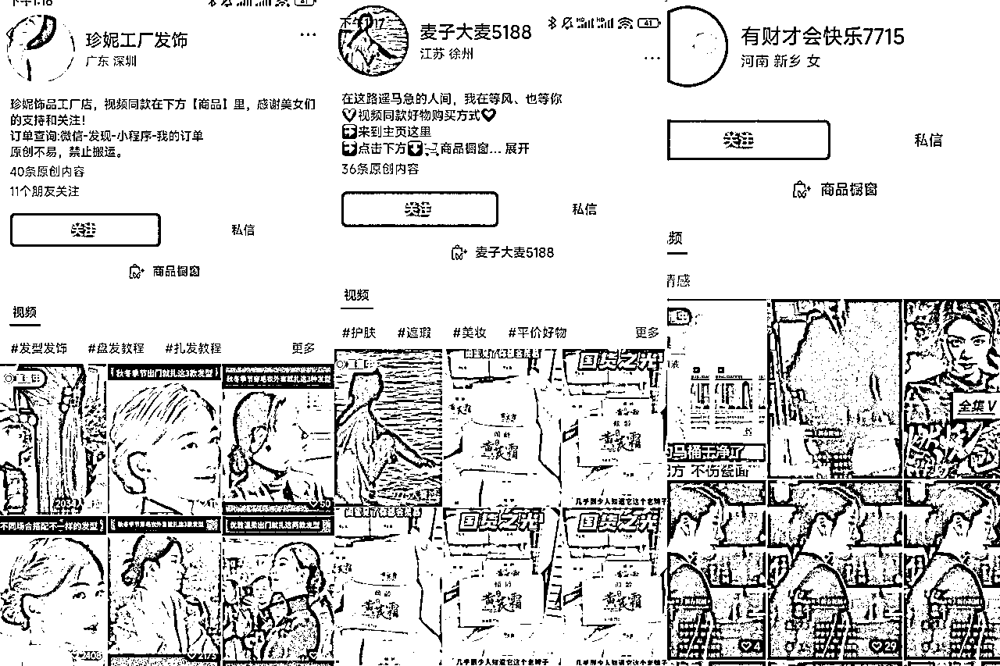
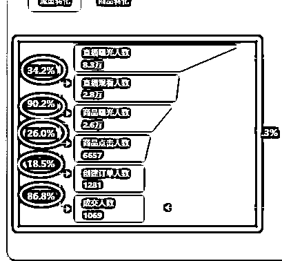
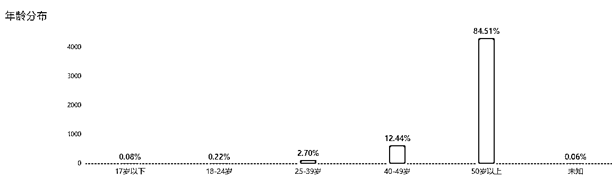
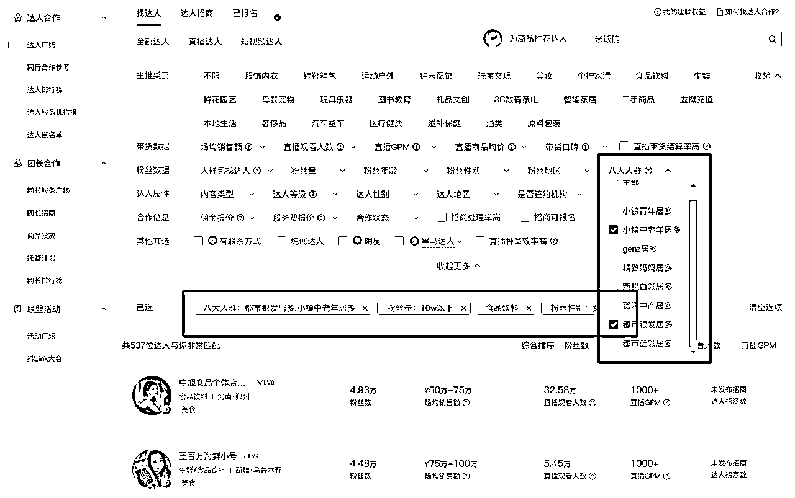
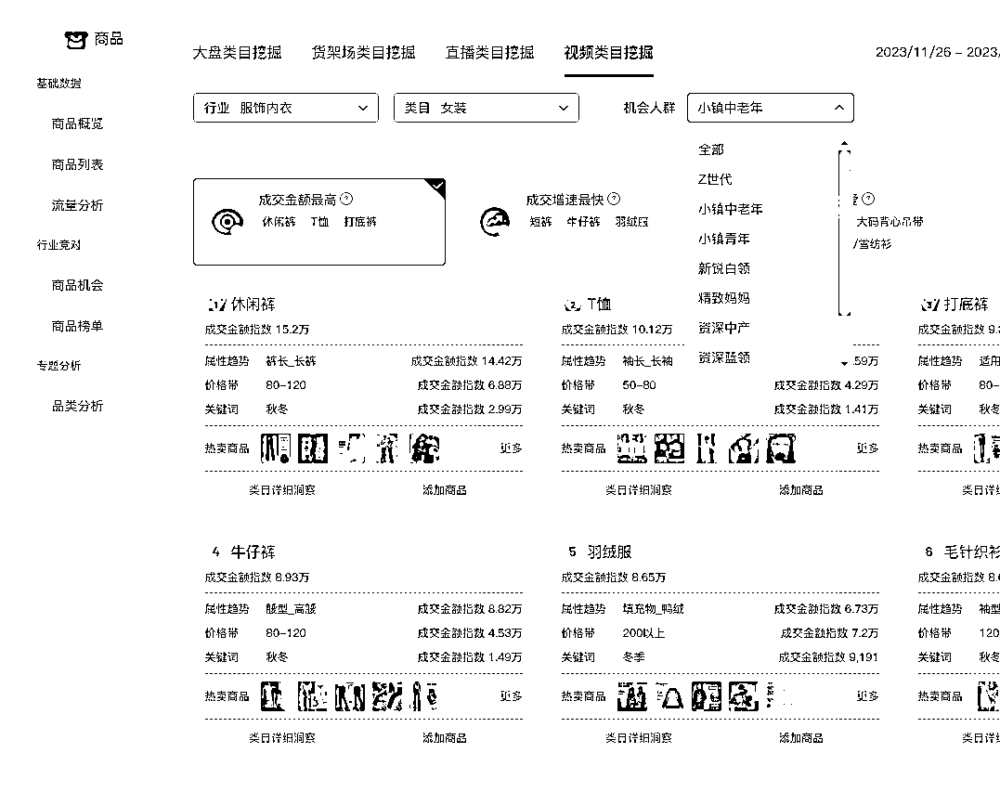
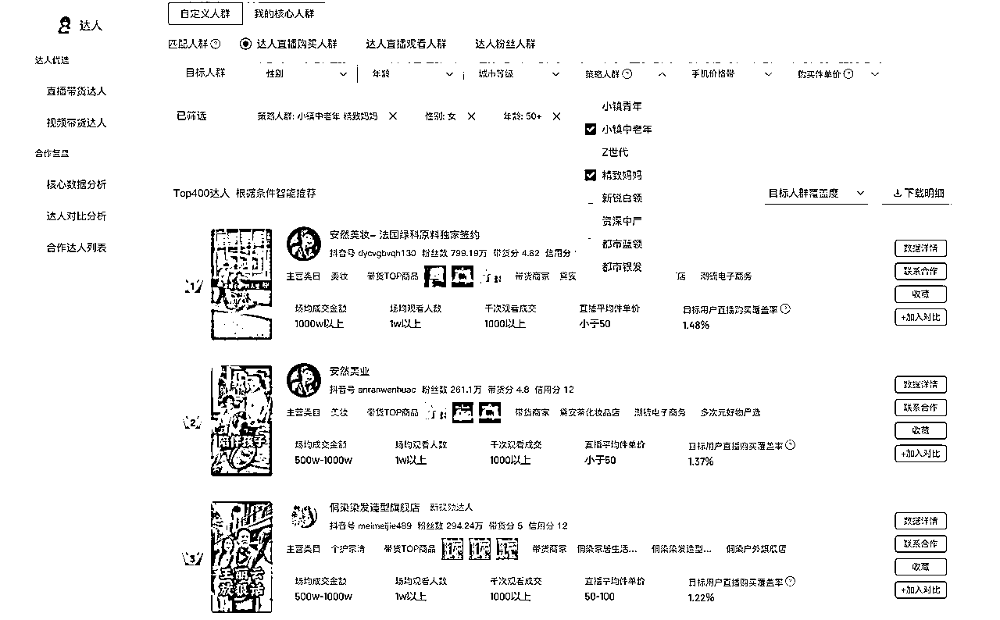
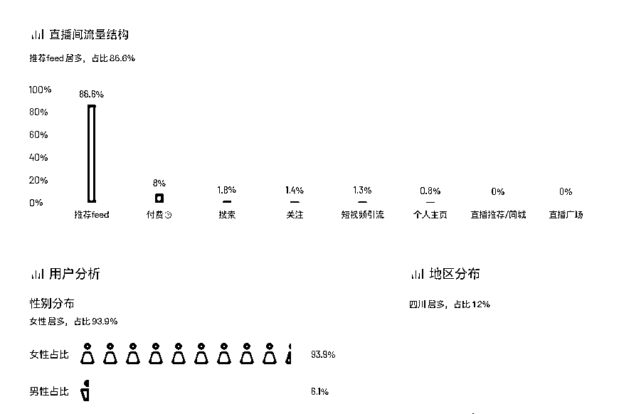

# 视频号单号佣金130w，新人该如何切入？.

> 来源：[https://vgn94ta1w5.feishu.cn/docx/IxjXdi5h9oh9bcxHK3acB5qznqc](https://vgn94ta1w5.feishu.cn/docx/IxjXdi5h9oh9bcxHK3acB5qznqc)

大家好，我是阿豪，很久没有分享过东西了，这篇文章想和大家聊聊视频号当前的一些玩法，如果你对视频号感兴趣，看完这篇文章，我相信会对你有很大的帮助。

## 一、业务现状

今年我们跑了很多个账号，其中一个账号，跑了5个月，佣金目前跑了134w。足以可见，视频号目前是有相当大红利的，也非常值得入局。

## 二、带货玩法梳理

视频号变化很快，目前究竟应该怎么打，借着这篇文章给大家剖析下目前视频号的一些打法，选择大于努力。

目前视频号的变现玩法多种多样，但只论带货的玩法大概有下面6项。

| 玩法 | 是否付费 | 优劣势 | 适合人群 |
| 根据爆款脚本，混剪或者实拍短视频爆量，然后直播间承接 | 否，自然流 | 优势：流量精准，转化率高 | 刚入局视频号 |
| 不发视频，拉广场自然流 | 微付费 | 优势： | 有一定直播能力 |
| 微信豆投短视频，往直播间引流，roi打正，持续放量 | 重付费 | 优势：相对稳定，天花板高 | 有资金 |
| 微信豆直投直播间，roi打正，持续放量 | 重付费 |  |  |
| 微信豆投挂车短视频 | 重付费 |  |  |
| ADQ投短视频 | 重付费 |  |  |

### 第一种玩法：短视频连爆

#### 玩法拆解

这种玩法是最常见，也是最简单的。其本质，是利用视频号对于新号的扶持，发爆款短视频带货脚本，视频你可以混剪，也可以实拍；因为脚本是验证过的爆款，所以视频有极大的概率会爆，然后当流量跑起来的时候，第一时间开播；因为进入直播间的用户都是被种草过的，所以转化率很高。

这个玩法已经跑了非常久了，像去年年初那会我带着一些小伙伴打俄罗斯食品，到后来的中医书、国学，再到今年年初的剧情带货，卡特性卡封面等，都是这个模式。目前市面上绝大多数视频号培训教的都是这个，建议大家可以省下学费，因为这个模式本质上就是一个信息差，并没有特别多的操作难度，核心就是找到同行的爆款脚本，进行一比一的复制。这个玩法，请不要创新，请一比一的抄，谁做得好就抄谁，谁的视频爆了就抄谁。直播的话术不需要多复杂，因为直播间只起到一个收银台的作用，把产品介绍清楚+适当地逼单就足以，如果还不会，去抄你同行的直播间。

另外补充一句，目前市面上经常有各种所谓的黑科技，比如卡封面，卡特效，ab等等，请大家不要把时间花在这些东西上，我们做过大量的ab测，视频爆量的核心是视频内容本身，是视频的完播率（大于35）和互动率（大于1.5），内容不行，加啥都爆不了，不要因为这个被割韭菜。

这个玩法优势是，操作起来简单，没什么门槛，也不需要你有很好的主播能力。当然也有劣势，比如比较废号，需要不断地起新号，哪怕你不会因为视频质量问题违规，但是当过了新号扶持的时候，你的视频流量也会大幅下滑，所以你需要不断地起新号。另外一个就是视频爆，存在概率性，你不可能每个视频都爆，所以它是相对不稳定的。如果说你是新手小白，刚切入视频号，或者是小团队夫妻档，这个模式可以先切入感受下。

#### 视频注意事项

1.视频内容尽量不要硬广营销（比如10瓶洗手液只要9.9，明确的营销属性会限流）

2.尽量不要搬运，不要心存侥幸搬运视频到视频号，尽量实拍或者混剪（混剪程度深一些）

3.完播率>35%,评论率>1.5%，更容易爆；视频播放量过500后，观察数据，如果达到了立刻开播，

4.视频里不要出现明星和网红达人，会判违规

5.使用抖音的版权音乐会被检测出来，被隐形限流

### 第二种玩法：拉广场自然流

大家可能也经常会刷到有一些直播间，并没有发布视频，或者它的视频并没有很高的数据，但是它的场观和转化却很高。如果做过抖音，对这个玩法应该挺熟悉的；其本质是通过人货场的搭建，完成直播间的浅层数据（互动、停留、关注）和转化，从而撬动广场的自然流量，在起号的时候可能需要投一些付费，但付费仅仅只是为了加速起号的过程，所以付费占比会非常低。

这个玩法相比起第一种，对于运营能力的要求会更高，第一种玩法你不需要搭建出很吸引人的场景，也不需要很专业的话术，但是拉广场流量，就需要。也正是因为如此，它的天花板也会更高，也会更稳定。

想做好这种玩法，要搞明白视频号的底层推流逻辑：5分钟密集互动+5分钟密集成交+gpm↑

因此，你就知道，想要获得大场观以及精准的流量推送就必须满足一下几点：

#### 起号核心逻辑

*   优化好场景，先抄后超，对标同行，拆解场景元素

*   认真选好福利款，便宜不是目的，性价比极致才是真谛

*   根据人群选品（文末有选品方法）

*   拉动5分钟高频密集互动

*   拉动5分钟密集成交

*   多sku，测爆品

#### 拉场观方法

| 密集互动 | AB链起号，用A链接点对点互动 |
| 密集成交 | 用福利款来控制放单节奏，尽量不让成交触底 |

#### 拉场观的执行动作

| 高密度互动 | 拿福利款憋单，高性价比用低价炸，要互动，要关注，卡灯牌。每分钟>10人互动，就离起量不远了 |
| 高密度成交 | 若主播长时间憋单，密集成交有触底的风险，需要人为补单，从广场进入，别从私域进入 |

#### 直播全场话术逻辑

| 话术逻辑 |  |  |  |  |
| 开场 | 上人 | 塑品 | 逼单 | 二次逼单 |
| 我是谁 | 点对点 | 挖需求 | 痛点强调 | 售后保证 |

每当我们完成一场直播，必须做好复盘和优化

把每一场直播的各个节点拆分出来，逐个去优化，找到最优的人货场组合形式

#### 直播各个节点的优化方式

| 直播数据优化点 | 优化方式 |
| 曝光进入率优化 | 封面主图决定基础用户进入率，进入率越高，流量越大，反馈越好 |
| 如何优化商品曝光 | 把福利信息明确清楚 |
| 如何优化商品点击 | 跟主播塑造产品的价值话术，产品本身价格，主图+描述有直接关系 |
| 如何优化订单创建率 | 跟主播逼单话术有关系 |
| 如何优化成交人数 | 创建订单没下单 |
| 密度成交优化 | 用私域从预约进入，分批次成交，保证成交曲线不触底 |
| 互动权重优化 | 底层认知： |

如果你没有做过这个模式，有些地方可能不能理解，但是没关系，你只要实操过一次，就会找到这些优化项的对应场景，而且你只要照着我说的去优化，你的数据就会有一个非常大的提升。

### 第三大类玩法：纯付费

这类玩法无论是微信豆投短视频挂车，还是直投直播间，亦或者adq，都不是单人能够cover的，需要有一个小组，来团队化的运营，相比起前两种，它的门槛更高，但是收益也是最大的。

基础要求：

*   现金流充足，以一个直播间为例，单场直播，单条计划如果投20000豆，建10条计划，这就是2w块钱；而且还只是一个户，算上现金的回流时间，整体想把模型转起来，至少准备个30-50w的现金流。

*   客单价够高，毛利率足够高；不满足这两个条件，roi跑不正

目前大概有3种盈利模式

*   纯靠卖货，跑roi，roi正则持续放量

*   卖货roi尽力打平或者微利，靠系统赔付挣钱

*   纯付费跑线索，销售跟进，后端接高客单产品

这类玩法就不做过多介绍了，门槛较高，有在跑这个模式的欢迎一起交流

* * *

以上是当前视频号带货变现，主流的3类玩法，玩法的门槛不同，适合的人群也不同，建议根据自己的情况选择。

## 三、新人如何切入视频号？

下面和大家具体聊聊，如果是一个新人想快速切入视频号，究竟应该怎么做？

### 一、运营方向的选择

如果你想切入视频号，有3种选择

| 方向 | 运营模式 |
| 短期打法 | 吃短视频流量，跟爆品，测爆品，批量搞号 |
| 长期打法 | 前期拉广场流量，中期短视频叠加，后期付费放大，单类目深耕 |
| 牛逼打法 | 立人设，做ip，积累势能 |

*   短期打法即是第一种玩法，短视频连爆，比如最近很多人在打的老人除味剂，滋补膳食，日用百货等，都是一个逻辑，赚短期钱，打游击战，把账号当做消耗品。

*   长期打法指的是一个账号，我想持续深耕，持续赚钱，应该走的运营路径。开头提到的120w佣金账号，既是这种模式，这种账号，前期优先把广场流量做起来，当流量起来后，每天稳定直播节奏，然后开始叠加短视频流量，充分转化每一个用户，最后是通过付费进行放大。这种玩法持续，稳定，但对运营能力也要求更高。不过话说回来，老干没门槛的，啥时候是个头。

*   最后一种是最牛逼，也是最难的，就是立人设，打ip，这个我还在探索，盗坤老师这个模式跑的很牛逼，想了解的可以去看看。

### 二、如何选品？

选品大于运营，同样的时间精力，选品的不同决定了收益的天差地别，如果你在视频号卖铁皮石斛，可能一个月只有几十万的体量，但是如果你卖女装，可能一场就有几十万。

平台红利的时候，做红海品类

平台微利的时候，做蓝海项目

选品的方法千千万，但一切离不开需求的洞察。视频号的核心用户是50岁以上的姐姐。

围绕她们选品，总是没错的。

而具体到执行层面，给大家介绍几种我常用的筛选选品的方法。

#### 选品方法一：通过八大人群筛选

通过精选联盟达人列表，可以按照粉丝的八大人群筛选，你可以把对应的中老年和都市银发筛选出来

会筛选出来一大批低粉高转化的，中老年群体账号。通过账号所带的爆品，就可以直接跟

#### 选品方法二：通过抖音罗盘，筛选出最新的市场热点选品，可以按照人群筛选出具体的爆品

#### 选品方法三：分类查询，分别查直播达人和视频达人，依旧按照策略人群，以及年龄来卡账号

这样筛选出来的都是很难被发现的爆款账号

选品方法四：通过视频号广场跟品

通过多刷视频号广场，来跟进选品，这个比较简单

*   选品方法有很多，关键是找到适合自己的，希望给大家一些参考。

### 三、实战如何运营？

这个问题比较重要，我举个例子，给大家简单串一下，方便大家理解。

比如我选定了一个白牌的洗发水，售价99元3瓶，毛利60%。

我会按照如下的顺序去操作！

#### 第一步：搭建账号

尽量用一个微信老号，创建一个视频号，然后修改头像昵称简介，不会改就抄同行

搭建完后，不要立刻发营销视频。先养个2天号，发一发日常，然后开始发视频。

另外当前视频号带货权限的开通增加了一些门槛，这个比较简单，不会的大家可以在星球里搜索下。

#### 第二步：分析同行，拆解直播间流量结构

如果是抖音的对标，可以用第三方工具查看流量结构，或者是巨量百应去查

如果是视频号的对标，需要人为的判断。

这件事及其的重要，不同的流量结构决定了不同的人货场搭配，必须找到相对应的，否则事倍功半。

#### 第三步、广场起号，搭建人货场

##### ① 场景搭建：

先看看同行是怎么搭的，可以看出它的核心

整体采用obs+绿幕的方式搭建，画面突出背书+功效+优惠信息；其中功效的展示要规避违禁词

画面不能放视频，会判低质量直播；整体字的大小，要相对缩小，否则会判贴图过大。

##### ② 主播+话术

将对标直播间的话术完整的录下来，然后按照话术逻辑拆分，形成对应的文档，修改其中的关键词、品牌名、优惠信息、产品信息，将话术修改成自己的。然后对照违禁词列表，删掉违禁词，避免违规。

| 话术逻辑 |  |  |  |  |
| 开场 | 上人 | 塑品 | 逼单 | 二次逼单 |
| 我是谁 | 点对点 | 挖需求 | 痛点强调 | 售后保证 |

| 环节 | 话术部分 |
| 开场 | 欢迎大家进入直播间，今天我们是XXXX |
| 上人 | XXXXXX |
| 塑品 | XXXXXX |
| 逼单 | XXXXXX |
| 二次逼单 | XXXXXX |

##### ③ 货品

上架方式：第一种 自己开店上架；第二种 挂别人的链接 第三种 找后端店铺帮你上链接

货盘组合：低价品（擦头毛巾 2.9）+正价品（99元 3瓶）

ok，到这里，准备工作完成了。下一步开始起号。

#### 第四步、起号方式

我的核心目标是完成数据递增， 并且拉动自然流，3场内，场观突破5000，完成起号

| 场次 | 运营策略 |
| 第一场 | 点对点互动，用低价品拉人，核心完成5分钟密集成交，不着急转正价，至少播2个小时 |
| 第二场 | 根据第一场的数据优化，如果钩子品留不住人就换品，哪怕亏品，必须把互动拉起来，撬动流速，开始转正价，重点关注转化率 |
| 第三场 | 形成稳定的循环脚本话术，开始一轮一轮的循环，不断优化人货场，观看成交转化率要大于1%。优化的方式，参考 |

#### 第五步、用短视频做增量

分析同行的引流脚本，通过混剪或者实拍的方式过原创，测试脚本流量，每天开播的时段内发布视频

至此，这个账号就完成了从0-1的基础模型搭建，你后面要做的就是持续的优化，持续的迭代，然后通过付费放大。关于付费怎么投放，这个内容太多了，后面找机会单写一篇文章给大家介绍。

* * *

以上就是要给大家分享的内容，希望能对你有所帮助，我是阿豪，目前深耕视频号和抖音，大家有什么问题可以留言，知无不言。

轻舟已过万重山,前路漫漫亦灿灿，愿各位一起加油！