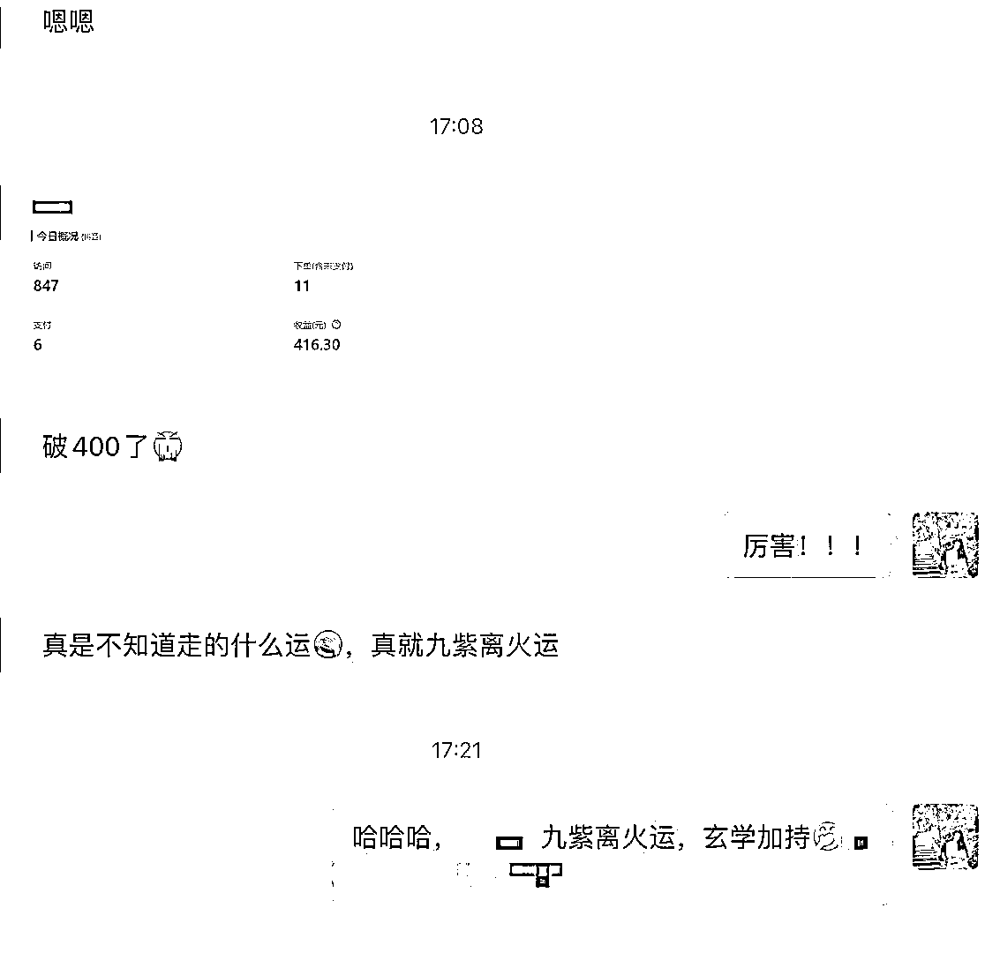
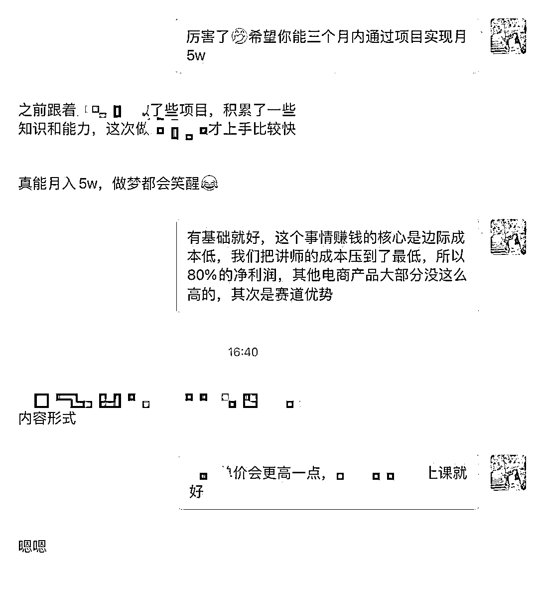
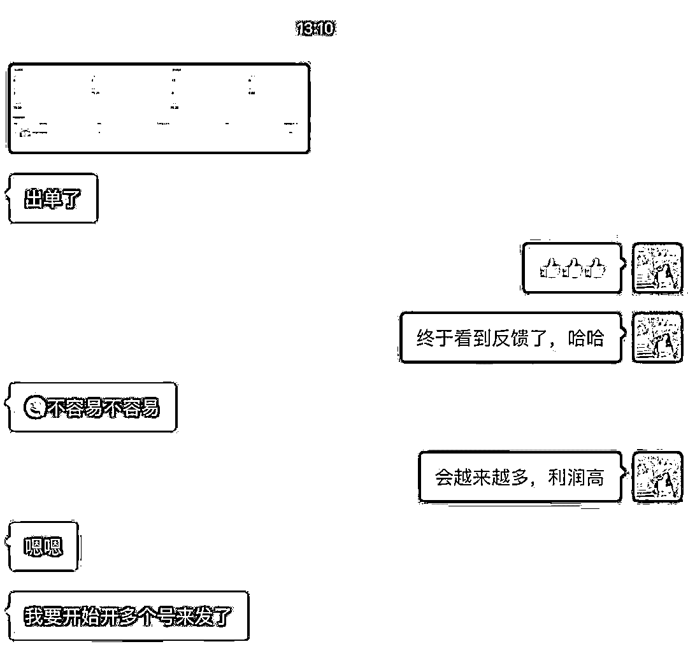
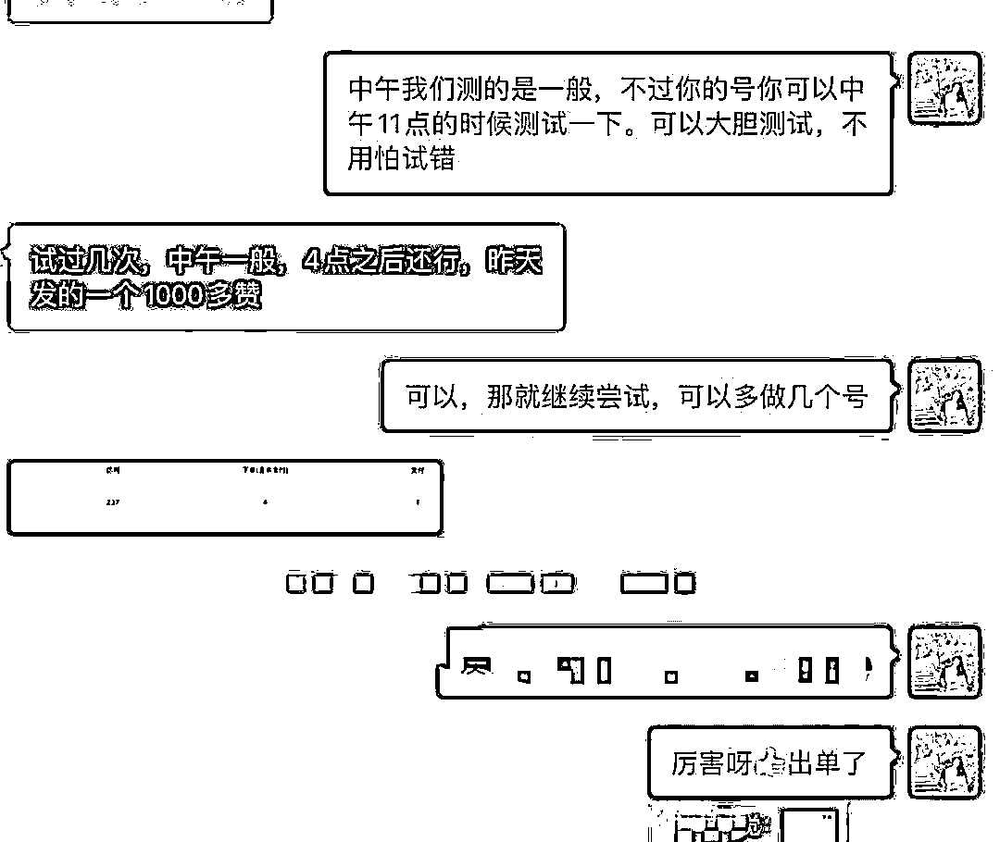
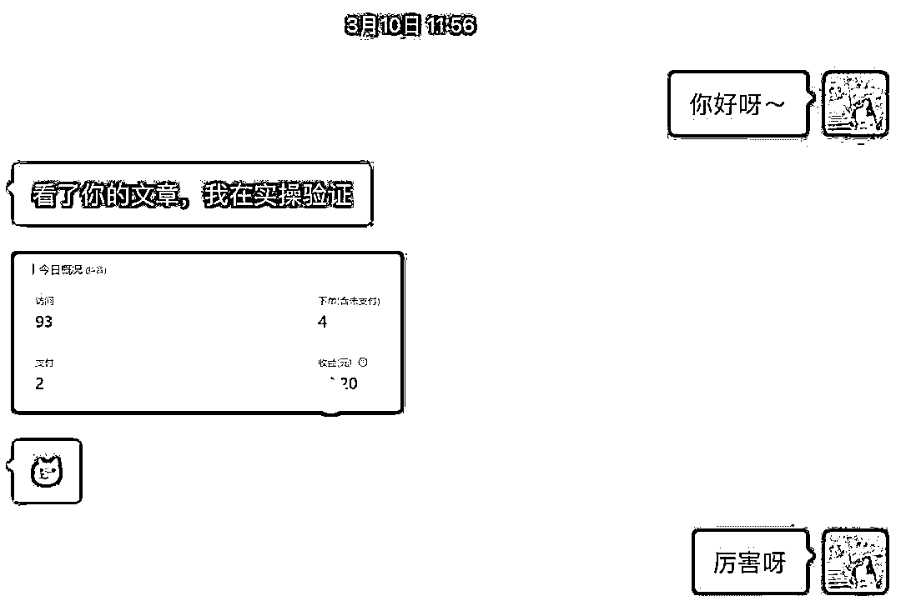
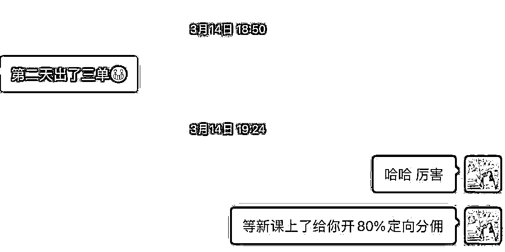
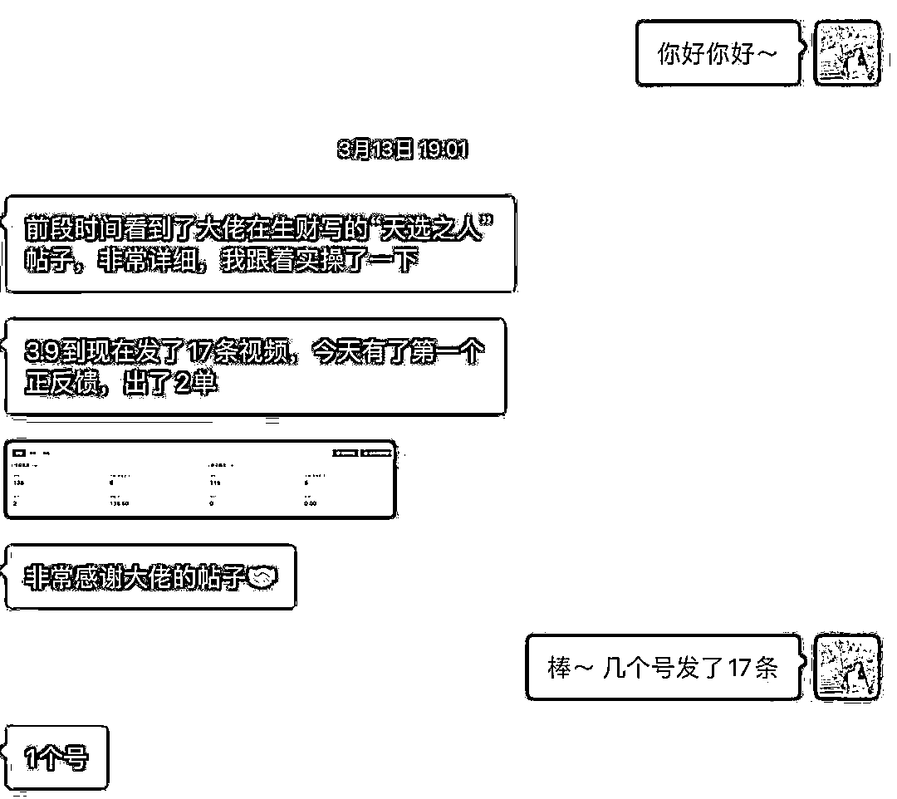
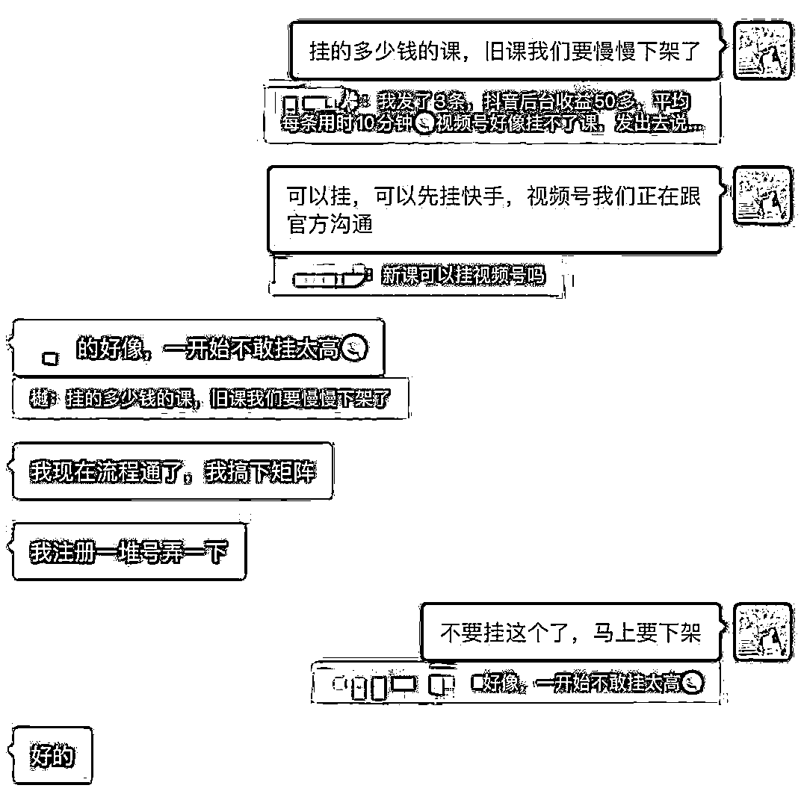
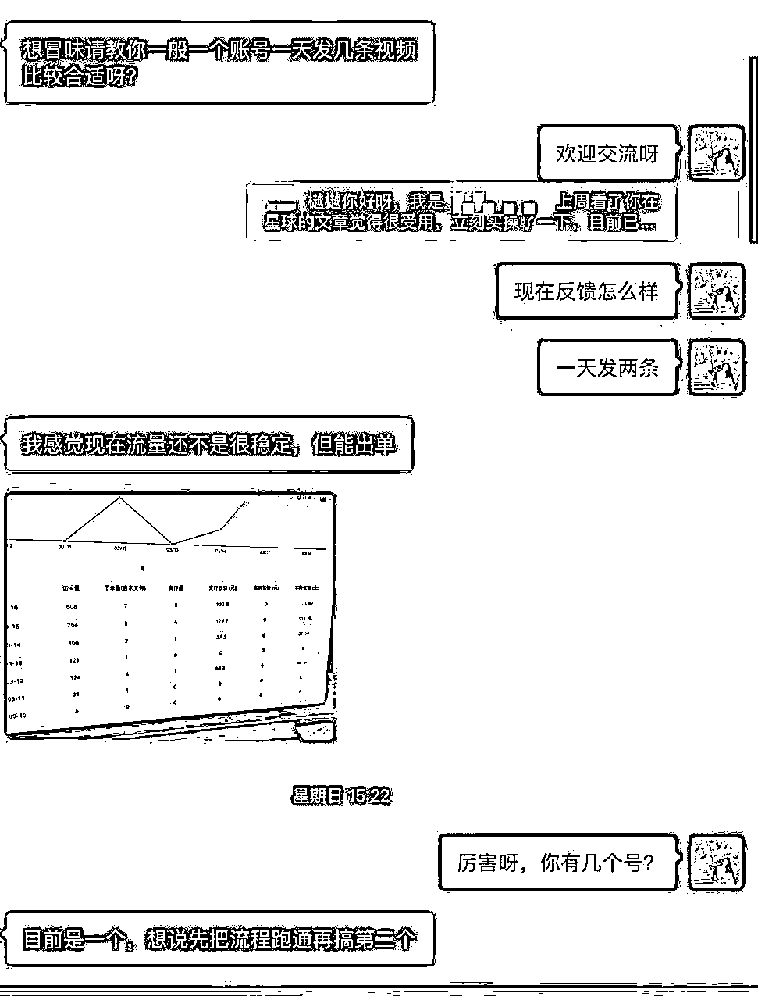
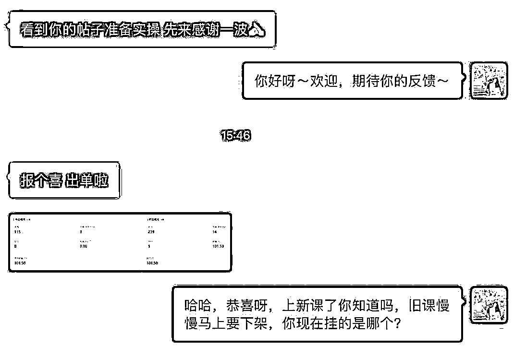

# 分享了单账号自然流单月1.8w的身心.灵国.学玩法后，根据不同人给我发来的收入反馈，我总结了几点关于做项目的思维和方法论

> 来源：[https://m7vzu30d1s.feishu.cn/docx/JP6NdRwz8oycMdxSTs3cTTX5nrg](https://m7vzu30d1s.feishu.cn/docx/JP6NdRwz8oycMdxSTs3cTTX5nrg)

## 一、前言：

##### 大家好，我是樾樾，来自河南郑州，连续创业者，大学毕业起创业做培训机构，后入局线上教育，做过心理课、职场课、管理课、运营课，一直在知识付费领域。

现在通过小红书流量工作室形式切入更多赛道，有接法律咨询、家居、别墅设计、留学等公司小红书获客运营，而我上次分享的身心.灵国.学板块，是我们直营的一个项目，在持续对接嵩山的线下场地，准备做正念冥想线下课。

感恩生财的平台，让志同道合的人能更好的链接~上次分享的帖子链接如下：【纯自然流，单账号单月1.8w，身心灵、国学、觉醒疗愈类赛道变现保姆级实操拆解】🔗

## 二、圈友实操收入反馈：

今天写这篇帖子，是有一些感慨，也是为了感恩圈友看了教程后的实操反馈，通过大家的反馈，让我有了几点心得。先放几张圈友的反馈图吧：

还有一些反馈切换手机聊天记录没了（所以圈友们聊天真的得先提前做好自我介绍让我改一下备注，不然后面都不记得要干啥的了哈哈），这些记录里可以看到，有的人做了一单也不出，有的人闷声干活哐哐赚钱。

随着沟通的人越来越多，我发现，每个人的思维和行为有着非常大的差异，即使是这样的保姆级教程，也会有28定律，有的人做的好，有的人做的不好。

刚刚在洗漱的时候，我想着写一下帖子，把跟大家沟通后的心得分享分享，然后拿起电脑，特地剪短刚做的美甲，开始敲字，希望对大家有用。

## 三、做项目的思维

#### 1、复盘思维：

我跟短短几天就做到单日400+收益的圈友聊天，每次出单，他都会自己总结这次出单的原因在哪里，比如：这条视频开头的第一句话很留人，这条视频的评论区引导起了关键作用等。

这样的人头脑里是一直在复盘做对的事情，当出单少的人，还在第一步、第二步反复徘徊时，有复盘思维的人已经走到第五步、第六步了。

刚开始不出单的圈友，会不断的复盘自己不出单的原因，或者主动找我问什么原因不出单，怎样可以做的更好等等，这样不断复盘改进的情况下，也开始有出单反馈了。

#### 2、模仿思维：

好多圈友下场实操后，给我发来了自己剪的视频，我看到五花八门的视频的时候，也很奇怪，我的教程里有说这么剪吗？好像没有。有些圈友自己创新的视频，虽然看起来花里胡哨，实际上发布出去也是毫无回音。

比如：换个音色、换个比例、换个字体动画，剪辑技术高的还换了超高清的老外冥想画面，还有把文案改的面目全非的，深奥到我一个持证心理咨询师都听不懂，发给我看，问我为什么不出单，害。你们说为什么不出单呢。

反观出单量高的圈友，每一个细节、画面比例、文案、配音，全部按照教程里的进行，最多增加了一些特效和音乐，（我教程里也提了，一定要参考对标视频，别人用什么你就用什么，只要能保证过原创就可以）。

这样的操作不仅可以流程化，还可以批量化，无脑操作，10分钟产出7条视频，出单量还好，然后直接大量上号，效率奇高，我都惊了。

这让我回想起我刚开始做项目的时候，也总是爱搞创新，总觉得我还可以换一些属于自己的东西，换一下更新奇的，更好玩的，甚至刚剪视频的时候，我还让人测试过国外的魔法师的形象等等，出单量还不如普普通通没有创新的画面。

最终还是老老实实模仿自己和团队内爆过的视频，字幕颜色、字幕动画都不变，直接模仿，买课入口也直接拿来，多个账号复制粘贴，这样的出单量又慢慢回升。而我在帖子里分享的成品，也是我们最终测试出的最稳的玩法。

所以，这是我很想给每一个做自媒体或流量项目的人分享的一点：抄并不是一个贬义词，会抄、抄对也是一种稀缺能力。

我们做账号、做项目找对标，一定要会抄，先把自己的行为习惯忘记，去看到被市场验证过的东西，因为一件事情让谁认可都没用，只有市场认可，才是它的真实价值，否则自己做出的东西，都只是自嗨和自我消费而已。

#### 3、主动思维：

有很多圈友通过帖子链接到我后，有的圈友是不同赛道的，发自我介绍主动说明来意，表示期待了后续的合作，或者表示想下手操作。

有的圈友加过来后，一句话不说，咱也不知道他是干啥的~反正可能每个人的通讯录里可能都会躺着这么些人。

让我很开心的是，有的圈友做了之后，不管有没有结果，都会主动来反馈一下进展，或者遇到问题主动提问，一次我没回复还会问第二次😂真的很执着的在问，我也能感受到人家真的想解决问题，比如剪辑问题，文案问题，或者挂课问题等等，也会抽出时间回复问题，帮他解决后，他的收益都是明显看得见提升的。

总之就是很主动的在为自己链接资源，主动链接，收获的都是自己的。这点我也需要学习，抽空要多主动链接一下更多的伙伴。

#### 4、复制思维：

其中一个小伙伴，自己的单个账号出了一单之后，立刻准备了6个号开始跑，现在最多的应该有20个号了，这也像我在教程贴里写的一样，做一件事情趁能赚钱的时候快速赚。

不夸张的说，一个账号如果一天能跑100块的纯利润，那么一个人想一年赚到100万该怎么办？

复制就好了， 把一天赚100块的事情复制200个账号，一天就是20000，50天即可实现100万。

算好账，不断的重复正在赚钱的动作，是一个小项目赚大钱的重要思维。

#### 5、资源思维：

相信大家都听过一句话：万物可以不为我所有，但万物皆可为我所用。这就是我对资源型思维最直接的理解。

原因是有圈友跟我说他搞了20个号，让我给他开通最高分销，我问他是怎么在1天时间就搞了20个号的，是不是本来就是流量玩家或者自媒体工作室什么的。

他给我的回复是这样的：说自己有主业上班，发现这个不需要实名认证的抖音号就能出单，所以找了父母和自己妹妹的手机号注册，一个手机号可以注册2个抖音，他自己有三个手机号，加上家人的，很快就搞定了20个号。

这个是我觉得做项目过程中很重要的一点，资源型思维，特别是玩流量的都知道，太多时候遇到账号问题、实名认证问题、设备问题等等，只要我们想好需要这些资源干什么，让资源发挥其作用，就可以主动的去收集和链接身边的各种资源。

#### 6、管理思维：

管理思维也源于其中一位圈友的反馈，他说的很有意思，说这种事情给室友同学讲不明白，也不想讲，讲了估计也有很多人不爱干。

直接让他们给我剪辑视频好了，剪辑一条给他们多少钱这样，然后又找了个人给他代发视频。

收入可以顾得上支出，这样就直接从自己做项目变成了自己牵头一个项目，真的很优秀~

所以管理思维可以帮助人优化自己的时间精力，把自己站在管理的角色，不仅自己能有收益，还能给社会和身边的人贡献一个就业岗位哈哈。

#### 7、合作思维：

自帖子发出去后，来想合作的人很多，每个人的合作思维都不一样，这让我觉得很新奇也很有意思，也觉得和自己有很多向大家学习的地方。

看大家提出的不同的合作模式，每一个都会将项目和团队组合落地成不同的结果，比如我打算跟嵩山场地合作的线下项目，也有不同的合作方。还有小红书不同产品的流量合作等，总之：合作才是一件事情的放大器。

主动提出合作，主动抛出橄榄枝，主动链接资源，即使现在未达成合作，你也会埋下一颗种子，在未来生根发芽。

#### 8、利他思维：

这个已经很多人说了 且验证过了，真正抱有利他思维做事，且持续抱有利他思维做事的人，都能感受到这个思维的重要性。利他就是利己，利己的前提是利他。

我在写上一篇帖子的时候，纯纯分享，把每一个细节步骤都写的清清楚楚，合作或推出新项目的时候，也会优先为对方考虑，我想了一下身边长久合作的人，大部分也都是这样的思维。

出单多的圈友，给我发反馈的时候，抱有的心态是：报喜和希望我们收到正面激励，也是利他。基于这种心态，我直接邀请他成为我们下一个高价课玩法的优先定向分销~只希望他多赚钱，多反馈，互利互动。

一个人做事或和人相处时，是付出还是索取，对方都是能感受到的。短期的利己可能获得短期的高利益，但长久的收益一定是建立在利他之上。

做视频做文案的时候也是一样，你的这个视频画面，是不是为了方面用户观看？你的文案，是不是为了方便用户理解？如果你能持有这样的心态去做视频 做文案 做项目，那我相信你的用户会越来越多。

#### 9、兜底思维：

这是我以前在学习一个管理课时印象很深且受益良多的一个思维：兜底思维。上限谁都会说，但总要有人兜底。

比如一个项目，上限可以有一千万，五千万甚至一个亿，但我们在做事时也要想好这件事的保底在哪里。

我很喜欢用“至少”这个词，做事我也经常喜欢考虑到事情最坏的结果，然后再做打算。比如我们跟留学团队合作，我会说：至少单月多少客资，至少每天要完成的事情是什么等等。

用到做任何项目上都同样，今天至少要完成几条有效视频？今天至少要沟通几个团队成员？今天至少要注册几个账号？今天至少要跟几个同行或老师进行交流和请教？等等等等。

我也喜欢跟我讲至少的人，当别人给我们讲至少的时候，我们自己也会感受到被兜底的那种安全感，“至少”就是一种兜底思维。我现在做事喜欢尝试玩对赌，就是你至少付出什么，至少能获得什么。这就避免了很多人交了高昂的学费后，啥也收不回来的悲剧。

航海的押金其实就是一场生财与圈友的对赌，先交了押金，然后圈友把时间和精力花在航海项目上，通过这样的操作来双方进步。

我也期待开展一种对赌玩法，我跑通的事情，你可以来学习做，但如果赚不到多少，我把学费退给你，对这个模式感兴趣的圈友可以来找我聊聊，提：对赌，我就懂了。

这个世界浮夸的事情、项目太多了，也需要有更多踏实做事，不把眼光放在高位的能兜底的人。希望大家都能拥有兜底思维。

## 四、做项目的方法论

#### 1、做事前先分析现状

这次航海我报了投资船，昨天开船第一课，老师就讲了：做投资要哲学先行，要先了解自我。你去看那些大量的成功投资者的方法论，用到你身上不一定合适。每个人的现状不同，资源不同，个人喜好不同，甚至睡眠时间、身体状态不同等，都会影响结果。

所以投资和做项目一样，没有绝对固定的方法， 要根据自己的情况、能力、资源、优势等，来总结属于自己的做事方法论。

比如套到这个小项目上，可以是：你一天能剪多少视频，你能管理多少人的团队，你能整合到多少资源，你在什么时候最投入等等等等。

#### 2、一张图提升执行力

如果你是生财有术的人，没有执行力就是一个生财人的原罪。大项目可能需要战略、需要布局，而小项目只需要执行力就足够了。

注册账号第二天起就开单的圈友，不是人家在第二天做了，就开单了，而是人家已经做了前面一天了，所以才有了第二天的开单。

看到一件事情，快速执行，去尝试，去迭代，去找属于自己的节奏。“何以生财，唯有实操。”

放上最近很火的一个图，男默女泪：

#### 3、如何提升效率

前面说到，有的圈友已经把自己的模式迭代到第五步、第六步了，而有的还在第一步徘徊，那么，抓紧时间运用一下以上提到的几点思维，这就是最直接的提升效率的方法：

1、多复盘自己做得好和不好的地方——2、认真模仿——3、不懂的问题主动提问 主动解决——4、复制自己做的对的事情——5、主动链接和争取调动各方资源——6、尝试成为团队管理者——7、主动寻求多方面合作——8、永远保持利他心态——9、为自己每天要做的事情兜底

这样一整套思维做下来，你的效率也会提升，还没提升你来找我，我给你兜底。

另外，多运用工具，比如有圈友分享的剪映批量剪辑方法（圈内搜索就能搜到）、批量提取文案、让家里闲置人力帮你剪辑，帮你发布等等等，都是提高你自己效率的方法。

#### 4、如何复制

复制就是前面提到的，把赚100块的事情复制200遍，多开账号，多发作品，做矩阵，具体的复制方法参考我上面提到的圈友的做法即可。多开账号，多发视频。

“一个账号如果一天能跑100块的纯利润，那么一个人想一年赚到100万该怎么办？

复制就好了， 把一天赚100块的事情复制200个账号，一天就是20000，50天即可实现100万。算好账，不断的重复正在赚钱的动作，是一个小项目赚大钱的重要思维。”

#### 5、合作的方法

如果你自己觉得现有事情利润太小，或你有资源想尝试放大，又或者你自己有某些地方非常擅长的，

比如你擅长批量剪辑，但不擅长文案，你就可以找批量文案合作等等，

多种合作方式，都可以尝试，合作可以帮助你提升效率，拿到更好的结果。

想扩大利润一定要合作，我这里也欢迎更多圈友带上你的合作想法，前来交流。

暂时先写到这里，希望对大家有帮助。