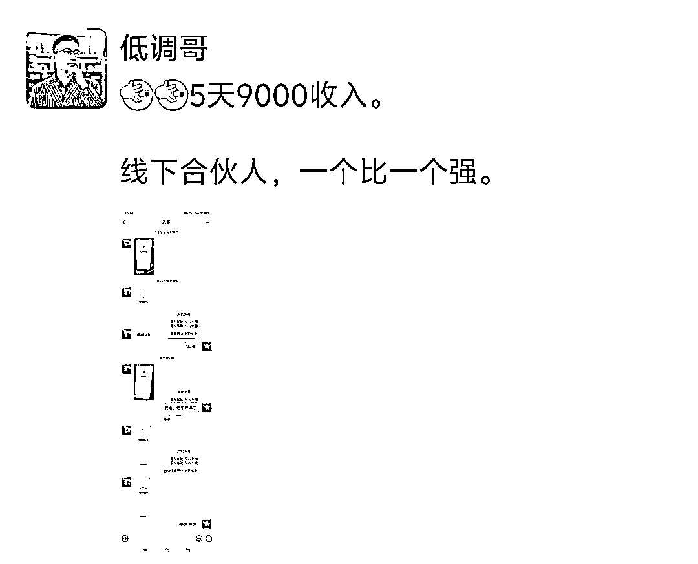

# 运用门徒模式，实现裂变式创业增长，团队从1-40+人，月盈利数十万。（运营1年半深度复盘拆解）

> 来源：[https://ryrl4oi6gq.feishu.cn/docx/JxBDdWGszo2M4PxGYCOciEynnkc](https://ryrl4oi6gq.feishu.cn/docx/JxBDdWGszo2M4PxGYCOciEynnkc)

此模式适用于大多数个体创业者向团队进行过渡。

极度适合超级个体IP创业者进行项目化，团队化经营。

本文深度给大家拆解，

一、低调团队从1-40人发展历程

二、门徒模式的深度筛选条件

三、手把手教你搭建裂变式团队【从0-100人模式】

四、裂变式创业模式发展的困难点

五、裂变式创业模式未来发展分析

本文写了8000+字详细的给大家深度复盘。

对于目前想要团队搭建和快速实现公司规模化放的朋友，可以深度阅读。

（内容目录截图）

# 一、从1-40人的发展历程

低调目前两家公司，杭州公司10+，秦皇岛公司人员30+，采取的都是门徒模式裂变式创业。

秦皇岛公司从事私域相关业务，杭州公司从事小红书培训，IP孵化等相关业务。

## 1、门徒模式诞生：从1-10人。

我是2022年7月份有了门徒模式做项目的想法，

我是创业小博主，公众号粉丝2万多人，私域2万多人。

是什么让我产生了做门徒模式的想法。2021-2022年我们从事拼多多电商，做了小3000+店铺，平台风控，项目倒闭。

我从湖南回到了河北秦皇岛，创业这么多年，不可能闲下来的。

机缘巧合我看到了抖音图文的引流模式，我线上安排我徒弟进行测试。

结果没几天一个作品爆了。

这个时候我敏感的意识到这是个不错的机会，于是和我这个徒弟说，你来秦皇岛和我一起做事吧。

当时我租了个场地，没有人，就我一个人，我的想法是项目测试好，招聘员工。

想了想不如先招募几个徒弟来进行测试，这样效果可能会更好。

我从粉丝当中筛选了4个徒弟，到了秦皇岛，开始测试项目。

这四个徒弟都是之前给我付过费，对我深度认可的人。

然后开始测试短视频的方法论，我们基本上打爆了几个平台。

抖音

小红书

视频号

这个过程中，从1个徒弟慢慢的到了10个徒弟。

## 2、危机来临：团队分崩离析。

阿米巴团队跑到半年的时候，一定会有一波危机，大多数团队都是死在了这个危机当中。

不是赚不到钱大家疲惫了，是枯燥的重复。

大多数徒弟们跟着我还是赚到钱了。

（图就不多晒了，有营销嫌疑）

但是，有些人是耐不住寂寞的，因为天天这么干，一般人熬不住。

我们是早上9点半，一直忙到晚上 10点，11点，每周休息1天，很多时候，基本都不休息。

大多数人，哪怕赚钱也进入了疲劳期。

其次流量波动，大家获取流量出现了大问题。

有些徒弟就说想要走了，于是接二连三的门徒离开。

第一批徒弟，最后只剩下了下了一个人，也是最初最早跟随我的人。

## 3、梳理架构，从新起盘

基本上大多数阿米巴团队，到这个阶段就宣布结束了，

从4-7月这三个月，是我最灰暗的三个月。

门徒们挨个离开，业务进行不下去，当时租的房子也要到期了。

总之，一切都是悲观的，我那时候深深地质疑自己。

但是创业这么久了，不可能认输的，我从新设计了一套新的架构，开始了新的测试。

新的模式，我称之为项目工厂模式。

1、筛选项目：利用自己的人脉资源，筛选身边的靠谱好项目。

2、项目测试：通过门徒阿米巴模式进行项目测试。

3、项目直营：测试成功的项目立马进入放大直营，实现项目最大化经营。

4、项目加盟：对于跑成功且利润可观的项目，进行项目招商线下学习。

5、开分公司：稳定持续盈利的项目给阿米巴成员实现分公司运营。

然后我重新开始招募了新的门徒，这次我招募了7个人加入，我准备了身边好朋友的三个项目进行测试。

深度测试，三个月，我们跑通了，家电团购项目。

然后安排门徒分组进行测试，赛马模式。

三个月时间从0到了月收益10万+。

## 4、门徒+直营模式

为什么门徒会走，因为一直是一个人做事，做的久了，累了自然疲惫。

如何让门徒赚的更多，还不会那么匹配，给门徒招募员工。

于是我们从去年的12月份开始，进入了新的模式阶段。

给门徒招聘员工，让门徒脱离一线执行层，到二线管理层。

同时采取小组模式，门徒成为组长，员工是组员，小组之间竞争。

秦皇岛目前这个模式跑的很顺畅，员工目前有了20+。

## 5、新公司，新模式

秦皇岛团队模式进入正轨，我选择了更高难度的挑战，我去杭州开了个新公司。

杭州公司和我徒弟合作，她去年在做小红书IP孵化，去年做了小百万的业绩。

然后我把我这套模式复制给她，然后安排她进行招募门徒，一样的模式复制。

我也招募了一些门徒来到杭州，把模式进行平移。

目前杭州团队人员10+。

模式很简单：

提供给门徒流量方法论，门徒们按照我们的方法去做内容，获取流量，流量获取之后，微信进行成交。

成交的产品不同，提成不同，无任何底薪，全是提成模式。

后续我们会切一些细分的项目盘，然后培养门徒成为项目负责人，然后配备员工。

如果杭州成本较高，有些项目直接落地秦皇岛。

秦皇岛公司成了项目孵化中心，测试项目。孵化项目。

杭州公司成了品牌运营中心，对接资源，扩大IP影响力。

# 二、门徒模式的筛选条件

上面的篇幅，我是特意少写一些，让大家有个直观认识，下面的内容才是更重点的内容。

## 1、为什么采取门徒模式。

门徒：其实就是徒弟，我们做的就是师徒制度。

为什么不是合伙人模式。合伙人是平级的。

师徒增加了更多的牵绊，也多了一层感情纽带。

虽然我和他们的年龄差不多，但是内心需要他们的深度认可。

## 2、门徒的深度筛选标准

我是筛选模式：付费+线下+线上面试

而且我收费的标准还不低，9980。

付费：代表投票，代表对你的认可，以及他的决心，

线下：我很多徒弟疫情的时候都跑过来，隔离什么的都遇到了，是真的深度认可，才会来到河北秦皇岛。这个北方小城。线上不要去考虑，很难出结果，线上协作是个伪命题

我筛选的条件很多：

①年龄要求：30岁以下，男女不限。

②线下办公：全职，常驻河北秦皇岛/浙江杭州，不接受兼职，不接受线上。

③资历要求：有一定的互联网项目基础。

④身体健康：无重大疾病，体重超过200斤的不要。

⑤吃苦耐劳：一天在项目上的时间是早9-晚9。12个小时在公司，熬不住的不要。

⑥执行力强：执行力差，玻璃心脆弱的不要来，公司不哄孩子。

⑦性格温和：性格偏激喜欢歪理邪说的不要，以自我为中心的不要。

⑧财务良好：有重大负债的不要，心态有很大的问题。

其次，生活自理，吃住自己安排。

中国师徒模式做的比较好的两个：德云社+东北民间艺术团。我们要学习这些前辈的经验。

这里面有个深度争议的点：无底薪。

很多人认为门徒模式是付费打工，是变相的压榨，的确圈内很多人讨论过这个话题。

其实我们就是深度筛选合适的人，而且也不是说我们要数量，我们要的是质量。

门徒模式，注重质量而不是数量，一个优秀的门徒能给你扛起来一个百万以上的项目。

我们需要的是合格有创业底子的人，而不是一个妈宝男，也不是一个只看中当下利益的人。

所以条件门槛越高，你才能筛选出优秀的人才。

你的发心：你未来要把他培养成年入百万的门徒，项目的负责人。

他的初心：我希望少走弯路，快速用三年的时间成长起来。

## 3、个体创业之殇

这个时代个体创业很难，现在都是阵地战。之前我记得在圈内看到过这样的一个内容。

创业很多事暗知识，是口口相传，你去回想下，你公司这一路做起来一定是某个大哥给了你管理框架，或者是问了多个大哥，你才具备了这个能力。

所以我吸引来的人，也是真的想和我学习本事的人，不是为了单纯的赚钱来加入你的团队。

他们看的更重要的是未来，是如何真正的学会公司化的管理和运作。

个体创业我希望你真的找个大哥，跟一跟，不要自己一个人做犟种。

不公司化，很难做出大结果，想要公司化，这其中有无数的坑需要踩。

创业路上的很多知识，是你书本上买不到的，比如很多人加了生财，感觉好像是百科全书，其实就是如此。

古代学艺三年，要给师傅白干三年活的，哪个成功的人不是一路荆棘密布的走过来的，不要只看眼前的利益。

今年我们团队年入50万以上的徒弟不会少于5人，我们秦皇岛团队的项目主管，一个是01的，一个是02的。

# 三、手把手教你搭建裂变式创业团队。

## 1、准备阶段

①项目准备

首先你要有个盈利的业务模型，月收益在2万左右。

项目最好有一定的小壁垒，没有也无所谓。

其次项目具备一定的可复制性，以及项目阳光正规。

②场地准备

你要有个办公场地，前期100平足够。

③粉丝基础

你要有一定的粉丝基础，大家对你有一定的认可度

哪怕你不是做IP的也无所谓，但是你的朋友圈打造的很好，大家愿意支持和认可你。

这是三个必要条件，缺一不可。

## 2、 门徒招募

①写一篇自我介绍：

注册公众号写一篇自我创业经历文章，让大家对你有个充分了解。

文章中最好提及一下目前在做的项目，

这篇文章写出去，一般反应都蛮不错的，大多数人都会点赞。

②更新创业进展，创建围观群。

可以在朋友圈更新自己的创业进展，或者是创建个围观群，进行展示。

③门徒招募文。

前面的都是铺垫，写出自己的招募计划。

文章结构：

我是谁

我在做什么

我未来的规划

我需要什么人加入

筛选条件

这其中很多小伙伴对收费这一块，肯定有一定的疑问。

给大家出几个方案参考。

丨押金模式

预付XXX元，多久没出结果，退还。

出了结果，每个月退还多少钱，比如收费1万，每个月退1000元。

丨收费模式

直接收费XXX元，按照自己的粉丝受众定价，建议不低于5000元。

丨分期模式

先付XXX元，赚钱后付XXX元。

④直播售卖

直播是最好的宣传形式，直观，具体

然后门徒到了迎接，吃饭，协助找住宿，这些就不展开说了，成年人都懂。

## 3、项目实操

①心态建设

你先要做个心理建设，可能刚招募门徒进来，你自己心理有点小紧张，不知道如何交往，不知道如何安排任务。

首先明确，师徒模式，我们就需要按照徒弟的标准去要求他，他来找你，你就是有他认可的内容，所以你就认真去带，认真去教。

②执行SOP

所有门徒进来，你必须有完整的培训方案，或者是你亲自手把手的去带。

最好是制定出标准化的项目SOP，来一个教一个这个模式太慢了。

对于一些操作比较难的环节，要把视频录制清楚。

## 4、门徒管理

我身边很多朋友复制我这个模式，都跑的变形了，无一例外，出错在这个地方。

没有规矩，认为徒弟来了，告诉做事就好了，不抓考勤，不抓管理。

慢慢的懈怠了，徒弟也不听话，自己也懈怠了。

我们公司为什么一直战斗力很强，来了必须定规矩。

①日报制度

每天必须写日报，日复一日的去写，每日自我复盘。

②考勤制度

严格考勤，不能迟到，不能早退，有事提前请假。

③周会制度

每周固定周会，去执行，去推进本周任务。

每周的周计划推进表

④乐捐制度

不写日报，迟到，违反公司规定，等等事项。

自己主动乐捐（罚款）

这个钱用来公司团建等使用。

我现在能做到每天中午到公司，其次我离开秦皇岛公司一个月照常运转，就是我们基础的框架和监管做的很好。

从进来就确定了规矩，大家都执行这个规矩。

线下是个场，什么氛围培养什么人，一个懈怠松散的团队，是没有任何战斗力的。

## 5、分钱制度

门徒分钱不要月度去分，我们都是周去分钱，当然看业务类型。

比如我们杭州团队这种，肯定是周去分钱，尤其是前期的时候

需要让徒弟看到希望，所以周去分钱更容易接受

其次分钱制度一碗水端平，所有人一样多。

但是要有一定的阶梯模式，晋升模式。

## 6、艰难三月

门徒模式最难得就是前三个月，

这个三个月分为三个阶段：

第一个月：业务培训期：这个阶段需要验证的一个点，那就是你的方法有效，取得一些为效果。

第二个月：业务培养期：这个阶段什么人能跑出来，你心里多半有个想法，那么需要深度培养标杆。

其次对于一些基础差的，需要深度辅导，让其下苦功夫，

第三个月：业务发展期：这个阶段标杆出来了，基本上业务也进入了成型阶段，大家也看到了旗帜。

## 7、人员扩张0-10

这个阶段还是招募阿米巴人员。

晒自己的标杆，晒自己的案例，晒自己的业务。

吸引更多的人加入，招募更优秀的人才加入。

这个阶段就是多晒朋友圈，多记录身边人的成长。

总之0-10这个阶段是超级简单的，一般第二次招募就能达到这个数值。

## 8、人员扩张10-30

真正最难得是这个阶段，因为这个阶段需要加自营。

为什么我采用了门徒+自营的模式。

因为门徒哪怕走了。我们业务不会停止运营。而且后续新的门徒可以直接顶上去，接手他的员工。

其次门徒模式把利润分出去了很多。自营模式可以实现利润最大化、

但是在开展自营模式之前，还是需要做一些基础准备

①核心门徒：业绩出色门徒3人

②场地准备：容纳30人的场地

③设备准备：手机，电脑，桌椅板凳，等等。

④项目SOP：傻瓜式教学SOP，小白入门版SOP，视频化，图文化。

⑤财务监管：所有的入账一定是从你这里，

⑥薪资标准：制定好薪资标准框架

三线是福地，工资3000+随便招聘，其实我们的业务没想的那么复杂，三线城市的人员一样做的起来。

最核心的还是中层人员的缺乏。

⑦人事招聘：如果想快速上人要有HR

我们现在的HR就不错，10多天招募了100+的面试人员。

⑧人员分组：给门徒安排任务，员工分组，员工培训。

我们现在都是HR 和门徒一起面试，然后门徒们分配员工，然后安排集中培训。

⑨深度筛选：

员工要深度筛选，不要有培养思维，

我们为什么招聘那么多，因为我们需要深度筛选，不合适直接就劝退了。

基本上三个月筛选下来，公司30人就可以达到。

## 9、人员扩张30-100人

①复制思维

这个阶段其实就是复制思维，你需要在开拓个新项目，然后从老门徒当中筛选1-2个负责的人进行测试。

然后测试成功，继续复制，按照10-30人的模式重新来一遍。

②项目筛选

其次多个项目的选择不是盲目选择，去年这个阶段我踩了很大的坑。

我们每个人的能力半径就那么大，我们要选择我们看得懂的项目。

其次选择有积累性的项目，秦皇岛我未来的布局就是私域项目。

杭州团队布局的就是培训和IP相关的业务。

因为这两个是我比较熟悉的领域。

去年我安排门徒测试了很多项目，失败了很多。

所以我特意还自己制定了个表格，深度的去筛选项目。

不能胡乱下决策，尤其是公司在扩张阶段，这个时候需要绝对的谨慎。

更不能胡乱的加项目，每加一个项目，我们都需要深度决策，和门徒们多开会沟通。

这个地方是我这一年多踩坑最多的地方。

③组织文化

公司到了30人以上一定要明确你们的组织文化，如果你不去明确，那么你的团队一定会出很大的问题。

我今年开年就定下了公司的企业文化。

企业文化不是空话，是真正可以落地下去的，建议大家参考海参哥公司的企业文化。

极度简单，极度好用。

④员工体系

员工日常的管理体系，我们现在也设计好了，采取积分制管理，日常工作行为换取积分，积分兑换假期，金钱等。

以及员工的晋升体系：我们公司采取的是双通道模式，专业晋升和职位晋升。做过公司的基本都懂。

⑤监管体系

这个阶段公司需要财务，人事，行政，以及，公司内部需要有绝对靠谱的自己人。

尤其要监管好财务体系，人多了不代表利润就上去了，需要时刻关注项目波动情况。

门徒模式厉害的点其实在这个阶段已经出来了。

你会发现，你不需要深度参与管理，

业务上他们可以开拓创新，

管理上他们会监管员工

财务上我们进行深度把控，

目前我们秦皇岛团队也就进入了这个状态，我不需要深度参与管理。

每个月我只需要和他们算算账，分分钱，现在这个事情我也打算安排个核心人员进行负责。

真正的实现了自动化运作，而且高速发展。

# 四、裂变式创业模式发展的困难点

## 1、门徒难招募

很多人很喜欢这个模式，但是很难招募到合适的门徒。

门徒一半在筛选，一半在培养。谁都找不到绝对符合心意的人

所以不要有一种伯乐相马的心态，给他们足够的成长空间。

## 2、门徒个人实力过强，难以驾驭

这个问题我遇到过不止一次，尤其是00后，个性很强。

首先你要明确你的底线，那些是不能触碰的

其次你要明确你可以妥协的点，那些是可以妥协的。

当你明确了这些问题之后，你就轻松了很多。

我们要眼睛容得下沙子，能力强的人，一定有性格。

小绵羊没有性格，但是这种人你没办法开拓创新。

## 3、不敢去运用这个模式，担心门徒闹事。

我朋友的确用这个模式出过问题，但是主要是他不会管理。

首先你要线上严格筛选，不合适的人不要加入到团队当中。

如果你只收钱，什么人都进来，你这个不是门徒模式，你是招商模式。

你把这个当成了盈利项目，那你一定会出问题。

## 4、关注门徒状态，了解家庭信息。

他们大老远找到你，家庭的支持很重要，我每次都问他们家里的支持情况。

而且重要节日，我都会给他们父母买东西。让他们家中放心。

其次关注他的情绪情况，有问题及时沟通。

## 5、门徒进入疲劳期，想离开如何应对。

大多数人三个月就很快的进入了疲劳期

不是他赚了多少钱，就不会疲劳。

是他做事太久了，想休息了

适当的进行团建，带他们去玩，或者是出去喝酒。

其次聊天进行心理疏导

以及确定新的目标，定下更高的目标。

很多时候为什么疲劳，是没有了新的目标。

为什么我们现在采取门徒+自营模式。

因为大家都会进入疲劳期，让员工做事，他就可以适当的闲下来，没那么累了。

人才不同阶段的用途是不同的。

对于一些真的想走的，就是说什么都没有效果的，还是让提前走，要不然留下来会破坏整个团队氛围。

会带走你的一片人。

## 6、什么项目适合门徒模式

有IP影响力的博主，最适合这个模式。

无论是帮助你去做销售，还是去做流量，以及去做项目，都很适合。

其次有稳定项目的老板，希望实现低成本运作。

最好是流量型的项目团队，特别合适。

平台型的团队不是不适合，是很容易平台波动崩盘。

# 五、裂变式发展模式总结和思考。

## 1、做模式而不是做公司。

做公司越做越累，做模式越做越轻松。

低调这一路不断地探索，历经1年半我也走出了属于我的自己得创业发展模式。

1.0：IP＋项目＋门徒

通过IP挖掘出身边合适的项目，然后通过招募门徒进行测试，把项目快速测试成功，然后进行放大。

这个阶段有两个难点：

①筛选到合适的门徒：

执行力强，认可度高，能扛能打，思维性好。

先后我招募了很多门徒，真正符合这几点的少之又少，千金易得，一将难求。

这样的门徒不需要多2-3个就可以把一个项目跑通。

②筛选到合适的项目

去年我们测试了不少的项目，但是失败居多，我是深度的进行复盘的。

甚至今年为了筛选项目，我特意做了一个表格，接下来的项目选择按照表格去理性分析，再进行研发。

合适的项目和合适的人才，两者相辅相成。

不过目前针对于团队我心中有了大概的项目适合的模型，而且随着现有项目的不断放大，也会不断地筛选同类型的项目进行迭代。

目前看好的几条线路：

私域线路：长期不断地屯私域，增加自己的管道收入。

积累线路：找到可持续，可积累的项目。

培训线路：围绕IP，进行课程研发，和不断地扩充IP私域。

2.0：项目＋门徒＋直营

我们和外面的门徒机制不同之处在于，我们给门徒配备员工。

任何人做项目都有疲劳期，随着门徒实力的提升，会给招募员工，进行业务放大，从业务层过渡到管理层， 而且门徒的收入会呈现直线上升。

这个阶段门徒是赚大头，我赚小头。

这种模式是圈内很少有人敢去做的，因为需要极强的管理能力和对业务的要求也很高。

3.0：加盟＋分公司

这一步目前还没去做，目前有这个想法，把我们成熟的模式，进行复制，项目工厂现在不是落地杭州开新的公司，后续有想法的朋友可以聊合作。

## 2、自动管理，结果导向。

我做的是小组模式，重心还是抓门徒，我推崇的管理方案是自动化管理。

公司的整套管理架构，我做好之后，需要的是自动运转，而不是我是一个救火队员。

结果导向，这个员工不合适亏的是门徒的钱，他自己会优化掉。

他比我了解业务，他自己知道该招募什么属性的人，我需要做是引导他如何做好管理。同时管理我信奉的是无为，我不过多干预，从结果导向出发即可。

抓好门徒的管理管好财务情况，更多的给他们更大的舞台。

## 3、坚信未来更好

我为什么践行现在这个模式，因为我看到了两个成功案例。

①螃蟹王国

②海参

这两个人是给我启发最大的两个人。

我们公司今年达到50-100的规模问题不是很大，月营收百万也是迟早的事情。

三个优秀门徒+一个好项目=30人的团队。

这个模式真的厉害的点，很多老板其实可能没看懂，是复制能力。

其次这个模式可以让我们实现自动化管理，我们可以无限控盘。

为什么你赚不到那么多钱，因为你的时间和精力有限，你只能一个人做好一件事。

无限复制，无限上量，这才是我们需要深度思考的模式。

100人的员工=1000万利润

1000个员工=1亿利润

这是一个不可逆的规律，适用于大多数行业。

海参为什么能短时间公司做到了千人，背后就是他背后的门徒阿米巴模式，所以甩开了那么做自营的博主。

所以组织的机动性和复制性，在一个红利市场面前格外的重要。

现在是阵地战的时代，不是小米加步枪游击战，所以谁的阵地足够大，谁的优势足够强。

本篇文章希望给各位老板一定的启发，大家可以评论区留言，看到会给大家进行回复。

后续可以针对于大家的提问，再出一篇答疑贴。

拓展阅读【龙珠文章】

①商业顶层设计：从百万到千万:

https://wx.zsxq.com/dweb2/index/topic_detail/412511251481528

②如何做个高效率且赚钱的 IP？

https://wx.zsxq.com/dweb2/index/topic_detail/415581554228228

③极简致富创业思考（看懂少走10年弯路）

https://wx.zsxq.com/dweb2/index/topic_detail/585244142288214

④5人团队20万起盘一年翻15倍，每月持续盈利30万+背后的项目操盘拆解。

https://wx.zsxq.com/dweb2/index/topic_detail/418524181584588

⑤资深创业老司机传授抱大腿方法论

https://wx.zsxq.com/dweb2/index/topic_detail/582282125424214