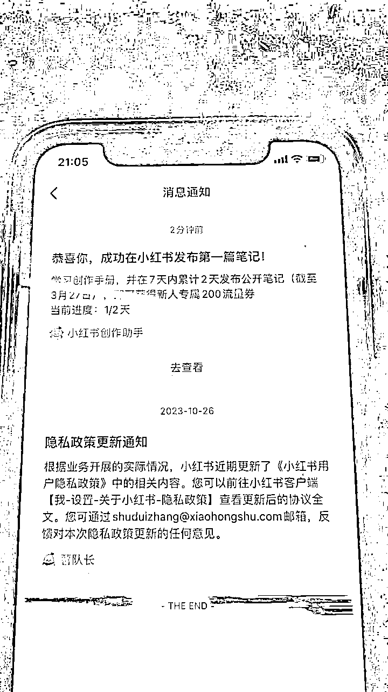
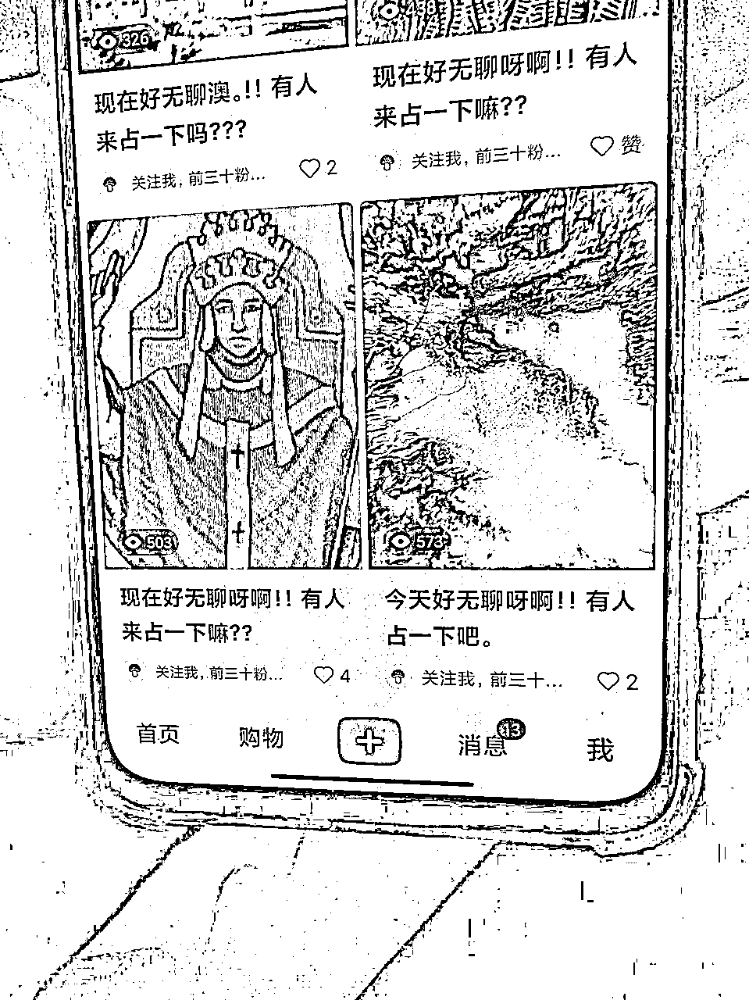
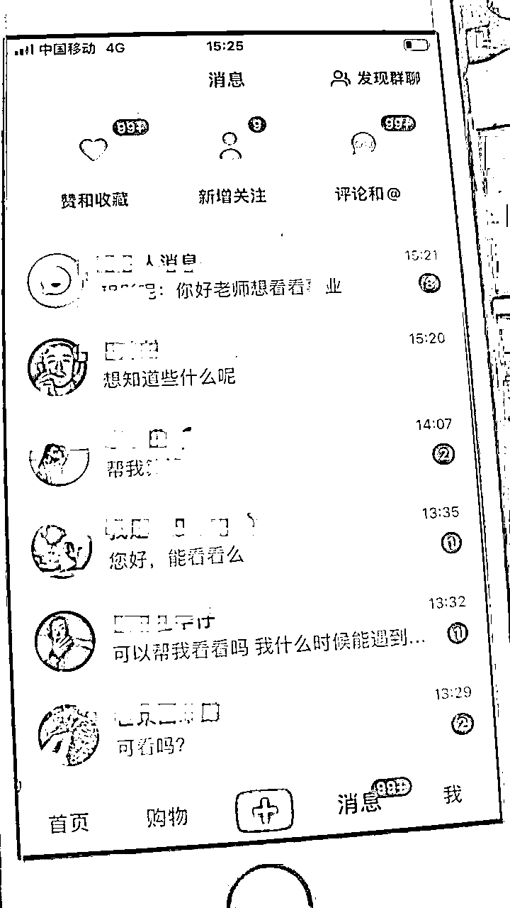
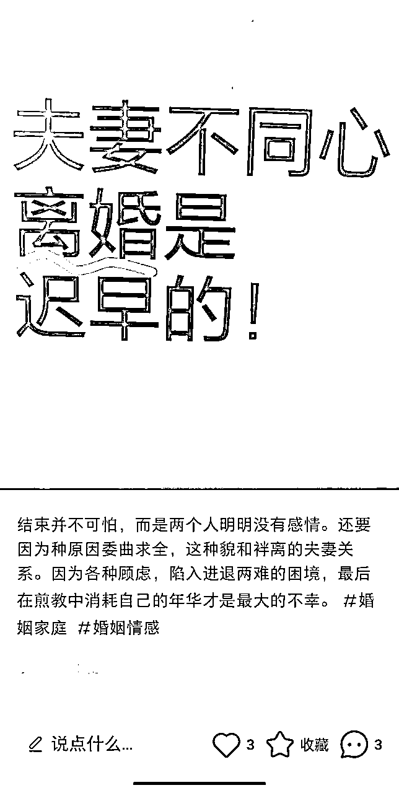
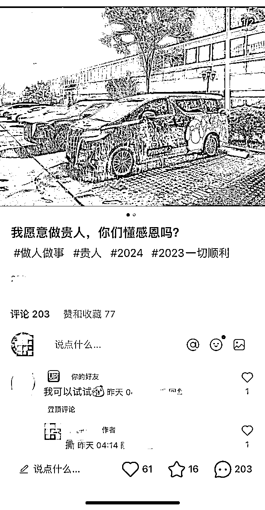
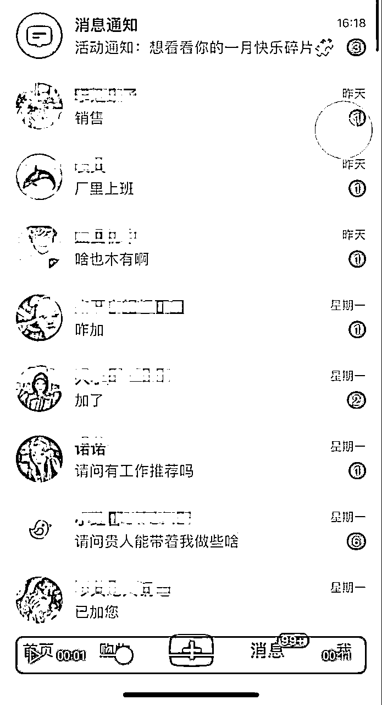
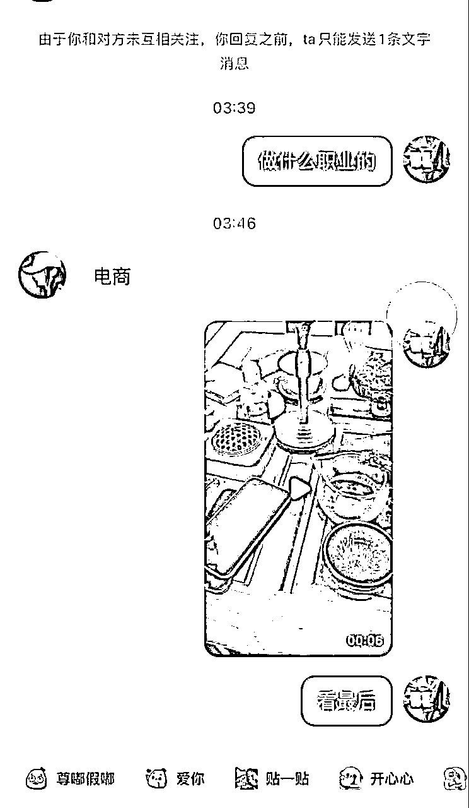
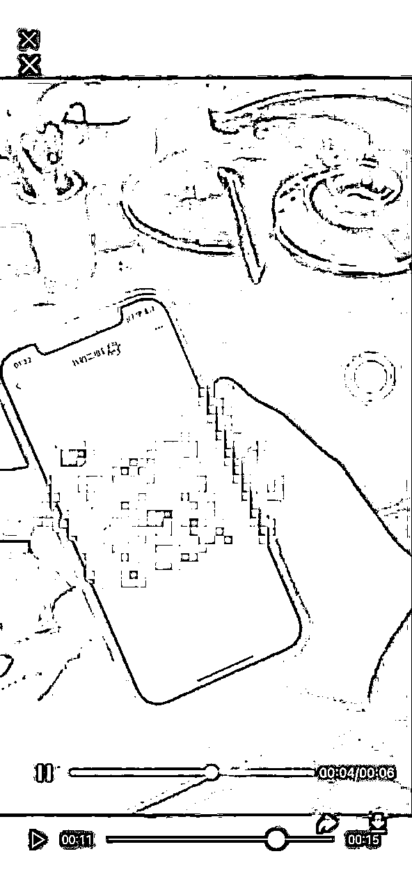

# 小红书全域引流实战保姆级教程

> 来源：[https://gcgmtxu52n.feishu.cn/docx/KLLhdEcfqoQm2bx5YwGcyPuVnDg](https://gcgmtxu52n.feishu.cn/docx/KLLhdEcfqoQm2bx5YwGcyPuVnDg)

小红书是目前做流量最容易的平台，任何赛道都能在小红书拿到结果。为什么这么说？因为所有平台都有周期性，小红书成本低，但是见效快，可能10分钟就可能上十几个粉，如果按出粉的逻辑，10分钟可能就赚几百了。我讲一下小红书打法，小红书它比较细，平台规则也比较严，但是他的粉丝质量比较好，有64%的是女性用户，她们都是高付费用用户。但是小红书的年龄段是卡的比较死的，超过40岁的不会太多。

小红书引流最核心三点：

1，设备 网络 账号

2，模板 文案

3，引流规避

一：设备网络账号

首先小红书比较严吃设备、网络、账号，这三缺一不可，特别是账号，账号为天，前期只要准备保证它干净的设备，苹果安卓都可以，然后网络最好是全国跳流量卡，因为它可以避免这个IP不干净的问题。 基本的账号设备网络解决，大家应该都是没有问题的。

小红书是不需要养号的一个平台，这样下来减少了非常多的周期性，可把玩性非常的强，我们很多时候 一部手机一天上十个账号，刷十次 ，每个账号都能有他的产值，相比于抖音，快手养号实名核对来说，周期少了。很多时候我们最大的成本不是钱，而是人工是时间。（补充一点，关于是否养号这一论点，还是按具体实操情况而定，稳妥起见还是可以放个一两天在动）

重点账号，一个账号成本5块左右，他分拦截接码的跟地推的，目前地推是最稳的，放24个小时，他基本就能出恭喜加热。

小红书平台这个规则来说比其他任何平台都要严格，第一就是活号，出恭喜，然后作品加热问题。 小红书以账号为天，私人老号来说权重最高。

一个账号只要他正常可以出恭喜，能让作品加热就ok了。

二：模板文案

前期工作准备好后，就是素材模板了。小红书比较吃标题文案。

基本逻辑和准备要求讲完，下面我详细说下关于引流。模板的打法思路分快速流和长尾流量打法。拿国学举例

图片可以是头像风景或者手写打印你的内容标题+固定文案。这种就是快速流量模板，适合快速进粉，账号没问题可以加热 ，直接一比一模板文字标题 ，目前很多打粉团队 一个号产值10几个粉没什么问题， 百来个设备一天能轮换几遍 。提前准备好素材 文案 基本就能sop化了

这种账号存活率不高，纯纯的废号流打法，节奏快，产出快，转化快。

这类就适合做长尾流量，人群客单都比较高，国学细分很多赛道，这里只是拿些常用模板给大家做举例。模板是千变万化的！ 更新迭代比较快，一般都是一段时间内不好用了，就换。

这里有个自己去找赛道模板的技巧，就是平台搜索自己赛道关键词，然后查找最新最热的内容，精细化一点去对标账号评论区内看一下用户留言，就能调研出当前模板引流够不够精准了，之后就是复制。

三：引流规避

很多圈友都会头疼小红书私信引流封号的问题，这里讲下规避技巧。拿兼职粉引流举例，

这个兼职粉模板评论200条，私信100条。

小红书这个导流不被封的逻辑非常简单，第一就是你要让平台觉得你们俩是朋友 能正常聊天，不要上来就发联系方式，被判定营销号。

正好在聊的过程中也可以当做对你人群的一个调研，便于更好成交，一举两得。

甩联系方式方法是发视频给他。逻辑就是先拍到其他地方 然后你再放到二维码或者本子写微信号 可以规避官方 而且举报也没有用。

随意拍个几秒钟视频，把联系方式放最后让他看到加你。这样操作下来，90％不被封号。

以上就是给大家分享的关于小红书引流得一个保姆级实战教程。把这几个重点掌握在加以实战，以后你就是这个领域的流量专家！