# AI励志短视频，跑车游艇豪宅全新赛道

> 来源：[https://dik4wr1hyrw.feishu.cn/docx/L3ZPdTTetojnlax5L0JceNirnWb](https://dik4wr1hyrw.feishu.cn/docx/L3ZPdTTetojnlax5L0JceNirnWb)

最近几天刷视频刷到励志类的短视频，是配上跑车游艇豪宅类的，可以说是全新的赛道。

既然发现了，肯定要研究怎么做的，明眼人一看应该就会，素材+文案+配音，上手超简单。

## 励志短视频素材

无版权素材网站Pexels https://www.pexels.com/ 比如我们想要跑车短视频素材，直接搜索就可以下载。

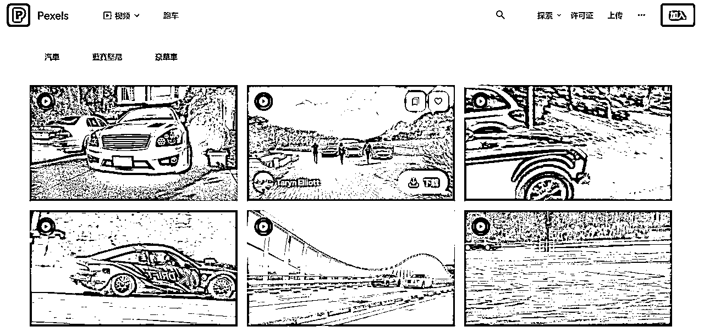

用无版权素材也有一个问题，用的多了容易撞车，也可以把油管上的跑车视频搬来国内用，撞车的几率会小点。

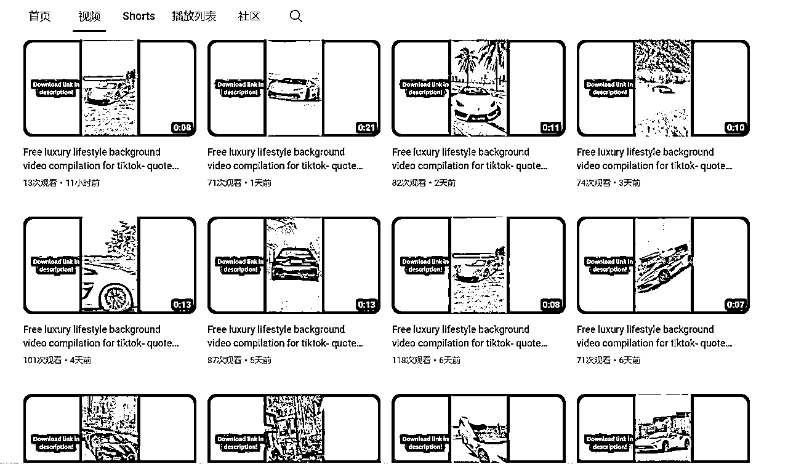

## 短视频文案

说到文案肯定想都不用想，用ChatGPT全部搞定。

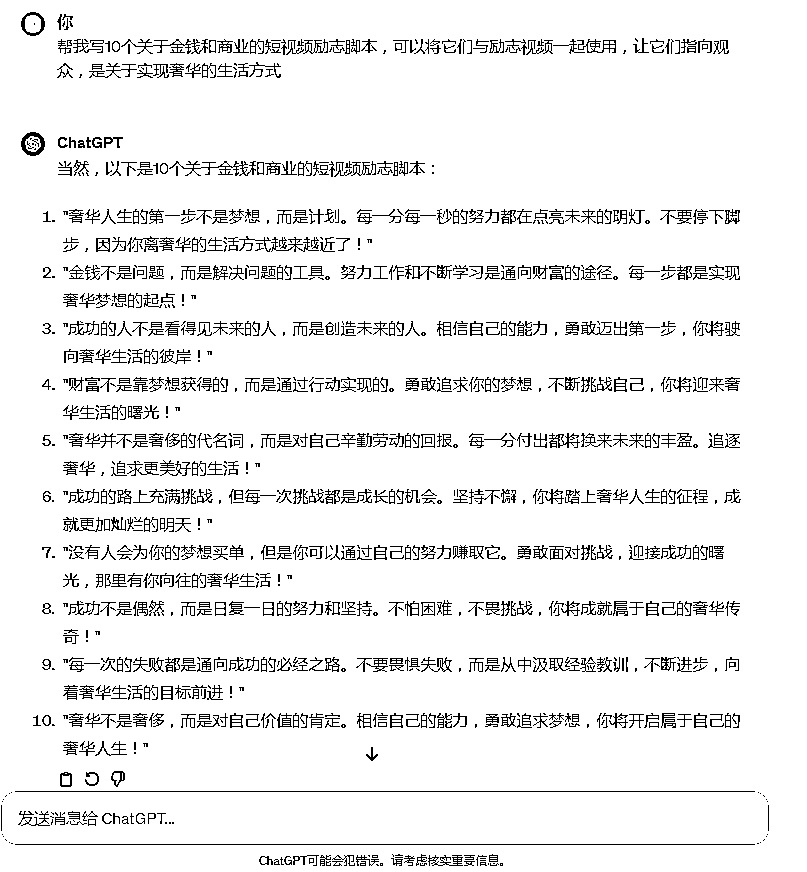

## 视频剪辑+配音

视频剪辑，配音用剪映可以全部搞定，把下载的素材导入剪映拉入轨道。

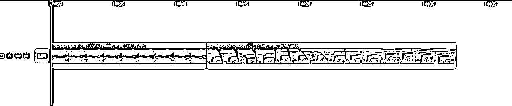

第一步，调整短视频比例，显示9:16

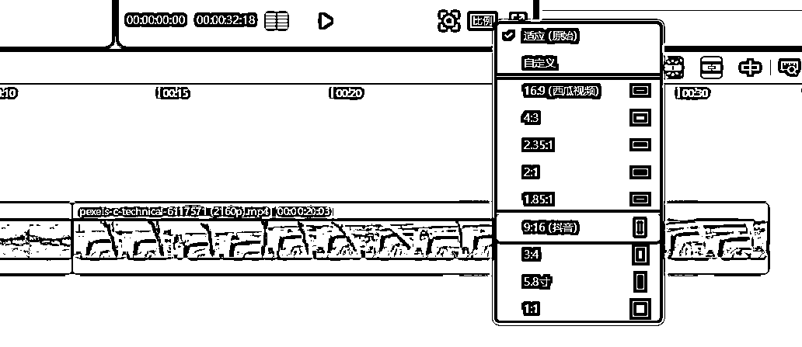

我们可以看到用9:16后短视频不适配了，我们拉动视频四角让视频适配屏幕。

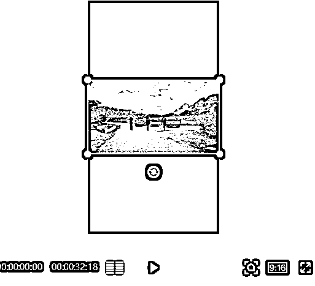

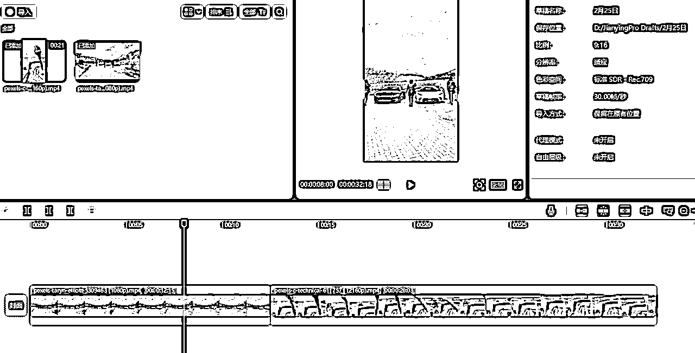

第二步，我们调整短视频的时长，点击视频向左拉动即可缩短时长，因为我用的片段少所以不调整，最好总时长保持在1分钟以内。

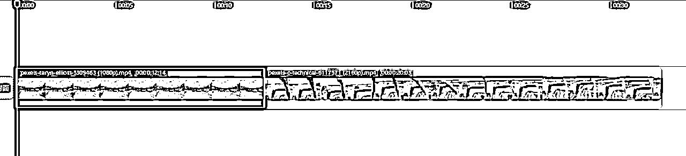

第三步，调整视频的整体亮度，来表现出视频深沉，激励的氛围。调节视频的饱和度为-50左右，亮度为1左右。

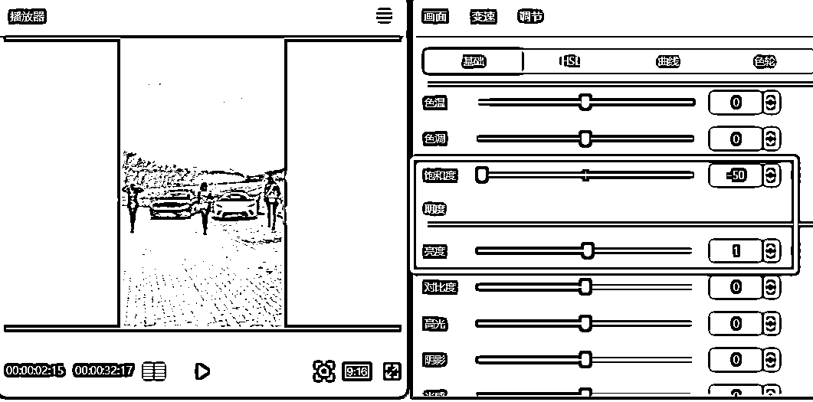

第四步，添加转场，选择一个转场拉到两个视频衔接处即可。

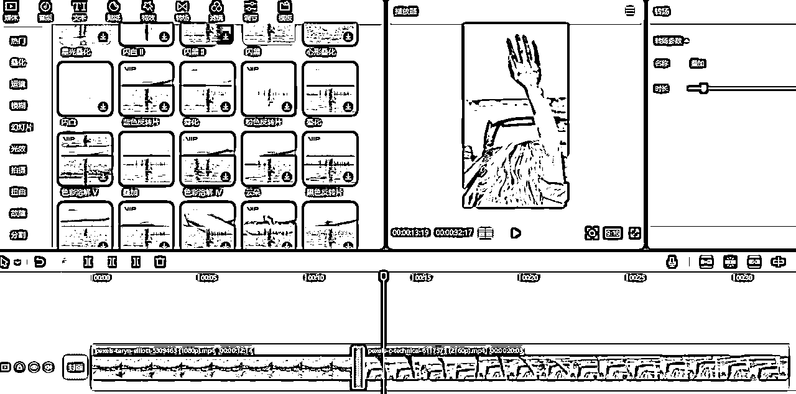

第五步，添加文案字幕，依次把文案添加到轨道，与视频平齐。

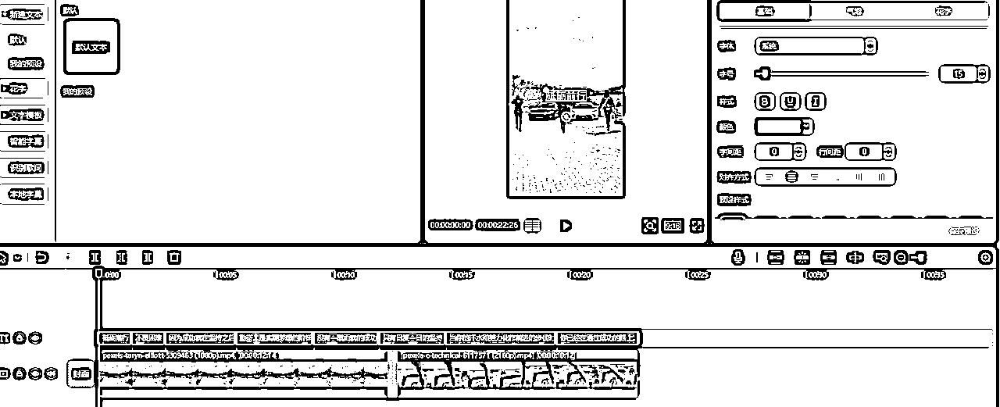

第六步，文案配音，全选文案，点击朗读，选择音效开始朗读。

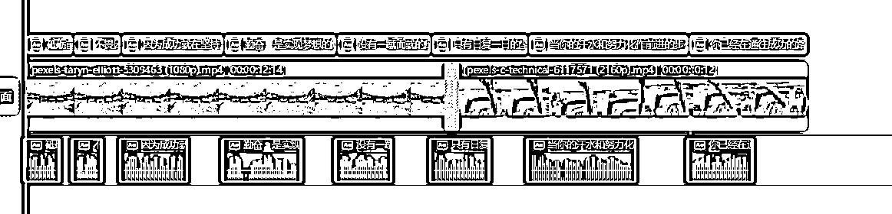

至此，整个励志短视频就完成了，后续不用重新制作，右键替换片段即可更换视频素材，再更换文案和配音即可。

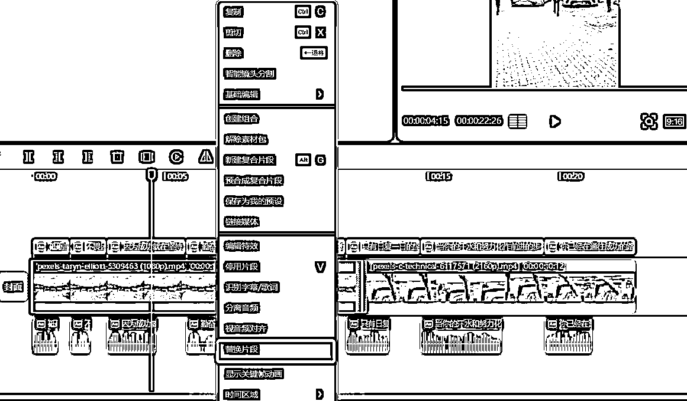