# 保姆级省流极速公众号爆文0-1上手攻略，无ai，新人基础提速版（含口述10分钟出文教学）

> 来源：[https://xcozwbpl16.feishu.cn/docx/Ll7xdUlHdoRkyjxdNRUcLJm1nIc](https://xcozwbpl16.feishu.cn/docx/Ll7xdUlHdoRkyjxdNRUcLJm1nIc)

## 文档由来的简单介绍

大家好我是兔子鱼，很荣幸在12月航海和3月航海中担任公众号教练，在往期公众号航海中发现很多船员存在拖延症的问题，可能一方面也是怕开始，觉得一下子要学的太多，索性这次出一套省流版，直接从基础了解到找素材写（口述）文章一应俱全的直白展现给大家，希望能鼓励更多的船员、圈友在3月的航行中可以开始实践

## 公众号爆文的赚钱逻辑

读者点击广告，文中+底部最多是3条广告，所以阅读量越高，相对而言能被点击到的概率就越大（500粉开通流量主）

## 开启赚钱第一步——注册账号

如果想要降低焦虑就多起号，同学朋友亲戚的都可以借用一下，这是最安全的

## 开通流量主

这里划重点！！500粉才可以开流量主！！！100粉是带货！！！500粉不要傻乎乎自己等着涨粉！！shua！！目前暂时40-50yuan不要省！

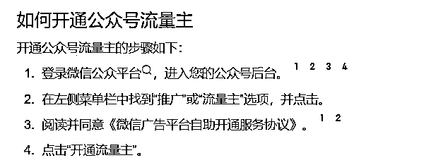

## 有号了做什么？

决定做什么领域，近期就要勤奋的刷，找到订阅号助手，不停地刷，找到自己感兴趣的领域，多点这类基本推的都是这一类号，手动刷真的不要嫌麻烦，你问大佬真的还是会保留这个习惯

其次就是次幂数据（付费，新人先不考虑）

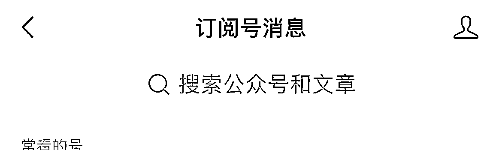

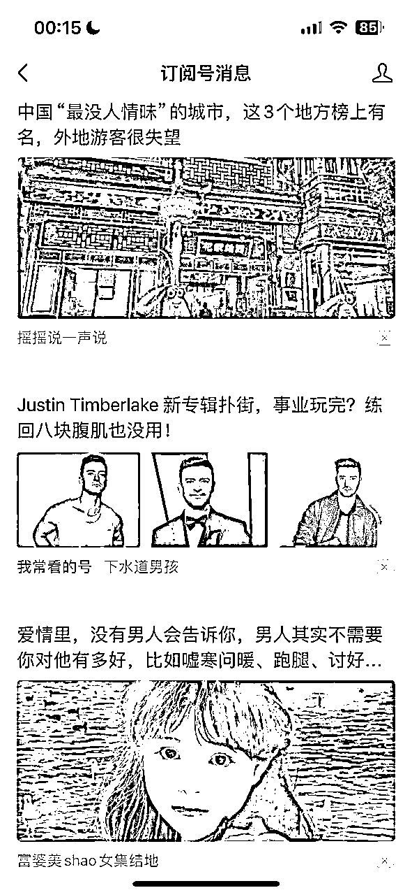

## 什么是口述文章？

口述和手搓差别不算大，只是把打字的方式改变成用嘴巴说节省时间，口述文章的思路就相当于你抄作文选，我们只能把作文选用作参考，但是不能照抄

书上写“今天阳光明媚，妈妈带我去动物园玩，我第一次见到长颈鹿好高兴啊！”

用作自己的“4月15日是我的生日，妈妈说奖励我带我去了动物园，暖洋洋的太阳照在我身上，太阳公公也在为我高兴，我还见到了电视上才看到过的长颈鹿给他喂了树叶呢！”

大概就可以这样来理解~别人的文章是作文模板，你口述出来的是改版

## 口述文章的准备工作

很简单，就是一部手机，我喜欢用讯飞语记（咸鱼买的），大家习惯什么都可以用，讯飞语记的话使用到“录音速记”这个功能

## 口述视频教学

领域很多很难全部都教，只能给到一个口述过程进行参考，任何领域都是大同小异，为了比较真实的展现，口述过程并未经过任何剪切一镜到底，给到的素材是公众号猎聘里的一篇《消失在职场的35+人，都去哪儿了》，可以找到原文章配合视频观看

我一开始也做不到这么熟练，有段时间是经常要产4000字长文（ai还未如此智能），手打字实在很累于是每天口述几篇长文，就这样练出来了，如论做什么都是需要逼一下自己，好处就是现在我什么类型的文章可能都能用这样的表现方式，非常适合新手小白来学习

## 文章产出了下一步怎么发

你需要去发布，选择图文消息，我还是按照教学里的文章来进行，把口述完的文章复制到公众号里，进行简单的润色排版，图片可以找贴合文章内容的，我习惯百度找不漏正脸的或者生活一点的

案例展示的是最基础！如果要精细一些也可以用135编辑器，秀米编辑器，96编辑器等等

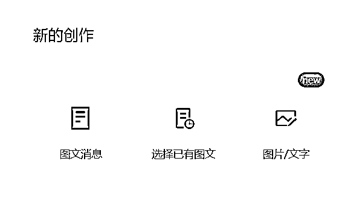

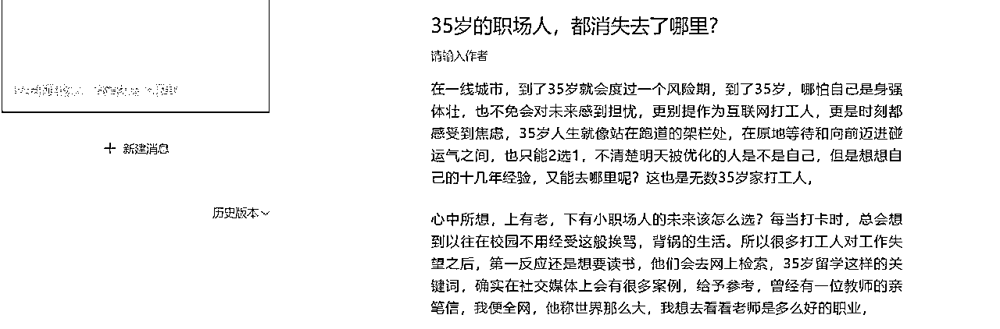

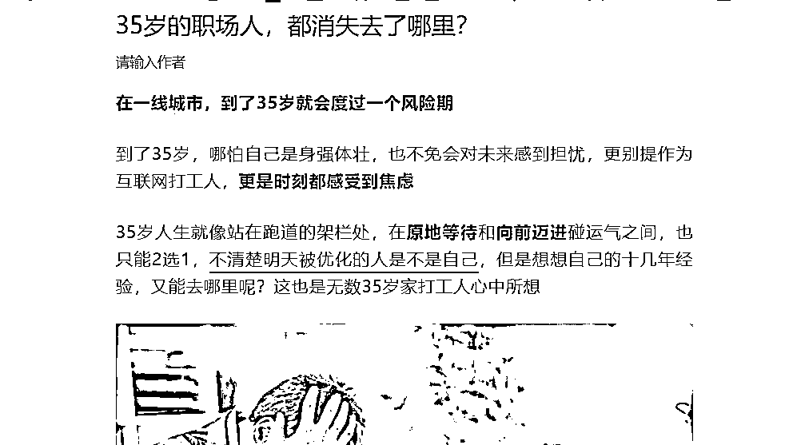

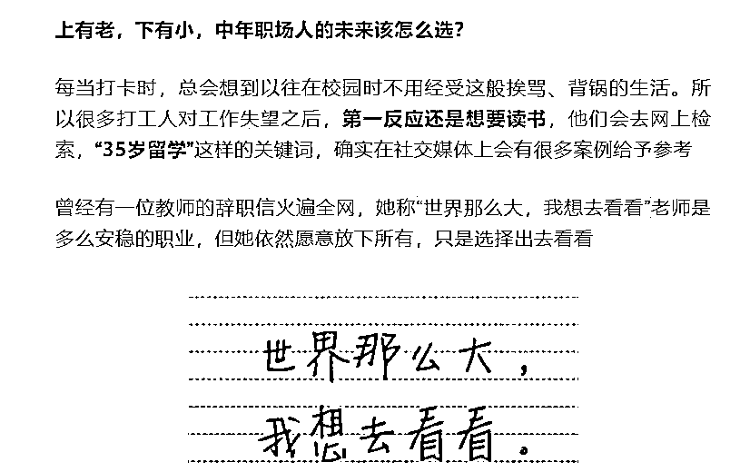

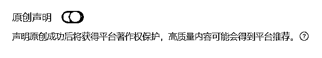

原创声明记得打开，关乎你的钱！

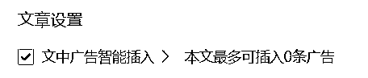

文章尽量900+字，那基本可以插入2条广告，广告插入多肯定是能被点到更多钱更多

稍微少一点也可以插入往期回顾的链接凑字数，找到超链接插入你的往期文章

如果发现1000字还只有1条广告，试着删掉点图片和把分段变多一点

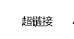

## 如何发次条？

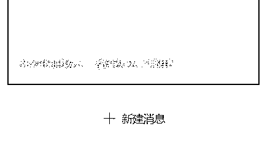

点击新建消息即可

## 总结

到此就是公众号最基础的从注册到出文到发布的流程，静待花开

希望在3月的航海中，大家能找到属于自己适合的方法，可以手搓，可以口述，可以ai，能开始去做就是成功

另外因为是省流版！！很多细节都是没有的！！实际操作还要配合航海手册会更详细一些！！

完全还没有接触过公众号的圈友/船员希望看完这篇文章会有所收获请不要吝啬你的小赞赞