# 做转化的核心 —— 文案（亚马逊版）

> 来源：[https://infinitereshaping.feishu.cn/docx/MQkAd1uHfoukU8xr83ZcgqKInjg](https://infinitereshaping.feishu.cn/docx/MQkAd1uHfoukU8xr83ZcgqKInjg)

我叫小紫，今年是我在跨境电商行业的第七年了。

从0-1做过千单爆款，转化率高达79.3%。

目前是多家深圳跨境亿级卖家企业顾问。

我不定期会给大家分享一下专业知识，当作对自己的一个沉淀。

上次和大家分享了亚马逊如何做图片。

今天准备和大家继续转化的话题，聊聊文案的重要性。

* * *

# 1、文案如何排序?

其实，在做文案的时候，

大家最问得最多得问题，就是：

标题怎么写？五点怎么写？埋词怎么埋？

这些对运营来讲，其实都是一些基础。

一个成熟的运营，一定要学会抓住核心卖点，然后突出展示。

抓住核心卖点之后，按照客户关注点先后排列即可。

抓住核心卖点，也很简单。

前期做完整的用户调研、人群分析、市场分析、竞品分析...

这一整套，在精细化运营里面，都称之为“市场调研”。

只要做好了市场调研，你就会明确你的五点写什么，

哪个卖点应该放前面，标题前80个字符应该重点突出什么内容等等...

除此之外，

还有一种更直接的方法，

俗话说的好，“站在站在巨人的肩膀上，猪也能飞”。

我们可以把BS榜单前30的竞品卖点全都copy到一个表格里，

然后，分析他们卖点12345分别写的是什么

最后，取其精华去其糟粕，

写的好的记录下来作为参考，再整合到自己的五点描述里去。

我们也整合过一份通用的版本，在这里分享给大家

第一点：突出产品最核心的特点，或者是与市场形成差异化，人无我有，人有我优的点

例如：超大的电池容量、全适配性

第二点：重要卖点1，高性能处理器、流畅运行、轻松操作...

第三点：重要卖点2，创新设计，独特外观、便携性、高效、时尚...

第四点：重要卖点3，带入场景，让买家更加感同身受，智能化、个性化、人体工学、贴心助手...

第五点：转化的三要素可以总结为：激发兴趣->建立信任->立刻下单

因此，在最后一个卖点，我们聚焦产品的综合优势的同时，在最后一个卖点，

一定要写上促使买家放下顾忌直接购买的句子。

类似产品明细和售后服务的说明，来打消买家的疑虑。

这是我们团队总结的一套常用思路，

大家可以直接套用。

# 2、文案如何埋词？

亚马逊就像是一个大型的数据库，

根据你listing埋的关键词，匹配相应的流量给你。

亚马逊 “关键词” 本质遵循TF- IDF算法。

TF，表示词条在文本中出现的频率。

IDF，表示关键词的普遍程度。

这就要求我们在埋词的时候，

对 词的选择、词的频率 要有一定的把控。

### 词的选择

这里我给大家列举出，我平时的一些拓词思路

• 平台竞品：Amazon竞品的listing标题卖点中提取，词频工具，关键词密度等参考。

• 其他竞品：同类电商网站，独立网站等

• 客户思维：从客户的角度思考，看看会搜索什么词

• Review & FAQ：提炼分类关键词 （核心，差异，高频，设备适配性，长尾，场景，惯用错别字等）

• CPC 广告报表 Search Term Report（直观了解当地市场用词习惯的重要途径：Hub-ladron）

• 亚马逊前台search bar（A-Z原则）

• Amazon choice keywords（可遇不可求）

• 关键词工具 (BA,Google AdWords, Merchant Words等)

• 论坛或者TT，YouTube等社媒渠道

• 相关行业主流媒体，行业信息和动态（MacBook，MBP）

• 实事新闻的流量热词

• 季节性关键词：如果所卖产品适合节日使用或送人，可在关键词中加入与节假日相关词组，比如圣诞节、万圣节、黑色星期五、网络星期一等

以上都可以成为我们拓词的方向，

通过对关键词的获取与整合后，我们可以对关键词进行分组，

从而精细化管理关键词，来更好的配合推广计划和广告节奏，

提前筛选掉一些不精准的关键词，找到最合适我们现阶段的关键词去投入。

关键词的分组有很多种方式，这里我推荐：流量大小、精准与否、词根组成来分组;

对于一些复杂的词，也可以按照属性区分，最终只要做到对这些词的重要性有数，就可以了。

下图是我常用的分组方式，这样筛选出来的词，首先可以去掉不精确的大词,

其次可以按照不同的推广阶段，有效地进行二次使用和筛选。

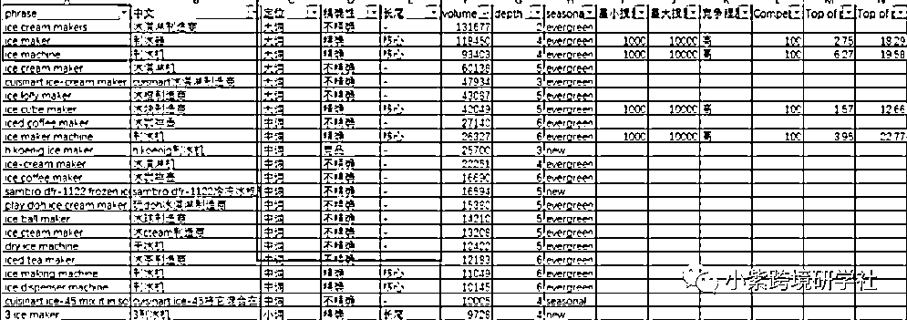

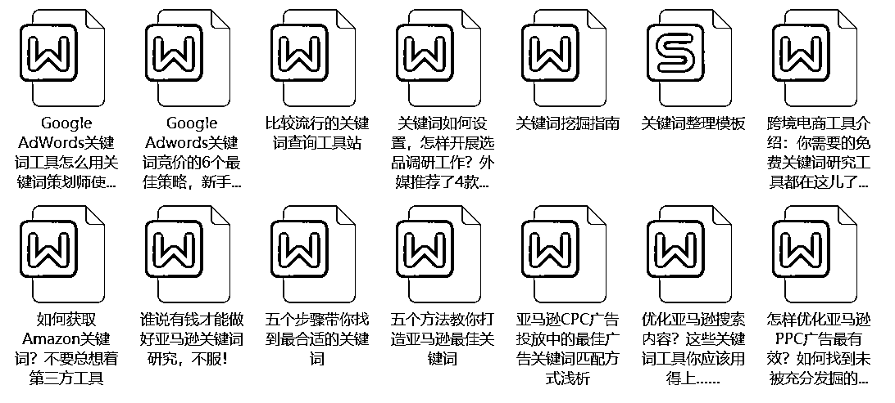

🎁（备注 文案攻略）附赠截图表格🎁

### 词的频率

关键词在文案中出现次数越多，曝光越大。

哪些地方我们可以埋词？

标题、五点、描述、more detail、后台ST、图片、A+、RV、QA...

只要后台课填写的地方，我们都可以埋词，只是权重有所区分。

标题＞KW＞五点＞描述＞其他（more detail，图片命名...）

这里分享给大家一个实际案例。

标题+KW优化

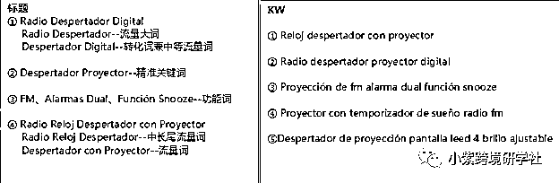

五点

得出自己流量大的几个词根，有逻辑的穿插在五点和描述里（Ctrl+F检查一下铺词频率）

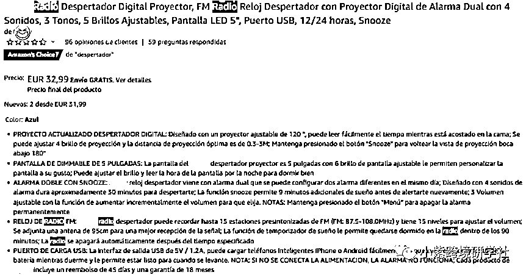

描述

More detail里面，能填的信息尽量填满，适合写关键词的栏目，可以把核心关键词多体现几次

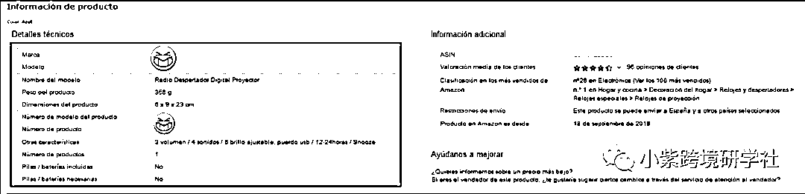

描述/A+ 的铺词思路和五点一样，这里注意一点是长短排序

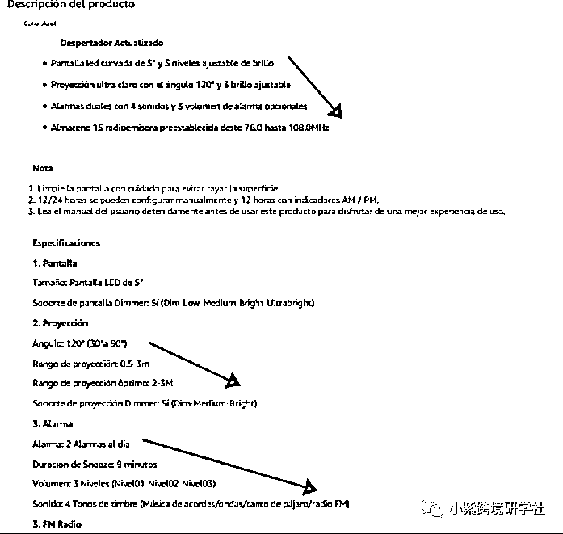

图片/视频命名

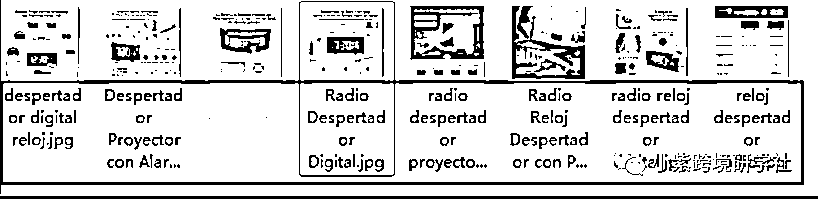

思路总结：一词多埋 的方式，尽量迎合亚马逊对关键词这块的搜索习惯，后台ST尽量不和标题重复，采用一行一个组合词 (包含功能词) 的方式来加大搜索的可能性

*关于一词多埋再举个例子（切勿kw堆砌，保持可读性）ej：Sonic electric toothbrush for adults；可匹配Sonic electric toothbrush for adults、Sonic electric toothbrush for adults、Sonic electric toothbrush for adults、Sonic electric toothbrush for adults、Sonic electric toothbrush for adults...

# 3、文案的两大核心

其实，回归本质，卖货就是卖链接。

网上购物，顾客无法直接触摸到实物。

只能通过我们的产品图片、文案、评论等因素综合考虑是否要购买我们的产品。

所以做文案，我们只需要抓住两点核心：

1）Keep it Short and Simple

2）Make it Plaeasant to Hear

保持简短，使之悦耳。

也就是我们常说的 可读性 和 韵脚。

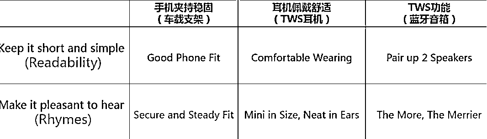

押韵会让文案变得更有美感、提升说服力，最重要的是增加记忆点。

这也被称为 “处理流畅性理论”。

即我们大脑对外在信息的处理顺畅与否，也会影响我们的审美体验。

“饭后走一走，活到九十九”，乍一听，短小精悍

不论真假，但确实让人过目不忘。

还有类似的，

“要致富，先修路”、“少生孩子多种树”、“生活要想好，赶紧上淘宝”等等

给大家分享一个简单又好上手的英文韵脚查询网站：

https://www.rhymer.com/

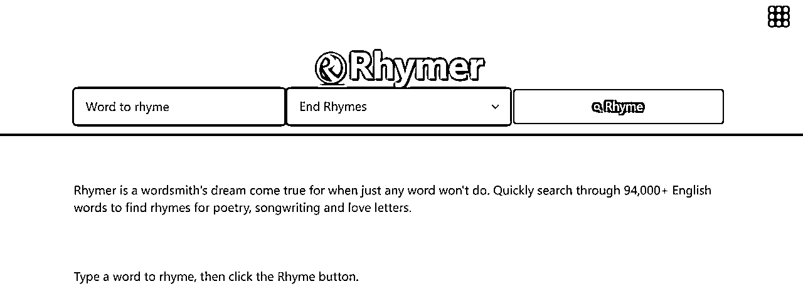

这里再分享一些案例，大家可以参考一下。

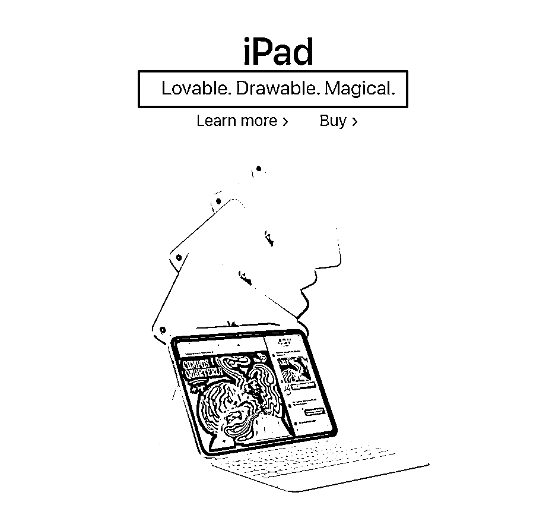

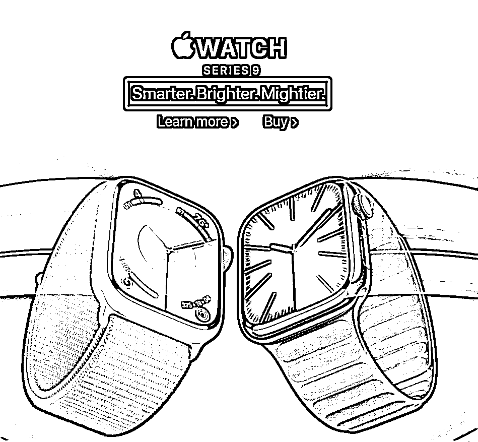

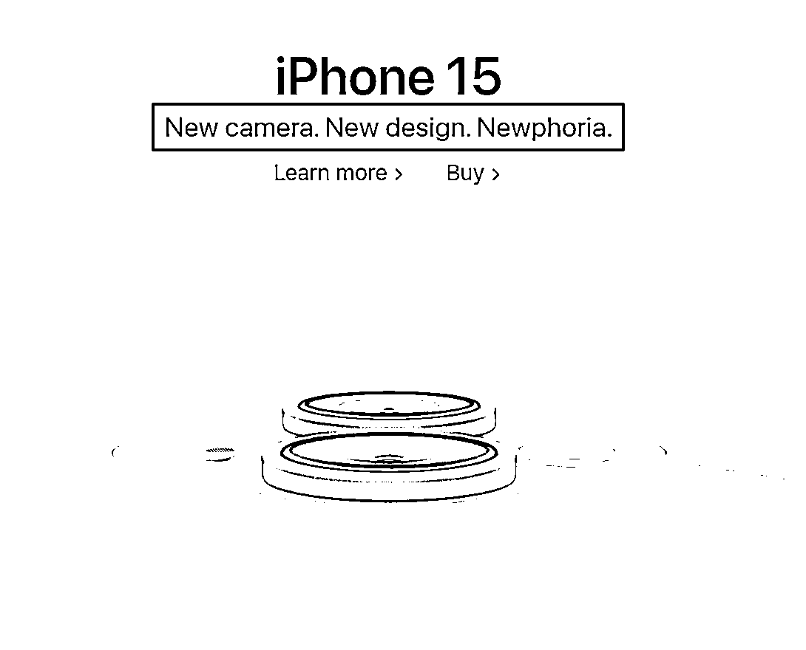

这类文案的主要作用是宣传，要的就是简单易懂，且易传播。

但要注意的是，押韵也是为提高传播而用的工具之一，并不是文案的目的。

押韵不能使不好的文案变得好，但可以使好的文案变得好。

* * *

全文完。

其实转化率有许许多多影响因素...

价格，竞品、市场、RV等等

图片和文案只是其中一小部分，

大家可以评论互动你想听的内容，

接下来我也会继续给大家整理转化相关的知识，不断丰富转化系列的内容。

以下是我的经典文章，99%关注我的人都会阅读，建议你一定要好好看一看：

精细化运营法：

干货型：

职场经验型：

如果觉得小紫的这篇文章聊得还挺有趣

欢迎来交个朋友~