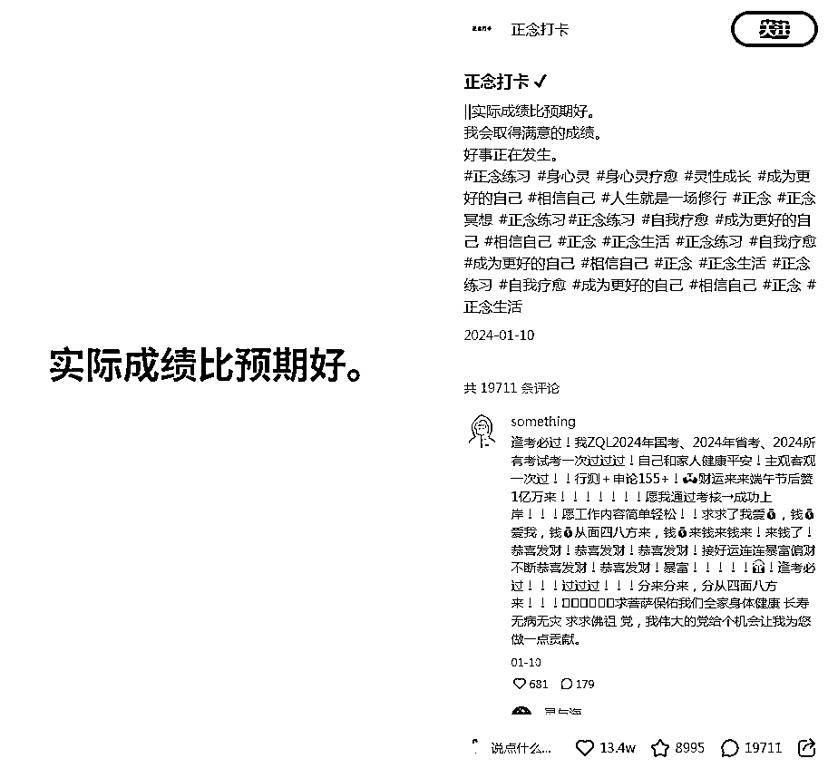

# ChatGPT+Canva可画，批量做小红书正念语录账号，5分钟生成300条图文

> 来源：[https://dik4wr1hyrw.feishu.cn/docx/MTV4dRt0Zo3paOx2japc4qf8nzg](https://dik4wr1hyrw.feishu.cn/docx/MTV4dRt0Zo3paOx2japc4qf8nzg)

这几天在刷小红书，看到了正念语录，我去，一看吓一跳，十几万点赞，将近两万评论，还是24年1月发布的，不管怎样，这必须得学习学习。

之前分享过ChatGPT+Canva可画批量做语录短视频，我想批量做图文应该也是阔以的，废话不多说，尝试起来吧！

# 收集对比账号正念语录

我们先找对标账号，把正念语录收集起来，一搜索点赞都是成千上万的。

单个复制正念语录到表格中，最后收集完成后全部复制，让ChatGPT分析爆火的原因。

# 轮到ChatGPT上场咯~

我们把语录发给ChatGPT让它分析下爆火的原因。

可以看到分析的非常准确及详细，分析是为了让ChatGPT可以准确理解我们的需求，现在就可以让它帮我写50条正念语录啦！

很快就写出了50条正念语录，我们是需要300条的，分批次让ChatGPT写，免得字数太多出现问题。

最后我们问ChatGPT写够300条了么，不够会自动补足到300条的。

300条正念语录全部生成，复制到表格中，后面批量制作图文会用到。

# 轮到Canva可画上场咯~

我们打开Canva可画，创建设计，自定义大小1242*1660，小红书封面大小规格1242*1660.

我们再打开对标账号的帖子看下，背景图基本都是中间圆圈从四周向外晕染发散的，非常符合冥想正念的氛围感。

先尝试在Canva搜索黄色圆圈素材，但是效果不是特别好，我们可以在找图网站Pinterest（https://www.pinterest.com/）上搜索黄色圆圈就会出现高质量的图片。

找到合适的图片，直接把图片复制到Canva上，右键将图片设置为背景。

背景图搞定，可以添加语录咯，添加文字的副标题到背景图的中间部分，这是参考对标账号的图文哦~

# 批量生成300余条正念语录图文

正念语录基础模板已经做好，开始批量制作图文，来到Canva应用，批量创建上传刚才保存的表格。

上传数据后，右键进行关联数据。

关联成功后继续，会显示可生成的数量，一共生成了299条正念语录。

最后我们选择图片PNG格式进行导出，到此300条正念语录图文已经大功告成。

# 如何变现？

做小红书肯定是为了变现的，此类账号变现方法也比较单一，就是接广告。

