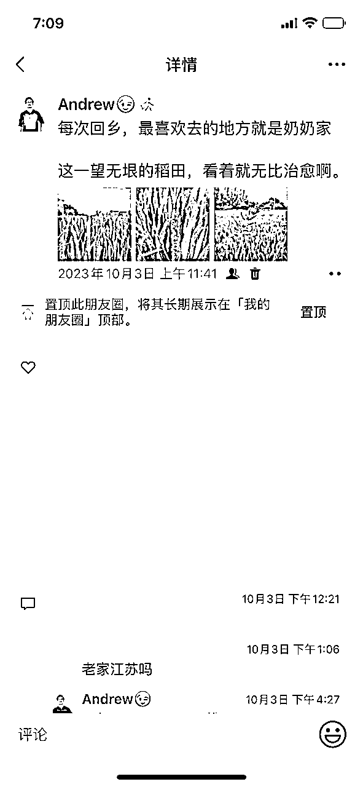

# 裸辞创业一年，知识管理赛道从月入5k到5w，朋友圈的运营之道

> 来源：[https://x6n09emgmm.feishu.cn/docx/MrQHdCS6uoz2R8xy5c3c7kI2nLg](https://x6n09emgmm.feishu.cn/docx/MrQHdCS6uoz2R8xy5c3c7kI2nLg)

各位生财的圈友好，我是Andrew，是一名知识管理教练，“知识管理五维模型”创始人。

也有朋友称呼我A大、A哥等等，怎么称呼无妨，你觉得舒服就可以。

我曾经是一名工作5年半的互联网设计师，一年前裸辞单干，专注知识管理赛道，通过内容创业成功实现了靠自己养活自己的人生梦想。

创业的第一年，总营收顺利突破了30w+，而在今年1月份，每月营收首次突破了5w+。

说实话，我在去年5月之前，每月收入勉强才五六千，每月房贷、花呗、借贷各种花销过得很拮据。

所以，我原本的预期，仅仅是想在一年内，突破1w的营收。

而现在不到一年，我每月营收足足翻了10倍。这个结果，已经远远得超出我原本的预期。

有时候回忆起职场的时光，真的恍如隔世，因为近一年前的日子，我分明还在在职场995啊...

看，那时候，我每天工作几乎要12个小时以上，甚至在需求很急的时候肝到凌晨。

为了让自己有个好绩效、能升职涨薪，把自己所有的生活时间都压榨干净。

现在，我一天工作平均3到5个小时，其他时间全部可以自由支配，刷部电影、玩把游戏、错峰旅游、撸猫养花。

但是我每月的营收反倒大幅超出了主业薪水。

很多朋友会好奇我1月份的收入构成，我做了统计，除去老学员复购、合作分到的cps外，80%均来自朋友圈。

而在这80%的比例中，一大半收入来自我的IP知识管理私教课，小部分来自1月份刚刚开始运营起来的年度陪伴群。

由此可见，朋友圈为我1月份营收做出了最主要的贡献。

所以，今天的分享，会主要和大家分享下，在朋友圈打造这方面，我到底做对了什么？

# 一、为什么得聊下我的朋友圈？

一方面，我上面有提到过，朋友圈为我1月份的营收带来了最主要的贡献。

或者说，在我过去的每个月，朋友圈几乎都是最主要的贡献。

绝大多数成交的发生，都在朋友圈。

另一方面，我很少去和人主动私聊、推销我的产品。我的单子大多来自被动咨询、甚至被动成交：直接找到我表露报名意向、甚至上来就打款。（被动咨询时，我一般就直接用谱子销冠精华里的聊天框架，成交率会很高）

最后一方面，有很多很多的小伙伴，在评论区、或者私聊时有透露过：特别喜欢追着看我的朋友圈。

我印象比较深的，是一个小伙伴被动成交了陪伴群后，主动和我说：“感觉你写的内容，和其他人的不一样，很走心的感觉，所以要支持一波。”

还有一位做俱乐部的朋友，加上好友才三天，便主动找我表白：“总是忍不住去翻看你朋友圈，太有魅力了。”

六天后，她看到了我的私教发售硬广，便主动找我付下私教全款，而在打款之前，我们没有任何谈单、说服的过程。

另外，这是最近大年初一时，刚刚通过朋友圈被动成交的一单，也是直接找到我说想报名私教。

但之前，我也仅仅和她做了自我介绍而已。

另外，类似的声音还有很多很多：

“看你朋友圈对我来说是一种滋养。”

“每天看到您更新的朋友圈，有种想成为您的想法，连吃瓜都觉得有瘾”

“我是被A大朋友圈吸引的人，啥时候有你的朋友圈21天就好了”

“A大的文字有一股魔力，我就这样被深深吸引了。”

所以，1月份5w+的突破，和我的朋友圈运营一定存在着一些因果关系。

那么，为什么这些朋友圈能帮助我实现很多成交呢？

# 二、朋友圈成交的底层逻辑是什么？

我曾经有很多私教学员，都和我抱怨过这个问题：

我自己有产品，明明都有在发圈，但为什么来找我咨询的用户却一直很少？

其实，这些学员的问题，可以细分为两类：

1.没有持续发圈，有了产品后才开始发

2.有在持续发圈，但是很少展示自己

我们先来看第一个。

#### 1.没有持续发圈，有了产品后才开始发

这个决策，往往来自于一个错误认知：

只有当我确认好定位、做出产品后，我才能去发朋友圈。

所以，我目前没有定位、没有产品，那我就可以不用发朋友圈。

靠谱说，很多时候，我们想成交别人时流的泪，都是我们做内容时脑子里进的水。

意思是，你平日里不发圈，某一天冷不丁得发个产品，基本上就没有人来买。

我们可以先假设，一个从来不更新朋友圈的人，某一天突然官宣了自己的产品。这个产品，我们尚且先不管它是咨询、还是社群、亦或是私教。

如果，你某天吃饭时突然刷到了这条朋友圈，恰好，你又有这方面的需求。

那你会愿意直接在对方这里入吗？

很难，甚至直接pass。

因为你对他没有认知、没有印象、没有好感、更没有信任。

这些都没有的情况下，即便需求强烈，成交都很难。

因为，不确定性、决策成本实在是太高了。

你在这样一个人手里入，需要承担巨大的风险。

对方能帮我解决问题吗？这个人靠谱吗？这个人三观咋样？不会收我钱然后直接撂挑子走人吧...

都是风险，大家都损失厌恶、趋利避害，所以很难说服自己在这个人手里下单。

我这里很多学员的报喜成绩，都是从日更朋友圈开始，即便很多人没有定位、没有产品，但是这不妨碍他们做成长可视化，然后用分销来赚到一些零花钱。

拿我第七期知识管理私教的一个学员举例，她那会刚裸辞做自媒体，完全零基础，也没有自己的定位。

但是在我的指导下，有能力持续能够日更朋友圈。

日更一段时间后，她去分销大佬们的小报童产品，一周轻松赚到3k+。

所以，定位、产品是很关键、很重要。

但是，这丝滑不能影响到你，随时随地得去对外展示自己的一切，让更多的人看见你。

芷蓝姐说：我不论多忙也会每天发圈，哪怕发的少也要发，就是为了让用户记住我，现状这个时代，爆款不重要，持续生产才重要。

没人会记住一年一个爆款内容的你，只会记住365天不间断写字的你。

也就是说，只有持续不间断得输出，才容易不断展示专业和人格，被用户记住、信任。

未来你推出知识付费产品，才会有更多人支持。

我们再看第二个问题

#### 2.有在持续发圈，但是很少展示自己

这个问题也很典型，我这边不少的学员都曾经是这样。

他们是有在持续发圈，但是他们没有意识到一个问题：

他们的朋友圈文案里，很少有写自己。

比如，我这里正在交付的一位学员，她有日更，但是日更的类型无非是：

每天的小来早安、直说自己产品卖点的硬广、其他产品的分销广告、偶尔来三张美图等等。

她最大的问题，并不是广告多，而是，几乎很少有展示她自己的朋友圈。

我有在notion统计朋友圈数据的习惯（包括朋友圈内容、发圈时间、点赞数、咨询数、评分、类型等等方面），自从半年前开始日更后，我就开始统计了。

为什么要这么做，是因为，我想通过数据统计，来找到一些规律，让我了解大家更喜欢什么样的朋友圈。

而当我持续日更并统计了一段时间后，我惊讶得发现，高赞的几十条朋友圈，呈现出惊人的共有规律：这些朋友圈，基本都是在输出关于我的一切。

比如，当我在朋友圈中加入我的故事后，便会吸引到很多点赞，而那些没有加入“我”的朋友圈，点赞量都少得可怜。

另外，按理来说，广告类朋友圈应当是没有人愿意点赞的，因为广告涉及到商业利益、是在索取价值。

但是，当我在很多产品软广中，也揉入我和学员、或者我和产品的故事后，却也能收获到不少的点赞。

所以，我便开始坚信：输出关于自己的一切，就是建立朋友圈吸引的核心。

靠谱说：你会吸引到跟你情绪共鸣、经历共鸣、价值观共鸣的人，TA 认同你这个人，自然会认同你的产品。

在私域，人的 IP 先于产品。

芷蓝姐说：内容输出，一定要紧紧围绕自己进行，作为一个内容创作者，“真实”就是你的独家武器和别人无法跨越的壁垒。工具可以复制，行为逻辑可以复制，甚至是文笔都能复制，但唯一不能复制的，就是每个人的真实生活。

小鹿说：IP的核心，在于用户是奔着你这个人来的。同样的产品，比起别人，ta更愿意信任你，这就是IP的魅力。

所以，让客户喜欢看的关键，在于你能不能输出真实的自己，将关于你自己的点点滴滴，全部真实得展示出来。

大家要记住一句话：一个产品能够被卖出去，90%取决于卖产品的这个人。

这个人是什么样的？

有没有展示真实的自己？

展示自己的生活状态、展示自己的价值观、展示自己的学习感悟、个人成长？...

你每一次的自我展示，都可以慢慢让用户眼熟你、认可你、喜欢你、信任你。

大家并不是讨厌广告，而是讨厌机器人一般的、一看就是复制粘贴的冷冰冰的文案。

聊到这，我突然想到，去年加入靠谱战队去拉新生财时，发生了一件有意思的事。

很多人去朋友圈分销生财。

但是，不仅没有人愿意买，还有人私信他们，问一些比较尴尬、让人恼火的问题。

你是不是进了啥传xiao组织？你是不是被盗号了？你怎么在割别人韭菜啊？...

原因很简单，很多人之前很少用心运营过自己的朋友圈，几乎从来没有展示过自己。

所以，在这样的情况下，大家对这个人没有概念、认知。

但我们把时间倒退两个月，他们持续在朋友圈输出，除了晒自己的生活、还晒自己加入的圈子、日常学习的感悟思考、成长道路上拿到的每一笔小成就、以及加入生财后，自己所拿到的真实变化。

那么，在开始分销生财的这一天，还会出现上面我所说的问题吗？

也许依旧会出现，但是，至少大家对他们有所认知，没有人会怀疑他们在割韭菜、进了某某圈钱的组织。

因为，他们在朋友圈所持续展示的变化、成长，已经开始让他们有所不同。

并且，在用户的眼里，也开始有所不同。

拿我第五期的一位私教学员说，当她在我的指导下，持续在朋友圈展示自己真实的一面后，开始收获到好几个喜欢她的铁粉，甚至有一个在加上第一天，就被她朋友圈深深吸引，然后二话不说在她那里入了生财。

另外，第六期一位学员，她专注身心灵赛道。

一开始连朋友圈输出都很卡壳，到后来，她能持续得无痛输出很多包含自己的内容。

有一天和我报喜说：“因为写的文章和发的圈，都是第一次见面的朋友给我付费，一周收了7500了。”

所以，持续发圈很重要，而持续展示真实的自己更为重要。

# 三、如何通过展示自己，让你的朋友圈吸粉又吸金？

在知识管理中，良性循环输出的前提，除了你所学习的内容，更应该包含你从个人经历中所沉淀的内容。

因为，个人经历是你自己切身体会的、也是你自己独一无二的宝藏。它们相比书本、文章的感悟，往往更容易打动用户、吸引用户。

只要抓住用户的心，在他们有需求后，会更倾向于，用付费的方式去支持你、靠近你。

那么，我们有哪些展示自己的方式呢？

### 1.你可以分享自己的生活

比如你吃到的美食、烹饪的佳肴、看到的风景、家里的宠物等等。

这些圈的作用，就是让用户感知到你的温度，感知到你是一个有血有肉，有自己生活的人。

### 2.你可以分享自己的童年故事

为什么要发童年故事，是因为某些童年记忆，会是很多人的共有经历，所以当一些人看到，可以唤醒他们的记忆，引发他们的情绪共鸣。共鸣有了，意味着“你们是同频的、你们是一类人”，所以自然能增加信任。

我会喜欢在一些传统节假日发关于童年记忆的朋友圈，比如中秋节、七夕节等等，因为这些节假日，很多人的童年记忆都会很相似。因此，这些朋友圈的互动也都特别高。

比如，七夕节那一天，我会说，小时候听信外婆的故事，下雨天去葡萄酒下听牛郎织女说悄悄话，然后啥也没听着的经历；

中秋节那一天，我会说小时候，父亲骑着二八大杠去买苏式月饼，那会就是普通的油纸包装，每次吃到五仁都喜欢把红绿丝挑出来扔掉。

而这两条圈的互动就特别高。

### 3.你可以分享自己的弱点、软肋

个人IP并不是说，一定要360度多么完美、没有死角的人设。

而是，展示完完全全真实的一面，哪怕是自己的弱点、软肋，都是加分的。因为，读者可以直接感知到你的真诚。

比如，当我曾经在朋友圈里表露自己的内向、社恐后，反而能获得非常多的欢迎。

尤其是下面的第一条，我询问过，有不下5位的客户都因为这条圈被我深深打动，而愿意在我这里下单。

### 4.你可以分享自己的遇到的烦心事

虽然是烦心事，但最后也可以转化为「自己如何接纳、化解」。

就像我们看电影那样，在主角陷入苦难和泥潭后，总是可以通过贵人的指点、主角的努力，获得一个happy ending。

所以，抓住你每天的挑战和烦闷，因为，这意味着，你有机会来导演一场属于你自己的小电影，并且在朋友圈“公映”。而这样的小电影，大家又偏偏很喜欢看。

比如我发的这条朋友圈。当时跑了老远去办公积金，因为材料带错了很郁闷，然后想着，来都来了倒不如去附近逛逛呢。并且，在心情逐渐变好后，我就想到了，为什么不把这件事发到朋友圈呢？

不要让到手的肥鸭子飞走，每一个肥鸭子都可以变成你的生产资料。

### 5.你可以分享自己的成就

不论是过往的，还是刚刚实现的。

通过自己一次次的小成绩，来告诉大家，你一直在成长的路上，一直在不断突破自己的路上。

大家都慕强，但是大家更喜欢看到一个普通人，如何通过做不普通的事，来变得不普通的过程。

比如我，第一次被生财邀请做高手分享、被思念老师邀请做社群分享；

第一次拿到了航海巨人、拿到了前三；

2023年在flomo输出了100w字等等，这些都能让读者看到我的成长。（尤其是你的第一次，这些一定要发圈来展示）

### 6.分享自己和学员、产品的故事

大家都喜欢故事，这意味着，当你试图将广告变为一个个小故事时，可以抵消大家对广告的反感。

比如现在很多电视剧广告，都会直接套用电视剧的角色、情节来营销，我印象比较深的，就是剧版《三体》的TCL电视广告，很好得串联了宇宙闪烁的剧情，当时我看完后觉得特有意思，一点也不排斥。

而这也是在将广告故事化。

而我们做自媒体，也完全可以套用这个思路，比如产品故事、比如用户故事。

拿我举例，当我熬夜做涨价海报时，我就可以作为产品故事发圈，而且也在侧面暗示大家，我的产品马上涨价啦。

当我拿到学员的肯定认可时，我也可以作为学员故事来发圈，让大家看到客户证言，从而加深对我的信任。

当我收获到第一个成交时，我也可以写个成交故事，通过这种温和的方式，提醒大家了解和咨询。

### 7.分享遇到的问题，以及解决的过程

通过这些朋友圈来直接传达实用价值，让用户觉得“有用”，某种程度上也可以增加信任。

比如，我在pdf资源管理上遇到了很多痛点，最终都解决了，于是我就把问题、原因以及最终亲测有效的方法汇总成一条朋友圈，直接帮到一些有相同问题的人解决问题；

另外，如果这个问题比较棘手，其实也可以通过「互动圈」来征集大家的智慧，最后接一条解决反感。

比如，我有一天遇到了iPhone闪退的问题，直接发了条求助圈，一方面想征集大家的方法，另一方面可以增加互动；

并且，在这个问题解决之后，我会将问题原因、以及方法步骤再发一条圈，并感谢给出方案的朋友。一方面直接提供了实用价值，让遇到相同问题的人知道怎么解决；另一方面通过“接上条”引导大家进朋友圈，提升朋友圈曝光。

### 8.分享自己身上发生的所有奇妙的、有趣的事

当这些事发生后，你一定会有感触，所以不要忽略这些体验，立刻打开flomo去记录。

比如，我在招线上小助理时，发生了一个很离奇的故事，那时候我就立刻将其作为我的素材去创作。

最后，拿到了大量点赞，并且，我猜测有很多人通过这条圈，点进了我朋友圈主页。

因为，有两个人主动找我咨询了私教，并且顺利得成交。一条故事，为我带来了5k+的营收。

# 最后

以上，就是我不到一年、从月入5k到5w的过程中，关于朋友圈运营的一些个人之谈。

最后，在朋友圈打造上，我可能连小学生也算不上。如果这次分享，能够给一些人带来一点启发、帮助，那么就再好不过了。

最后，特别感谢靠谱、感谢芷蓝姐、感谢白大的一路托举、指导和那么多的资源支持。

如果没有她们，我一定会走非常多的弯路。

我是Andrew，若文中任何细节没有看懂、欢迎找我一起交流探讨。