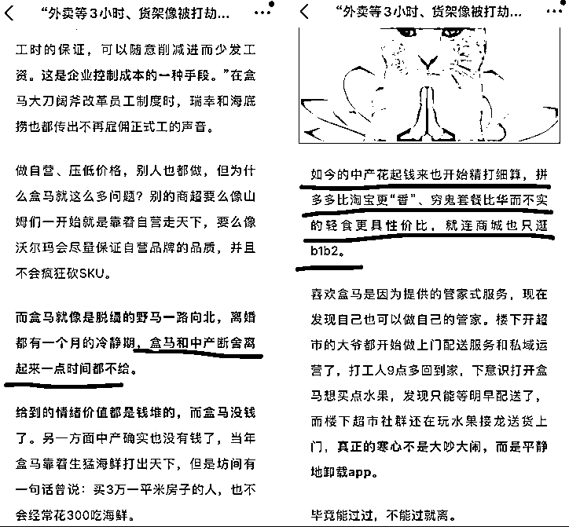
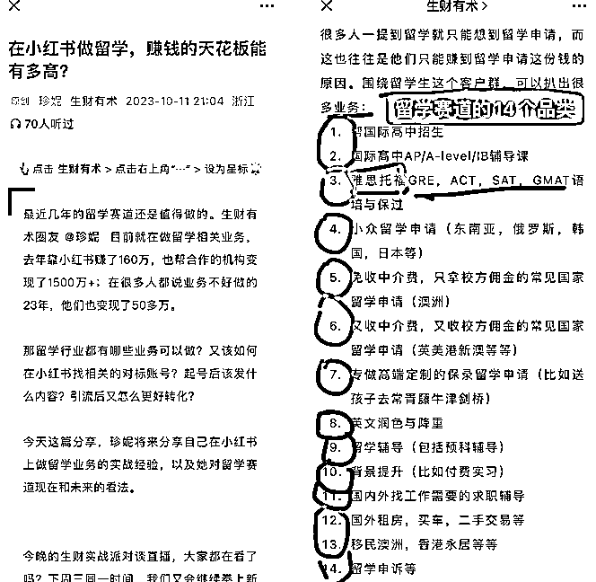
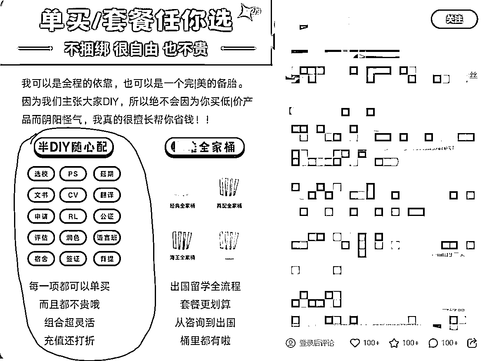
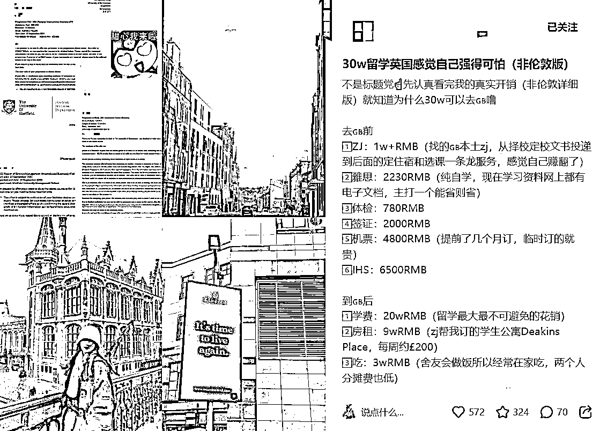
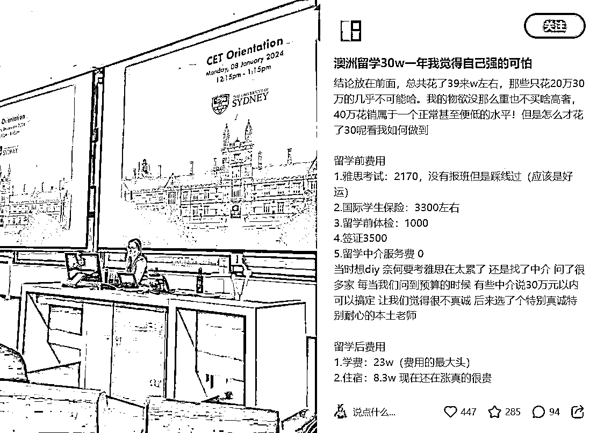
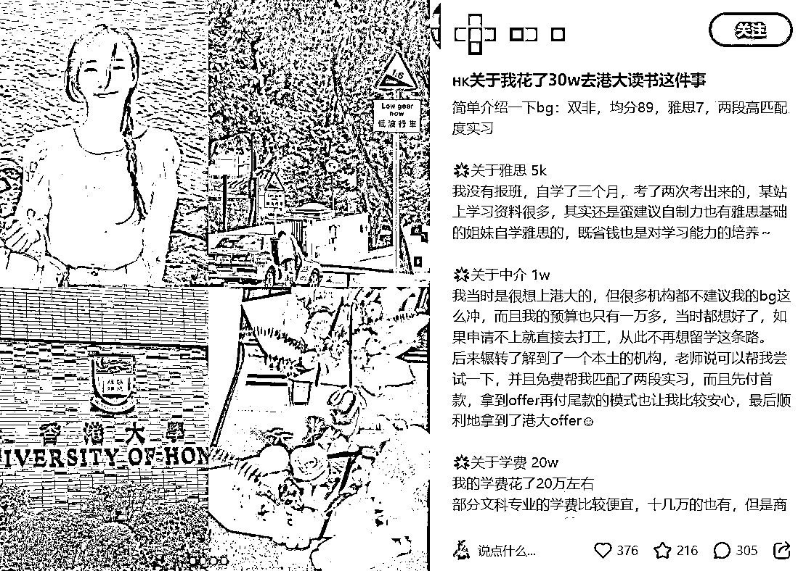
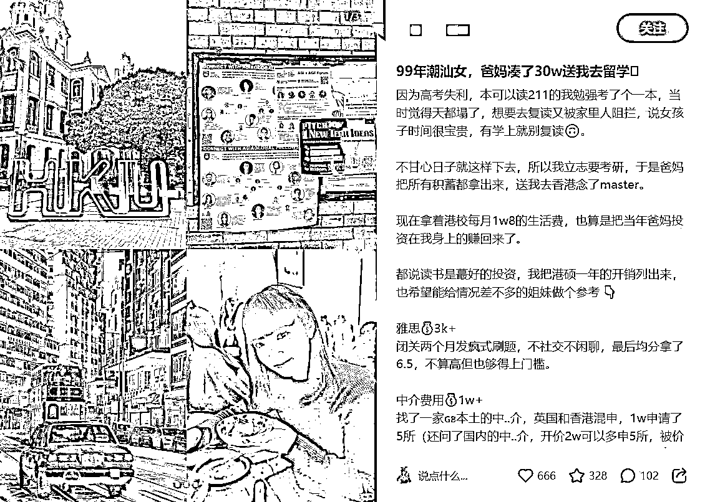
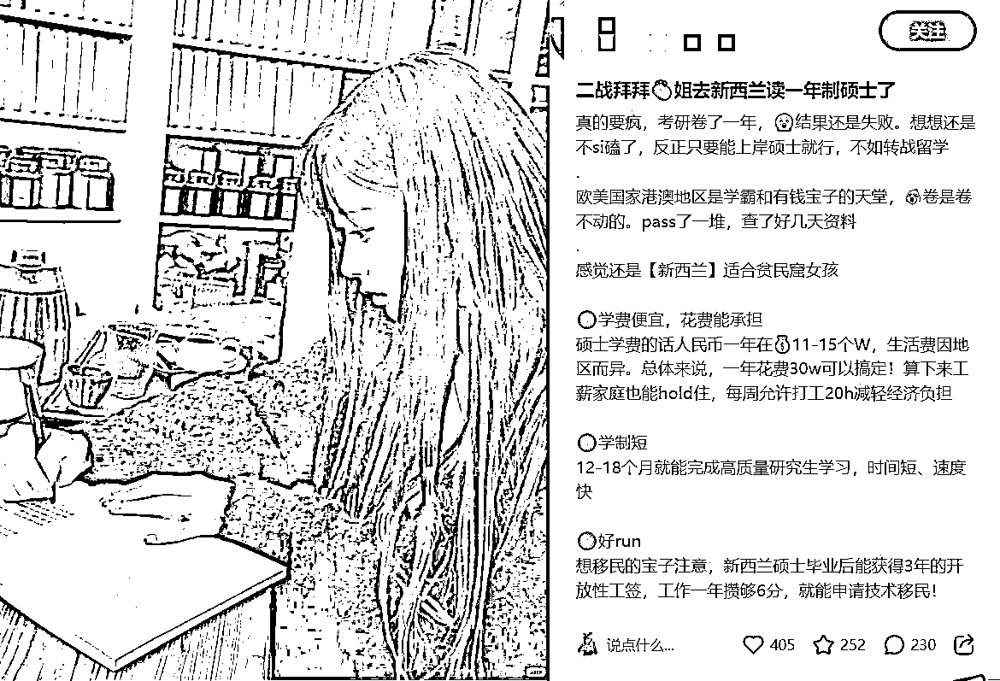

# 小红书两年做了2700W营收后：我对「留学行业的趋势分析」

> 来源：[https://ht16ej1tui.feishu.cn/docx/N3xWdm6iLoiDyZxWWUEcGW5SnLc](https://ht16ej1tui.feishu.cn/docx/N3xWdm6iLoiDyZxWWUEcGW5SnLc)

Hi，大家好，我是珍妮，1500块起家，在22-23年做出了教育赛道合计2700万的营收。我是2700万营收的幕后运营操盘手，也是上期精华帖「老板避雷手册」的作者。

我和生财圈子的陈铭Ivy合伙创业，在22-24年写过以下分享：

感兴趣的朋友可以戳戳：

24年：老板避雷手册|年1100w营收背后，如何识别不合适的运营人员、合作商、合伙人？https://t.zsxq.com/18clCvA0e

23年：小红书教育赛道GMV1600万/年，小团队创业心法https://t.zsxq.com/18RnIxsp7

22年：粉丝3000月营收20万，小红书低粉高变现的蓝海攻略分享https://t.zsxq.com/18tvEOFgZ

今天分享的是：「留学行业趋势分析」，加粗标亮部分的内容，我想也会对其他行业的老板有用。具体包括：

1.  留学行业赚钱趋势和利润分析

1.1 留学行业赚钱的机会还有多少年？

1.2 24年留学行业利润怎么样？

1.3 花式发微信号给客户的骚操作汇总（其他行业可看，留学行业已经不太适合用这个了）

1.4 认证蓝V的省钱方法（每个行业都可看）

1.  下滑行业汇总分析

2.1 留学行业接下来会下滑，背后的根本原因是？

2.2 哪些行业会跟着下滑？

2.3 处在下滑行业，老板们的解决方案

1.  留学行业14个细分赛道，还有哪些可以做？

1.  24年入局小红书留学中介，你可以走的唯一一条路（含两个方法）

当然后期我也会分享以下内容：

如果你想知道，可以留意我后期的分享。

我会要晚点发出来，先护着第一波转型成功的人。

1）如果你还是执着于留学行业，你可以怎么做？

2）如果你还是执着于留学生群体，你可以怎么做？

3）如果你还是执着于留学生父母群体，你可以怎么做？

4）如果你还是执着于海外华人群体，你可以怎么做？

5）如果你准备转行，哪些坑不能踩？

6）如果你准备转行，结合现有的工作经验，你适合去做什么？

# 留学行业赚钱趋势和利润分析

## 1.1 留学行业赚钱的机会还有多少年？

留学行业赚钱的机会还有3-5年，5年后，这钱就赚起来就非常累了。

以及，从今年开始，赚钱不再像以前一样「是大风刮过来的」。

留学行业以前的赚钱方法真的很简单，就拿留学中介这个赛道为例，你只要引流+签单+收学生中介费+收校方佣金，完事。很多活，都有背后的供应链帮你交付。

到23年9月之前，小红书还没被留学中介矩阵号彻底洗过，学生对各种各样的名校学长学姐还有些信任。

从23年9月之后，学生彻底看麻了这些学长学姐的账号，甚至发出了「绝对不要在小红书找留学中介」这样的帖子。因为无论是素人号还是机构号，无论是在以任何名义和学生聊天的人，最后100%都是留学公司的人。

他们可能是任何形式的留学中介(包括英美澳留学申请、租房、留学辅导、转学分、申诉、语言培训等），还可能是代写。

还有的以买卖自己二手家具的名义，让留学生加自己微信，有的坚持不懈和学生聊了半年，陪打游戏，已经姐妹兄弟相称，结果最后是个代写。把学生气吐。

这个赛道由于利润太大了，客户群给你打钱也很少砍价，所以尝到了「小红书引流」甜头的中介，通过20年-23年不懈的努力，终于把一片蓝海洗成红海。

新人入局，找不到对的方法，就是等着亏钱亏精力。

24年，如果你还想入局小红书留学中介，只有一条路可以走，具体可以细分成两个方法。我会在后文分析。

## 1.2 24年留学行业利润怎么样？

还有利润，只是这一次，你的钱不再像从前一样，像大风刮过来了。

具体原因就是：

如果你是个新人，你想靠做留学中介个人ip赚钱，基本不可能，小红书已经有很多中介ip了，他们早在24年之前就卷的不行了，现在入局做留学中介个人ip，只能当炮灰。因为你能想到的玩法，就没有哪个中介没玩过。

留学行业是最卷的，留学行业从业者做运营的天赋，几乎都是天生的，因为这类人天生就擅长做自媒体。

一群天赋满分的人卷出来的东西，如果你到了24年还想在小红书和他们卷，并且觉得自己天赋异禀，抱歉，你真的，卷不过的。

如果你是一个矩阵号王者，那你会面临两个局面：

A. 充值聚光、直接发微信号给客户

B. 不充值聚光、用各种骚操作把你的微信号发给客户

如果你是情况A：

你每个号每月的开销，最少是1500-1800元，这个钱只能是你交给平台的保护费，不代表你能引流超级多买单你的人。因为你的对手比你更能花钱，只要他开价更高，他就有机会让客户最先注意到他。(前提是他的笔记不拉垮）

关于保护费，我也有别的骚操作，考虑到这篇帖子也可能被小红书官方看到，这里就不说啦。

如果你是情况B：

除非你能做到这个赛道全是你的账号，那么这时候，你不充值聚光也没关系，你各种花式骚操作把微信号发出去也没关系。因为没人和你竞争，微信号发晚了也没事，客户加微信加到你好友加晚了也没事。

因为全网都是你的人。你就走废号流就行，如果被封，就继续起号。

但往往，很少有人能做到这个赛道全是他一个人的号。

所以这时候，如果你没有一个「快速给客户发出微信号、且确保客户能看到你微信号」的方式，那么，在客户没有非你不可的情况下，客户一定会同时问其他矩阵号商家。

只要其他商家发微信号速度、通过好友速度比你快，甚至销售能力比你强，这个客户，就是别人的了。

## 1.3 花式发微信号给客户的骚操作汇总

以下这些站外引流的骚操作，我全都试过，但每过一阵，这个操作，在留学行业就会失效。（其他行业真没留学行业严格）

1.做成表情包，给用户发表情包，表情包上有自己的微信或者喊用户留下他的微信。

2.把群聊名字改了，比如

领资料找xxxx（你微信号），把群聊嵌到每篇笔记底部，并且把群聊链接发在评论区置顶。

3.把你的微信号用小号发。然后用大号收藏小号这篇笔记。

有时如果你这样发，可能会被人举报或者被官方自动识别，你就把你的微信号涂鸦一下，拿彩色画笔遮掉点，但又能确保用户看得懂你的微信号。

4.在用户评论你后，用小号在带有微信号的笔记下面，at评论你的用户。用大号提醒用户：看刚at你的某某哦

5.把你的小红书id改成你的微信号，要好记，要足够短，不要同时出现字母O和数字0，不然别人可能打错，不要有特殊字符。在你的简介里写：

抬头看🆔

6.把笔记改成手写笔记，（也就是类似那种手写体的资料分享效果，在一大堆手写体资料的左下方，用手写体把你的微信号写进去。这时候，你的微信号里不要同时出现数字2和字母Z，也不要同时出现阿拉伯数字0和英文字母O，否则用户难识别）

然后在评论区提醒大家：看笔记第一页左下角找我（其实也就是找你的联系方式）

每次发完评论，自己要拿大号去看一看，你的评论是不是正常显示

7.你还可以给用户发语音说英文微信号

因为如果你说中文或者阿拉伯数字，会被系统检测出来

我有时会拆成两句话说：

1.你听我说英语找到我，不然我发不出消息

2.开始报我的英文微信号或者手机号，比如one two three

其中，第5条是最不好弄的，为有的用户看不懂，只不过设置了第5条，“有总比没有好”。

现在牛逼的矩阵号王者，已经进阶到通过发视频给用户留微信号了。

## 1.4 认证蓝V的省钱方法（每个行业都可看）

如果你不知道要不要开蓝V、怎样省钱开蓝V，你要注意：

我做过很多赛道的小号，一般起号一个月后，其他赛道安全得很，但留学赛道一定会收到官方通知「账号内容不被推荐」然后喊你去申请蓝V。留学赛道是被打压得最狠的赛道。

为了申请蓝V，你需要先去拼多多花40-60块买一个海南的个体户营业执照，（就海南最便宜，其他地方都不止这个价钱），然后再给官方交600块保护费，去变成蓝V。

当然，也有人会和我说：我认证个人博主，是不是就不需要蓝V啦？

我试过，确实是不需要蓝V。但是「账号内容不被推荐」只是让你充钱的第一步，你变成个人博主也避不开下一步：「禁止站外引流」。

# 下滑行业汇总分析

## 2.1 留学行业接下来会下滑，背后的根本原因是？

因为

2.1.1 中产没钱了。

2.1.2 太多留学中介，其实也没有在这个行业有足够多的积累。他们没法赚顶尖富人的钱。在中产没钱的情况下，中介利润被迫下滑。

### 2.1.1 中产没钱了。

我知道「中产没钱、中产会没落」，是23年3-4月的事情，当时我报了一个贵人姐姐的ip课，她在那时候就有提醒我「哪些行业会上升，哪些会下行」。

她是在中国已经红了10多年的人，穿越周期，影响力已经扩大欧洲还有中国周边的小国家，早就财富自由。我知道她发表的每个观点，都是背后有大量数据支撑。

在知道留学行业会下行后，我马上和合伙人Ivy说了这件事。那时候可能是没有聚光投放之前、留学赛道最后一波红得如日中天的时候了，买单的留学生汹涌如潮。但这个趋势，果然不长远。在我写完23年7月生财那篇帖子后，

原帖请戳：https://t.zsxq.com/18RnIxsp7

留学赛道，尤其是英澳留学中介，他们的笔记最后一次火，基本是23年9-10月。在那之后，就很难见到一篇笔记下面一堆人礼貌问价的局面了。（现在偶尔有小爆款，但都符合某个共同特征，我下文分析）

同时，我们在23年试了所有留学相关的赛道，找了很多合作商，整个留学行业，任何细分的小市场，基本就没有我们没试过的。最后发现留学行业果然下行。这个下行倒不是说这个行业已经彻底不赚钱了。

而是说：

假如，

你的天赋是80分。

你的努力值是最高120分，超过120分你就有猝死的风险。

你能赚到的大钱是120块。

那么你以前，是付出20分的努力，就能赚120块，钱都是大风刮来的。

现在你付出90分的努力赚120块，并且即将付出100-110分的努力赚120块。这个钱，赚得太累了。

如果你都有100-110分的努力和80分的天赋了，去别的蓝海赛道卷，你只要继续拿出20分的努力就行，就能再次赚120块，咔咔乱杀。

中产没钱，出国留学的留学生会越来越少。能送孩子去国外上学的，接下来要么是超级大富豪、一开始就送孩子去英美名校，要么就是本来就已经在国外生活的海外华人。

如果你执着于做留学中介生意，可以看看你的产品是不是针对这两类人。如果还在吸引中产，你的利润是一定会下滑的。

（注意：如果你继续做留学生意，也许未来送外国人反向在中国留学还差不多。我就遇到一个能源界的俄罗斯高管要来中国刷人脉，想读个EMBA水硕。但是2000多块的入学费他到现在都没交，可能是嫌项目还不够好。如果有人有好项目，也是可以赚这个钱的。）

至于中产，他们能移民的会移民，因为接下来，他们在中国的日子会越来越不好过。（注意：这里也是暗示：移民类生意还有最后一波客户量）

至于底层，小康小资这种，一开始他们可能咬咬牙卖套房送孩子出国，现在他们可能选择不出国，或者送孩子去马来西亚、爱尔兰这类国家读书。（这代表你的客单价会要降低，也代表「免押金，只为了拿学校返佣」的中介会越来越多）

国家会慢慢变成M型社会，从此中产会慢慢没落。

### 2.1.2 太多留学中介，其实也没有在这个行业有足够多的积累。他们没法赚顶尖富人的钱。在中产没钱的情况下，中介利润被迫下滑。

留学行业，其实一直以来，赚的都是顶尖富人+中产的钱。

顶尖富人是会送孩子去美国的，就算去英国，也一定要去牛津剑桥这种名校。

中产以前都是去英澳留学，1万5-3万的中介费随便付，但接下来，他们会非常注重性价比，又或者去新西兰爱尔兰等国家留学，甚至去马来西亚，芬兰留学。

他们甚至有的，不再留学。你的用户群和服务，突然就变了：

要么你继续为顶尖富人服务，做美国相关、超级名校相关的业务。

要么你继续为中产服务，但你得不断卷你自己的产品和服务，提高性价比，这样中产才会买你。

太多的留学中介，习惯了赚快钱。尤其是英澳&小众英语国家留学申请的中介，本就是门槛比较低的事情，所以很多中介本身，对这个行业，也没有太多积累。

以澳洲留学申请为例，澳洲留学，并不需要学生写留学文书。

所以澳洲留学中介，只是按照官方要求，帮学生递交下材料就赚了「学生中介费+校方返佣」两笔钱。

因为留学行业某些赛道的门槛并没有想象中那么高，那么随着中产没落，像有的地区的留学申请，很多留学生会开始选择DIY或者半DIY，又或者选择一分中介钱也不交，找中介免费申请。

这导致那些没有门槛的留学中介，利润大大下滑。因为你的很多同行，全部打起了价格战，他们不收学生一分钱，甚至不收押金就帮学生免费申请学校。

这种情况下，你很难去挣大风刮来的钱。因为就算你也不收押金不收一分钱，你怎么确保，你和别人都是免费的情况下，学生只选择你，而不是选择别人？

## 2.2 哪些行业会跟着下滑？

所有主要服务中产，产品服务性价比又不高的行业，业绩都会下滑。

具体到哪个行业不便公开透露，感兴趣可以问我。

## 2.3 处在下滑行业，老板们的解决方案

如果你还想赚中产的钱，你一定要这样做：

不要再卖死贵死贵的东西，提高你的性价比。

瘦死的骆驼比马大，中产接下来会越来越没钱，但是他们是特别爱冲动消费的一类人，所以如果你提供的产品足够好，又划算，也可以赚到中产的钱的。

有个很逗但很有效的事情，就是你要学会从大V那里观察风向，

比如S叔Spenser，前几年，应该是18-19年那会，他在写他花30万买了一个LV的箱子。现在他的视频号在写：自己在带货小而美、性价比高的东西。

这就是趋势。你不知道趋势在哪，你就看那些一直在火，从未从你视野消失的人，在卖什么。

另外你再看：盒马都抛弃300万中产了。

盒马都抛弃中产，你作为小个体，还要逮着中产的钱去赚嘛。

关于哪些行业会没落的分析，不是我的原创。我也是听贵人姐姐讲的。如果你想知道我的贵人是谁，也可以私下问我。

# 留学行业14个细分赛道，还有哪些可以做？

我在23年7月那篇帖子里，提到了留学行业的14个细分赛道，这个还不够完整，但整体趋势，基本都是下降的。

以下是我对整个行业细分赛道的分析：

大家可以看我图1不同颜色的圆圈。

其中，蓝圈和蓝线部分（1.2.7.12.13）还能做。但1和2，一定会越来越下滑。12和13里，只要别去做香港永居，你还是能做的。

黄圈，3.5.6已经卷起来了，并且利润下滑。想赚大钱就别进去卷。

绿圈4勉强能做，但未来也会下滑。而且绿圈4专业吸引「既要又要还要」的客户，很难伺候。

紫圈8.9.10.11已经非常卷了，其中11还能勉强做做，如果针对国内来做，建议是送孩子去体zhi内的求职辅导，而不是去互联网大厂的求职辅导。因为为孩子求职辅导买单的家长，现在更看重职业的稳定。

14能做，利润高，但不一定有那么多人买你，有周期性（比如每年期中期末就是申诉爆发期），复购率不一定高。

特别详细的分析，我没法公开说出来，否则可能引起留学界的波动，但以上这些分析，23年在小红书做留学的人，应该都深有体会。

留学赛道有很多品类，如果你就是想做留学中介，我建议：

1.能做理工科中介就别做文科中介

2.能做美国就别做英澳

3.能做小众国家就别做英澳

4.能做非英语国家的留学就别做英语国家的留学（但要去做富裕国家，不要吸引那些既要学费便宜、又要学校好、还要混圈子、还不能接受有60天线下课、还考不出语言分的客户。）

5.能做博士就别做硕士，因为硕士申请已经很卷了，没必要拼死拼活挣200块。（温馨提示：博士也卷，只是没有硕士卷。）

6.能做国际高中就别做硕士（一般国际高中学生的电话早就被人卖了，你也拿不到这个资源）

7.能做留学赛道其他品类，就别做留学申请中介。

# 24年入局小红书留学中介，你可以走的唯一一条路（含两个方法）

这条路是：重新组合你的产品/服务，提高产品本身的性价比，并且反复宣传留学的性价比。

## 4.1 重新组合你的产品/服务，提高产品的性价比。

我举个例子，其实下图这个商家的服务，是很吸引「疫情之后，家里资产缩水」的留学生的。

但这个账号的运营人员不太会运营，没有反复宣传自己的这点优势，导致他们其他笔记数据也很一般般。

如果你不想变更你的产品和目标群体，你就把你的产品服务啥的重新组装一遍，拆解成性价比超高的产品。就好比上图中的「半DIY」，每一项都可以拆解单卖。

之所以要这样做，依旧是因为：中产在没落。你接下来：要么赚大富豪的钱，要么赚底层的钱。

如果你还是想赚中产的钱，中产不是傻子，他们哪怕瘦死的骆驼比马大，他们也会开始注重性价比。

除了「自带送礼属性」的产品以外，如果你还想靠「牛逼的营销，华丽的包装」去卖一个「性价比不高，溢价」的东西，你基本卖不动了。中产会用脚投票，告诉你什么才值得买。

## 4.2 反复宣传留学的性价比

反复把预算打到公屏上，让人清清楚楚知道，去某个国家留学，到底需要准备多少钱，各项开支是多少，

这个法子，23年7-8月那会，有人当段子写，用来涨粉，比如写：我是如何5万块留学美国。然后讲自己游泳游过太平洋，给家里省了机票费的段子。

23年11月开始，有人开始细细掰开，给客户算：去某个小众国家留学，到底要花多少钱，各项开支在哪。

直到24年1-2月，这类笔记越来越多，推广到了英澳这种主流国家，也会夹杂香港，（在新西兰这种小众国家依旧盛行）。

而且很有意思的事，如果你点进他们的主页，

会发现：绝大部分人，最近3个月，就只有这一篇硬广，真的只有这一篇硬广火了，有人在礼貌问价。其他硬广笔记都是不咸不淡的，0-30个点赞，评论区能有3-10个人礼貌问价就不错了。

此处指硬广笔记，其他给「客户提供情绪价值&实用价值，但不打任何广告，下方没有人礼貌问价」的笔记不包括在内。

这种过分强调预算的笔记，都是在暗示所有留学中介：

你要狠狠提高自己的性价比，你要反复给客户植入：留学真的不贵，真的很值得拿来投资你的未来。

但最后，有多少客户会因此买单？我不清楚。我只知道，现在出国留学的人数，是每年都在下滑的。留学行业赚钱的时间，就是这三五年了。

其实整个23年，Ivy和我都在尝试转型，我们试变了留学行业几乎所有的品，最后我们在别人看不到的地方，默默铺了新的C端赛道。

23年1100W的营收，预示着留学行业的下滑（从1600W降到1100W），也是在预示着：留学行业从业者，都要早早为3-5年后的职业转型/产品调整做准备。（如果你的产品不能服务富人，只能服务国内中产的话。注意是国内中产，不是国外中产）。

我也有做各行各业的趋势上升下降分析，并且分析了哪些行业是蓝海，怎样避开错误对标账号，怎样快速写爆款等。

后期我也会分享以下内容：

我会要晚点发出来，以免留学行业出现大波动。（最近3-5年还能做。3-5年后，真太卷了，现在已经够卷的了。）

1）如果你还是执着于留学行业，你可以怎么做？

2）如果你还是执着于留学生群体，你可以怎么做？

3）如果你还是执着于留学生父母群体，你可以怎么做？

4）如果你还是执着于海外华人群体，你可以怎么做？

5）如果你准备转行，哪些坑不能踩？

6）如果你准备转行，结合现有的工作经验，你适合去做什么？

感兴趣的可以滴滴我，或者等我后期分享。

# 致谢：

此文感谢Ivy。我人生中每个重要决定，背后都有Ivy指点。她从16岁开始带我赚钱，后来又帮我做了靠谱的留学规划，找了靠谱的房东，顺带帮我安排了靠谱的室友。在我还是个雅思老师的时候，她就经常给我推客户让我挣到在机构打工挣不到的钱。

我真的很少走弯路，也很少被人割韭菜。因为在每个我可能要被割韭菜的瞬间，她及时阻止了我让我看清了全局。我的每个运营动作，背后都有她的支持和指点。我不擅长搭建商业模式，不会算账，不擅长把小生意放大。

我们起家的小生意，一开始我虽然把供应链运转了，但我为此赚到的钱，一个月只有1.8万。Ivy把一切搭建好后，我们月营收能做到20万。

她真的非常擅长把生意放大，而且特别擅长算投资回报率，所以我们即使测试了很多运营动作和产品，发现有的动作无效，有的赛道不够好，我们也比其他大型机构亏得少很多很多，这使我们这家小公司，已经顺利成长到第三年了。

此文感谢靠谱。我在靠谱的陪伴群和销冠群学到了很多、我之前从未深入琢磨的东西。每当我闲下来，包括在飞机上高铁上，都会打开提前下载的销冠精华手册。真的，看过了里面的内容后，人才会真正懂销冠实操细节，否则看再多书籍，也只是纸上谈兵。我的每篇稿子，也都是有靠谱在背后指点的，所以我总是被加精华。

此文感谢玩赚合伙人，感谢拱卒创峰会。芷蓝姐和拱卒创立的这两个圈子，让我接触到了各行各业的人，get了一些「如果不是混圈子、你完全没法获得的信息差」，也因此，我少走了很多弯路。

此文感谢生财有术这个大家庭。Ivy和我是22年进的生财，刚进生财的时候，我们俩才每人月入3万，通过在生财看精华帖，请教大佬，最后在22-23年做出了2700万的营收。如果失去了生财这个精英辈出的圈子，我俩可能就赶不上22-23年的留学界红利了。