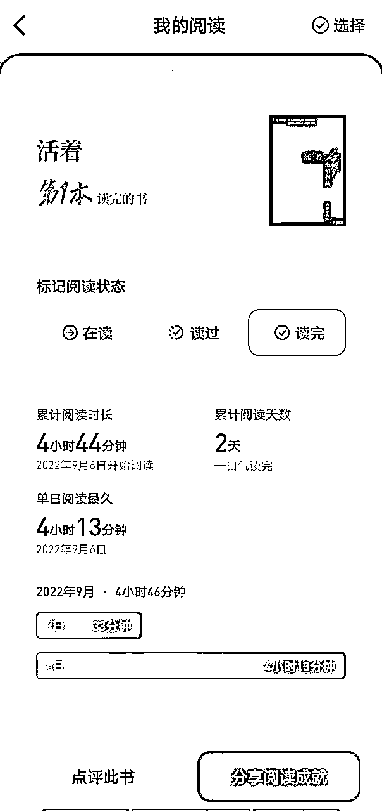

# 007 | 北漂职场妈妈通过读书自救，第一次实现自媒体变现过万

> 来源：[https://t49loc6gg0.feishu.cn/docx/NCc6dBmbroeH1UxnStBcYnTFnre](https://t49loc6gg0.feishu.cn/docx/NCc6dBmbroeH1UxnStBcYnTFnre)

大家好呀，见帖欢喜，我是董董，一个北漂程序员宝妈。自从22年开始读书，不仅自己成长了很多，居然还通过读书第一次变现了1万+。

自从毕业以后，我从来没想过我还会重新拿起书本，可是在有娃以后，我开始自我觉醒，1年时间看书听书70多本，在自我成长这条路上越走越远。

下面就是我与书结缘的故事，希望你们看完也能从中汲取一点力量，当你焦虑迷茫的时候，不妨拿出书本，让我们去书籍里找答案吧。

或许看完某本书的某个段落，你突然就茅塞顿开，不再纠结于之前的种种，开始了自己一片新的天地。

# 读书：自我觉醒意识萌芽

2022年2月为了给自己的淘客引流，我开始学习做小红书，很幸运的是4月底起号，赶上618大促，自己一篇笔记爆了，引流来300多人，第一次感受到流量的魅力，每个月都能给我变现至少3000。

可是只有这一篇数据爆了给我带来了用户，后续再发的笔记就没有啥动静了。当时并不知道做自媒体数据是一个不可控的。因为自己的认知不到位，所以就只想着找人速成，说不定只要找对人就能让自己每天引流2-300，从此我就一夜暴富了？

后来9月份为了学小红书，加入了一个社群，当时我的目的很简单，就是想能从这里学习引流的速成方法。那次是我第3次知识付费，前两次已经付费总和已经过万了。也都是为了学习小红书的运营和引流技巧，发现学到的内容并不能让我快速引流。

我发现第三次的付费，进入的社群，群里的小伙伴好像跟我都不太一样，不像我一样浮躁，我只想着引流变现，不想着提升自己的能力，一味的向外求。

而她们呢，虽然是学小红书，但是他们好像没有那么着急，反而是扎扎实实的想先提升自己。群主也时常说，我们应该有终身成长的心态，有不会的可以去学，写作不会就苦练写作；摄影不会就多加练习拍照；还有就是一定要多读书，这样才能有终身成长的意识。

不过那个时候我其实不懂，我就只想着自己引流那点事，其他的就是左耳进右耳出的那种。可能有点自我觉醒的意识，但还是不多。

我很清楚的记得是9月6号的下午，在家办公刚午休结束，正准备上班摸鱼，想起来群里姐妹们都在看《活着》，我好像也听过这本书，但从来没想着去看。

出于好奇心，我就想着要不我也看看？于是我下载了《微信读书》，那是我第一次下载读书类app，原本我就想着听一小会，觉得不想听了就能直接关了不看了，刚睡醒也没啥事。

结果我听入迷了，太想知道富贵会发生什么，不知不觉就1个下午都用来听《活着》，那天是一个平平无奇的午后，却是我个人成长路上，我与书结缘的一个重要的时间点。

这本书让我一下子不那么焦虑了，我开始跟小红书数据和解，觉得自己过得很幸福。有一份稳定的可以让我在家办公的工作，有一个爱我的老公，有个可爱的闺女。这一切已经很好了。

# 疯狂阅读，开启爆发式成长

自那次听完《活着》，好像给我打开了新世界的大门，我发现内心不再浮躁了。感觉自己在慢慢的变化，开始喜欢上了阅读这件事。就像李笑来老师说的:“人生中的大多数问题，都可以在书中找到答案。”

我开始在书里找到了婚姻，育儿，个人成长上的很多答案。我也有了很多第一次。第一次下载了《帆书》app，第一次买纸质书，第一次晚上睡前不是刷手机而是看书等等。

《帆书》app成为22年最后一个季度打开率最多的app。每天早上起来听一本，晚上哄娃睡觉的时候听书，出门做核酸的时候也在听。无论做什么，只要有点空闲就会找一本书去听。而不是像之前一样，有点时间就打开抖音刷短视频了。听育儿、听个人成长、听婚姻相关的，基本把《帆书》上这3类所有的书都听了一遍，也做了很多笔记，发过很多朋友圈。

读《非暴力沟通》知道跟老公沟通的时候应该多说感受和事实，从而跟他沟通开始变得良好，减少了非必要的争吵。跟老公的关系不再似以前那般紧张，家庭氛围有所缓和。

读完《亲密关系》，我懂得了婚姻其实是一个人的事情，最好的婚姻状态，不是你负责养家，我负责貌美如花，而是我们势均力敌，你很棒我也不差。

开始用微信读书看书，跟同事聚餐的路上别人聊天，我选择一个人自己走，这样我就能多看些内容。还记得当时看的入迷，走路没注意看直接撞到电线杆挺疼的。但是没多顾上疼，想到我刚看到一个精彩的地方，便又读了起来。

我还记得那本书是《心理抚养》。微信读这本书的时候，我一直在不停地发朋友圈安利，我从内心里觉得这本书是我们成为父母必读的一本书，我也开始明白了那句话：育儿最可怕的是不读书的父母，在拼命育儿。

我明白必须尊重孩子，把孩子当做跟我们一样平等的个体去交流，借李玫瑾老师《心理抚养》的一段话，人活在世上，无论是男人还是女人，首先要做一个独立的人，要自信和自尊。

也就是说，你可以爱别人，也可以被人爱，但你就是你，你的价值首先体现在你是能自立的，而不是将自己的一切依附于某个人身上。只有这样，你才能得到别人的尊重。

通过听了很多育儿婚姻相关的书，我就想如果在孕期甚至更早的时候，我要是去读书，开始自我成长，提高我的认知。说不定产后我并不会有一段内耗与自我纠结的阶段。

产后要上班前，我跟杨先生说我们离婚吧，因为我觉得跟他没话说，每天他跟我说话，我就夹枪带炮的挤兑他，我婆婆跟我说话，我有时就假装听不见不搭理她。

我跟他已经聊到了孩子谁来带，我也跟我爸问了要是离婚的话，他们的想法。我爸虽然说了很多，最后说了句如果你想好了确定要离婚，回来我和你妈养你。挺感谢我爸的，他一直是我坚强的后盾。

那个阶段挺难熬的，好在我和杨先生走过来了，如果再来一次我也不愿意去重新走一遍。那段时光整个家庭都笼罩着一层冷漠的气息，没有人敢跟我说话，生怕一句话不对，我立马就跳起来了。

说实话我也不知道当时为什么会这样？可能是刚有娃自己还没胜任好做妈妈这个角色，可能是刚开始跟婆婆相处，很多地方需要磨合；也可能是因为我是远嫁跟着老公北漂，感觉自己是一个外人，如果融入他们家，就感觉“背叛”了我父母（我老公他们一家人很好）。

因为我心里总是有各种疙瘩，总是解不开，所以没办法面对真实的自己，没办法面对他，一直拧巴着。直到我开始读书，2023年一整年我读了70多本，我找到了很多答案。

# 靠读书实现第一次自媒体变现过万

稻盛和夫说：“唯有读书和赚钱，才是一个人最好的修行，前者使人不惑，后者使人不屈。”

我一直跟杨先生说2023年是我成长路上最重要的一年，这一年我打开了认知，学到了很多，收获了很多。我换了一个高能量的圈子，看到很多人都在写作，读书，做自媒体，打造个人IP。

他们从不内耗，他们会查漏补缺，看到自己不足的就去补充，也都很懂礼貌。

有时我给别人解答一个很简单的问题人家就知道尊重我，尊重我的时间，给我发红包。还会主动跟我付费，跟我这买写作课，买小红书课程等等。

让我变得自信了很多，让我相信自己是值得的。我也开始敢于收费。

2023年向上链接了很多人也链接了很多好的圈子，生财有术这个圈子是我入的搞钱最好的圈子，让我打开了很多搞钱的认知。

除了好的圈子，还认识了很多贵人，靠谱老师，理白老师，芷蓝老师，粥老师等等。其中最重要的一个人就是：粥老师。

这是源于我在去年6月份微信读书看他的《学会写作》，通过这本书，我认识了粥老师。

顺藤摸瓜加了他微信公众号，看到他的一篇关于写作社群的推文，当时就加入了，正好把写作社群作为自己30岁的生日礼物。

加入粥老师的写作星球后，我开始了日更写作，从去年7月份我从一个写2-300字的朋友圈文案都要憋30分钟的，到今年2月份发售自己的社群机器人，写出5-6000字营销类的分享稿。

从一个说话没有逻辑，跟杨先生聊天经常被绕进去，只能让自己气急败坏。到后面讨论的时候能迅速指出他偷换观点，到现在讨论完可以跟他达成一致，这都是源于写作。

而我能接触到写作都是因为读了粥老师的《学会写作》这本书，让我意识到写作是一个人必备的社会技能。

所以在去年8月份粥老师出了顶峰会这个产品的时候，十年会员，可以学习粥老师的所有的课程。虽然是1万元，但是我二话不说直接盲订了，我觉得能跟一个这么优秀的老师绑定10年，简直不要太赚。

9月10号正式开售的时候，我还影响了4个姐妹加入，那是我第一次带万元左右的知识付费产品，通过分销佣金就月入5位数了。

果不其然今年他又推出了读书会这个产品，1年精读10本书，他亲自带着我们读书，带着我们成长。我觉得今年我会比2023年的我更有提升。

心理学家卡罗尔·德韦克在《终身成长》中说：“决定人与人之间差异的，不是天赋，而是思维模式。”

搞钱先搞脑，在生活中，一个人的思维模式，往往决定了他的人生高度。

而提升一个人思维方式最好的方法就是读书，读书能让我们补齐认知。

就像董宇辉说的：渴望知识，渴望学习，是人深藏在基因里的东西。读书就像渴了要喝水，饿了要吃饭，困了要睡觉，痛苦了迷茫了伤心了，都可以去看书。

书不一定能回答你的问题，但书能让你不纠结这些问题。

如果你此刻跟我当年一样，焦虑内耗迷茫，所以不妨一起读书吧，我相信在读书的过程中你也能找到你想要的答案。

也因为加入粥老师的顶峰会，后来认识了靠谱老师，通过靠谱老师加入了生财有术。

感谢靠谱老师领我进「生财有术」，在这里学到了很多东西，打开了眼界，希望跟大家一起生财有术。

如果有想知道读的书单，欢迎来找我聊细节，让我们一起生财有术。