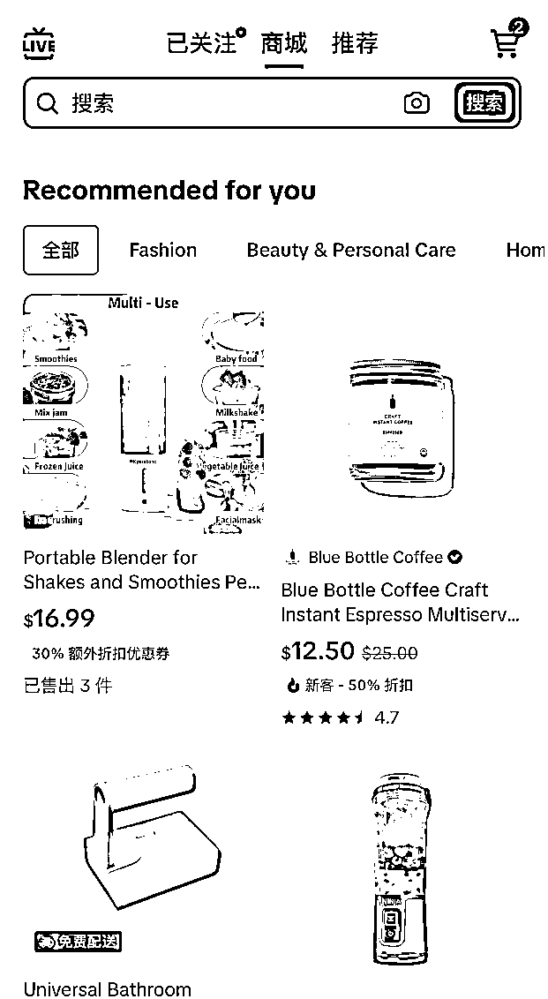
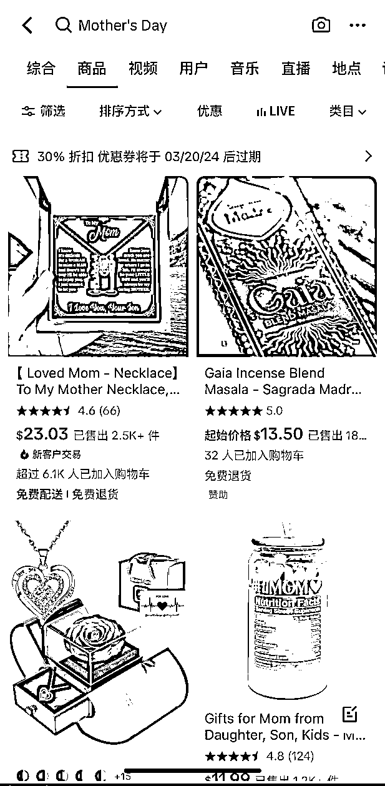
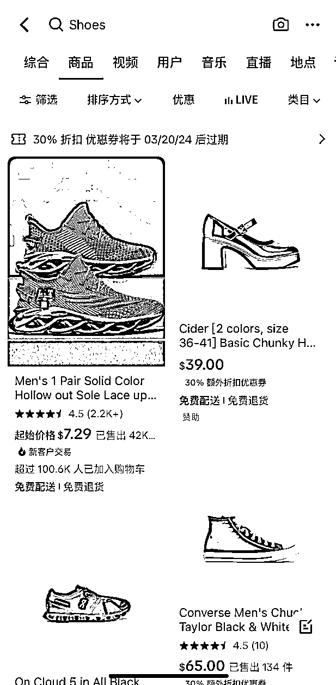
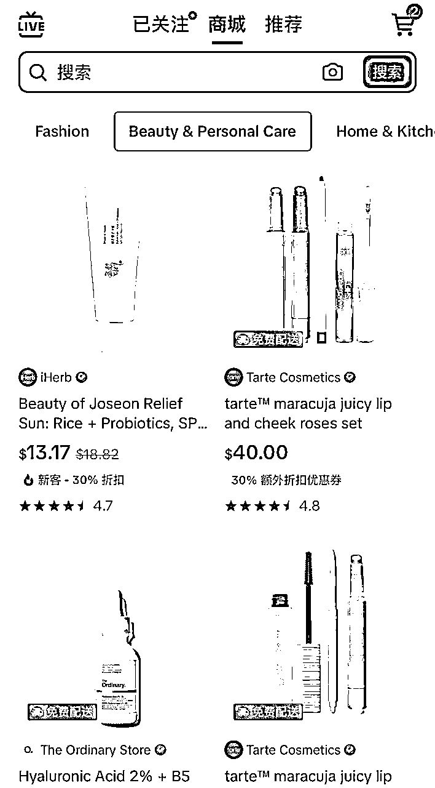

# TikTok美区上线PSA（产品购物广告）

> 来源：[https://za6kyadmdr.feishu.cn/docx/NLQEd6wQ7o4jSGxlO6jcNyhLn5g](https://za6kyadmdr.feishu.cn/docx/NLQEd6wQ7o4jSGxlO6jcNyhLn5g)

同步平台的最新消息，美国tiktok Shop 的PSA 即将上线

TikTok的产品购物广告（Product Shopping Ads, 简称PSA）是在TikTok购物商城中展示商品获得曝光的TikTok Shop广告。这一广告功能在印度尼西亚、马来西亚、菲律宾、新加坡、泰国和越南等多个国家提供，允许TikTok用户通过TikTok购物中心内的推荐和搜索发现产品。

PSA(Product Shopping Ads)商品购物广告，是在TikTok购物商城中展示商品获得曝光的TikTok Shop广告，是继LSA/VSA之后全新的电商广告产品，目前支持从SelerCenter及TTAM广告平台创建.

PSA广告可以动态地投放至购物商城中的Recommerations and Search(推荐和搜索)以及TikTok综合搜索区域，便捷展示商品详情，同时，广告将自动提取所推广商品的商品详情页(PDP)信息生成商品围片和商品详情，用户点击广告后会进人相应的 PDP转化。广告展示了直接从被广告产品的产品详情页（Product Details Page, 简称PDP）中获取的产品图片和信息。点击这些广告后，用户将被引导至相应的PDP，以便可能进行购买。

以下是使用TikTok产品购物广告的流程和优势概述：

创建和管理：广告商可以通过TikTok的卖家中心创建和管理这些广告，从广告创建到优化的过程得到简化。

特点和优势：PSA为广告商在购物中心和搜索中的广告可见性提供了控制，利用产品图片和信息而无需额外的内容创建。此外，平台使用动态产品优化和机器学习来提高广告表现、定位和转化，最终优化广告支出回报（ROAS）。

使用步骤：要使用PSA，卖家必须在卖家中心内管理其广告账户，包括充值账户余额和创建活动。广告商有选择产品（全部产品或选定产品）和与其广告目标一致的出价策略选项。（现阶段需要联系直客经理开通，私信皮皮建联）

流量入口1:进入TikTok综合搜索页面，搜索关键词，会出现带有广告角标的商品页卡推荐，点击广告进入到商品PDP(日前US地区该流量还在实验中。未开放)

流量入口2:

进入TikTok-Shop CenterTab购物商城推荐页面，用户会刷到带有广告角标的商品页卡推荐，点击广告进入到商品PDP

流量入口3:

进入TikTok-Search CenterTab购物商城搜索页面，搜索关键词时会出现带有广告角标的商品页卡推荐，点击广告进入到商品PDP

PSA 上线的几个优势

（1）流量池刚开始，竞争相对较小

商城推荐+搜索流量带来新流量池，商城用户已具备一定程度购买意向和转化可能，人群优势凸显，基于智能推荐,广告创意自动生成，为每个用户推荐符合喜好与习惯的商品.

（2）人局门槛低，投放简易快捷

仅需确认推广商品-投放时间及预算设定出价方式3步，即可在TTAM对TikTok Shop中的任一或全部商品进行投流，获得曝光，无需广告主单独提供节省人力提高效率。创意

（3）发挥效果优势，新增TTAM创编

Beta测试中。PSA ROAS达成率超过80%的广告占比>75%，能有效实现广告告主营销目标，支持多种优化目标及定向方式，助力实现更多维度效果优化.

适合广告主

商域精细运营需求:在TkTok商城有搜索数据累积、有历史销量，希望继续探索商城流量变现:

初步流量/选品测试需求:首次投放ShopAds，快速人门测试商品+流量;

创意定向自动化需求:没有能力或无意向自主进行创意定向优化，用PSA广告直接生成商品素材投放更简单;

拓展优势品类需求:已在LSA或VSA上取得了较好转化，助力生意规模进一步提升。

推荐机制

PSA将根据商品的eCPM，向用户推荐商品

影响eCPM排序因素:

"用户购买意向及与产品相关性·用户历史行为(查看点击购买加到购物车等)

·广告组出价、预算商品标题PDP的CTR，CVR等

广告丰可以对商品列表进行优化(结合市场热点，购买趋势等)，对商品关键词调整(把相关搜索热同添加至商品标题)、增加更多种商品积累数据、针对效果好的Campaign提升预算等，均有利于提高PSA量级和表现:

投放建议

可以选择测试 50美元/天的Minimum ROAS出价，或设置CPP(平均每个付费转化单价)的20-50倍预算进行测试:

建议设置至少一个Campaign，选择All products+MinimumROAS，充分利用机器学习及智能推荐引擎能力:

同时也可以选择添加额外的Specifc Product Campaign，单独推广某些产品，如畅销产品、爆量产品、促销产品等，配合进行投放:

当预算使用率大于80%且效果今人满意时可增加预算，但增加预算后，ROAS可能会略有下降，而后才会逐步恢复

一句话总结，也就是现在TikTok美国可以投放商品卡了，投放门槛更低

目前提报可通过对接直客经理进行，联系皮皮进行对接

需要进行Tik Tok广告开户联系皮皮建联下户

建联：17684058749