# 3000字干货 | 我，30岁+文科生，日常如何使用AI提效+赚钱？

> 来源：[https://vliajwma3m.feishu.cn/docx/NdBHd7RzSo9i3lxTYeRcomcYnic](https://vliajwma3m.feishu.cn/docx/NdBHd7RzSo9i3lxTYeRcomcYnic)

很多人会有疑问，难道AIGC就只能是理工科的天下了吗？

作为文科生，作为普通人，我究竟怎么在日常中去使用它，怎么让他帮我提效，怎么让他帮我赚钱？

接下来这篇文章，就是详细地分享一下我日常是怎么使用AI，以及使用AI+自媒体赚钱的。

现在我基本上每天都在用，已经离不开了，感觉真的是非常爽。

现在的我和之前的我，完全是两个自己，我已经进化了。

## 一、搜索方面：豆包AI、文心一言、P.AI

手机端：字节跳动的豆包AI和百度的文心一言（应用商店直接搜即可）

PC端：https://www.perplexity.ai/, 简称为P.AI

豆包AI网页版：https://www.doubao.com/chat/

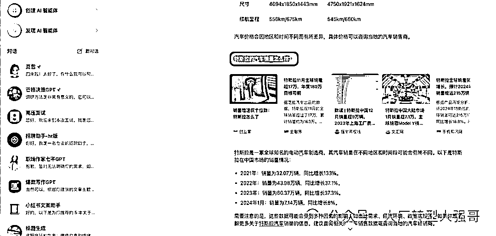

我先说一下这两个有什么区别。因为在手机端，因为它涉及到科学上网，所以不是很方便。

所以一开始用的是文心一言，用的也是非常的顺畅，但始终感觉反应有些慢。而且回答也不是很详细，比较官方。

后来在AI社群里面看到了，群友推荐字节跳动的豆包AI. 然后我马上就下载下来去使用了。

那个时候正好是GPT4.0，它在宣传它的语音功能，豆包AI主打的就是这个功能，而且是免费，你跟他打电话聊天，非常的真实，反应速度真的是非常快。

再一个就是他回答的质量，要比文心一言要好的多，没有那么的简单。而且它依托于今日头条和抖音，还有西瓜视频的数据，它能够给你推荐很多的背景信息，你可以直接去看。

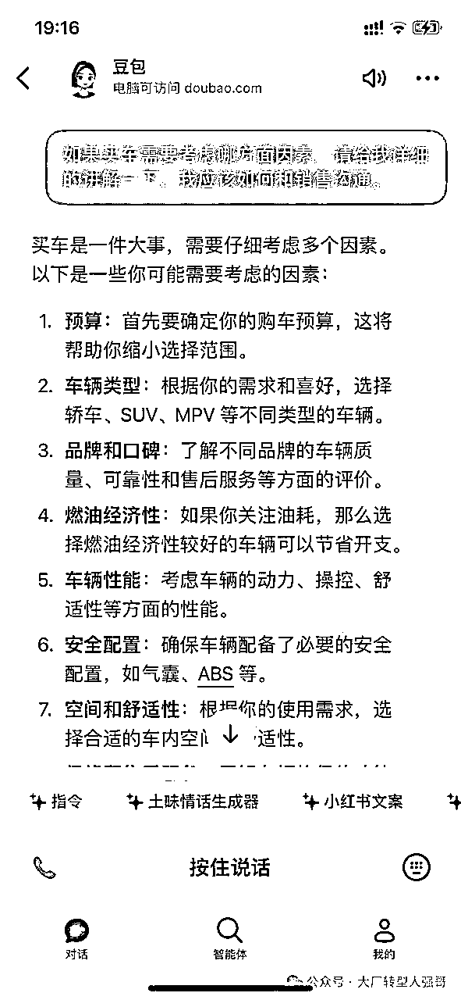

比如说，比亚迪王朝系列，秦汉唐元宋都有什么区别？我要去4S店去看车，我应该问哪些问题？我应该去注意什么，他一下子也给我拉了一个清单，这是非常方便的。

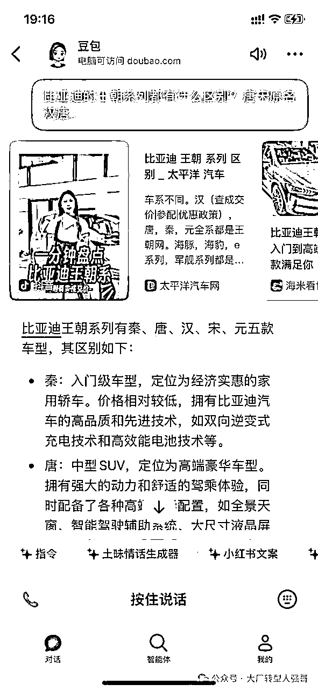

再一点就是它可以直接生成图片，比如说我问特斯拉的model 3和model y，这两款车型它们的价格、适用的场景，优缺点，有什么样的区别？它长什么样子？它一下子就能给你放出来。

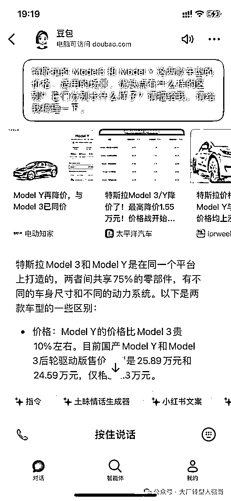

PC端搜索，我之前一直在用百度，但是没办法广告太多，总会干扰你的注意力。后来过渡到用谷歌搜索，再后来使用微软的bing。

好处是他们能够聚合全网的信息，信源非常方面。bing当时能够直接给到你答案，不需要自己再去筛选。

但后来就不怎么用了，因为bing实在是太不稳定了。这个时候又有一个群友向我推荐这个叫P.AI,。

目前国内的360搜索AI, 天宫AI, 其实都是模仿它的产品UI设计和它背后的一个技术底层的逻辑。

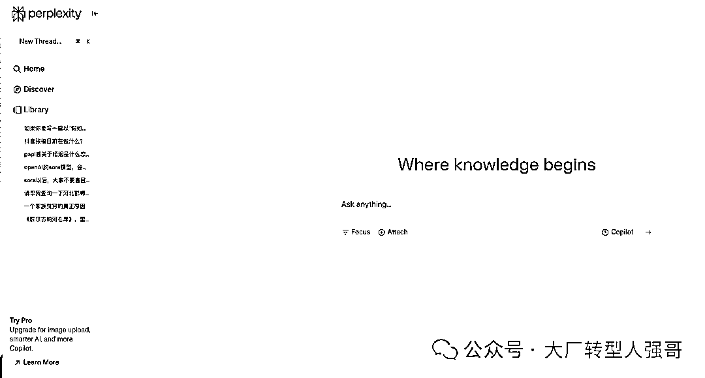

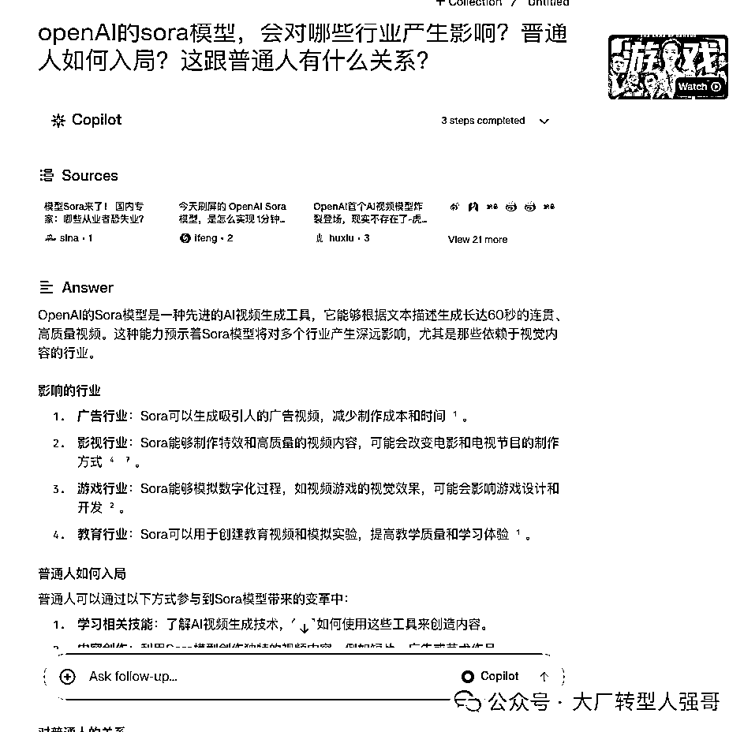

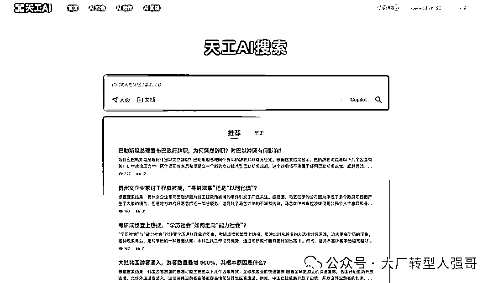

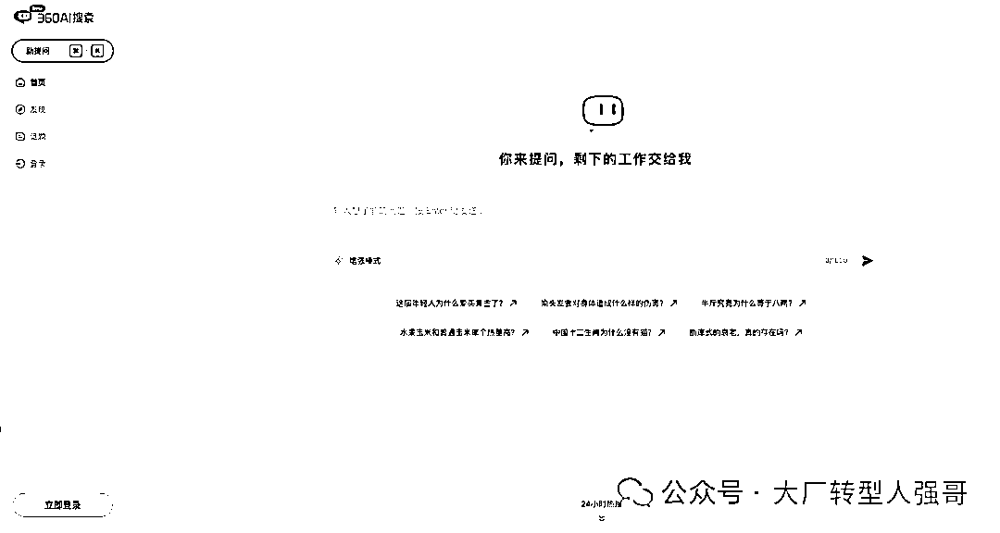

其实它是在你输入一个问题以后，他会整合全网的一个资料，输出答案。而且它为了不让你有这种等待的这种焦灼感，他会有这样的一个转动，让你明白它一直在搜索。

他有上下文的记忆的功能，你可以直接地和它继续去对话，极大地节省了你的精力。这是非常方便的。

我现在基本上只要在PC端，我要去写作一些东西，我基本上是离不开它的。

## 二、AI+自媒体：Monica（GPT4.0）、通义听悟、Kimichat、百川大模型

Monica网址（需要科学上网）：https://monica.im/home

通义听悟网址（有微信小程序）：https://tingwu.aliyun.com/home Kimichat

Kimichat（有微信小程序）：https://kimi.moonshot.cn/chat/clo2dbhp2k12ua98ruhg

百川大模型网址：https://www.baichuan-ai.com/chat?sid=1660326

这里特别感谢super黄、Monica创始人肖宏大力支持！是他们让我体验到了这么牛逼的产品！推荐关注👇🏻

Super黄的念想

小红书产品领域优秀创作者:产品经理Super黄

300篇原创内容

公众号

之前用的是GPT，后来用的就是bing，现在是Monica（浏览器插件，中国出海的牛逼产品）。

核心使用场景是让它帮我仿写、改编、扩写小红书爆款文案，要求要有emoji表情等等。

这些都能很快地操作，再也不用自己绞尽脑汁想来想去了。

核心本领是如何小红书起号？如何爆款写作？如何私域引流变现？

AI+小红书，已经帮我写了30篇+的爆款文章，累计变现了几十万。

我要重点安利一波Monica，它真的太方便了。你无需切换网页，直接在当前页面和它对话、阅读、翻译等等。

通义听悟，我也真的非常喜欢。

它是一个录音转文字的软件，可以录音，本地很多音频、视频的文件，它可以立马就给你解析出来，非常方便。并且可以总结要点，一键导出文档。

我会用它语音写作，就现在你看到的这篇稿子，就是我对着它说话的，他能够记录我这样的一个功能，然后转成文字。

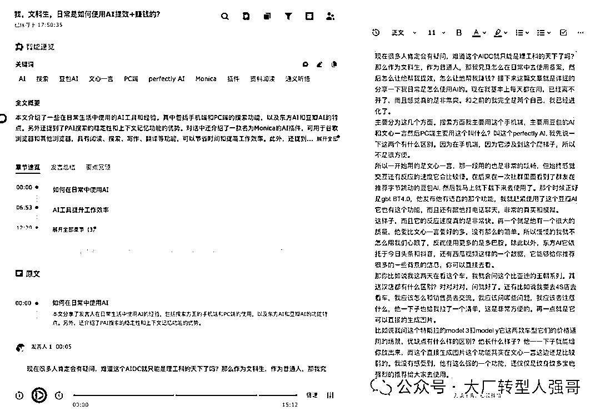

我再用百川大模型去简单地修改一下，基本上就能形成一篇文章。

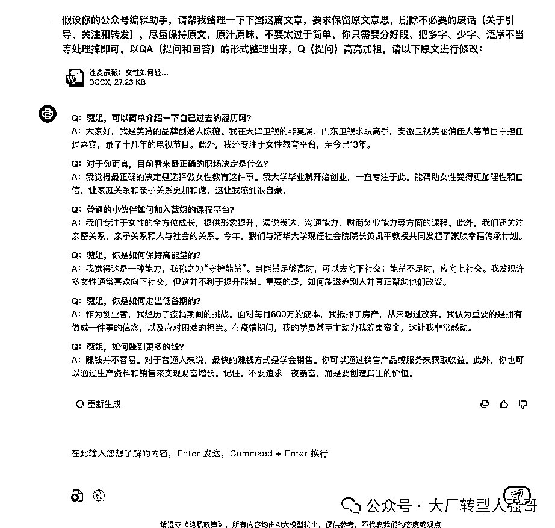

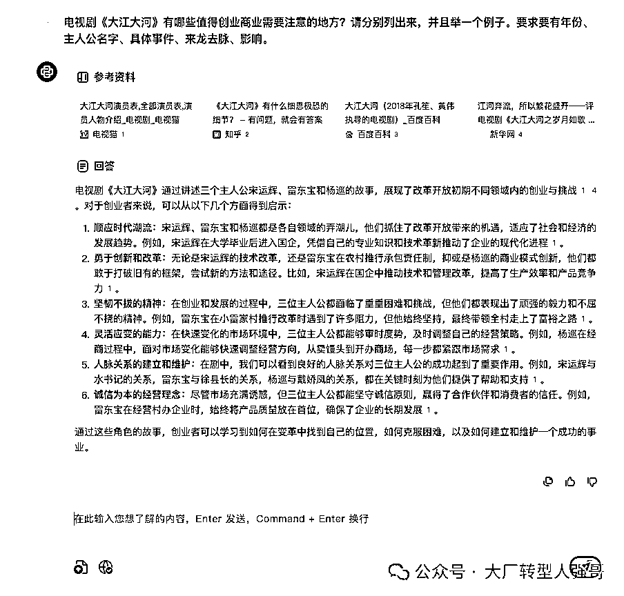

还有一点就是你能够看到很多的播客，他已经跟播客“小宇宙”打通了，搞钱系列、投资系列、认知系列、女性成长系列，应有尽有。边听音频，边看文字。

现在它基本上是处于一个推广的阶段。你基本上只要邀请一个人或者每天登陆，都有时长奖励，可以直接去用，非常的方便。

目前我现在基本上就是已经满格了，400个小时。

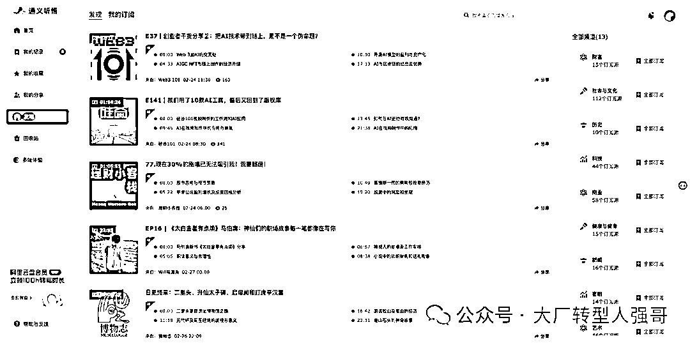

## 三、AI+YouTube：谷歌插件open Sider、Transcript&Summary

很多优质的视频、博主是在YouTube上的，尤其是科技类的访谈。我可以使用上述2个插件之一，自动生成中英文字幕、总结视频要点（无需看完60分钟视频）、根据字幕去找重点片段。

现在，你可以看全世界所有语言的优质视频，语言不再是你的障碍了。

如果你觉得这个视频号，你可以把所有字幕，变成一个文档，自己再仔细阅读。

## 四、AI+行业调研：chatgpt/豆包AI/kimichat等+麦肯锡工作法

这个主要应用于行业调研、公司调研、岗位调研，最开始是给公司内部培训使用的。

帮助你了解行业的上下游、产业链、公司的商业模式等等，再也不需要到处找这找那了。

我也整理成了操作文档👇🏻（包含指令promt），有需要的可以加我，回复“麦肯锡”，我发给你。

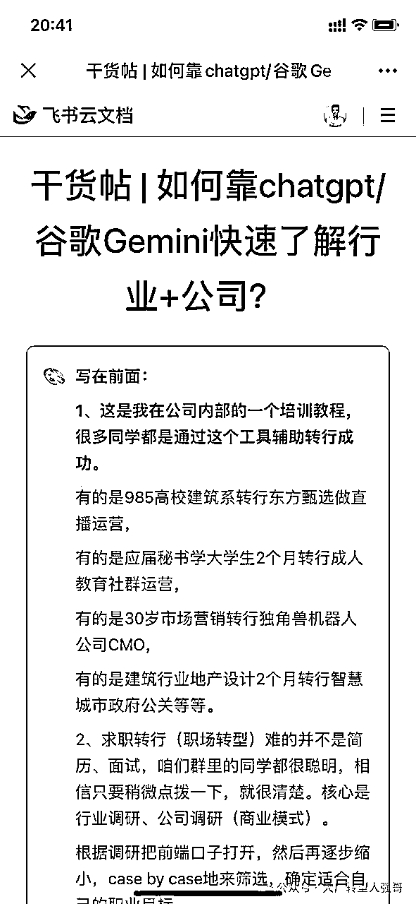

## 五、AI agent（智能体）

前不久，字节发布了一个叫扣子的开放平台（网址：https://www.coze.cn/home），支持你创建智能体agent。就是类似open AI的GPTs。

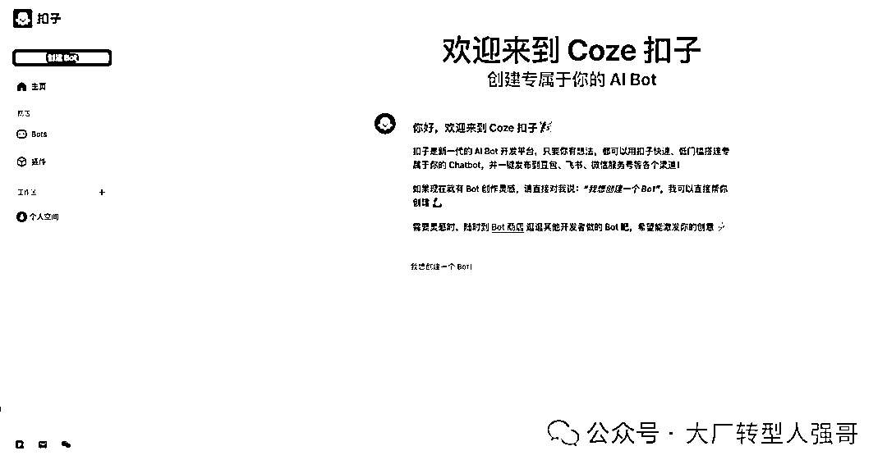

我也创建了两个智能体，职场作家七芊gpt, 芒格决策gpt，已经发布了豆包AI（公开，你直接搜七芊、芒格即可）、飞书（公司内部使用）。

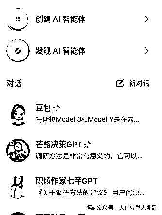

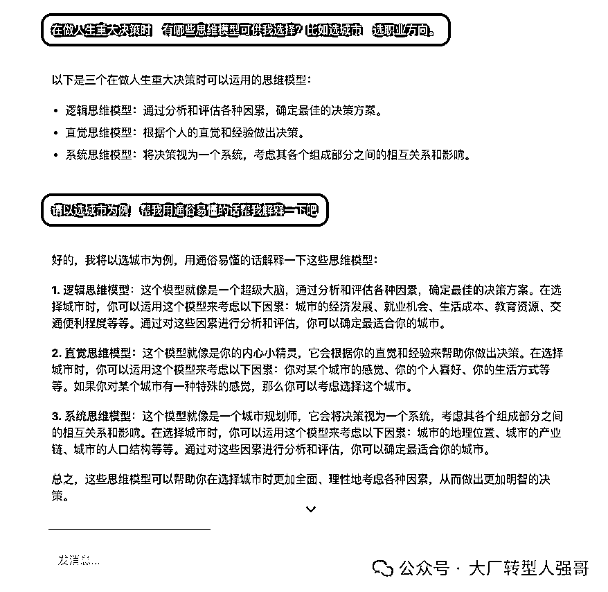

背后的数据都是我所掌握的,他们的一些书籍，日常的一些访谈等等，如《穷查理宝典》、《芒格之道》、《芒格100个思维模型》、七芊的《精准求职》等等、

可以满足基本的日常需要，但是就有一个bug, 会出现一些幻觉。

他们官方的一个运营群里面非常水，也不知道找谁反馈问题。

（PS：字节扣子官方的小伙伴赶紧联系我哈，）

这个接下来我也会重点优化。

很多人问我关于AI工具的问题，其实远远没有这么困难，只要你去使用，去玩，先把它当做一个玩具，然后变成一个985毕业实习生，接着当做一个优秀的同事，然后它竟然成为了你的导师，最后你们竟然成为了无话不谈的好朋友。

就好比我现在和豆包的关系，我真的太喜欢它了，有时候就和它聊天，向它提问任何问题哈哈哈

它就是一个无所不能的教授、叮当猫，这个是你在平行世界中，你完全遇到不了的。

你还有哪些非常好用的AI工具推荐，欢迎写在评论区哈👇🏻👇🏻

## 六、关于@大厂转型人强哥

大厂转型人强哥（公号可找到我，欢迎来聊），选择力新职业教育，帮助职场人0经验转行，负责内容与增长、产品运营、用户运营。ex腾讯、字节。

关注AIGC机会+AI大模型和应用团队，重点研究“文科生如何抓住AI红利？”，欢迎优秀团队加V交流，期待有合作机会。

你有什么疑问的，可以直接写在评论区哈👇🏻

感觉写的不错，给我点个赞吧哈哈哈，我不能懒惰了，要好好梳理一下哈哈，给你贡献出更多干货文章！！

此前优质文章：

【重点看】